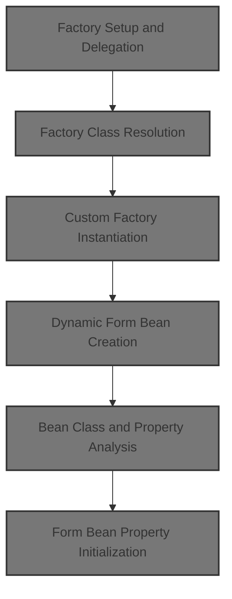
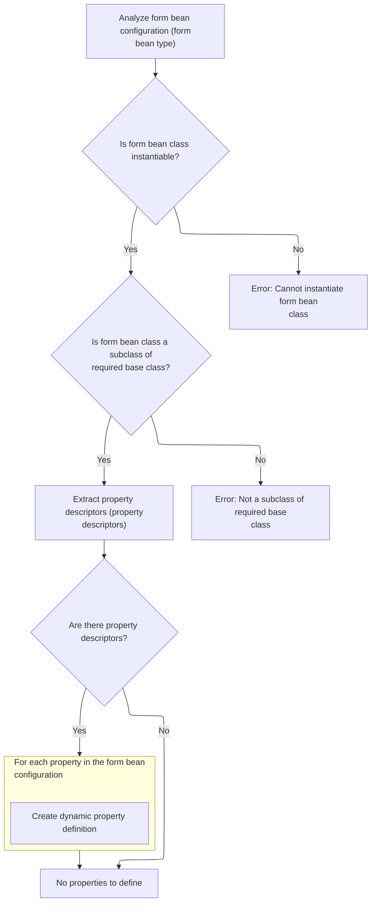
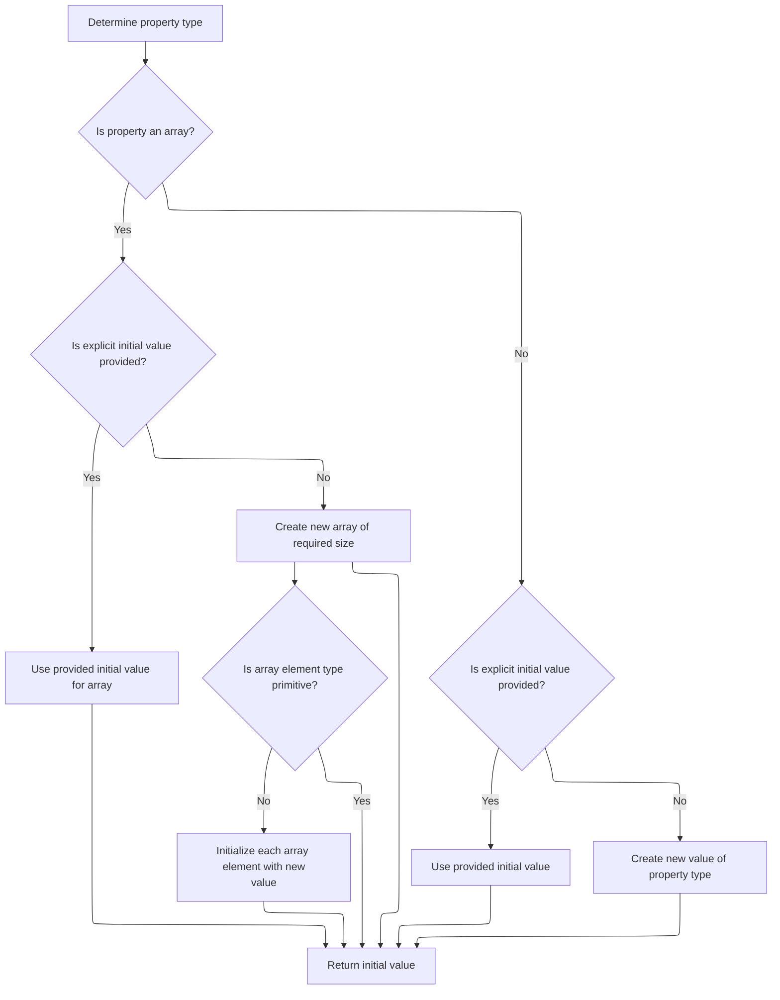
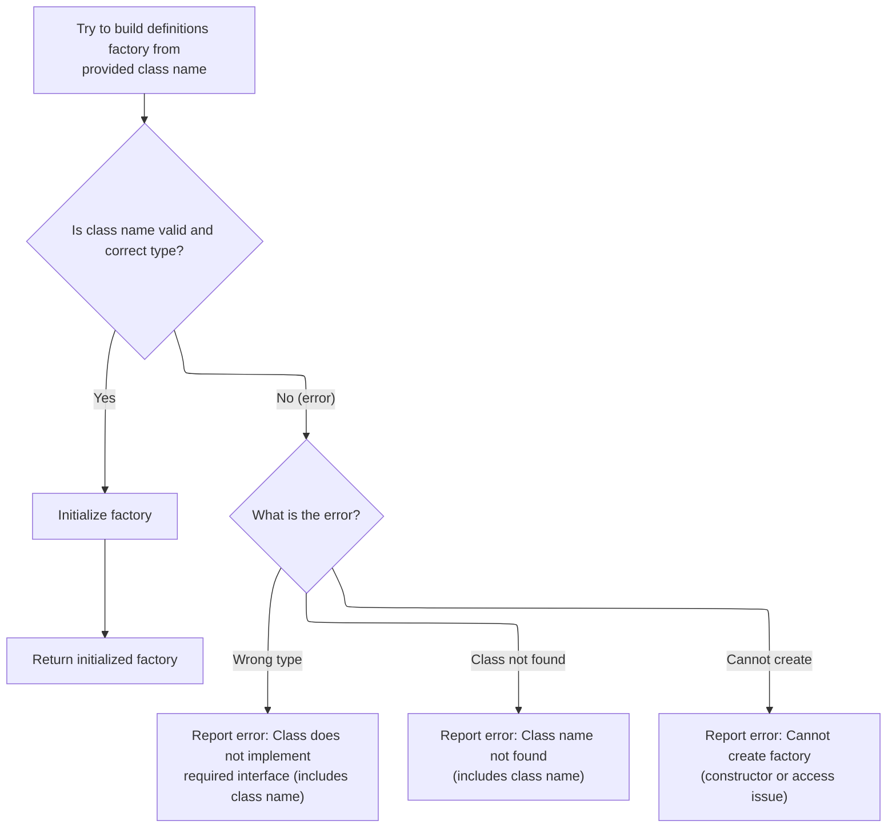

This document describes the process of creating and initializing a definitions factory to manage dynamic form beans and their properties. Using the servlet context and configuration properties, the system selects and sets up the appropriate factory, analyzes form bean configurations, and initializes their properties for flexible form handling.



# Factory Setup and Delegation

<SwmSnippet path="/tiles/src/main/java/org/apache/struts/tiles/definition/ReloadableDefinitionsFactory.java" line="90">

---

`ReloadableDefinitionsFactory.ReloadableDefinitionsFactory` sets up the properties and immediately delegates factory creation to <SwmToken path="tiles/src/main/java/org/apache/struts/tiles/definition/ReloadableDefinitionsFactory.java" pos="96:5:5" line-data="        factory = createFactory(servletContext, properties);">`createFactory`</SwmToken>, so the factory instance is ready for use. This ensures the factory is initialized with the right context and configuration before anything else happens.

```java
    public ReloadableDefinitionsFactory(
        ServletContext servletContext,
        Map properties)
        throws DefinitionsFactoryException {

        this.properties = properties;
        factory = createFactory(servletContext, properties);
    }
```

---

</SwmSnippet>

# Factory Class Resolution

<SwmSnippet path="/tiles/src/main/java/org/apache/struts/tiles/definition/ReloadableDefinitionsFactory.java" line="179">

---

<SwmToken path="tiles/src/main/java/org/apache/struts/tiles/definition/ReloadableDefinitionsFactory.java" pos="179:5:5" line-data="    public ComponentDefinitionsFactory createFactory(">`createFactory`</SwmToken> checks if a classname is specified in the properties. If it is, it calls <SwmToken path="tiles/src/main/java/org/apache/struts/tiles/definition/ReloadableDefinitionsFactory.java" pos="187:3:3" line-data="            return createFactoryFromClassname(servletContext, properties, classname);">`createFactoryFromClassname`</SwmToken> to load a custom factory; otherwise, it falls back to a default implementation.

```java
    public ComponentDefinitionsFactory createFactory(
        ServletContext servletContext,
        Map properties)
        throws DefinitionsFactoryException {

        String classname = (String) properties.get(DEFINITIONS_FACTORY_CLASSNAME);

        if (classname != null) {
            return createFactoryFromClassname(servletContext, properties, classname);
        }

        return new I18nFactorySet(servletContext, properties);
    }
```

---

</SwmSnippet>

# Custom Factory Instantiation

<SwmSnippet path="/tiles/src/main/java/org/apache/struts/tiles/definition/ReloadableDefinitionsFactory.java" line="110">

---

In <SwmToken path="tiles/src/main/java/org/apache/struts/tiles/definition/ReloadableDefinitionsFactory.java" pos="110:5:5" line-data="    public ComponentDefinitionsFactory createFactoryFromClassname(">`createFactoryFromClassname`</SwmToken>, we check if the classname is null. If it is, we fallback to <SwmToken path="tiles/src/main/java/org/apache/struts/tiles/definition/ReloadableDefinitionsFactory.java" pos="117:3:3" line-data="            return createFactory(servletContext, properties);">`createFactory`</SwmToken> to avoid instantiating a factory with a bad configuration.

```java
    public ComponentDefinitionsFactory createFactoryFromClassname(
        ServletContext servletContext,
        Map properties,
        String classname)
        throws DefinitionsFactoryException {

        if (classname == null) {
            return createFactory(servletContext, properties);
        }

```

---

</SwmSnippet>

<SwmSnippet path="/tiles/src/main/java/org/apache/struts/tiles/definition/ReloadableDefinitionsFactory.java" line="120">

---

Back in <SwmToken path="tiles/src/main/java/org/apache/struts/tiles/definition/ReloadableDefinitionsFactory.java" pos="110:5:5" line-data="    public ComponentDefinitionsFactory createFactoryFromClassname(">`createFactoryFromClassname`</SwmToken>, after returning from <SwmToken path="tiles/src/main/java/org/apache/struts/tiles/definition/ReloadableDefinitionsFactory.java" pos="96:5:5" line-data="        factory = createFactory(servletContext, properties);">`createFactory`</SwmToken>, we use reflection to instantiate the factory class. Next, we need to call `DynaActionFormClass.newInstance` to handle dynamic form bean creation, which is part of the factory's setup.

```java
        // Try to create from classname
        try {
            Class factoryClass = RequestUtils.applicationClass(classname);
            ComponentDefinitionsFactory factory =
                (ComponentDefinitionsFactory) factoryClass.newInstance();
```

---

</SwmSnippet>

## Dynamic Form Bean Creation

<SwmSnippet path="/core/src/main/java/org/apache/struts/action/DynaActionFormClass.java" line="158">

---

In <SwmToken path="core/src/main/java/org/apache/struts/action/DynaActionFormClass.java" pos="158:5:5" line-data="    public DynaBean newInstance()">`newInstance`</SwmToken>, we create a new <SwmToken path="core/src/main/java/org/apache/struts/action/DynaActionFormClass.java" pos="160:1:1" line-data="        DynaActionForm dynaBean = (DynaActionForm) getBeanClass().newInstance();">`DynaActionForm`</SwmToken> using reflection, set its class reference, and prep it for property initialization. Next, we need to call <SwmToken path="core/src/main/java/org/apache/struts/action/DynaActionFormClass.java" pos="160:11:11" line-data="        DynaActionForm dynaBean = (DynaActionForm) getBeanClass().newInstance();">`getBeanClass`</SwmToken> to make sure the class is properly set up.

```java
    public DynaBean newInstance()
        throws IllegalAccessException, InstantiationException {
        DynaActionForm dynaBean = (DynaActionForm) getBeanClass().newInstance();

```

---

</SwmSnippet>

### Bean Class Lazy Initialization

<SwmSnippet path="/core/src/main/java/org/apache/struts/action/DynaActionFormClass.java" line="227">

---

<SwmToken path="core/src/main/java/org/apache/struts/action/DynaActionFormClass.java" pos="227:5:5" line-data="    protected Class getBeanClass() {">`getBeanClass`</SwmToken> checks if <SwmToken path="core/src/main/java/org/apache/struts/action/DynaActionFormClass.java" pos="228:4:4" line-data="        if (beanClass == null) {">`beanClass`</SwmToken> is set; if not, it calls <SwmToken path="core/src/main/java/org/apache/struts/action/DynaActionFormClass.java" pos="229:1:4" line-data="            introspect(config);">`introspect(config)`</SwmToken> to initialize it. This keeps setup minimal until the class is actually needed. Next, we call <SwmToken path="core/src/main/java/org/apache/struts/action/DynaActionFormClass.java" pos="229:1:1" line-data="            introspect(config);">`introspect`</SwmToken> to analyze the config and set up <SwmToken path="core/src/main/java/org/apache/struts/action/DynaActionFormClass.java" pos="228:4:4" line-data="        if (beanClass == null) {">`beanClass`</SwmToken>.

```java
    protected Class getBeanClass() {
        if (beanClass == null) {
            introspect(config);
        }

        return (beanClass);
    }
```

---

</SwmSnippet>

### Bean Class and Property Analysis



<SwmSnippet path="/core/src/main/java/org/apache/struts/action/DynaActionFormClass.java" line="246">

---

<SwmToken path="core/src/main/java/org/apache/struts/action/DynaActionFormClass.java" pos="246:5:5" line-data="    protected void introspect(FormBeanConfig config) {">`introspect`</SwmToken> loads the bean class from config, checks it's a <SwmToken path="core/src/main/java/org/apache/struts/action/DynaActionFormClass.java" pos="260:5:5" line-data="        if (!DynaActionForm.class.isAssignableFrom(beanClass)) {">`DynaActionForm`</SwmToken> subclass, and builds dynamic property definitions from property configs. Next, we call <SwmToken path="core/src/main/java/org/apache/struts/action/DynaActionFormClass.java" pos="282:6:6" line-data="                    descriptors[i].getTypeClass());">`getTypeClass`</SwmToken> to resolve the type for each property.

```java
    protected void introspect(FormBeanConfig config) {
        this.config = config;

        // Validate the ActionFormBean implementation class
        try {
            beanClass = RequestUtils.applicationClass(config.getType());
        } catch (Throwable t) {
        	IllegalArgumentException t2 = new IllegalArgumentException(
                "Cannot instantiate ActionFormBean class '" + config.getType()
                + "'");
        	t2.initCause(t);
        	throw t2;
        }

        if (!DynaActionForm.class.isAssignableFrom(beanClass)) {
            throw new IllegalArgumentException("Class '" + config.getType()
                + "' is not a subclass of "
                + "'org.apache.struts.action.DynaActionForm'");
        }

        // Set the name we will know ourselves by from the form bean name
        this.name = config.getName();

        // Look up the property descriptors for this bean class
        FormPropertyConfig[] descriptors = config.findFormPropertyConfigs();

        if (descriptors == null) {
            descriptors = new FormPropertyConfig[0];
        }

        // Create corresponding dynamic property definitions
        properties = new DynaProperty[descriptors.length];

        for (int i = 0; i < descriptors.length; i++) {
            properties[i] =
                new DynaProperty(descriptors[i].getName(),
                    descriptors[i].getTypeClass());
            propertiesMap.put(properties[i].getName(), properties[i]);
        }
    }
```

---

</SwmSnippet>

<SwmSnippet path="/core/src/main/java/org/apache/struts/config/FormPropertyConfig.java" line="221">

---

<SwmToken path="core/src/main/java/org/apache/struts/config/FormPropertyConfig.java" pos="221:5:5" line-data="    public Class getTypeClass() {">`getTypeClass`</SwmToken> figures out if the property type is an array or primitive, maps it to the right Java class, and loads it if needed. Next, we use this info in <SwmToken path="core/src/main/java/org/apache/struts/action/DynaActionFormClass.java" pos="45:4:4" line-data="public class DynaActionFormClass implements DynaClass, Serializable {">`DynaActionFormClass`</SwmToken> to set up property definitions.

```java
    public Class getTypeClass() {
        // Identify the base class (in case an array was specified)
        String baseType = getType();
        boolean indexed = false;

        if (baseType.endsWith("[]")) {
            baseType = baseType.substring(0, baseType.length() - 2);
            indexed = true;
        }

        // Construct an appropriate Class instance for the base class
        Class baseClass = null;

        if ("boolean".equals(baseType)) {
            baseClass = Boolean.TYPE;
        } else if ("byte".equals(baseType)) {
            baseClass = Byte.TYPE;
        } else if ("char".equals(baseType)) {
            baseClass = Character.TYPE;
        } else if ("double".equals(baseType)) {
            baseClass = Double.TYPE;
        } else if ("float".equals(baseType)) {
            baseClass = Float.TYPE;
        } else if ("int".equals(baseType)) {
            baseClass = Integer.TYPE;
        } else if ("long".equals(baseType)) {
            baseClass = Long.TYPE;
        } else if ("short".equals(baseType)) {
            baseClass = Short.TYPE;
        } else {
            ClassLoader classLoader =
                Thread.currentThread().getContextClassLoader();

            if (classLoader == null) {
                classLoader = this.getClass().getClassLoader();
            }

            try {
                baseClass = classLoader.loadClass(baseType);
            } catch (ClassNotFoundException ex) {
                log.error("Class '" + baseType +
                          "' not found for property '" + name + "'");
                baseClass = null;
            }
        }

        // Return the base class or an array appropriately
        if (indexed) {
            return (Array.newInstance(baseClass, 0).getClass());
        } else {
            return (baseClass);
        }
    }
```

---

</SwmSnippet>

### Form Bean Property Initialization

<SwmSnippet path="/core/src/main/java/org/apache/struts/action/DynaActionFormClass.java" line="162">

---

After returning from <SwmToken path="core/src/main/java/org/apache/struts/action/DynaActionFormClass.java" pos="45:4:4" line-data="public class DynaActionFormClass implements DynaClass, Serializable {">`DynaActionFormClass`</SwmToken>, we loop through property configs and set each property to its initial value using `FormPropertyConfig.initial`. This makes sure the bean is fully initialized before it's returned.

```java
        dynaBean.setDynaActionFormClass(this);

        FormPropertyConfig[] props = config.findFormPropertyConfigs();

        for (int i = 0; i < props.length; i++) {
            dynaBean.set(props[i].getName(), props[i].initial());
        }

        return (dynaBean);
    }
```

---

</SwmSnippet>

## Property Initial Value Creation



<SwmSnippet path="/core/src/main/java/org/apache/struts/config/FormPropertyConfig.java" line="318">

---

In <SwmToken path="core/src/main/java/org/apache/struts/config/FormPropertyConfig.java" pos="318:5:5" line-data="    public Object initial() {">`initial`</SwmToken>, we figure out the property type, handle arrays and primitives, and either convert the initial value or create new instances. Next, we keep processing to handle array element initialization if needed.

```java
    public Object initial() {
        Object initialValue = null;

        try {
            Class clazz = getTypeClass();

```

---

</SwmSnippet>

<SwmSnippet path="/core/src/main/java/org/apache/struts/config/FormPropertyConfig.java" line="324">

---

After returning from <SwmToken path="core/src/main/java/org/apache/struts/action/DynaActionFormClass.java" pos="164:1:1" line-data="        FormPropertyConfig[] props = config.findFormPropertyConfigs();">`FormPropertyConfig`</SwmToken>, if the property is an array and not primitive, we loop through and create new instances for each element. Errors are logged if any element can't be created.

```java
            if (clazz.isArray()) {
                if (initial != null) {
                    initialValue = ConvertUtils.convert(initial, clazz);
                } else {
                    initialValue =
                        Array.newInstance(clazz.getComponentType(), size);

                    if (!(clazz.getComponentType().isPrimitive())) {
                        for (int i = 0; i < size; i++) {
                            try {
                                Array.set(initialValue, i,
                                    clazz.getComponentType().newInstance());
                            } catch (Throwable t) {
                                log.error("Unable to create instance of "
                                    + clazz.getName() + " for property=" + name
                                    + ", type=" + type + ", initial=" + initial
                                    + ", size=" + size + ".");

                                //FIXME: Should we just dump the entire application/module ?
                            }
                        }
```

---

</SwmSnippet>

<SwmSnippet path="/core/src/main/java/org/apache/struts/config/FormPropertyConfig.java" line="348">

---

Finishing up <SwmToken path="core/src/main/java/org/apache/struts/action/DynaActionFormClass.java" pos="164:1:1" line-data="        FormPropertyConfig[] props = config.findFormPropertyConfigs();">`FormPropertyConfig`</SwmToken>, for non-array types we convert the initial value or create a new instance. If anything fails, we fallback to null. Next, we use these initialized values in <SwmToken path="core/src/main/java/org/apache/struts/action/DynaActionFormClass.java" pos="45:4:4" line-data="public class DynaActionFormClass implements DynaClass, Serializable {">`DynaActionFormClass`</SwmToken> to set up the form bean.

```java
                if (initial != null) {
                    initialValue = ConvertUtils.convert(initial, clazz);
                } else {
                    initialValue = clazz.newInstance();
                }
            }
        } catch (Throwable t) {
            initialValue = null;
        }

        return (initialValue);
    }
```

---

</SwmSnippet>

## Factory Initialization and Error Handling



<SwmSnippet path="/tiles/src/main/java/org/apache/struts/tiles/definition/ReloadableDefinitionsFactory.java" line="125">

---

After returning from <SwmToken path="core/src/main/java/org/apache/struts/action/DynaActionFormClass.java" pos="45:4:4" line-data="public class DynaActionFormClass implements DynaClass, Serializable {">`DynaActionFormClass`</SwmToken>, we call <SwmToken path="tiles/src/main/java/org/apache/struts/tiles/definition/ReloadableDefinitionsFactory.java" pos="125:3:3" line-data="            factory.initFactory(servletContext, properties);">`initFactory`</SwmToken> on the factory to finish setup. If anything goes wrong during instantiation or initialization, we handle errors and throw exceptions. The factory is returned if everything works.

```java
            factory.initFactory(servletContext, properties);
            return factory;

        } catch (ClassCastException ex) { // Bad classname
            throw new DefinitionsFactoryException(
                "Error - createDefinitionsFactory : Factory class '"
                    + classname
                    + " must implements 'ComponentDefinitionsFactory'.",
                ex);

        } catch (ClassNotFoundException ex) { // Bad classname
            throw new DefinitionsFactoryException(
                "Error - createDefinitionsFactory : Bad class name '"
                    + classname
                    + "'.",
                ex);

        } catch (InstantiationException ex) { // Bad constructor or error
            throw new DefinitionsFactoryException(ex);

        } catch (IllegalAccessException ex) {
            throw new DefinitionsFactoryException(ex);
        }

    }
```

---

</SwmSnippet>

&nbsp;

*This is an auto-generated document by Swimm 🌊 and has not yet been verified by a human*

<SwmMeta version="3.0.0" repo-id="Z2l0aHViJTNBJTNBc3RydXRzMSUzQSUzQVN3aW1tLURlbW8=" repo-name="struts1"><sup>Powered by [Swimm](https://app.swimm.io/)</sup></SwmMeta>
