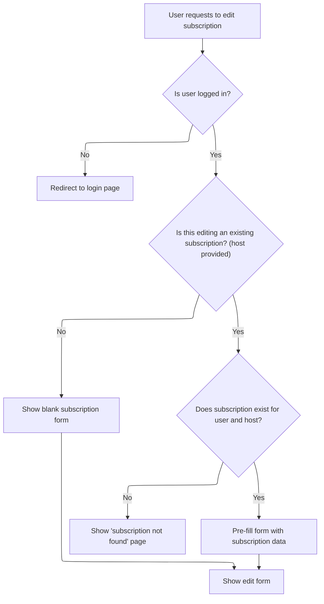

This document describes how a user can delete a subscription. The system prepares the subscription data using the edit process, then marks the subscription for deletion so that downstream processes can complete the removal.

# Triggering the Delete Process

<SwmSnippet path="/apps/mailreader/src/main/java/org/apache/struts/apps/mailreader/actions/SubscriptionAction.java" line="224">

---

In <SwmToken path="apps/mailreader/src/main/java/org/apache/struts/apps/mailreader/actions/SubscriptionAction.java" pos="224:5:5" line-data="    public ActionForward Delete(">`Delete`</SwmToken>, we kick off the delete flow by logging the action and then immediately call <SwmToken path="apps/mailreader/src/main/java/org/apache/struts/apps/mailreader/actions/SubscriptionAction.java" pos="234:7:7" line-data="        ActionForward result = Edit(mapping, form, request, response);">`Edit`</SwmToken> with the same parameters. This means the delete logic is piggybacking on the edit logic, so any subscription update or validation happens before we actually mark the task as delete. It's not a typical delete implementation, since it doesn't do its own deletion, but relies on Edit to prep the state.

```java
    public ActionForward Delete(
            ActionMapping mapping,
            ActionForm form,
            HttpServletRequest request,
            HttpServletResponse response)
            throws Exception {

        final String method = Constants.DELETE;
        doLogProcess(mapping, method);

        ActionForward result = Edit(mapping, form, request, response);

```

---

</SwmSnippet>

## Preparing Subscription Data for Update or Removal



<SwmSnippet path="/apps/mailreader/src/main/java/org/apache/struts/apps/mailreader/actions/SubscriptionAction.java" line="257">

---

<SwmToken path="apps/mailreader/src/main/java/org/apache/struts/apps/mailreader/actions/SubscriptionAction.java" pos="257:5:5" line-data="    public ActionForward Edit(">`Edit`</SwmToken> checks if there's a 'host' in the form to figure out if we're updating an existing subscription. If so, it finds the subscription, puts it in the session, and calls <SwmToken path="apps/mailreader/src/main/java/org/apache/struts/apps/mailreader/actions/SubscriptionAction.java" pos="283:1:1" line-data="            doPopulate(form, subscription);">`doPopulate`</SwmToken> to sync the form with the subscription data. This sets up everything needed for either editing or deleting the subscription.

```java
    public ActionForward Edit(
            ActionMapping mapping,
            ActionForm form,
            HttpServletRequest request,
            HttpServletResponse response)
            throws Exception {

        final String method = Constants.EDIT;
        doLogProcess(mapping, method);

        HttpSession session = request.getSession();
        User user = doGetUser(session);
        if (user == null) {
            return doFindLogon(mapping);
        }

        // Retrieve the subscription, if there is one
        Subscription subscription;
        String host = doGet(form, HOST);
        boolean updating = (host != null);
        if (updating) {
            subscription = doFindSubscription(user, host);
            if (subscription == null) {
                return doFindFailure(mapping);
            }
            session.setAttribute(Constants.SUBSCRIPTION_KEY, subscription);
            doPopulate(form, subscription);
            doSet(form, TASK, method);
        }

        return doFindSuccess(mapping);
    }
```

---

</SwmSnippet>

<SwmSnippet path="/apps/mailreader/src/main/java/org/apache/struts/apps/mailreader/actions/SubscriptionAction.java" line="109">

---

<SwmToken path="apps/mailreader/src/main/java/org/apache/struts/apps/mailreader/actions/SubscriptionAction.java" pos="109:5:5" line-data="    private void doPopulate(Subscription subscription, ActionForm form)">`doPopulate`</SwmToken> copies properties from the form to the subscription using <SwmToken path="apps/mailreader/src/main/java/org/apache/struts/apps/mailreader/actions/SubscriptionAction.java" pos="117:1:1" line-data="            PropertyUtils.copyProperties(subscription, form);">`PropertyUtils`</SwmToken>. It assumes the form and subscription have matching fields, so if they don't, you'll get an exception. This is where the form gets synced with the subscription's current state.

```java
    private void doPopulate(Subscription subscription, ActionForm form)
            throws ServletException {

        if (log.isTraceEnabled()) {
            log.trace(Constants.LOG_POPULATE_SUBSCRIPTION + subscription);
        }

        try {
            PropertyUtils.copyProperties(subscription, form);
        } catch (InvocationTargetException e) {
            Throwable t = e.getTargetException();
            if (t == null) {
                t = e;
            }
            log.error(LOG_SUBSCRIPTION_POPULATE, t);
            throw new ServletException(LOG_SUBSCRIPTION_POPULATE, t);
        } catch (Throwable t) {
            log.error(LOG_SUBSCRIPTION_POPULATE, t);
            throw new ServletException(LOG_SUBSCRIPTION_POPULATE, t);
        }
    }
```

---

</SwmSnippet>

## Finalizing the Delete Action

<SwmSnippet path="/apps/mailreader/src/main/java/org/apache/struts/apps/mailreader/actions/SubscriptionAction.java" line="236">

---

Back in <SwmToken path="apps/mailreader/src/main/java/org/apache/struts/apps/mailreader/actions/SubscriptionAction.java" pos="224:5:5" line-data="    public ActionForward Delete(">`Delete`</SwmToken>, after Edit finishes, we set the form's task to DELETE. This marks the action as a delete for downstream logic, and then we return whatever Edit gave us. The actual delete flag is set here, not in Edit, so Delete is just wrapping Edit and tagging the operation as a delete.

```java
        doSet(form, TASK, method);
        return result;
    }
```

---

</SwmSnippet>

&nbsp;

*This is an auto-generated document by Swimm 🌊 and has not yet been verified by a human*

<SwmMeta version="3.0.0" repo-id="Z2l0aHViJTNBJTNBc3RydXRzMSUzQSUzQVN3aW1tLURlbW8=" repo-name="struts1"><sup>Powered by [Swimm](https://app.swimm.io/)</sup></SwmMeta>
