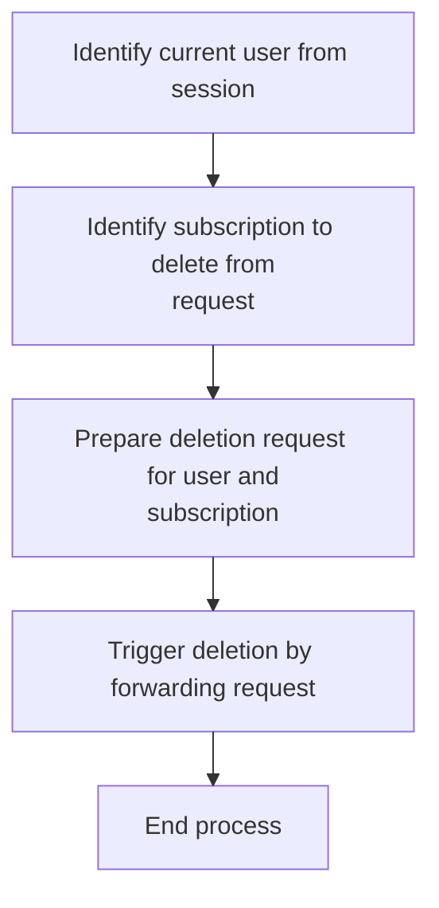
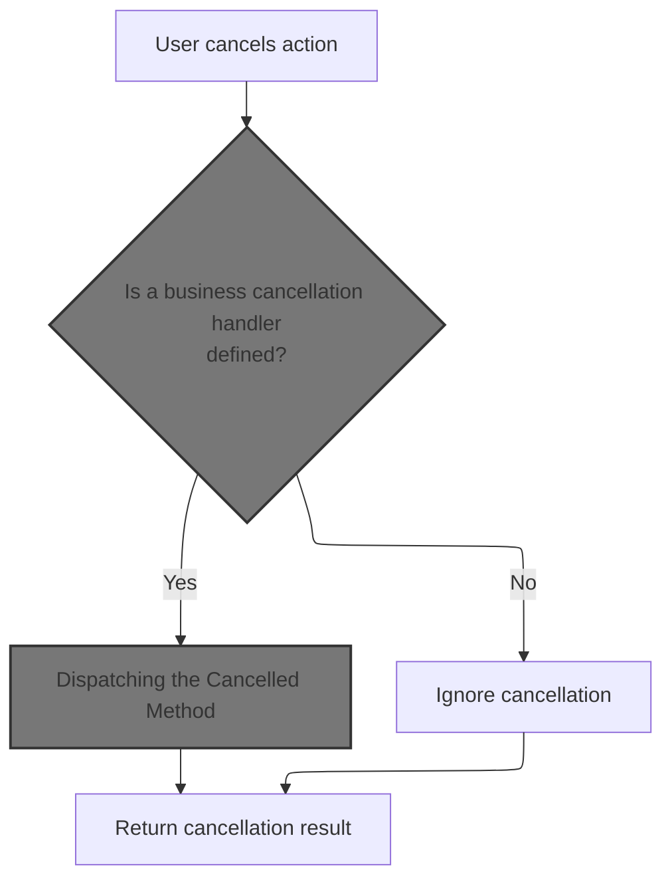
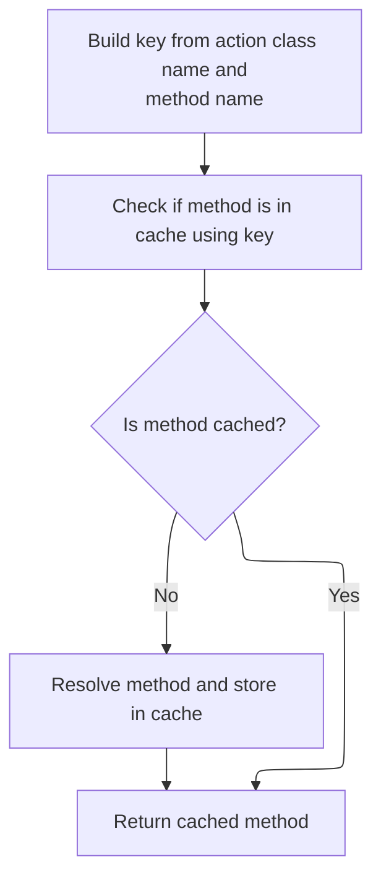
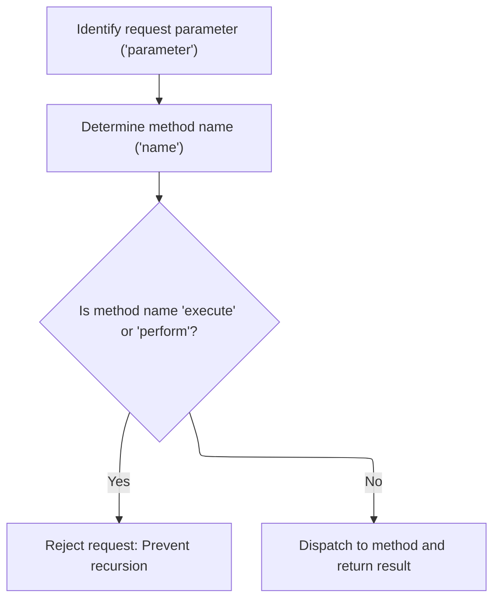

This document describes how users can delete a subscription as part of subscription management. The system receives a delete request from the user, forwards it with the necessary details, and processes the deletion or cancellation as needed.

# Triggering the Delete Operation

<SwmSnippet path="/apps/faces-example1/src/main/java/org/apache/struts/webapp/example/RegistrationBacking.java" line="101">

---

In <SwmToken path="apps/faces-example1/src/main/java/org/apache/struts/webapp/example/RegistrationBacking.java" pos="101:5:5" line-data="    public String delete() {">`delete`</SwmToken>, we're prepping to trigger a delete by building a URL with the right query parameters. We grab the username and host from the session/request, and set up '?action=Delete' so the backend knows what to do. Next, we call into <SwmToken path="apps/faces-example1/src/main/java/org/apache/struts/webapp/example/RegistrationBacking.java" pos="36:8:8" line-data="public class RegistrationBacking extends AbstractBacking {">`AbstractBacking`</SwmToken> to get the base URL for the subscription edit action, which is needed before we append the delete-specific parameters.

```java
    public String delete() {

        if (log.isDebugEnabled()) {
            log.debug("delete()");
        }
        FacesContext context = FacesContext.getCurrentInstance();
        StringBuffer url = subscription(context);
```

---

</SwmSnippet>

## Building the Subscription Action URL

<SwmSnippet path="/apps/faces-example1/src/main/java/org/apache/struts/webapp/example/AbstractBacking.java" line="124">

---

<SwmToken path="apps/faces-example1/src/main/java/org/apache/struts/webapp/example/AbstractBacking.java" pos="124:5:5" line-data="    protected StringBuffer subscription(FacesContext context) {">`subscription`</SwmToken> just hands off to <SwmToken path="apps/faces-example1/src/main/java/org/apache/struts/webapp/example/AbstractBacking.java" pos="126:4:4" line-data="        return (action(context, &quot;/editSubscription&quot;));">`action`</SwmToken> with <SwmToken path="apps/faces-example1/src/main/java/org/apache/struts/webapp/example/AbstractBacking.java" pos="126:10:11" line-data="        return (action(context, &quot;/editSubscription&quot;));">`/editSubscription`</SwmToken>, so we get a base URL for subscription actions. This keeps the URL logic consistent and lets us append parameters for specific operations like delete.

```java
    protected StringBuffer subscription(FacesContext context) {

        return (action(context, "/editSubscription"));

    }
```

---

</SwmSnippet>

<SwmSnippet path="/apps/faces-example1/src/main/java/org/apache/struts/webapp/example/AbstractBacking.java" line="47">

---

<SwmToken path="apps/faces-example1/src/main/java/org/apache/struts/webapp/example/AbstractBacking.java" pos="47:5:5" line-data="    protected StringBuffer action(FacesContext context, String action) {">`action`</SwmToken> takes the base action name and appends '.do' so Struts knows it's an action endpoint. There's no check for existing '.do', so if you pass a full action name, you'll get a weird URL.

```java
    protected StringBuffer action(FacesContext context, String action) {

        // FIXME - assumes extension mapping for Struts
        StringBuffer sb = new StringBuffer(action);
        sb.append(".do");
        return (sb);

    }
```

---

</SwmSnippet>

## Appending Delete Parameters and Forwarding



<SwmSnippet path="/apps/faces-example1/src/main/java/org/apache/struts/webapp/example/RegistrationBacking.java" line="108">

---

Back in RegistrationBacking.delete, we just got the base URL from <SwmToken path="apps/faces-example1/src/main/java/org/apache/struts/webapp/example/RegistrationBacking.java" pos="36:8:8" line-data="public class RegistrationBacking extends AbstractBacking {">`AbstractBacking`</SwmToken>. Now we append the delete action and user/host info, grab the objects from session/request, and forward the request. Returning null here means JSF/Struts doesn't change the navigation, just processes the forward.

```java
        url.append("?action=Delete");
        url.append("&username=");
        User user = (User)
            context.getExternalContext().getSessionMap().get("user");
        url.append(user.getUsername());
        url.append("&host=");
        Subscription subscription = (Subscription)
            context.getExternalContext().getRequestMap().get("subscription");
        url.append(subscription.getHost());
        forward(context, url.toString());
        return (null);

    }
```

---

</SwmSnippet>

# Forwarding the Request to the Action

<SwmSnippet path="/apps/faces-example1/src/main/java/org/apache/struts/webapp/example/AbstractBacking.java" line="66">

---

<SwmToken path="apps/faces-example1/src/main/java/org/apache/struts/webapp/example/AbstractBacking.java" pos="66:5:5" line-data="    protected void forward(FacesContext context, String url) {">`forward`</SwmToken> uses JSF's dispatch to send the request to the action URL. It wraps this in a try/finally so <SwmToken path="apps/faces-example1/src/main/java/org/apache/struts/webapp/example/AbstractBacking.java" pos="73:3:3" line-data="            context.responseComplete();">`responseComplete`</SwmToken> always gets called, marking the response as done. Next, we hit <SwmToken path="extras/src/main/java/org/apache/struts/actions/ActionDispatcher.java" pos="56:5:5" line-data=" *       protected ActionDispatcher dispatcher">`ActionDispatcher`</SwmToken> to actually process the action.

```java
    protected void forward(FacesContext context, String url) {

        try {
            context.getExternalContext().dispatch(url);
        } catch (IOException e) {
            throw new FacesException(e);
        } finally {
            context.responseComplete();
        }

    }
```

---

</SwmSnippet>

# Dispatching the Action Request

<SwmSnippet path="/extras/src/main/java/org/apache/struts/actions/ActionDispatcher.java" line="507">

---

In <SwmToken path="extras/src/main/java/org/apache/struts/actions/ActionDispatcher.java" pos="507:5:5" line-data="    public Object dispatch(ActionContext context) throws Exception {">`dispatch`</SwmToken>, we cast the context to <SwmToken path="extras/src/main/java/org/apache/struts/actions/ActionDispatcher.java" pos="508:1:1" line-data="        ServletActionContext servletContext = (ServletActionContext) context;">`ServletActionContext`</SwmToken> so we can grab the servlet request/response for the action. Next, we call into <SwmToken path="extras/src/main/java/org/apache/struts/actions/ActionDispatcher.java" pos="508:1:1" line-data="        ServletActionContext servletContext = (ServletActionContext) context;">`ServletActionContext`</SwmToken> to get those objects for the execute call.

```java
    public Object dispatch(ActionContext context) throws Exception {
        ServletActionContext servletContext = (ServletActionContext) context;
        return execute((ActionMapping) context.getActionConfig(), context.getActionForm(),
            servletContext.getRequest(), servletContext.getResponse());
```

---

</SwmSnippet>

## Retrieving the Servlet Request

<SwmSnippet path="/core/src/main/java/org/apache/struts/chain/contexts/ServletActionContext.java" line="94">

---

<SwmToken path="core/src/main/java/org/apache/struts/chain/contexts/ServletActionContext.java" pos="94:5:5" line-data="    public HttpServletRequest getRequest() {">`getRequest`</SwmToken> just grabs the request from <SwmToken path="core/src/main/java/org/apache/struts/chain/contexts/ServletActionContext.java" pos="95:3:3" line-data="        return servletWebContext().getRequest();">`servletWebContext`</SwmToken>. This keeps the context logic modular and lets us swap out how requests are fetched if needed.

```java
    public HttpServletRequest getRequest() {
        return servletWebContext().getRequest();
    }
```

---

</SwmSnippet>

<SwmSnippet path="/core/src/main/java/org/apache/struts/chain/contexts/ServletActionContext.java" line="67">

---

<SwmToken path="core/src/main/java/org/apache/struts/chain/contexts/ServletActionContext.java" pos="67:5:5" line-data="    protected ServletWebContext servletWebContext() {">`servletWebContext`</SwmToken> just casts <SwmToken path="core/src/main/java/org/apache/struts/chain/contexts/ServletActionContext.java" pos="68:9:9" line-data="        return (ServletWebContext) this.getBaseContext();">`getBaseContext`</SwmToken> to <SwmToken path="core/src/main/java/org/apache/struts/chain/contexts/ServletActionContext.java" pos="67:3:3" line-data="    protected ServletWebContext servletWebContext() {">`ServletWebContext`</SwmToken>, assuming it's always the right type. If it's not, you'll get a runtime error, so this is something to watch out for if you change the context setup.

```java
    protected ServletWebContext servletWebContext() {
        return (ServletWebContext) this.getBaseContext();
    }
```

---

</SwmSnippet>

## Passing Request and Response to Action Execution

<SwmSnippet path="/extras/src/main/java/org/apache/struts/actions/ActionDispatcher.java" line="509">

---

Just got the request from <SwmToken path="extras/src/main/java/org/apache/struts/actions/ActionDispatcher.java" pos="508:1:1" line-data="        ServletActionContext servletContext = (ServletActionContext) context;">`ServletActionContext`</SwmToken>. Now, <SwmToken path="extras/src/main/java/org/apache/struts/actions/ActionDispatcher.java" pos="56:5:5" line-data=" *       protected ActionDispatcher dispatcher">`ActionDispatcher`</SwmToken> grabs both request and response and passes them to execute, so the action has everything it needs to process the operation.

```java
        return execute((ActionMapping) context.getActionConfig(), context.getActionForm(),
            servletContext.getRequest(), servletContext.getResponse());
```

---

</SwmSnippet>

<SwmSnippet path="/core/src/main/java/org/apache/struts/chain/contexts/ServletActionContext.java" line="103">

---

<SwmToken path="core/src/main/java/org/apache/struts/chain/contexts/ServletActionContext.java" pos="103:5:5" line-data="    public HttpServletResponse getResponse() {">`getResponse`</SwmToken> pulls the response from <SwmToken path="core/src/main/java/org/apache/struts/chain/contexts/ServletActionContext.java" pos="104:3:3" line-data="        return servletWebContext().getResponse();">`servletWebContext`</SwmToken>, same pattern as <SwmToken path="extras/src/main/java/org/apache/struts/actions/ActionDispatcher.java" pos="510:3:3" line-data="            servletContext.getRequest(), servletContext.getResponse());">`getRequest`</SwmToken>. Keeps things modular and easy to update if the context changes.

```java
    public HttpServletResponse getResponse() {
        return servletWebContext().getResponse();
    }
```

---

</SwmSnippet>

<SwmSnippet path="/extras/src/main/java/org/apache/struts/actions/ActionDispatcher.java" line="509">

---

Just got response from <SwmToken path="extras/src/main/java/org/apache/struts/actions/ActionDispatcher.java" pos="508:1:1" line-data="        ServletActionContext servletContext = (ServletActionContext) context;">`ServletActionContext`</SwmToken>. Now, <SwmToken path="extras/src/main/java/org/apache/struts/actions/ActionDispatcher.java" pos="56:5:5" line-data=" *       protected ActionDispatcher dispatcher">`ActionDispatcher`</SwmToken> calls execute with mapping, form, request, and response, so the action method has everything it needs to run.

```java
        return execute((ActionMapping) context.getActionConfig(), context.getActionForm(),
            servletContext.getRequest(), servletContext.getResponse());
    }
```

---

</SwmSnippet>

# Executing the Action Logic

<SwmSnippet path="/extras/src/main/java/org/apache/struts/actions/ActionDispatcher.java" line="197">

---

In <SwmToken path="extras/src/main/java/org/apache/struts/actions/ActionDispatcher.java" pos="197:5:5" line-data="    public ActionForward execute(ActionMapping mapping, ActionForm form,">`execute`</SwmToken>, we first check if the request is cancelled. If so, we handle it and return early. Otherwise, we keep going to figure out which method to call for the action.

```java
    public ActionForward execute(ActionMapping mapping, ActionForm form,
        HttpServletRequest request, HttpServletResponse response)
        throws Exception {
        // Process "cancelled"
        if (isCancelled(request)) {
            ActionForward af = cancelled(mapping, form, request, response);

            if (af != null) {
                return af;
            }
        }

```

---

</SwmSnippet>

## Handling Cancelled Actions



<SwmSnippet path="/extras/src/main/java/org/apache/struts/actions/ActionDispatcher.java" line="282">

---

In <SwmToken path="extras/src/main/java/org/apache/struts/actions/ActionDispatcher.java" pos="282:5:5" line-data="    protected ActionForward cancelled(ActionMapping mapping, ActionForm form,">`cancelled`</SwmToken>, we try to find a method called 'cancelled' in the action class. If it's there, we call it; if not, we just return null and keep going.

```java
    protected ActionForward cancelled(ActionMapping mapping, ActionForm form,
        HttpServletRequest request, HttpServletResponse response)
        throws Exception {
        // Identify if there is an "cancelled" method to be dispatched to
        String name = "cancelled";
        Method method = null;

        try {
            method = getMethod(name);
        } catch (NoSuchMethodException e) {
            return null;
        }

```

---

</SwmSnippet>

### Resolving the Action Method by Name

<SwmSnippet path="/extras/src/main/java/org/apache/struts/actions/ActionDispatcher.java" line="410">

---

<SwmToken path="extras/src/main/java/org/apache/struts/actions/ActionDispatcher.java" pos="410:5:5" line-data="    protected Method getMethod(String name)">`getMethod`</SwmToken> checks the cache for the method by name. If it's not cached, we use reflection to find it and add it to the cache. Next, we call <SwmToken path="core/src/main/java/org/apache/struts/dispatcher/AbstractDispatcher.java" pos="43:6:6" line-data="public abstract class AbstractDispatcher implements Dispatcher, Serializable {">`AbstractDispatcher`</SwmToken> to resolve methods with more context.

```java
    protected Method getMethod(String name)
        throws NoSuchMethodException {
        synchronized (methods) {
            Method method = (Method) methods.get(name);

            if (method == null) {
                method = clazz.getMethod(name, types);
                methods.put(name, method);
            }

            return (method);
        }
    }
```

---

</SwmSnippet>

### Resolving Methods with Context



<SwmSnippet path="/core/src/main/java/org/apache/struts/dispatcher/AbstractDispatcher.java" line="203">

---

<SwmToken path="core/src/main/java/org/apache/struts/dispatcher/AbstractDispatcher.java" pos="203:7:7" line-data="    protected final Method getMethod(ActionContext context, String methodName) throws NoSuchMethodException {">`getMethod`</SwmToken> in <SwmToken path="core/src/main/java/org/apache/struts/dispatcher/AbstractDispatcher.java" pos="43:6:6" line-data="public abstract class AbstractDispatcher implements Dispatcher, Serializable {">`AbstractDispatcher`</SwmToken> builds a cache key from the action class and method name, checks the cache, and resolves the method if needed. This keeps method resolution accurate for each action class.

```java
    protected final Method getMethod(ActionContext context, String methodName) throws NoSuchMethodException {
        synchronized (methods) {
            // Key the method based on the class-method combination
            StringBuffer keyBuf = new StringBuffer(100);
            keyBuf.append(context.getAction().getClass().getName());
            keyBuf.append(":");
            keyBuf.append(methodName);
            String key = keyBuf.toString();

            Method method = (Method) methods.get(key);

            if (method == null) {
                method = resolveMethod(context, methodName);
                methods.put(key, method);
            }

            return method;
        }
    }
```

---

</SwmSnippet>

### Delegating Method Resolution

<SwmSnippet path="/core/src/main/java/org/apache/struts/dispatcher/AbstractDispatcher.java" line="288">

---

<SwmToken path="core/src/main/java/org/apache/struts/dispatcher/AbstractDispatcher.java" pos="288:3:3" line-data="    Method resolveMethod(ActionContext context, String methodName) throws NoSuchMethodException {">`resolveMethod`</SwmToken> just hands off to <SwmToken path="core/src/main/java/org/apache/struts/dispatcher/AbstractDispatcher.java" pos="289:3:3" line-data="        return methodResolver.resolveMethod(context, methodName);">`methodResolver`</SwmToken>, so we can support multiple ways to find methods depending on context. Next, we hit <SwmToken path="core/src/main/java/org/apache/struts/dispatcher/servlet/ServletMethodResolver.java" pos="49:4:4" line-data="public class ServletMethodResolver extends AbstractMethodResolver {">`ServletMethodResolver`</SwmToken> for servlet-specific logic.

```java
    Method resolveMethod(ActionContext context, String methodName) throws NoSuchMethodException {
        return methodResolver.resolveMethod(context, methodName);
    }
```

---

</SwmSnippet>

### Layered Method Resolution Strategies

```mermaid
%%{init: {"flowchart": {"defaultRenderer": "elk"}} }%%
flowchart TD
    node1["Try to resolve method using superclass
logic (method name, context)"] --> node2{"Was method found by superclass?"}
    click node1 openCode "core/src/main/java/org/apache/struts/dispatcher/servlet/ServletMethodResolver.java:112:114"
    node2 -->|"Yes"| node3["Return resolved method"]
    click node2 openCode "core/src/main/java/org/apache/struts/dispatcher/servlet/ServletMethodResolver.java:113:113"
    click node3 openCode "core/src/main/java/org/apache/struts/dispatcher/servlet/ServletMethodResolver.java:113:113"
    node2 -->|"No"| node4{"Is context servlet-specific and does
action support servlet method?"}
    click node4 openCode "core/src/main/java/org/apache/struts/dispatcher/servlet/ServletMethodResolver.java:119:126"
    node4 -->|"Yes"| node5["Try to resolve servlet-specific method
(method name, servlet context)"]
    click node5 openCode "core/src/main/java/org/apache/struts/dispatcher/servlet/ServletMethodResolver.java:121:122"
    node5 --> node6{"Was method found?"}
    click node6 openCode "core/src/main/java/org/apache/struts/dispatcher/servlet/ServletMethodResolver.java:122:122"
    node6 -->|"Yes"| node3
    node6 -->|"No"| node7["Fallback: resolve classic method (method
name, context)"]
    click node7 openCode "core/src/main/java/org/apache/struts/dispatcher/servlet/ServletMethodResolver.java:129:129"
    node4 -->|"No"| node7
    node7 --> node3
classDef HeadingStyle fill:#777777,stroke:#333,stroke-width:2px;

%% Swimm:
%% %%{init: {"flowchart": {"defaultRenderer": "elk"}} }%%
%% flowchart TD
%%     node1["Try to resolve method using superclass
%% logic (method name, context)"] --> node2{"Was method found by superclass?"}
%%     click node1 openCode "<SwmPath>[core/…/servlet/ServletMethodResolver.java](core/src/main/java/org/apache/struts/dispatcher/servlet/ServletMethodResolver.java)</SwmPath>:112:114"
%%     node2 -->|"Yes"| node3["Return resolved method"]
%%     click node2 openCode "<SwmPath>[core/…/servlet/ServletMethodResolver.java](core/src/main/java/org/apache/struts/dispatcher/servlet/ServletMethodResolver.java)</SwmPath>:113:113"
%%     click node3 openCode "<SwmPath>[core/…/servlet/ServletMethodResolver.java](core/src/main/java/org/apache/struts/dispatcher/servlet/ServletMethodResolver.java)</SwmPath>:113:113"
%%     node2 -->|"No"| node4{"Is context servlet-specific and does
%% action support servlet method?"}
%%     click node4 openCode "<SwmPath>[core/…/servlet/ServletMethodResolver.java](core/src/main/java/org/apache/struts/dispatcher/servlet/ServletMethodResolver.java)</SwmPath>:119:126"
%%     node4 -->|"Yes"| node5["Try to resolve servlet-specific method
%% (method name, servlet context)"]
%%     click node5 openCode "<SwmPath>[core/…/servlet/ServletMethodResolver.java](core/src/main/java/org/apache/struts/dispatcher/servlet/ServletMethodResolver.java)</SwmPath>:121:122"
%%     node5 --> node6{"Was method found?"}
%%     click node6 openCode "<SwmPath>[core/…/servlet/ServletMethodResolver.java](core/src/main/java/org/apache/struts/dispatcher/servlet/ServletMethodResolver.java)</SwmPath>:122:122"
%%     node6 -->|"Yes"| node3
%%     node6 -->|"No"| node7["Fallback: resolve classic method (method
%% name, context)"]
%%     click node7 openCode "<SwmPath>[core/…/servlet/ServletMethodResolver.java](core/src/main/java/org/apache/struts/dispatcher/servlet/ServletMethodResolver.java)</SwmPath>:129:129"
%%     node4 -->|"No"| node7
%%     node7 --> node3
%% classDef HeadingStyle fill:#777777,stroke:#333,stroke-width:2px;
```



<SwmSnippet path="/core/src/main/java/org/apache/struts/dispatcher/servlet/ServletMethodResolver.java" line="110">

---

In <SwmToken path="core/src/main/java/org/apache/struts/dispatcher/servlet/ServletMethodResolver.java" pos="110:5:5" line-data="    public Method resolveMethod(ActionContext context, String methodName) throws NoSuchMethodException {">`resolveMethod`</SwmToken>, we first try the superclass logic, then check for servlet-specific methods, and finally fall back to classic method resolution. This covers different method signatures and keeps things flexible.

```java
    public Method resolveMethod(ActionContext context, String methodName) throws NoSuchMethodException {
        // First try to resolve anything the superclass supports
        try {
            return super.resolveMethod(context, methodName);
        } catch (NoSuchMethodException e) {
            // continue
        }

```

---

</SwmSnippet>

<SwmSnippet path="/core/src/main/java/org/apache/struts/dispatcher/servlet/ServletMethodResolver.java" line="118">

---

Just returned from <SwmToken path="core/src/main/java/org/apache/struts/dispatcher/AbstractDispatcher.java" pos="43:6:6" line-data="public abstract class AbstractDispatcher implements Dispatcher, Serializable {">`AbstractDispatcher`</SwmToken>. Now, <SwmToken path="core/src/main/java/org/apache/struts/dispatcher/servlet/ServletMethodResolver.java" pos="49:4:4" line-data="public class ServletMethodResolver extends AbstractMethodResolver {">`ServletMethodResolver`</SwmToken> checks if the action has a method that takes <SwmToken path="core/src/main/java/org/apache/struts/dispatcher/servlet/ServletMethodResolver.java" pos="119:8:8" line-data="        if (context instanceof ServletActionContext) {">`ServletActionContext`</SwmToken>, so we can support servlet-specific action logic if needed.

```java
        // Can the method accept the servlet action context?
        if (context instanceof ServletActionContext) {
            try {
                Class actionClass = context.getAction().getClass();
                return actionClass.getMethod(methodName, new Class[] { ServletActionContext.class });
            } catch (NoSuchMethodException e) {
                // continue
            }
        }

```

---

</SwmSnippet>

<SwmSnippet path="/core/src/main/java/org/apache/struts/dispatcher/servlet/ServletMethodResolver.java" line="128">

---

Just returned from <SwmToken path="core/src/main/java/org/apache/struts/dispatcher/AbstractDispatcher.java" pos="43:6:6" line-data="public abstract class AbstractDispatcher implements Dispatcher, Serializable {">`AbstractDispatcher`</SwmToken>. If neither the superclass nor servlet-specific method is found, <SwmToken path="core/src/main/java/org/apache/struts/dispatcher/servlet/ServletMethodResolver.java" pos="49:4:4" line-data="public class ServletMethodResolver extends AbstractMethodResolver {">`ServletMethodResolver`</SwmToken> falls back to classic method resolution, so older action classes still work.

```java
        // Lastly, try the classical argument listing
        return resolveClassicMethod(context, methodName);
    }
```

---

</SwmSnippet>

<SwmSnippet path="/core/src/main/java/org/apache/struts/dispatcher/servlet/ServletMethodResolver.java" line="105">

---

<SwmToken path="core/src/main/java/org/apache/struts/dispatcher/servlet/ServletMethodResolver.java" pos="105:7:7" line-data="    protected final Method resolveClassicMethod(ActionContext context, String methodName) throws NoSuchMethodException {">`resolveClassicMethod`</SwmToken> grabs the action class and uses reflection to find a method with the exact signature defined by <SwmToken path="core/src/main/java/org/apache/struts/dispatcher/servlet/ServletMethodResolver.java" pos="107:10:10" line-data="        return actionClass.getMethod(methodName, CLASSIC_EXECUTE_SIGNATURE);">`CLASSIC_EXECUTE_SIGNATURE`</SwmToken>. If the method doesn't match, you'll get an exception.

```java
    protected final Method resolveClassicMethod(ActionContext context, String methodName) throws NoSuchMethodException {
        Class actionClass = context.getAction().getClass();
        return actionClass.getMethod(methodName, CLASSIC_EXECUTE_SIGNATURE);
    }
```

---

</SwmSnippet>

### Dispatching the Cancelled Method

<SwmSnippet path="/extras/src/main/java/org/apache/struts/actions/ActionDispatcher.java" line="295">

---

Just returned from <SwmToken path="extras/src/main/java/org/apache/struts/actions/ActionDispatcher.java" pos="253:5:5" line-data="            method = getMethod(name);">`getMethod`</SwmToken>. Now, <SwmToken path="extras/src/main/java/org/apache/struts/actions/ActionDispatcher.java" pos="56:5:5" line-data=" *       protected ActionDispatcher dispatcher">`ActionDispatcher`</SwmToken> uses <SwmToken path="extras/src/main/java/org/apache/struts/actions/ActionDispatcher.java" pos="295:3:3" line-data="        return dispatchMethod(mapping, form, request, response, name, method);">`dispatchMethod`</SwmToken> to call the cancelled method, handling any exceptions and returning the <SwmToken path="extras/src/main/java/org/apache/struts/actions/ActionDispatcher.java" pos="197:3:3" line-data="    public ActionForward execute(ActionMapping mapping, ActionForm form,">`ActionForward`</SwmToken>.

```java
        return dispatchMethod(mapping, form, request, response, name, method);
    }
```

---

</SwmSnippet>

<SwmSnippet path="/extras/src/main/java/org/apache/struts/actions/ActionDispatcher.java" line="358">

---

<SwmToken path="extras/src/main/java/org/apache/struts/actions/ActionDispatcher.java" pos="358:5:5" line-data="    protected ActionForward dispatchMethod(ActionMapping mapping,">`dispatchMethod`</SwmToken> uses reflection to call the method with mapping, form, request, and response. If the method doesn't match this signature, you'll get exceptions, which are handled and logged.

```java
    protected ActionForward dispatchMethod(ActionMapping mapping,
        ActionForm form, HttpServletRequest request,
        HttpServletResponse response, String name, Method method)
        throws Exception {
        ActionForward forward = null;

        try {
            Object[] args = { mapping, form, request, response };

            forward = (ActionForward) method.invoke(actionInstance, args);
        } catch (ClassCastException e) {
            String message =
                messages.getMessage("dispatch.return", mapping.getPath(), name);

            log.error(message, e);
            throw e;
        } catch (IllegalAccessException e) {
            String message =
                messages.getMessage("dispatch.error", mapping.getPath(), name);

            log.error(message, e);
            throw e;
        } catch (InvocationTargetException e) {
            // Rethrow the target exception if possible so that the
            // exception handling machinery can deal with it
            Throwable t = e.getTargetException();

            if (t instanceof Exception) {
                throw ((Exception) t);
            } else {
                String message =
                    messages.getMessage("dispatch.error", mapping.getPath(),
                        name);

                log.error(message, e);
                throw new ServletException(t);
            }
        }

        // Return the returned ActionForward instance
        return (forward);
    }
```

---

</SwmSnippet>

## Determining the Action Method to Invoke



<SwmSnippet path="/extras/src/main/java/org/apache/struts/actions/ActionDispatcher.java" line="209">

---

Just returned from cancelled handling. Now, <SwmToken path="extras/src/main/java/org/apache/struts/actions/ActionDispatcher.java" pos="56:5:5" line-data=" *       protected ActionDispatcher dispatcher">`ActionDispatcher`</SwmToken> figures out which method to call by grabbing the parameter from mapping, form, request, and response.

```java
        // Identify the request parameter containing the method name
        String parameter = getParameter(mapping, form, request, response);

```

---

</SwmSnippet>

<SwmSnippet path="/extras/src/main/java/org/apache/struts/actions/ActionDispatcher.java" line="435">

---

<SwmToken path="extras/src/main/java/org/apache/struts/actions/ActionDispatcher.java" pos="435:5:5" line-data="    protected String getParameter(ActionMapping mapping, ActionForm form,">`getParameter`</SwmToken> checks the mapping for a parameter, handles empty/null values, and uses the flavor to decide whether to return a default, throw an error, or just pass the value. This makes dispatching flexible for different mapping setups.

```java
    protected String getParameter(ActionMapping mapping, ActionForm form,
        HttpServletRequest request, HttpServletResponse response)
        throws Exception {
        String parameter = mapping.getParameter();

        if ("".equals(parameter)) {
            parameter = null;
        }

        if ((parameter == null) && (flavor == DEFAULT_FLAVOR)) {
            // use "method" for DEFAULT_FLAVOR if no parameter was provided
            return "method";
        }

        if ((parameter == null)
            && ((flavor == MAPPING_FLAVOR) || (flavor == DISPATCH_FLAVOR))) {
            String message =
                messages.getMessage("dispatch.handler", mapping.getPath());

            log.error(message);

            throw new ServletException(message);
        }

        return parameter;
    }
```

---

</SwmSnippet>

<SwmSnippet path="/extras/src/main/java/org/apache/struts/actions/ActionDispatcher.java" line="212">

---

Just returned from <SwmToken path="extras/src/main/java/org/apache/struts/actions/ActionDispatcher.java" pos="210:7:7" line-data="        String parameter = getParameter(mapping, form, request, response);">`getParameter`</SwmToken>. Now, <SwmToken path="extras/src/main/java/org/apache/struts/actions/ActionDispatcher.java" pos="56:5:5" line-data=" *       protected ActionDispatcher dispatcher">`ActionDispatcher`</SwmToken> calls <SwmToken path="extras/src/main/java/org/apache/struts/actions/ActionDispatcher.java" pos="214:1:1" line-data="            getMethodName(mapping, form, request, response, parameter);">`getMethodName`</SwmToken> to figure out the actual method to invoke, which can be customized in subclasses for more flexible routing.

```java
        // Get the method's name. This could be overridden in subclasses.
        String name =
            getMethodName(mapping, form, request, response, parameter);

```

---

</SwmSnippet>

<SwmSnippet path="/extras/src/main/java/org/apache/struts/actions/ActionDispatcher.java" line="474">

---

<SwmToken path="extras/src/main/java/org/apache/struts/actions/ActionDispatcher.java" pos="474:5:5" line-data="    protected String getMethodName(ActionMapping mapping, ActionForm form,">`getMethodName`</SwmToken> figures out which method to call on the action by either using the parameter directly (if we're in mapping flavor) or pulling it from the request. This is where the actual method name for dispatch gets resolved, so the next step can invoke the right handler.

```java
    protected String getMethodName(ActionMapping mapping, ActionForm form,
        HttpServletRequest request, HttpServletResponse response,
        String parameter) throws Exception {
        // "Mapping" flavor, defaults to "method"
        if (flavor == MAPPING_FLAVOR) {
            return parameter;
        }

        // default behaviour
        return request.getParameter(parameter);
    }
```

---

</SwmSnippet>

<SwmSnippet path="/extras/src/main/java/org/apache/struts/actions/ActionDispatcher.java" line="216">

---

Just got the method name from <SwmToken path="extras/src/main/java/org/apache/struts/actions/ActionDispatcher.java" pos="214:1:1" line-data="            getMethodName(mapping, form, request, response, parameter);">`getMethodName`</SwmToken>. Now, before actually calling it, we check for recursion on 'execute' or 'perform' to avoid infinite loops. If it's safe, we call <SwmToken path="extras/src/main/java/org/apache/struts/actions/ActionDispatcher.java" pos="226:3:3" line-data="        return dispatchMethod(mapping, form, request, response, name);">`dispatchMethod`</SwmToken> to run the action logic.

```java
        // Prevent recursive calls
        if ("execute".equals(name) || "perform".equals(name)) {
            String message =
                messages.getMessage("dispatch.recursive", mapping.getPath());

            log.error(message);
            throw new ServletException(message);
        }

        // Invoke the named method, and return the result
        return dispatchMethod(mapping, form, request, response, name);
    }
```

---

</SwmSnippet>

# Invoking the Target Action Method

<SwmSnippet path="/extras/src/main/java/org/apache/struts/actions/ActionDispatcher.java" line="313">

---

In <SwmToken path="extras/src/main/java/org/apache/struts/actions/ActionDispatcher.java" pos="313:5:5" line-data="    protected ActionForward dispatchMethod(ActionMapping mapping,">`dispatchMethod`</SwmToken>, we check if the method name is valid. If it's missing (like if someone messes with the query string), we call <SwmToken path="extras/src/main/java/org/apache/struts/actions/ActionDispatcher.java" pos="320:5:5" line-data="            return this.unspecified(mapping, form, request, response);">`unspecified`</SwmToken> to handle the fallback case.

```java
    protected ActionForward dispatchMethod(ActionMapping mapping,
        ActionForm form, HttpServletRequest request,
        HttpServletResponse response, String name)
        throws Exception {
        // Make sure we have a valid method name to call.
        // This may be null if the user hacks the query string.
        if (name == null) {
            return this.unspecified(mapping, form, request, response);
        }

```

---

</SwmSnippet>

## Handling Unspecified Action Methods

<SwmSnippet path="/extras/src/main/java/org/apache/struts/actions/ActionDispatcher.java" line="245">

---

In <SwmToken path="extras/src/main/java/org/apache/struts/actions/ActionDispatcher.java" pos="245:5:5" line-data="    protected ActionForward unspecified(ActionMapping mapping, ActionForm form,">`unspecified`</SwmToken>, we try to find and call an 'unspecified' method on the action. If it's not there, we handle the error and log it, so the framework doesn't just fail silently.

```java
    protected ActionForward unspecified(ActionMapping mapping, ActionForm form,
        HttpServletRequest request, HttpServletResponse response)
        throws Exception {
        // Identify if there is an "unspecified" method to be dispatched to
        String name = "unspecified";
        Method method = null;

        try {
            method = getMethod(name);
```

---

</SwmSnippet>

<SwmSnippet path="/extras/src/main/java/org/apache/struts/actions/ActionDispatcher.java" line="254">

---

Just returned from trying to resolve 'unspecified'. If the method isn't found, we log the error and throw a <SwmToken path="extras/src/main/java/org/apache/struts/actions/ActionDispatcher.java" pos="261:5:5" line-data="            throw new ServletException(message, e);">`ServletException`</SwmToken>, so broken actions are caught early instead of failing silently.

```java
        } catch (NoSuchMethodException e) {
            String message =
                messages.getMessage("dispatch.parameter", mapping.getPath(),
                    mapping.getParameter());

            log.error(message);

            throw new ServletException(message, e);
        }

```

---

</SwmSnippet>

<SwmSnippet path="/extras/src/main/java/org/apache/struts/actions/ActionDispatcher.java" line="264">

---

After resolving the 'unspecified' method, we call the overloaded <SwmToken path="extras/src/main/java/org/apache/struts/actions/ActionDispatcher.java" pos="264:3:3" line-data="        return dispatchMethod(mapping, form, request, response, name, method);">`dispatchMethod`</SwmToken> with the Method object to actually invoke it. This is where the fallback logic gets executed if no specific method was named.

```java
        return dispatchMethod(mapping, form, request, response, name, method);
    }
```

---

</SwmSnippet>

## Resolving and Invoking the Action Method

<SwmSnippet path="/extras/src/main/java/org/apache/struts/actions/ActionDispatcher.java" line="323">

---

Just returned from the fallback logic. Now, we try to resolve the method by name again. If it's not found, we log and throw, so only valid action methods get called.

```java
        // Identify the method object to be dispatched to
        Method method = null;

        try {
            method = getMethod(name);
```

---

</SwmSnippet>

<SwmSnippet path="/extras/src/main/java/org/apache/struts/actions/ActionDispatcher.java" line="328">

---

Just returned from trying to resolve the method. If it's still not found, we throw a <SwmToken path="extras/src/main/java/org/apache/struts/actions/ActionDispatcher.java" pos="328:6:6" line-data="        } catch (NoSuchMethodException e) {">`NoSuchMethodException`</SwmToken> with a clear message, so developers know exactly what's wrong and can fix their action class.

```java
        } catch (NoSuchMethodException e) {
            String message =
                messages.getMessage("dispatch.method", mapping.getPath(), name);

            log.error(message, e);

            String userMsg =
                messages.getMessage("dispatch.method.user", mapping.getPath());
            NoSuchMethodException e2 = new NoSuchMethodException(userMsg);
            e2.initCause(e);
            throw e2;
        }

        return dispatchMethod(mapping, form, request, response, name, method);
    }
```

---

</SwmSnippet>

&nbsp;

*This is an auto-generated document by Swimm 🌊 and has not yet been verified by a human*

<SwmMeta version="3.0.0" repo-id="Z2l0aHViJTNBJTNBc3RydXRzMSUzQSUzQVN3aW1tLURlbW8=" repo-name="struts1"><sup>Powered by [Swimm](https://app.swimm.io/)</sup></SwmMeta>
