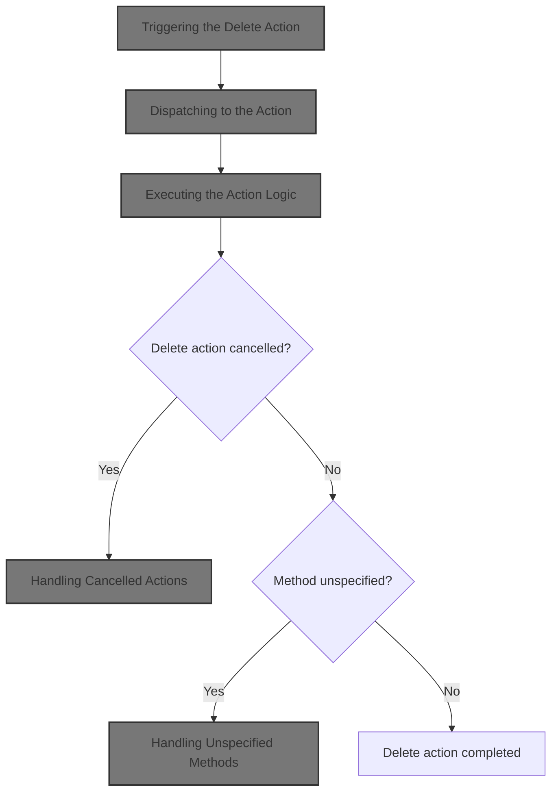
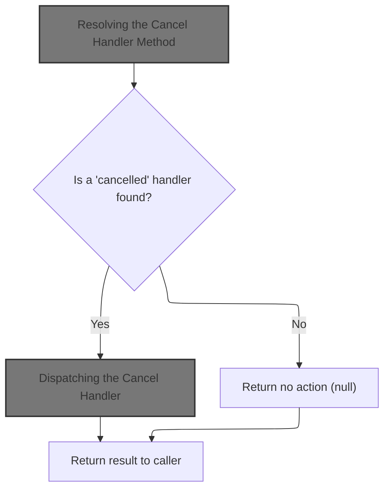
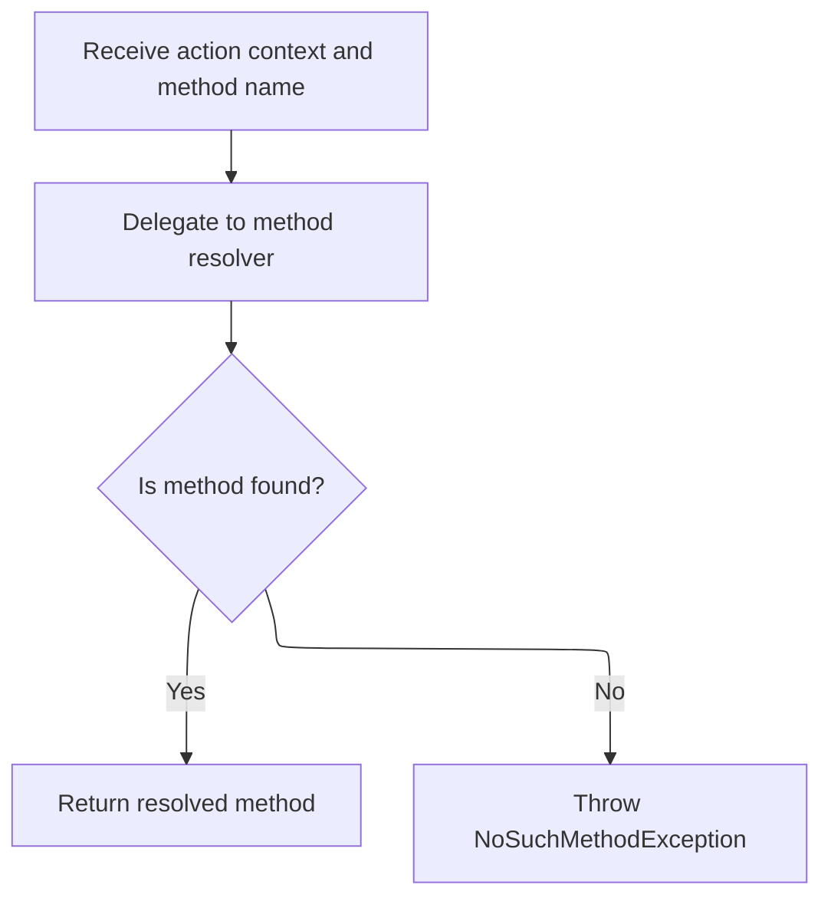
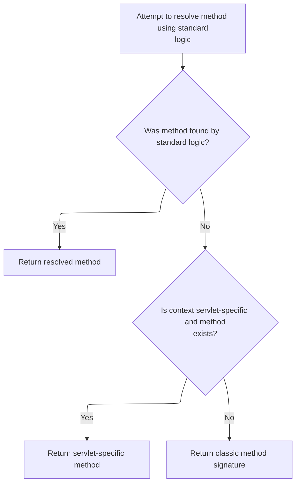
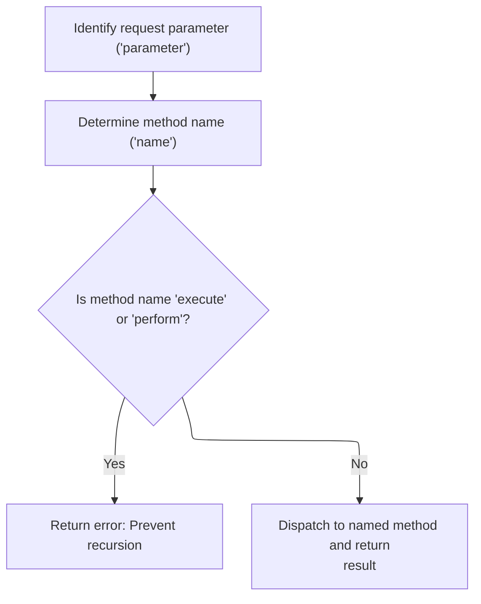

This document describes how users can delete subscriptions within the subscription management feature. When a user requests to delete a subscription, the system processes the request and triggers the deletion of the specified subscription.



# Triggering the Delete Action

<SwmSnippet path="/apps/faces-example1/src/main/java/org/apache/struts/webapp/example/RegistrationBacking.java" line="101">

---

In <SwmToken path="apps/faces-example1/src/main/java/org/apache/struts/webapp/example/RegistrationBacking.java" pos="101:5:5" line-data="    public String delete() {">`delete`</SwmToken>, we start by logging the action and grabbing the <SwmToken path="apps/faces-example1/src/main/java/org/apache/struts/webapp/example/RegistrationBacking.java" pos="106:1:1" line-data="        FacesContext context = FacesContext.getCurrentInstance();">`FacesContext`</SwmToken>. The method then calls <SwmToken path="apps/faces-example1/src/main/java/org/apache/struts/webapp/example/RegistrationBacking.java" pos="107:7:10" line-data="        StringBuffer url = subscription(context);">`subscription(context)`</SwmToken> to get a base URL for the subscription edit action, which is where the delete operation will be triggered. The function doesn't return a navigation string—returning null tells JSF that navigation is already handled (by forwarding).

```java
    public String delete() {

        if (log.isDebugEnabled()) {
            log.debug("delete()");
        }
        FacesContext context = FacesContext.getCurrentInstance();
        StringBuffer url = subscription(context);
```

---

</SwmSnippet>

## Building the Subscription URL

<SwmSnippet path="/apps/faces-example1/src/main/java/org/apache/struts/webapp/example/AbstractBacking.java" line="124">

---

<SwmToken path="apps/faces-example1/src/main/java/org/apache/struts/webapp/example/AbstractBacking.java" pos="124:5:5" line-data="    protected StringBuffer subscription(FacesContext context) {">`subscription`</SwmToken> just wraps the call to <SwmToken path="apps/faces-example1/src/main/java/org/apache/struts/webapp/example/AbstractBacking.java" pos="126:4:4" line-data="        return (action(context, &quot;/editSubscription&quot;));">`action`</SwmToken>, passing in the <SwmToken path="apps/faces-example1/src/main/java/org/apache/struts/webapp/example/AbstractBacking.java" pos="126:10:11" line-data="        return (action(context, &quot;/editSubscription&quot;));">`/editSubscription`</SwmToken> path. This centralizes how URLs for subscription actions are built, so any changes to the URL format only need to happen in one spot.

```java
    protected StringBuffer subscription(FacesContext context) {

        return (action(context, "/editSubscription"));

    }
```

---

</SwmSnippet>

<SwmSnippet path="/apps/faces-example1/src/main/java/org/apache/struts/webapp/example/AbstractBacking.java" line="47">

---

<SwmToken path="apps/faces-example1/src/main/java/org/apache/struts/webapp/example/AbstractBacking.java" pos="47:5:5" line-data="    protected StringBuffer action(FacesContext context, String action) {">`action`</SwmToken> appends '.do' to the action path, following the Struts convention for action URLs. The function assumes the input doesn't already have the suffix, which isn't obvious unless you know the framework.

```java
    protected StringBuffer action(FacesContext context, String action) {

        // FIXME - assumes extension mapping for Struts
        StringBuffer sb = new StringBuffer(action);
        sb.append(".do");
        return (sb);

    }
```

---

</SwmSnippet>

## Appending Query Parameters and Forwarding

<SwmSnippet path="/apps/faces-example1/src/main/java/org/apache/struts/webapp/example/RegistrationBacking.java" line="108">

---

Back in `RegistrationBacking.delete`, after getting the base URL from <SwmToken path="apps/faces-example1/src/main/java/org/apache/struts/webapp/example/RegistrationBacking.java" pos="36:8:8" line-data="public class RegistrationBacking extends AbstractBacking {">`AbstractBacking`</SwmToken>, we append the delete action and user/subscription info as query parameters. Then we forward the request using <SwmToken path="apps/faces-example1/src/main/java/org/apache/struts/webapp/example/RegistrationBacking.java" pos="117:1:1" line-data="        forward(context, url.toString());">`forward`</SwmToken>, and return null to signal JSF that navigation is done.

```java
        url.append("?action=Delete");
        url.append("&username=");
        User user = (User)
            context.getExternalContext().getSessionMap().get("user");
        url.append(user.getUsername());
        url.append("&host=");
        Subscription subscription = (Subscription)
            context.getExternalContext().getRequestMap().get("subscription");
        url.append(subscription.getHost());
        forward(context, url.toString());
        return (null);

    }
```

---

</SwmSnippet>

# Forwarding the Request

<SwmSnippet path="/apps/faces-example1/src/main/java/org/apache/struts/webapp/example/AbstractBacking.java" line="66">

---

<SwmToken path="apps/faces-example1/src/main/java/org/apache/struts/webapp/example/AbstractBacking.java" pos="66:5:5" line-data="    protected void forward(FacesContext context, String url) {">`forward`</SwmToken> uses JSF's dispatch to forward the request to the built URL. It always calls <SwmToken path="apps/faces-example1/src/main/java/org/apache/struts/webapp/example/AbstractBacking.java" pos="73:3:5" line-data="            context.responseComplete();">`responseComplete()`</SwmToken> to tell JSF the response is done, even if dispatch throws an exception.

```java
    protected void forward(FacesContext context, String url) {

        try {
            context.getExternalContext().dispatch(url);
        } catch (IOException e) {
            throw new FacesException(e);
        } finally {
            context.responseComplete();
        }

    }
```

---

</SwmSnippet>

# Dispatching to the Action

<SwmSnippet path="/extras/src/main/java/org/apache/struts/actions/ActionDispatcher.java" line="507">

---

In <SwmToken path="extras/src/main/java/org/apache/struts/actions/ActionDispatcher.java" pos="507:5:5" line-data="    public Object dispatch(ActionContext context) throws Exception {">`dispatch`</SwmToken>, we cast the context to <SwmToken path="extras/src/main/java/org/apache/struts/actions/ActionDispatcher.java" pos="508:1:1" line-data="        ServletActionContext servletContext = (ServletActionContext) context;">`ServletActionContext`</SwmToken> to get access to the HTTP request/response, then call execute with all the action parameters.

```java
    public Object dispatch(ActionContext context) throws Exception {
        ServletActionContext servletContext = (ServletActionContext) context;
        return execute((ActionMapping) context.getActionConfig(), context.getActionForm(),
            servletContext.getRequest(), servletContext.getResponse());
```

---

</SwmSnippet>

## Extracting the HTTP Request

<SwmSnippet path="/core/src/main/java/org/apache/struts/chain/contexts/ServletActionContext.java" line="94">

---

<SwmToken path="core/src/main/java/org/apache/struts/chain/contexts/ServletActionContext.java" pos="94:5:5" line-data="    public HttpServletRequest getRequest() {">`getRequest`</SwmToken> just fetches the HTTP request from the underlying servlet context, keeping the context handling generic.

```java
    public HttpServletRequest getRequest() {
        return servletWebContext().getRequest();
    }
```

---

</SwmSnippet>

<SwmSnippet path="/core/src/main/java/org/apache/struts/chain/contexts/ServletActionContext.java" line="67">

---

<SwmToken path="core/src/main/java/org/apache/struts/chain/contexts/ServletActionContext.java" pos="67:5:5" line-data="    protected ServletWebContext servletWebContext() {">`servletWebContext`</SwmToken> just casts the base context to <SwmToken path="core/src/main/java/org/apache/struts/chain/contexts/ServletActionContext.java" pos="67:3:3" line-data="    protected ServletWebContext servletWebContext() {">`ServletWebContext`</SwmToken>. If the type is wrong, it'll throw, but that's expected here.

```java
    protected ServletWebContext servletWebContext() {
        return (ServletWebContext) this.getBaseContext();
    }
```

---

</SwmSnippet>

## Passing Request and Response to the Action

<SwmSnippet path="/extras/src/main/java/org/apache/struts/actions/ActionDispatcher.java" line="509">

---

Back in `ActionDispatcher.dispatch`, after getting the request, we also fetch the response from the servlet context. Both are passed to execute so the action has full access to the HTTP layer.

```java
        return execute((ActionMapping) context.getActionConfig(), context.getActionForm(),
            servletContext.getRequest(), servletContext.getResponse());
```

---

</SwmSnippet>

<SwmSnippet path="/core/src/main/java/org/apache/struts/chain/contexts/ServletActionContext.java" line="103">

---

<SwmToken path="core/src/main/java/org/apache/struts/chain/contexts/ServletActionContext.java" pos="103:5:5" line-data="    public HttpServletResponse getResponse() {">`getResponse`</SwmToken> just pulls the HTTP response from the servlet context, mirroring how <SwmToken path="extras/src/main/java/org/apache/struts/actions/ActionDispatcher.java" pos="510:3:3" line-data="            servletContext.getRequest(), servletContext.getResponse());">`getRequest`</SwmToken> works.

```java
    public HttpServletResponse getResponse() {
        return servletWebContext().getResponse();
    }
```

---

</SwmSnippet>

<SwmSnippet path="/extras/src/main/java/org/apache/struts/actions/ActionDispatcher.java" line="509">

---

Back in `ActionDispatcher.dispatch`, after getting both request and response, we call execute to actually run the action logic. That's the last step in dispatch.

```java
        return execute((ActionMapping) context.getActionConfig(), context.getActionForm(),
            servletContext.getRequest(), servletContext.getResponse());
    }
```

---

</SwmSnippet>

# Executing the Action Logic

<SwmSnippet path="/extras/src/main/java/org/apache/struts/actions/ActionDispatcher.java" line="197">

---

In <SwmToken path="extras/src/main/java/org/apache/struts/actions/ActionDispatcher.java" pos="197:5:5" line-data="    public ActionForward execute(ActionMapping mapping, ActionForm form,">`execute`</SwmToken>, we first check if the request was cancelled. If so, we handle that case right away and skip the rest of the action logic.

```java
    public ActionForward execute(ActionMapping mapping, ActionForm form,
        HttpServletRequest request, HttpServletResponse response)
        throws Exception {
        // Process "cancelled"
        if (isCancelled(request)) {
            ActionForward af = cancelled(mapping, form, request, response);

            if (af != null) {
                return af;
            }
        }

```

---

</SwmSnippet>

## Handling Cancelled Actions



<SwmSnippet path="/extras/src/main/java/org/apache/struts/actions/ActionDispatcher.java" line="282">

---

In <SwmToken path="extras/src/main/java/org/apache/struts/actions/ActionDispatcher.java" pos="282:5:5" line-data="    protected ActionForward cancelled(ActionMapping mapping, ActionForm form,">`cancelled`</SwmToken>, we try to look up a method named 'cancelled' on the action. If it's not there, we just return null and skip any special handling. If it exists, we call it next to let the action handle the cancel event.

```java
    protected ActionForward cancelled(ActionMapping mapping, ActionForm form,
        HttpServletRequest request, HttpServletResponse response)
        throws Exception {
        // Identify if there is an "cancelled" method to be dispatched to
        String name = "cancelled";
        Method method = null;

        try {
            method = getMethod(name);
        } catch (NoSuchMethodException e) {
            return null;
        }

```

---

</SwmSnippet>

### Resolving the Cancel Handler Method

<SwmSnippet path="/extras/src/main/java/org/apache/struts/actions/ActionDispatcher.java" line="410">

---

<SwmToken path="extras/src/main/java/org/apache/struts/actions/ActionDispatcher.java" pos="410:5:5" line-data="    protected Method getMethod(String name)">`getMethod`</SwmToken> checks if we've already looked up this method before. If not, it uses reflection to find it, caches it, and returns it. If it's not found, we delegate to the next layer to try resolving it.

```java
    protected Method getMethod(String name)
        throws NoSuchMethodException {
        synchronized (methods) {
            Method method = (Method) methods.get(name);

            if (method == null) {
                method = clazz.getMethod(name, types);
                methods.put(name, method);
            }

            return (method);
        }
    }
```

---

</SwmSnippet>

### Looking Up the Action Method

<SwmSnippet path="/core/src/main/java/org/apache/struts/dispatcher/AbstractDispatcher.java" line="203">

---

<SwmToken path="core/src/main/java/org/apache/struts/dispatcher/AbstractDispatcher.java" pos="203:7:7" line-data="    protected final Method getMethod(ActionContext context, String methodName) throws NoSuchMethodException {">`getMethod`</SwmToken> here builds a cache key from the action class and method name, so we don't mix up methods from different actions. If the method isn't cached, we call <SwmToken path="core/src/main/java/org/apache/struts/dispatcher/AbstractDispatcher.java" pos="215:5:5" line-data="                method = resolveMethod(context, methodName);">`resolveMethod`</SwmToken> to try to find it.

```java
    protected final Method getMethod(ActionContext context, String methodName) throws NoSuchMethodException {
        synchronized (methods) {
            // Key the method based on the class-method combination
            StringBuffer keyBuf = new StringBuffer(100);
            keyBuf.append(context.getAction().getClass().getName());
            keyBuf.append(":");
            keyBuf.append(methodName);
            String key = keyBuf.toString();

            Method method = (Method) methods.get(key);

            if (method == null) {
                method = resolveMethod(context, methodName);
                methods.put(key, method);
            }

            return method;
        }
    }
```

---

</SwmSnippet>

### Delegating Method Resolution



<SwmSnippet path="/core/src/main/java/org/apache/struts/dispatcher/AbstractDispatcher.java" line="288">

---

<SwmToken path="core/src/main/java/org/apache/struts/dispatcher/AbstractDispatcher.java" pos="288:3:3" line-data="    Method resolveMethod(ActionContext context, String methodName) throws NoSuchMethodException {">`resolveMethod`</SwmToken> just hands off the work to the <SwmToken path="core/src/main/java/org/apache/struts/dispatcher/AbstractDispatcher.java" pos="289:3:3" line-data="        return methodResolver.resolveMethod(context, methodName);">`methodResolver`</SwmToken>, which can use different strategies depending on the context. This lets us support more than one way to find the method.

```java
    Method resolveMethod(ActionContext context, String methodName) throws NoSuchMethodException {
        return methodResolver.resolveMethod(context, methodName);
    }
```

---

</SwmSnippet>

### Trying Multiple Method Resolution Strategies



<SwmSnippet path="/core/src/main/java/org/apache/struts/dispatcher/servlet/ServletMethodResolver.java" line="110">

---

In <SwmToken path="core/src/main/java/org/apache/struts/dispatcher/servlet/ServletMethodResolver.java" pos="110:5:5" line-data="    public Method resolveMethod(ActionContext context, String methodName) throws NoSuchMethodException {">`resolveMethod`</SwmToken>, we first try the superclass's logic. If that doesn't work and we're in a servlet context, we look for a method that takes a <SwmToken path="extras/src/main/java/org/apache/struts/actions/ActionDispatcher.java" pos="508:1:1" line-data="        ServletActionContext servletContext = (ServletActionContext) context;">`ServletActionContext`</SwmToken>. If that still fails, we fall back to the classic method signature. This covers all the bases for different action method styles.

```java
    public Method resolveMethod(ActionContext context, String methodName) throws NoSuchMethodException {
        // First try to resolve anything the superclass supports
        try {
            return super.resolveMethod(context, methodName);
        } catch (NoSuchMethodException e) {
            // continue
        }

```

---

</SwmSnippet>

<SwmSnippet path="/core/src/main/java/org/apache/struts/dispatcher/servlet/ServletMethodResolver.java" line="118">

---

After failing the superclass's method resolution, <SwmToken path="core/src/main/java/org/apache/struts/dispatcher/AbstractDispatcher.java" pos="215:5:5" line-data="                method = resolveMethod(context, methodName);">`resolveMethod`</SwmToken> checks if we're in a <SwmToken path="core/src/main/java/org/apache/struts/dispatcher/servlet/ServletMethodResolver.java" pos="119:8:8" line-data="        if (context instanceof ServletActionContext) {">`ServletActionContext`</SwmToken> and tries to find a method that takes that as a parameter. If not found, we keep going to the next strategy. This is a framework-specific detail to support more flexible action signatures.

```java
        // Can the method accept the servlet action context?
        if (context instanceof ServletActionContext) {
            try {
                Class actionClass = context.getAction().getClass();
                return actionClass.getMethod(methodName, new Class[] { ServletActionContext.class });
            } catch (NoSuchMethodException e) {
                // continue
            }
        }

```

---

</SwmSnippet>

<SwmSnippet path="/core/src/main/java/org/apache/struts/dispatcher/servlet/ServletMethodResolver.java" line="128">

---

If neither the superclass nor the ServletActionContext-specific method is found, <SwmToken path="core/src/main/java/org/apache/struts/dispatcher/AbstractDispatcher.java" pos="215:5:5" line-data="                method = resolveMethod(context, methodName);">`resolveMethod`</SwmToken> finally tries the classic method signature. This is the catch-all for standard action methods.

```java
        // Lastly, try the classical argument listing
        return resolveClassicMethod(context, methodName);
    }
```

---

</SwmSnippet>

<SwmSnippet path="/core/src/main/java/org/apache/struts/dispatcher/servlet/ServletMethodResolver.java" line="105">

---

<SwmToken path="core/src/main/java/org/apache/struts/dispatcher/servlet/ServletMethodResolver.java" pos="105:7:7" line-data="    protected final Method resolveClassicMethod(ActionContext context, String methodName) throws NoSuchMethodException {">`resolveClassicMethod`</SwmToken> just looks for a method with the classic action signature. If it's not there, we throw, otherwise we return it.

```java
    protected final Method resolveClassicMethod(ActionContext context, String methodName) throws NoSuchMethodException {
        Class actionClass = context.getAction().getClass();
        return actionClass.getMethod(methodName, CLASSIC_EXECUTE_SIGNATURE);
    }
```

---

</SwmSnippet>

### Dispatching the Cancel Handler

<SwmSnippet path="/extras/src/main/java/org/apache/struts/actions/ActionDispatcher.java" line="295">

---

After finding the method, <SwmToken path="extras/src/main/java/org/apache/struts/actions/ActionDispatcher.java" pos="295:3:3" line-data="        return dispatchMethod(mapping, form, request, response, name, method);">`dispatchMethod`</SwmToken> uses reflection to call it with the standard action parameters. If it throws, we pass the exception up so the framework can handle it.

```java
        return dispatchMethod(mapping, form, request, response, name, method);
    }
```

---

</SwmSnippet>

<SwmSnippet path="/extras/src/main/java/org/apache/struts/actions/ActionDispatcher.java" line="358">

---

<SwmToken path="extras/src/main/java/org/apache/struts/actions/ActionDispatcher.java" pos="358:5:5" line-data="    protected ActionForward dispatchMethod(ActionMapping mapping,">`dispatchMethod`</SwmToken> expects the action method to take mapping, form, request, and response, and return an <SwmToken path="extras/src/main/java/org/apache/struts/actions/ActionDispatcher.java" pos="358:3:3" line-data="    protected ActionForward dispatchMethod(ActionMapping mapping,">`ActionForward`</SwmToken>. If the method doesn't match, you'll get a reflection error.

```java
    protected ActionForward dispatchMethod(ActionMapping mapping,
        ActionForm form, HttpServletRequest request,
        HttpServletResponse response, String name, Method method)
        throws Exception {
        ActionForward forward = null;

        try {
            Object[] args = { mapping, form, request, response };

            forward = (ActionForward) method.invoke(actionInstance, args);
        } catch (ClassCastException e) {
            String message =
                messages.getMessage("dispatch.return", mapping.getPath(), name);

            log.error(message, e);
            throw e;
        } catch (IllegalAccessException e) {
            String message =
                messages.getMessage("dispatch.error", mapping.getPath(), name);

            log.error(message, e);
            throw e;
        } catch (InvocationTargetException e) {
            // Rethrow the target exception if possible so that the
            // exception handling machinery can deal with it
            Throwable t = e.getTargetException();

            if (t instanceof Exception) {
                throw ((Exception) t);
            } else {
                String message =
                    messages.getMessage("dispatch.error", mapping.getPath(),
                        name);

                log.error(message, e);
                throw new ServletException(t);
            }
        }

        // Return the returned ActionForward instance
        return (forward);
    }
```

---

</SwmSnippet>

## Finding the Method to Dispatch



<SwmSnippet path="/extras/src/main/java/org/apache/struts/actions/ActionDispatcher.java" line="209">

---

After handling cancellation, <SwmToken path="extras/src/main/java/org/apache/struts/actions/ActionDispatcher.java" pos="197:5:5" line-data="    public ActionForward execute(ActionMapping mapping, ActionForm form,">`execute`</SwmToken> grabs the method name from the request (or mapping), using <SwmToken path="extras/src/main/java/org/apache/struts/actions/ActionDispatcher.java" pos="210:7:7" line-data="        String parameter = getParameter(mapping, form, request, response);">`getParameter`</SwmToken> and <SwmToken path="extras/src/main/java/org/apache/struts/actions/ActionDispatcher.java" pos="214:1:1" line-data="            getMethodName(mapping, form, request, response, parameter);">`getMethodName`</SwmToken>. This lets us pick which action method to run based on the request.

```java
        // Identify the request parameter containing the method name
        String parameter = getParameter(mapping, form, request, response);

```

---

</SwmSnippet>

<SwmSnippet path="/extras/src/main/java/org/apache/struts/actions/ActionDispatcher.java" line="435">

---

<SwmToken path="extras/src/main/java/org/apache/struts/actions/ActionDispatcher.java" pos="435:5:5" line-data="    protected String getParameter(ActionMapping mapping, ActionForm form,">`getParameter`</SwmToken> checks the mapping for a parameter name. If it's missing, we either use 'method' as a default or throw, depending on the flavor setting. This controls how flexible or strict the dispatching is.

```java
    protected String getParameter(ActionMapping mapping, ActionForm form,
        HttpServletRequest request, HttpServletResponse response)
        throws Exception {
        String parameter = mapping.getParameter();

        if ("".equals(parameter)) {
            parameter = null;
        }

        if ((parameter == null) && (flavor == DEFAULT_FLAVOR)) {
            // use "method" for DEFAULT_FLAVOR if no parameter was provided
            return "method";
        }

        if ((parameter == null)
            && ((flavor == MAPPING_FLAVOR) || (flavor == DISPATCH_FLAVOR))) {
            String message =
                messages.getMessage("dispatch.handler", mapping.getPath());

            log.error(message);

            throw new ServletException(message);
        }

        return parameter;
    }
```

---

</SwmSnippet>

<SwmSnippet path="/extras/src/main/java/org/apache/struts/actions/ActionDispatcher.java" line="212">

---

After getting the parameter, <SwmToken path="extras/src/main/java/org/apache/struts/actions/ActionDispatcher.java" pos="197:5:5" line-data="    public ActionForward execute(ActionMapping mapping, ActionForm form,">`execute`</SwmToken> calls <SwmToken path="extras/src/main/java/org/apache/struts/actions/ActionDispatcher.java" pos="214:1:1" line-data="            getMethodName(mapping, form, request, response, parameter);">`getMethodName`</SwmToken>, which subclasses can override to tweak how the method name is picked. This makes the dispatching flexible for different action patterns.

```java
        // Get the method's name. This could be overridden in subclasses.
        String name =
            getMethodName(mapping, form, request, response, parameter);

```

---

</SwmSnippet>

<SwmSnippet path="/extras/src/main/java/org/apache/struts/actions/ActionDispatcher.java" line="474">

---

In <SwmToken path="extras/src/main/java/org/apache/struts/actions/ActionDispatcher.java" pos="474:5:5" line-data="    protected String getMethodName(ActionMapping mapping, ActionForm form,">`getMethodName`</SwmToken>, we decide how to pick the action method name: either straight from the mapping (if we're in <SwmToken path="extras/src/main/java/org/apache/struts/actions/ActionDispatcher.java" pos="478:8:8" line-data="        if (flavor == MAPPING_FLAVOR) {">`MAPPING_FLAVOR`</SwmToken> mode) or from a request parameter. This determines which method will actually handle the request next.

```java
    protected String getMethodName(ActionMapping mapping, ActionForm form,
        HttpServletRequest request, HttpServletResponse response,
        String parameter) throws Exception {
        // "Mapping" flavor, defaults to "method"
        if (flavor == MAPPING_FLAVOR) {
            return parameter;
        }

        // default behaviour
        return request.getParameter(parameter);
    }
```

---

</SwmSnippet>

<SwmSnippet path="/extras/src/main/java/org/apache/struts/actions/ActionDispatcher.java" line="216">

---

After getting the method name, we check if it's 'execute' or 'perform' to avoid infinite recursion. If not, we call <SwmToken path="extras/src/main/java/org/apache/struts/actions/ActionDispatcher.java" pos="226:3:3" line-data="        return dispatchMethod(mapping, form, request, response, name);">`dispatchMethod`</SwmToken> to actually run the action method tied to the request.

```java
        // Prevent recursive calls
        if ("execute".equals(name) || "perform".equals(name)) {
            String message =
                messages.getMessage("dispatch.recursive", mapping.getPath());

            log.error(message);
            throw new ServletException(message);
        }

        // Invoke the named method, and return the result
        return dispatchMethod(mapping, form, request, response, name);
    }
```

---

</SwmSnippet>

# Invoking the Target Action Method

<SwmSnippet path="/extras/src/main/java/org/apache/struts/actions/ActionDispatcher.java" line="313">

---

In <SwmToken path="extras/src/main/java/org/apache/struts/actions/ActionDispatcher.java" pos="313:5:5" line-data="    protected ActionForward dispatchMethod(ActionMapping mapping,">`dispatchMethod`</SwmToken>, if the method name is null (maybe the request was tampered with or misconfigured), we fall back to <SwmToken path="extras/src/main/java/org/apache/struts/actions/ActionDispatcher.java" pos="320:5:5" line-data="            return this.unspecified(mapping, form, request, response);">`unspecified`</SwmToken> to see if there's a default handler for this case.

```java
    protected ActionForward dispatchMethod(ActionMapping mapping,
        ActionForm form, HttpServletRequest request,
        HttpServletResponse response, String name)
        throws Exception {
        // Make sure we have a valid method name to call.
        // This may be null if the user hacks the query string.
        if (name == null) {
            return this.unspecified(mapping, form, request, response);
        }

```

---

</SwmSnippet>

## Handling Unspecified Methods

<SwmSnippet path="/extras/src/main/java/org/apache/struts/actions/ActionDispatcher.java" line="245">

---

In <SwmToken path="extras/src/main/java/org/apache/struts/actions/ActionDispatcher.java" pos="245:5:5" line-data="    protected ActionForward unspecified(ActionMapping mapping, ActionForm form,">`unspecified`</SwmToken>, we try to find and call a method named 'unspecified' on the action. This is the framework's way to handle requests where no method was given.

```java
    protected ActionForward unspecified(ActionMapping mapping, ActionForm form,
        HttpServletRequest request, HttpServletResponse response)
        throws Exception {
        // Identify if there is an "unspecified" method to be dispatched to
        String name = "unspecified";
        Method method = null;

        try {
            method = getMethod(name);
```

---

</SwmSnippet>

<SwmSnippet path="/extras/src/main/java/org/apache/struts/actions/ActionDispatcher.java" line="254">

---

If <SwmToken path="core/src/main/java/org/apache/struts/dispatcher/AbstractDispatcher.java" pos="203:7:7" line-data="    protected final Method getMethod(ActionContext context, String methodName) throws NoSuchMethodException {">`getMethod`</SwmToken>`(`<SwmToken path="extras/src/main/java/org/apache/struts/actions/ActionDispatcher.java" pos="245:5:5" line-data="    protected ActionForward unspecified(ActionMapping mapping, ActionForm form,">`unspecified`</SwmToken>`)` fails, we log the error and throw a <SwmToken path="extras/src/main/java/org/apache/struts/actions/ActionDispatcher.java" pos="261:5:5" line-data="            throw new ServletException(message, e);">`ServletException`</SwmToken>. This makes sure missing handlers don't fail silently and are visible during development or debugging.

```java
        } catch (NoSuchMethodException e) {
            String message =
                messages.getMessage("dispatch.parameter", mapping.getPath(),
                    mapping.getParameter());

            log.error(message);

            throw new ServletException(message, e);
        }

```

---

</SwmSnippet>

<SwmSnippet path="/extras/src/main/java/org/apache/struts/actions/ActionDispatcher.java" line="264">

---

Once we've found the 'unspecified' method, we call <SwmToken path="extras/src/main/java/org/apache/struts/actions/ActionDispatcher.java" pos="264:3:3" line-data="        return dispatchMethod(mapping, form, request, response, name, method);">`dispatchMethod`</SwmToken> with it to actually run the handler and return its result.

```java
        return dispatchMethod(mapping, form, request, response, name, method);
    }
```

---

</SwmSnippet>

## Resolving and Invoking the Action Method

<SwmSnippet path="/extras/src/main/java/org/apache/struts/actions/ActionDispatcher.java" line="323">

---

After handling the unspecified case, we try to resolve the method by name. If it's not found, we throw, making sure only valid action methods get called.

```java
        // Identify the method object to be dispatched to
        Method method = null;

        try {
            method = getMethod(name);
```

---

</SwmSnippet>

<SwmSnippet path="/extras/src/main/java/org/apache/struts/actions/ActionDispatcher.java" line="328">

---

Once we've got the Method object, we call <SwmToken path="extras/src/main/java/org/apache/struts/actions/ActionDispatcher.java" pos="341:3:3" line-data="        return dispatchMethod(mapping, form, request, response, name, method);">`dispatchMethod`</SwmToken> again to actually invoke the action and hand the result back up the stack.

```java
        } catch (NoSuchMethodException e) {
            String message =
                messages.getMessage("dispatch.method", mapping.getPath(), name);

            log.error(message, e);

            String userMsg =
                messages.getMessage("dispatch.method.user", mapping.getPath());
            NoSuchMethodException e2 = new NoSuchMethodException(userMsg);
            e2.initCause(e);
            throw e2;
        }

        return dispatchMethod(mapping, form, request, response, name, method);
    }
```

---

</SwmSnippet>

&nbsp;

*This is an auto-generated document by Swimm 🌊 and has not yet been verified by a human*

<SwmMeta version="3.0.0" repo-id="Z2l0aHViJTNBJTNBc3RydXRzMSUzQSUzQVN3aW1tLURlbW8=" repo-name="struts1"><sup>Powered by [Swimm](https://app.swimm.io/)</sup></SwmMeta>
