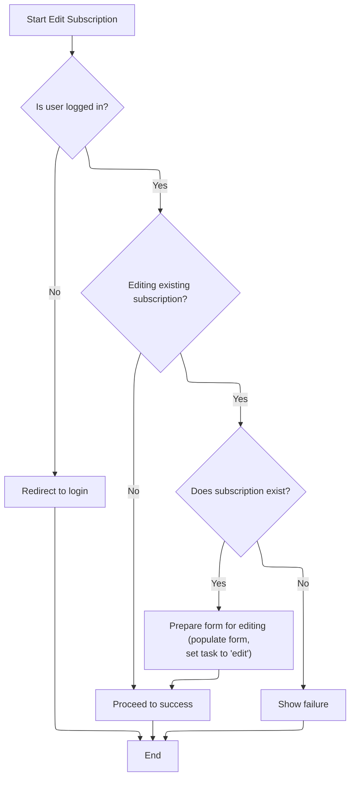

This document describes how a user's request to delete a subscription is processed. The system checks user authentication and verifies the subscription before marking the operation as a delete and preparing the form for further processing.

# Delegating Delete Operations

<SwmSnippet path="/apps/mailreader/src/main/java/org/apache/struts/apps/mailreader/actions/SubscriptionAction.java" line="224">

---

In <SwmToken path="apps/mailreader/src/main/java/org/apache/struts/apps/mailreader/actions/SubscriptionAction.java" pos="224:5:5" line-data="    public ActionForward Delete(">`Delete`</SwmToken>, we log the delete operation and immediately call <SwmToken path="apps/mailreader/src/main/java/org/apache/struts/apps/mailreader/actions/SubscriptionAction.java" pos="234:7:7" line-data="        ActionForward result = Edit(mapping, form, request, response);">`Edit`</SwmToken> with the same parameters. This lets us reuse the subscription update logic, assuming the form and Edit method can handle delete-specific tasks. We don't actually delete here; Edit does the heavy lifting.

```java
    public ActionForward Delete(
            ActionMapping mapping,
            ActionForm form,
            HttpServletRequest request,
            HttpServletResponse response)
            throws Exception {

        final String method = Constants.DELETE;
        doLogProcess(mapping, method);

        ActionForward result = Edit(mapping, form, request, response);

```

---

</SwmSnippet>

## Handling Subscription Updates



<SwmSnippet path="/apps/mailreader/src/main/java/org/apache/struts/apps/mailreader/actions/SubscriptionAction.java" line="257">

---

In <SwmToken path="apps/mailreader/src/main/java/org/apache/struts/apps/mailreader/actions/SubscriptionAction.java" pos="257:5:5" line-data="    public ActionForward Edit(">`Edit`</SwmToken>, we check for a valid user session and then decide if we're updating an existing subscription based on the host value. If updating, we call <SwmToken path="apps/mailreader/src/main/java/org/apache/struts/apps/mailreader/actions/SubscriptionAction.java" pos="278:5:5" line-data="            subscription = doFindSubscription(user, host);">`doFindSubscription`</SwmToken> to fetch the subscription for the user and host. If nothing is found, we bail out early.

```java
    public ActionForward Edit(
            ActionMapping mapping,
            ActionForm form,
            HttpServletRequest request,
            HttpServletResponse response)
            throws Exception {

        final String method = Constants.EDIT;
        doLogProcess(mapping, method);

        HttpSession session = request.getSession();
        User user = doGetUser(session);
        if (user == null) {
            return doFindLogon(mapping);
        }

        // Retrieve the subscription, if there is one
        Subscription subscription;
        String host = doGet(form, HOST);
        boolean updating = (host != null);
        if (updating) {
            subscription = doFindSubscription(user, host);
            if (subscription == null) {
                return doFindFailure(mapping);
            }
```

---

</SwmSnippet>

<SwmSnippet path="/apps/mailreader/src/main/java/org/apache/struts/apps/mailreader/actions/SubscriptionAction.java" line="78">

---

<SwmToken path="apps/mailreader/src/main/java/org/apache/struts/apps/mailreader/actions/SubscriptionAction.java" pos="78:5:5" line-data="    private Subscription doFindSubscription(User user, String host) {">`doFindSubscription`</SwmToken> tries to fetch a subscription for the user and host, but since <SwmToken path="apps/mailreader/src/main/java/org/apache/struts/apps/mailreader/actions/SubscriptionAction.java" pos="83:7:7" line-data="            subscription = user.findSubscription(host);">`findSubscription`</SwmToken> can throw <SwmToken path="apps/mailreader/src/main/java/org/apache/struts/apps/mailreader/actions/SubscriptionAction.java" pos="85:4:4" line-data="        catch (NullPointerException e) {">`NullPointerException`</SwmToken>, we catch it and treat it as a missing subscription. If nothing is found, we log it for tracing.

```java
    private Subscription doFindSubscription(User user, String host) {

        Subscription subscription;

        try {
            subscription = user.findSubscription(host);
        }
        catch (NullPointerException e) {
            subscription = null;
        }

        if ((subscription == null) && (log.isTraceEnabled())) {
            log.trace(
                    " No subscription for user "
                            + user.getUsername()
                            + " and host "
                            + host);
        }

        return subscription;
    }
```

---

</SwmSnippet>

<SwmSnippet path="/apps/mailreader/src/main/java/org/apache/struts/apps/mailreader/actions/SubscriptionAction.java" line="282">

---

Back in <SwmToken path="apps/mailreader/src/main/java/org/apache/struts/apps/mailreader/actions/SubscriptionAction.java" pos="234:7:7" line-data="        ActionForward result = Edit(mapping, form, request, response);">`Edit`</SwmToken>, after fetching the subscription, we stash it in the session, populate the form, and set the TASK property to mark the operation type. We rely on <SwmToken path="apps/mailreader/src/main/java/org/apache/struts/apps/mailreader/actions/SubscriptionAction.java" pos="284:1:1" line-data="            doSet(form, TASK, method);">`doSet`</SwmToken> from <SwmToken path="apps/mailreader/src/main/java/org/apache/struts/apps/mailreader/actions/SubscriptionAction.java" pos="39:10:10" line-data="public final class SubscriptionAction extends BaseAction {">`BaseAction`</SwmToken> to update the form, which is needed for downstream processing.

```java
            session.setAttribute(Constants.SUBSCRIPTION_KEY, subscription);
            doPopulate(form, subscription);
            doSet(form, TASK, method);
        }

        return doFindSuccess(mapping);
    }
```

---

</SwmSnippet>

<SwmSnippet path="/apps/mailreader/src/main/java/org/apache/struts/apps/mailreader/actions/BaseAction.java" line="430">

---

<SwmToken path="apps/mailreader/src/main/java/org/apache/struts/apps/mailreader/actions/BaseAction.java" pos="430:5:5" line-data="    protected boolean doSet(ActionForm form, String property, String value) {">`doSet`</SwmToken> just tries to set a property on the form, assuming it's a <SwmToken path="apps/mailreader/src/main/java/org/apache/struts/apps/mailreader/actions/BaseAction.java" pos="432:1:1" line-data="            DynaActionForm dyna = (DynaActionForm) form;">`DynaActionForm`</SwmToken>. If the cast or set fails, we return false; otherwise, true. No type checks, so upstream code needs to be careful.

```java
    protected boolean doSet(ActionForm form, String property, String value) {
        try {
            DynaActionForm dyna = (DynaActionForm) form;
            dyna.set(property, value);
        } catch (Throwable t) {
            return false;
        }
        return true;
    }
```

---

</SwmSnippet>

## Finalizing Delete Operations

<SwmSnippet path="/apps/mailreader/src/main/java/org/apache/struts/apps/mailreader/actions/SubscriptionAction.java" line="236">

---

Finally in <SwmToken path="apps/mailreader/src/main/java/org/apache/struts/apps/mailreader/actions/SubscriptionAction.java" pos="224:5:5" line-data="    public ActionForward Delete(">`Delete`</SwmToken>, after Edit returns, we set the TASK property on the form to mark this as a delete operation. We rely on <SwmToken path="apps/mailreader/src/main/java/org/apache/struts/apps/mailreader/actions/SubscriptionAction.java" pos="236:1:1" line-data="        doSet(form, TASK, method);">`doSet`</SwmToken> from <SwmToken path="apps/mailreader/src/main/java/org/apache/struts/apps/mailreader/actions/SubscriptionAction.java" pos="39:10:10" line-data="public final class SubscriptionAction extends BaseAction {">`BaseAction`</SwmToken> to update the form, then return the result from Edit.

```java
        doSet(form, TASK, method);
        return result;
    }
```

---

</SwmSnippet>

&nbsp;

*This is an auto-generated document by Swimm 🌊 and has not yet been verified by a human*

<SwmMeta version="3.0.0" repo-id="Z2l0aHViJTNBJTNBc3RydXRzMSUzQSUzQVN3aW1tLURlbW8=" repo-name="struts1"><sup>Powered by [Swimm](https://app.swimm.io/)</sup></SwmMeta>
