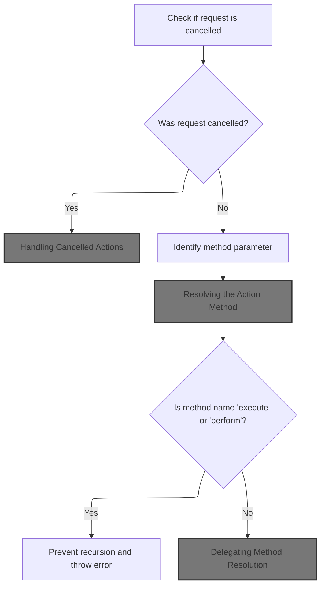
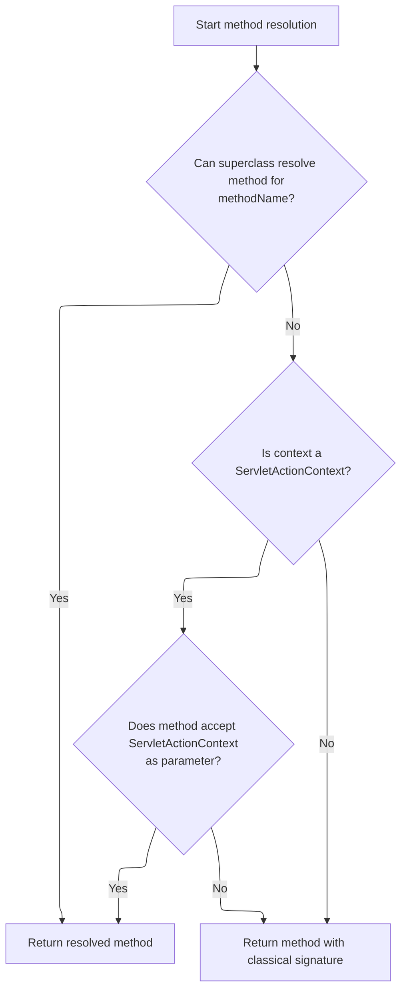
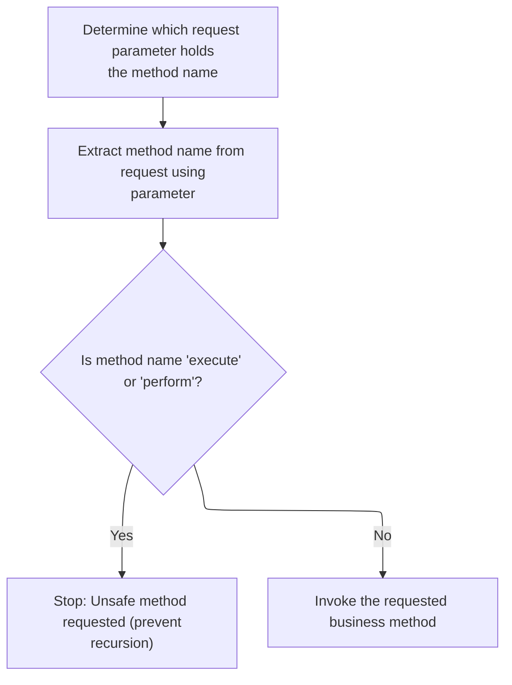

This document outlines how a delete operation for a subscription is processed. When a user requests to delete a subscription, the system builds the correct action URL, completes the request, and dispatches it to the appropriate handler, which then executes the business logic for deletion.

# Triggering the Delete Operation

<SwmSnippet path="/apps/faces-example1/src/main/java/org/apache/struts/webapp/example/RegistrationBacking.java" line="101">

---

In <SwmToken path="apps/faces-example1/src/main/java/org/apache/struts/webapp/example/RegistrationBacking.java" pos="101:5:5" line-data="    public String delete() {">`delete`</SwmToken>, we start by logging the action and grabbing the current <SwmToken path="apps/faces-example1/src/main/java/org/apache/struts/webapp/example/RegistrationBacking.java" pos="106:1:1" line-data="        FacesContext context = FacesContext.getCurrentInstance();">`FacesContext`</SwmToken>. The function then calls <SwmToken path="apps/faces-example1/src/main/java/org/apache/struts/webapp/example/RegistrationBacking.java" pos="107:7:10" line-data="        StringBuffer url = subscription(context);">`subscription(context)`</SwmToken> to get a base URL for the subscription edit action. We need to call into <SwmToken path="apps/faces-example1/src/main/java/org/apache/struts/webapp/example/RegistrationBacking.java" pos="36:8:8" line-data="public class RegistrationBacking extends AbstractBacking {">`AbstractBacking`</SwmToken> here because that's where the logic for building the correct Struts action URL (with the right extension and path) lives, keeping the URL construction consistent across the app.

```java
    public String delete() {

        if (log.isDebugEnabled()) {
            log.debug("delete()");
        }
        FacesContext context = FacesContext.getCurrentInstance();
        StringBuffer url = subscription(context);
```

---

</SwmSnippet>

## Building the Action URL

<SwmSnippet path="/apps/faces-example1/src/main/java/org/apache/struts/webapp/example/AbstractBacking.java" line="124">

---

<SwmToken path="apps/faces-example1/src/main/java/org/apache/struts/webapp/example/AbstractBacking.java" pos="124:5:5" line-data="    protected StringBuffer subscription(FacesContext context) {">`subscription`</SwmToken> just wraps a call to <SwmToken path="apps/faces-example1/src/main/java/org/apache/struts/webapp/example/AbstractBacking.java" pos="126:4:4" line-data="        return (action(context, &quot;/editSubscription&quot;));">`action`</SwmToken>, passing in <SwmToken path="apps/faces-example1/src/main/java/org/apache/struts/webapp/example/AbstractBacking.java" pos="126:10:11" line-data="        return (action(context, &quot;/editSubscription&quot;));">`/editSubscription`</SwmToken> as the path. This centralizes how URLs for subscription actions are built, so we don't repeat the path or extension logic everywhere.

```java
    protected StringBuffer subscription(FacesContext context) {

        return (action(context, "/editSubscription"));

    }
```

---

</SwmSnippet>

<SwmSnippet path="/apps/faces-example1/src/main/java/org/apache/struts/webapp/example/AbstractBacking.java" line="47">

---

<SwmToken path="apps/faces-example1/src/main/java/org/apache/struts/webapp/example/AbstractBacking.java" pos="47:5:5" line-data="    protected StringBuffer action(FacesContext context, String action) {">`action`</SwmToken> takes the given path and blindly appends '.do' to it, assuming Struts extension mapping. No checks for double '.do', so input must be clean. Returns a <SwmToken path="apps/faces-example1/src/main/java/org/apache/struts/webapp/example/AbstractBacking.java" pos="47:3:3" line-data="    protected StringBuffer action(FacesContext context, String action) {">`StringBuffer`</SwmToken> for legacy reasons.

```java
    protected StringBuffer action(FacesContext context, String action) {

        // FIXME - assumes extension mapping for Struts
        StringBuffer sb = new StringBuffer(action);
        sb.append(".do");
        return (sb);

    }
```

---

</SwmSnippet>

## Completing the Delete Request

<SwmSnippet path="/apps/faces-example1/src/main/java/org/apache/struts/webapp/example/RegistrationBacking.java" line="108">

---

Back in `RegistrationBacking.delete`, after getting the base URL, we append the delete action and user/host info from the session/request. The function then calls <SwmToken path="apps/faces-example1/src/main/java/org/apache/struts/webapp/example/RegistrationBacking.java" pos="117:1:1" line-data="        forward(context, url.toString());">`forward`</SwmToken> to dispatch the request to the constructed URL. Returning null signals JSF to stay on the same page. Assumes 'user' and 'subscription' are always available in the context.

```java
        url.append("?action=Delete");
        url.append("&username=");
        User user = (User)
            context.getExternalContext().getSessionMap().get("user");
        url.append(user.getUsername());
        url.append("&host=");
        Subscription subscription = (Subscription)
            context.getExternalContext().getRequestMap().get("subscription");
        url.append(subscription.getHost());
        forward(context, url.toString());
        return (null);

    }
```

---

</SwmSnippet>

# Dispatching the Request

<SwmSnippet path="/apps/faces-example1/src/main/java/org/apache/struts/webapp/example/AbstractBacking.java" line="66">

---

<SwmToken path="apps/faces-example1/src/main/java/org/apache/struts/webapp/example/AbstractBacking.java" pos="66:5:5" line-data="    protected void forward(FacesContext context, String url) {">`forward`</SwmToken> uses JSF's ExternalContext to dispatch the request to the given URL, then marks the response as complete so JSF doesn't try to render a view. If dispatch fails, it throws a <SwmToken path="apps/faces-example1/src/main/java/org/apache/struts/webapp/example/AbstractBacking.java" pos="71:5:5" line-data="            throw new FacesException(e);">`FacesException`</SwmToken>. Next, the flow continues in the Struts action dispatcher.

```java
    protected void forward(FacesContext context, String url) {

        try {
            context.getExternalContext().dispatch(url);
        } catch (IOException e) {
            throw new FacesException(e);
        } finally {
            context.responseComplete();
        }

    }
```

---

</SwmSnippet>

# Routing to the Action Handler

<SwmSnippet path="/extras/src/main/java/org/apache/struts/actions/ActionDispatcher.java" line="507">

---

In <SwmToken path="extras/src/main/java/org/apache/struts/actions/ActionDispatcher.java" pos="507:5:5" line-data="    public Object dispatch(ActionContext context) throws Exception {">`dispatch`</SwmToken>, we cast the context to <SwmToken path="extras/src/main/java/org/apache/struts/actions/ActionDispatcher.java" pos="508:1:1" line-data="        ServletActionContext servletContext = (ServletActionContext) context;">`ServletActionContext`</SwmToken> to get access to the servlet request/response. We need to call <SwmToken path="extras/src/main/java/org/apache/struts/actions/ActionDispatcher.java" pos="510:10:10" line-data="            servletContext.getRequest(), servletContext.getResponse());">`getResponse`</SwmToken> next to pass the correct objects to the action's execute method.

```java
    public Object dispatch(ActionContext context) throws Exception {
        ServletActionContext servletContext = (ServletActionContext) context;
        return execute((ActionMapping) context.getActionConfig(), context.getActionForm(),
            servletContext.getRequest(), servletContext.getResponse());
```

---

</SwmSnippet>

<SwmSnippet path="/extras/src/main/java/org/apache/struts/actions/ActionDispatcher.java" line="509">

---

Just returned from <SwmToken path="extras/src/main/java/org/apache/struts/actions/ActionDispatcher.java" pos="508:1:1" line-data="        ServletActionContext servletContext = (ServletActionContext) context;">`ServletActionContext`</SwmToken>, now in ActionDispatcher.dispatch, we call execute with the mapping, form, and the servlet request/response. This hands off control to the action logic.

```java
        return execute((ActionMapping) context.getActionConfig(), context.getActionForm(),
            servletContext.getRequest(), servletContext.getResponse());
```

---

</SwmSnippet>

<SwmSnippet path="/core/src/main/java/org/apache/struts/chain/contexts/ServletActionContext.java" line="103">

---

<SwmToken path="core/src/main/java/org/apache/struts/chain/contexts/ServletActionContext.java" pos="103:5:5" line-data="    public HttpServletResponse getResponse() {">`getResponse`</SwmToken> fetches the servlet response from the underlying web context. This ensures the dispatcher always works with the correct response object.

```java
    public HttpServletResponse getResponse() {
        return servletWebContext().getResponse();
    }
```

---

</SwmSnippet>

<SwmSnippet path="/extras/src/main/java/org/apache/struts/actions/ActionDispatcher.java" line="509">

---

Just returned from <SwmToken path="extras/src/main/java/org/apache/struts/actions/ActionDispatcher.java" pos="508:1:1" line-data="        ServletActionContext servletContext = (ServletActionContext) context;">`ServletActionContext`</SwmToken>, now ActionDispatcher.dispatch calls execute with all the servlet objects. This is where the action logic actually runs.

```java
        return execute((ActionMapping) context.getActionConfig(), context.getActionForm(),
            servletContext.getRequest(), servletContext.getResponse());
    }
```

---

</SwmSnippet>

# Executing the Action Logic



<SwmSnippet path="/extras/src/main/java/org/apache/struts/actions/ActionDispatcher.java" line="197">

---

In <SwmToken path="extras/src/main/java/org/apache/struts/actions/ActionDispatcher.java" pos="197:5:5" line-data="    public ActionForward execute(ActionMapping mapping, ActionForm form,">`execute`</SwmToken>, we first check if the request was cancelled. If so, we try to handle it via the cancelled method before moving on to the main action logic.

```java
    public ActionForward execute(ActionMapping mapping, ActionForm form,
        HttpServletRequest request, HttpServletResponse response)
        throws Exception {
        // Process "cancelled"
        if (isCancelled(request)) {
            ActionForward af = cancelled(mapping, form, request, response);

            if (af != null) {
                return af;
            }
        }

```

---

</SwmSnippet>

## Handling Cancelled Actions

<SwmSnippet path="/extras/src/main/java/org/apache/struts/actions/ActionDispatcher.java" line="282">

---

<SwmToken path="extras/src/main/java/org/apache/struts/actions/ActionDispatcher.java" pos="282:5:5" line-data="    protected ActionForward cancelled(ActionMapping mapping, ActionForm form,">`cancelled`</SwmToken> tries to find and invoke a method named 'cancelled' on the action. If not found, it returns null so the flow continues. Uses <SwmToken path="extras/src/main/java/org/apache/struts/actions/ActionDispatcher.java" pos="295:3:3" line-data="        return dispatchMethod(mapping, form, request, response, name, method);">`dispatchMethod`</SwmToken> to actually call the method if it exists.

```java
    protected ActionForward cancelled(ActionMapping mapping, ActionForm form,
        HttpServletRequest request, HttpServletResponse response)
        throws Exception {
        // Identify if there is an "cancelled" method to be dispatched to
        String name = "cancelled";
        Method method = null;

        try {
            method = getMethod(name);
        } catch (NoSuchMethodException e) {
            return null;
        }

        return dispatchMethod(mapping, form, request, response, name, method);
    }
```

---

</SwmSnippet>

## Resolving the Action Method

<SwmSnippet path="/extras/src/main/java/org/apache/struts/actions/ActionDispatcher.java" line="410">

---

<SwmToken path="extras/src/main/java/org/apache/struts/actions/ActionDispatcher.java" pos="410:5:5" line-data="    protected Method getMethod(String name)">`getMethod`</SwmToken> checks a cache for the method by name. If not found, it uses reflection to find it and stores it for next time. Calls into <SwmToken path="core/src/main/java/org/apache/struts/dispatcher/AbstractDispatcher.java" pos="43:6:6" line-data="public abstract class AbstractDispatcher implements Dispatcher, Serializable {">`AbstractDispatcher`</SwmToken> for more advanced resolution.

```java
    protected Method getMethod(String name)
        throws NoSuchMethodException {
        synchronized (methods) {
            Method method = (Method) methods.get(name);

            if (method == null) {
                method = clazz.getMethod(name, types);
                methods.put(name, method);
            }

            return (method);
        }
    }
```

---

</SwmSnippet>

## Advanced Method Lookup

<SwmSnippet path="/core/src/main/java/org/apache/struts/dispatcher/AbstractDispatcher.java" line="203">

---

<SwmToken path="core/src/main/java/org/apache/struts/dispatcher/AbstractDispatcher.java" pos="203:7:7" line-data="    protected final Method getMethod(ActionContext context, String methodName) throws NoSuchMethodException {">`getMethod`</SwmToken> (in <SwmToken path="core/src/main/java/org/apache/struts/dispatcher/AbstractDispatcher.java" pos="43:6:6" line-data="public abstract class AbstractDispatcher implements Dispatcher, Serializable {">`AbstractDispatcher`</SwmToken>) builds a cache key from the action class and method name, checks the cache, and if missing, calls <SwmToken path="core/src/main/java/org/apache/struts/dispatcher/AbstractDispatcher.java" pos="215:5:5" line-data="                method = resolveMethod(context, methodName);">`resolveMethod`</SwmToken> to find the method.

```java
    protected final Method getMethod(ActionContext context, String methodName) throws NoSuchMethodException {
        synchronized (methods) {
            // Key the method based on the class-method combination
            StringBuffer keyBuf = new StringBuffer(100);
            keyBuf.append(context.getAction().getClass().getName());
            keyBuf.append(":");
            keyBuf.append(methodName);
            String key = keyBuf.toString();

            Method method = (Method) methods.get(key);

            if (method == null) {
                method = resolveMethod(context, methodName);
                methods.put(key, method);
            }

            return method;
        }
    }
```

---

</SwmSnippet>

## Delegating Method Resolution

<SwmSnippet path="/core/src/main/java/org/apache/struts/dispatcher/AbstractDispatcher.java" line="288">

---

<SwmToken path="core/src/main/java/org/apache/struts/dispatcher/AbstractDispatcher.java" pos="288:3:3" line-data="    Method resolveMethod(ActionContext context, String methodName) throws NoSuchMethodException {">`resolveMethod`</SwmToken> hands off the actual lookup to a <SwmToken path="core/src/main/java/org/apache/struts/dispatcher/AbstractDispatcher.java" pos="289:3:3" line-data="        return methodResolver.resolveMethod(context, methodName);">`methodResolver`</SwmToken>, which can use different strategies depending on the context. Next, the flow continues in <SwmToken path="core/src/main/java/org/apache/struts/dispatcher/servlet/ServletMethodResolver.java" pos="49:4:4" line-data="public class ServletMethodResolver extends AbstractMethodResolver {">`ServletMethodResolver`</SwmToken>.

```java
    Method resolveMethod(ActionContext context, String methodName) throws NoSuchMethodException {
        return methodResolver.resolveMethod(context, methodName);
    }
```

---

</SwmSnippet>

## Multi-Strategy Method Resolution



<SwmSnippet path="/core/src/main/java/org/apache/struts/dispatcher/servlet/ServletMethodResolver.java" line="110">

---

In <SwmToken path="core/src/main/java/org/apache/struts/dispatcher/servlet/ServletMethodResolver.java" pos="110:5:5" line-data="    public Method resolveMethod(ActionContext context, String methodName) throws NoSuchMethodException {">`resolveMethod`</SwmToken>, we first try the superclass's method resolution. If that fails, and if the context is a <SwmToken path="extras/src/main/java/org/apache/struts/actions/ActionDispatcher.java" pos="508:1:1" line-data="        ServletActionContext servletContext = (ServletActionContext) context;">`ServletActionContext`</SwmToken>, we look for a method that takes that as a parameter. If all else fails, we fall back to the classic method signature.

```java
    public Method resolveMethod(ActionContext context, String methodName) throws NoSuchMethodException {
        // First try to resolve anything the superclass supports
        try {
            return super.resolveMethod(context, methodName);
        } catch (NoSuchMethodException e) {
            // continue
        }

```

---

</SwmSnippet>

<SwmSnippet path="/core/src/main/java/org/apache/struts/dispatcher/servlet/ServletMethodResolver.java" line="118">

---

Just returned from <SwmToken path="core/src/main/java/org/apache/struts/dispatcher/AbstractDispatcher.java" pos="43:6:6" line-data="public abstract class AbstractDispatcher implements Dispatcher, Serializable {">`AbstractDispatcher`</SwmToken>, now <SwmToken path="core/src/main/java/org/apache/struts/dispatcher/servlet/ServletMethodResolver.java" pos="49:4:4" line-data="public class ServletMethodResolver extends AbstractMethodResolver {">`ServletMethodResolver`</SwmToken> checks if the context is a <SwmToken path="core/src/main/java/org/apache/struts/dispatcher/servlet/ServletMethodResolver.java" pos="119:8:8" line-data="        if (context instanceof ServletActionContext) {">`ServletActionContext`</SwmToken> and tries to find a matching method. If not found, it continues to the next resolution strategy.

```java
        // Can the method accept the servlet action context?
        if (context instanceof ServletActionContext) {
            try {
                Class actionClass = context.getAction().getClass();
                return actionClass.getMethod(methodName, new Class[] { ServletActionContext.class });
            } catch (NoSuchMethodException e) {
                // continue
            }
        }

```

---

</SwmSnippet>

<SwmSnippet path="/core/src/main/java/org/apache/struts/dispatcher/servlet/ServletMethodResolver.java" line="128">

---

Just returned from <SwmToken path="core/src/main/java/org/apache/struts/dispatcher/AbstractDispatcher.java" pos="43:6:6" line-data="public abstract class AbstractDispatcher implements Dispatcher, Serializable {">`AbstractDispatcher`</SwmToken>, now <SwmToken path="core/src/main/java/org/apache/struts/dispatcher/servlet/ServletMethodResolver.java" pos="49:4:4" line-data="public class ServletMethodResolver extends AbstractMethodResolver {">`ServletMethodResolver`</SwmToken> falls back to <SwmToken path="core/src/main/java/org/apache/struts/dispatcher/servlet/ServletMethodResolver.java" pos="129:3:3" line-data="        return resolveClassicMethod(context, methodName);">`resolveClassicMethod`</SwmToken> if the other strategies didn't work. This is the last attempt to find a matching method.

```java
        // Lastly, try the classical argument listing
        return resolveClassicMethod(context, methodName);
    }
```

---

</SwmSnippet>

<SwmSnippet path="/core/src/main/java/org/apache/struts/dispatcher/servlet/ServletMethodResolver.java" line="105">

---

<SwmToken path="core/src/main/java/org/apache/struts/dispatcher/servlet/ServletMethodResolver.java" pos="105:7:7" line-data="    protected final Method resolveClassicMethod(ActionContext context, String methodName) throws NoSuchMethodException {">`resolveClassicMethod`</SwmToken> looks for a method with the classic Struts signature in the action class. If found, returns it; otherwise, throws <SwmToken path="core/src/main/java/org/apache/struts/dispatcher/servlet/ServletMethodResolver.java" pos="105:21:21" line-data="    protected final Method resolveClassicMethod(ActionContext context, String methodName) throws NoSuchMethodException {">`NoSuchMethodException`</SwmToken>.

```java
    protected final Method resolveClassicMethod(ActionContext context, String methodName) throws NoSuchMethodException {
        Class actionClass = context.getAction().getClass();
        return actionClass.getMethod(methodName, CLASSIC_EXECUTE_SIGNATURE);
    }
```

---

</SwmSnippet>

## Determining the Action Method



<SwmSnippet path="/extras/src/main/java/org/apache/struts/actions/ActionDispatcher.java" line="209">

---

Just returned from <SwmToken path="extras/src/main/java/org/apache/struts/actions/ActionDispatcher.java" pos="56:5:5" line-data=" *       protected ActionDispatcher dispatcher">`ActionDispatcher`</SwmToken>, now we call <SwmToken path="extras/src/main/java/org/apache/struts/actions/ActionDispatcher.java" pos="210:7:7" line-data="        String parameter = getParameter(mapping, form, request, response);">`getParameter`</SwmToken> to figure out which request parameter or mapping value tells us the method name to invoke.

```java
        // Identify the request parameter containing the method name
        String parameter = getParameter(mapping, form, request, response);

```

---

</SwmSnippet>

<SwmSnippet path="/extras/src/main/java/org/apache/struts/actions/ActionDispatcher.java" line="435">

---

<SwmToken path="extras/src/main/java/org/apache/struts/actions/ActionDispatcher.java" pos="435:5:5" line-data="    protected String getParameter(ActionMapping mapping, ActionForm form,">`getParameter`</SwmToken> checks the mapping for a parameter name, normalizes empty strings to null, and uses the 'flavor' variable to decide whether to default to 'method', throw an error, or return the parameter as-is.

```java
    protected String getParameter(ActionMapping mapping, ActionForm form,
        HttpServletRequest request, HttpServletResponse response)
        throws Exception {
        String parameter = mapping.getParameter();

        if ("".equals(parameter)) {
            parameter = null;
        }

        if ((parameter == null) && (flavor == DEFAULT_FLAVOR)) {
            // use "method" for DEFAULT_FLAVOR if no parameter was provided
            return "method";
        }

        if ((parameter == null)
            && ((flavor == MAPPING_FLAVOR) || (flavor == DISPATCH_FLAVOR))) {
            String message =
                messages.getMessage("dispatch.handler", mapping.getPath());

            log.error(message);

            throw new ServletException(message);
        }

        return parameter;
    }
```

---

</SwmSnippet>

<SwmSnippet path="/extras/src/main/java/org/apache/struts/actions/ActionDispatcher.java" line="212">

---

Just returned from <SwmToken path="extras/src/main/java/org/apache/struts/actions/ActionDispatcher.java" pos="56:5:5" line-data=" *       protected ActionDispatcher dispatcher">`ActionDispatcher`</SwmToken>, now we call <SwmToken path="extras/src/main/java/org/apache/struts/actions/ActionDispatcher.java" pos="214:1:1" line-data="            getMethodName(mapping, form, request, response, parameter);">`getMethodName`</SwmToken> to extract the actual method name from the request or mapping, allowing for overrides or custom logic.

```java
        // Get the method's name. This could be overridden in subclasses.
        String name =
            getMethodName(mapping, form, request, response, parameter);

```

---

</SwmSnippet>

<SwmSnippet path="/extras/src/main/java/org/apache/struts/actions/ActionDispatcher.java" line="474">

---

<SwmToken path="extras/src/main/java/org/apache/struts/actions/ActionDispatcher.java" pos="474:5:5" line-data="    protected String getMethodName(ActionMapping mapping, ActionForm form,">`getMethodName`</SwmToken> returns the parameter directly for <SwmToken path="extras/src/main/java/org/apache/struts/actions/ActionDispatcher.java" pos="478:8:8" line-data="        if (flavor == MAPPING_FLAVOR) {">`MAPPING_FLAVOR`</SwmToken>, otherwise it fetches the value from the request. This supports both static and dynamic method dispatch.

```java
    protected String getMethodName(ActionMapping mapping, ActionForm form,
        HttpServletRequest request, HttpServletResponse response,
        String parameter) throws Exception {
        // "Mapping" flavor, defaults to "method"
        if (flavor == MAPPING_FLAVOR) {
            return parameter;
        }

        // default behaviour
        return request.getParameter(parameter);
    }
```

---

</SwmSnippet>

<SwmSnippet path="/extras/src/main/java/org/apache/struts/actions/ActionDispatcher.java" line="216">

---

Just returned from <SwmToken path="extras/src/main/java/org/apache/struts/actions/ActionDispatcher.java" pos="56:5:5" line-data=" *       protected ActionDispatcher dispatcher">`ActionDispatcher`</SwmToken>, now we check for recursion and then call <SwmToken path="extras/src/main/java/org/apache/struts/actions/ActionDispatcher.java" pos="226:3:3" line-data="        return dispatchMethod(mapping, form, request, response, name);">`dispatchMethod`</SwmToken> to actually invoke the resolved method.

```java
        // Prevent recursive calls
        if ("execute".equals(name) || "perform".equals(name)) {
            String message =
                messages.getMessage("dispatch.recursive", mapping.getPath());

            log.error(message);
            throw new ServletException(message);
        }

        // Invoke the named method, and return the result
        return dispatchMethod(mapping, form, request, response, name);
    }
```

---

</SwmSnippet>

# Invoking the Action Method

<SwmSnippet path="/extras/src/main/java/org/apache/struts/actions/ActionDispatcher.java" line="313">

---

In <SwmToken path="extras/src/main/java/org/apache/struts/actions/ActionDispatcher.java" pos="313:5:5" line-data="    protected ActionForward dispatchMethod(ActionMapping mapping,">`dispatchMethod`</SwmToken>, if the method name is null, we call unspecified to handle missing or invalid method names. Otherwise, we proceed to invoke the method.

```java
    protected ActionForward dispatchMethod(ActionMapping mapping,
        ActionForm form, HttpServletRequest request,
        HttpServletResponse response, String name)
        throws Exception {
        // Make sure we have a valid method name to call.
        // This may be null if the user hacks the query string.
        if (name == null) {
            return this.unspecified(mapping, form, request, response);
        }

```

---

</SwmSnippet>

## Handling Unspecified Methods

<SwmSnippet path="/extras/src/main/java/org/apache/struts/actions/ActionDispatcher.java" line="245">

---

In <SwmToken path="extras/src/main/java/org/apache/struts/actions/ActionDispatcher.java" pos="245:5:5" line-data="    protected ActionForward unspecified(ActionMapping mapping, ActionForm form,">`unspecified`</SwmToken>, we try to find and invoke a method named 'unspecified' as a fallback. If not found, we log and throw an exception.

```java
    protected ActionForward unspecified(ActionMapping mapping, ActionForm form,
        HttpServletRequest request, HttpServletResponse response)
        throws Exception {
        // Identify if there is an "unspecified" method to be dispatched to
        String name = "unspecified";
        Method method = null;

        try {
            method = getMethod(name);
```

---

</SwmSnippet>

<SwmSnippet path="/extras/src/main/java/org/apache/struts/actions/ActionDispatcher.java" line="254">

---

Just returned from <SwmToken path="extras/src/main/java/org/apache/struts/actions/ActionDispatcher.java" pos="56:5:5" line-data=" *       protected ActionDispatcher dispatcher">`ActionDispatcher`</SwmToken>, if 'unspecified' isn't found, we log an error and throw an exception. This is the last fallback if no valid method can be resolved.

```java
        } catch (NoSuchMethodException e) {
            String message =
                messages.getMessage("dispatch.parameter", mapping.getPath(),
                    mapping.getParameter());

            log.error(message);

            throw new ServletException(message, e);
        }

        return dispatchMethod(mapping, form, request, response, name, method);
    }
```

---

</SwmSnippet>

## Resolving and Invoking the Target Method

<SwmSnippet path="/extras/src/main/java/org/apache/struts/actions/ActionDispatcher.java" line="323">

---

Here, after returning from ActionDispatcher.unspecified, we try to resolve the actual Method object to invoke using <SwmToken path="extras/src/main/java/org/apache/struts/actions/ActionDispatcher.java" pos="327:5:5" line-data="            method = getMethod(name);">`getMethod`</SwmToken>. This is where we figure out which method on the action class should handle the request, based on the name we resolved earlier.

```java
        // Identify the method object to be dispatched to
        Method method = null;

        try {
            method = getMethod(name);
```

---

</SwmSnippet>

<SwmSnippet path="/extras/src/main/java/org/apache/struts/actions/ActionDispatcher.java" line="328">

---

Just returned from ActionDispatcher.unspecified, now if <SwmToken path="extras/src/main/java/org/apache/struts/actions/ActionDispatcher.java" pos="253:5:5" line-data="            method = getMethod(name);">`getMethod`</SwmToken> fails, we log the error and throw a new <SwmToken path="extras/src/main/java/org/apache/struts/actions/ActionDispatcher.java" pos="328:6:6" line-data="        } catch (NoSuchMethodException e) {">`NoSuchMethodException`</SwmToken> with a user-friendly message. If the method is found, we call <SwmToken path="extras/src/main/java/org/apache/struts/actions/ActionDispatcher.java" pos="341:3:3" line-data="        return dispatchMethod(mapping, form, request, response, name, method);">`dispatchMethod`</SwmToken> again, passing in the resolved Method object to actually invoke the action logic.

```java
        } catch (NoSuchMethodException e) {
            String message =
                messages.getMessage("dispatch.method", mapping.getPath(), name);

            log.error(message, e);

            String userMsg =
                messages.getMessage("dispatch.method.user", mapping.getPath());
            NoSuchMethodException e2 = new NoSuchMethodException(userMsg);
            e2.initCause(e);
            throw e2;
        }

        return dispatchMethod(mapping, form, request, response, name, method);
    }
```

---

</SwmSnippet>

&nbsp;

*This is an auto-generated document by Swimm 🌊 and has not yet been verified by a human*

<SwmMeta version="3.0.0" repo-id="Z2l0aHViJTNBJTNBc3RydXRzMSUzQSUzQVN3aW1tLURlbW8=" repo-name="struts1"><sup>Powered by [Swimm](https://app.swimm.io/)</sup></SwmMeta>
