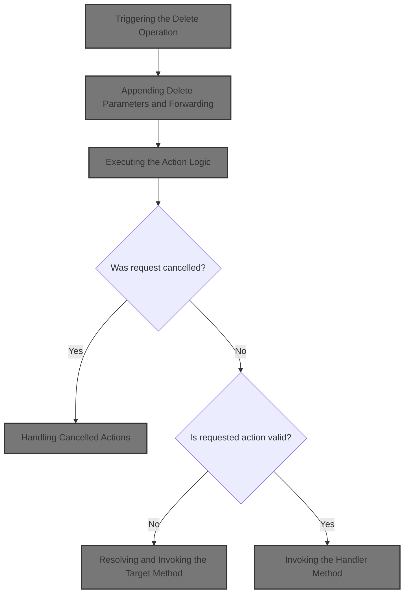
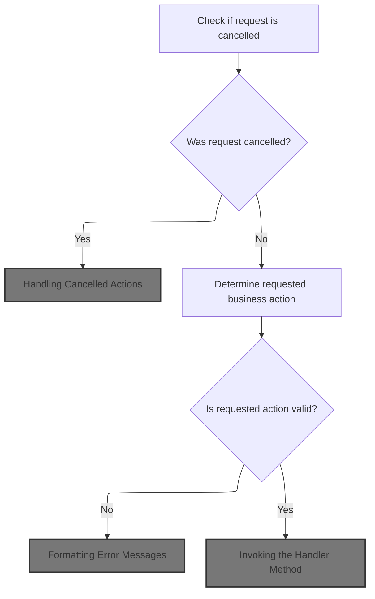
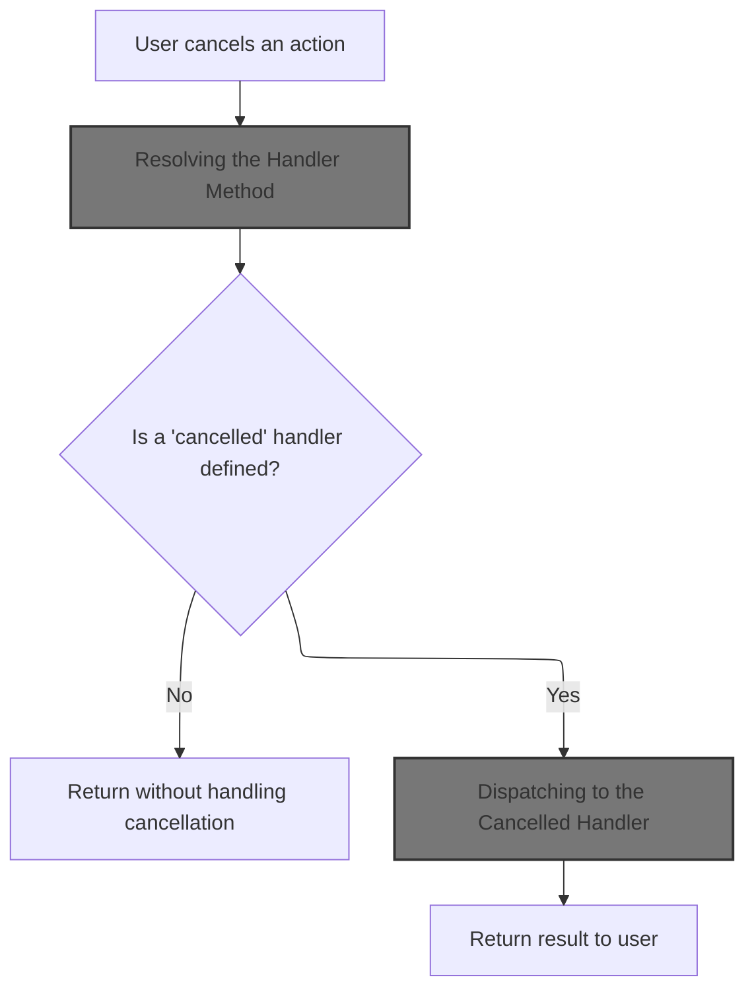
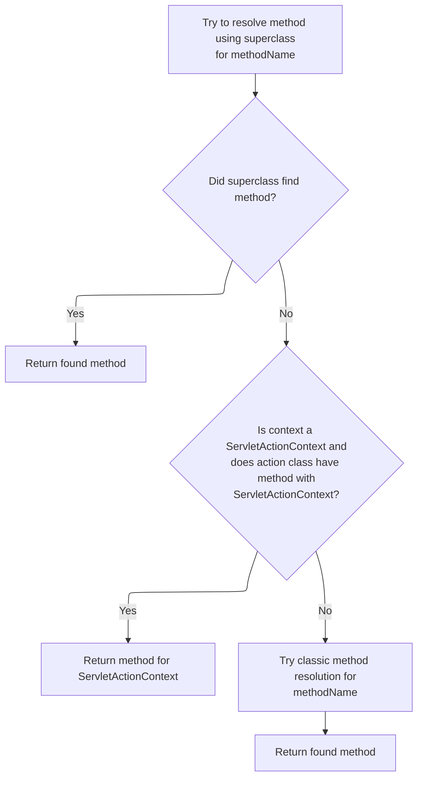
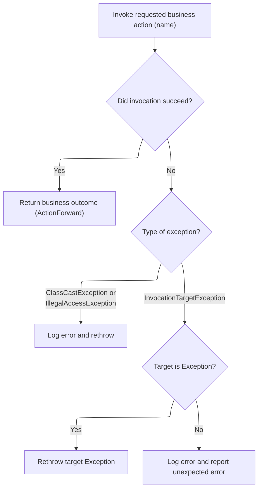
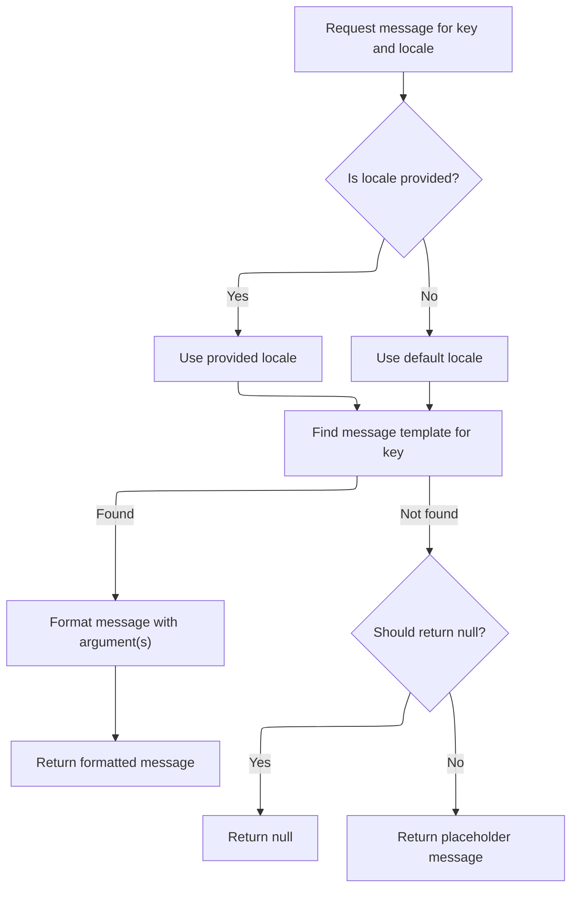
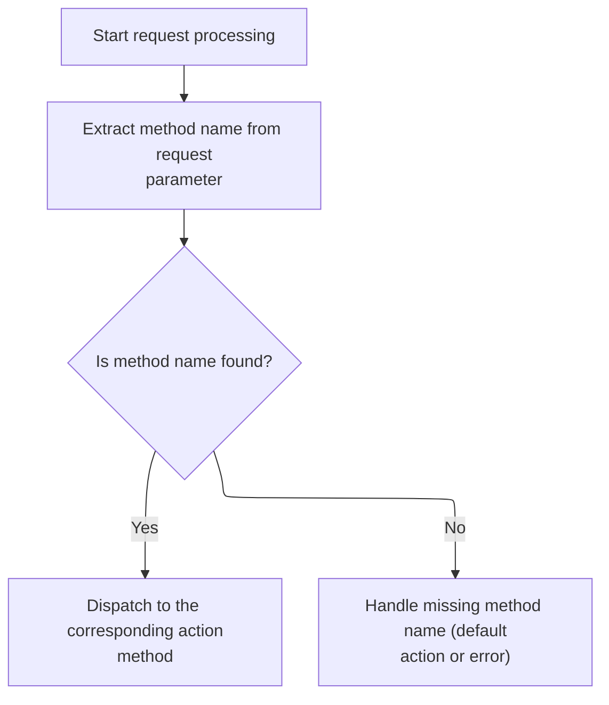
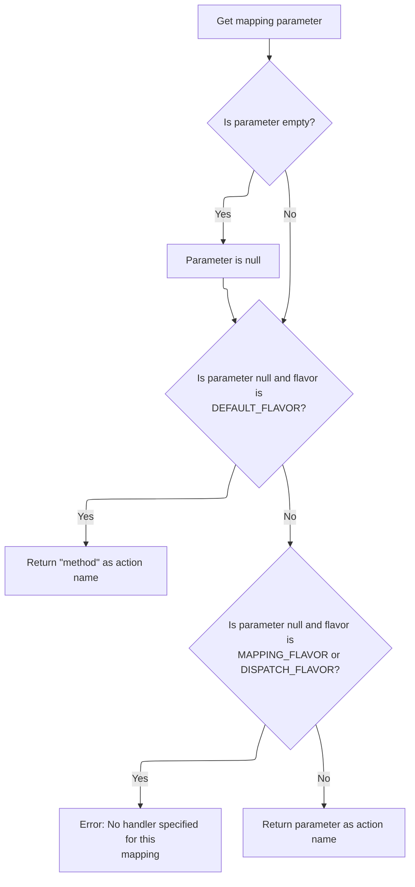
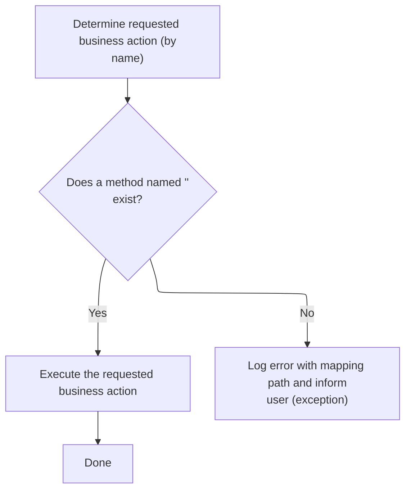

This document describes how users can delete a subscription. When a user chooses to delete, the system collects the necessary details and processes the request, ultimately removing the subscription and returning the result.



# Triggering the Delete Operation

<SwmSnippet path="/apps/faces-example1/src/main/java/org/apache/struts/webapp/example/RegistrationBacking.java" line="101">

---

In <SwmToken path="apps/faces-example1/src/main/java/org/apache/struts/webapp/example/RegistrationBacking.java" pos="101:5:5" line-data="    public String delete() {">`delete`</SwmToken>, we grab the <SwmToken path="apps/faces-example1/src/main/java/org/apache/struts/webapp/example/RegistrationBacking.java" pos="106:1:1" line-data="        FacesContext context = FacesContext.getCurrentInstance();">`FacesContext`</SwmToken>, then immediately call <SwmToken path="apps/faces-example1/src/main/java/org/apache/struts/webapp/example/RegistrationBacking.java" pos="107:7:10" line-data="        StringBuffer url = subscription(context);">`subscription(context)`</SwmToken> to start building the URL for the delete operation. This assumes the session map has a 'user' and the request map has a 'subscription'—if not, things break. We call into <SwmToken path="apps/faces-example1/src/main/java/org/apache/struts/webapp/example/RegistrationBacking.java" pos="36:8:8" line-data="public class RegistrationBacking extends AbstractBacking {">`AbstractBacking`</SwmToken> next to get the base URL for the subscription edit action before adding query params.

```java
    public String delete() {

        if (log.isDebugEnabled()) {
            log.debug("delete()");
        }
        FacesContext context = FacesContext.getCurrentInstance();
        StringBuffer url = subscription(context);
```

---

</SwmSnippet>

## Building the Subscription Action URL

<SwmSnippet path="/apps/faces-example1/src/main/java/org/apache/struts/webapp/example/AbstractBacking.java" line="124">

---

<SwmToken path="apps/faces-example1/src/main/java/org/apache/struts/webapp/example/AbstractBacking.java" pos="124:5:5" line-data="    protected StringBuffer subscription(FacesContext context) {">`subscription`</SwmToken> just wraps a call to <SwmToken path="apps/faces-example1/src/main/java/org/apache/struts/webapp/example/AbstractBacking.java" pos="126:4:13" line-data="        return (action(context, &quot;/editSubscription&quot;));">`action(context, "/editSubscription")`</SwmToken>, so it's basically a shortcut for getting the base URL for editing a subscription. We call <SwmToken path="apps/faces-example1/src/main/java/org/apache/struts/webapp/example/AbstractBacking.java" pos="126:4:4" line-data="        return (action(context, &quot;/editSubscription&quot;));">`action`</SwmToken> next to actually append the Struts action extension.

```java
    protected StringBuffer subscription(FacesContext context) {

        return (action(context, "/editSubscription"));

    }
```

---

</SwmSnippet>

<SwmSnippet path="/apps/faces-example1/src/main/java/org/apache/struts/webapp/example/AbstractBacking.java" line="47">

---

<SwmToken path="apps/faces-example1/src/main/java/org/apache/struts/webapp/example/AbstractBacking.java" pos="47:5:5" line-data="    protected StringBuffer action(FacesContext context, String action) {">`action`</SwmToken> takes the action path and blindly appends ".do" to it, following the Struts convention. No checks for existing extensions—if you pass something weird, you'll get a weird URL. The <SwmToken path="apps/faces-example1/src/main/java/org/apache/struts/webapp/example/AbstractBacking.java" pos="47:3:3" line-data="    protected StringBuffer action(FacesContext context, String action) {">`StringBuffer`</SwmToken> is just for mutability.

```java
    protected StringBuffer action(FacesContext context, String action) {

        // FIXME - assumes extension mapping for Struts
        StringBuffer sb = new StringBuffer(action);
        sb.append(".do");
        return (sb);

    }
```

---

</SwmSnippet>

## Appending Delete Parameters and Forwarding

<SwmSnippet path="/apps/faces-example1/src/main/java/org/apache/struts/webapp/example/RegistrationBacking.java" line="108">

---

Back in RegistrationBacking.delete, after getting the base URL from <SwmToken path="apps/faces-example1/src/main/java/org/apache/struts/webapp/example/RegistrationBacking.java" pos="36:8:8" line-data="public class RegistrationBacking extends AbstractBacking {">`AbstractBacking`</SwmToken>, we tack on the delete action and user/host parameters from the session/request maps. Then we call forward() to actually dispatch the request, and return null to stay on the same JSF page.

```java
        url.append("?action=Delete");
        url.append("&username=");
        User user = (User)
            context.getExternalContext().getSessionMap().get("user");
        url.append(user.getUsername());
        url.append("&host=");
        Subscription subscription = (Subscription)
            context.getExternalContext().getRequestMap().get("subscription");
        url.append(subscription.getHost());
        forward(context, url.toString());
        return (null);

    }
```

---

</SwmSnippet>

# Dispatching the Request

<SwmSnippet path="/apps/faces-example1/src/main/java/org/apache/struts/webapp/example/AbstractBacking.java" line="66">

---

<SwmToken path="apps/faces-example1/src/main/java/org/apache/struts/webapp/example/AbstractBacking.java" pos="66:5:5" line-data="    protected void forward(FacesContext context, String url) {">`forward`</SwmToken> uses the <SwmToken path="apps/faces-example1/src/main/java/org/apache/struts/webapp/example/AbstractBacking.java" pos="66:7:7" line-data="    protected void forward(FacesContext context, String url) {">`FacesContext`</SwmToken> to dispatch the request to the constructed URL. After dispatching, it marks the response as complete. The next step is handled by the Struts <SwmToken path="extras/src/main/java/org/apache/struts/actions/ActionDispatcher.java" pos="56:5:5" line-data=" *       protected ActionDispatcher dispatcher">`ActionDispatcher`</SwmToken>, which will process the forwarded request.

```java
    protected void forward(FacesContext context, String url) {

        try {
            context.getExternalContext().dispatch(url);
        } catch (IOException e) {
            throw new FacesException(e);
        } finally {
            context.responseComplete();
        }

    }
```

---

</SwmSnippet>

# Routing to the Action

<SwmSnippet path="/extras/src/main/java/org/apache/struts/actions/ActionDispatcher.java" line="507">

---

In <SwmToken path="extras/src/main/java/org/apache/struts/actions/ActionDispatcher.java" pos="507:5:5" line-data="    public Object dispatch(ActionContext context) throws Exception {">`dispatch`</SwmToken>, we cast the <SwmToken path="extras/src/main/java/org/apache/struts/actions/ActionDispatcher.java" pos="507:7:7" line-data="    public Object dispatch(ActionContext context) throws Exception {">`ActionContext`</SwmToken> to <SwmToken path="extras/src/main/java/org/apache/struts/actions/ActionDispatcher.java" pos="508:1:1" line-data="        ServletActionContext servletContext = (ServletActionContext) context;">`ServletActionContext`</SwmToken> and prep for the actual action execution. We need to grab the request and response objects next, which means calling into <SwmToken path="extras/src/main/java/org/apache/struts/actions/ActionDispatcher.java" pos="508:1:1" line-data="        ServletActionContext servletContext = (ServletActionContext) context;">`ServletActionContext`</SwmToken>.

```java
    public Object dispatch(ActionContext context) throws Exception {
        ServletActionContext servletContext = (ServletActionContext) context;
        return execute((ActionMapping) context.getActionConfig(), context.getActionForm(),
            servletContext.getRequest(), servletContext.getResponse());
```

---

</SwmSnippet>

## Extracting the HTTP Request

<SwmSnippet path="/core/src/main/java/org/apache/struts/chain/contexts/ServletActionContext.java" line="94">

---

<SwmToken path="core/src/main/java/org/apache/struts/chain/contexts/ServletActionContext.java" pos="94:5:5" line-data="    public HttpServletRequest getRequest() {">`getRequest`</SwmToken> just delegates to <SwmToken path="core/src/main/java/org/apache/struts/chain/contexts/ServletActionContext.java" pos="95:3:9" line-data="        return servletWebContext().getRequest();">`servletWebContext().getRequest()`</SwmToken>. We need to resolve the <SwmToken path="core/src/main/java/org/apache/struts/chain/contexts/ServletActionContext.java" pos="67:3:3" line-data="    protected ServletWebContext servletWebContext() {">`ServletWebContext`</SwmToken> instance next to actually get the raw <SwmToken path="core/src/main/java/org/apache/struts/chain/contexts/ServletActionContext.java" pos="94:3:3" line-data="    public HttpServletRequest getRequest() {">`HttpServletRequest`</SwmToken>.

```java
    public HttpServletRequest getRequest() {
        return servletWebContext().getRequest();
    }
```

---

</SwmSnippet>

<SwmSnippet path="/core/src/main/java/org/apache/struts/chain/contexts/ServletActionContext.java" line="67">

---

<SwmToken path="core/src/main/java/org/apache/struts/chain/contexts/ServletActionContext.java" pos="67:5:5" line-data="    protected ServletWebContext servletWebContext() {">`servletWebContext`</SwmToken> just casts the base context to <SwmToken path="core/src/main/java/org/apache/struts/chain/contexts/ServletActionContext.java" pos="67:3:3" line-data="    protected ServletWebContext servletWebContext() {">`ServletWebContext`</SwmToken>. If it's not the right type, you'll get a <SwmToken path="extras/src/main/java/org/apache/struts/actions/ActionDispatcher.java" pos="368:6:6" line-data="        } catch (ClassCastException e) {">`ClassCastException`</SwmToken>—no checks, just assumes the context is set up correctly.

```java
    protected ServletWebContext servletWebContext() {
        return (ServletWebContext) this.getBaseContext();
    }
```

---

</SwmSnippet>

## Passing Request and Response to the Action

<SwmSnippet path="/extras/src/main/java/org/apache/struts/actions/ActionDispatcher.java" line="509">

---

Back in ActionDispatcher.dispatch, after getting the request, we also need the response. So we call <SwmToken path="extras/src/main/java/org/apache/struts/actions/ActionDispatcher.java" pos="510:10:10" line-data="            servletContext.getRequest(), servletContext.getResponse());">`getResponse`</SwmToken> on <SwmToken path="extras/src/main/java/org/apache/struts/actions/ActionDispatcher.java" pos="508:1:1" line-data="        ServletActionContext servletContext = (ServletActionContext) context;">`ServletActionContext`</SwmToken> to complete the argument list for the action execution.

```java
        return execute((ActionMapping) context.getActionConfig(), context.getActionForm(),
            servletContext.getRequest(), servletContext.getResponse());
```

---

</SwmSnippet>

<SwmSnippet path="/core/src/main/java/org/apache/struts/chain/contexts/ServletActionContext.java" line="103">

---

<SwmToken path="core/src/main/java/org/apache/struts/chain/contexts/ServletActionContext.java" pos="103:5:5" line-data="    public HttpServletResponse getResponse() {">`getResponse`</SwmToken> just delegates to <SwmToken path="core/src/main/java/org/apache/struts/chain/contexts/ServletActionContext.java" pos="104:3:9" line-data="        return servletWebContext().getResponse();">`servletWebContext().getResponse()`</SwmToken>. We need to resolve the <SwmToken path="core/src/main/java/org/apache/struts/chain/contexts/ServletActionContext.java" pos="67:3:3" line-data="    protected ServletWebContext servletWebContext() {">`ServletWebContext`</SwmToken> instance again to get the raw <SwmToken path="core/src/main/java/org/apache/struts/chain/contexts/ServletActionContext.java" pos="103:3:3" line-data="    public HttpServletResponse getResponse() {">`HttpServletResponse`</SwmToken>.

```java
    public HttpServletResponse getResponse() {
        return servletWebContext().getResponse();
    }
```

---

</SwmSnippet>

<SwmSnippet path="/extras/src/main/java/org/apache/struts/actions/ActionDispatcher.java" line="509">

---

Back in ActionDispatcher.dispatch, with both request and response in hand, we call execute to actually run the mapped action logic.

```java
        return execute((ActionMapping) context.getActionConfig(), context.getActionForm(),
            servletContext.getRequest(), servletContext.getResponse());
    }
```

---

</SwmSnippet>

# Executing the Action Logic



<SwmSnippet path="/extras/src/main/java/org/apache/struts/actions/ActionDispatcher.java" line="197">

---

In <SwmToken path="extras/src/main/java/org/apache/struts/actions/ActionDispatcher.java" pos="197:5:5" line-data="    public ActionForward execute(ActionMapping mapping, ActionForm form,">`execute`</SwmToken>, we first check if the action was cancelled. If so, we call the cancelled handler. Next, we need to resolve which method to dispatch to, so we call cancelled.

```java
    public ActionForward execute(ActionMapping mapping, ActionForm form,
        HttpServletRequest request, HttpServletResponse response)
        throws Exception {
        // Process "cancelled"
        if (isCancelled(request)) {
            ActionForward af = cancelled(mapping, form, request, response);

            if (af != null) {
                return af;
            }
        }

```

---

</SwmSnippet>

## Handling Cancelled Actions



<SwmSnippet path="/extras/src/main/java/org/apache/struts/actions/ActionDispatcher.java" line="282">

---

In <SwmToken path="extras/src/main/java/org/apache/struts/actions/ActionDispatcher.java" pos="282:5:5" line-data="    protected ActionForward cancelled(ActionMapping mapping, ActionForm form,">`cancelled`</SwmToken>, we try to find a method named 'cancelled' using <SwmToken path="extras/src/main/java/org/apache/struts/actions/ActionDispatcher.java" pos="290:5:5" line-data="            method = getMethod(name);">`getMethod`</SwmToken>. If it's not found, we return null. Otherwise, we need to dispatch to the resolved method.

```java
    protected ActionForward cancelled(ActionMapping mapping, ActionForm form,
        HttpServletRequest request, HttpServletResponse response)
        throws Exception {
        // Identify if there is an "cancelled" method to be dispatched to
        String name = "cancelled";
        Method method = null;

        try {
            method = getMethod(name);
        } catch (NoSuchMethodException e) {
            return null;
        }

```

---

</SwmSnippet>

### Resolving the Handler Method

<SwmSnippet path="/extras/src/main/java/org/apache/struts/actions/ActionDispatcher.java" line="410">

---

<SwmToken path="extras/src/main/java/org/apache/struts/actions/ActionDispatcher.java" pos="410:5:5" line-data="    protected Method getMethod(String name)">`getMethod`</SwmToken> checks the cache for a Method object by name. If not found, it uses reflection to get it from the class and caches it. Next, we call into <SwmToken path="core/src/main/java/org/apache/struts/dispatcher/AbstractDispatcher.java" pos="43:6:6" line-data="public abstract class AbstractDispatcher implements Dispatcher, Serializable {">`AbstractDispatcher`</SwmToken> for more advanced method resolution.

```java
    protected Method getMethod(String name)
        throws NoSuchMethodException {
        synchronized (methods) {
            Method method = (Method) methods.get(name);

            if (method == null) {
                method = clazz.getMethod(name, types);
                methods.put(name, method);
            }

            return (method);
        }
    }
```

---

</SwmSnippet>

### Advanced Method Lookup

<SwmSnippet path="/core/src/main/java/org/apache/struts/dispatcher/AbstractDispatcher.java" line="203">

---

<SwmToken path="core/src/main/java/org/apache/struts/dispatcher/AbstractDispatcher.java" pos="203:7:7" line-data="    protected final Method getMethod(ActionContext context, String methodName) throws NoSuchMethodException {">`getMethod`</SwmToken> in <SwmToken path="core/src/main/java/org/apache/struts/dispatcher/AbstractDispatcher.java" pos="43:6:6" line-data="public abstract class AbstractDispatcher implements Dispatcher, Serializable {">`AbstractDispatcher`</SwmToken> builds a cache key from the action class and method name, checks the cache, and if missing, calls <SwmToken path="core/src/main/java/org/apache/struts/dispatcher/AbstractDispatcher.java" pos="215:5:5" line-data="                method = resolveMethod(context, methodName);">`resolveMethod`</SwmToken> to actually find the method. We call <SwmToken path="core/src/main/java/org/apache/struts/dispatcher/AbstractDispatcher.java" pos="215:5:5" line-data="                method = resolveMethod(context, methodName);">`resolveMethod`</SwmToken> next for the actual lookup.

```java
    protected final Method getMethod(ActionContext context, String methodName) throws NoSuchMethodException {
        synchronized (methods) {
            // Key the method based on the class-method combination
            StringBuffer keyBuf = new StringBuffer(100);
            keyBuf.append(context.getAction().getClass().getName());
            keyBuf.append(":");
            keyBuf.append(methodName);
            String key = keyBuf.toString();

            Method method = (Method) methods.get(key);

            if (method == null) {
                method = resolveMethod(context, methodName);
                methods.put(key, method);
            }

            return method;
        }
    }
```

---

</SwmSnippet>

### Resolving the Method Implementation

<SwmSnippet path="/core/src/main/java/org/apache/struts/dispatcher/AbstractDispatcher.java" line="288">

---

<SwmToken path="core/src/main/java/org/apache/struts/dispatcher/AbstractDispatcher.java" pos="288:3:3" line-data="    Method resolveMethod(ActionContext context, String methodName) throws NoSuchMethodException {">`resolveMethod`</SwmToken> just delegates to the <SwmToken path="core/src/main/java/org/apache/struts/dispatcher/AbstractDispatcher.java" pos="289:3:3" line-data="        return methodResolver.resolveMethod(context, methodName);">`methodResolver`</SwmToken>, which could have custom logic for servlet actions. We call into <SwmToken path="core/src/main/java/org/apache/struts/dispatcher/servlet/ServletMethodResolver.java" pos="49:4:4" line-data="public class ServletMethodResolver extends AbstractMethodResolver {">`ServletMethodResolver`</SwmToken> next for the actual method resolution.

```java
    Method resolveMethod(ActionContext context, String methodName) throws NoSuchMethodException {
        return methodResolver.resolveMethod(context, methodName);
    }
```

---

</SwmSnippet>

### Servlet-Specific Method Resolution



<SwmSnippet path="/core/src/main/java/org/apache/struts/dispatcher/servlet/ServletMethodResolver.java" line="110">

---

In <SwmToken path="core/src/main/java/org/apache/struts/dispatcher/servlet/ServletMethodResolver.java" pos="110:5:5" line-data="    public Method resolveMethod(ActionContext context, String methodName) throws NoSuchMethodException {">`resolveMethod`</SwmToken>, we first try the superclass's method resolution. If that fails, and if the context is a <SwmToken path="extras/src/main/java/org/apache/struts/actions/ActionDispatcher.java" pos="508:1:1" line-data="        ServletActionContext servletContext = (ServletActionContext) context;">`ServletActionContext`</SwmToken>, we look for a method that takes <SwmToken path="extras/src/main/java/org/apache/struts/actions/ActionDispatcher.java" pos="508:1:1" line-data="        ServletActionContext servletContext = (ServletActionContext) context;">`ServletActionContext`</SwmToken> as a parameter. If that still doesn't work, we fall back to the classic method signature. Next, we call <SwmToken path="core/src/main/java/org/apache/struts/dispatcher/servlet/ServletMethodResolver.java" pos="105:7:7" line-data="    protected final Method resolveClassicMethod(ActionContext context, String methodName) throws NoSuchMethodException {">`resolveClassicMethod`</SwmToken> for the last attempt.

```java
    public Method resolveMethod(ActionContext context, String methodName) throws NoSuchMethodException {
        // First try to resolve anything the superclass supports
        try {
            return super.resolveMethod(context, methodName);
        } catch (NoSuchMethodException e) {
            // continue
        }

```

---

</SwmSnippet>

<SwmSnippet path="/core/src/main/java/org/apache/struts/dispatcher/servlet/ServletMethodResolver.java" line="118">

---

Back in ServletMethodResolver.resolveMethod, if the context is a <SwmToken path="core/src/main/java/org/apache/struts/dispatcher/servlet/ServletMethodResolver.java" pos="119:8:8" line-data="        if (context instanceof ServletActionContext) {">`ServletActionContext`</SwmToken>, we try to find a method that takes it as a parameter. If not found, we keep going to classic method resolution.

```java
        // Can the method accept the servlet action context?
        if (context instanceof ServletActionContext) {
            try {
                Class actionClass = context.getAction().getClass();
                return actionClass.getMethod(methodName, new Class[] { ServletActionContext.class });
            } catch (NoSuchMethodException e) {
                // continue
            }
        }

```

---

</SwmSnippet>

<SwmSnippet path="/core/src/main/java/org/apache/struts/dispatcher/servlet/ServletMethodResolver.java" line="128">

---

Back in ServletMethodResolver.resolveMethod, if all else fails, we call <SwmToken path="core/src/main/java/org/apache/struts/dispatcher/servlet/ServletMethodResolver.java" pos="129:3:3" line-data="        return resolveClassicMethod(context, methodName);">`resolveClassicMethod`</SwmToken> to look for a method with the classic signature. This is the last step in the method resolution chain.

```java
        // Lastly, try the classical argument listing
        return resolveClassicMethod(context, methodName);
    }
```

---

</SwmSnippet>

<SwmSnippet path="/core/src/main/java/org/apache/struts/dispatcher/servlet/ServletMethodResolver.java" line="105">

---

<SwmToken path="core/src/main/java/org/apache/struts/dispatcher/servlet/ServletMethodResolver.java" pos="105:7:7" line-data="    protected final Method resolveClassicMethod(ActionContext context, String methodName) throws NoSuchMethodException {">`resolveClassicMethod`</SwmToken> looks for a method with the classic Struts signature (<SwmToken path="core/src/main/java/org/apache/struts/dispatcher/servlet/ServletMethodResolver.java" pos="105:9:9" line-data="    protected final Method resolveClassicMethod(ActionContext context, String methodName) throws NoSuchMethodException {">`ActionContext`</SwmToken>, String). If found, we're done with method resolution and can return to the dispatcher.

```java
    protected final Method resolveClassicMethod(ActionContext context, String methodName) throws NoSuchMethodException {
        Class actionClass = context.getAction().getClass();
        return actionClass.getMethod(methodName, CLASSIC_EXECUTE_SIGNATURE);
    }
```

---

</SwmSnippet>

### Dispatching to the Cancelled Handler

<SwmSnippet path="/extras/src/main/java/org/apache/struts/actions/ActionDispatcher.java" line="295">

---

Back in ActionDispatcher.cancelled, after resolving the method, we call <SwmToken path="extras/src/main/java/org/apache/struts/actions/ActionDispatcher.java" pos="295:3:3" line-data="        return dispatchMethod(mapping, form, request, response, name, method);">`dispatchMethod`</SwmToken> to actually invoke the handler for the cancelled action. This is where the framework hands off to the user-defined logic for handling cancellation.

```java
        return dispatchMethod(mapping, form, request, response, name, method);
    }
```

---

</SwmSnippet>

## Invoking the Handler Method



<SwmSnippet path="/extras/src/main/java/org/apache/struts/actions/ActionDispatcher.java" line="358">

---

<SwmToken path="extras/src/main/java/org/apache/struts/actions/ActionDispatcher.java" pos="358:5:5" line-data="    protected ActionForward dispatchMethod(ActionMapping mapping,">`dispatchMethod`</SwmToken> uses reflection to call the resolved handler with the expected four arguments. If the return type is wrong or invocation fails, it logs an error using <SwmToken path="extras/src/main/java/org/apache/struts/actions/ActionDispatcher.java" pos="33:10:10" line-data="import org.apache.struts.util.MessageResources;">`MessageResources`</SwmToken>, which is why we call into that next.

```java
    protected ActionForward dispatchMethod(ActionMapping mapping,
        ActionForm form, HttpServletRequest request,
        HttpServletResponse response, String name, Method method)
        throws Exception {
        ActionForward forward = null;

        try {
            Object[] args = { mapping, form, request, response };

            forward = (ActionForward) method.invoke(actionInstance, args);
        } catch (ClassCastException e) {
            String message =
                messages.getMessage("dispatch.return", mapping.getPath(), name);

            log.error(message, e);
            throw e;
        } catch (IllegalAccessException e) {
            String message =
                messages.getMessage("dispatch.error", mapping.getPath(), name);

            log.error(message, e);
            throw e;
        } catch (InvocationTargetException e) {
            // Rethrow the target exception if possible so that the
            // exception handling machinery can deal with it
            Throwable t = e.getTargetException();

            if (t instanceof Exception) {
                throw ((Exception) t);
            } else {
                String message =
                    messages.getMessage("dispatch.error", mapping.getPath(),
                        name);

                log.error(message, e);
                throw new ServletException(t);
            }
        }

        // Return the returned ActionForward instance
        return (forward);
    }
```

---

</SwmSnippet>

## Formatting Error Messages



<SwmSnippet path="/core/src/main/java/org/apache/struts/util/MessageResources.java" line="324">

---

<SwmToken path="core/src/main/java/org/apache/struts/util/MessageResources.java" pos="324:5:5" line-data="    public String getMessage(Locale locale, String key, Object arg0) {">`getMessage`</SwmToken> (single argument) just wraps the multi-argument version, passing the argument as a single-element array. We call the main <SwmToken path="core/src/main/java/org/apache/struts/util/MessageResources.java" pos="324:5:5" line-data="    public String getMessage(Locale locale, String key, Object arg0) {">`getMessage`</SwmToken> method next for the actual formatting.

```java
    public String getMessage(Locale locale, String key, Object arg0) {
        return this.getMessage(locale, key, new Object[] { arg0 });
    }
```

---

</SwmSnippet>

<SwmSnippet path="/core/src/main/java/org/apache/struts/util/MessageResources.java" line="286">

---

<SwmToken path="core/src/main/java/org/apache/struts/util/MessageResources.java" pos="286:5:5" line-data="    public String getMessage(Locale locale, String key, Object[] args) {">`getMessage`</SwmToken> (multi-argument) handles message formatting and caching. It checks the cache for a <SwmToken path="core/src/main/java/org/apache/struts/util/MessageResources.java" pos="287:5:5" line-data="        // Cache MessageFormat instances as they are accessed">`MessageFormat`</SwmToken>, creates and caches one if missing, and formats the message. Handles null locales and missing messages with fallbacks.

```java
    public String getMessage(Locale locale, String key, Object[] args) {
        // Cache MessageFormat instances as they are accessed
        if (locale == null) {
            locale = defaultLocale;
        }

        MessageFormat format = null;
        String formatKey = messageKey(locale, key);

        synchronized (formats) {
            format = (MessageFormat) formats.get(formatKey);

            if (format == null) {
                String formatString = getMessage(locale, key);

                if (formatString == null) {
                    return returnNull ? null : ("???" + formatKey + "???");
                }

                format = new MessageFormat(escape(formatString));
                format.setLocale(locale);
                formats.put(formatKey, format);
            }
        }

        return format.format(args);
    }
```

---

</SwmSnippet>

## Determining the Method Parameter



<SwmSnippet path="/extras/src/main/java/org/apache/struts/actions/ActionDispatcher.java" line="209">

---

Here, after coming back from ActionDispatcher.cancelled, we call ActionDispatcher.getParameter to figure out which request parameter should be used to determine the action method. This is where the framework decides how to map the incoming request to a handler method, which is why we need to call <SwmToken path="extras/src/main/java/org/apache/struts/actions/ActionDispatcher.java" pos="210:7:7" line-data="        String parameter = getParameter(mapping, form, request, response);">`getParameter`</SwmToken> next.

```java
        // Identify the request parameter containing the method name
        String parameter = getParameter(mapping, form, request, response);

```

---

</SwmSnippet>

## Resolving the Dispatch Parameter Name



<SwmSnippet path="/extras/src/main/java/org/apache/struts/actions/ActionDispatcher.java" line="435">

---

GetParameter handles the logic for figuring out which parameter name to use for method dispatch. It checks the mapping, handles empty strings, and then uses the 'flavor' variable to decide if it should return a default, throw, or just use the value. If it needs to throw, it calls MessageResources.getMessage to format the error message before logging and throwing. That's why we need to call MessageResources.getMessage next.

```java
    protected String getParameter(ActionMapping mapping, ActionForm form,
        HttpServletRequest request, HttpServletResponse response)
        throws Exception {
        String parameter = mapping.getParameter();

        if ("".equals(parameter)) {
            parameter = null;
        }

        if ((parameter == null) && (flavor == DEFAULT_FLAVOR)) {
            // use "method" for DEFAULT_FLAVOR if no parameter was provided
            return "method";
        }

        if ((parameter == null)
            && ((flavor == MAPPING_FLAVOR) || (flavor == DISPATCH_FLAVOR))) {
            String message =
                messages.getMessage("dispatch.handler", mapping.getPath());

            log.error(message);

            throw new ServletException(message);
        }

        return parameter;
    }
```

---

</SwmSnippet>

<SwmSnippet path="/core/src/main/java/org/apache/struts/util/MessageResources.java" line="218">

---

GetMessage (single argument) just wraps the argument and calls the main <SwmToken path="core/src/main/java/org/apache/struts/util/MessageResources.java" pos="218:5:5" line-data="    public String getMessage(String key, Object arg0) {">`getMessage`</SwmToken> method. This is where message formatting, localization, and caching happen, so we call into the main <SwmToken path="core/src/main/java/org/apache/struts/util/MessageResources.java" pos="218:5:5" line-data="    public String getMessage(String key, Object arg0) {">`getMessage`</SwmToken> logic next.

```java
    public String getMessage(String key, Object arg0) {
        return this.getMessage((Locale) null, key, arg0);
    }
```

---

</SwmSnippet>

## Extracting the Handler Method Name

<SwmSnippet path="/extras/src/main/java/org/apache/struts/actions/ActionDispatcher.java" line="212">

---

Next, after returning from <SwmToken path="extras/src/main/java/org/apache/struts/actions/ActionDispatcher.java" pos="210:7:7" line-data="        String parameter = getParameter(mapping, form, request, response);">`getParameter`</SwmToken>, we call ActionDispatcher.getMethodName to actually extract the handler method name from the request or mapping. This step is needed to support different dispatch strategies and customizations.

```java
        // Get the method's name. This could be overridden in subclasses.
        String name =
            getMethodName(mapping, form, request, response, parameter);

```

---

</SwmSnippet>

<SwmSnippet path="/extras/src/main/java/org/apache/struts/actions/ActionDispatcher.java" line="474">

---

GetMethodName checks the 'flavor' variable again. For <SwmToken path="extras/src/main/java/org/apache/struts/actions/ActionDispatcher.java" pos="478:8:8" line-data="        if (flavor == MAPPING_FLAVOR) {">`MAPPING_FLAVOR`</SwmToken>, it just returns the parameter. Otherwise, it looks up the method name in the request parameters. This lets the framework support both static and dynamic dispatching. We call back into ActionDispatcher.execute next to continue the flow.

```java
    protected String getMethodName(ActionMapping mapping, ActionForm form,
        HttpServletRequest request, HttpServletResponse response,
        String parameter) throws Exception {
        // "Mapping" flavor, defaults to "method"
        if (flavor == MAPPING_FLAVOR) {
            return parameter;
        }

        // default behaviour
        return request.getParameter(parameter);
    }
```

---

</SwmSnippet>

<SwmSnippet path="/extras/src/main/java/org/apache/struts/actions/ActionDispatcher.java" line="216">

---

After getting the method name, we check if it's 'execute' or 'perform' to prevent recursion. If so, we call MessageResources.getMessage to format an error message, log it, and throw. That's why we need to call MessageResources.getMessage next.

```java
        // Prevent recursive calls
        if ("execute".equals(name) || "perform".equals(name)) {
            String message =
                messages.getMessage("dispatch.recursive", mapping.getPath());

            log.error(message);
            throw new ServletException(message);
        }

```

---

</SwmSnippet>

<SwmSnippet path="/extras/src/main/java/org/apache/struts/actions/ActionDispatcher.java" line="225">

---

After validating the method name, we call ActionDispatcher.dispatchMethod to actually invoke the handler method. This is where the request is finally routed to the user-defined action logic.

```java
        // Invoke the named method, and return the result
        return dispatchMethod(mapping, form, request, response, name);
    }
```

---

</SwmSnippet>

# Invoking the Handler via Reflection

<SwmSnippet path="/extras/src/main/java/org/apache/struts/actions/ActionDispatcher.java" line="313">

---

In <SwmToken path="extras/src/main/java/org/apache/struts/actions/ActionDispatcher.java" pos="313:5:5" line-data="    protected ActionForward dispatchMethod(ActionMapping mapping,">`dispatchMethod`</SwmToken>, if the method name is null (maybe the user hacked the query string), we call unspecified to look for a fallback handler. This keeps the flow from breaking on missing method names.

```java
    protected ActionForward dispatchMethod(ActionMapping mapping,
        ActionForm form, HttpServletRequest request,
        HttpServletResponse response, String name)
        throws Exception {
        // Make sure we have a valid method name to call.
        // This may be null if the user hacks the query string.
        if (name == null) {
            return this.unspecified(mapping, form, request, response);
        }

```

---

</SwmSnippet>

## Fallback to the Unspecified Handler

<SwmSnippet path="/extras/src/main/java/org/apache/struts/actions/ActionDispatcher.java" line="245">

---

In unspecified, we try to find a method named 'unspecified' to use as a fallback. If it's not there, we need to handle the error, which means calling <SwmToken path="extras/src/main/java/org/apache/struts/actions/ActionDispatcher.java" pos="253:5:5" line-data="            method = getMethod(name);">`getMethod`</SwmToken> and possibly logging and throwing next.

```java
    protected ActionForward unspecified(ActionMapping mapping, ActionForm form,
        HttpServletRequest request, HttpServletResponse response)
        throws Exception {
        // Identify if there is an "unspecified" method to be dispatched to
        String name = "unspecified";
        Method method = null;

        try {
            method = getMethod(name);
```

---

</SwmSnippet>

<SwmSnippet path="/extras/src/main/java/org/apache/struts/actions/ActionDispatcher.java" line="254">

---

After trying to find the 'unspecified' handler, if it's missing, we call MessageResources.getMessage to format an error message, log it, and throw. That's why we need to call MessageResources.getMessage next.

```java
        } catch (NoSuchMethodException e) {
            String message =
                messages.getMessage("dispatch.parameter", mapping.getPath(),
                    mapping.getParameter());
```

---

</SwmSnippet>

<SwmSnippet path="/extras/src/main/java/org/apache/struts/actions/ActionDispatcher.java" line="256">

---

Here, MessageResources.getMessage is called to build an error message with the mapping path and parameter. This helps log exactly what went wrong before throwing the exception.

```java
                messages.getMessage("dispatch.parameter", mapping.getPath(),
                    mapping.getParameter());

            log.error(message);

            throw new ServletException(message, e);
        }

```

---

</SwmSnippet>

<SwmSnippet path="/extras/src/main/java/org/apache/struts/actions/ActionDispatcher.java" line="264">

---

After logging and throwing if the handler is missing, if the handler exists, we call <SwmToken path="extras/src/main/java/org/apache/struts/actions/ActionDispatcher.java" pos="264:3:3" line-data="        return dispatchMethod(mapping, form, request, response, name, method);">`dispatchMethod`</SwmToken> with the resolved method to actually invoke it. This is the last step in unspecified.

```java
        return dispatchMethod(mapping, form, request, response, name, method);
    }
```

---

</SwmSnippet>

## Resolving and Invoking the Target Method



<SwmSnippet path="/extras/src/main/java/org/apache/struts/actions/ActionDispatcher.java" line="323">

---

After coming back from unspecified, we try to resolve the Method object for the handler by calling <SwmToken path="extras/src/main/java/org/apache/struts/actions/ActionDispatcher.java" pos="327:5:5" line-data="            method = getMethod(name);">`getMethod`</SwmToken>. If it fails, we need to log and handle the error, so we call MessageResources.getMessage next.

```java
        // Identify the method object to be dispatched to
        Method method = null;

        try {
            method = getMethod(name);
```

---

</SwmSnippet>

<SwmSnippet path="/extras/src/main/java/org/apache/struts/actions/ActionDispatcher.java" line="328">

---

If <SwmToken path="extras/src/main/java/org/apache/struts/actions/ActionDispatcher.java" pos="253:5:5" line-data="            method = getMethod(name);">`getMethod`</SwmToken> fails, we call MessageResources.getMessage to build an error message with the mapping path and method name. This helps log exactly which handler was missing.

```java
        } catch (NoSuchMethodException e) {
            String message =
                messages.getMessage("dispatch.method", mapping.getPath(), name);

            log.error(message, e);

```

---

</SwmSnippet>

<SwmSnippet path="/extras/src/main/java/org/apache/struts/actions/ActionDispatcher.java" line="334">

---

After logging the technical error, we call MessageResources.getMessage again to build a user-facing error message, wrap it in a new exception, and throw it. This gives both a detailed log and a clear exception for whoever's debugging.

```java
            String userMsg =
                messages.getMessage("dispatch.method.user", mapping.getPath());
            NoSuchMethodException e2 = new NoSuchMethodException(userMsg);
            e2.initCause(e);
            throw e2;
        }

        return dispatchMethod(mapping, form, request, response, name, method);
    }
```

---

</SwmSnippet>

&nbsp;

*This is an auto-generated document by Swimm 🌊 and has not yet been verified by a human*

<SwmMeta version="3.0.0" repo-id="Z2l0aHViJTNBJTNBc3RydXRzMSUzQSUzQVN3aW1tLURlbW8=" repo-name="struts1"><sup>Powered by [Swimm](https://app.swimm.io/)</sup></SwmMeta>
