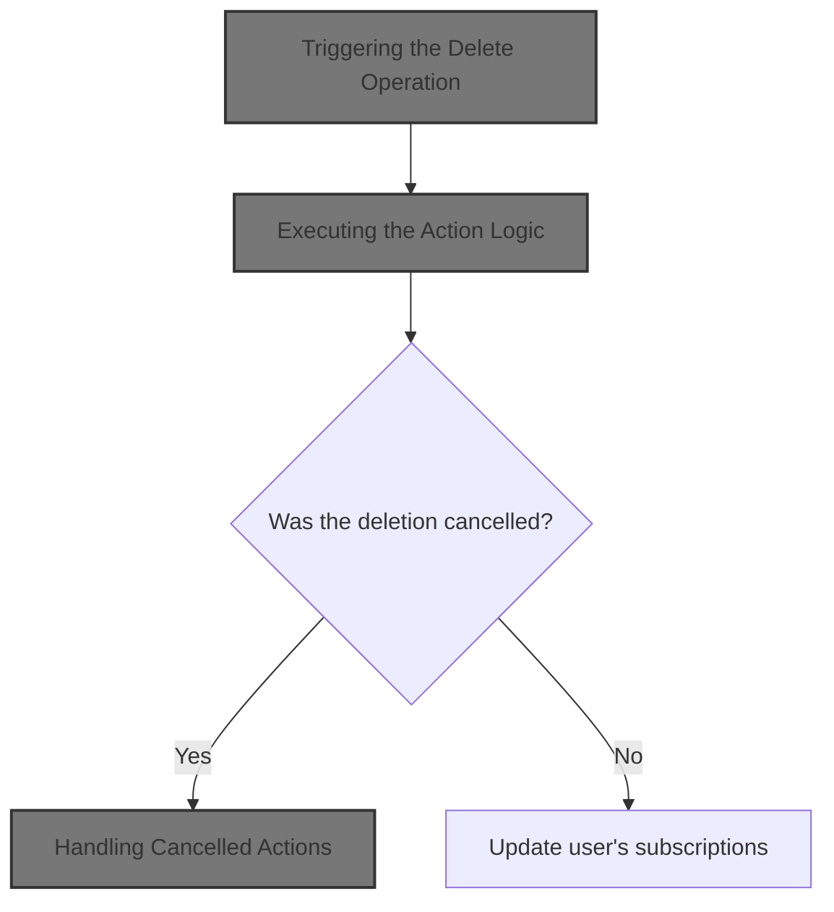
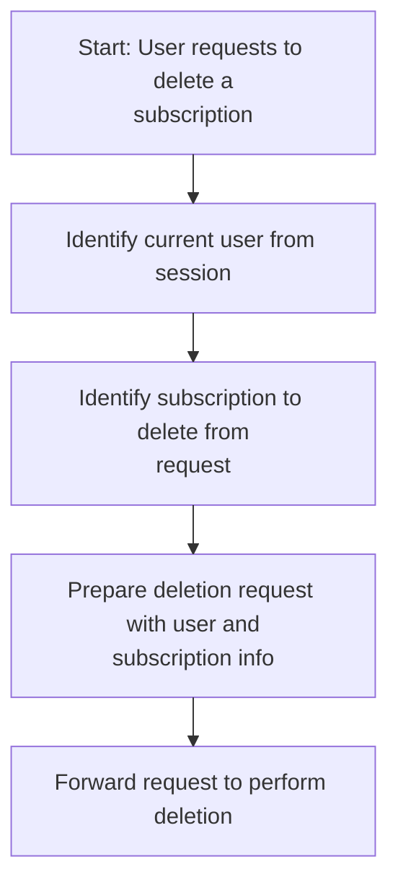
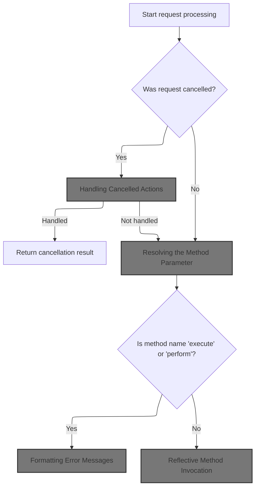
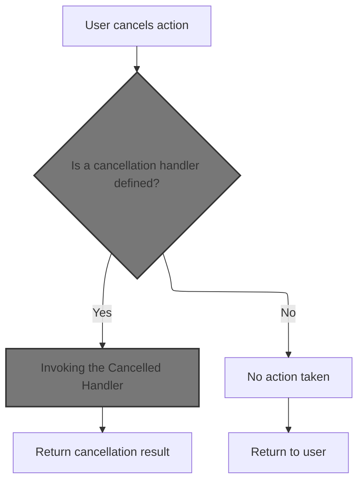
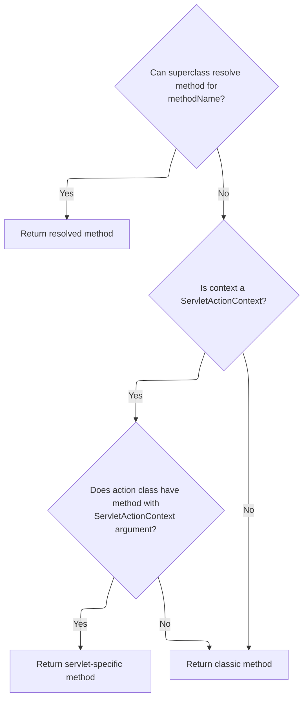
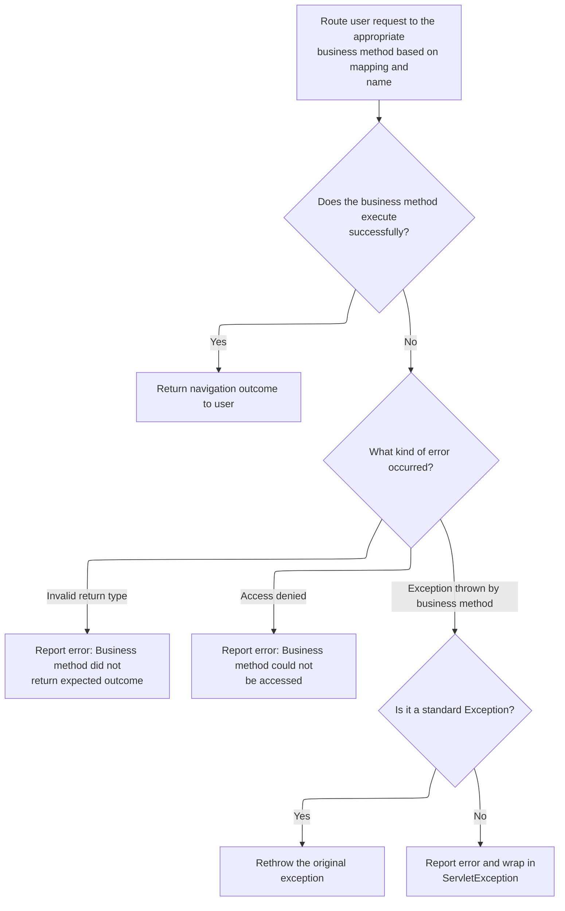
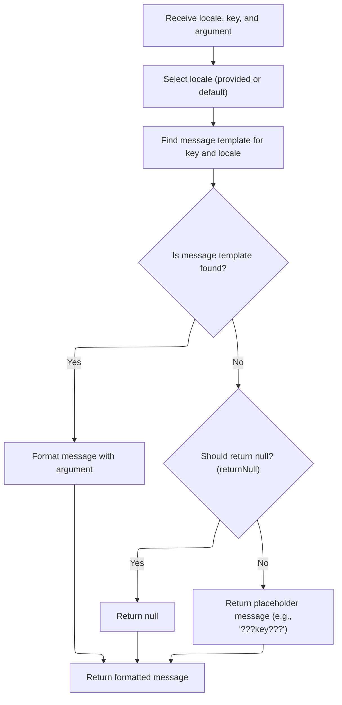
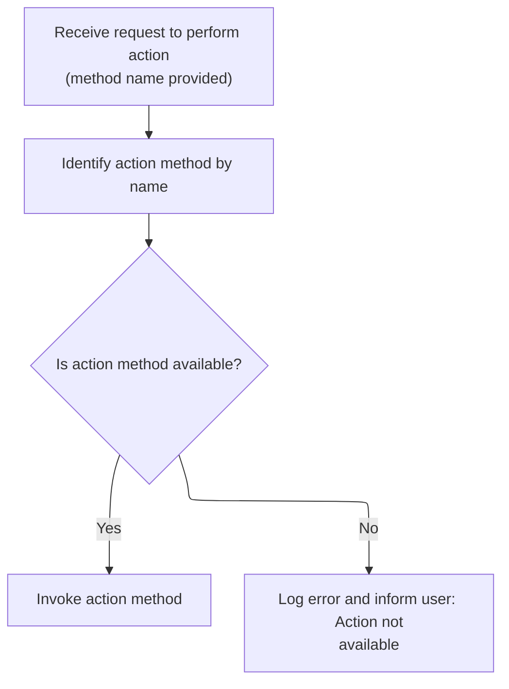

This document describes how users can delete a subscription. When a user initiates a deletion, the system identifies the user and the subscription, processes the deletion request, and updates the user's subscriptions.



# Triggering the Delete Operation

<SwmSnippet path="/apps/faces-example1/src/main/java/org/apache/struts/webapp/example/RegistrationBacking.java" line="101">

---

In <SwmToken path="apps/faces-example1/src/main/java/org/apache/struts/webapp/example/RegistrationBacking.java" pos="101:5:5" line-data="    public String delete() {">`delete`</SwmToken>, we grab the current <SwmToken path="apps/faces-example1/src/main/java/org/apache/struts/webapp/example/RegistrationBacking.java" pos="106:1:1" line-data="        FacesContext context = FacesContext.getCurrentInstance();">`FacesContext`</SwmToken> and start building the URL for the delete action. The next step calls <SwmToken path="apps/faces-example1/src/main/java/org/apache/struts/webapp/example/RegistrationBacking.java" pos="107:7:10" line-data="        StringBuffer url = subscription(context);">`subscription(context)`</SwmToken> from <SwmToken path="apps/faces-example1/src/main/java/org/apache/struts/webapp/example/RegistrationBacking.java" pos="36:8:8" line-data="public class RegistrationBacking extends AbstractBacking {">`AbstractBacking`</SwmToken> to get the base URL for the subscription edit action, which we then modify for the delete operation. This sets up the URL before adding the delete-specific query parameters.

```java
    public String delete() {

        if (log.isDebugEnabled()) {
            log.debug("delete()");
        }
        FacesContext context = FacesContext.getCurrentInstance();
        StringBuffer url = subscription(context);
```

---

</SwmSnippet>

## Building the Subscription Action URL

<SwmSnippet path="/apps/faces-example1/src/main/java/org/apache/struts/webapp/example/AbstractBacking.java" line="124">

---

<SwmToken path="apps/faces-example1/src/main/java/org/apache/struts/webapp/example/AbstractBacking.java" pos="124:5:5" line-data="    protected StringBuffer subscription(FacesContext context) {">`subscription`</SwmToken> just wraps a call to <SwmToken path="apps/faces-example1/src/main/java/org/apache/struts/webapp/example/AbstractBacking.java" pos="126:4:4" line-data="        return (action(context, &quot;/editSubscription&quot;));">`action`</SwmToken>, passing in the context and the <SwmToken path="apps/faces-example1/src/main/java/org/apache/struts/webapp/example/AbstractBacking.java" pos="126:10:11" line-data="        return (action(context, &quot;/editSubscription&quot;));">`/editSubscription`</SwmToken> path. This gives us the base URL for any subscription operation, which we then customize for delete or other actions.

```java
    protected StringBuffer subscription(FacesContext context) {

        return (action(context, "/editSubscription"));

    }
```

---

</SwmSnippet>

<SwmSnippet path="/apps/faces-example1/src/main/java/org/apache/struts/webapp/example/AbstractBacking.java" line="47">

---

<SwmToken path="apps/faces-example1/src/main/java/org/apache/struts/webapp/example/AbstractBacking.java" pos="47:5:5" line-data="    protected StringBuffer action(FacesContext context, String action) {">`action`</SwmToken> takes the action path and appends '.do' to it, following the Struts convention for action URLs. It doesn't check if '.do' is already present, so the input has to be clean.

```java
    protected StringBuffer action(FacesContext context, String action) {

        // FIXME - assumes extension mapping for Struts
        StringBuffer sb = new StringBuffer(action);
        sb.append(".do");
        return (sb);

    }
```

---

</SwmSnippet>

## Completing the Delete URL and Forwarding



<SwmSnippet path="/apps/faces-example1/src/main/java/org/apache/struts/webapp/example/RegistrationBacking.java" line="108">

---

Back in `RegistrationBacking.delete`, after getting the base URL from <SwmToken path="apps/faces-example1/src/main/java/org/apache/struts/webapp/example/RegistrationBacking.java" pos="36:8:8" line-data="public class RegistrationBacking extends AbstractBacking {">`AbstractBacking`</SwmToken>, we append the delete action and user/subscription info as query parameters, then forward to that URL. The function assumes both 'user' and 'subscription' are present in the session/request maps, and returns null to keep the current JSF page.

```java
        url.append("?action=Delete");
        url.append("&username=");
        User user = (User)
            context.getExternalContext().getSessionMap().get("user");
        url.append(user.getUsername());
        url.append("&host=");
        Subscription subscription = (Subscription)
            context.getExternalContext().getRequestMap().get("subscription");
        url.append(subscription.getHost());
        forward(context, url.toString());
        return (null);

    }
```

---

</SwmSnippet>

# Dispatching the Request

<SwmSnippet path="/apps/faces-example1/src/main/java/org/apache/struts/webapp/example/AbstractBacking.java" line="66">

---

<SwmToken path="apps/faces-example1/src/main/java/org/apache/struts/webapp/example/AbstractBacking.java" pos="66:5:5" line-data="    protected void forward(FacesContext context, String url) {">`forward`</SwmToken> calls the <SwmToken path="apps/faces-example1/src/main/java/org/apache/struts/webapp/example/AbstractBacking.java" pos="66:7:7" line-data="    protected void forward(FacesContext context, String url) {">`FacesContext`</SwmToken>'s dispatch method to forward the request to the constructed URL. If there's an error, it wraps it in a <SwmToken path="apps/faces-example1/src/main/java/org/apache/struts/webapp/example/AbstractBacking.java" pos="71:5:5" line-data="            throw new FacesException(e);">`FacesException`</SwmToken>, and always marks the response as complete. The next step is handled by the Struts <SwmToken path="extras/src/main/java/org/apache/struts/actions/ActionDispatcher.java" pos="56:5:5" line-data=" *       protected ActionDispatcher dispatcher">`ActionDispatcher`</SwmToken>.

```java
    protected void forward(FacesContext context, String url) {

        try {
            context.getExternalContext().dispatch(url);
        } catch (IOException e) {
            throw new FacesException(e);
        } finally {
            context.responseComplete();
        }

    }
```

---

</SwmSnippet>

# Routing to the Action Handler

<SwmSnippet path="/extras/src/main/java/org/apache/struts/actions/ActionDispatcher.java" line="507">

---

In <SwmToken path="extras/src/main/java/org/apache/struts/actions/ActionDispatcher.java" pos="507:5:5" line-data="    public Object dispatch(ActionContext context) throws Exception {">`dispatch`</SwmToken>, we cast the context to <SwmToken path="extras/src/main/java/org/apache/struts/actions/ActionDispatcher.java" pos="508:1:1" line-data="        ServletActionContext servletContext = (ServletActionContext) context;">`ServletActionContext`</SwmToken> to get access to the HTTP request and response. The next call is to <SwmToken path="extras/src/main/java/org/apache/struts/actions/ActionDispatcher.java" pos="510:10:10" line-data="            servletContext.getRequest(), servletContext.getResponse());">`getResponse`</SwmToken>, which is needed for the execute step.

```java
    public Object dispatch(ActionContext context) throws Exception {
        ServletActionContext servletContext = (ServletActionContext) context;
        return execute((ActionMapping) context.getActionConfig(), context.getActionForm(),
            servletContext.getRequest(), servletContext.getResponse());
```

---

</SwmSnippet>

<SwmSnippet path="/extras/src/main/java/org/apache/struts/actions/ActionDispatcher.java" line="509">

---

Just returned from <SwmToken path="extras/src/main/java/org/apache/struts/actions/ActionDispatcher.java" pos="508:1:1" line-data="        ServletActionContext servletContext = (ServletActionContext) context;">`ServletActionContext`</SwmToken>, and now in <SwmToken path="extras/src/main/java/org/apache/struts/actions/ActionDispatcher.java" pos="56:5:5" line-data=" *       protected ActionDispatcher dispatcher">`ActionDispatcher`</SwmToken> we're passing both the request and response to execute. This hands off control to the action logic with the full HTTP context.

```java
        return execute((ActionMapping) context.getActionConfig(), context.getActionForm(),
            servletContext.getRequest(), servletContext.getResponse());
```

---

</SwmSnippet>

<SwmSnippet path="/core/src/main/java/org/apache/struts/chain/contexts/ServletActionContext.java" line="103">

---

<SwmToken path="core/src/main/java/org/apache/struts/chain/contexts/ServletActionContext.java" pos="103:5:5" line-data="    public HttpServletResponse getResponse() {">`getResponse`</SwmToken> just fetches the <SwmToken path="core/src/main/java/org/apache/struts/chain/contexts/ServletActionContext.java" pos="103:3:3" line-data="    public HttpServletResponse getResponse() {">`HttpServletResponse`</SwmToken> from the underlying <SwmToken path="core/src/main/java/org/apache/struts/chain/contexts/ServletActionContext.java" pos="104:3:3" line-data="        return servletWebContext().getResponse();">`servletWebContext`</SwmToken>. This is needed for downstream action processing.

```java
    public HttpServletResponse getResponse() {
        return servletWebContext().getResponse();
    }
```

---

</SwmSnippet>

<SwmSnippet path="/extras/src/main/java/org/apache/struts/actions/ActionDispatcher.java" line="509">

---

Just returned from <SwmToken path="extras/src/main/java/org/apache/struts/actions/ActionDispatcher.java" pos="508:1:1" line-data="        ServletActionContext servletContext = (ServletActionContext) context;">`ServletActionContext`</SwmToken>, and now <SwmToken path="extras/src/main/java/org/apache/struts/actions/ActionDispatcher.java" pos="56:5:5" line-data=" *       protected ActionDispatcher dispatcher">`ActionDispatcher`</SwmToken> finishes up by returning the result of execute. This wraps up the dispatch phase.

```java
        return execute((ActionMapping) context.getActionConfig(), context.getActionForm(),
            servletContext.getRequest(), servletContext.getResponse());
    }
```

---

</SwmSnippet>

# Executing the Action Logic



<SwmSnippet path="/extras/src/main/java/org/apache/struts/actions/ActionDispatcher.java" line="197">

---

In <SwmToken path="extras/src/main/java/org/apache/struts/actions/ActionDispatcher.java" pos="197:5:5" line-data="    public ActionForward execute(ActionMapping mapping, ActionForm form,">`execute`</SwmToken>, we first check if the request was cancelled. If so, we try to handle it with the cancelled method before moving on to the main action logic.

```java
    public ActionForward execute(ActionMapping mapping, ActionForm form,
        HttpServletRequest request, HttpServletResponse response)
        throws Exception {
        // Process "cancelled"
        if (isCancelled(request)) {
            ActionForward af = cancelled(mapping, form, request, response);

            if (af != null) {
                return af;
            }
        }

```

---

</SwmSnippet>

## Handling Cancelled Actions



<SwmSnippet path="/extras/src/main/java/org/apache/struts/actions/ActionDispatcher.java" line="282">

---

In <SwmToken path="extras/src/main/java/org/apache/struts/actions/ActionDispatcher.java" pos="282:5:5" line-data="    protected ActionForward cancelled(ActionMapping mapping, ActionForm form,">`cancelled`</SwmToken>, we try to find a method named 'cancelled' using reflection. If it's not there, we just return null and let the normal flow continue.

```java
    protected ActionForward cancelled(ActionMapping mapping, ActionForm form,
        HttpServletRequest request, HttpServletResponse response)
        throws Exception {
        // Identify if there is an "cancelled" method to be dispatched to
        String name = "cancelled";
        Method method = null;

        try {
            method = getMethod(name);
        } catch (NoSuchMethodException e) {
            return null;
        }

```

---

</SwmSnippet>

### Resolving the Action Method

<SwmSnippet path="/extras/src/main/java/org/apache/struts/actions/ActionDispatcher.java" line="410">

---

<SwmToken path="extras/src/main/java/org/apache/struts/actions/ActionDispatcher.java" pos="410:5:5" line-data="    protected Method getMethod(String name)">`getMethod`</SwmToken> checks if we've already resolved the method by name. If not, it uses reflection to find it and caches the result. Next, it may delegate to <SwmToken path="core/src/main/java/org/apache/struts/dispatcher/AbstractDispatcher.java" pos="43:6:6" line-data="public abstract class AbstractDispatcher implements Dispatcher, Serializable {">`AbstractDispatcher`</SwmToken> for more complex lookups.

```java
    protected Method getMethod(String name)
        throws NoSuchMethodException {
        synchronized (methods) {
            Method method = (Method) methods.get(name);

            if (method == null) {
                method = clazz.getMethod(name, types);
                methods.put(name, method);
            }

            return (method);
        }
    }
```

---

</SwmSnippet>

### Advanced Method Lookup

<SwmSnippet path="/core/src/main/java/org/apache/struts/dispatcher/AbstractDispatcher.java" line="203">

---

<SwmToken path="core/src/main/java/org/apache/struts/dispatcher/AbstractDispatcher.java" pos="203:7:7" line-data="    protected final Method getMethod(ActionContext context, String methodName) throws NoSuchMethodException {">`getMethod`</SwmToken> in <SwmToken path="core/src/main/java/org/apache/struts/dispatcher/AbstractDispatcher.java" pos="43:6:6" line-data="public abstract class AbstractDispatcher implements Dispatcher, Serializable {">`AbstractDispatcher`</SwmToken> builds a cache key from the action class and method name, checks the cache, and if missing, calls <SwmToken path="core/src/main/java/org/apache/struts/dispatcher/AbstractDispatcher.java" pos="215:5:5" line-data="                method = resolveMethod(context, methodName);">`resolveMethod`</SwmToken> to handle more advanced resolution.

```java
    protected final Method getMethod(ActionContext context, String methodName) throws NoSuchMethodException {
        synchronized (methods) {
            // Key the method based on the class-method combination
            StringBuffer keyBuf = new StringBuffer(100);
            keyBuf.append(context.getAction().getClass().getName());
            keyBuf.append(":");
            keyBuf.append(methodName);
            String key = keyBuf.toString();

            Method method = (Method) methods.get(key);

            if (method == null) {
                method = resolveMethod(context, methodName);
                methods.put(key, method);
            }

            return method;
        }
    }
```

---

</SwmSnippet>

### Delegating to the Method Resolver

<SwmSnippet path="/core/src/main/java/org/apache/struts/dispatcher/AbstractDispatcher.java" line="288">

---

<SwmToken path="core/src/main/java/org/apache/struts/dispatcher/AbstractDispatcher.java" pos="288:3:3" line-data="    Method resolveMethod(ActionContext context, String methodName) throws NoSuchMethodException {">`resolveMethod`</SwmToken> just delegates to the <SwmToken path="core/src/main/java/org/apache/struts/dispatcher/AbstractDispatcher.java" pos="289:3:3" line-data="        return methodResolver.resolveMethod(context, methodName);">`methodResolver`</SwmToken>, which can handle different lookup strategies depending on the context.

```java
    Method resolveMethod(ActionContext context, String methodName) throws NoSuchMethodException {
        return methodResolver.resolveMethod(context, methodName);
    }
```

---

</SwmSnippet>

### Layered Method Resolution



<SwmSnippet path="/core/src/main/java/org/apache/struts/dispatcher/servlet/ServletMethodResolver.java" line="110">

---

In <SwmToken path="core/src/main/java/org/apache/struts/dispatcher/servlet/ServletMethodResolver.java" pos="110:5:5" line-data="    public Method resolveMethod(ActionContext context, String methodName) throws NoSuchMethodException {">`resolveMethod`</SwmToken>, we first try the superclass's method resolution. If that fails, we check for a ServletActionContext-specific method, and if that also fails, we fall back to the classic method signature. This covers all the bases for action method lookup.

```java
    public Method resolveMethod(ActionContext context, String methodName) throws NoSuchMethodException {
        // First try to resolve anything the superclass supports
        try {
            return super.resolveMethod(context, methodName);
        } catch (NoSuchMethodException e) {
            // continue
        }

```

---

</SwmSnippet>

<SwmSnippet path="/core/src/main/java/org/apache/struts/dispatcher/servlet/ServletMethodResolver.java" line="118">

---

Just returned from <SwmToken path="core/src/main/java/org/apache/struts/dispatcher/AbstractDispatcher.java" pos="43:6:6" line-data="public abstract class AbstractDispatcher implements Dispatcher, Serializable {">`AbstractDispatcher`</SwmToken>, and now <SwmToken path="core/src/main/java/org/apache/struts/dispatcher/servlet/ServletMethodResolver.java" pos="49:4:4" line-data="public class ServletMethodResolver extends AbstractMethodResolver {">`ServletMethodResolver`</SwmToken> checks if the context is a <SwmToken path="core/src/main/java/org/apache/struts/dispatcher/servlet/ServletMethodResolver.java" pos="119:8:8" line-data="        if (context instanceof ServletActionContext) {">`ServletActionContext`</SwmToken> and tries to find a method with that parameter. If not found, it keeps looking.

```java
        // Can the method accept the servlet action context?
        if (context instanceof ServletActionContext) {
            try {
                Class actionClass = context.getAction().getClass();
                return actionClass.getMethod(methodName, new Class[] { ServletActionContext.class });
            } catch (NoSuchMethodException e) {
                // continue
            }
        }

```

---

</SwmSnippet>

<SwmSnippet path="/core/src/main/java/org/apache/struts/dispatcher/servlet/ServletMethodResolver.java" line="128">

---

Just returned from <SwmToken path="core/src/main/java/org/apache/struts/dispatcher/AbstractDispatcher.java" pos="43:6:6" line-data="public abstract class AbstractDispatcher implements Dispatcher, Serializable {">`AbstractDispatcher`</SwmToken>, and now <SwmToken path="core/src/main/java/org/apache/struts/dispatcher/servlet/ServletMethodResolver.java" pos="49:4:4" line-data="public class ServletMethodResolver extends AbstractMethodResolver {">`ServletMethodResolver`</SwmToken> falls back to <SwmToken path="core/src/main/java/org/apache/struts/dispatcher/servlet/ServletMethodResolver.java" pos="129:3:3" line-data="        return resolveClassicMethod(context, methodName);">`resolveClassicMethod`</SwmToken>. This is the last step in the method lookup chain, covering the classic Struts action method signature.

```java
        // Lastly, try the classical argument listing
        return resolveClassicMethod(context, methodName);
    }
```

---

</SwmSnippet>

<SwmSnippet path="/core/src/main/java/org/apache/struts/dispatcher/servlet/ServletMethodResolver.java" line="105">

---

<SwmToken path="core/src/main/java/org/apache/struts/dispatcher/servlet/ServletMethodResolver.java" pos="105:7:7" line-data="    protected final Method resolveClassicMethod(ActionContext context, String methodName) throws NoSuchMethodException {">`resolveClassicMethod`</SwmToken> looks up the action method using the classic Struts signature. If it's not there, it throws, otherwise, we're done with method resolution.

```java
    protected final Method resolveClassicMethod(ActionContext context, String methodName) throws NoSuchMethodException {
        Class actionClass = context.getAction().getClass();
        return actionClass.getMethod(methodName, CLASSIC_EXECUTE_SIGNATURE);
    }
```

---

</SwmSnippet>

### Invoking the Cancelled Handler

<SwmSnippet path="/extras/src/main/java/org/apache/struts/actions/ActionDispatcher.java" line="295">

---

Just returned from <SwmToken path="extras/src/main/java/org/apache/struts/actions/ActionDispatcher.java" pos="253:5:5" line-data="            method = getMethod(name);">`getMethod`</SwmToken>, and now <SwmToken path="extras/src/main/java/org/apache/struts/actions/ActionDispatcher.java" pos="56:5:5" line-data=" *       protected ActionDispatcher dispatcher">`ActionDispatcher`</SwmToken> calls <SwmToken path="extras/src/main/java/org/apache/struts/actions/ActionDispatcher.java" pos="295:3:3" line-data="        return dispatchMethod(mapping, form, request, response, name, method);">`dispatchMethod`</SwmToken> to actually invoke the cancelled handler (if found) with the standard action parameters.

```java
        return dispatchMethod(mapping, form, request, response, name, method);
    }
```

---

</SwmSnippet>

## Reflective Method Invocation



<SwmSnippet path="/extras/src/main/java/org/apache/struts/actions/ActionDispatcher.java" line="358">

---

<SwmToken path="extras/src/main/java/org/apache/struts/actions/ActionDispatcher.java" pos="358:5:5" line-data="    protected ActionForward dispatchMethod(ActionMapping mapping,">`dispatchMethod`</SwmToken> uses reflection to call the action method. If something goes wrong, it logs and wraps errors with messages from <SwmToken path="extras/src/main/java/org/apache/struts/actions/ActionDispatcher.java" pos="33:10:10" line-data="import org.apache.struts.util.MessageResources;">`MessageResources`</SwmToken>. Next, we call <SwmToken path="extras/src/main/java/org/apache/struts/actions/ActionDispatcher.java" pos="33:10:10" line-data="import org.apache.struts.util.MessageResources;">`MessageResources`</SwmToken> to get those error messages.

```java
    protected ActionForward dispatchMethod(ActionMapping mapping,
        ActionForm form, HttpServletRequest request,
        HttpServletResponse response, String name, Method method)
        throws Exception {
        ActionForward forward = null;

        try {
            Object[] args = { mapping, form, request, response };

            forward = (ActionForward) method.invoke(actionInstance, args);
        } catch (ClassCastException e) {
            String message =
                messages.getMessage("dispatch.return", mapping.getPath(), name);

            log.error(message, e);
            throw e;
        } catch (IllegalAccessException e) {
            String message =
                messages.getMessage("dispatch.error", mapping.getPath(), name);

            log.error(message, e);
            throw e;
        } catch (InvocationTargetException e) {
            // Rethrow the target exception if possible so that the
            // exception handling machinery can deal with it
            Throwable t = e.getTargetException();

            if (t instanceof Exception) {
                throw ((Exception) t);
            } else {
                String message =
                    messages.getMessage("dispatch.error", mapping.getPath(),
                        name);

                log.error(message, e);
                throw new ServletException(t);
            }
        }

        // Return the returned ActionForward instance
        return (forward);
    }
```

---

</SwmSnippet>

## Formatting Error Messages



<SwmSnippet path="/core/src/main/java/org/apache/struts/util/MessageResources.java" line="324">

---

<SwmToken path="core/src/main/java/org/apache/struts/util/MessageResources.java" pos="324:5:5" line-data="    public String getMessage(Locale locale, String key, Object arg0) {">`getMessage`</SwmToken> with a single argument just wraps it in an array and calls the main <SwmToken path="core/src/main/java/org/apache/struts/util/MessageResources.java" pos="324:5:5" line-data="    public String getMessage(Locale locale, String key, Object arg0) {">`getMessage`</SwmToken> method. It's a convenience overload.

```java
    public String getMessage(Locale locale, String key, Object arg0) {
        return this.getMessage(locale, key, new Object[] { arg0 });
    }
```

---

</SwmSnippet>

<SwmSnippet path="/core/src/main/java/org/apache/struts/util/MessageResources.java" line="286">

---

<SwmToken path="core/src/main/java/org/apache/struts/util/MessageResources.java" pos="286:5:5" line-data="    public String getMessage(Locale locale, String key, Object[] args) {">`getMessage`</SwmToken> does the heavy lifting: it caches <SwmToken path="core/src/main/java/org/apache/struts/util/MessageResources.java" pos="287:5:5" line-data="        // Cache MessageFormat instances as they are accessed">`MessageFormat`</SwmToken> objects per locale and key, escapes the format string, and falls back to a placeholder if the message is missing. It always returns a formatted string for the given arguments.

```java
    public String getMessage(Locale locale, String key, Object[] args) {
        // Cache MessageFormat instances as they are accessed
        if (locale == null) {
            locale = defaultLocale;
        }

        MessageFormat format = null;
        String formatKey = messageKey(locale, key);

        synchronized (formats) {
            format = (MessageFormat) formats.get(formatKey);

            if (format == null) {
                String formatString = getMessage(locale, key);

                if (formatString == null) {
                    return returnNull ? null : ("???" + formatKey + "???");
                }

                format = new MessageFormat(escape(formatString));
                format.setLocale(locale);
                formats.put(formatKey, format);
            }
        }

        return format.format(args);
    }
```

---

</SwmSnippet>

## Determining the Action Method

<SwmSnippet path="/extras/src/main/java/org/apache/struts/actions/ActionDispatcher.java" line="209">

---

Just returned from cancelled, and now <SwmToken path="extras/src/main/java/org/apache/struts/actions/ActionDispatcher.java" pos="56:5:5" line-data=" *       protected ActionDispatcher dispatcher">`ActionDispatcher`</SwmToken> looks for the request parameter that tells it which action method to call. This is where method dispatching gets dynamic.

```java
        // Identify the request parameter containing the method name
        String parameter = getParameter(mapping, form, request, response);

```

---

</SwmSnippet>

## Resolving the Method Parameter

```mermaid
%%{init: {"flowchart": {"defaultRenderer": "elk"}} }%%
flowchart TD
    node1["Determine action parameter from mapping"] --> node2{"Is parameter empty?"}
    click node1 openCode "extras/src/main/java/org/apache/struts/actions/ActionDispatcher.java:438:438"
    node2 -->|"Yes"| node3["Set parameter to null"]
    click node2 openCode "extras/src/main/java/org/apache/struts/actions/ActionDispatcher.java:440:442"
    node2 -->|"No"| node4{"Is parameter null and flavor is
DEFAULT_FLAVOR?"}
    click node3 openCode "extras/src/main/java/org/apache/struts/actions/ActionDispatcher.java:441:442"
    node3 --> node4
    node4 -->|"Yes"| node5["Return 'method'"]
    click node4 openCode "extras/src/main/java/org/apache/struts/actions/ActionDispatcher.java:444:447"
    node4 -->|"No"| node6{"Is parameter null and flavor is
MAPPING_FLAVOR or DISPATCH_FLAVOR?"}
    node6 -->|"Yes"| node7["Fail: No parameter for apps/…/webapp/dispatch
flavor"]
    click node6 openCode "extras/src/main/java/org/apache/struts/actions/ActionDispatcher.java:449:457"
    node6 -->|"No"| node8["Return parameter"]
    click node5 openCode "extras/src/main/java/org/apache/struts/actions/ActionDispatcher.java:446:447"
    click node7 openCode "extras/src/main/java/org/apache/struts/actions/ActionDispatcher.java:456:457"
    click node8 openCode "extras/src/main/java/org/apache/struts/actions/ActionDispatcher.java:459:459"
classDef HeadingStyle fill:#777777,stroke:#333,stroke-width:2px;

%% Swimm:
%% %%{init: {"flowchart": {"defaultRenderer": "elk"}} }%%
%% flowchart TD
%%     node1["Determine action parameter from mapping"] --> node2{"Is parameter empty?"}
%%     click node1 openCode "<SwmPath>[extras/…/actions/ActionDispatcher.java](extras/src/main/java/org/apache/struts/actions/ActionDispatcher.java)</SwmPath>:438:438"
%%     node2 -->|"Yes"| node3["Set parameter to null"]
%%     click node2 openCode "<SwmPath>[extras/…/actions/ActionDispatcher.java](extras/src/main/java/org/apache/struts/actions/ActionDispatcher.java)</SwmPath>:440:442"
%%     node2 -->|"No"| node4{"Is parameter null and flavor is
%% <SwmToken path="extras/src/main/java/org/apache/struts/actions/ActionDispatcher.java" pos="444:19:19" line-data="        if ((parameter == null) &amp;&amp; (flavor == DEFAULT_FLAVOR)) {">`DEFAULT_FLAVOR`</SwmToken>?"}
%%     click node3 openCode "<SwmPath>[extras/…/actions/ActionDispatcher.java](extras/src/main/java/org/apache/struts/actions/ActionDispatcher.java)</SwmPath>:441:442"
%%     node3 --> node4
%%     node4 -->|"Yes"| node5["Return 'method'"]
%%     click node4 openCode "<SwmPath>[extras/…/actions/ActionDispatcher.java](extras/src/main/java/org/apache/struts/actions/ActionDispatcher.java)</SwmPath>:444:447"
%%     node4 -->|"No"| node6{"Is parameter null and flavor is
%% <SwmToken path="extras/src/main/java/org/apache/struts/actions/ActionDispatcher.java" pos="450:9:9" line-data="            &amp;&amp; ((flavor == MAPPING_FLAVOR) || (flavor == DISPATCH_FLAVOR))) {">`MAPPING_FLAVOR`</SwmToken> or <SwmToken path="extras/src/main/java/org/apache/struts/actions/ActionDispatcher.java" pos="450:19:19" line-data="            &amp;&amp; ((flavor == MAPPING_FLAVOR) || (flavor == DISPATCH_FLAVOR))) {">`DISPATCH_FLAVOR`</SwmToken>?"}
%%     node6 -->|"Yes"| node7["Fail: No parameter for <SwmPath>[apps/…/webapp/dispatch/](apps/examples/target/classes/org/apache/struts/webapp/dispatch/)</SwmPath>
%% flavor"]
%%     click node6 openCode "<SwmPath>[extras/…/actions/ActionDispatcher.java](extras/src/main/java/org/apache/struts/actions/ActionDispatcher.java)</SwmPath>:449:457"
%%     node6 -->|"No"| node8["Return parameter"]
%%     click node5 openCode "<SwmPath>[extras/…/actions/ActionDispatcher.java](extras/src/main/java/org/apache/struts/actions/ActionDispatcher.java)</SwmPath>:446:447"
%%     click node7 openCode "<SwmPath>[extras/…/actions/ActionDispatcher.java](extras/src/main/java/org/apache/struts/actions/ActionDispatcher.java)</SwmPath>:456:457"
%%     click node8 openCode "<SwmPath>[extras/…/actions/ActionDispatcher.java](extras/src/main/java/org/apache/struts/actions/ActionDispatcher.java)</SwmPath>:459:459"
%% classDef HeadingStyle fill:#777777,stroke:#333,stroke-width:2px;
```



<SwmSnippet path="/extras/src/main/java/org/apache/struts/actions/ActionDispatcher.java" line="435">

---

<SwmToken path="extras/src/main/java/org/apache/struts/actions/ActionDispatcher.java" pos="435:5:5" line-data="    protected String getParameter(ActionMapping mapping, ActionForm form,">`getParameter`</SwmToken> figures out which method name to use for dispatching. It handles empty strings, defaults, and throws if the parameter is missing and the flavor requires it. Error messages are pulled from <SwmToken path="extras/src/main/java/org/apache/struts/actions/ActionDispatcher.java" pos="33:10:10" line-data="import org.apache.struts.util.MessageResources;">`MessageResources`</SwmToken> if needed.

```java
    protected String getParameter(ActionMapping mapping, ActionForm form,
        HttpServletRequest request, HttpServletResponse response)
        throws Exception {
        String parameter = mapping.getParameter();

        if ("".equals(parameter)) {
            parameter = null;
        }

        if ((parameter == null) && (flavor == DEFAULT_FLAVOR)) {
            // use "method" for DEFAULT_FLAVOR if no parameter was provided
            return "method";
        }

        if ((parameter == null)
            && ((flavor == MAPPING_FLAVOR) || (flavor == DISPATCH_FLAVOR))) {
            String message =
                messages.getMessage("dispatch.handler", mapping.getPath());

            log.error(message);

            throw new ServletException(message);
        }

        return parameter;
    }
```

---

</SwmSnippet>

<SwmSnippet path="/core/src/main/java/org/apache/struts/util/MessageResources.java" line="218">

---

<SwmToken path="core/src/main/java/org/apache/struts/util/MessageResources.java" pos="218:5:5" line-data="    public String getMessage(String key, Object arg0) {">`getMessage`</SwmToken> here is just a convenience overload that wraps a single argument and delegates to the main <SwmToken path="core/src/main/java/org/apache/struts/util/MessageResources.java" pos="218:5:5" line-data="    public String getMessage(String key, Object arg0) {">`getMessage`</SwmToken> method. This keeps the error message formatting logic consistent, and ensures we always get a string back for logging or UI.

```java
    public String getMessage(String key, Object arg0) {
        return this.getMessage((Locale) null, key, arg0);
    }
```

---

</SwmSnippet>

## Resolving the Method Name

<SwmSnippet path="/extras/src/main/java/org/apache/struts/actions/ActionDispatcher.java" line="212">

---

Just returned from <SwmToken path="extras/src/main/java/org/apache/struts/actions/ActionDispatcher.java" pos="210:7:7" line-data="        String parameter = getParameter(mapping, form, request, response);">`getParameter`</SwmToken>, now <SwmToken path="extras/src/main/java/org/apache/struts/actions/ActionDispatcher.java" pos="214:1:1" line-data="            getMethodName(mapping, form, request, response, parameter);">`getMethodName`</SwmToken> in <SwmToken path="extras/src/main/java/org/apache/struts/actions/ActionDispatcher.java" pos="56:5:5" line-data=" *       protected ActionDispatcher dispatcher">`ActionDispatcher`</SwmToken> decides which method to call based on the mapping, form, request, response, and the resolved parameter. This lets us support dynamic method dispatching per request.

```java
        // Get the method's name. This could be overridden in subclasses.
        String name =
            getMethodName(mapping, form, request, response, parameter);

```

---

</SwmSnippet>

<SwmSnippet path="/extras/src/main/java/org/apache/struts/actions/ActionDispatcher.java" line="474">

---

<SwmToken path="extras/src/main/java/org/apache/struts/actions/ActionDispatcher.java" pos="474:5:5" line-data="    protected String getMethodName(ActionMapping mapping, ActionForm form,">`getMethodName`</SwmToken> checks the dispatch flavor: if it's mapping-based, it uses the parameter as the method name; otherwise, it looks up the method name in the request. This supports both static and dynamic dispatch strategies.

```java
    protected String getMethodName(ActionMapping mapping, ActionForm form,
        HttpServletRequest request, HttpServletResponse response,
        String parameter) throws Exception {
        // "Mapping" flavor, defaults to "method"
        if (flavor == MAPPING_FLAVOR) {
            return parameter;
        }

        // default behaviour
        return request.getParameter(parameter);
    }
```

---

</SwmSnippet>

<SwmSnippet path="/extras/src/main/java/org/apache/struts/actions/ActionDispatcher.java" line="216">

---

Just returned from <SwmToken path="extras/src/main/java/org/apache/struts/actions/ActionDispatcher.java" pos="214:1:1" line-data="            getMethodName(mapping, form, request, response, parameter);">`getMethodName`</SwmToken>, now <SwmToken path="extras/src/main/java/org/apache/struts/actions/ActionDispatcher.java" pos="56:5:5" line-data=" *       protected ActionDispatcher dispatcher">`ActionDispatcher`</SwmToken> checks for recursion by blocking 'execute' and 'perform' as method names. If detected, it fetches an error message from <SwmToken path="extras/src/main/java/org/apache/struts/actions/ActionDispatcher.java" pos="33:10:10" line-data="import org.apache.struts.util.MessageResources;">`MessageResources`</SwmToken> and throws, making sure we don't end up in an infinite loop.

```java
        // Prevent recursive calls
        if ("execute".equals(name) || "perform".equals(name)) {
            String message =
                messages.getMessage("dispatch.recursive", mapping.getPath());

            log.error(message);
            throw new ServletException(message);
        }

```

---

</SwmSnippet>

<SwmSnippet path="/extras/src/main/java/org/apache/struts/actions/ActionDispatcher.java" line="225">

---

Just returned from <SwmToken path="extras/src/main/java/org/apache/struts/actions/ActionDispatcher.java" pos="33:10:10" line-data="import org.apache.struts.util.MessageResources;">`MessageResources`</SwmToken>, now <SwmToken path="extras/src/main/java/org/apache/struts/actions/ActionDispatcher.java" pos="56:5:5" line-data=" *       protected ActionDispatcher dispatcher">`ActionDispatcher`</SwmToken> calls <SwmToken path="extras/src/main/java/org/apache/struts/actions/ActionDispatcher.java" pos="226:3:3" line-data="        return dispatchMethod(mapping, form, request, response, name);">`dispatchMethod`</SwmToken> with the validated method name. This is where the actual action method gets invoked.

```java
        // Invoke the named method, and return the result
        return dispatchMethod(mapping, form, request, response, name);
    }
```

---

</SwmSnippet>

# Invoking the Action Handler

<SwmSnippet path="/extras/src/main/java/org/apache/struts/actions/ActionDispatcher.java" line="313">

---

In <SwmToken path="extras/src/main/java/org/apache/struts/actions/ActionDispatcher.java" pos="313:5:5" line-data="    protected ActionForward dispatchMethod(ActionMapping mapping,">`dispatchMethod`</SwmToken>, if the method name is null (maybe the client didn't specify it), we delegate to unspecified to see if there's a default handler or to throw an error if not.

```java
    protected ActionForward dispatchMethod(ActionMapping mapping,
        ActionForm form, HttpServletRequest request,
        HttpServletResponse response, String name)
        throws Exception {
        // Make sure we have a valid method name to call.
        // This may be null if the user hacks the query string.
        if (name == null) {
            return this.unspecified(mapping, form, request, response);
        }

```

---

</SwmSnippet>

## Handling Unspecified Actions

<SwmSnippet path="/extras/src/main/java/org/apache/struts/actions/ActionDispatcher.java" line="245">

---

In <SwmToken path="extras/src/main/java/org/apache/struts/actions/ActionDispatcher.java" pos="245:5:5" line-data="    protected ActionForward unspecified(ActionMapping mapping, ActionForm form,">`unspecified`</SwmToken>, we try to find and invoke a method named 'unspecified' as a fallback if no method was specified in the request. If it's not there, we prep an error message and throw.

```java
    protected ActionForward unspecified(ActionMapping mapping, ActionForm form,
        HttpServletRequest request, HttpServletResponse response)
        throws Exception {
        // Identify if there is an "unspecified" method to be dispatched to
        String name = "unspecified";
        Method method = null;

        try {
            method = getMethod(name);
```

---

</SwmSnippet>

<SwmSnippet path="/extras/src/main/java/org/apache/struts/actions/ActionDispatcher.java" line="254">

---

Just returned from unspecified, and if the method isn't found, <SwmToken path="extras/src/main/java/org/apache/struts/actions/ActionDispatcher.java" pos="56:5:5" line-data=" *       protected ActionDispatcher dispatcher">`ActionDispatcher`</SwmToken> builds a detailed error message using <SwmToken path="extras/src/main/java/org/apache/struts/actions/ActionDispatcher.java" pos="33:10:10" line-data="import org.apache.struts.util.MessageResources;">`MessageResources`</SwmToken>, logs it, and throws a <SwmToken path="extras/src/main/java/org/apache/struts/actions/ActionDispatcher.java" pos="222:5:5" line-data="            throw new ServletException(message);">`ServletException`</SwmToken>. This makes it clear what parameter was missing.

```java
        } catch (NoSuchMethodException e) {
            String message =
                messages.getMessage("dispatch.parameter", mapping.getPath(),
                    mapping.getParameter());
```

---

</SwmSnippet>

<SwmSnippet path="/extras/src/main/java/org/apache/struts/actions/ActionDispatcher.java" line="256">

---

Just returned from <SwmToken path="extras/src/main/java/org/apache/struts/actions/ActionDispatcher.java" pos="56:5:5" line-data=" *       protected ActionDispatcher dispatcher">`ActionDispatcher`</SwmToken>, and now we call <SwmToken path="extras/src/main/java/org/apache/struts/actions/ActionDispatcher.java" pos="33:10:10" line-data="import org.apache.struts.util.MessageResources;">`MessageResources`</SwmToken> to format the error message with the action path and parameter. This keeps error reporting consistent and clear for debugging.

```java
                messages.getMessage("dispatch.parameter", mapping.getPath(),
                    mapping.getParameter());

            log.error(message);

            throw new ServletException(message, e);
        }

```

---

</SwmSnippet>

<SwmSnippet path="/extras/src/main/java/org/apache/struts/actions/ActionDispatcher.java" line="264">

---

Just returned from <SwmToken path="extras/src/main/java/org/apache/struts/actions/ActionDispatcher.java" pos="33:10:10" line-data="import org.apache.struts.util.MessageResources;">`MessageResources`</SwmToken>, and if the unspecified method exists, <SwmToken path="extras/src/main/java/org/apache/struts/actions/ActionDispatcher.java" pos="56:5:5" line-data=" *       protected ActionDispatcher dispatcher">`ActionDispatcher`</SwmToken> calls <SwmToken path="extras/src/main/java/org/apache/struts/actions/ActionDispatcher.java" pos="264:3:3" line-data="        return dispatchMethod(mapping, form, request, response, name, method);">`dispatchMethod`</SwmToken> with the method reference to actually run the fallback handler.

```java
        return dispatchMethod(mapping, form, request, response, name, method);
    }
```

---

</SwmSnippet>

## Dispatching to the Target Method



<SwmSnippet path="/extras/src/main/java/org/apache/struts/actions/ActionDispatcher.java" line="323">

---

Just returned from <SwmToken path="extras/src/main/java/org/apache/struts/actions/ActionDispatcher.java" pos="226:3:3" line-data="        return dispatchMethod(mapping, form, request, response, name);">`dispatchMethod`</SwmToken>, and now we try to resolve the method object by name. If it's not found, we prep an error message and throw, otherwise we move on to invoking the method.

```java
        // Identify the method object to be dispatched to
        Method method = null;

        try {
            method = getMethod(name);
```

---

</SwmSnippet>

<SwmSnippet path="/extras/src/main/java/org/apache/struts/actions/ActionDispatcher.java" line="328">

---

Just returned from <SwmToken path="extras/src/main/java/org/apache/struts/actions/ActionDispatcher.java" pos="56:5:5" line-data=" *       protected ActionDispatcher dispatcher">`ActionDispatcher`</SwmToken>, and now we call <SwmToken path="extras/src/main/java/org/apache/struts/actions/ActionDispatcher.java" pos="33:10:10" line-data="import org.apache.struts.util.MessageResources;">`MessageResources`</SwmToken> to build an error message with the action path and method name. This keeps error reporting clear and actionable.

```java
        } catch (NoSuchMethodException e) {
            String message =
                messages.getMessage("dispatch.method", mapping.getPath(), name);

            log.error(message, e);

```

---

</SwmSnippet>

<SwmSnippet path="/extras/src/main/java/org/apache/struts/actions/ActionDispatcher.java" line="334">

---

Just returned from <SwmToken path="extras/src/main/java/org/apache/struts/actions/ActionDispatcher.java" pos="33:10:10" line-data="import org.apache.struts.util.MessageResources;">`MessageResources`</SwmToken>, and now <SwmToken path="extras/src/main/java/org/apache/struts/actions/ActionDispatcher.java" pos="56:5:5" line-data=" *       protected ActionDispatcher dispatcher">`ActionDispatcher`</SwmToken> builds a user-friendly error message and throws a new exception with it, chaining the original error for debugging. This keeps both logs and UI messages clear.

```java
            String userMsg =
                messages.getMessage("dispatch.method.user", mapping.getPath());
            NoSuchMethodException e2 = new NoSuchMethodException(userMsg);
            e2.initCause(e);
            throw e2;
        }

        return dispatchMethod(mapping, form, request, response, name, method);
    }
```

---

</SwmSnippet>

&nbsp;

*This is an auto-generated document by Swimm 🌊 and has not yet been verified by a human*

<SwmMeta version="3.0.0" repo-id="Z2l0aHViJTNBJTNBc3RydXRzMSUzQSUzQVN3aW1tLURlbW8=" repo-name="struts1"><sup>Powered by [Swimm](https://app.swimm.io/)</sup></SwmMeta>
