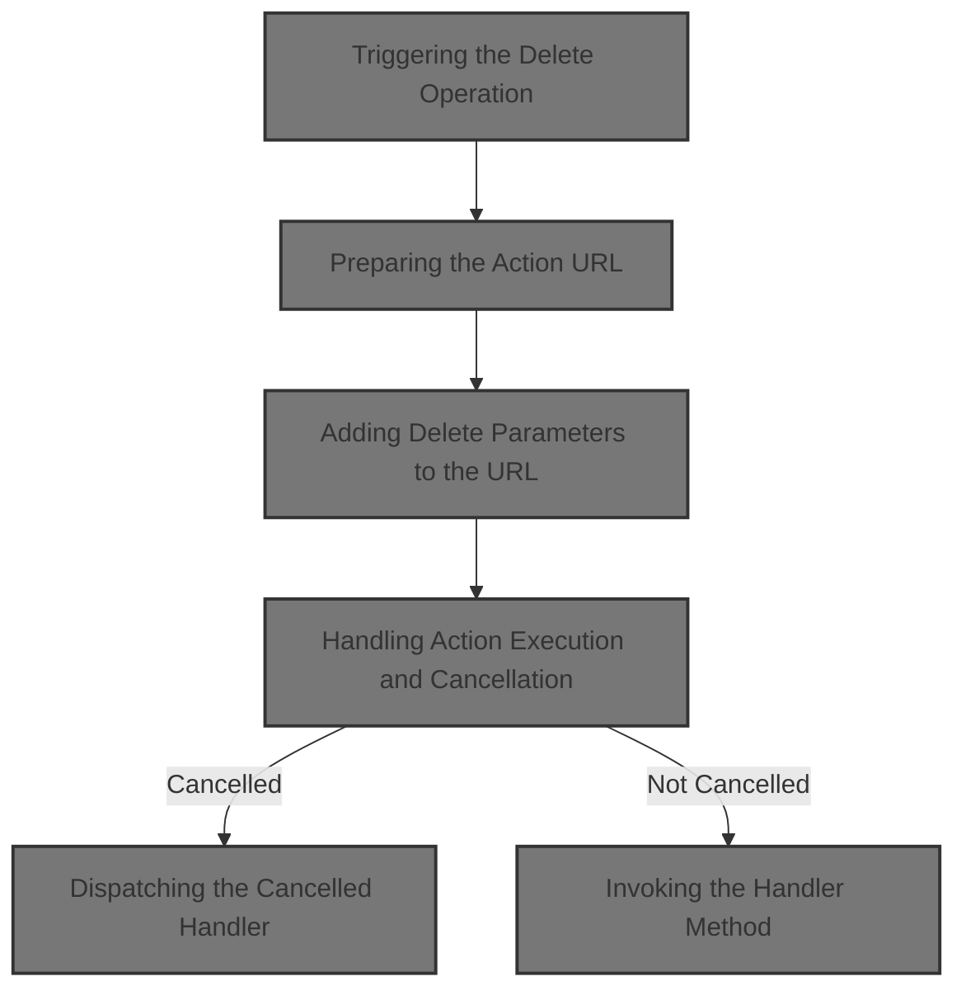
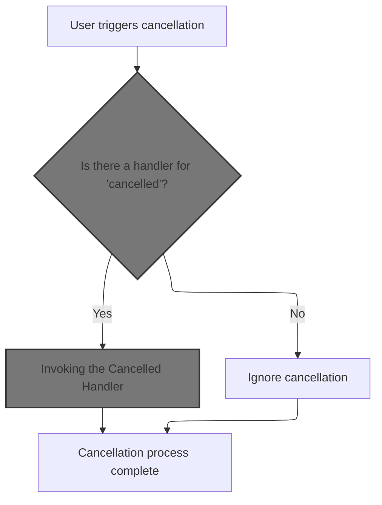
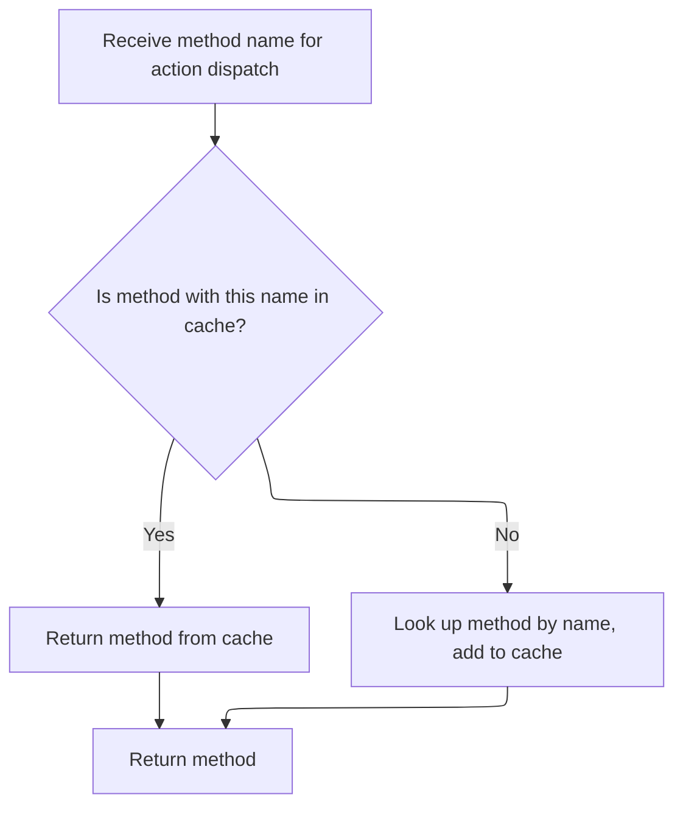
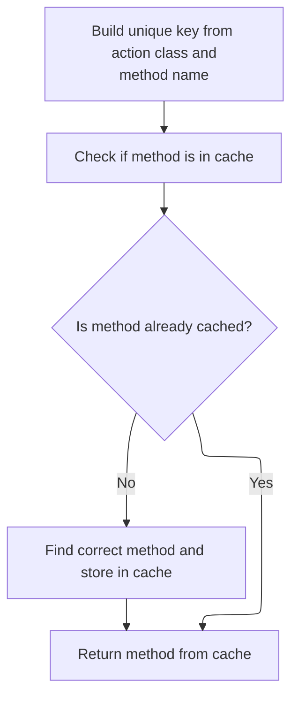
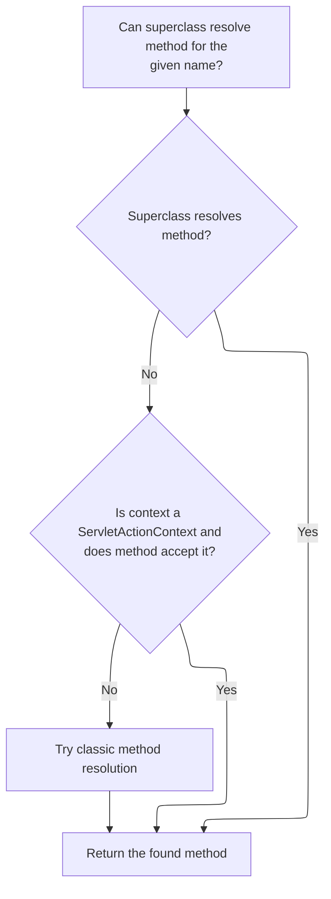
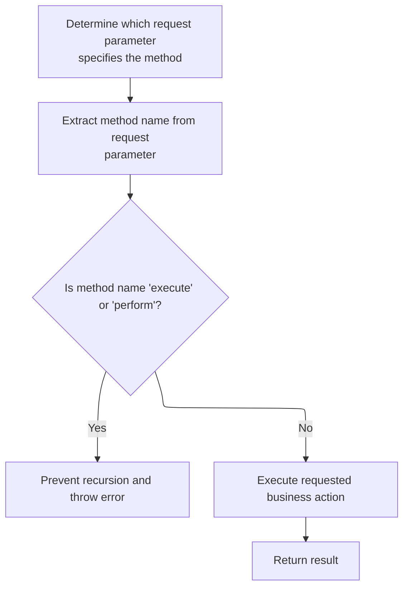

This document describes how a user's request to delete a subscription is processed. The system constructs the request, adds necessary parameters, and routes it to the appropriate handler for deletion. The flow includes support for cancellation and fallback handling.



# Triggering the Delete Operation

<SwmSnippet path="/apps/faces-example1/src/main/java/org/apache/struts/webapp/example/RegistrationBacking.java" line="101">

---

In <SwmToken path="apps/faces-example1/src/main/java/org/apache/struts/webapp/example/RegistrationBacking.java" pos="101:5:5" line-data="    public String delete() {">`delete`</SwmToken>, we start by logging and grabbing the <SwmToken path="apps/faces-example1/src/main/java/org/apache/struts/webapp/example/RegistrationBacking.java" pos="106:1:1" line-data="        FacesContext context = FacesContext.getCurrentInstance();">`FacesContext`</SwmToken>, then prep a URL for the delete action. The URL construction is handed off to <SwmToken path="apps/faces-example1/src/main/java/org/apache/struts/webapp/example/RegistrationBacking.java" pos="107:7:7" line-data="        StringBuffer url = subscription(context);">`subscription`</SwmToken> in <SwmToken path="apps/faces-example1/src/main/java/org/apache/struts/webapp/example/RegistrationBacking.java" pos="36:8:8" line-data="public class RegistrationBacking extends AbstractBacking {">`AbstractBacking`</SwmToken>, which sets up the base action path. This lets us layer on the delete-specific parameters later and keeps the action URL logic centralized.

```java
    public String delete() {

        if (log.isDebugEnabled()) {
            log.debug("delete()");
        }
        FacesContext context = FacesContext.getCurrentInstance();
        StringBuffer url = subscription(context);
```

---

</SwmSnippet>

## Preparing the Action URL

<SwmSnippet path="/apps/faces-example1/src/main/java/org/apache/struts/webapp/example/AbstractBacking.java" line="124">

---

<SwmToken path="apps/faces-example1/src/main/java/org/apache/struts/webapp/example/AbstractBacking.java" pos="124:5:5" line-data="    protected StringBuffer subscription(FacesContext context) {">`subscription`</SwmToken> just calls <SwmToken path="apps/faces-example1/src/main/java/org/apache/struts/webapp/example/AbstractBacking.java" pos="126:4:4" line-data="        return (action(context, &quot;/editSubscription&quot;));">`action`</SwmToken> with <SwmToken path="apps/faces-example1/src/main/java/org/apache/struts/webapp/example/AbstractBacking.java" pos="126:10:11" line-data="        return (action(context, &quot;/editSubscription&quot;));">`/editSubscription`</SwmToken>, so we get a <SwmToken path="apps/faces-example1/src/main/java/org/apache/struts/webapp/example/AbstractBacking.java" pos="124:3:3" line-data="    protected StringBuffer subscription(FacesContext context) {">`StringBuffer`</SwmToken> for the action URL. This sets up the base for any subscription-related operation, including delete, and keeps the URL logic reusable.

```java
    protected StringBuffer subscription(FacesContext context) {

        return (action(context, "/editSubscription"));

    }
```

---

</SwmSnippet>

<SwmSnippet path="/apps/faces-example1/src/main/java/org/apache/struts/webapp/example/AbstractBacking.java" line="47">

---

<SwmToken path="apps/faces-example1/src/main/java/org/apache/struts/webapp/example/AbstractBacking.java" pos="47:5:5" line-data="    protected StringBuffer action(FacesContext context, String action) {">`action`</SwmToken> takes the base action path and appends '.do' to it. This is how Struts 1 expects action URLs, so we get the right endpoint for dispatching.

```java
    protected StringBuffer action(FacesContext context, String action) {

        // FIXME - assumes extension mapping for Struts
        StringBuffer sb = new StringBuffer(action);
        sb.append(".do");
        return (sb);

    }
```

---

</SwmSnippet>

## Adding Delete Parameters to the URL

<SwmSnippet path="/apps/faces-example1/src/main/java/org/apache/struts/webapp/example/RegistrationBacking.java" line="108">

---

Back in RegistrationBacking.delete, after getting the base URL from <SwmToken path="apps/faces-example1/src/main/java/org/apache/struts/webapp/example/RegistrationBacking.java" pos="36:8:8" line-data="public class RegistrationBacking extends AbstractBacking {">`AbstractBacking`</SwmToken>, we tack on the delete action and user/subscription info as query parameters. Then we forward the request to that URL, and return null since the actual work happens elsewhere.

```java
        url.append("?action=Delete");
        url.append("&username=");
        User user = (User)
            context.getExternalContext().getSessionMap().get("user");
        url.append(user.getUsername());
        url.append("&host=");
        Subscription subscription = (Subscription)
            context.getExternalContext().getRequestMap().get("subscription");
        url.append(subscription.getHost());
        forward(context, url.toString());
        return (null);

    }
```

---

</SwmSnippet>

# Dispatching the Request

<SwmSnippet path="/apps/faces-example1/src/main/java/org/apache/struts/webapp/example/AbstractBacking.java" line="66">

---

<SwmToken path="apps/faces-example1/src/main/java/org/apache/struts/webapp/example/AbstractBacking.java" pos="66:5:5" line-data="    protected void forward(FacesContext context, String url) {">`forward`</SwmToken> uses <SwmToken path="apps/faces-example1/src/main/java/org/apache/struts/webapp/example/AbstractBacking.java" pos="66:7:7" line-data="    protected void forward(FacesContext context, String url) {">`FacesContext`</SwmToken> to dispatch the request to the constructed URL. If there's an error, it wraps it in a <SwmToken path="apps/faces-example1/src/main/java/org/apache/struts/webapp/example/AbstractBacking.java" pos="71:5:5" line-data="            throw new FacesException(e);">`FacesException`</SwmToken>, and always marks the response as complete so JSF doesn't keep processing. This hands off control to the Struts dispatcher.

```java
    protected void forward(FacesContext context, String url) {

        try {
            context.getExternalContext().dispatch(url);
        } catch (IOException e) {
            throw new FacesException(e);
        } finally {
            context.responseComplete();
        }

    }
```

---

</SwmSnippet>

# Routing to the Action Handler

<SwmSnippet path="/extras/src/main/java/org/apache/struts/actions/ActionDispatcher.java" line="507">

---

In <SwmToken path="extras/src/main/java/org/apache/struts/actions/ActionDispatcher.java" pos="507:5:5" line-data="    public Object dispatch(ActionContext context) throws Exception {">`dispatch`</SwmToken>, we grab the servlet context from <SwmToken path="extras/src/main/java/org/apache/struts/actions/ActionDispatcher.java" pos="507:7:7" line-data="    public Object dispatch(ActionContext context) throws Exception {">`ActionContext`</SwmToken>, then call execute with the action mapping, form, request, and response. This sets up the actual action handling, so we need to fetch the HTTP request next.

```java
    public Object dispatch(ActionContext context) throws Exception {
        ServletActionContext servletContext = (ServletActionContext) context;
        return execute((ActionMapping) context.getActionConfig(), context.getActionForm(),
            servletContext.getRequest(), servletContext.getResponse());
```

---

</SwmSnippet>

## Extracting the HTTP Request

<SwmSnippet path="/core/src/main/java/org/apache/struts/chain/contexts/ServletActionContext.java" line="94">

---

<SwmToken path="core/src/main/java/org/apache/struts/chain/contexts/ServletActionContext.java" pos="94:5:5" line-data="    public HttpServletRequest getRequest() {">`getRequest`</SwmToken> just pulls the HTTP request from <SwmToken path="core/src/main/java/org/apache/struts/chain/contexts/ServletActionContext.java" pos="95:3:3" line-data="        return servletWebContext().getRequest();">`servletWebContext`</SwmToken>. This keeps the context handling modular and lets us pass the request to the action handler.

```java
    public HttpServletRequest getRequest() {
        return servletWebContext().getRequest();
    }
```

---

</SwmSnippet>

<SwmSnippet path="/core/src/main/java/org/apache/struts/chain/contexts/ServletActionContext.java" line="67">

---

<SwmToken path="core/src/main/java/org/apache/struts/chain/contexts/ServletActionContext.java" pos="67:5:5" line-data="    protected ServletWebContext servletWebContext() {">`servletWebContext`</SwmToken> just casts the base context to <SwmToken path="core/src/main/java/org/apache/struts/chain/contexts/ServletActionContext.java" pos="67:3:3" line-data="    protected ServletWebContext servletWebContext() {">`ServletWebContext`</SwmToken>. It's a direct shortcut—no checks, just assumes the context is right for pulling HTTP request/response.

```java
    protected ServletWebContext servletWebContext() {
        return (ServletWebContext) this.getBaseContext();
    }
```

---

</SwmSnippet>

## Passing Request and Response to the Action

<SwmSnippet path="/extras/src/main/java/org/apache/struts/actions/ActionDispatcher.java" line="509">

---

Just got back from <SwmToken path="extras/src/main/java/org/apache/struts/actions/ActionDispatcher.java" pos="508:1:1" line-data="        ServletActionContext servletContext = (ServletActionContext) context;">`ServletActionContext`</SwmToken>, now ActionDispatcher.dispatch hands off the request and response to execute. This is where the action logic actually runs.

```java
        return execute((ActionMapping) context.getActionConfig(), context.getActionForm(),
            servletContext.getRequest(), servletContext.getResponse());
```

---

</SwmSnippet>

<SwmSnippet path="/core/src/main/java/org/apache/struts/chain/contexts/ServletActionContext.java" line="103">

---

<SwmToken path="core/src/main/java/org/apache/struts/chain/contexts/ServletActionContext.java" pos="103:5:5" line-data="    public HttpServletResponse getResponse() {">`getResponse`</SwmToken> just grabs the HTTP response from <SwmToken path="core/src/main/java/org/apache/struts/chain/contexts/ServletActionContext.java" pos="104:3:3" line-data="        return servletWebContext().getResponse();">`servletWebContext`</SwmToken>. Same pattern as <SwmToken path="extras/src/main/java/org/apache/struts/actions/ActionDispatcher.java" pos="510:3:3" line-data="            servletContext.getRequest(), servletContext.getResponse());">`getRequest`</SwmToken>, keeps things modular.

```java
    public HttpServletResponse getResponse() {
        return servletWebContext().getResponse();
    }
```

---

</SwmSnippet>

<SwmSnippet path="/extras/src/main/java/org/apache/struts/actions/ActionDispatcher.java" line="509">

---

Just got back from <SwmToken path="extras/src/main/java/org/apache/struts/actions/ActionDispatcher.java" pos="508:1:1" line-data="        ServletActionContext servletContext = (ServletActionContext) context;">`ServletActionContext`</SwmToken>, now ActionDispatcher.dispatch finishes by calling execute with everything it needs. The result is an <SwmToken path="extras/src/main/java/org/apache/struts/actions/ActionDispatcher.java" pos="197:3:3" line-data="    public ActionForward execute(ActionMapping mapping, ActionForm form,">`ActionForward`</SwmToken> for routing.

```java
        return execute((ActionMapping) context.getActionConfig(), context.getActionForm(),
            servletContext.getRequest(), servletContext.getResponse());
    }
```

---

</SwmSnippet>

# Handling Action Execution and Cancellation

<SwmSnippet path="/extras/src/main/java/org/apache/struts/actions/ActionDispatcher.java" line="197">

---

In <SwmToken path="extras/src/main/java/org/apache/struts/actions/ActionDispatcher.java" pos="197:5:5" line-data="    public ActionForward execute(ActionMapping mapping, ActionForm form,">`execute`</SwmToken>, we check if the request was cancelled. If so, we call cancelled and return its <SwmToken path="extras/src/main/java/org/apache/struts/actions/ActionDispatcher.java" pos="197:3:3" line-data="    public ActionForward execute(ActionMapping mapping, ActionForm form,">`ActionForward`</SwmToken> if present. Otherwise, we keep processing.

```java
    public ActionForward execute(ActionMapping mapping, ActionForm form,
        HttpServletRequest request, HttpServletResponse response)
        throws Exception {
        // Process "cancelled"
        if (isCancelled(request)) {
            ActionForward af = cancelled(mapping, form, request, response);

            if (af != null) {
                return af;
            }
        }

```

---

</SwmSnippet>

## Dispatching the Cancelled Handler



<SwmSnippet path="/extras/src/main/java/org/apache/struts/actions/ActionDispatcher.java" line="282">

---

In <SwmToken path="extras/src/main/java/org/apache/struts/actions/ActionDispatcher.java" pos="282:5:5" line-data="    protected ActionForward cancelled(ActionMapping mapping, ActionForm form,">`cancelled`</SwmToken>, we try to find a method called 'cancelled' via <SwmToken path="extras/src/main/java/org/apache/struts/actions/ActionDispatcher.java" pos="290:5:5" line-data="            method = getMethod(name);">`getMethod`</SwmToken>. If it's not there, we return null and move on.

```java
    protected ActionForward cancelled(ActionMapping mapping, ActionForm form,
        HttpServletRequest request, HttpServletResponse response)
        throws Exception {
        // Identify if there is an "cancelled" method to be dispatched to
        String name = "cancelled";
        Method method = null;

        try {
            method = getMethod(name);
        } catch (NoSuchMethodException e) {
            return null;
        }

```

---

</SwmSnippet>

### Locating the Handler Method



<SwmSnippet path="/extras/src/main/java/org/apache/struts/actions/ActionDispatcher.java" line="410">

---

<SwmToken path="extras/src/main/java/org/apache/struts/actions/ActionDispatcher.java" pos="410:5:5" line-data="    protected Method getMethod(String name)">`getMethod`</SwmToken> checks the cache for the handler method, grabs it via reflection if missing, and syncs access for thread safety. This keeps dispatch quick.

```java
    protected Method getMethod(String name)
        throws NoSuchMethodException {
        synchronized (methods) {
            Method method = (Method) methods.get(name);

            if (method == null) {
                method = clazz.getMethod(name, types);
                methods.put(name, method);
            }

            return (method);
        }
    }
```

---

</SwmSnippet>

### Resolving Method by Class and Name



<SwmSnippet path="/core/src/main/java/org/apache/struts/dispatcher/AbstractDispatcher.java" line="203">

---

<SwmToken path="core/src/main/java/org/apache/struts/dispatcher/AbstractDispatcher.java" pos="203:7:7" line-data="    protected final Method getMethod(ActionContext context, String methodName) throws NoSuchMethodException {">`getMethod`</SwmToken> in <SwmToken path="core/src/main/java/org/apache/struts/dispatcher/AbstractDispatcher.java" pos="43:6:6" line-data="public abstract class AbstractDispatcher implements Dispatcher, Serializable {">`AbstractDispatcher`</SwmToken> builds a cache key from the action class and method name, checks for the method, and resolves it if missing. This keeps method lookup precise.

```java
    protected final Method getMethod(ActionContext context, String methodName) throws NoSuchMethodException {
        synchronized (methods) {
            // Key the method based on the class-method combination
            StringBuffer keyBuf = new StringBuffer(100);
            keyBuf.append(context.getAction().getClass().getName());
            keyBuf.append(":");
            keyBuf.append(methodName);
            String key = keyBuf.toString();

            Method method = (Method) methods.get(key);

            if (method == null) {
                method = resolveMethod(context, methodName);
                methods.put(key, method);
            }

            return method;
        }
    }
```

---

</SwmSnippet>

### Delegating Method Resolution

<SwmSnippet path="/core/src/main/java/org/apache/struts/dispatcher/AbstractDispatcher.java" line="288">

---

<SwmToken path="core/src/main/java/org/apache/struts/dispatcher/AbstractDispatcher.java" pos="288:3:3" line-data="    Method resolveMethod(ActionContext context, String methodName) throws NoSuchMethodException {">`resolveMethod`</SwmToken> just hands off to <SwmToken path="core/src/main/java/org/apache/struts/dispatcher/AbstractDispatcher.java" pos="289:3:3" line-data="        return methodResolver.resolveMethod(context, methodName);">`methodResolver`</SwmToken>, which can use different strategies to find the right method. Keeps things flexible.

```java
    Method resolveMethod(ActionContext context, String methodName) throws NoSuchMethodException {
        return methodResolver.resolveMethod(context, methodName);
    }
```

---

</SwmSnippet>

### Layered Method Lookup



<SwmSnippet path="/core/src/main/java/org/apache/struts/dispatcher/servlet/ServletMethodResolver.java" line="110">

---

In <SwmToken path="core/src/main/java/org/apache/struts/dispatcher/servlet/ServletMethodResolver.java" pos="110:5:5" line-data="    public Method resolveMethod(ActionContext context, String methodName) throws NoSuchMethodException {">`resolveMethod`</SwmToken>, we first try the superclass, then check for methods that take <SwmToken path="extras/src/main/java/org/apache/struts/actions/ActionDispatcher.java" pos="508:1:1" line-data="        ServletActionContext servletContext = (ServletActionContext) context;">`ServletActionContext`</SwmToken>, and finally fall back to classic signature lookup. This covers all bases for method resolution.

```java
    public Method resolveMethod(ActionContext context, String methodName) throws NoSuchMethodException {
        // First try to resolve anything the superclass supports
        try {
            return super.resolveMethod(context, methodName);
        } catch (NoSuchMethodException e) {
            // continue
        }

```

---

</SwmSnippet>

<SwmSnippet path="/core/src/main/java/org/apache/struts/dispatcher/servlet/ServletMethodResolver.java" line="118">

---

Just got back from <SwmToken path="core/src/main/java/org/apache/struts/dispatcher/AbstractDispatcher.java" pos="43:6:6" line-data="public abstract class AbstractDispatcher implements Dispatcher, Serializable {">`AbstractDispatcher`</SwmToken>, now <SwmToken path="core/src/main/java/org/apache/struts/dispatcher/servlet/ServletMethodResolver.java" pos="49:4:4" line-data="public class ServletMethodResolver extends AbstractMethodResolver {">`ServletMethodResolver`</SwmToken> checks for a method that takes <SwmToken path="core/src/main/java/org/apache/struts/dispatcher/servlet/ServletMethodResolver.java" pos="119:8:8" line-data="        if (context instanceof ServletActionContext) {">`ServletActionContext`</SwmToken>. If it finds one, it uses it; otherwise, it keeps looking.

```java
        // Can the method accept the servlet action context?
        if (context instanceof ServletActionContext) {
            try {
                Class actionClass = context.getAction().getClass();
                return actionClass.getMethod(methodName, new Class[] { ServletActionContext.class });
            } catch (NoSuchMethodException e) {
                // continue
            }
        }

```

---

</SwmSnippet>

<SwmSnippet path="/core/src/main/java/org/apache/struts/dispatcher/servlet/ServletMethodResolver.java" line="128">

---

Just got back from <SwmToken path="core/src/main/java/org/apache/struts/dispatcher/AbstractDispatcher.java" pos="43:6:6" line-data="public abstract class AbstractDispatcher implements Dispatcher, Serializable {">`AbstractDispatcher`</SwmToken>, now <SwmToken path="core/src/main/java/org/apache/struts/dispatcher/servlet/ServletMethodResolver.java" pos="49:4:4" line-data="public class ServletMethodResolver extends AbstractMethodResolver {">`ServletMethodResolver`</SwmToken> falls back to classic method resolution. This keeps legacy handlers working if nothing else matches.

```java
        // Lastly, try the classical argument listing
        return resolveClassicMethod(context, methodName);
    }
```

---

</SwmSnippet>

<SwmSnippet path="/core/src/main/java/org/apache/struts/dispatcher/servlet/ServletMethodResolver.java" line="105">

---

<SwmToken path="core/src/main/java/org/apache/struts/dispatcher/servlet/ServletMethodResolver.java" pos="105:7:7" line-data="    protected final Method resolveClassicMethod(ActionContext context, String methodName) throws NoSuchMethodException {">`resolveClassicMethod`</SwmToken> looks for a method with the classic Struts 1 signature. If it finds one, that's what gets used for dispatch.

```java
    protected final Method resolveClassicMethod(ActionContext context, String methodName) throws NoSuchMethodException {
        Class actionClass = context.getAction().getClass();
        return actionClass.getMethod(methodName, CLASSIC_EXECUTE_SIGNATURE);
    }
```

---

</SwmSnippet>

### Invoking the Cancelled Handler

<SwmSnippet path="/extras/src/main/java/org/apache/struts/actions/ActionDispatcher.java" line="295">

---

Just got back from <SwmToken path="extras/src/main/java/org/apache/struts/actions/ActionDispatcher.java" pos="253:5:5" line-data="            method = getMethod(name);">`getMethod`</SwmToken>, now ActionDispatcher.cancelled calls <SwmToken path="extras/src/main/java/org/apache/struts/actions/ActionDispatcher.java" pos="295:3:3" line-data="        return dispatchMethod(mapping, form, request, response, name, method);">`dispatchMethod`</SwmToken> to invoke the handler. Uses reflection, expects four arguments, and returns the <SwmToken path="extras/src/main/java/org/apache/struts/actions/ActionDispatcher.java" pos="197:3:3" line-data="    public ActionForward execute(ActionMapping mapping, ActionForm form,">`ActionForward`</SwmToken>.

```java
        return dispatchMethod(mapping, form, request, response, name, method);
    }
```

---

</SwmSnippet>

<SwmSnippet path="/extras/src/main/java/org/apache/struts/actions/ActionDispatcher.java" line="358">

---

<SwmToken path="extras/src/main/java/org/apache/struts/actions/ActionDispatcher.java" pos="358:5:5" line-data="    protected ActionForward dispatchMethod(ActionMapping mapping,">`dispatchMethod`</SwmToken> builds an argument array with mapping, form, request, and response, then calls the handler via reflection. If the method doesn't match, it throws.

```java
    protected ActionForward dispatchMethod(ActionMapping mapping,
        ActionForm form, HttpServletRequest request,
        HttpServletResponse response, String name, Method method)
        throws Exception {
        ActionForward forward = null;

        try {
            Object[] args = { mapping, form, request, response };

            forward = (ActionForward) method.invoke(actionInstance, args);
        } catch (ClassCastException e) {
            String message =
                messages.getMessage("dispatch.return", mapping.getPath(), name);

            log.error(message, e);
            throw e;
        } catch (IllegalAccessException e) {
            String message =
                messages.getMessage("dispatch.error", mapping.getPath(), name);

            log.error(message, e);
            throw e;
        } catch (InvocationTargetException e) {
            // Rethrow the target exception if possible so that the
            // exception handling machinery can deal with it
            Throwable t = e.getTargetException();

            if (t instanceof Exception) {
                throw ((Exception) t);
            } else {
                String message =
                    messages.getMessage("dispatch.error", mapping.getPath(),
                        name);

                log.error(message, e);
                throw new ServletException(t);
            }
        }

        // Return the returned ActionForward instance
        return (forward);
    }
```

---

</SwmSnippet>

## Determining the Method to Invoke



<SwmSnippet path="/extras/src/main/java/org/apache/struts/actions/ActionDispatcher.java" line="209">

---

Just got back from cancelled, now ActionDispatcher.execute calls <SwmToken path="extras/src/main/java/org/apache/struts/actions/ActionDispatcher.java" pos="210:7:7" line-data="        String parameter = getParameter(mapping, form, request, response);">`getParameter`</SwmToken> to figure out which method name to use. The flavor field decides what happens if nothing is specified.

```java
        // Identify the request parameter containing the method name
        String parameter = getParameter(mapping, form, request, response);

```

---

</SwmSnippet>

<SwmSnippet path="/extras/src/main/java/org/apache/struts/actions/ActionDispatcher.java" line="435">

---

<SwmToken path="extras/src/main/java/org/apache/struts/actions/ActionDispatcher.java" pos="435:5:5" line-data="    protected String getParameter(ActionMapping mapping, ActionForm form,">`getParameter`</SwmToken> normalizes empty strings to null, then checks flavor to decide what to return. <SwmToken path="extras/src/main/java/org/apache/struts/actions/ActionDispatcher.java" pos="444:19:19" line-data="        if ((parameter == null) &amp;&amp; (flavor == DEFAULT_FLAVOR)) {">`DEFAULT_FLAVOR`</SwmToken> gives 'method', others throw if missing.

```java
    protected String getParameter(ActionMapping mapping, ActionForm form,
        HttpServletRequest request, HttpServletResponse response)
        throws Exception {
        String parameter = mapping.getParameter();

        if ("".equals(parameter)) {
            parameter = null;
        }

        if ((parameter == null) && (flavor == DEFAULT_FLAVOR)) {
            // use "method" for DEFAULT_FLAVOR if no parameter was provided
            return "method";
        }

        if ((parameter == null)
            && ((flavor == MAPPING_FLAVOR) || (flavor == DISPATCH_FLAVOR))) {
            String message =
                messages.getMessage("dispatch.handler", mapping.getPath());

            log.error(message);

            throw new ServletException(message);
        }

        return parameter;
    }
```

---

</SwmSnippet>

<SwmSnippet path="/extras/src/main/java/org/apache/struts/actions/ActionDispatcher.java" line="212">

---

Just got back from <SwmToken path="extras/src/main/java/org/apache/struts/actions/ActionDispatcher.java" pos="210:7:7" line-data="        String parameter = getParameter(mapping, form, request, response);">`getParameter`</SwmToken>, now ActionDispatcher.execute calls <SwmToken path="extras/src/main/java/org/apache/struts/actions/ActionDispatcher.java" pos="214:1:1" line-data="            getMethodName(mapping, form, request, response, parameter);">`getMethodName`</SwmToken> to finalize which handler method to invoke. Subclasses can override this if needed.

```java
        // Get the method's name. This could be overridden in subclasses.
        String name =
            getMethodName(mapping, form, request, response, parameter);

```

---

</SwmSnippet>

<SwmSnippet path="/extras/src/main/java/org/apache/struts/actions/ActionDispatcher.java" line="474">

---

In <SwmToken path="extras/src/main/java/org/apache/struts/actions/ActionDispatcher.java" pos="474:5:5" line-data="    protected String getMethodName(ActionMapping mapping, ActionForm form,">`getMethodName`</SwmToken>, we decide how to pick the handler method name—either straight from the mapping or from the request parameter, depending on the flavor. This lets us support both static and dynamic dispatching.

```java
    protected String getMethodName(ActionMapping mapping, ActionForm form,
        HttpServletRequest request, HttpServletResponse response,
        String parameter) throws Exception {
        // "Mapping" flavor, defaults to "method"
        if (flavor == MAPPING_FLAVOR) {
            return parameter;
        }

        // default behaviour
        return request.getParameter(parameter);
    }
```

---

</SwmSnippet>

<SwmSnippet path="/extras/src/main/java/org/apache/struts/actions/ActionDispatcher.java" line="216">

---

Just got back from <SwmToken path="extras/src/main/java/org/apache/struts/actions/ActionDispatcher.java" pos="214:1:1" line-data="            getMethodName(mapping, form, request, response, parameter);">`getMethodName`</SwmToken>, now in <SwmToken path="extras/src/main/java/org/apache/struts/actions/ActionDispatcher.java" pos="217:5:5" line-data="        if (&quot;execute&quot;.equals(name) || &quot;perform&quot;.equals(name)) {">`execute`</SwmToken>, we check for recursion on 'execute' and 'perform', log if it happens, and throw. Then we call <SwmToken path="extras/src/main/java/org/apache/struts/actions/ActionDispatcher.java" pos="226:3:3" line-data="        return dispatchMethod(mapping, form, request, response, name);">`dispatchMethod`</SwmToken> to actually run the handler.

```java
        // Prevent recursive calls
        if ("execute".equals(name) || "perform".equals(name)) {
            String message =
                messages.getMessage("dispatch.recursive", mapping.getPath());

            log.error(message);
            throw new ServletException(message);
        }

        // Invoke the named method, and return the result
        return dispatchMethod(mapping, form, request, response, name);
    }
```

---

</SwmSnippet>

# Invoking the Handler Method

<SwmSnippet path="/extras/src/main/java/org/apache/struts/actions/ActionDispatcher.java" line="313">

---

In <SwmToken path="extras/src/main/java/org/apache/struts/actions/ActionDispatcher.java" pos="313:5:5" line-data="    protected ActionForward dispatchMethod(ActionMapping mapping,">`dispatchMethod`</SwmToken>, we check if the method name is null—if so, we call <SwmToken path="extras/src/main/java/org/apache/struts/actions/ActionDispatcher.java" pos="320:5:5" line-data="            return this.unspecified(mapping, form, request, response);">`unspecified`</SwmToken> to handle cases where the user didn't specify a handler or messed with the query string.

```java
    protected ActionForward dispatchMethod(ActionMapping mapping,
        ActionForm form, HttpServletRequest request,
        HttpServletResponse response, String name)
        throws Exception {
        // Make sure we have a valid method name to call.
        // This may be null if the user hacks the query string.
        if (name == null) {
            return this.unspecified(mapping, form, request, response);
        }

```

---

</SwmSnippet>

## Fallback to Default Handler

<SwmSnippet path="/extras/src/main/java/org/apache/struts/actions/ActionDispatcher.java" line="245">

---

In <SwmToken path="extras/src/main/java/org/apache/struts/actions/ActionDispatcher.java" pos="245:5:5" line-data="    protected ActionForward unspecified(ActionMapping mapping, ActionForm form,">`unspecified`</SwmToken>, we try to find a handler named 'unspecified' using reflection. This is the fallback if no method name was given.

```java
    protected ActionForward unspecified(ActionMapping mapping, ActionForm form,
        HttpServletRequest request, HttpServletResponse response)
        throws Exception {
        // Identify if there is an "unspecified" method to be dispatched to
        String name = "unspecified";
        Method method = null;

        try {
            method = getMethod(name);
```

---

</SwmSnippet>

<SwmSnippet path="/extras/src/main/java/org/apache/struts/actions/ActionDispatcher.java" line="254">

---

Just got back from <SwmToken path="extras/src/main/java/org/apache/struts/actions/ActionDispatcher.java" pos="245:5:5" line-data="    protected ActionForward unspecified(ActionMapping mapping, ActionForm form,">`unspecified`</SwmToken>, now if the method isn't found, we log the error and throw a <SwmToken path="extras/src/main/java/org/apache/struts/actions/ActionDispatcher.java" pos="261:5:5" line-data="            throw new ServletException(message, e);">`ServletException`</SwmToken>. This makes missing handlers obvious during development.

```java
        } catch (NoSuchMethodException e) {
            String message =
                messages.getMessage("dispatch.parameter", mapping.getPath(),
                    mapping.getParameter());

            log.error(message);

            throw new ServletException(message, e);
        }

```

---

</SwmSnippet>

<SwmSnippet path="/extras/src/main/java/org/apache/struts/actions/ActionDispatcher.java" line="264">

---

Just got back from <SwmToken path="extras/src/main/java/org/apache/struts/actions/ActionDispatcher.java" pos="245:5:5" line-data="    protected ActionForward unspecified(ActionMapping mapping, ActionForm form,">`unspecified`</SwmToken>, now we call <SwmToken path="extras/src/main/java/org/apache/struts/actions/ActionDispatcher.java" pos="264:3:3" line-data="        return dispatchMethod(mapping, form, request, response, name, method);">`dispatchMethod`</SwmToken> again, but this time with the actual Method object for 'unspecified', so we can invoke it directly.

```java
        return dispatchMethod(mapping, form, request, response, name, method);
    }
```

---

</SwmSnippet>

## Resolving and Invoking the Target Handler

<SwmSnippet path="/extras/src/main/java/org/apache/struts/actions/ActionDispatcher.java" line="323">

---

Just got back from the fallback handler, now in <SwmToken path="extras/src/main/java/org/apache/struts/actions/ActionDispatcher.java" pos="226:3:3" line-data="        return dispatchMethod(mapping, form, request, response, name);">`dispatchMethod`</SwmToken>, we use reflection to resolve the method object for the given name. If it's not found, we handle the error next.

```java
        // Identify the method object to be dispatched to
        Method method = null;

        try {
            method = getMethod(name);
```

---

</SwmSnippet>

<SwmSnippet path="/extras/src/main/java/org/apache/struts/actions/ActionDispatcher.java" line="328">

---

Just got back from resolving the method, now if it's missing, we log the error, throw a <SwmToken path="extras/src/main/java/org/apache/struts/actions/ActionDispatcher.java" pos="328:6:6" line-data="        } catch (NoSuchMethodException e) {">`NoSuchMethodException`</SwmToken> with a user-friendly message, and bail out. If it's found, we call <SwmToken path="extras/src/main/java/org/apache/struts/actions/ActionDispatcher.java" pos="341:3:3" line-data="        return dispatchMethod(mapping, form, request, response, name, method);">`dispatchMethod`</SwmToken> with the method object to actually run the handler.

```java
        } catch (NoSuchMethodException e) {
            String message =
                messages.getMessage("dispatch.method", mapping.getPath(), name);

            log.error(message, e);

            String userMsg =
                messages.getMessage("dispatch.method.user", mapping.getPath());
            NoSuchMethodException e2 = new NoSuchMethodException(userMsg);
            e2.initCause(e);
            throw e2;
        }

        return dispatchMethod(mapping, form, request, response, name, method);
    }
```

---

</SwmSnippet>

&nbsp;

*This is an auto-generated document by Swimm 🌊 and has not yet been verified by a human*

<SwmMeta version="3.0.0" repo-id="Z2l0aHViJTNBJTNBc3RydXRzMSUzQSUzQVN3aW1tLURlbW8=" repo-name="struts1"><sup>Powered by [Swimm](https://app.swimm.io/)</sup></SwmMeta>
