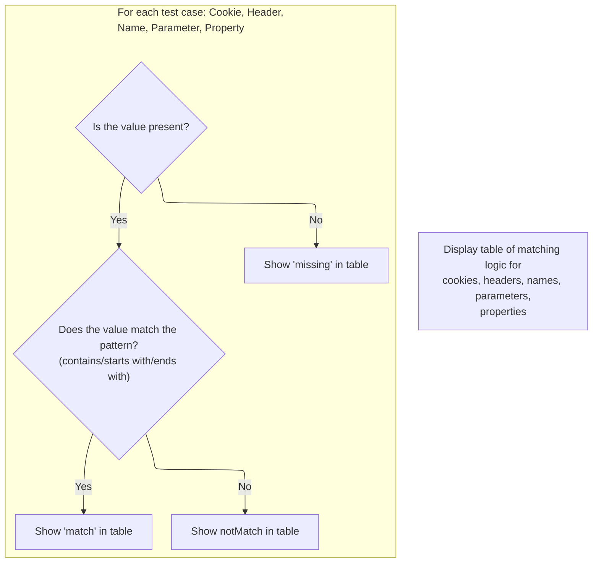

This document describes the flow for rendering a demonstration table that shows how cookies, headers, parameters, properties, and static strings from an HTTP request match specific patterns using <SwmToken path="apps/el-example/src/main/webapp/logic-match.jsp" pos="31:8:10" line-data="    &lt;h1&gt;Test struts logic-el Match Tags&lt;/h1&gt;">`logic-el`</SwmToken> tags. The table displays whether each value matches, does not match, or is missing, helping developers understand the behavior of the matching logic.

# Setting Up Test Variables and Context

<SwmSnippet path="/apps/el-example/src/main/webapp/logic-match.jsp" line="28">

---

In <SwmToken path="apps/el-example/src/main/webapp/logic-match.jsp" pos="28:1:1" line-data="&lt;body bgcolor=&quot;white&quot;&gt;">`body`</SwmToken>, we're grabbing the JSESSIONID cookie, <SwmToken path="apps/el-example/src/main/webapp/logic-match.jsp" pos="37:19:21" line-data="&lt;c:set var=&quot;uaheader&quot; value=&#39;${header[&quot;User-Agent&quot;]}&#39;/&gt;">`User-Agent`</SwmToken> header, a request parameter, and setting a static string in the page context. These are the values we'll run through the match/notMatch logic later. We call the next block (anonymous-38-0) to actually set the 'string' attribute in the page context, which is needed for the tests that reference it by name.

```java server pages
<body bgcolor="white">

<div align="center">
    <h1>Test struts logic-el Match Tags</h1>
</div>

<jsp:useBean id="bean" scope="page"
             class="org.apache.struts.webapp.el.exercise.TestBean"/>
<c:set var="jcookie" value='${cookie["JSESSIONID"].value}'/>
<c:set var="uaheader" value='${header["User-Agent"]}'/>
<c:set var="rparam" value='${param["param1"]}'/>
<%
    pageContext.setAttribute("string", "String test value");
%>
```

---

</SwmSnippet>

## Storing Data in Page Context

<SwmSnippet path="/apps/el-example/src/main/webapp/logic-match.jsp" line="39">

---

In `anonymous-38-0`, we're just putting 'string' into the page context so the later tests can grab it by name. Next, we call the <SwmToken path="apps/el-example/src/main/webapp/logic-match.jsp" pos="40:3:3" line-data="    pageContext.setAttribute(&quot;string&quot;, &quot;String test value&quot;);">`setAttribute`</SwmToken> logic (<SwmToken path="tiles2/src/main/java/org/apache/struts/tiles2/util/PlugInConfigContextAdapter.java" pos="44:4:4" line-data="public class PlugInConfigContextAdapter implements ServletContext {">`PlugInConfigContextAdapter`</SwmToken>) because that's the underlying method that actually stores the value in the context object.

```java server pages
<%
    pageContext.setAttribute("string", "String test value");
```

---

</SwmSnippet>

<SwmSnippet path="/tiles2/src/main/java/org/apache/struts/tiles2/util/PlugInConfigContextAdapter.java" line="202">

---

<SwmToken path="tiles2/src/main/java/org/apache/struts/tiles2/util/PlugInConfigContextAdapter.java" pos="202:5:5" line-data="    public void setAttribute(String string, Object object) {">`setAttribute`</SwmToken> just hands off the attribute name and value to <SwmToken path="tiles2/src/main/java/org/apache/struts/tiles2/util/PlugInConfigContextAdapter.java" pos="203:1:1" line-data="        rootContext.setAttribute(string, object);">`rootContext`</SwmToken>. No extra logic, just a straight delegation.

```java
    public void setAttribute(String string, Object object) {
        rootContext.setAttribute(string, object);
    }
```

---

</SwmSnippet>

<SwmSnippet path="/apps/el-example/src/main/webapp/logic-match.jsp" line="41">

---

Back in `anonymous-38-0`, after <SwmToken path="apps/el-example/src/main/webapp/logic-match.jsp" pos="40:3:3" line-data="    pageContext.setAttribute(&quot;string&quot;, &quot;String test value&quot;);">`setAttribute`</SwmToken> returns, the 'string' attribute is set and ready for the rest of the JSP to use.

```java server pages
%>
```

---

</SwmSnippet>

## Rendering the Match Test Table



<SwmSnippet path="/apps/el-example/src/main/webapp/logic-match.jsp" line="42">

---

Back in <SwmToken path="apps/el-example/src/main/webapp/logic-match.jsp" pos="28:1:1" line-data="&lt;body bgcolor=&quot;white&quot;&gt;">`body`</SwmToken>, now that 'string' is set, we start rendering a table that runs a bunch of match/notMatch tests on the variables we set up. Next, we hit the comment about 'bean:cookie' to clarify a difference in behavior for anyone reading or maintaining this.

```java server pages

<table border="1">
<tr>
    <th>Test Type</th>
    <th>Variable Content</th>
    <th>Value Content</th>
    <th>Correct Value Test</th>
    <th>Test Result</th>
</tr>
<tr>
    <td>Cookie / Any</td>
        <%-- This isn't an exact parallel.  With "bean:cookie", you can specify a
                       default value.  That would take another step with this. --%>
```

---

</SwmSnippet>

<SwmSnippet path="/apps/el-example/src/main/webapp/logic-match.jsp" line="53">

---

`anonymous-52-8` is just a comment pointing out that unlike 'bean:cookie', we don't handle default values here—so if the cookie's missing, the test just shows 'missing'.

```java server pages
        <%-- This isn't an exact parallel.  With "bean:cookie", you can specify a
                       default value.  That would take another step with this. --%>
```

---

</SwmSnippet>

<SwmSnippet path="/apps/el-example/src/main/webapp/logic-match.jsp" line="55">

---

After the comment, we output the cookie value and set up the match test. We check if jcookie is present before running the match/notMatch logic. Next, we hit another comment about how the match logic will eventually be available as a string function in EL, which is just a note for future improvements.

```java server pages
    <td><c:out value="${jcookie}"/></td>
    <td>0</td>
    <td>contains</td>
    <td>
        <c:choose>
            <c:when test="${not empty jcookie}">
                <%-- The functionality of "logic:match" will eventually be available
                     through a string function in the EL expression. --%>
```

---

</SwmSnippet>

<SwmSnippet path="/apps/el-example/src/main/webapp/logic-match.jsp" line="61">

---

`anonymous-60-16` is just a comment that eventually, matching could be done with a standard EL string function instead of custom tags. For now, we stick with the custom <SwmToken path="apps/el-example/src/main/webapp/logic-match.jsp" pos="31:8:10" line-data="    &lt;h1&gt;Test struts logic-el Match Tags&lt;/h1&gt;">`logic-el`</SwmToken> tags.

```java server pages
                <%-- The functionality of "logic:match" will eventually be available
                     through a string function in the EL expression. --%>
```

---

</SwmSnippet>

<SwmSnippet path="/apps/el-example/src/main/webapp/logic-match.jsp" line="63">

---

Back in <SwmToken path="apps/el-example/src/main/webapp/logic-match.jsp" pos="343:1:1" line-data="&lt;/body&gt;">`body`</SwmToken>, after the comment, we run through all the match/notMatch tests for cookies, headers, parameters, properties, and the static string. Each row shows if the value matches, doesn't match, or is missing, so you can see exactly how the tags behave with different inputs.

```java server pages
                <logic-el:match expr="${jcookie}" value="0">
                    match
                </logic-el:match>
                <logic-el:notMatch expr="${jcookie}" value="0">
                    notMatch
                </logic-el:notMatch>
            </c:when>
            <c:otherwise>
                missing
            </c:otherwise>
        </c:choose>
    </td>
</tr>
<tr>
    <td>Cookie / End</td>
    <td><c:out value="${jcookie}"/></td>
    <td>0</td>
    <td>ends with</td>
    <td>
        <c:choose>
            <c:when test="${not empty jcookie}">
                <logic-el:match expr="${jcookie}" location="end" value="0">
                    match
                </logic-el:match>
                <logic-el:notMatch expr="${jcookie}" location="end" value="0">
                    notMatch
                </logic-el:notMatch>
            </c:when>
            <c:otherwise>
                missing
            </c:otherwise>
        </c:choose>
    </td>
</tr>
<tr>
    <td>Cookie / Start</td>
    <td><c:out value="${jcookie}"/></td>
    <td>0</td>
    <td>starts with</td>
    <td>
        <c:choose>
            <c:when test="${not empty jcookie}">
                <logic-el:match expr="${jcookie}" location="start" value="0">
                    match
                </logic-el:match>
                <logic-el:notMatch expr="${jcookie}" location="start"
                                   value="0">
                    notMatch
                </logic-el:notMatch>
            </c:when>
            <c:otherwise>
                missing
            </c:otherwise>
        </c:choose>
    </td>
</tr>
<tr>
    <td>Header / Any</td>
    <td><c:out value="${uaheader}"/></td>
    <td>Mozilla</td>
    <td>contains</td>
    <td>
        <c:choose>
            <c:when test="${not empty uaheader}">
                <logic-el:match expr="${uaheader}" value="Mozilla">
                    match
                </logic-el:match>
                <logic-el:notMatch expr="${uaheader}" value="Mozilla">
                    notMatch
                </logic-el:notMatch>
            </c:when>
            <c:otherwise>
                missing
            </c:otherwise>
        </c:choose>
    </td>
</tr>
<tr>
    <td>Header / End</td>
    <td><c:out value="${uaheader}"/></td>
    <td>Mozilla</td>
    <td>ends with</td>
    <td>
        <c:choose>
            <c:when test="${not empty uaheader}">
                <logic-el:match expr="${uaheader}" location="end"
                                value="Mozilla">
                    match
                </logic-el:match>
                <logic-el:notMatch expr="${uaheader}" location="end"
                                   value="Mozilla">
                    notMatch
                </logic-el:notMatch>
            </c:when>
            <c:otherwise>
                missing
            </c:otherwise>
        </c:choose>
    </td>
</tr>
<tr>
    <td>Header / Start</td>
    <td><c:out value="${uaheader}"/></td>
    <td>Mozilla</td>
    <td>starts with</td>
    <td>
        <c:choose>
            <c:when test="${not empty uaheader}">
                <logic-el:match expr="${uaheader}" location="start"
                                value="Mozilla">
                    match
                </logic-el:match>
                <logic-el:notMatch expr="${uaheader}" location="start"
                                   value="Mozilla">
                    notMatch
                </logic-el:notMatch>
            </c:when>
            <c:otherwise>
                missing
            </c:otherwise>
        </c:choose>
    </td>
</tr>
<tr>
    <td>Name / Any</td>
    <td><c:out value="${string}"/></td>
    <td>value</td>
    <td>contains</td>
    <td>
        <logic-el:match name="string" value="value">
            match
        </logic-el:match>
        <logic-el:notMatch name="string" value="value">
            notMatch
        </logic-el:notMatch>
    </td>
</tr>
<tr>
    <td>Name / End</td>
    <td><c:out value="${string}"/></td>
    <td>value</td>
    <td>ends with</td>
    <td>
        <logic-el:match name="string" location="end" value="value">
            match
        </logic-el:match>
        <logic-el:notMatch name="string" location="end" value="value">
            notMatch
        </logic-el:notMatch>
    </td>
</tr>
<tr>
    <td>Name / Start</td>
    <td><c:out value="${string}"/></td>
    <td>value</td>
    <td>starts with</td>
    <td>
        <logic-el:match name="string" location="start" value="value">
            match
        </logic-el:match>
        <logic-el:notMatch name="string" location="start" value="value">
            notMatch
        </logic-el:notMatch>
    </td>
</tr>
<tr>
    <td>Parameter / Any</td>
    <td><c:out value="${rparam}"/></td>
    <td>value1</td>
    <td>contains</td>
    <td>
        <c:choose>
            <c:when test="${not empty rparam}">
                <logic-el:match expr="${rparam}" value="value1">
                    match
                </logic-el:match>
                <logic-el:notMatch expr="${rparam}" value="value1">
                    notMatch
                </logic-el:notMatch>
            </c:when>
            <c:otherwise>
                missing
            </c:otherwise>
        </c:choose>
    </td>
</tr>
<tr>
    <td>Parameter / End</td>
    <td><c:out value="${rparam}"/></td>
    <td>value1</td>
    <td>ends with</td>
    <td>
        <c:choose>
            <c:when test="${not empty rparam}">
                <logic-el:match expr="${rparam}" location="end"
                                value="value1">
                    match
                </logic-el:match>
                <logic-el:notMatch expr="${rparam}" location="end"
                                   value="value1">
                    notMatch
                </logic-el:notMatch>
            </c:when>
            <c:otherwise>
                missing
            </c:otherwise>
        </c:choose>
    </td>
</tr>
<tr>
    <td>Parameter / Start</td>
    <td><c:out value="${rparam}"/></td>
    <td>value1</td>
    <td>starts with</td>
    <td>
        <c:choose>
            <c:when test="${not empty rparam}">
                <logic-el:match expr="${rparam}" location="start"
                                value="value1">
                    match
                </logic-el:match>
                <logic-el:notMatch expr="${rparam}" location="start"
                                   value="value1">
                    notMatch
                </logic-el:notMatch>
            </c:when>
            <c:otherwise>
                missing
            </c:otherwise>
        </c:choose>
    </td>
</tr>
<tr>
    <td>Property / Any</td>
    <td><c:out value="${bean.stringProperty}"/></td>
    <td>FOO</td>
    <td>contains</td>
    <td>
        <logic-el:match expr="${bean.stringProperty}" value="FOO">
            match
        </logic-el:match>
        <logic-el:notMatch expr="${bean.stringProperty}" value="FOO">
            notMatch
        </logic-el:notMatch>
    </td>
</tr>
<tr>
    <td>Property / End</td>
    <td><c:out value="${bean.stringProperty}"/></td>
    <td>FOO</td>
    <td>ends with</td>
    <td>
        <logic-el:match expr="${bean.stringProperty}" location="end"
                        value="FOO">
            match
        </logic-el:match>
        <logic-el:notMatch expr="${bean.stringProperty}"
                           location="end" value="FOO">
            notMatch
        </logic-el:notMatch>
    </td>
</tr>
<tr>
    <td>Property / Start</td>
    <td><c:out value="${bean.stringProperty}"/></td>
    <td>FOO</td>
    <td>starts with</td>
    <td>
        <logic-el:match expr="${bean.stringProperty}"
                        location="start" value="FOO">
            match
        </logic-el:match>
        <logic-el:notMatch expr="${bean.stringProperty}"
                           location="start" value="FOO">
            notMatch
        </logic-el:notMatch>
    </td>
</tr>
</table>

</body>
```

---

</SwmSnippet>

&nbsp;

*This is an auto-generated document by Swimm 🌊 and has not yet been verified by a human*

<SwmMeta version="3.0.0" repo-id="Z2l0aHViJTNBJTNBc3RydXRzMSUzQSUzQVN3aW1tLURlbW8=" repo-name="struts1"><sup>Powered by [Swimm](https://app.swimm.io/)</sup></SwmMeta>
