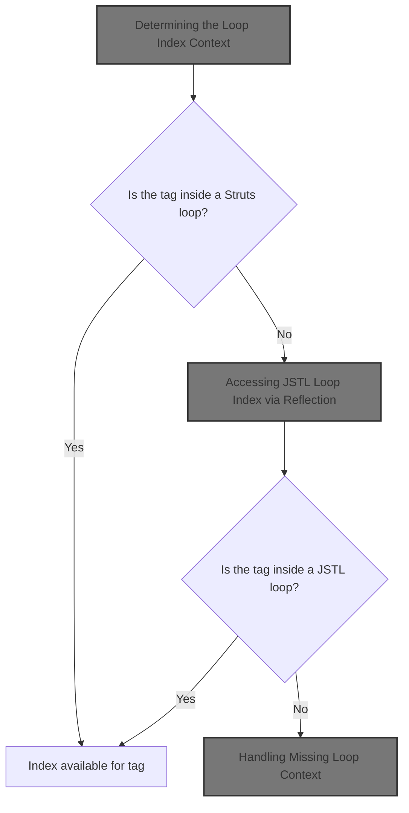
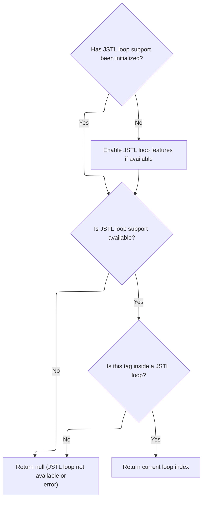

This document explains how the system determines the current position of a tag within a loop on a JSP page. It supports both Struts and JSTL loop structures, enabling tags to access their loop index for dynamic content rendering. If the tag is not inside a supported loop, an error is raised.



# Determining the Loop Index Context

<SwmSnippet path="/taglib/src/main/java/org/apache/struts/taglib/html/BaseHandlerTag.java" line="935">

---

In <SwmToken path="taglib/src/main/java/org/apache/struts/taglib/html/BaseHandlerTag.java" pos="935:5:5" line-data="    protected int getIndexValue()">`getIndexValue`</SwmToken>, we first check if the tag is inside a Struts <SwmToken path="taglib/src/main/java/org/apache/struts/taglib/html/BaseHandlerTag.java" pos="938:1:1" line-data="        IterateTag iterateTag =">`IterateTag`</SwmToken> and return its index if found. If not, we try to get the index from a JSTL loop by calling <SwmToken path="taglib/src/main/java/org/apache/struts/taglib/html/BaseHandlerTag.java" pos="946:7:7" line-data="        Integer i = getJstlLoopIndex();">`getJstlLoopIndex`</SwmToken>, covering both Struts and JSTL loop scenarios.

```java
    protected int getIndexValue()
        throws JspException {
        // look for outer iterate tag
        IterateTag iterateTag =
            (IterateTag) findAncestorWithClass(this, IterateTag.class);

        if (iterateTag != null) {
            return iterateTag.getIndex();
        }

        // Look for JSTL loops
        Integer i = getJstlLoopIndex();

        if (i != null) {
            return i.intValue();
        }

```

---

</SwmSnippet>

## Accessing JSTL Loop Index via Reflection



<SwmSnippet path="/taglib/src/main/java/org/apache/struts/taglib/html/BaseHandlerTag.java" line="852">

---

<SwmToken path="taglib/src/main/java/org/apache/struts/taglib/html/BaseHandlerTag.java" pos="852:5:5" line-data="    private Integer getJstlLoopIndex() {">`getJstlLoopIndex`</SwmToken> uses reflection to access JSTL loop classes and methods only if JSTL is available, caching the setup for efficiency. It then finds the nearest JSTL loop ancestor and extracts the current index. If anything fails, it returns null. The next step (CommandLinkTag.invoke) is unrelated to this logic and is not called from here.

```java
    private Integer getJstlLoopIndex() {
        if (!triedJstlInit) {
            triedJstlInit = true;

            try {
                loopTagClass =
                    RequestUtils.applicationClass(
                        "javax.servlet.jsp.jstl.core.LoopTag");

                loopTagGetStatus =
                    loopTagClass.getDeclaredMethod("getLoopStatus", null);

                loopTagStatusClass =
                    RequestUtils.applicationClass(
                        "javax.servlet.jsp.jstl.core.LoopTagStatus");

                loopTagStatusGetIndex =
                    loopTagStatusClass.getDeclaredMethod("getIndex", null);

                triedJstlSuccess = true;
            } catch (ClassNotFoundException ex) {
                // These just mean that JSTL isn't loaded, so ignore
            } catch (NoSuchMethodException ex) {
            }
        }

        if (triedJstlSuccess) {
            try {
                Object loopTag =
                    findAncestorWithClass(this, loopTagClass);

                if (loopTag == null) {
                    return null;
                }

                Object status = loopTagGetStatus.invoke(loopTag, null);

                return (Integer) loopTagStatusGetIndex.invoke(status, null);
            } catch (IllegalAccessException ex) {
                log.error(ex.getMessage(), ex);
            } catch (IllegalArgumentException ex) {
                log.error(ex.getMessage(), ex);
            } catch (InvocationTargetException ex) {
                log.error(ex.getMessage(), ex);
            } catch (NullPointerException ex) {
                log.error(ex.getMessage(), ex);
            } catch (ExceptionInInitializerError ex) {
                log.error(ex.getMessage(), ex);
            }
        }

        return null;
    }
```

---

</SwmSnippet>

<SwmSnippet path="/faces/src/main/java/org/apache/struts/faces/taglib/CommandLinkTag.java" line="356">

---

<SwmToken path="faces/src/main/java/org/apache/struts/faces/taglib/CommandLinkTag.java" pos="356:5:5" line-data="    public Object invoke(FacesContext context, Object params[]) {">`invoke`</SwmToken> just returns the stored 'outcome' value, ignoring all input parameters. The method's behavior is fixed and only depends on the object's state.

```java
    public Object invoke(FacesContext context, Object params[]) {
        return (this.outcome);
    }
```

---

</SwmSnippet>

## Handling Missing Loop Context

<SwmSnippet path="/taglib/src/main/java/org/apache/struts/taglib/html/BaseHandlerTag.java" line="952">

---

Finally, if <SwmToken path="taglib/src/main/java/org/apache/struts/taglib/html/BaseHandlerTag.java" pos="852:5:5" line-data="    private Integer getJstlLoopIndex() {">`getJstlLoopIndex`</SwmToken> returns null, <SwmToken path="taglib/src/main/java/org/apache/struts/taglib/html/BaseHandlerTag.java" pos="935:5:5" line-data="    protected int getIndexValue()">`getIndexValue`</SwmToken> throws a <SwmToken path="taglib/src/main/java/org/apache/struts/taglib/html/BaseHandlerTag.java" pos="953:1:1" line-data="        JspException e =">`JspException`</SwmToken> to signal that the tag isn't inside a supported loop, making the error visible during page rendering.

```java
        // this tag should be nested in an IterateTag or JSTL loop tag, if it's not, throw exception
        JspException e =
            new JspException(messages.getMessage("indexed.noEnclosingIterate"));

        TagUtils.getInstance().saveException(pageContext, e);
        throw e;
    }
```

---

</SwmSnippet>

&nbsp;

*This is an auto-generated document by Swimm 🌊 and has not yet been verified by a human*

<SwmMeta version="3.0.0" repo-id="Z2l0aHViJTNBJTNBc3RydXRzMSUzQSUzQVN3aW1tLURlbW8=" repo-name="struts1"><sup>Powered by [Swimm](https://app.swimm.io/)</sup></SwmMeta>
