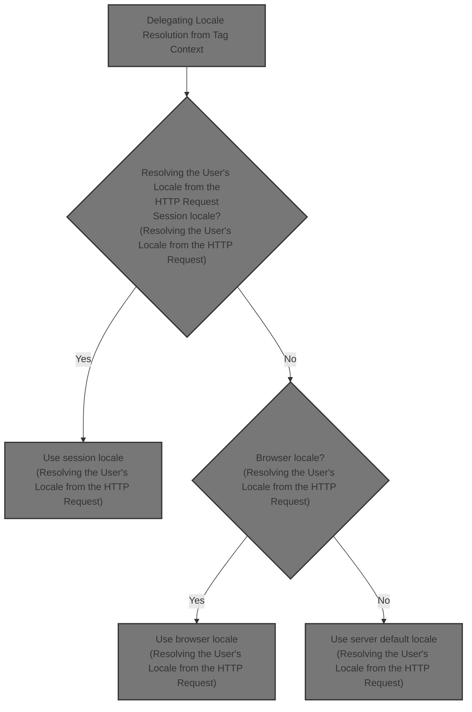
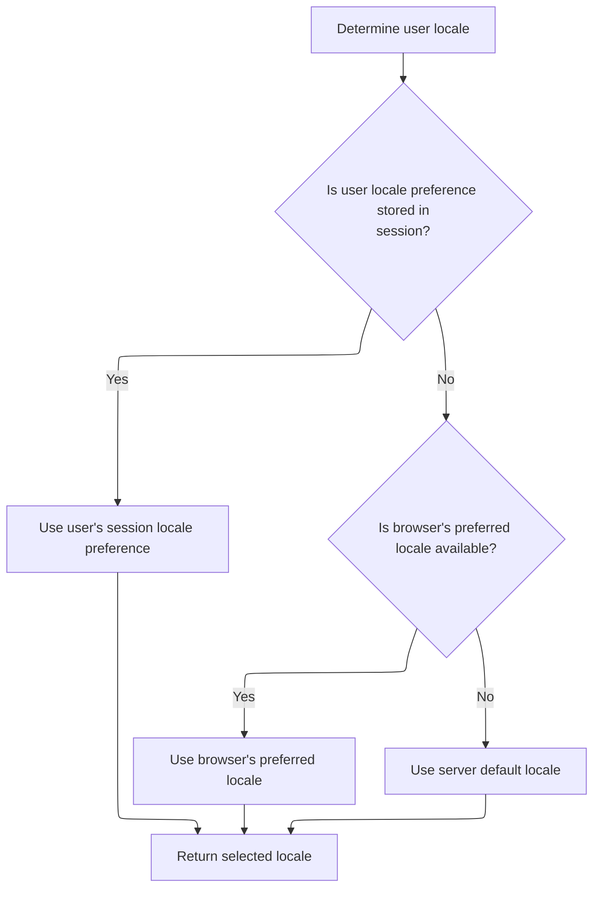

This document explains how the system determines the user's locale for their session. The process involves checking for locale preferences in the session, using browser settings if none are found, and falling back to the server's default locale. This supports internationalization by applying the user's language and regional settings.



# Delegating Locale Resolution from Tag Context

<SwmSnippet path="/taglib/src/main/java/org/apache/struts/taglib/TagUtils.java" line="830">

---

In <SwmToken path="taglib/src/main/java/org/apache/struts/taglib/TagUtils.java" pos="830:5:5" line-data="    public Locale getUserLocale(PageContext pageContext, String locale) {">`getUserLocale`</SwmToken>, we hand off locale lookup to <SwmToken path="taglib/src/main/java/org/apache/struts/taglib/TagUtils.java" pos="831:3:3" line-data="        return RequestUtils.getUserLocale((HttpServletRequest) pageContext">`RequestUtils`</SwmToken>, converting the <SwmToken path="taglib/src/main/java/org/apache/struts/taglib/TagUtils.java" pos="830:7:7" line-data="    public Locale getUserLocale(PageContext pageContext, String locale) {">`PageContext`</SwmToken>'s request to <SwmToken path="taglib/src/main/java/org/apache/struts/taglib/TagUtils.java" pos="831:8:8" line-data="        return RequestUtils.getUserLocale((HttpServletRequest) pageContext">`HttpServletRequest`</SwmToken>. This keeps locale logic consistent across the framework and avoids duplicating how locale is determined. Next, we need to get the actual <SwmToken path="taglib/src/main/java/org/apache/struts/taglib/TagUtils.java" pos="831:8:8" line-data="        return RequestUtils.getUserLocale((HttpServletRequest) pageContext">`HttpServletRequest`</SwmToken>, which is why we call into the <SwmToken path="core/src/main/java/org/apache/struts/chain/contexts/ServletActionContext.java" pos="39:4:4" line-data="public class ServletActionContext extends WebActionContext {">`ServletActionContext`</SwmToken> logic.

```java
    public Locale getUserLocale(PageContext pageContext, String locale) {
        return RequestUtils.getUserLocale((HttpServletRequest) pageContext
            .getRequest(), locale);
```

---

</SwmSnippet>

## Extracting the HTTP Request from the Action Context

<SwmSnippet path="/core/src/main/java/org/apache/struts/chain/contexts/ServletActionContext.java" line="94">

---

<SwmToken path="core/src/main/java/org/apache/struts/chain/contexts/ServletActionContext.java" pos="94:5:5" line-data="    public HttpServletRequest getRequest() {">`getRequest`</SwmToken> pulls out the <SwmToken path="core/src/main/java/org/apache/struts/chain/contexts/ServletActionContext.java" pos="94:3:3" line-data="    public HttpServletRequest getRequest() {">`HttpServletRequest`</SwmToken> from the current web context, making it available for utilities that don't work with the higher-level context objects. This is needed before passing the request to locale resolution logic.

```java
    public HttpServletRequest getRequest() {
        return servletWebContext().getRequest();
    }
```

---

</SwmSnippet>

<SwmSnippet path="/core/src/main/java/org/apache/struts/chain/contexts/ServletActionContext.java" line="67">

---

<SwmToken path="core/src/main/java/org/apache/struts/chain/contexts/ServletActionContext.java" pos="67:5:5" line-data="    protected ServletWebContext servletWebContext() {">`servletWebContext`</SwmToken> just casts the base context to <SwmToken path="core/src/main/java/org/apache/struts/chain/contexts/ServletActionContext.java" pos="67:3:3" line-data="    protected ServletWebContext servletWebContext() {">`ServletWebContext`</SwmToken> with no checks. If the context isn't what we expect, this blows up at runtime. The framework assumes only <SwmToken path="core/src/main/java/org/apache/struts/chain/contexts/ServletActionContext.java" pos="67:3:3" line-data="    protected ServletWebContext servletWebContext() {">`ServletWebContext`</SwmToken> is ever used here.

```java
    protected ServletWebContext servletWebContext() {
        return (ServletWebContext) this.getBaseContext();
    }
```

---

</SwmSnippet>

## Resolving the User's Locale from the HTTP Request



<SwmSnippet path="/taglib/src/main/java/org/apache/struts/taglib/TagUtils.java" line="831">

---

Back in TagUtils.getUserLocale, after getting the <SwmToken path="taglib/src/main/java/org/apache/struts/taglib/TagUtils.java" pos="831:8:8" line-data="        return RequestUtils.getUserLocale((HttpServletRequest) pageContext">`HttpServletRequest`</SwmToken>, we delegate to <SwmToken path="taglib/src/main/java/org/apache/struts/taglib/TagUtils.java" pos="831:3:5" line-data="        return RequestUtils.getUserLocale((HttpServletRequest) pageContext">`RequestUtils.getUserLocale`</SwmToken>. This step actually figures out the user's locale, using session or request data as needed.

```java
        return RequestUtils.getUserLocale((HttpServletRequest) pageContext
            .getRequest(), locale);
    }
```

---

</SwmSnippet>

<SwmSnippet path="/core/src/main/java/org/apache/struts/util/RequestUtils.java" line="299">

---

<SwmToken path="core/src/main/java/org/apache/struts/util/RequestUtils.java" pos="299:7:7" line-data="    public static Locale getUserLocale(HttpServletRequest request, String locale) {">`getUserLocale`</SwmToken> in <SwmToken path="taglib/src/main/java/org/apache/struts/taglib/TagUtils.java" pos="831:3:3" line-data="        return RequestUtils.getUserLocale((HttpServletRequest) pageContext">`RequestUtils`</SwmToken> first tries to grab a Locale from the session using the provided key (or <SwmToken path="core/src/main/java/org/apache/struts/util/RequestUtils.java" pos="304:5:7" line-data="            locale = Globals.LOCALE_KEY;">`Globals.LOCALE_KEY`</SwmToken> if none). If nothing is found, it falls back to the request's locale, so there's always a result. Assumes the session attribute is a Locale and doesn't check types.

```java
    public static Locale getUserLocale(HttpServletRequest request, String locale) {
        Locale userLocale = null;
        HttpSession session = request.getSession(false);

        if (locale == null) {
            locale = Globals.LOCALE_KEY;
        }

        // Only check session if sessions are enabled
        if (session != null) {
            userLocale = (Locale) session.getAttribute(locale);
        }

        if (userLocale == null) {
            // Returns Locale based on Accept-Language header or the server default
            userLocale = request.getLocale();
        }

        return userLocale;
    }
```

---

</SwmSnippet>

&nbsp;

*This is an auto-generated document by Swimm 🌊 and has not yet been verified by a human*

<SwmMeta version="3.0.0" repo-id="Z2l0aHViJTNBJTNBc3RydXRzMSUzQSUzQVN3aW1tLURlbW8=" repo-name="struts1"><sup>Powered by [Swimm](https://app.swimm.io/)</sup></SwmMeta>
