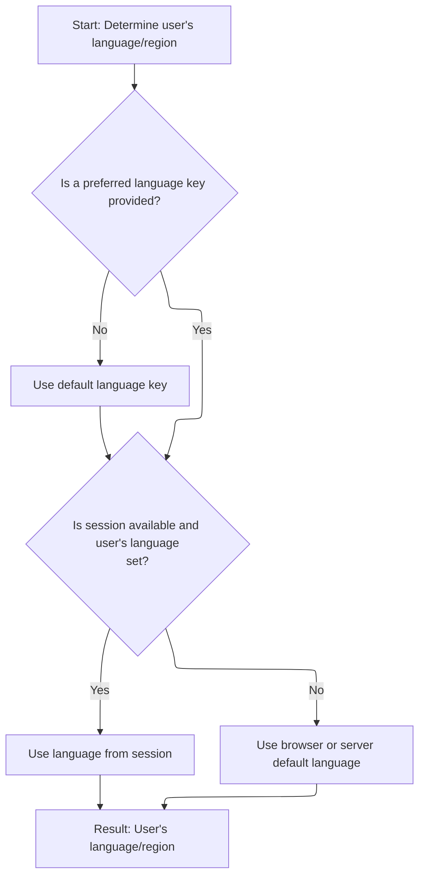

This document explains how the system determines and provides the user's language and region preference for the current session. By resolving the locale from session data or browser settings, the application can display content in the user's preferred language and format. The process takes the current page context and an optional language key as input, and outputs the resolved locale.

# Extracting Locale from Page Context

<SwmSnippet path="/taglib/src/main/java/org/apache/struts/taglib/TagUtils.java" line="830">

---

In <SwmToken path="taglib/src/main/java/org/apache/struts/taglib/TagUtils.java" pos="830:5:5" line-data="    public Locale getUserLocale(PageContext pageContext, String locale) {">`getUserLocale`</SwmToken>, we're grabbing the request from the <SwmToken path="taglib/src/main/java/org/apache/struts/taglib/TagUtils.java" pos="830:7:7" line-data="    public Locale getUserLocale(PageContext pageContext, String locale) {">`PageContext`</SwmToken> and passing it to <SwmToken path="taglib/src/main/java/org/apache/struts/taglib/TagUtils.java" pos="831:3:3" line-data="        return RequestUtils.getUserLocale((HttpServletRequest) pageContext">`RequestUtils`</SwmToken>. This lets us access session and request data for locale resolution, so we need to call <SwmToken path="core/src/main/java/org/apache/struts/chain/contexts/ServletActionContext.java" pos="39:4:4" line-data="public class ServletActionContext extends WebActionContext {">`ServletActionContext`</SwmToken> next to get the actual request object.

```java
    public Locale getUserLocale(PageContext pageContext, String locale) {
        return RequestUtils.getUserLocale((HttpServletRequest) pageContext
            .getRequest(), locale);
```

---

</SwmSnippet>

## Retrieving the HTTP Request from Context

<SwmSnippet path="/core/src/main/java/org/apache/struts/chain/contexts/ServletActionContext.java" line="94">

---

<SwmToken path="core/src/main/java/org/apache/struts/chain/contexts/ServletActionContext.java" pos="94:5:5" line-data="    public HttpServletRequest getRequest() {">`getRequest`</SwmToken> pulls the request from <SwmToken path="core/src/main/java/org/apache/struts/chain/contexts/ServletActionContext.java" pos="95:3:3" line-data="        return servletWebContext().getRequest();">`servletWebContext`</SwmToken>, which abstracts the retrieval so we can handle different context types. This step is needed to get the actual <SwmToken path="core/src/main/java/org/apache/struts/chain/contexts/ServletActionContext.java" pos="94:3:3" line-data="    public HttpServletRequest getRequest() {">`HttpServletRequest`</SwmToken> for locale lookup.

```java
    public HttpServletRequest getRequest() {
        return servletWebContext().getRequest();
    }
```

---

</SwmSnippet>

<SwmSnippet path="/core/src/main/java/org/apache/struts/chain/contexts/ServletActionContext.java" line="67">

---

<SwmToken path="core/src/main/java/org/apache/struts/chain/contexts/ServletActionContext.java" pos="67:5:5" line-data="    protected ServletWebContext servletWebContext() {">`servletWebContext`</SwmToken> just casts the base context to <SwmToken path="core/src/main/java/org/apache/struts/chain/contexts/ServletActionContext.java" pos="67:3:3" line-data="    protected ServletWebContext servletWebContext() {">`ServletWebContext`</SwmToken>, assuming it's the right type. This lets us access servlet-specific features like the request, but it's up to the framework setup to ensure the cast is valid.

```java
    protected ServletWebContext servletWebContext() {
        return (ServletWebContext) this.getBaseContext();
    }
```

---

</SwmSnippet>

## Passing Request for Locale Resolution



<SwmSnippet path="/taglib/src/main/java/org/apache/struts/taglib/TagUtils.java" line="831">

---

Back in TagUtils.getUserLocale, we just got the request from <SwmToken path="core/src/main/java/org/apache/struts/chain/contexts/ServletActionContext.java" pos="39:4:4" line-data="public class ServletActionContext extends WebActionContext {">`ServletActionContext`</SwmToken> and now hand it off to <SwmToken path="taglib/src/main/java/org/apache/struts/taglib/TagUtils.java" pos="831:3:3" line-data="        return RequestUtils.getUserLocale((HttpServletRequest) pageContext">`RequestUtils`</SwmToken>. This step delegates the actual locale extraction to a utility that handles session and request logic.

```java
        return RequestUtils.getUserLocale((HttpServletRequest) pageContext
            .getRequest(), locale);
    }
```

---

</SwmSnippet>

<SwmSnippet path="/core/src/main/java/org/apache/struts/util/RequestUtils.java" line="299">

---

<SwmToken path="core/src/main/java/org/apache/struts/util/RequestUtils.java" pos="299:7:7" line-data="    public static Locale getUserLocale(HttpServletRequest request, String locale) {">`getUserLocale`</SwmToken> in <SwmToken path="taglib/src/main/java/org/apache/struts/taglib/TagUtils.java" pos="831:3:3" line-data="        return RequestUtils.getUserLocale((HttpServletRequest) pageContext">`RequestUtils`</SwmToken> checks the session for a Locale using the provided key (or <SwmToken path="core/src/main/java/org/apache/struts/util/RequestUtils.java" pos="304:5:7" line-data="            locale = Globals.LOCALE_KEY;">`Globals.LOCALE_KEY`</SwmToken> if none is given). If nothing's found, it grabs the Locale from the request, so there's always a fallback.

```java
    public static Locale getUserLocale(HttpServletRequest request, String locale) {
        Locale userLocale = null;
        HttpSession session = request.getSession(false);

        if (locale == null) {
            locale = Globals.LOCALE_KEY;
        }

        // Only check session if sessions are enabled
        if (session != null) {
            userLocale = (Locale) session.getAttribute(locale);
        }

        if (userLocale == null) {
            // Returns Locale based on Accept-Language header or the server default
            userLocale = request.getLocale();
        }

        return userLocale;
    }
```

---

</SwmSnippet>

&nbsp;

*This is an auto-generated document by Swimm 🌊 and has not yet been verified by a human*

<SwmMeta version="3.0.0" repo-id="Z2l0aHViJTNBJTNBc3RydXRzMSUzQSUzQVN3aW1tLURlbW8=" repo-name="struts1"><sup>Powered by [Swimm](https://app.swimm.io/)</sup></SwmMeta>
