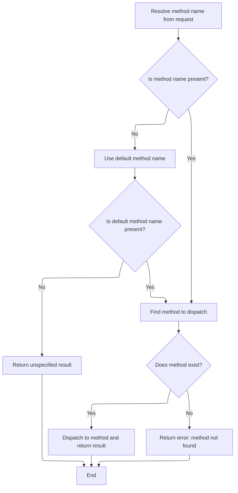
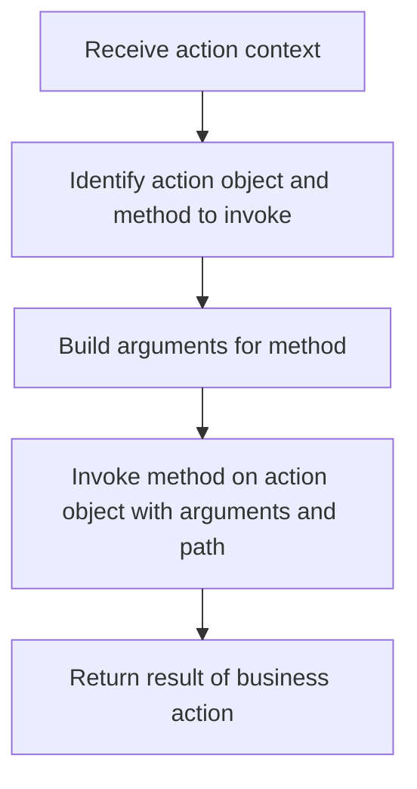

This document describes how incoming action requests are routed to the correct business action and executed. The system determines the appropriate method to handle each request and returns the result of the invoked method or an error if the method is not found.

# Resolving and Routing Action Methods



<SwmSnippet path="/core/src/main/java/org/apache/struts/dispatcher/AbstractDispatcher.java" line="115">

---

<SwmToken path="core/src/main/java/org/apache/struts/dispatcher/AbstractDispatcher.java" pos="115:5:5" line-data="    public Object dispatch(ActionContext context) throws Exception {">`dispatch`</SwmToken> kicks off the flow by figuring out which action method to call based on the context. If it can't find a method name, it tries a default, and if that's still missing, it hands off to <SwmToken path="core/src/main/java/org/apache/struts/dispatcher/AbstractDispatcher.java" pos="125:3:3" line-data="            return unspecified(context);">`unspecified`</SwmToken> to handle the edge case. If the method doesn't exist, it logs the details (including the method name) but throws a sanitized exception to avoid leaking info or XSS. Once it has a valid Method object, it hands off to <SwmToken path="core/src/main/java/org/apache/struts/dispatcher/AbstractDispatcher.java" pos="147:3:3" line-data="        return dispatchMethod(context, method, methodName);">`dispatchMethod`</SwmToken> to actually run the method.

```java
    public Object dispatch(ActionContext context) throws Exception {
        // Resolve the method name; fallback to default if necessary
        String methodName = resolveMethodName(context);
        if ((methodName == null) || "".equals(methodName)) {
            methodName = getDefaultMethodName();
        }

        // Ensure there is a specified method name to invoke.
        // This may be null if the user hacks the query string.
        if (methodName == null) {
            return unspecified(context);
        }

        // Identify the method object to dispatch
        Method method;
        try {
            method = getMethod(context, methodName);
        } catch (NoSuchMethodException e) {
            // The log message reveals the offending method name...
            String path = context.getActionConfig().getPath();
            String message = messages.getMessage(MSG_KEY_MISSING_METHOD_LOG, path, methodName);
            log.error(message, e);

            // ...but the exception thrown does not
            // See r383718 (XSS vulnerability)
            String userMsg = messages.getMessage(MSG_KEY_MISSING_METHOD, path);
            NoSuchMethodException e2 = new NoSuchMethodException(userMsg);
            e2.initCause(e);
            throw e2;
        }

        // Invoke the named method and return its result
        return dispatchMethod(context, method, methodName);
    }
```

---

</SwmSnippet>

# Preparing and Invoking the Action Method



<SwmSnippet path="/core/src/main/java/org/apache/struts/dispatcher/AbstractDispatcher.java" line="160">

---

<SwmToken path="core/src/main/java/org/apache/struts/dispatcher/AbstractDispatcher.java" pos="160:7:7" line-data="    protected final Object dispatchMethod(ActionContext context, Method method, String name) throws Exception {">`dispatchMethod`</SwmToken> grabs the action instance, figures out the action path, builds the argument list for the method, and then calls <SwmToken path="core/src/main/java/org/apache/struts/dispatcher/AbstractDispatcher.java" pos="164:3:3" line-data="        return invoke(target, method, args, path);">`invoke`</SwmToken> to actually execute the method with those arguments. The separation lets us handle argument construction and invocation logic independently.

```java
    protected final Object dispatchMethod(ActionContext context, Method method, String name) throws Exception {
        Action target = context.getAction();
        String path = context.getActionConfig().getPath();
        Object[] args = buildMethodArguments(context, method);
        return invoke(target, method, args, path);
    }
```

---

</SwmSnippet>

<SwmSnippet path="/core/src/main/java/org/apache/struts/dispatcher/AbstractDispatcher.java" line="234">

---

<SwmToken path="core/src/main/java/org/apache/struts/dispatcher/AbstractDispatcher.java" pos="234:7:7" line-data="    protected final Object invoke(Object target, Method method, Object[] args, String path) throws Exception {">`invoke`</SwmToken> actually calls the target method with the built arguments. If the method returns void, it returns <SwmToken path="core/src/main/java/org/apache/struts/dispatcher/AbstractDispatcher.java" pos="237:12:14" line-data="            if (method.getReturnType() == void.class) {">`void.class`</SwmToken> instead of null, making it clear that the method intentionally has no return value. It also handles and logs exceptions, rethrowing them as needed.

```java
    protected final Object invoke(Object target, Method method, Object[] args, String path) throws Exception {
        try {
            Object retval = method.invoke(target, args);
            if (method.getReturnType() == void.class) {
                retval = void.class;
            }
            return retval;
        } catch (IllegalAccessException e) {
            String message = messages.getMessage(MSG_KEY_DISPATCH_ERROR, path);
            log.error(message + ":" + method.getName(), e);
            throw e;
        } catch (InvocationTargetException e) {
            // Rethrow the target exception if possible so that the
            // exception handling machinery can deal with it
            Throwable t = e.getTargetException();
            if (t instanceof Exception) {
                throw (Exception) t;
            } else {
                String message = messages.getMessage(MSG_KEY_DISPATCH_ERROR, path);
                log.error(message + ":" + method.getName(), e);
                throw new Exception(t);
            }
        }
    }
```

---

</SwmSnippet>

&nbsp;

*This is an auto-generated document by Swimm 🌊 and has not yet been verified by a human*

<SwmMeta version="3.0.0" repo-id="Z2l0aHViJTNBJTNBc3RydXRzMSUzQSUzQVN3aW1tLURlbW8=" repo-name="struts1"><sup>Powered by [Swimm](https://app.swimm.io/)</sup></SwmMeta>
