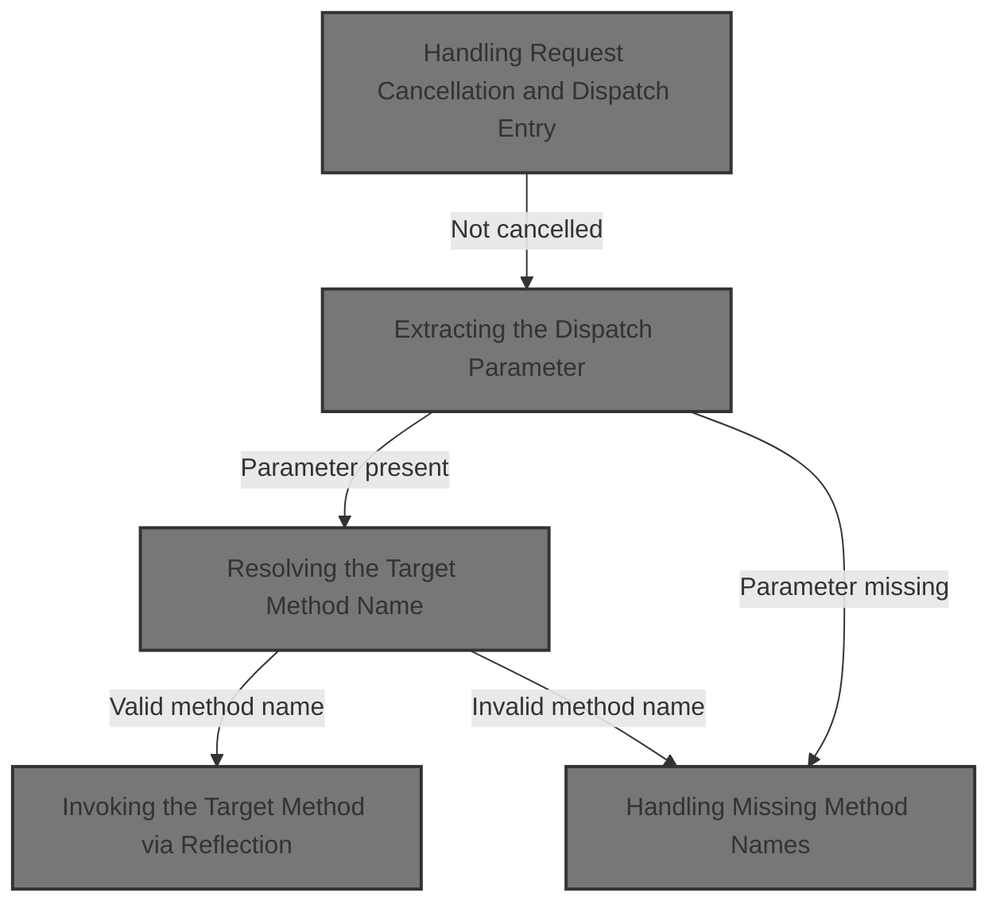
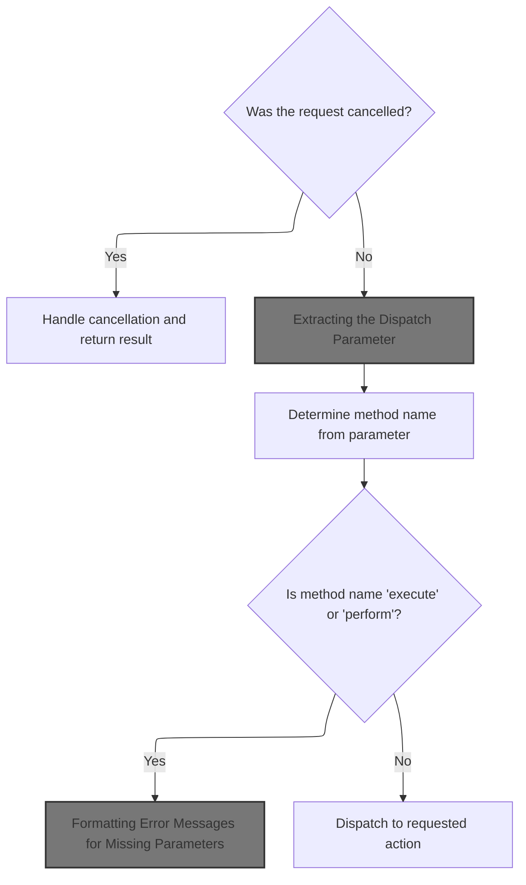
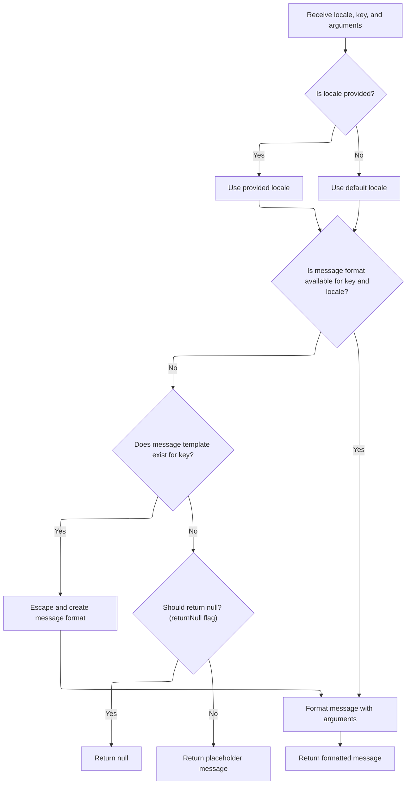
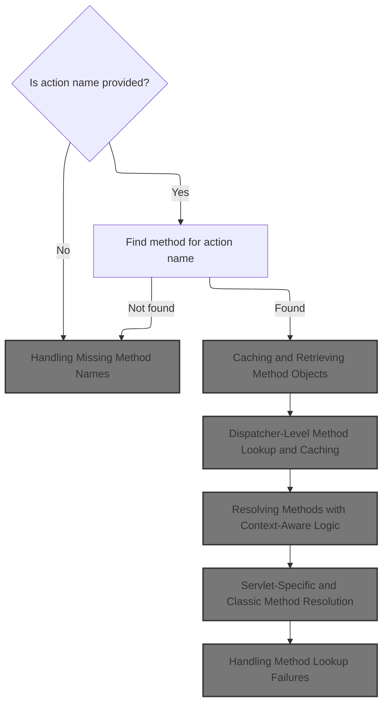
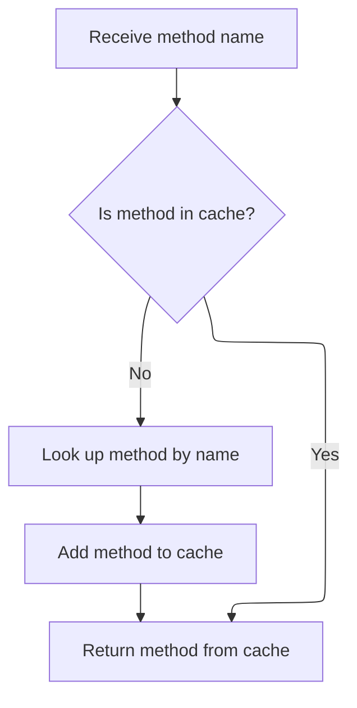
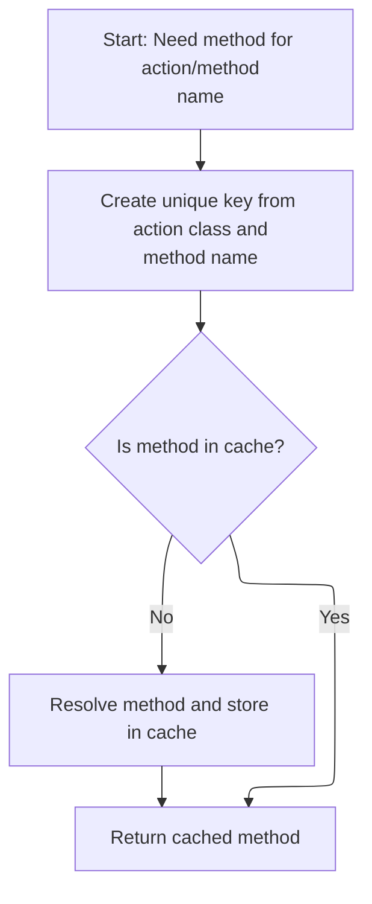
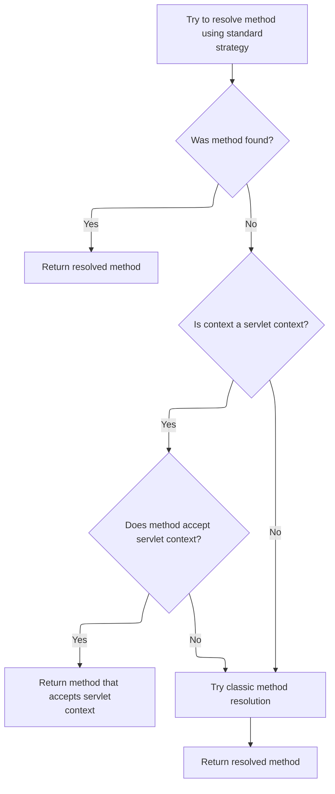
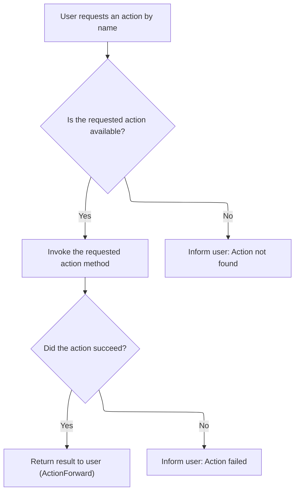

This document explains how user requests are routed to the correct action method. The system checks for cancellations, determines the requested action, and invokes the appropriate business logic, returning the result or an error message.



# Handling Request Cancellation and Dispatch Entry



<SwmSnippet path="/extras/src/main/java/org/apache/struts/actions/DispatchAction.java" line="142">

---

In `DispatchAction.execute`, we check if the request was cancelled (using <SwmToken path="extras/src/main/java/org/apache/struts/actions/DispatchAction.java" pos="145:4:4" line-data="        if (isCancelled(request)) {">`isCancelled`</SwmToken>). If so, we call <SwmToken path="extras/src/main/java/org/apache/struts/actions/DispatchAction.java" pos="146:7:7" line-data="            ActionForward af = cancelled(mapping, form, request, response);">`cancelled`</SwmToken>`(...)` to see if there's a specific <SwmToken path="extras/src/main/java/org/apache/struts/actions/DispatchAction.java" pos="142:3:3" line-data="    public ActionForward execute(ActionMapping mapping, ActionForm form,">`ActionForward`</SwmToken> to return. If <SwmToken path="extras/src/main/java/org/apache/struts/actions/DispatchAction.java" pos="146:7:7" line-data="            ActionForward af = cancelled(mapping, form, request, response);">`cancelled`</SwmToken> gives us a non-null result, we return it right away and skip the rest of the logic. This is how we handle user-initiated or system-triggered cancellations before doing any dispatch work.

```java
    public ActionForward execute(ActionMapping mapping, ActionForm form,
        HttpServletRequest request, HttpServletResponse response)
        throws Exception {
        if (isCancelled(request)) {
            ActionForward af = cancelled(mapping, form, request, response);

            if (af != null) {
                return af;
            }
        }

```

---

</SwmSnippet>

<SwmSnippet path="/extras/src/main/java/org/apache/struts/actions/DispatchAction.java" line="216">

---

<SwmToken path="extras/src/main/java/org/apache/struts/actions/DispatchAction.java" pos="216:5:5" line-data="    protected ActionForward cancelled(ActionMapping mapping, ActionForm form,">`cancelled`</SwmToken> is just a stub here—it always returns null and ignores all arguments. It's a hook for subclasses to override if they want to handle cancellations in a custom way. If not overridden, the flow just continues as if nothing special happened.

```java
    protected ActionForward cancelled(ActionMapping mapping, ActionForm form,
        HttpServletRequest request, HttpServletResponse response)
        throws Exception {
        return null;
    }
```

---

</SwmSnippet>

<SwmSnippet path="/extras/src/main/java/org/apache/struts/actions/DispatchAction.java" line="153">

---

After coming back from <SwmToken path="extras/src/main/java/org/apache/struts/actions/DispatchAction.java" pos="146:7:7" line-data="            ActionForward af = cancelled(mapping, form, request, response);">`cancelled`</SwmToken>, `DispatchAction.execute` grabs a parameter (via <SwmToken path="extras/src/main/java/org/apache/struts/actions/DispatchAction.java" pos="154:7:7" line-data="        String parameter = getParameter(mapping, form, request, response);">`getParameter`</SwmToken>) that tells us which method to dispatch to. This is how the framework figures out what action to run for the current request.

```java
        // Get the parameter. This could be overridden in subclasses.
        String parameter = getParameter(mapping, form, request, response);

```

---

</SwmSnippet>

## Extracting the Dispatch Parameter

<SwmSnippet path="/extras/src/main/java/org/apache/struts/actions/DispatchAction.java" line="315">

---

<SwmToken path="extras/src/main/java/org/apache/struts/actions/DispatchAction.java" pos="315:5:5" line-data="    protected String getParameter(ActionMapping mapping, ActionForm form,">`getParameter`</SwmToken> pulls the parameter name from the mapping. If it's missing, it logs an error and throws a <SwmToken path="extras/src/main/java/org/apache/struts/actions/DispatchAction.java" pos="328:5:5" line-data="            throw new ServletException(message);">`ServletException`</SwmToken> with a message from <SwmToken path="core/src/main/java/org/apache/struts/util/MessageResources.java" pos="51:6:6" line-data="public abstract class MessageResources implements Serializable {">`MessageResources`</SwmToken>. This stops the flow if dispatching can't be determined.

```java
    protected String getParameter(ActionMapping mapping, ActionForm form,
        HttpServletRequest request, HttpServletResponse response)
        throws Exception {

        // Identify the request parameter containing the method name
        String parameter = mapping.getParameter();

        if (parameter == null) {
            String message =
                messages.getMessage("dispatch.handler", mapping.getPath());

            log.error(message);

            throw new ServletException(message);
        }


        return parameter;
    }
```

---

</SwmSnippet>

## Formatting Error Messages for Missing Parameters

<SwmSnippet path="/core/src/main/java/org/apache/struts/util/MessageResources.java" line="218">

---

<SwmToken path="core/src/main/java/org/apache/struts/util/MessageResources.java" pos="218:5:15" line-data="    public String getMessage(String key, Object arg0) {">`getMessage(String key, Object arg0)`</SwmToken> just wraps the argument and calls the more general overload with a Locale and an Object array. This sets up message formatting and localization.

```java
    public String getMessage(String key, Object arg0) {
        return this.getMessage((Locale) null, key, arg0);
    }
```

---

</SwmSnippet>

## Preparing Message Formatting Arguments

<SwmSnippet path="/core/src/main/java/org/apache/struts/util/MessageResources.java" line="324">

---

<SwmToken path="core/src/main/java/org/apache/struts/util/MessageResources.java" pos="324:5:5" line-data="    public String getMessage(Locale locale, String key, Object arg0) {">`getMessage`</SwmToken>`(`<SwmToken path="core/src/main/java/org/apache/struts/util/MessageResources.java" pos="324:7:7" line-data="    public String getMessage(Locale locale, String key, Object arg0) {">`Locale`</SwmToken>`, `<SwmToken path="core/src/main/java/org/apache/struts/util/MessageResources.java" pos="324:3:3" line-data="    public String getMessage(Locale locale, String key, Object arg0) {">`String`</SwmToken>`, `<SwmToken path="core/src/main/java/org/apache/struts/util/MessageResources.java" pos="324:17:17" line-data="    public String getMessage(Locale locale, String key, Object arg0) {">`Object`</SwmToken>`)` just wraps the single argument in an array and calls the main formatting method. This keeps the API flexible for messages with different numbers of arguments.

```java
    public String getMessage(Locale locale, String key, Object arg0) {
        return this.getMessage(locale, key, new Object[] { arg0 });
    }
```

---

</SwmSnippet>

## Formatting and Escaping Message Strings



<SwmSnippet path="/core/src/main/java/org/apache/struts/util/MessageResources.java" line="286">

---

<SwmToken path="core/src/main/java/org/apache/struts/util/MessageResources.java" pos="286:5:5" line-data="    public String getMessage(Locale locale, String key, Object[] args) {">`getMessage`</SwmToken>`(`<SwmToken path="core/src/main/java/org/apache/struts/util/MessageResources.java" pos="286:7:7" line-data="    public String getMessage(Locale locale, String key, Object[] args) {">`Locale`</SwmToken>`, `<SwmToken path="core/src/main/java/org/apache/struts/util/MessageResources.java" pos="286:3:3" line-data="    public String getMessage(Locale locale, String key, Object[] args) {">`String`</SwmToken>`, `<SwmToken path="core/src/main/java/org/apache/struts/util/MessageResources.java" pos="286:17:17" line-data="    public String getMessage(Locale locale, String key, Object[] args) {">`Object`</SwmToken>`[])` checks the cache for a <SwmToken path="core/src/main/java/org/apache/struts/util/MessageResources.java" pos="287:5:5" line-data="        // Cache MessageFormat instances as they are accessed">`MessageFormat`</SwmToken>, creates and escapes one if missing, and formats the message with the given arguments. If the format string isn't found, it returns a placeholder or null.

```java
    public String getMessage(Locale locale, String key, Object[] args) {
        // Cache MessageFormat instances as they are accessed
        if (locale == null) {
            locale = defaultLocale;
        }

        MessageFormat format = null;
        String formatKey = messageKey(locale, key);

        synchronized (formats) {
            format = (MessageFormat) formats.get(formatKey);

            if (format == null) {
                String formatString = getMessage(locale, key);

                if (formatString == null) {
                    return returnNull ? null : ("???" + formatKey + "???");
                }

                format = new MessageFormat(escape(formatString));
                format.setLocale(locale);
                formats.put(formatKey, format);
            }
        }

        return format.format(args);
    }
```

---

</SwmSnippet>

<SwmSnippet path="/core/src/main/java/org/apache/struts/util/MessageResources.java" line="417">

---

<SwmToken path="core/src/main/java/org/apache/struts/util/MessageResources.java" pos="417:5:5" line-data="    protected String escape(String string) {">`escape`</SwmToken> checks if escaping is enabled, and if so, doubles every single quote in the string. This is to keep <SwmToken path="core/src/main/java/org/apache/struts/util/MessageResources.java" pos="287:5:5" line-data="        // Cache MessageFormat instances as they are accessed">`MessageFormat`</SwmToken> happy and avoid formatting bugs.

```java
    protected String escape(String string) {
        if (!isEscape()) {
            return string;
        }

        if ((string == null) || (string.indexOf('\'') < 0)) {
            return string;
        }

        int n = string.length();
        StringBuffer sb = new StringBuffer(n);

        for (int i = 0; i < n; i++) {
            char ch = string.charAt(i);

            if (ch == '\'') {
                sb.append('\'');
            }

            sb.append(ch);
        }
```

---

</SwmSnippet>

## Resolving the Target Method Name

<SwmSnippet path="/extras/src/main/java/org/apache/struts/actions/DispatchAction.java" line="156">

---

After getting the parameter, `DispatchAction.execute` calls <SwmToken path="extras/src/main/java/org/apache/struts/actions/DispatchAction.java" pos="158:1:1" line-data="            getMethodName(mapping, form, request, response, parameter);">`getMethodName`</SwmToken> to figure out the actual method name to invoke. This lets subclasses tweak how parameters map to method names.

```java
        // Get the method's name. This could be overridden in subclasses.
        String name =
            getMethodName(mapping, form, request, response, parameter);

```

---

</SwmSnippet>

<SwmSnippet path="/extras/src/main/java/org/apache/struts/actions/DispatchAction.java" line="371">

---

<SwmToken path="extras/src/main/java/org/apache/struts/actions/DispatchAction.java" pos="371:5:5" line-data="    protected String getMethodName(ActionMapping mapping, ActionForm form,">`getMethodName`</SwmToken> just grabs the method name from the request using the parameter key. This is how the framework lets the client pick which method to run.

```java
    protected String getMethodName(ActionMapping mapping, ActionForm form,
        HttpServletRequest request, HttpServletResponse response,
        String parameter) throws Exception {
        // Identify the method name to be dispatched to.
        // dispatchMethod() will call unspecified() if name is null
        return request.getParameter(parameter);
    }
```

---

</SwmSnippet>

<SwmSnippet path="/extras/src/main/java/org/apache/struts/actions/DispatchAction.java" line="160">

---

After getting the method name, `DispatchAction.execute` checks if it's 'execute' or 'perform' to avoid recursion. If so, it logs an error and throws a <SwmToken path="extras/src/main/java/org/apache/struts/actions/DispatchAction.java" pos="166:5:5" line-data="            throw new ServletException(message);">`ServletException`</SwmToken> with a message from <SwmToken path="core/src/main/java/org/apache/struts/util/MessageResources.java" pos="51:6:6" line-data="public abstract class MessageResources implements Serializable {">`MessageResources`</SwmToken>.

```java
        // Prevent recursive calls
        if ("execute".equals(name) || "perform".equals(name)) {
            String message =
                messages.getMessage("dispatch.recursive", mapping.getPath());

            log.error(message);
            throw new ServletException(message);
        }

```

---

</SwmSnippet>

<SwmSnippet path="/extras/src/main/java/org/apache/struts/actions/DispatchAction.java" line="169">

---

After all the checks, `DispatchAction.execute` calls <SwmToken path="extras/src/main/java/org/apache/struts/actions/DispatchAction.java" pos="170:3:3" line-data="        return dispatchMethod(mapping, form, request, response, name);">`dispatchMethod`</SwmToken> with the resolved method name and returns whatever <SwmToken path="extras/src/main/java/org/apache/struts/actions/DispatchAction.java" pos="142:3:3" line-data="    public ActionForward execute(ActionMapping mapping, ActionForm form,">`ActionForward`</SwmToken> it gets. This is where the actual action method gets called.

```java
        // Invoke the named method, and return the result
        return dispatchMethod(mapping, form, request, response, name);
    }
```

---

</SwmSnippet>

# Invoking the Target Method via Reflection



<SwmSnippet path="/extras/src/main/java/org/apache/struts/actions/DispatchAction.java" line="238">

---

In <SwmToken path="extras/src/main/java/org/apache/struts/actions/DispatchAction.java" pos="238:5:5" line-data="    protected ActionForward dispatchMethod(ActionMapping mapping,">`dispatchMethod`</SwmToken>, if the method name is null, we call <SwmToken path="extras/src/main/java/org/apache/struts/actions/DispatchAction.java" pos="245:5:5" line-data="            return this.unspecified(mapping, form, request, response);">`unspecified`</SwmToken> to handle the case where no valid method was provided. This avoids trying to reflectively call a method with a null name.

```java
    protected ActionForward dispatchMethod(ActionMapping mapping,
        ActionForm form, HttpServletRequest request,
        HttpServletResponse response, String name)
        throws Exception {
        // Make sure we have a valid method name to call.
        // This may be null if the user hacks the query string.
        if (name == null) {
            return this.unspecified(mapping, form, request, response);
        }

```

---

</SwmSnippet>

## Handling Missing Method Names

<SwmSnippet path="/extras/src/main/java/org/apache/struts/actions/DispatchAction.java" line="188">

---

In <SwmToken path="extras/src/main/java/org/apache/struts/actions/DispatchAction.java" pos="188:5:5" line-data="    protected ActionForward unspecified(ActionMapping mapping, ActionForm form,">`unspecified`</SwmToken>, we build an error message using the mapping path and parameter name (via <SwmToken path="extras/src/main/java/org/apache/struts/actions/DispatchAction.java" pos="193:3:3" line-data="                mapping.getParameter());">`getParameter`</SwmToken>) to log and report exactly what's missing in the request.

```java
    protected ActionForward unspecified(ActionMapping mapping, ActionForm form,
        HttpServletRequest request, HttpServletResponse response)
        throws Exception {
        String message =
            messages.getMessage("dispatch.parameter", mapping.getPath(),
                mapping.getParameter());
```

---

</SwmSnippet>

<SwmSnippet path="/extras/src/main/java/org/apache/struts/actions/DispatchAction.java" line="192">

---

After getting the parameter, <SwmToken path="extras/src/main/java/org/apache/struts/actions/DispatchAction.java" pos="188:5:5" line-data="    protected ActionForward unspecified(ActionMapping mapping, ActionForm form,">`unspecified`</SwmToken> logs the error message (which is localized via <SwmToken path="core/src/main/java/org/apache/struts/util/MessageResources.java" pos="51:6:6" line-data="public abstract class MessageResources implements Serializable {">`MessageResources`</SwmToken>) before throwing the exception. This helps with debugging and internationalization.

```java
            messages.getMessage("dispatch.parameter", mapping.getPath(),
                mapping.getParameter());

        log.error(message);

```

---

</SwmSnippet>

<SwmSnippet path="/extras/src/main/java/org/apache/struts/actions/DispatchAction.java" line="197">

---

After logging the error, <SwmToken path="extras/src/main/java/org/apache/struts/actions/DispatchAction.java" pos="188:5:5" line-data="    protected ActionForward unspecified(ActionMapping mapping, ActionForm form,">`unspecified`</SwmToken> throws a <SwmToken path="extras/src/main/java/org/apache/struts/actions/DispatchAction.java" pos="197:5:5" line-data="        throw new ServletException(message);">`ServletException`</SwmToken> with the message, which halts processing and signals an error to the framework.

```java
        throw new ServletException(message);
    }
```

---

</SwmSnippet>

## Resolving the Method Object for Dispatch

<SwmSnippet path="/extras/src/main/java/org/apache/struts/actions/DispatchAction.java" line="248">

---

After handling unspecified, <SwmToken path="extras/src/main/java/org/apache/struts/actions/DispatchAction.java" pos="170:3:3" line-data="        return dispatchMethod(mapping, form, request, response, name);">`dispatchMethod`</SwmToken> tries to get the Method object for the given name (using <SwmToken path="extras/src/main/java/org/apache/struts/actions/DispatchAction.java" pos="252:5:5" line-data="            method = getMethod(name);">`getMethod`</SwmToken>). This uses a cache to speed up repeated lookups.

```java
        // Identify the method object to be dispatched to
        Method method = null;

        try {
            method = getMethod(name);
```

---

</SwmSnippet>

## Caching and Retrieving Method Objects



<SwmSnippet path="/extras/src/main/java/org/apache/struts/actions/DispatchAction.java" line="344">

---

<SwmToken path="extras/src/main/java/org/apache/struts/actions/DispatchAction.java" pos="344:5:5" line-data="    protected Method getMethod(String name)">`getMethod`</SwmToken> checks the cache for the Method object, and if missing, uses reflection to find it and puts it in the cache. The whole thing is synchronized for thread safety.

```java
    protected Method getMethod(String name)
        throws NoSuchMethodException {
        synchronized (methods) {
            Method method = (Method) methods.get(name);

            if (method == null) {
                method = clazz.getMethod(name, types);
                methods.put(name, method);
            }

            return (method);
        }
    }
```

---

</SwmSnippet>

## Dispatcher-Level Method Lookup and Caching



<SwmSnippet path="/core/src/main/java/org/apache/struts/dispatcher/AbstractDispatcher.java" line="203">

---

<SwmToken path="core/src/main/java/org/apache/struts/dispatcher/AbstractDispatcher.java" pos="203:7:7" line-data="    protected final Method getMethod(ActionContext context, String methodName) throws NoSuchMethodException {">`getMethod`</SwmToken> in <SwmToken path="core/src/main/java/org/apache/struts/dispatcher/AbstractDispatcher.java" pos="43:6:6" line-data="public abstract class AbstractDispatcher implements Dispatcher, Serializable {">`AbstractDispatcher`</SwmToken> builds a cache key from the action class and method name, checks the cache, and if missing, calls <SwmToken path="core/src/main/java/org/apache/struts/dispatcher/AbstractDispatcher.java" pos="215:5:5" line-data="                method = resolveMethod(context, methodName);">`resolveMethod`</SwmToken> to find and cache the Method object.

```java
    protected final Method getMethod(ActionContext context, String methodName) throws NoSuchMethodException {
        synchronized (methods) {
            // Key the method based on the class-method combination
            StringBuffer keyBuf = new StringBuffer(100);
            keyBuf.append(context.getAction().getClass().getName());
            keyBuf.append(":");
            keyBuf.append(methodName);
            String key = keyBuf.toString();

            Method method = (Method) methods.get(key);

            if (method == null) {
                method = resolveMethod(context, methodName);
                methods.put(key, method);
            }

            return method;
        }
    }
```

---

</SwmSnippet>

## Resolving Methods with Context-Aware Logic

<SwmSnippet path="/core/src/main/java/org/apache/struts/dispatcher/AbstractDispatcher.java" line="288">

---

<SwmToken path="core/src/main/java/org/apache/struts/dispatcher/AbstractDispatcher.java" pos="288:3:3" line-data="    Method resolveMethod(ActionContext context, String methodName) throws NoSuchMethodException {">`resolveMethod`</SwmToken> just hands off to <SwmToken path="core/src/main/java/org/apache/struts/dispatcher/AbstractDispatcher.java" pos="289:3:3" line-data="        return methodResolver.resolveMethod(context, methodName);">`methodResolver`</SwmToken>, which can be customized to handle different method resolution strategies depending on the context.

```java
    Method resolveMethod(ActionContext context, String methodName) throws NoSuchMethodException {
        return methodResolver.resolveMethod(context, methodName);
    }
```

---

</SwmSnippet>

## Servlet-Specific and Classic Method Resolution



<SwmSnippet path="/core/src/main/java/org/apache/struts/dispatcher/servlet/ServletMethodResolver.java" line="110">

---

In <SwmToken path="core/src/main/java/org/apache/struts/dispatcher/servlet/ServletMethodResolver.java" pos="110:5:5" line-data="    public Method resolveMethod(ActionContext context, String methodName) throws NoSuchMethodException {">`resolveMethod`</SwmToken>, we first try the superclass's logic to resolve the method. If that fails, we check for a ServletActionContext-specific method, and if that also fails, we fall back to classic method resolution.

```java
    public Method resolveMethod(ActionContext context, String methodName) throws NoSuchMethodException {
        // First try to resolve anything the superclass supports
        try {
            return super.resolveMethod(context, methodName);
        } catch (NoSuchMethodException e) {
            // continue
        }

```

---

</SwmSnippet>

<SwmSnippet path="/core/src/main/java/org/apache/struts/dispatcher/servlet/ServletMethodResolver.java" line="118">

---

After failing the superclass check, <SwmToken path="core/src/main/java/org/apache/struts/dispatcher/AbstractDispatcher.java" pos="215:5:5" line-data="                method = resolveMethod(context, methodName);">`resolveMethod`</SwmToken> in <SwmToken path="core/src/main/java/org/apache/struts/dispatcher/servlet/ServletMethodResolver.java" pos="49:4:4" line-data="public class ServletMethodResolver extends AbstractMethodResolver {">`ServletMethodResolver`</SwmToken> tries to find a method that takes a <SwmToken path="core/src/main/java/org/apache/struts/dispatcher/servlet/ServletMethodResolver.java" pos="119:8:8" line-data="        if (context instanceof ServletActionContext) {">`ServletActionContext`</SwmToken> parameter. This supports actions that need servlet-specific context.

```java
        // Can the method accept the servlet action context?
        if (context instanceof ServletActionContext) {
            try {
                Class actionClass = context.getAction().getClass();
                return actionClass.getMethod(methodName, new Class[] { ServletActionContext.class });
            } catch (NoSuchMethodException e) {
                // continue
            }
        }

```

---

</SwmSnippet>

<SwmSnippet path="/core/src/main/java/org/apache/struts/dispatcher/servlet/ServletMethodResolver.java" line="128">

---

If both the superclass and <SwmToken path="core/src/main/java/org/apache/struts/dispatcher/servlet/ServletMethodResolver.java" pos="119:8:8" line-data="        if (context instanceof ServletActionContext) {">`ServletActionContext`</SwmToken> checks fail, <SwmToken path="core/src/main/java/org/apache/struts/dispatcher/AbstractDispatcher.java" pos="215:5:5" line-data="                method = resolveMethod(context, methodName);">`resolveMethod`</SwmToken> in <SwmToken path="core/src/main/java/org/apache/struts/dispatcher/servlet/ServletMethodResolver.java" pos="49:4:4" line-data="public class ServletMethodResolver extends AbstractMethodResolver {">`ServletMethodResolver`</SwmToken> falls back to <SwmToken path="core/src/main/java/org/apache/struts/dispatcher/servlet/ServletMethodResolver.java" pos="129:3:3" line-data="        return resolveClassicMethod(context, methodName);">`resolveClassicMethod`</SwmToken> for legacy support.

```java
        // Lastly, try the classical argument listing
        return resolveClassicMethod(context, methodName);
    }
```

---

</SwmSnippet>

<SwmSnippet path="/core/src/main/java/org/apache/struts/dispatcher/servlet/ServletMethodResolver.java" line="105">

---

<SwmToken path="core/src/main/java/org/apache/struts/dispatcher/servlet/ServletMethodResolver.java" pos="105:7:7" line-data="    protected final Method resolveClassicMethod(ActionContext context, String methodName) throws NoSuchMethodException {">`resolveClassicMethod`</SwmToken> uses <SwmToken path="core/src/main/java/org/apache/struts/dispatcher/servlet/ServletMethodResolver.java" pos="107:10:10" line-data="        return actionClass.getMethod(methodName, CLASSIC_EXECUTE_SIGNATURE);">`CLASSIC_EXECUTE_SIGNATURE`</SwmToken> to find the method by name and expected parameter types in the action class. This is how classic (legacy) action methods are resolved.

```java
    protected final Method resolveClassicMethod(ActionContext context, String methodName) throws NoSuchMethodException {
        Class actionClass = context.getAction().getClass();
        return actionClass.getMethod(methodName, CLASSIC_EXECUTE_SIGNATURE);
    }
```

---

</SwmSnippet>

## Handling Method Lookup Failures



<SwmSnippet path="/extras/src/main/java/org/apache/struts/actions/DispatchAction.java" line="253">

---

After logging the technical error, <SwmToken path="extras/src/main/java/org/apache/struts/actions/DispatchAction.java" pos="170:3:3" line-data="        return dispatchMethod(mapping, form, request, response, name);">`dispatchMethod`</SwmToken> gets a user-friendly message from <SwmToken path="core/src/main/java/org/apache/struts/util/MessageResources.java" pos="51:6:6" line-data="public abstract class MessageResources implements Serializable {">`MessageResources`</SwmToken>, wraps it in a new exception, links the original cause, and throws it. This keeps logs and user messages separate.

```java
        } catch (NoSuchMethodException e) {
            String message =
                messages.getMessage("dispatch.method", mapping.getPath(), name);

            log.error(message, e);

```

---

</SwmSnippet>

<SwmSnippet path="/extras/src/main/java/org/apache/struts/actions/DispatchAction.java" line="259">

---

After logging the technical error, <SwmToken path="extras/src/main/java/org/apache/struts/actions/DispatchAction.java" pos="170:3:3" line-data="        return dispatchMethod(mapping, form, request, response, name);">`dispatchMethod`</SwmToken> gets a user-friendly message from <SwmToken path="core/src/main/java/org/apache/struts/util/MessageResources.java" pos="51:6:6" line-data="public abstract class MessageResources implements Serializable {">`MessageResources`</SwmToken>, wraps it in a new exception, links the original cause, and throws it. This keeps logs and user messages separate.

```java
            String userMsg =
                messages.getMessage("dispatch.method.user", mapping.getPath());
            NoSuchMethodException e2 = new NoSuchMethodException(userMsg);
            e2.initCause(e);
            throw e2;
        }

```

---

</SwmSnippet>

<SwmSnippet path="/extras/src/main/java/org/apache/struts/actions/DispatchAction.java" line="266">

---

Here, DispatchAction.dispatchMethod actually calls the resolved method using Java reflection, passing the four expected parameters and casting the result to <SwmToken path="extras/src/main/java/org/apache/struts/actions/DispatchAction.java" pos="266:1:1" line-data="        ActionForward forward = null;">`ActionForward`</SwmToken>. If the method signature doesn't match, or if there's an access or invocation error, we catch the exception, log a formatted message (using <SwmToken path="core/src/main/java/org/apache/struts/util/MessageResources.java" pos="51:6:6" line-data="public abstract class MessageResources implements Serializable {">`MessageResources`</SwmToken> for localization), and handle it by either rethrowing or wrapping it. This is where we rely on <SwmToken path="core/src/main/java/org/apache/struts/util/MessageResources.java" pos="51:6:6" line-data="public abstract class MessageResources implements Serializable {">`MessageResources`</SwmToken> again to make sure error messages are clear and localized, right after coming back from its logic. Finally, we return the <SwmToken path="extras/src/main/java/org/apache/struts/actions/DispatchAction.java" pos="266:1:1" line-data="        ActionForward forward = null;">`ActionForward`</SwmToken> from the invoked method, or propagate the error if something went wrong.

```java
        ActionForward forward = null;

        try {
            Object[] args = { mapping, form, request, response };

            forward = (ActionForward) method.invoke(this, args);
        } catch (ClassCastException e) {
            String message =
                messages.getMessage("dispatch.return", mapping.getPath(), name);

            log.error(message, e);
            throw e;
        } catch (IllegalAccessException e) {
            String message =
                messages.getMessage("dispatch.error", mapping.getPath(), name);

            log.error(message, e);
            throw e;
        } catch (InvocationTargetException e) {
            // Rethrow the target exception if possible so that the
            // exception handling machinery can deal with it
            Throwable t = e.getTargetException();

            if (t instanceof Exception) {
                throw ((Exception) t);
            } else {
                String message =
                    messages.getMessage("dispatch.error", mapping.getPath(),
                        name);

                log.error(message, e);
                throw new ServletException(t);
            }
        }

        // Return the returned ActionForward instance
        return (forward);
    }
```

---

</SwmSnippet>

&nbsp;

*This is an auto-generated document by Swimm 🌊 and has not yet been verified by a human*

<SwmMeta version="3.0.0" repo-id="Z2l0aHViJTNBJTNBc3RydXRzMSUzQSUzQVN3aW1tLURlbW8=" repo-name="struts1"><sup>Powered by [Swimm](https://app.swimm.io/)</sup></SwmMeta>
