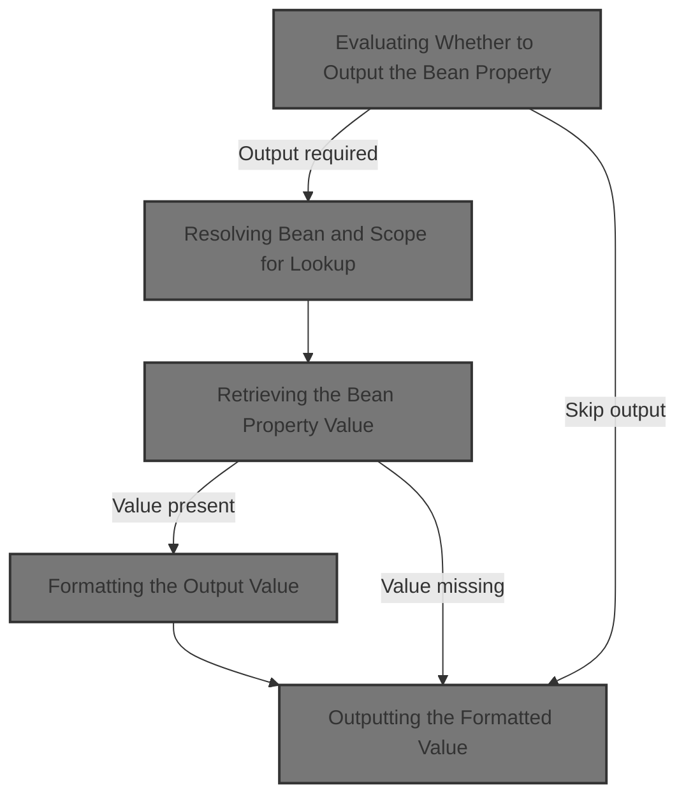
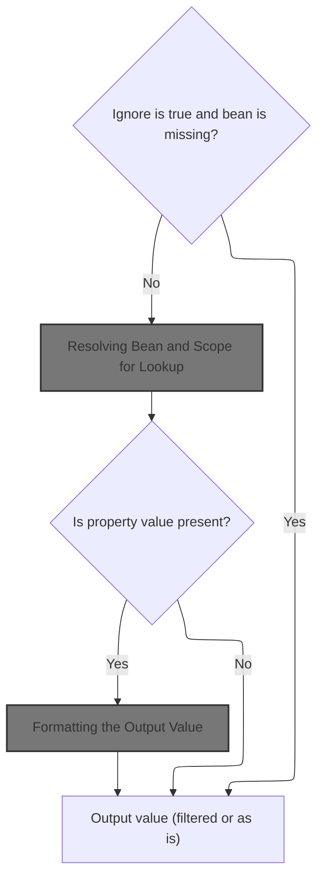
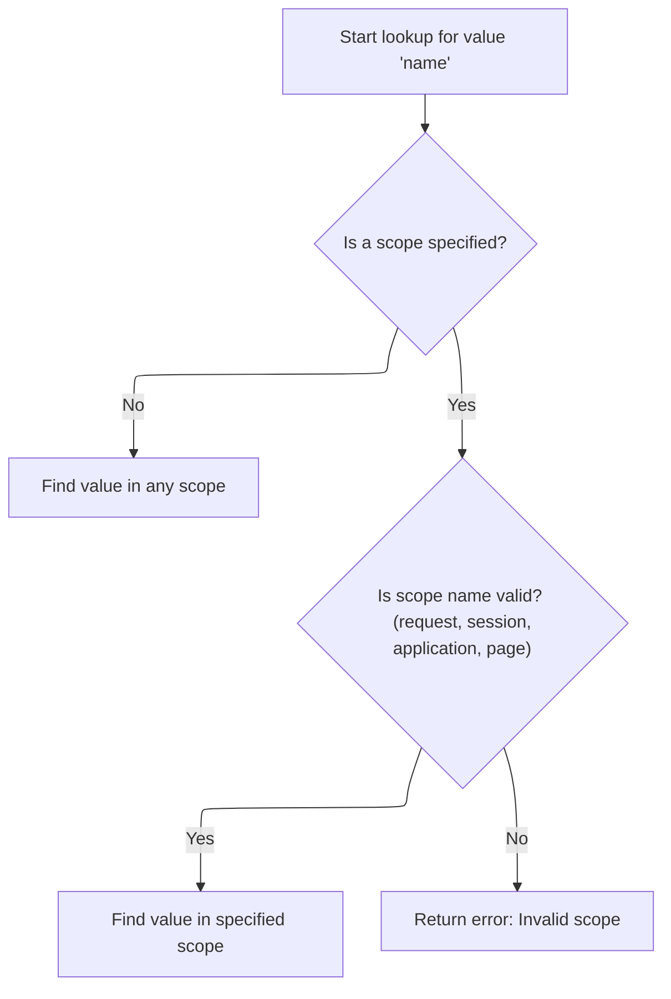
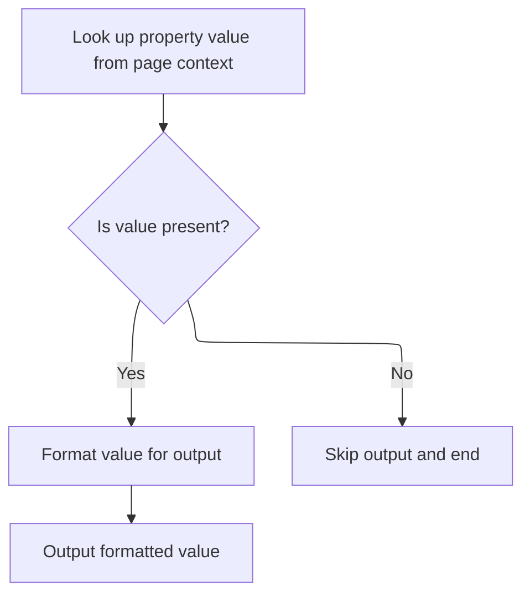
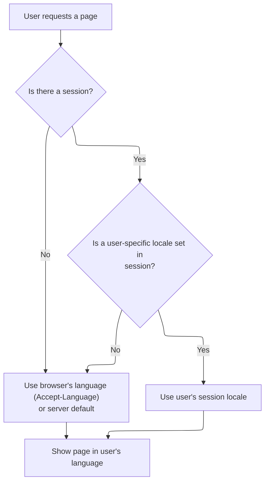
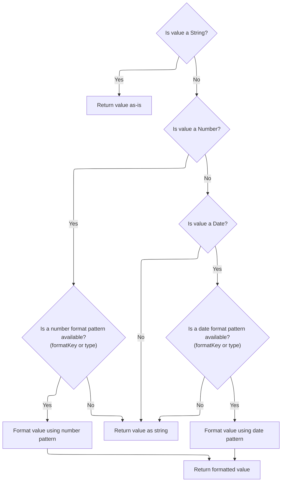

This document describes how a bean property value is dynamically displayed on a JSP page. The flow checks if the property should be shown, retrieves the bean and property, applies formatting and localization rules, and outputs the value for the user.



# Evaluating Whether to Output the Bean Property



<SwmSnippet path="/taglib/src/main/java/org/apache/struts/taglib/bean/WriteTag.java" line="223">

---

In <SwmToken path="taglib/src/main/java/org/apache/struts/taglib/bean/WriteTag.java" pos="223:5:5" line-data="    public int doStartTag() throws JspException {">`doStartTag`</SwmToken>, we check if the bean should be ignored and, if so, use <SwmToken path="taglib/src/main/java/org/apache/struts/taglib/bean/WriteTag.java" pos="226:4:4" line-data="            if (TagUtils.getInstance().lookup(pageContext, name, scope)">`TagUtils`</SwmToken> to see if the bean exists in the given scope. If not found, we skip output. Calling <SwmToken path="taglib/src/main/java/org/apache/struts/taglib/bean/WriteTag.java" pos="226:4:4" line-data="            if (TagUtils.getInstance().lookup(pageContext, name, scope)">`TagUtils`</SwmToken> here centralizes the lookup logic and handles scope resolution consistently.

```java
    public int doStartTag() throws JspException {
        // Look up the requested bean (if necessary)
        if (ignore) {
            if (TagUtils.getInstance().lookup(pageContext, name, scope)
                == null) {
                return (SKIP_BODY); // Nothing to output
            }
        }

```

---

</SwmSnippet>

## Resolving Bean and Scope for Lookup



<SwmSnippet path="/taglib/src/main/java/org/apache/struts/taglib/TagUtils.java" line="863">

---

<SwmToken path="taglib/src/main/java/org/apache/struts/taglib/TagUtils.java" pos="863:5:5" line-data="    public Object lookup(PageContext pageContext, String name, String scopeName)">`lookup`</SwmToken> handles finding the bean by name, either across all scopes or in a specific one. If a scope is given, it resolves the scope integer using <SwmToken path="taglib/src/main/java/org/apache/struts/taglib/TagUtils.java" pos="870:12:12" line-data="            return pageContext.getAttribute(name, instance.getScope(scopeName));">`getScope`</SwmToken>. This lets us abstract bean retrieval and handle errors in one place.

```java
    public Object lookup(PageContext pageContext, String name, String scopeName)
        throws JspException {
        if (scopeName == null) {
            return pageContext.findAttribute(name);
        }

        try {
            return pageContext.getAttribute(name, instance.getScope(scopeName));
        } catch (JspException e) {
            saveException(pageContext, e);
            throw e;
        }
    }
```

---

</SwmSnippet>

<SwmSnippet path="/taglib/src/main/java/org/apache/struts/taglib/TagUtils.java" line="809">

---

<SwmToken path="taglib/src/main/java/org/apache/struts/taglib/TagUtils.java" pos="809:5:5" line-data="    public int getScope(String scopeName)">`getScope`</SwmToken> converts the scope name to lowercase and looks it up in a map. If not found, it throws a <SwmToken path="taglib/src/main/java/org/apache/struts/taglib/TagUtils.java" pos="810:3:3" line-data="        throws JspException {">`JspException`</SwmToken> with a localized message. This ensures only valid, recognized scopes are used and errors are explicit.

```java
    public int getScope(String scopeName)
        throws JspException {
        Integer scope = (Integer) scopes.get(scopeName.toLowerCase());

        if (scope == null) {
            throw new JspException(messages.getMessage("lookup.scope", scope));
        }

        return scope.intValue();
    }
```

---

</SwmSnippet>

## Retrieving the Bean Property Value



<SwmSnippet path="/taglib/src/main/java/org/apache/struts/taglib/bean/WriteTag.java" line="232">

---

Back in WriteTag.doStartTag, after getting the bean, we use <SwmToken path="taglib/src/main/java/org/apache/struts/taglib/bean/WriteTag.java" pos="234:1:1" line-data="            TagUtils.getInstance().lookup(pageContext, name, property, scope);">`TagUtils`</SwmToken> again to fetch the property value. If it's null, we skip output. This keeps the tag from rendering anything if the property doesn't exist.

```java
        // Look up the requested property value
        Object value =
            TagUtils.getInstance().lookup(pageContext, name, property, scope);

        if (value == null) {
            return (SKIP_BODY); // Nothing to output
        }

```

---

</SwmSnippet>

<SwmSnippet path="/taglib/src/main/java/org/apache/struts/taglib/TagUtils.java" line="897">

---

<SwmToken path="taglib/src/main/java/org/apache/struts/taglib/TagUtils.java" pos="897:5:5" line-data="    public Object lookup(PageContext pageContext, String name, String property,">`lookup`</SwmToken> (with property) first finds the bean, then retrieves the property using reflection. If the property is missing or inaccessible, it throws a <SwmToken path="taglib/src/main/java/org/apache/struts/taglib/TagUtils.java" pos="898:8:8" line-data="        String scope) throws JspException {">`JspException`</SwmToken> with a localized message. Special handling is included for the default bean key.

```java
    public Object lookup(PageContext pageContext, String name, String property,
        String scope) throws JspException {
        // Look up the requested bean, and return if requested
        Object bean = lookup(pageContext, name, scope);

        if (bean == null) {
            JspException e = null;

            if (scope == null) {
                e = new JspException(messages.getMessage("lookup.bean.any", name));
            } else {
                e = new JspException(messages.getMessage("lookup.bean", name,
                            scope));
            }

            saveException(pageContext, e);
            throw e;
        }

        if (property == null) {
            return bean;
        }

        // Locate and return the specified property
        try {
            return PropertyUtils.getProperty(bean, property);
        } catch (IllegalAccessException e) {
            saveException(pageContext, e);
            throw new JspException(messages.getMessage("lookup.access",
                    property, name), e);
        } catch (IllegalArgumentException e) {
            saveException(pageContext, e);
            throw new JspException(messages.getMessage("lookup.argument",
                    property, name), e);
        } catch (InvocationTargetException e) {
            Throwable t = e.getTargetException();

            if (t == null) {
                t = e;
            }

            saveException(pageContext, t);
            throw new JspException(messages.getMessage("lookup.target",
                    property, name), e);
        } catch (NoSuchMethodException e) {
            saveException(pageContext, e);

            String beanName = name;

            // Name defaults to Contants.BEAN_KEY if no name is specified by
            // an input tag. Thus lookup the bean under the key and use
            // its class name for the exception message.
            if (Constants.BEAN_KEY.equals(name)) {
                Object obj = pageContext.findAttribute(Constants.BEAN_KEY);

                if (obj != null) {
                    beanName = obj.getClass().getName();
                }
            }

            throw new JspException(messages.getMessage("lookup.method",
                    property, beanName), e);
        }
    }
```

---

</SwmSnippet>

<SwmSnippet path="/taglib/src/main/java/org/apache/struts/taglib/bean/WriteTag.java" line="240">

---

Back in WriteTag.doStartTag, after getting the property value, we call <SwmToken path="taglib/src/main/java/org/apache/struts/taglib/bean/WriteTag.java" pos="241:7:7" line-data="        String output = formatValue(value);">`formatValue`</SwmToken> to convert it to a properly formatted string. This step handles locale and formatting rules before anything is written out.

```java
        // Convert value to the String with some formatting
        String output = formatValue(value);

```

---

</SwmSnippet>

## Formatting the Output Value

<SwmSnippet path="/taglib/src/main/java/org/apache/struts/taglib/bean/WriteTag.java" line="291">

---

In <SwmToken path="taglib/src/main/java/org/apache/struts/taglib/bean/WriteTag.java" pos="291:5:5" line-data="    protected String formatValue(Object valueToFormat)">`formatValue`</SwmToken>, we prep for formatting by getting the user's locale using <SwmToken path="taglib/src/main/java/org/apache/struts/taglib/bean/WriteTag.java" pos="296:1:1" line-data="            TagUtils.getInstance().getUserLocale(pageContext, this.localeKey);">`TagUtils`</SwmToken>. This is needed to apply the right number or date formats for the user's region.

```java
    protected String formatValue(Object valueToFormat)
        throws JspException {
        Format format = null;
        Object value = valueToFormat;
        Locale locale =
            TagUtils.getInstance().getUserLocale(pageContext, this.localeKey);
```

---

</SwmSnippet>

### Determining the User's Locale



<SwmSnippet path="/taglib/src/main/java/org/apache/struts/taglib/TagUtils.java" line="830">

---

<SwmToken path="taglib/src/main/java/org/apache/struts/taglib/TagUtils.java" pos="830:5:5" line-data="    public Locale getUserLocale(PageContext pageContext, String locale) {">`getUserLocale`</SwmToken> in <SwmToken path="taglib/src/main/java/org/apache/struts/taglib/bean/WriteTag.java" pos="226:4:4" line-data="            if (TagUtils.getInstance().lookup(pageContext, name, scope)">`TagUtils`</SwmToken> just passes the request and locale key to <SwmToken path="taglib/src/main/java/org/apache/struts/taglib/TagUtils.java" pos="831:3:3" line-data="        return RequestUtils.getUserLocale((HttpServletRequest) pageContext">`RequestUtils`</SwmToken>, which handles the actual lookup. This keeps locale logic in one place and supports both session and request-based locale detection.

```java
    public Locale getUserLocale(PageContext pageContext, String locale) {
        return RequestUtils.getUserLocale((HttpServletRequest) pageContext
            .getRequest(), locale);
    }
```

---

</SwmSnippet>

<SwmSnippet path="/core/src/main/java/org/apache/struts/util/RequestUtils.java" line="299">

---

<SwmToken path="core/src/main/java/org/apache/struts/util/RequestUtils.java" pos="299:7:7" line-data="    public static Locale getUserLocale(HttpServletRequest request, String locale) {">`getUserLocale`</SwmToken> in <SwmToken path="taglib/src/main/java/org/apache/struts/taglib/TagUtils.java" pos="831:3:3" line-data="        return RequestUtils.getUserLocale((HttpServletRequest) pageContext">`RequestUtils`</SwmToken> checks for a Locale in the session using a key (defaulting to <SwmToken path="core/src/main/java/org/apache/struts/util/RequestUtils.java" pos="304:5:7" line-data="            locale = Globals.LOCALE_KEY;">`Globals.LOCALE_KEY`</SwmToken>). If not found, it falls back to the request's locale, which is usually set by the browser's language settings.

```java
    public static Locale getUserLocale(HttpServletRequest request, String locale) {
        Locale userLocale = null;
        HttpSession session = request.getSession(false);

        if (locale == null) {
            locale = Globals.LOCALE_KEY;
        }

        // Only check session if sessions are enabled
        if (session != null) {
            userLocale = (Locale) session.getAttribute(locale);
        }

        if (userLocale == null) {
            // Returns Locale based on Accept-Language header or the server default
            userLocale = request.getLocale();
        }

        return userLocale;
    }
```

---

</SwmSnippet>

### Applying Formatting Rules to the Value



<SwmSnippet path="/taglib/src/main/java/org/apache/struts/taglib/bean/WriteTag.java" line="297">

---

Back in WriteTag.formatValue, we branch based on the value type: strings are returned directly, numbers and dates get formatted using patterns (from resources or defaults) and the user's locale. If formatting fails, we throw a <SwmToken path="taglib/src/main/java/org/apache/struts/taglib/bean/WriteTag.java" pos="344:1:1" line-data="                        JspException ex =">`JspException`</SwmToken>.

```java
        boolean formatStrFromResources = false;
        String formatString = formatStr;

        // Return String object as is.
        if (value instanceof java.lang.String) {
            return (String) value;
        } else {
            // Try to retrieve format string from resources by the key from
            // formatKey.
            if ((formatString == null) && (formatKey != null)) {
                formatString = retrieveFormatString(this.formatKey);

                if (formatString != null) {
                    formatStrFromResources = true;
                }
            }

            // Prepare format object for numeric values.
            if (value instanceof Number) {
                if (formatString == null) {
                    if ((value instanceof Byte) || (value instanceof Short)
                        || (value instanceof Integer)
                        || (value instanceof Long)
                        || (value instanceof BigInteger)) {
                        formatString = retrieveFormatString(INT_FORMAT_KEY);
                    } else if ((value instanceof Float)
                        || (value instanceof Double)
                        || (value instanceof BigDecimal)) {
                        formatString = retrieveFormatString(FLOAT_FORMAT_KEY);
                    }

                    if (formatString != null) {
                        formatStrFromResources = true;
                    }
                }

                if (formatString != null) {
                    try {
                        format = NumberFormat.getNumberInstance(locale);

                        if (formatStrFromResources) {
                            ((DecimalFormat) format).applyLocalizedPattern(
                                formatString);
                        } else {
                            ((DecimalFormat) format).applyPattern(formatString);
                        }
                    } catch (IllegalArgumentException e) {
                        JspException ex =
                            new JspException(messages.getMessage(
                                    "write.format", formatString), e);

                        TagUtils.getInstance().saveException(pageContext, ex);
                        throw ex;
                    }
                }
            } else if (value instanceof java.util.Date) {
                if (formatString == null) {
                    if (value instanceof java.sql.Timestamp) {
                        formatString =
                            retrieveFormatString(SQL_TIMESTAMP_FORMAT_KEY);
                    } else if (value instanceof java.sql.Date) {
                        formatString =
                            retrieveFormatString(SQL_DATE_FORMAT_KEY);
                    } else if (value instanceof java.sql.Time) {
                        formatString =
                            retrieveFormatString(SQL_TIME_FORMAT_KEY);
                    } else if (value instanceof java.util.Date) {
                        formatString = retrieveFormatString(DATE_FORMAT_KEY);
                    }
                }

                if (formatString != null) {
                    format = new SimpleDateFormat(formatString, locale);
                }
            }
        }

        if (format != null) {
            return format.format(value);
        } else {
            return value.toString();
        }
    }
```

---

</SwmSnippet>

## Outputting the Formatted Value

<SwmSnippet path="/taglib/src/main/java/org/apache/struts/taglib/bean/WriteTag.java" line="243">

---

Back in WriteTag.doStartTag, after formatting, we write the output to the page. If filtering is enabled, we escape HTML characters to prevent XSS; otherwise, we write the raw string. Then we finish the tag processing.

```java
        // Print this property value to our output writer, suitably filtered
        if (filter) {
            TagUtils.getInstance().write(pageContext,
                TagUtils.getInstance().filter(output));
        } else {
            TagUtils.getInstance().write(pageContext, output);
        }

        // Continue processing this page
        return (SKIP_BODY);
    }
```

---

</SwmSnippet>

&nbsp;

*This is an auto-generated document by Swimm 🌊 and has not yet been verified by a human*

<SwmMeta version="3.0.0" repo-id="Z2l0aHViJTNBJTNBc3RydXRzMSUzQSUzQVN3aW1tLURlbW8=" repo-name="struts1"><sup>Powered by [Swimm](https://app.swimm.io/)</sup></SwmMeta>
