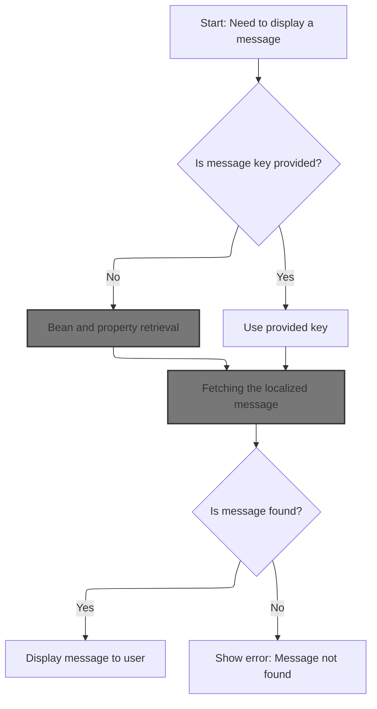
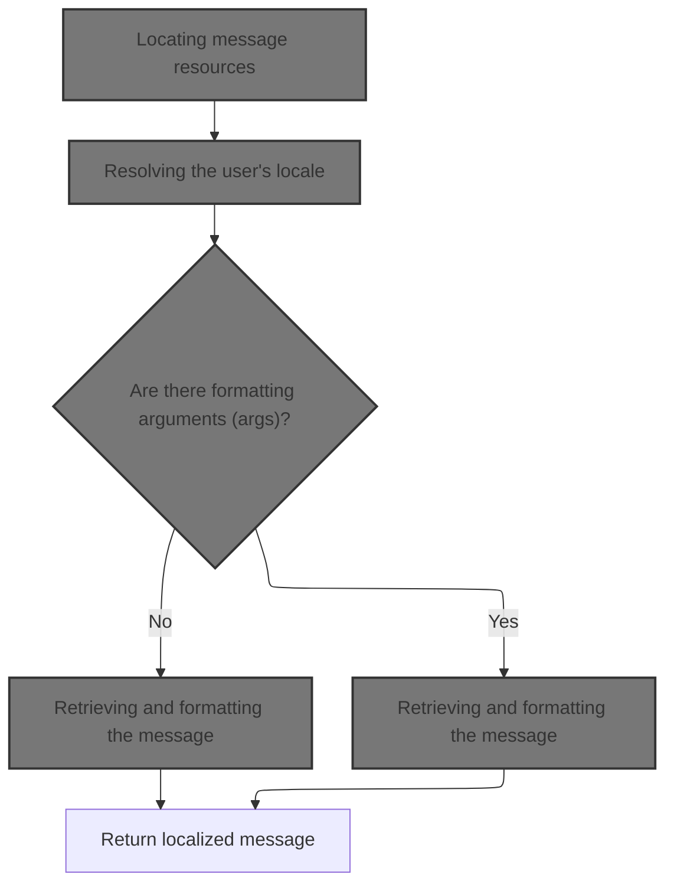
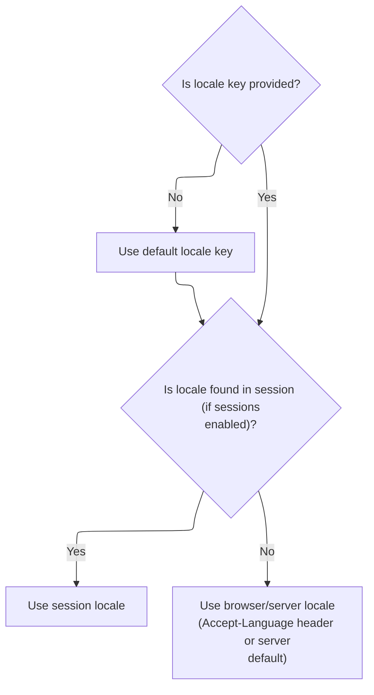
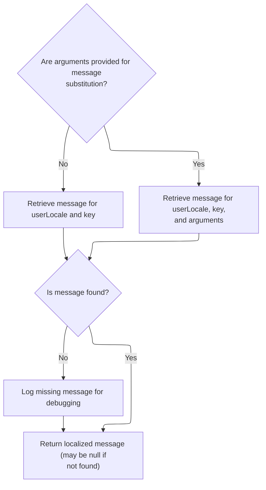
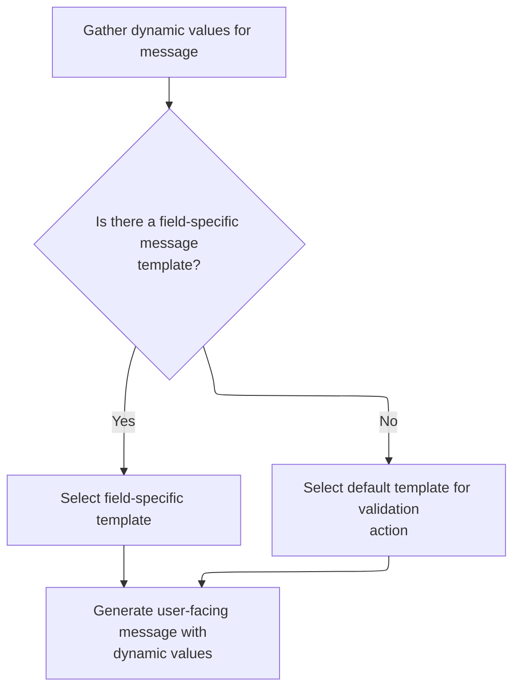

This document outlines how a localized message is displayed on a web page, supporting internationalization and dynamic content. The process involves resolving the message key, preparing arguments, locating message resources, determining the user's locale, and retrieving and displaying the message or reporting an error if it is missing.

# Resolving the message key



<SwmSnippet path="/taglib/src/main/java/org/apache/struts/taglib/bean/MessageTag.java" line="201">

---

In <SwmToken path="taglib/src/main/java/org/apache/struts/taglib/bean/MessageTag.java" pos="201:5:5" line-data="    public int doStartTag() throws JspException {">`doStartTag`</SwmToken>, we check if the key is null and, if so, call <SwmToken path="taglib/src/main/java/org/apache/struts/taglib/bean/MessageTag.java" pos="207:1:5" line-data="                TagUtils.getInstance().lookup(pageContext, name, property, scope);">`TagUtils.getInstance()`</SwmToken>.lookup to fetch a value from the page context. The function expects this value to be either null or a String, since it's used as the key for message retrieval. If it's not a String, we bail out with an exception. Next, we need <SwmToken path="taglib/src/main/java/org/apache/struts/taglib/bean/MessageTag.java" pos="207:1:1" line-data="                TagUtils.getInstance().lookup(pageContext, name, property, scope);">`TagUtils`</SwmToken> to handle the bean/property lookup logic.

```java
    public int doStartTag() throws JspException {
        String key = this.key;

        if (key == null) {
            // Look up the requested property value
            Object value =
                TagUtils.getInstance().lookup(pageContext, name, property, scope);

```

---

</SwmSnippet>

## Bean and property retrieval

<SwmSnippet path="/taglib/src/main/java/org/apache/struts/taglib/TagUtils.java" line="897">

---

In <SwmToken path="taglib/src/main/java/org/apache/struts/taglib/TagUtils.java" pos="897:5:5" line-data="    public Object lookup(PageContext pageContext, String name, String property,">`lookup`</SwmToken>, we grab the bean from the page context using the provided name and scope. If it's missing, we throw a localized exception. If property is null, we just return the bean; otherwise, we use <SwmToken path="taglib/src/main/java/org/apache/struts/taglib/TagUtils.java" pos="922:3:3" line-data="            return PropertyUtils.getProperty(bean, property);">`PropertyUtils`</SwmToken> to fetch the property value. Any property access errors are caught and reported. Next, we need <SwmToken path="taglib/src/main/java/org/apache/struts/taglib/bean/MessageTag.java" pos="207:1:1" line-data="                TagUtils.getInstance().lookup(pageContext, name, property, scope);">`TagUtils`</SwmToken> to save exceptions for error handling.

```java
    public Object lookup(PageContext pageContext, String name, String property,
        String scope) throws JspException {
        // Look up the requested bean, and return if requested
        Object bean = lookup(pageContext, name, scope);

        if (bean == null) {
            JspException e = null;

            if (scope == null) {
                e = new JspException(messages.getMessage("lookup.bean.any", name));
            } else {
                e = new JspException(messages.getMessage("lookup.bean", name,
                            scope));
            }

            saveException(pageContext, e);
            throw e;
        }

        if (property == null) {
            return bean;
        }

        // Locate and return the specified property
        try {
            return PropertyUtils.getProperty(bean, property);
        } catch (IllegalAccessException e) {
            saveException(pageContext, e);
            throw new JspException(messages.getMessage("lookup.access",
                    property, name), e);
        } catch (IllegalArgumentException e) {
            saveException(pageContext, e);
            throw new JspException(messages.getMessage("lookup.argument",
                    property, name), e);
        } catch (InvocationTargetException e) {
            Throwable t = e.getTargetException();

            if (t == null) {
                t = e;
            }

            saveException(pageContext, t);
            throw new JspException(messages.getMessage("lookup.target",
                    property, name), e);
        } catch (NoSuchMethodException e) {
            saveException(pageContext, e);

```

---

</SwmSnippet>

### Recording exceptions in request scope

<SwmSnippet path="/taglib/src/main/java/org/apache/struts/taglib/TagUtils.java" line="1170">

---

<SwmToken path="taglib/src/main/java/org/apache/struts/taglib/TagUtils.java" pos="1170:5:5" line-data="    public void saveException(PageContext pageContext, Throwable exception) {">`saveException`</SwmToken> puts the exception into the page context under a fixed key and always in the request scope. This keeps error info tied to the current request. Next, we use Tiles <SwmToken path="taglib/src/main/java/org/apache/struts/taglib/bean/MessageTag.java" pos="207:1:1" line-data="                TagUtils.getInstance().lookup(pageContext, name, property, scope);">`TagUtils`</SwmToken> to set attributes in request scope, simplifying repeated code.

```java
    public void saveException(PageContext pageContext, Throwable exception) {
        pageContext.setAttribute(Globals.EXCEPTION_KEY, exception,
            PageContext.REQUEST_SCOPE);
    }
```

---

</SwmSnippet>

<SwmSnippet path="/tiles/src/main/java/org/apache/struts/tiles/taglib/util/TagUtils.java" line="290">

---

<SwmToken path="tiles/src/main/java/org/apache/struts/tiles/taglib/util/TagUtils.java" pos="290:7:7" line-data="    public static void setAttribute(PageContext pageContext, String name, Object beanValue)">`setAttribute`</SwmToken> wraps <SwmToken path="tiles/src/main/java/org/apache/struts/tiles/taglib/util/TagUtils.java" pos="292:1:3" line-data="        pageContext.setAttribute(name, beanValue, PageContext.REQUEST_SCOPE);">`pageContext.setAttribute`</SwmToken> and always uses <SwmToken path="tiles/src/main/java/org/apache/struts/tiles/taglib/util/TagUtils.java" pos="292:13:13" line-data="        pageContext.setAttribute(name, beanValue, PageContext.REQUEST_SCOPE);">`REQUEST_SCOPE`</SwmToken>. This limits attribute visibility to the current request and cuts down on repetitive scope arguments.

```java
    public static void setAttribute(PageContext pageContext, String name, Object beanValue)
        throws JspException {
        pageContext.setAttribute(name, beanValue, PageContext.REQUEST_SCOPE);
    }
```

---

</SwmSnippet>

### Handling property access errors

<SwmSnippet path="/taglib/src/main/java/org/apache/struts/taglib/TagUtils.java" line="944">

---

Back in <SwmToken path="taglib/src/main/java/org/apache/struts/taglib/TagUtils.java" pos="947:12:12" line-data="            // an input tag. Thus lookup the bean under the key and use">`lookup`</SwmToken>, after saving the exception, we check if the bean name is the default key and, if so, grab the bean's class name for a more detailed error message. The function then throws a localized exception, using Struts1-specific constants and message localization.

```java
            String beanName = name;

            // Name defaults to Contants.BEAN_KEY if no name is specified by
            // an input tag. Thus lookup the bean under the key and use
            // its class name for the exception message.
            if (Constants.BEAN_KEY.equals(name)) {
                Object obj = pageContext.findAttribute(Constants.BEAN_KEY);

                if (obj != null) {
                    beanName = obj.getClass().getName();
                }
            }

            throw new JspException(messages.getMessage("lookup.method",
                    property, beanName), e);
        }
    }
```

---

</SwmSnippet>

## Validating the message key type

<SwmSnippet path="/taglib/src/main/java/org/apache/struts/taglib/bean/MessageTag.java" line="209">

---

Back in <SwmToken path="taglib/src/main/java/org/apache/struts/taglib/bean/MessageTag.java" pos="201:5:5" line-data="    public int doStartTag() throws JspException {">`doStartTag`</SwmToken>, after getting the value from TagUtils.lookup, we check its type. If it's not a String (and not null), we throw and save an exception using <SwmToken path="taglib/src/main/java/org/apache/struts/taglib/bean/MessageTag.java" pos="213:1:1" line-data="                TagUtils.getInstance().saveException(pageContext, e);">`TagUtils`</SwmToken>. Next, we use Tiles <SwmToken path="taglib/src/main/java/org/apache/struts/taglib/bean/MessageTag.java" pos="213:1:1" line-data="                TagUtils.getInstance().saveException(pageContext, e);">`TagUtils`</SwmToken> to record the exception in request scope.

```java
            if ((value != null) && !(value instanceof String)) {
                JspException e =
                    new JspException(messages.getMessage("message.property", key));

                TagUtils.getInstance().saveException(pageContext, e);
                throw e;
            }

            key = (String) value;
        }

```

---

</SwmSnippet>

<SwmSnippet path="/tiles/src/main/java/org/apache/struts/tiles/taglib/util/TagUtils.java" line="301">

---

<SwmToken path="tiles/src/main/java/org/apache/struts/tiles/taglib/util/TagUtils.java" pos="301:7:7" line-data="    public static void saveException(PageContext pageContext, Throwable exception) {">`saveException`</SwmToken> in Tiles <SwmToken path="taglib/src/main/java/org/apache/struts/taglib/bean/MessageTag.java" pos="207:1:1" line-data="                TagUtils.getInstance().lookup(pageContext, name, property, scope);">`TagUtils`</SwmToken> puts the exception in request scope, making error handling consistent and keeping exceptions tied to the current request.

```java
    public static void saveException(PageContext pageContext, Throwable exception) {
        pageContext.setAttribute(Globals.EXCEPTION_KEY, exception, PageContext.REQUEST_SCOPE);
    }
```

---

</SwmSnippet>

<SwmSnippet path="/taglib/src/main/java/org/apache/struts/taglib/bean/MessageTag.java" line="220">

---

After saving the exception, <SwmToken path="taglib/src/main/java/org/apache/struts/taglib/bean/MessageTag.java" pos="201:5:5" line-data="    public int doStartTag() throws JspException {">`doStartTag`</SwmToken> builds a fixed-size array of arguments for message formatting and calls TagUtils.message to fetch the localized message. If the message is missing, we handle it with error reporting.

```java
        // Construct the optional arguments array we will be using
        Object[] args = new Object[] { arg0, arg1, arg2, arg3, arg4 };

        // Retrieve the message string we are looking for
        String message =
            TagUtils.getInstance().message(pageContext, this.bundle,
                this.localeKey, key, args);

```

---

</SwmSnippet>

## Fetching the localized message



<SwmSnippet path="/taglib/src/main/java/org/apache/struts/taglib/TagUtils.java" line="995">

---

In <SwmToken path="taglib/src/main/java/org/apache/struts/taglib/TagUtils.java" pos="995:5:5" line-data="    public String message(PageContext pageContext, String bundle,">`message`</SwmToken>, we start by grabbing <SwmToken path="taglib/src/main/java/org/apache/struts/taglib/TagUtils.java" pos="998:1:1" line-data="        MessageResources resources =">`MessageResources`</SwmToken> for the bundle and locale. Without these, we can't fetch the actual message. Next, we use <SwmToken path="taglib/src/main/java/org/apache/struts/taglib/bean/MessageTag.java" pos="207:1:1" line-data="                TagUtils.getInstance().lookup(pageContext, name, property, scope);">`TagUtils`</SwmToken> to handle resource retrieval across scopes.

```java
    public String message(PageContext pageContext, String bundle,
        String locale, String key, Object[] args)
        throws JspException {
        MessageResources resources =
            retrieveMessageResources(pageContext, bundle, false);

```

---

</SwmSnippet>

### Locating message resources

```mermaid
%%{init: {"flowchart": {"defaultRenderer": "elk"}} }%%
flowchart TD
    node1["Start: Retrieve message resources"] --> node2{"Is bundle provided?"}
    click node1 openCode "taglib/src/main/java/org/apache/struts/taglib/TagUtils.java:1118:1123"
    node2 -->|"No"| node3["Use default bundle name"]
    click node2 openCode "taglib/src/main/java/org/apache/struts/taglib/TagUtils.java:1123:1125"
    node2 -->|"Yes"| node4{"Should check page scope?"}
    click node3 openCode "taglib/src/main/java/org/apache/struts/taglib/TagUtils.java:1123:1125"
    node3 --> node4
    node4 -->|"Yes"| node5{"Are resources available in page scope?"}
    click node4 openCode "taglib/src/main/java/org/apache/struts/taglib/TagUtils.java:1127:1131"
    node4 -->|"No"| node6{"Are resources available in request
scope?"}
    node5 -->|"Yes"| node10["Return resources"]
    click node5 openCode "taglib/src/main/java/org/apache/struts/taglib/TagUtils.java:1128:1131"
    node5 -->|"No"| node6
    node6 -->|"Yes"| node10
    click node6 openCode "taglib/src/main/java/org/apache/struts/taglib/TagUtils.java:1133:1137"
    node6 -->|"No"| node7["Get module config for application scope"]
    click node7 openCode "taglib/src/main/java/org/apache/struts/taglib/TagUtils.java:1140:1141"
    node7 --> node8{"Are resources available in application
scope (with module prefix)?"}
    click node8 openCode "taglib/src/main/java/org/apache/struts/taglib/TagUtils.java:1143:1145"
    node8 -->|"Yes"| node10
    node8 -->|"No"| node9{"Are resources available in application
scope?"}
    click node9 openCode "taglib/src/main/java/org/apache/struts/taglib/TagUtils.java:1148:1151"
    node9 -->|"Yes"| node10
    node9 -->|"No"| node11["Resources not found: save and throw
exception"]
    click node11 openCode "taglib/src/main/java/org/apache/struts/taglib/TagUtils.java:1153:1159"
    node10["Return resources"]
    click node10 openCode "taglib/src/main/java/org/apache/struts/taglib/TagUtils.java:1161:1162"
classDef HeadingStyle fill:#777777,stroke:#333,stroke-width:2px;

%% Swimm:
%% %%{init: {"flowchart": {"defaultRenderer": "elk"}} }%%
%% flowchart TD
%%     node1["Start: Retrieve message resources"] --> node2{"Is bundle provided?"}
%%     click node1 openCode "<SwmPath>[taglib/…/taglib/TagUtils.java](taglib/src/main/java/org/apache/struts/taglib/TagUtils.java)</SwmPath>:1118:1123"
%%     node2 -->|"No"| node3["Use default bundle name"]
%%     click node2 openCode "<SwmPath>[taglib/…/taglib/TagUtils.java](taglib/src/main/java/org/apache/struts/taglib/TagUtils.java)</SwmPath>:1123:1125"
%%     node2 -->|"Yes"| node4{"Should check page scope?"}
%%     click node3 openCode "<SwmPath>[taglib/…/taglib/TagUtils.java](taglib/src/main/java/org/apache/struts/taglib/TagUtils.java)</SwmPath>:1123:1125"
%%     node3 --> node4
%%     node4 -->|"Yes"| node5{"Are resources available in page scope?"}
%%     click node4 openCode "<SwmPath>[taglib/…/taglib/TagUtils.java](taglib/src/main/java/org/apache/struts/taglib/TagUtils.java)</SwmPath>:1127:1131"
%%     node4 -->|"No"| node6{"Are resources available in request
%% scope?"}
%%     node5 -->|"Yes"| node10["Return resources"]
%%     click node5 openCode "<SwmPath>[taglib/…/taglib/TagUtils.java](taglib/src/main/java/org/apache/struts/taglib/TagUtils.java)</SwmPath>:1128:1131"
%%     node5 -->|"No"| node6
%%     node6 -->|"Yes"| node10
%%     click node6 openCode "<SwmPath>[taglib/…/taglib/TagUtils.java](taglib/src/main/java/org/apache/struts/taglib/TagUtils.java)</SwmPath>:1133:1137"
%%     node6 -->|"No"| node7["Get module config for application scope"]
%%     click node7 openCode "<SwmPath>[taglib/…/taglib/TagUtils.java](taglib/src/main/java/org/apache/struts/taglib/TagUtils.java)</SwmPath>:1140:1141"
%%     node7 --> node8{"Are resources available in application
%% scope (with module prefix)?"}
%%     click node8 openCode "<SwmPath>[taglib/…/taglib/TagUtils.java](taglib/src/main/java/org/apache/struts/taglib/TagUtils.java)</SwmPath>:1143:1145"
%%     node8 -->|"Yes"| node10
%%     node8 -->|"No"| node9{"Are resources available in application
%% scope?"}
%%     click node9 openCode "<SwmPath>[taglib/…/taglib/TagUtils.java](taglib/src/main/java/org/apache/struts/taglib/TagUtils.java)</SwmPath>:1148:1151"
%%     node9 -->|"Yes"| node10
%%     node9 -->|"No"| node11["Resources not found: save and throw
%% exception"]
%%     click node11 openCode "<SwmPath>[taglib/…/taglib/TagUtils.java](taglib/src/main/java/org/apache/struts/taglib/TagUtils.java)</SwmPath>:1153:1159"
%%     node10["Return resources"]
%%     click node10 openCode "<SwmPath>[taglib/…/taglib/TagUtils.java](taglib/src/main/java/org/apache/struts/taglib/TagUtils.java)</SwmPath>:1161:1162"
%% classDef HeadingStyle fill:#777777,stroke:#333,stroke-width:2px;
```



<SwmSnippet path="/taglib/src/main/java/org/apache/struts/taglib/TagUtils.java" line="1118">

---

In <SwmToken path="taglib/src/main/java/org/apache/struts/taglib/TagUtils.java" pos="1118:5:5" line-data="    public MessageResources retrieveMessageResources(PageContext pageContext,">`retrieveMessageResources`</SwmToken>, we look for <SwmToken path="taglib/src/main/java/org/apache/struts/taglib/TagUtils.java" pos="1118:3:3" line-data="    public MessageResources retrieveMessageResources(PageContext pageContext,">`MessageResources`</SwmToken> in page, request, and application scopes, using module prefixes if present. This makes sure we grab the most specific resource available. Next, we use <SwmToken path="tiles/src/main/java/org/apache/struts/tiles/taglib/util/TagUtils.java" pos="34:10:10" line-data="import org.apache.struts.tiles.ComponentContext;">`ComponentContext`</SwmToken> to handle scope-specific attribute retrieval.

```java
    public MessageResources retrieveMessageResources(PageContext pageContext,
        String bundle, boolean checkPageScope)
        throws JspException {
        MessageResources resources = null;

        if (bundle == null) {
            bundle = Globals.MESSAGES_KEY;
        }

        if (checkPageScope) {
            resources =
                (MessageResources) pageContext.getAttribute(bundle,
                    PageContext.PAGE_SCOPE);
        }

        if (resources == null) {
            resources =
                (MessageResources) pageContext.getAttribute(bundle,
                    PageContext.REQUEST_SCOPE);
        }

        if (resources == null) {
            ModuleConfig moduleConfig = getModuleConfig(pageContext);

            resources =
                (MessageResources) pageContext.getAttribute(bundle
                    + moduleConfig.getPrefix(), PageContext.APPLICATION_SCOPE);
        }

        if (resources == null) {
            resources =
                (MessageResources) pageContext.getAttribute(bundle,
                    PageContext.APPLICATION_SCOPE);
        }

```

---

</SwmSnippet>

<SwmSnippet path="/tiles/src/main/java/org/apache/struts/tiles/ComponentContext.java" line="169">

---

<SwmToken path="tiles/src/main/java/org/apache/struts/tiles/ComponentContext.java" pos="169:5:5" line-data="    public Object getAttribute(">`getAttribute`</SwmToken> checks if the scope is <SwmToken path="tiles/src/main/java/org/apache/struts/tiles/ComponentContext.java" pos="174:10:10" line-data="        if (scope == ComponentConstants.COMPONENT_SCOPE){">`COMPONENT_SCOPE`</SwmToken>. If so, it uses its own local method; otherwise, it calls <SwmToken path="tiles/src/main/java/org/apache/struts/tiles/ComponentContext.java" pos="178:3:5" line-data="        return pageContext.getAttribute(beanName, scope);">`pageContext.getAttribute`</SwmToken>. This lets Tiles manage its own context independently.

```java
    public Object getAttribute(
        String beanName,
        int scope,
        PageContext pageContext) {

        if (scope == ComponentConstants.COMPONENT_SCOPE){
            return getAttribute(beanName);
        }

        return pageContext.getAttribute(beanName, scope);
    }
```

---

</SwmSnippet>

<SwmSnippet path="/taglib/src/main/java/org/apache/struts/taglib/TagUtils.java" line="1153">

---

Back in <SwmToken path="taglib/src/main/java/org/apache/struts/taglib/TagUtils.java" pos="999:1:1" line-data="            retrieveMessageResources(pageContext, bundle, false);">`retrieveMessageResources`</SwmToken>, after checking all scopes, if we still don't find resources, we save and throw an exception. This makes sure missing bundles are flagged right away.

```java
        if (resources == null) {
            JspException e =
                new JspException(messages.getMessage("message.bundle", bundle));

            saveException(pageContext, e);
            throw e;
        }

        return resources;
    }
```

---

</SwmSnippet>

### Determining user locale

<SwmSnippet path="/taglib/src/main/java/org/apache/struts/taglib/TagUtils.java" line="1001">

---

Back in <SwmToken path="taglib/src/main/java/org/apache/struts/taglib/bean/MessageTag.java" pos="211:10:10" line-data="                    new JspException(messages.getMessage(&quot;message.property&quot;, key));">`message`</SwmToken>, after grabbing resources, we fetch the user locale to make sure we get the right localized message. Next, we use <SwmToken path="taglib/src/main/java/org/apache/struts/taglib/bean/MessageTag.java" pos="207:1:1" line-data="                TagUtils.getInstance().lookup(pageContext, name, property, scope);">`TagUtils`</SwmToken> to handle locale retrieval.

```java
        Locale userLocale = getUserLocale(pageContext, locale);
```

---

</SwmSnippet>

### Resolving the user's locale



<SwmSnippet path="/taglib/src/main/java/org/apache/struts/taglib/TagUtils.java" line="830">

---

<SwmToken path="taglib/src/main/java/org/apache/struts/taglib/TagUtils.java" pos="830:5:5" line-data="    public Locale getUserLocale(PageContext pageContext, String locale) {">`getUserLocale`</SwmToken> in <SwmToken path="taglib/src/main/java/org/apache/struts/taglib/bean/MessageTag.java" pos="207:1:1" line-data="                TagUtils.getInstance().lookup(pageContext, name, property, scope);">`TagUtils`</SwmToken> just hands off to <SwmToken path="taglib/src/main/java/org/apache/struts/taglib/TagUtils.java" pos="831:3:3" line-data="        return RequestUtils.getUserLocale((HttpServletRequest) pageContext">`RequestUtils`</SwmToken>, which checks session and request for the user's locale. This keeps locale handling consistent across the app.

```java
    public Locale getUserLocale(PageContext pageContext, String locale) {
        return RequestUtils.getUserLocale((HttpServletRequest) pageContext
            .getRequest(), locale);
    }
```

---

</SwmSnippet>

<SwmSnippet path="/core/src/main/java/org/apache/struts/util/RequestUtils.java" line="299">

---

<SwmToken path="core/src/main/java/org/apache/struts/util/RequestUtils.java" pos="299:7:7" line-data="    public static Locale getUserLocale(HttpServletRequest request, String locale) {">`getUserLocale`</SwmToken> in <SwmToken path="taglib/src/main/java/org/apache/struts/taglib/TagUtils.java" pos="831:3:3" line-data="        return RequestUtils.getUserLocale((HttpServletRequest) pageContext">`RequestUtils`</SwmToken> first tries to get the locale from session using the locale key. If that's missing, it falls back to the request's locale, so we always get something usable.

```java
    public static Locale getUserLocale(HttpServletRequest request, String locale) {
        Locale userLocale = null;
        HttpSession session = request.getSession(false);

        if (locale == null) {
            locale = Globals.LOCALE_KEY;
        }

        // Only check session if sessions are enabled
        if (session != null) {
            userLocale = (Locale) session.getAttribute(locale);
        }

        if (userLocale == null) {
            // Returns Locale based on Accept-Language header or the server default
            userLocale = request.getLocale();
        }

        return userLocale;
    }
```

---

</SwmSnippet>

### Retrieving and formatting the message



<SwmSnippet path="/taglib/src/main/java/org/apache/struts/taglib/TagUtils.java" line="1002">

---

Back in <SwmToken path="taglib/src/main/java/org/apache/struts/taglib/TagUtils.java" pos="1002:3:3" line-data="        String message = null;">`message`</SwmToken>, after getting the locale, we call <SwmToken path="taglib/src/main/java/org/apache/struts/taglib/TagUtils.java" pos="1005:7:7" line-data="            message = resources.getMessage(userLocale, key);">`getMessage`</SwmToken> on the resources, using either the plain or formatted version depending on whether args are present. Next, we use Resources to handle message retrieval and argument formatting.

```java
        String message = null;

        if (args == null) {
            message = resources.getMessage(userLocale, key);
        } else {
            message = resources.getMessage(userLocale, key, args);
        }

```

---

</SwmSnippet>

<SwmSnippet path="/core/src/main/java/org/apache/struts/validator/Resources.java" line="249">

---

<SwmToken path="core/src/main/java/org/apache/struts/validator/Resources.java" pos="249:7:7" line-data="    public static String getMessage(HttpServletRequest request, String key) {">`getMessage`</SwmToken> in Resources grabs <SwmToken path="core/src/main/java/org/apache/struts/validator/Resources.java" pos="250:1:1" line-data="        MessageResources messages = getMessageResources(request);">`MessageResources`</SwmToken> from the request and then calls <SwmToken path="core/src/main/java/org/apache/struts/validator/Resources.java" pos="252:10:10" line-data="        return getMessage(messages, RequestUtils.getUserLocale(request, null),">`getUserLocale`</SwmToken> to get the locale, making sure the message is localized for the user.

```java
    public static String getMessage(HttpServletRequest request, String key) {
        MessageResources messages = getMessageResources(request);

        return getMessage(messages, RequestUtils.getUserLocale(request, null),
            key);
    }
```

---

</SwmSnippet>

<SwmSnippet path="/taglib/src/main/java/org/apache/struts/taglib/TagUtils.java" line="1010">

---

Back in <SwmToken path="taglib/src/main/java/org/apache/struts/taglib/TagUtils.java" pos="1010:5:5" line-data="        if ((message == null) &amp;&amp; log.isDebugEnabled()) {">`message`</SwmToken>, if the message is null and debug is on, we log the missing key for easier debugging. Then we return the message (or null) to the caller.

```java
        if ((message == null) && log.isDebugEnabled()) {
            // log missing key to ease debugging
            log.debug(resources.getMessage("message.resources", key, bundle,
                    locale));
        }

        return message;
    }
```

---

</SwmSnippet>

## Preparing message arguments



<SwmSnippet path="/core/src/main/java/org/apache/struts/validator/Resources.java" line="265">

---

In <SwmToken path="core/src/main/java/org/apache/struts/validator/Resources.java" pos="265:7:7" line-data="    public static String getMessage(MessageResources messages, Locale locale,">`getMessage`</SwmToken>, we call <SwmToken path="core/src/main/java/org/apache/struts/validator/Resources.java" pos="267:9:9" line-data="        String[] args = getArgs(va.getName(), messages, locale, field);">`getArgs`</SwmToken> to build the argument array for message formatting, using <SwmToken path="core/src/main/java/org/apache/struts/validator/Resources.java" pos="266:1:1" line-data="        ValidatorAction va, Field field) {">`ValidatorAction`</SwmToken> and Field to pick the right arguments.

```java
    public static String getMessage(MessageResources messages, Locale locale,
        ValidatorAction va, Field field) {
        String[] args = getArgs(va.getName(), messages, locale, field);
```

---

</SwmSnippet>

<SwmSnippet path="/core/src/main/java/org/apache/struts/validator/Resources.java" line="420">

---

<SwmToken path="core/src/main/java/org/apache/struts/validator/Resources.java" pos="420:9:9" line-data="    public static String[] getArgs(String actionName,">`getArgs`</SwmToken> builds a fixed-size array of 4 arguments, grabbing them from the field for the action. If an argument is a resource, we fetch its localized message; otherwise, we use the key directly.

```java
    public static String[] getArgs(String actionName,
        MessageResources messages, Locale locale, Field field) {
        String[] argMessages = new String[4];

        Arg[] args =
            new Arg[] {
                field.getArg(actionName, 0), field.getArg(actionName, 1),
                field.getArg(actionName, 2), field.getArg(actionName, 3)
            };

        for (int i = 0; i < args.length; i++) {
            if (args[i] == null) {
                continue;
            }

            if (args[i].isResource()) {
                argMessages[i] = getMessage(messages, locale, args[i].getKey());
            } else {
                argMessages[i] = args[i].getKey();
            }
        }
```

---

</SwmSnippet>

<SwmSnippet path="/core/src/main/java/org/apache/struts/validator/Resources.java" line="268">

---

Back in <SwmToken path="core/src/main/java/org/apache/struts/validator/Resources.java" pos="272:5:5" line-data="        return messages.getMessage(locale, msg, args);">`getMessage`</SwmToken>, after building the argument array, we pick the message key from the field or action, then format the message with the arguments and return it.

```java
        String msg =
            (field.getMsg(va.getName()) != null) ? field.getMsg(va.getName())
                                                 : va.getMsg();

        return messages.getMessage(locale, msg, args);
    }
```

---

</SwmSnippet>

## Handling missing messages

<SwmSnippet path="/taglib/src/main/java/org/apache/struts/taglib/bean/MessageTag.java" line="228">

---

Back in <SwmToken path="taglib/src/main/java/org/apache/struts/taglib/bean/MessageTag.java" pos="201:5:5" line-data="    public int doStartTag() throws JspException {">`doStartTag`</SwmToken>, if the message is null after retrieval, we grab the user locale, build an error message, save the exception, and throw it. This makes sure missing messages are flagged and handled.

```java
        if (message == null) {
            Locale locale =
                TagUtils.getInstance().getUserLocale(pageContext, this.localeKey);
```

---

</SwmSnippet>

<SwmSnippet path="/taglib/src/main/java/org/apache/struts/taglib/bean/MessageTag.java" line="231">

---

After building the error message for a missing message, <SwmToken path="taglib/src/main/java/org/apache/struts/taglib/bean/MessageTag.java" pos="201:5:5" line-data="    public int doStartTag() throws JspException {">`doStartTag`</SwmToken> saves the exception in request scope using Tiles <SwmToken path="taglib/src/main/java/org/apache/struts/taglib/bean/MessageTag.java" pos="239:1:1" line-data="            TagUtils.getInstance().saveException(pageContext, e);">`TagUtils`</SwmToken>, then throws it. This keeps error info accessible for the framework.

```java
            String localeVal =
                (locale == null) ? "default locale" : locale.toString();
            JspException e =
                new JspException(messages.getMessage("message.message",
                        "\"" + key + "\"",
                        "\"" + ((bundle == null) ? "(default bundle)" : bundle)
                        + "\"", localeVal));

            TagUtils.getInstance().saveException(pageContext, e);
            throw e;
        }

```

---

</SwmSnippet>

<SwmSnippet path="/taglib/src/main/java/org/apache/struts/taglib/bean/MessageTag.java" line="243">

---

After getting the message, <SwmToken path="taglib/src/main/java/org/apache/struts/taglib/bean/MessageTag.java" pos="201:5:5" line-data="    public int doStartTag() throws JspException {">`doStartTag`</SwmToken> writes it to the page context and returns <SwmToken path="taglib/src/main/java/org/apache/struts/taglib/bean/MessageTag.java" pos="245:4:4" line-data="        return (SKIP_BODY);">`SKIP_BODY`</SwmToken>, so the tag body is skipped and the message is output right away.

```java
        TagUtils.getInstance().write(pageContext, message);

        return (SKIP_BODY);
    }
```

---

</SwmSnippet>

<SwmSnippet path="/taglib/src/main/java/org/apache/struts/taglib/TagUtils.java" line="1186">

---

<SwmToken path="taglib/src/main/java/org/apache/struts/taglib/TagUtils.java" pos="1186:5:5" line-data="    public void write(PageContext pageContext, String text)">`write`</SwmToken> grabs the <SwmToken path="taglib/src/main/java/org/apache/struts/taglib/TagUtils.java" pos="1188:1:1" line-data="        JspWriter writer = pageContext.getOut();">`JspWriter`</SwmToken> and prints the text. If there's an <SwmToken path="taglib/src/main/java/org/apache/struts/taglib/TagUtils.java" pos="1192:6:6" line-data="        } catch (IOException e) {">`IOException`</SwmToken>, it saves the exception and throws a <SwmToken path="taglib/src/main/java/org/apache/struts/taglib/TagUtils.java" pos="1187:3:3" line-data="        throws JspException {">`JspException`</SwmToken>, so output errors are handled and logged.

```java
    public void write(PageContext pageContext, String text)
        throws JspException {
        JspWriter writer = pageContext.getOut();

        try {
            writer.print(text);
        } catch (IOException e) {
            saveException(pageContext, e);
            throw new JspException(messages.getMessage("write.io", e.toString()), e);
        }
    }
```

---

</SwmSnippet>

&nbsp;

*This is an auto-generated document by Swimm 🌊 and has not yet been verified by a human*

<SwmMeta version="3.0.0" repo-id="Z2l0aHViJTNBJTNBc3RydXRzMSUzQSUzQVN3aW1tLURlbW8=" repo-name="struts1"><sup>Powered by [Swimm](https://app.swimm.io/)</sup></SwmMeta>
