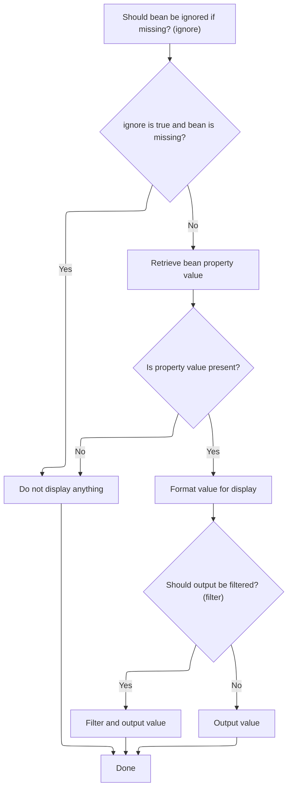

This document explains how property values from data objects are displayed on web pages, with options for formatting and filtering. The system checks if the data is available, applies formatting, and ensures the output is safe before rendering it to the user.

# Rendering and Formatting Bean Properties in JSP Tags



<SwmSnippet path="/taglib/src/main/java/org/apache/struts/taglib/bean/WriteTag.java" line="223">

---

In <SwmToken path="taglib/src/main/java/org/apache/struts/taglib/bean/WriteTag.java" pos="223:5:5" line-data="    public int doStartTag() throws JspException {">`doStartTag`</SwmToken>, we start by checking if we should ignore missing beans. If 'ignore' is set and the bean isn't found, we bail early and skip output. Otherwise, we use <SwmToken path="taglib/src/main/java/org/apache/struts/taglib/bean/WriteTag.java" pos="226:4:4" line-data="            if (TagUtils.getInstance().lookup(pageContext, name, scope)">`TagUtils`</SwmToken> to look up the bean and its property, since <SwmToken path="taglib/src/main/java/org/apache/struts/taglib/bean/WriteTag.java" pos="226:4:4" line-data="            if (TagUtils.getInstance().lookup(pageContext, name, scope)">`TagUtils`</SwmToken> handles all the repository-specific lookup logic and error handling. This sets up the value for formatting and output.

```java
    public int doStartTag() throws JspException {
        // Look up the requested bean (if necessary)
        if (ignore) {
            if (TagUtils.getInstance().lookup(pageContext, name, scope)
                == null) {
                return (SKIP_BODY); // Nothing to output
            }
        }

        // Look up the requested property value
        Object value =
            TagUtils.getInstance().lookup(pageContext, name, property, scope);

        if (value == null) {
            return (SKIP_BODY); // Nothing to output
        }

```

---

</SwmSnippet>

<SwmSnippet path="/taglib/src/main/java/org/apache/struts/taglib/TagUtils.java" line="897">

---

<SwmToken path="taglib/src/main/java/org/apache/struts/taglib/TagUtils.java" pos="897:5:5" line-data="    public Object lookup(PageContext pageContext, String name, String property,">`lookup`</SwmToken> handles finding the bean and property in the page context. If the bean isn't found, it throws a <SwmToken path="taglib/src/main/java/org/apache/struts/taglib/TagUtils.java" pos="898:8:8" line-data="        String scope) throws JspException {">`JspException`</SwmToken> with a message tailored to the scope and bean name, using <SwmToken path="taglib/src/main/java/org/apache/struts/taglib/TagUtils.java" pos="949:4:6" line-data="            if (Constants.BEAN_KEY.equals(name)) {">`Constants.BEAN_KEY`</SwmToken> logic for default beans. Property access is wrapped with detailed exception handling, so errors are surfaced with context.

```java
    public Object lookup(PageContext pageContext, String name, String property,
        String scope) throws JspException {
        // Look up the requested bean, and return if requested
        Object bean = lookup(pageContext, name, scope);

        if (bean == null) {
            JspException e = null;

            if (scope == null) {
                e = new JspException(messages.getMessage("lookup.bean.any", name));
            } else {
                e = new JspException(messages.getMessage("lookup.bean", name,
                            scope));
            }

            saveException(pageContext, e);
            throw e;
        }

        if (property == null) {
            return bean;
        }

        // Locate and return the specified property
        try {
            return PropertyUtils.getProperty(bean, property);
        } catch (IllegalAccessException e) {
            saveException(pageContext, e);
            throw new JspException(messages.getMessage("lookup.access",
                    property, name), e);
        } catch (IllegalArgumentException e) {
            saveException(pageContext, e);
            throw new JspException(messages.getMessage("lookup.argument",
                    property, name), e);
        } catch (InvocationTargetException e) {
            Throwable t = e.getTargetException();

            if (t == null) {
                t = e;
            }

            saveException(pageContext, t);
            throw new JspException(messages.getMessage("lookup.target",
                    property, name), e);
        } catch (NoSuchMethodException e) {
            saveException(pageContext, e);

            String beanName = name;

            // Name defaults to Contants.BEAN_KEY if no name is specified by
            // an input tag. Thus lookup the bean under the key and use
            // its class name for the exception message.
            if (Constants.BEAN_KEY.equals(name)) {
                Object obj = pageContext.findAttribute(Constants.BEAN_KEY);

                if (obj != null) {
                    beanName = obj.getClass().getName();
                }
            }

            throw new JspException(messages.getMessage("lookup.method",
                    property, beanName), e);
        }
    }
```

---

</SwmSnippet>

<SwmSnippet path="/taglib/src/main/java/org/apache/struts/taglib/bean/WriteTag.java" line="240">

---

Back in `WriteTag.doStartTag`, after getting the bean property, we call <SwmToken path="taglib/src/main/java/org/apache/struts/taglib/bean/WriteTag.java" pos="241:7:7" line-data="        String output = formatValue(value);">`formatValue`</SwmToken> to convert the value to a string. This step is needed because the property could be a number or date, and we want to control how it's shown to the user.

```java
        // Convert value to the String with some formatting
        String output = formatValue(value);

```

---

</SwmSnippet>

<SwmSnippet path="/taglib/src/main/java/org/apache/struts/taglib/bean/WriteTag.java" line="291">

---

<SwmToken path="taglib/src/main/java/org/apache/struts/taglib/bean/WriteTag.java" pos="291:5:5" line-data="    protected String formatValue(Object valueToFormat)">`formatValue`</SwmToken> checks the value type and applies formatting: strings are returned as-is, numbers and dates get locale-aware formatting using either explicit patterns or resource keys. If nothing matches, it falls back to <SwmToken path="taglib/src/main/java/org/apache/struts/taglib/bean/WriteTag.java" pos="377:5:7" line-data="            return value.toString();">`toString()`</SwmToken>.

```java
    protected String formatValue(Object valueToFormat)
        throws JspException {
        Format format = null;
        Object value = valueToFormat;
        Locale locale =
            TagUtils.getInstance().getUserLocale(pageContext, this.localeKey);
        boolean formatStrFromResources = false;
        String formatString = formatStr;

        // Return String object as is.
        if (value instanceof java.lang.String) {
            return (String) value;
        } else {
            // Try to retrieve format string from resources by the key from
            // formatKey.
            if ((formatString == null) && (formatKey != null)) {
                formatString = retrieveFormatString(this.formatKey);

                if (formatString != null) {
                    formatStrFromResources = true;
                }
            }

            // Prepare format object for numeric values.
            if (value instanceof Number) {
                if (formatString == null) {
                    if ((value instanceof Byte) || (value instanceof Short)
                        || (value instanceof Integer)
                        || (value instanceof Long)
                        || (value instanceof BigInteger)) {
                        formatString = retrieveFormatString(INT_FORMAT_KEY);
                    } else if ((value instanceof Float)
                        || (value instanceof Double)
                        || (value instanceof BigDecimal)) {
                        formatString = retrieveFormatString(FLOAT_FORMAT_KEY);
                    }

                    if (formatString != null) {
                        formatStrFromResources = true;
                    }
                }

                if (formatString != null) {
                    try {
                        format = NumberFormat.getNumberInstance(locale);

                        if (formatStrFromResources) {
                            ((DecimalFormat) format).applyLocalizedPattern(
                                formatString);
                        } else {
                            ((DecimalFormat) format).applyPattern(formatString);
                        }
                    } catch (IllegalArgumentException e) {
                        JspException ex =
                            new JspException(messages.getMessage(
                                    "write.format", formatString), e);

                        TagUtils.getInstance().saveException(pageContext, ex);
                        throw ex;
                    }
                }
            } else if (value instanceof java.util.Date) {
                if (formatString == null) {
                    if (value instanceof java.sql.Timestamp) {
                        formatString =
                            retrieveFormatString(SQL_TIMESTAMP_FORMAT_KEY);
                    } else if (value instanceof java.sql.Date) {
                        formatString =
                            retrieveFormatString(SQL_DATE_FORMAT_KEY);
                    } else if (value instanceof java.sql.Time) {
                        formatString =
                            retrieveFormatString(SQL_TIME_FORMAT_KEY);
                    } else if (value instanceof java.util.Date) {
                        formatString = retrieveFormatString(DATE_FORMAT_KEY);
                    }
                }

                if (formatString != null) {
                    format = new SimpleDateFormat(formatString, locale);
                }
            }
        }

        if (format != null) {
            return format.format(value);
        } else {
            return value.toString();
        }
    }
```

---

</SwmSnippet>

<SwmSnippet path="/taglib/src/main/java/org/apache/struts/taglib/bean/WriteTag.java" line="243">

---

Finally, back in `WriteTag.doStartTag`, after formatting, we decide if the output needs filtering (escaping HTML) and write it to the page context using <SwmToken path="taglib/src/main/java/org/apache/struts/taglib/bean/WriteTag.java" pos="245:1:1" line-data="            TagUtils.getInstance().write(pageContext,">`TagUtils`</SwmToken>. The 'filter' flag controls this, and we always skip the tag body after writing.

```java
        // Print this property value to our output writer, suitably filtered
        if (filter) {
            TagUtils.getInstance().write(pageContext,
                TagUtils.getInstance().filter(output));
        } else {
            TagUtils.getInstance().write(pageContext, output);
        }

        // Continue processing this page
        return (SKIP_BODY);
    }
```

---

</SwmSnippet>

&nbsp;

*This is an auto-generated document by Swimm 🌊 and has not yet been verified by a human*

<SwmMeta version="3.0.0" repo-id="Z2l0aHViJTNBJTNBc3RydXRzMSUzQSUzQVN3aW1tLURlbW8=" repo-name="struts1"><sup>Powered by [Swimm](https://app.swimm.io/)</sup></SwmMeta>
