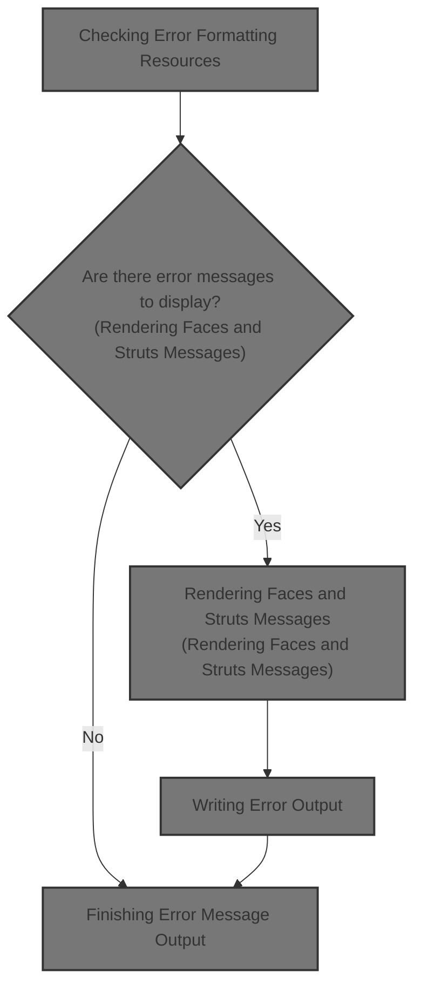
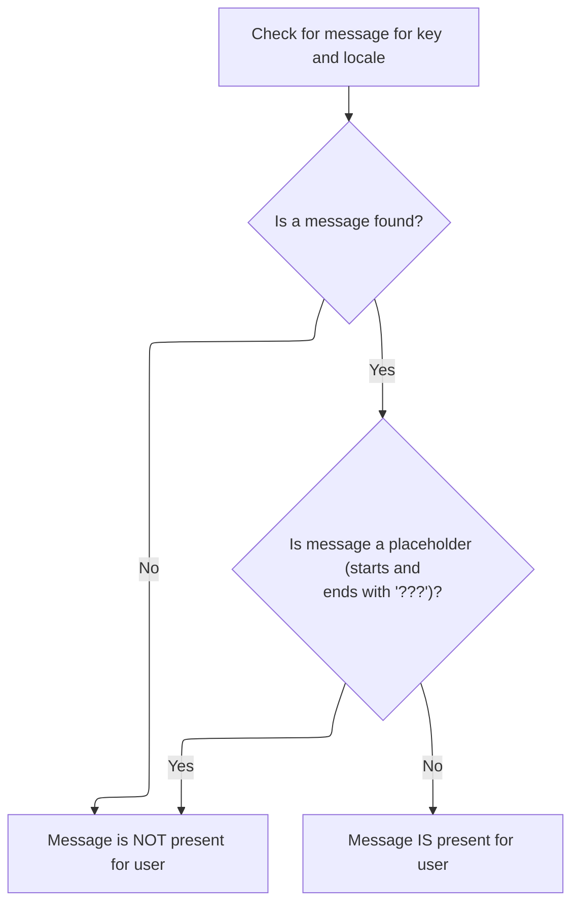
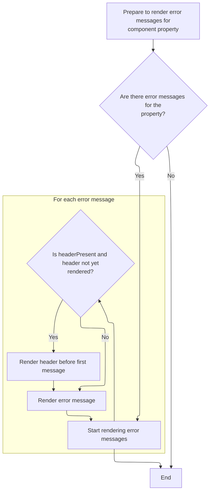
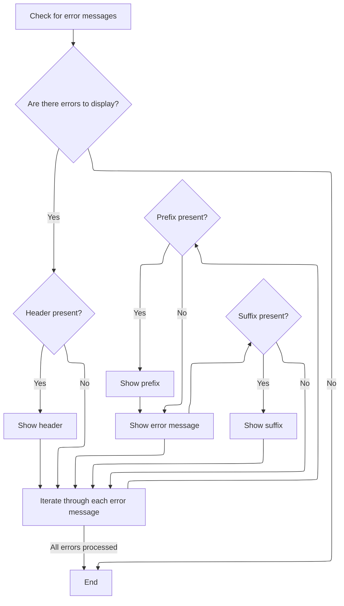
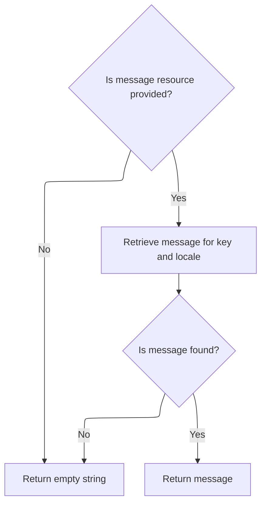

This document describes how error messages are displayed for a UI component. The flow determines which formatting elements are available, then renders Faces and Struts error messages, applying formatting as defined in the application's resources.



# Checking Error Formatting Resources

```mermaid
%%{init: {"flowchart": {"defaultRenderer": "elk"}} }%%
flowchart TD
  node1["Detecting Available Message Keys"]
  
  node1 --> node2{"Are there Faces messages?"}
  click node2 openCode "faces/src/main/java/org/apache/struts/faces/renderer/ErrorsRenderer.java:121:122"
  node2 -->|"Yes"| node3["Formatting and Escaping Message Strings"]
  
  node2 -->|"No"| node4{"Are there Struts error messages?"}
  click node4 openCode "faces/src/main/java/org/apache/struts/faces/renderer/ErrorsRenderer.java:147:148"
  node3 --> node4
  node4 -->|"Yes"| node5["Resolving ActionMessage Text"]
  
  node4 -->|"No"| node6{"Should render footer?"}
  click node6 openCode "faces/src/main/java/org/apache/struts/faces/renderer/ErrorsRenderer.java:186:188"
  node5 --> node6
  node6 -->|"Yes"| node7["Render footer"]
  click node7 openCode "faces/src/main/java/org/apache/struts/faces/renderer/ErrorsRenderer.java:187:188"
  node6 -->|"No"| node8["Finish rendering"]
  click node8 openCode "faces/src/main/java/org/apache/struts/faces/renderer/ErrorsRenderer.java:189:197"
  node7 --> node8

  %% Node mappings for function calls
  %% isPresent
  
  %% getMessage (header)
  
  %% getMessage (prefix)
  
  %% getMessage (suffix)
  
  %% getMessage (Struts)
  
  

classDef HeadingStyle fill:#777777,stroke:#333,stroke-width:2px;
click node1 goToHeading "Detecting Available Message Keys"
node1:::HeadingStyle
click node3 goToHeading "Delegating Message Lookup (No Locale)"
node3:::HeadingStyle
click node3 goToHeading "Delegating Message Lookup (Single Arg)"
node3:::HeadingStyle
click node3 goToHeading "Formatting and Escaping Message Strings"
node3:::HeadingStyle
click node5 goToHeading "Fetching Localized Error Strings"
node5:::HeadingStyle
click node5 goToHeading "Resolving ActionMessage Text"
node5:::HeadingStyle

%% Swimm:
%% %%{init: {"flowchart": {"defaultRenderer": "elk"}} }%%
%% flowchart TD
%%   node1["Detecting Available Message Keys"]
%%   
%%   node1 --> node2{"Are there Faces messages?"}
%%   click node2 openCode "<SwmPath>[faces/…/renderer/ErrorsRenderer.java](faces/src/main/java/org/apache/struts/faces/renderer/ErrorsRenderer.java)</SwmPath>:121:122"
%%   node2 -->|"Yes"| node3["Formatting and Escaping Message Strings"]
%%   
%%   node2 -->|"No"| node4{"Are there Struts error messages?"}
%%   click node4 openCode "<SwmPath>[faces/…/renderer/ErrorsRenderer.java](faces/src/main/java/org/apache/struts/faces/renderer/ErrorsRenderer.java)</SwmPath>:147:148"
%%   node3 --> node4
%%   node4 -->|"Yes"| node5["Resolving <SwmToken path="faces/src/main/java/org/apache/struts/faces/renderer/ErrorsRenderer.java" pos="159:1:1" line-data="                ActionMessage report = (ActionMessage) reports.next();">`ActionMessage`</SwmToken> Text"]
%%   
%%   node4 -->|"No"| node6{"Should render footer?"}
%%   click node6 openCode "<SwmPath>[faces/…/renderer/ErrorsRenderer.java](faces/src/main/java/org/apache/struts/faces/renderer/ErrorsRenderer.java)</SwmPath>:186:188"
%%   node5 --> node6
%%   node6 -->|"Yes"| node7["Render footer"]
%%   click node7 openCode "<SwmPath>[faces/…/renderer/ErrorsRenderer.java](faces/src/main/java/org/apache/struts/faces/renderer/ErrorsRenderer.java)</SwmPath>:187:188"
%%   node6 -->|"No"| node8["Finish rendering"]
%%   click node8 openCode "<SwmPath>[faces/…/renderer/ErrorsRenderer.java](faces/src/main/java/org/apache/struts/faces/renderer/ErrorsRenderer.java)</SwmPath>:189:197"
%%   node7 --> node8
%% 
%%   %% Node mappings for function calls
%%   %% <SwmToken path="faces/src/main/java/org/apache/struts/faces/renderer/ErrorsRenderer.java" pos="102:9:9" line-data="        boolean headerPresent = resources.isPresent(locale, &quot;errors.header&quot;);">`isPresent`</SwmToken>
%%   
%%   %% <SwmToken path="faces/src/main/java/org/apache/struts/faces/renderer/ErrorsRenderer.java" pos="130:4:4" line-data="                        (resources.getMessage(locale, &quot;errors.header&quot;));">`getMessage`</SwmToken> (header)
%%   
%%   %% <SwmToken path="faces/src/main/java/org/apache/struts/faces/renderer/ErrorsRenderer.java" pos="130:4:4" line-data="                        (resources.getMessage(locale, &quot;errors.header&quot;));">`getMessage`</SwmToken> (prefix)
%%   
%%   %% <SwmToken path="faces/src/main/java/org/apache/struts/faces/renderer/ErrorsRenderer.java" pos="130:4:4" line-data="                        (resources.getMessage(locale, &quot;errors.header&quot;));">`getMessage`</SwmToken> (suffix)
%%   
%%   %% <SwmToken path="faces/src/main/java/org/apache/struts/faces/renderer/ErrorsRenderer.java" pos="130:4:4" line-data="                        (resources.getMessage(locale, &quot;errors.header&quot;));">`getMessage`</SwmToken> (Struts)
%%   
%%   
%% 
%% classDef HeadingStyle fill:#777777,stroke:#333,stroke-width:2px;
%% click node1 goToHeading "Detecting Available Message Keys"
%% node1:::HeadingStyle
%% click node3 goToHeading "Delegating Message Lookup (No Locale)"
%% node3:::HeadingStyle
%% click node3 goToHeading "Delegating Message Lookup (Single Arg)"
%% node3:::HeadingStyle
%% click node3 goToHeading "Formatting and Escaping Message Strings"
%% node3:::HeadingStyle
%% click node5 goToHeading "Fetching Localized Error Strings"
%% node5:::HeadingStyle
%% click node5 goToHeading "Resolving <SwmToken path="faces/src/main/java/org/apache/struts/faces/renderer/ErrorsRenderer.java" pos="159:1:1" line-data="                ActionMessage report = (ActionMessage) reports.next();">`ActionMessage`</SwmToken> Text"
%% node5:::HeadingStyle
```



<SwmSnippet path="/faces/src/main/java/org/apache/struts/faces/renderer/ErrorsRenderer.java" line="85">

---

In <SwmToken path="faces/src/main/java/org/apache/struts/faces/renderer/ErrorsRenderer.java" pos="85:5:5" line-data="    public void encodeEnd(FacesContext context, UIComponent component)">`encodeEnd`</SwmToken>, we're figuring out which formatting elements (header, footer, prefix, suffix) are available for error messages by checking for their resource keys in <SwmToken path="faces/src/main/java/org/apache/struts/faces/renderer/ErrorsRenderer.java" pos="97:1:1" line-data="        MessageResources resources = resources(context, component);">`MessageResources`</SwmToken>. This determines how the errors will be wrapped or decorated. We need to call <SwmToken path="faces/src/main/java/org/apache/struts/faces/renderer/ErrorsRenderer.java" pos="97:1:1" line-data="        MessageResources resources = resources(context, component);">`MessageResources`</SwmToken> next to see if these keys are actually defined, so we know what to include when rendering.

```java
    public void encodeEnd(FacesContext context, UIComponent component)
        throws IOException {

        if ((context == null) || (component == null)) {
            throw new NullPointerException();
        }

        if (log.isDebugEnabled()) {
            log.debug("encodeEnd() started");
        }

        // Look up availability of our predefined resource keys
        MessageResources resources = resources(context, component);
        if (Beans.isDesignTime() && (resources == null)) {
            resources = dummy;
        }
        Locale locale = context.getViewRoot().getLocale();
        boolean headerPresent = resources.isPresent(locale, "errors.header");
        boolean footerPresent = resources.isPresent(locale, "errors.footer");
        boolean prefixPresent = resources.isPresent(locale, "errors.prefix");
        boolean suffixPresent = resources.isPresent(locale, "errors.suffix");

```

---

</SwmSnippet>

## Detecting Available Message Keys



<SwmSnippet path="/core/src/main/java/org/apache/struts/util/MessageResources.java" line="397">

---

<SwmToken path="core/src/main/java/org/apache/struts/util/MessageResources.java" pos="397:5:5" line-data="    public boolean isPresent(Locale locale, String key) {">`isPresent`</SwmToken> checks if a message key actually maps to a real message for the given locale. It doesn't just look for nulls—it also filters out placeholders like '???key???', which means the message isn't really defined. This is why we call <SwmToken path="core/src/main/java/org/apache/struts/util/MessageResources.java" pos="398:7:7" line-data="        String message = getMessage(locale, key);">`getMessage`</SwmToken> here: to see if the resource is actually usable for formatting.

```java
    public boolean isPresent(Locale locale, String key) {
        String message = getMessage(locale, key);

        if (message == null) {
            return false;
        } else if (message.startsWith("???") && message.endsWith("???")) {
            return false; // FIXME - Only valid for default implementation
        } else {
            return true;
        }
    }
```

---

</SwmSnippet>

## Delegating Message Lookup (No Locale)

<SwmSnippet path="/core/src/main/java/org/apache/struts/util/MessageResources.java" line="207">

---

<SwmToken path="core/src/main/java/org/apache/struts/util/MessageResources.java" pos="207:5:17" line-data="    public String getMessage(String key, Object[] args) {">`getMessage(String key, Object[] args)`</SwmToken> just hands off to the main message lookup method, defaulting the locale to null. This keeps the API simple for callers who don't care about locale, but we need to call the main method to actually resolve the message.

```java
    public String getMessage(String key, Object[] args) {
        return this.getMessage((Locale) null, key, args);
    }
```

---

</SwmSnippet>

## Delegating Message Lookup (Single Arg)

<SwmSnippet path="/core/src/main/java/org/apache/struts/util/MessageResources.java" line="324">

---

<SwmToken path="core/src/main/java/org/apache/struts/util/MessageResources.java" pos="324:5:20" line-data="    public String getMessage(Locale locale, String key, Object arg0) {">`getMessage(Locale locale, String key, Object arg0)`</SwmToken> just wraps the single argument in an array and calls the main message lookup. It's just a convenience overload, so the real work happens in the array-based method.

```java
    public String getMessage(Locale locale, String key, Object arg0) {
        return this.getMessage(locale, key, new Object[] { arg0 });
    }
```

---

</SwmSnippet>

## Formatting and Escaping Message Strings

```mermaid
%%{init: {"flowchart": {"defaultRenderer": "elk"}} }%%
flowchart TD
    node1["Request: Get localized message for key
and arguments"]
    click node1 openCode "core/src/main/java/org/apache/struts/util/MessageResources.java:286:312"
    node2{"Is a locale provided?"}
    click node2 openCode "core/src/main/java/org/apache/struts/util/MessageResources.java:288:290"
    node3["Use default locale"]
    click node3 openCode "core/src/main/java/org/apache/struts/util/MessageResources.java:289:290"
    node4{"Is a prepared message format available
for this locale and key?"}
    click node4 openCode "core/src/main/java/org/apache/struts/util/MessageResources.java:295:297"
    node5["Retrieve message string for locale and
key"]
    click node5 openCode "core/src/main/java/org/apache/struts/util/MessageResources.java:299:300"
    node6{"Is message string found?"}
    click node6 openCode "core/src/main/java/org/apache/struts/util/MessageResources.java:301:302"
    node7{"Should missing message return null?
(returnNull)"}
    click node7 openCode "core/src/main/java/org/apache/struts/util/MessageResources.java:302:302"
    node8["Return null"]
    click node8 openCode "core/src/main/java/org/apache/struts/util/MessageResources.java:302:302"
    node9["Return placeholder: ???formatKey???"]
    click node9 openCode "core/src/main/java/org/apache/struts/util/MessageResources.java:302:303"
    node10["Prepare message format and store for
future use"]
    click node10 openCode "core/src/main/java/org/apache/struts/util/MessageResources.java:305:308"
    node11["Format message with arguments and
return"]
    click node11 openCode "core/src/main/java/org/apache/struts/util/MessageResources.java:311:311"

    node1 --> node2
    node2 -- Yes --> node4
    node2 -- No --> node3
    node3 --> node4
    node4 -- Yes --> node11
    node4 -- No --> node5
    node5 --> node6
    node6 -- Yes --> node10
    node6 -- No --> node7
    node7 -- Yes --> node8
    node7 -- No --> node9
    node10 --> node11
classDef HeadingStyle fill:#777777,stroke:#333,stroke-width:2px;

%% Swimm:
%% %%{init: {"flowchart": {"defaultRenderer": "elk"}} }%%
%% flowchart TD
%%     node1["Request: Get localized message for key
%% and arguments"]
%%     click node1 openCode "<SwmPath>[core/…/util/MessageResources.java](core/src/main/java/org/apache/struts/util/MessageResources.java)</SwmPath>:286:312"
%%     node2{"Is a locale provided?"}
%%     click node2 openCode "<SwmPath>[core/…/util/MessageResources.java](core/src/main/java/org/apache/struts/util/MessageResources.java)</SwmPath>:288:290"
%%     node3["Use default locale"]
%%     click node3 openCode "<SwmPath>[core/…/util/MessageResources.java](core/src/main/java/org/apache/struts/util/MessageResources.java)</SwmPath>:289:290"
%%     node4{"Is a prepared message format available
%% for this locale and key?"}
%%     click node4 openCode "<SwmPath>[core/…/util/MessageResources.java](core/src/main/java/org/apache/struts/util/MessageResources.java)</SwmPath>:295:297"
%%     node5["Retrieve message string for locale and
%% key"]
%%     click node5 openCode "<SwmPath>[core/…/util/MessageResources.java](core/src/main/java/org/apache/struts/util/MessageResources.java)</SwmPath>:299:300"
%%     node6{"Is message string found?"}
%%     click node6 openCode "<SwmPath>[core/…/util/MessageResources.java](core/src/main/java/org/apache/struts/util/MessageResources.java)</SwmPath>:301:302"
%%     node7{"Should missing message return null?
%% (<SwmToken path="core/src/main/java/org/apache/struts/util/MessageResources.java" pos="302:3:3" line-data="                    return returnNull ? null : (&quot;???&quot; + formatKey + &quot;???&quot;);">`returnNull`</SwmToken>)"}
%%     click node7 openCode "<SwmPath>[core/…/util/MessageResources.java](core/src/main/java/org/apache/struts/util/MessageResources.java)</SwmPath>:302:302"
%%     node8["Return null"]
%%     click node8 openCode "<SwmPath>[core/…/util/MessageResources.java](core/src/main/java/org/apache/struts/util/MessageResources.java)</SwmPath>:302:302"
%%     node9["Return placeholder: ???<SwmToken path="core/src/main/java/org/apache/struts/util/MessageResources.java" pos="293:3:3" line-data="        String formatKey = messageKey(locale, key);">`formatKey`</SwmToken>???"]
%%     click node9 openCode "<SwmPath>[core/…/util/MessageResources.java](core/src/main/java/org/apache/struts/util/MessageResources.java)</SwmPath>:302:303"
%%     node10["Prepare message format and store for
%% future use"]
%%     click node10 openCode "<SwmPath>[core/…/util/MessageResources.java](core/src/main/java/org/apache/struts/util/MessageResources.java)</SwmPath>:305:308"
%%     node11["Format message with arguments and
%% return"]
%%     click node11 openCode "<SwmPath>[core/…/util/MessageResources.java](core/src/main/java/org/apache/struts/util/MessageResources.java)</SwmPath>:311:311"
%% 
%%     node1 --> node2
%%     node2 -- Yes --> node4
%%     node2 -- No --> node3
%%     node3 --> node4
%%     node4 -- Yes --> node11
%%     node4 -- No --> node5
%%     node5 --> node6
%%     node6 -- Yes --> node10
%%     node6 -- No --> node7
%%     node7 -- Yes --> node8
%%     node7 -- No --> node9
%%     node10 --> node11
%% classDef HeadingStyle fill:#777777,stroke:#333,stroke-width:2px;
```



<SwmSnippet path="/core/src/main/java/org/apache/struts/util/MessageResources.java" line="286">

---

<SwmToken path="core/src/main/java/org/apache/struts/util/MessageResources.java" pos="286:5:22" line-data="    public String getMessage(Locale locale, String key, Object[] args) {">`getMessage(Locale locale, String key, Object[] args)`</SwmToken> does the heavy lifting: it finds or builds a <SwmToken path="core/src/main/java/org/apache/struts/util/MessageResources.java" pos="287:5:5" line-data="        // Cache MessageFormat instances as they are accessed">`MessageFormat`</SwmToken> for the key and locale, escapes the format string if needed, and formats the message with the given arguments. If the message isn't found, it returns a placeholder. We call escape here to handle single quotes for <SwmToken path="core/src/main/java/org/apache/struts/util/MessageResources.java" pos="287:5:5" line-data="        // Cache MessageFormat instances as they are accessed">`MessageFormat`</SwmToken> compatibility.

```java
    public String getMessage(Locale locale, String key, Object[] args) {
        // Cache MessageFormat instances as they are accessed
        if (locale == null) {
            locale = defaultLocale;
        }

        MessageFormat format = null;
        String formatKey = messageKey(locale, key);

        synchronized (formats) {
            format = (MessageFormat) formats.get(formatKey);

            if (format == null) {
                String formatString = getMessage(locale, key);

                if (formatString == null) {
                    return returnNull ? null : ("???" + formatKey + "???");
                }

                format = new MessageFormat(escape(formatString));
                format.setLocale(locale);
                formats.put(formatKey, format);
            }
        }

        return format.format(args);
    }
```

---

</SwmSnippet>

<SwmSnippet path="/core/src/main/java/org/apache/struts/util/MessageResources.java" line="417">

---

<SwmToken path="core/src/main/java/org/apache/struts/util/MessageResources.java" pos="417:5:5" line-data="    protected String escape(String string) {">`escape`</SwmToken> checks if escaping is enabled (via <SwmToken path="core/src/main/java/org/apache/struts/util/MessageResources.java" pos="418:5:5" line-data="        if (!isEscape()) {">`isEscape`</SwmToken>). If so, it doubles single quotes in the string, which is needed for <SwmToken path="core/src/main/java/org/apache/struts/util/MessageResources.java" pos="287:5:5" line-data="        // Cache MessageFormat instances as they are accessed">`MessageFormat`</SwmToken>. If not, or if there are no single quotes, it just returns the string as-is.

```java
    protected String escape(String string) {
        if (!isEscape()) {
            return string;
        }

        if ((string == null) || (string.indexOf('\'') < 0)) {
            return string;
        }

        int n = string.length();
        StringBuffer sb = new StringBuffer(n);

        for (int i = 0; i < n; i++) {
            char ch = string.charAt(i);

            if (ch == '\'') {
                sb.append('\'');
            }

            sb.append(ch);
        }
```

---

</SwmSnippet>

## Rendering Faces and Struts Messages



<SwmSnippet path="/faces/src/main/java/org/apache/struts/faces/renderer/ErrorsRenderer.java" line="107">

---

Back in ErrorsRenderer.encodeEnd, after checking which formatting keys are present, we start rendering error messages. We grab FacesMessages for the given property and start writing them out, possibly wrapped in a <span> if the component has an id. To get the actual error text, we need to call Resources to fetch the localized message string.

```java
        // Set up to render the error messages appropriately
        boolean headerDone = false;
        ResponseWriter writer = context.getResponseWriter();
        String id = component.getId();
        String property = (String) component.getAttributes().get("property");
        if (id != null) {
            writer.startElement("span", component);
            if (id != null) {
                writer.writeAttribute("id", component.getClientId(context),
                                      "id");
            }
        }

        // Render any JavaServer Faces messages
        Iterator messages = context.getMessages(property);
        while (messages.hasNext()) {
            FacesMessage message = (FacesMessage) messages.next();
            if (log.isTraceEnabled()) {
                log.trace("Processing FacesMessage: " + message.getSummary());
            }
            if (!headerDone) {
                if (headerPresent) {
                    writer.write
                        (resources.getMessage(locale, "errors.header"));
```

---

</SwmSnippet>

## Fetching Localized Error Strings

<SwmSnippet path="/core/src/main/java/org/apache/struts/validator/Resources.java" line="249">

---

<SwmToken path="core/src/main/java/org/apache/struts/validator/Resources.java" pos="249:7:17" line-data="    public static String getMessage(HttpServletRequest request, String key) {">`getMessage(HttpServletRequest request, String key)`</SwmToken> gets the <SwmToken path="core/src/main/java/org/apache/struts/validator/Resources.java" pos="250:1:1" line-data="        MessageResources messages = getMessageResources(request);">`MessageResources`</SwmToken> for the request, then figures out the user's Locale (using <SwmToken path="core/src/main/java/org/apache/struts/validator/Resources.java" pos="252:8:8" line-data="        return getMessage(messages, RequestUtils.getUserLocale(request, null),">`RequestUtils`</SwmToken>) before fetching the message. We need <SwmToken path="core/src/main/java/org/apache/struts/validator/Resources.java" pos="252:8:8" line-data="        return getMessage(messages, RequestUtils.getUserLocale(request, null),">`RequestUtils`</SwmToken> next to resolve which Locale to use for the lookup.

```java
    public static String getMessage(HttpServletRequest request, String key) {
        MessageResources messages = getMessageResources(request);

        return getMessage(messages, RequestUtils.getUserLocale(request, null),
            key);
    }
```

---

</SwmSnippet>

<SwmSnippet path="/core/src/main/java/org/apache/struts/util/RequestUtils.java" line="299">

---

<SwmToken path="core/src/main/java/org/apache/struts/util/RequestUtils.java" pos="299:7:7" line-data="    public static Locale getUserLocale(HttpServletRequest request, String locale) {">`getUserLocale`</SwmToken> tries to get the user's Locale from the session using a key (defaulting to <SwmToken path="core/src/main/java/org/apache/struts/util/RequestUtils.java" pos="304:5:7" line-data="            locale = Globals.LOCALE_KEY;">`Globals.LOCALE_KEY`</SwmToken>). If it's not there, it falls back to the request's locale, which usually comes from the browser's <SwmToken path="core/src/main/java/org/apache/struts/util/RequestUtils.java" pos="313:11:13" line-data="            // Returns Locale based on Accept-Language header or the server default">`Accept-Language`</SwmToken> header. This is how we figure out which language to use for error messages.

```java
    public static Locale getUserLocale(HttpServletRequest request, String locale) {
        Locale userLocale = null;
        HttpSession session = request.getSession(false);

        if (locale == null) {
            locale = Globals.LOCALE_KEY;
        }

        // Only check session if sessions are enabled
        if (session != null) {
            userLocale = (Locale) session.getAttribute(locale);
        }

        if (userLocale == null) {
            // Returns Locale based on Accept-Language header or the server default
            userLocale = request.getLocale();
        }

        return userLocale;
    }
```

---

</SwmSnippet>

## Writing Error Output



<SwmSnippet path="/faces/src/main/java/org/apache/struts/faces/renderer/ErrorsRenderer.java" line="129">

---

We just got the formatted error string from Resources in ErrorsRenderer.encodeEnd. Now we need to actually write it to the response, so we call the writer (<SwmToken path="core/src/main/java/org/apache/struts/util/ServletContextWriter.java" pos="38:4:4" line-data="public class ServletContextWriter extends PrintWriter {">`ServletContextWriter`</SwmToken>) to output the header, prefix, message, or suffix as needed.

```java
                    writer.write
                        (resources.getMessage(locale, "errors.header"));
                }
                headerDone = true;
            }
```

---

</SwmSnippet>

<SwmSnippet path="/core/src/main/java/org/apache/struts/util/ServletContextWriter.java" line="344">

---

<SwmToken path="core/src/main/java/org/apache/struts/util/ServletContextWriter.java" pos="344:5:10" line-data="    public void write(String s) {">`write(String s)`</SwmToken> just loops over the string and writes each character one by one. It assumes the string isn't null—if it is, you'll get a <SwmToken path="faces/src/main/java/org/apache/struts/faces/renderer/ErrorsRenderer.java" pos="89:5:5" line-data="            throw new NullPointerException();">`NullPointerException`</SwmToken>. This is just a low-level way to push the error text to the output.

```java
    public void write(String s) {
        int len = s.length();

        for (int i = 0; i < len; i++) {
            write(s.charAt(i));
        }
```

---

</SwmSnippet>

<SwmSnippet path="/faces/src/main/java/org/apache/struts/faces/renderer/ErrorsRenderer.java" line="134">

---

We just wrote out the header or prefix in ErrorsRenderer.encodeEnd. Now, if there's a prefix to render, we need to fetch it from Resources, so we call Resources.getMessage again to get the prefix string.

```java
            if (prefixPresent) {
                writer.write(resources.getMessage(locale, "errors.prefix"));
            }
```

---

</SwmSnippet>

<SwmSnippet path="/faces/src/main/java/org/apache/struts/faces/renderer/ErrorsRenderer.java" line="137">

---

We just got the prefix string from Resources in ErrorsRenderer.encodeEnd. Now we need to write the actual error message summary to the output, so we call the writer again to push the message text.

```java
            writer.write(message.getSummary());
```

---

</SwmSnippet>

<SwmSnippet path="/faces/src/main/java/org/apache/struts/faces/renderer/ErrorsRenderer.java" line="138">

---

We just wrote the message summary in ErrorsRenderer.encodeEnd. If there's a suffix to add, we need to fetch it from Resources, so we call Resources.getMessage for the suffix string.

```java
            if (suffixPresent) {
                writer.write(resources.getMessage(locale, "errors.suffix"));
```

---

</SwmSnippet>

<SwmSnippet path="/faces/src/main/java/org/apache/struts/faces/renderer/ErrorsRenderer.java" line="139">

---

We just got the suffix string from Resources in ErrorsRenderer.encodeEnd. Now we write it out to the response, so the error message is properly wrapped up.

```java
                writer.write(resources.getMessage(locale, "errors.suffix"));
            }
        }

```

---

</SwmSnippet>

<SwmSnippet path="/faces/src/main/java/org/apache/struts/faces/renderer/ErrorsRenderer.java" line="143">

---

We just finished writing out a <SwmToken path="faces/src/main/java/org/apache/struts/faces/renderer/ErrorsRenderer.java" pos="123:1:1" line-data="            FacesMessage message = (FacesMessage) messages.next();">`FacesMessage`</SwmToken> in ErrorsRenderer.encodeEnd. Now we switch to handling Struts <SwmToken path="faces/src/main/java/org/apache/struts/faces/renderer/ErrorsRenderer.java" pos="144:1:1" line-data="        ActionMessages errors = (ActionMessages)">`ActionMessages`</SwmToken>, which means we need to fetch the localized message string for each <SwmToken path="faces/src/main/java/org/apache/struts/faces/renderer/ErrorsRenderer.java" pos="159:1:1" line-data="                ActionMessage report = (ActionMessage) reports.next();">`ActionMessage`</SwmToken> from Resources.

```java
        // Render any Struts messages
        ActionMessages errors = (ActionMessages)
            context.getExternalContext().getRequestMap().get
            (Globals.ERROR_KEY);
        if (errors != null) {
            if (log.isTraceEnabled()) {
                log.trace("Processing Struts messages for property '" +
                          property + "'");
            }
            Iterator reports = null;
            if (property == null) {
                reports = errors.get();
            } else {
                reports = errors.get(property);
            }
            while (reports.hasNext()) {
                ActionMessage report = (ActionMessage) reports.next();
                if (log.isTraceEnabled()) {
                    log.trace("Processing Struts message key='" +
                              report.getKey() + "'");
                }
                if (!headerDone) {
                    writer = context.getResponseWriter();
                    if (headerPresent) {
                        writer.write
                            (resources.getMessage(locale, "errors.header"));
```

---

</SwmSnippet>

<SwmSnippet path="/faces/src/main/java/org/apache/struts/faces/renderer/ErrorsRenderer.java" line="167">

---

We just got the header string from Resources for a Struts <SwmToken path="faces/src/main/java/org/apache/struts/faces/renderer/ErrorsRenderer.java" pos="159:1:1" line-data="                ActionMessage report = (ActionMessage) reports.next();">`ActionMessage`</SwmToken> in ErrorsRenderer.encodeEnd. Now we write it out, so the Struts error block starts with the right header if needed.

```java
                        writer.write
                            (resources.getMessage(locale, "errors.header"));
                    }
                    headerDone = true;
                }
```

---

</SwmSnippet>

<SwmSnippet path="/faces/src/main/java/org/apache/struts/faces/renderer/ErrorsRenderer.java" line="172">

---

We just wrote the header for a Struts <SwmToken path="faces/src/main/java/org/apache/struts/faces/renderer/ErrorsRenderer.java" pos="159:1:1" line-data="                ActionMessage report = (ActionMessage) reports.next();">`ActionMessage`</SwmToken> in ErrorsRenderer.encodeEnd. If there's a prefix, we need to fetch it from Resources, so we call Resources.getMessage for the prefix string.

```java
                if (prefixPresent) {
                    writer.write
                        (resources.getMessage(locale, "errors.prefix"));
```

---

</SwmSnippet>

<SwmSnippet path="/faces/src/main/java/org/apache/struts/faces/renderer/ErrorsRenderer.java" line="173">

---

We just got the prefix string from Resources for a Struts <SwmToken path="faces/src/main/java/org/apache/struts/faces/renderer/ErrorsRenderer.java" pos="159:1:1" line-data="                ActionMessage report = (ActionMessage) reports.next();">`ActionMessage`</SwmToken> in ErrorsRenderer.encodeEnd. Now we write it out, so the error message is properly prefixed.

```java
                    writer.write
                        (resources.getMessage(locale, "errors.prefix"));
                }
```

---

</SwmSnippet>

<SwmSnippet path="/faces/src/main/java/org/apache/struts/faces/renderer/ErrorsRenderer.java" line="176">

---

We just wrote the prefix for a Struts <SwmToken path="faces/src/main/java/org/apache/struts/faces/renderer/ErrorsRenderer.java" pos="159:1:1" line-data="                ActionMessage report = (ActionMessage) reports.next();">`ActionMessage`</SwmToken> in ErrorsRenderer.encodeEnd. Now we need the actual error message text, so we call Resources.getMessage with the key and values for the <SwmToken path="faces/src/main/java/org/apache/struts/faces/renderer/ErrorsRenderer.java" pos="159:1:1" line-data="                ActionMessage report = (ActionMessage) reports.next();">`ActionMessage`</SwmToken>.

```java
                writer.write(resources.getMessage(locale, report.getKey(),
                                                  report.getValues()));
```

---

</SwmSnippet>

## Resolving <SwmToken path="faces/src/main/java/org/apache/struts/faces/renderer/ErrorsRenderer.java" pos="159:1:1" line-data="                ActionMessage report = (ActionMessage) reports.next();">`ActionMessage`</SwmToken> Text



<SwmSnippet path="/core/src/main/java/org/apache/struts/validator/Resources.java" line="231">

---

<SwmToken path="core/src/main/java/org/apache/struts/validator/Resources.java" pos="231:7:7" line-data="    public static String getMessage(MessageResources messages, Locale locale,">`getMessage`</SwmToken>`(`<SwmToken path="core/src/main/java/org/apache/struts/validator/Resources.java" pos="231:9:9" line-data="    public static String getMessage(MessageResources messages, Locale locale,">`MessageResources`</SwmToken>` `<SwmToken path="core/src/main/java/org/apache/struts/validator/Resources.java" pos="231:11:11" line-data="    public static String getMessage(MessageResources messages, Locale locale,">`messages`</SwmToken>`, `<SwmToken path="core/src/main/java/org/apache/struts/validator/Resources.java" pos="231:14:14" line-data="    public static String getMessage(MessageResources messages, Locale locale,">`Locale`</SwmToken>` `<SwmToken path="core/src/main/java/org/apache/struts/validator/Resources.java" pos="231:16:16" line-data="    public static String getMessage(MessageResources messages, Locale locale,">`locale`</SwmToken>`, `<SwmToken path="core/src/main/java/org/apache/struts/validator/Resources.java" pos="231:5:5" line-data="    public static String getMessage(MessageResources messages, Locale locale,">`String`</SwmToken>` `<SwmToken path="core/src/main/java/org/apache/struts/validator/Resources.java" pos="232:3:3" line-data="        String key) {">`key`</SwmToken>`)` just checks if messages is <SwmToken path="core/src/main/java/org/apache/struts/util/RequestUtils.java" pos="345:14:16" line-data="     * &lt;p&gt;If you specify a non-null &lt;code&gt;prefix&lt;/code&gt; and a non-null">`non-null`</SwmToken> and then calls MessageResources.getMessage to actually fetch the localized string. We need <SwmToken path="core/src/main/java/org/apache/struts/validator/Resources.java" pos="231:9:9" line-data="    public static String getMessage(MessageResources messages, Locale locale,">`MessageResources`</SwmToken> next to do the real lookup.

```java
    public static String getMessage(MessageResources messages, Locale locale,
        String key) {
        String message = null;

        if (messages != null) {
            message = messages.getMessage(locale, key);
        }

        return (message == null) ? "" : message;
    }
```

---

</SwmSnippet>

<SwmSnippet path="/core/src/main/java/org/apache/struts/util/MessageResources.java" line="218">

---

<SwmToken path="core/src/main/java/org/apache/struts/util/MessageResources.java" pos="218:5:15" line-data="    public String getMessage(String key, Object arg0) {">`getMessage(String key, Object arg0)`</SwmToken> just delegates to the main message lookup, passing null for the locale and the single argument. The main method does the actual formatting.

```java
    public String getMessage(String key, Object arg0) {
        return this.getMessage((Locale) null, key, arg0);
    }
```

---

</SwmSnippet>

## Finishing Error Message Output

```mermaid
%%{init: {"flowchart": {"defaultRenderer": "elk"}} }%%
flowchart TD
    node1["Output error message"]
    click node1 openCode "faces/src/main/java/org/apache/struts/faces/renderer/ErrorsRenderer.java:176:177"
    node1 --> node2{"Suffix present?"}
    click node2 openCode "faces/src/main/java/org/apache/struts/faces/renderer/ErrorsRenderer.java:178:181"
    node2 -->|"Yes"| node3["Output error suffix"]
    click node3 openCode "faces/src/main/java/org/apache/struts/faces/renderer/ErrorsRenderer.java:179:180"
    node2 -->|"No"| node4
    node3 --> node5{"Header done AND footer present?"}
    node4 --> node5
    click node5 openCode "faces/src/main/java/org/apache/struts/faces/renderer/ErrorsRenderer.java:186:188"
    node5 -->|"Yes"| node6["Output footer"]
    click node6 openCode "faces/src/main/java/org/apache/struts/faces/renderer/ErrorsRenderer.java:187:187"
    node5 -->|"No"| node7
    node6 --> node8{"ID present?"}
    node7 --> node8
    click node8 openCode "faces/src/main/java/org/apache/struts/faces/renderer/ErrorsRenderer.java:189:191"
    node8 -->|"Yes"| node9["Wrap output in span"]
    click node9 openCode "faces/src/main/java/org/apache/struts/faces/renderer/ErrorsRenderer.java:190:190"
    node8 -->|"No"| node10["Finish"]
    click node10 openCode "faces/src/main/java/org/apache/struts/faces/renderer/ErrorsRenderer.java:192:197"

classDef HeadingStyle fill:#777777,stroke:#333,stroke-width:2px;

%% Swimm:
%% %%{init: {"flowchart": {"defaultRenderer": "elk"}} }%%
%% flowchart TD
%%     node1["Output error message"]
%%     click node1 openCode "<SwmPath>[faces/…/renderer/ErrorsRenderer.java](faces/src/main/java/org/apache/struts/faces/renderer/ErrorsRenderer.java)</SwmPath>:176:177"
%%     node1 --> node2{"Suffix present?"}
%%     click node2 openCode "<SwmPath>[faces/…/renderer/ErrorsRenderer.java](faces/src/main/java/org/apache/struts/faces/renderer/ErrorsRenderer.java)</SwmPath>:178:181"
%%     node2 -->|"Yes"| node3["Output error suffix"]
%%     click node3 openCode "<SwmPath>[faces/…/renderer/ErrorsRenderer.java](faces/src/main/java/org/apache/struts/faces/renderer/ErrorsRenderer.java)</SwmPath>:179:180"
%%     node2 -->|"No"| node4
%%     node3 --> node5{"Header done AND footer present?"}
%%     node4 --> node5
%%     click node5 openCode "<SwmPath>[faces/…/renderer/ErrorsRenderer.java](faces/src/main/java/org/apache/struts/faces/renderer/ErrorsRenderer.java)</SwmPath>:186:188"
%%     node5 -->|"Yes"| node6["Output footer"]
%%     click node6 openCode "<SwmPath>[faces/…/renderer/ErrorsRenderer.java](faces/src/main/java/org/apache/struts/faces/renderer/ErrorsRenderer.java)</SwmPath>:187:187"
%%     node5 -->|"No"| node7
%%     node6 --> node8{"ID present?"}
%%     node7 --> node8
%%     click node8 openCode "<SwmPath>[faces/…/renderer/ErrorsRenderer.java](faces/src/main/java/org/apache/struts/faces/renderer/ErrorsRenderer.java)</SwmPath>:189:191"
%%     node8 -->|"Yes"| node9["Wrap output in span"]
%%     click node9 openCode "<SwmPath>[faces/…/renderer/ErrorsRenderer.java](faces/src/main/java/org/apache/struts/faces/renderer/ErrorsRenderer.java)</SwmPath>:190:190"
%%     node8 -->|"No"| node10["Finish"]
%%     click node10 openCode "<SwmPath>[faces/…/renderer/ErrorsRenderer.java](faces/src/main/java/org/apache/struts/faces/renderer/ErrorsRenderer.java)</SwmPath>:192:197"
%% 
%% classDef HeadingStyle fill:#777777,stroke:#333,stroke-width:2px;
```



<SwmSnippet path="/faces/src/main/java/org/apache/struts/faces/renderer/ErrorsRenderer.java" line="176">

---

We just got the formatted <SwmToken path="faces/src/main/java/org/apache/struts/faces/renderer/ErrorsRenderer.java" pos="159:1:1" line-data="                ActionMessage report = (ActionMessage) reports.next();">`ActionMessage`</SwmToken> string from Resources in ErrorsRenderer.encodeEnd. Now we write it out to the response, so the error actually shows up in the output.

```java
                writer.write(resources.getMessage(locale, report.getKey(),
                                                  report.getValues()));
```

---

</SwmSnippet>

<SwmSnippet path="/faces/src/main/java/org/apache/struts/faces/renderer/ErrorsRenderer.java" line="178">

---

We just wrote the <SwmToken path="faces/src/main/java/org/apache/struts/faces/renderer/ErrorsRenderer.java" pos="159:1:1" line-data="                ActionMessage report = (ActionMessage) reports.next();">`ActionMessage`</SwmToken> text in ErrorsRenderer.encodeEnd. If there's a suffix to add, we need to fetch it from Resources, so we call Resources.getMessage for the suffix string.

```java
                if (suffixPresent) {
                    writer.write
                        (resources.getMessage(locale, "errors.suffix"));
```

---

</SwmSnippet>

<SwmSnippet path="/faces/src/main/java/org/apache/struts/faces/renderer/ErrorsRenderer.java" line="179">

---

We just got the suffix string from Resources for an <SwmToken path="faces/src/main/java/org/apache/struts/faces/renderer/ErrorsRenderer.java" pos="159:1:1" line-data="                ActionMessage report = (ActionMessage) reports.next();">`ActionMessage`</SwmToken> in ErrorsRenderer.encodeEnd. Now we write it out, so the error message is properly closed. This wraps up the rendering for both Faces and Struts messages.

```java
                    writer.write
                        (resources.getMessage(locale, "errors.suffix"));
                }
            }
        }

```

---

</SwmSnippet>

<SwmSnippet path="/faces/src/main/java/org/apache/struts/faces/renderer/ErrorsRenderer.java" line="185">

---

We just finished writing all the error messages in ErrorsRenderer.encodeEnd. If we rendered any messages and there's a footer defined, we need to fetch the footer string from Resources to finish the error block.

```java
        // Append the list footer if needed
        if (headerDone && footerPresent) {
            writer.write(resources.getMessage(locale, "errors.footer"));
```

---

</SwmSnippet>

<SwmSnippet path="/faces/src/main/java/org/apache/struts/faces/renderer/ErrorsRenderer.java" line="187">

---

We just got the footer string from Resources in ErrorsRenderer.encodeEnd. Now we write it out, so the error block is properly closed with the footer.

```java
            writer.write(resources.getMessage(locale, "errors.footer"));
        }
```

---

</SwmSnippet>

<SwmSnippet path="/faces/src/main/java/org/apache/struts/faces/renderer/ErrorsRenderer.java" line="189">

---

We just wrote the footer and now ErrorsRenderer.encodeEnd wraps up by closing the <span> if it was opened. That's the end of the error rendering flow: all messages are output, wrapped with optional formatting, and the block is closed cleanly.

```java
        if (id != null) {
            writer.endElement("span");
        }

        if (log.isDebugEnabled()) {
            log.debug("encodeEnd() finished");
        }

    }
```

---

</SwmSnippet>

&nbsp;

*This is an auto-generated document by Swimm 🌊 and has not yet been verified by a human*

<SwmMeta version="3.0.0" repo-id="Z2l0aHViJTNBJTNBc3RydXRzMSUzQSUzQVN3aW1tLURlbW8=" repo-name="struts1"><sup>Powered by [Swimm](https://app.swimm.io/)</sup></SwmMeta>
