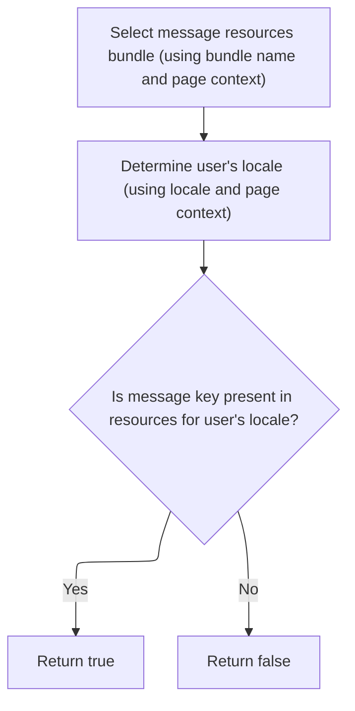
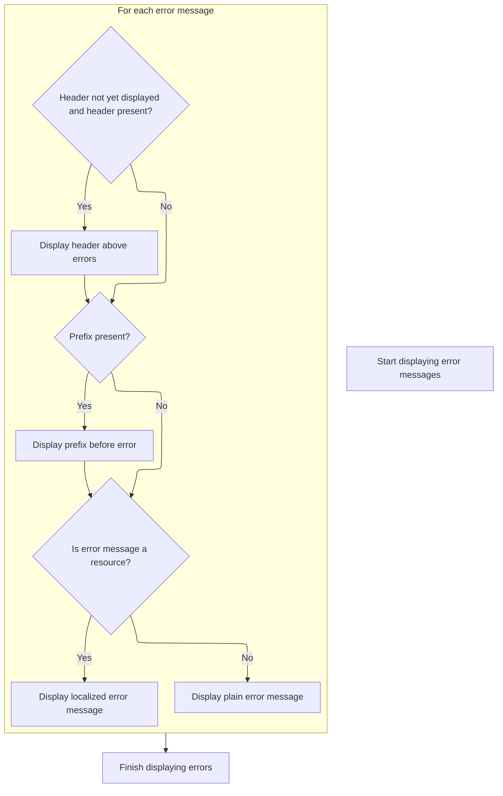
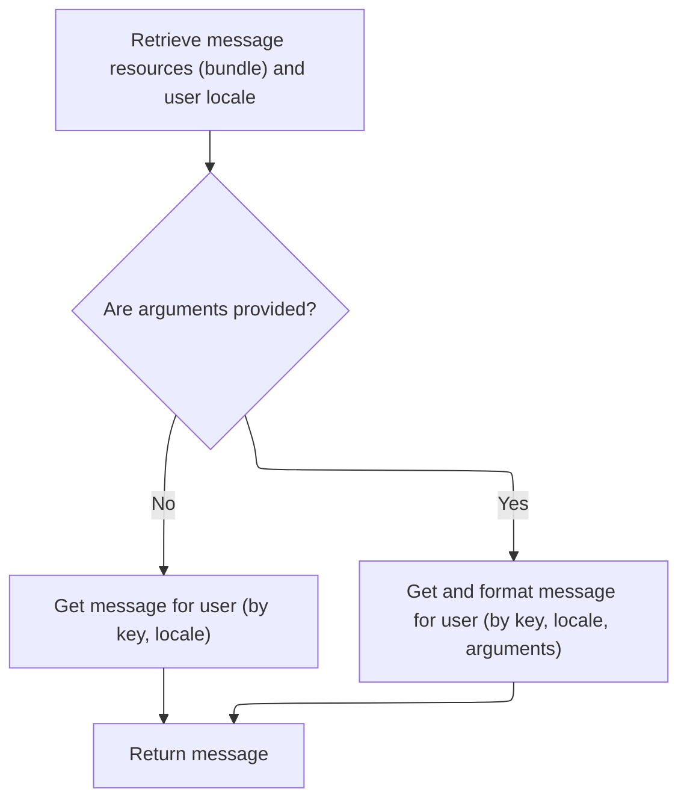
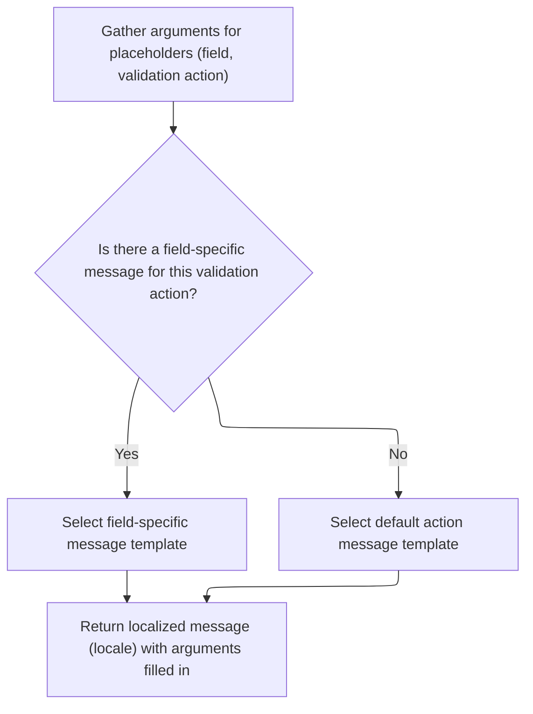

This document outlines how error messages are displayed to users, with attention to formatting and localization. The process checks for error messages, determines available formatting resources, formats and localizes each message, and renders the results to the user interface.

# Checking for Errors and Preparing Rendering Options

```mermaid
%%{init: {"flowchart": {"defaultRenderer": "elk"}} }%%
flowchart TD
    node1{"Are there errors to display?"}
    click node1 openCode "taglib/src/main/java/org/apache/struts/taglib/html/ErrorsTag.java:196:198"
    node1 -->|"No"| node2["Show page content as normal"]
    click node2 openCode "taglib/src/main/java/org/apache/struts/taglib/html/ErrorsTag.java:197:198"
    node1 -->|"Yes"| node3["Checking Resource Presence for Formatting Strings"]
    
    node3 --> node4["Iterating and Formatting Error Messages"]
    
    
    subgraph loop1["For each error message"]
      node4 --> node5{"Is this the first error?"}
      
      node5 -->|"Yes and header present"| node6["Finalizing and Writing Error Output"]
      
      node5 -->|"No or header already shown"| node7["Continue"]
      node6 --> node8["Show prefix if present"]
      node7 --> node8
      click node8 openCode "taglib/src/main/java/org/apache/struts/taglib/html/ErrorsTag.java:238:243"
      node8 --> node9{"Is error a resource key?"}
      click node9 openCode "taglib/src/main/java/org/apache/struts/taglib/html/ErrorsTag.java:245:251"
      node9 -->|"Yes"| node10["Look up localized message"]
      click node10 openCode "taglib/src/main/java/org/apache/struts/taglib/html/ErrorsTag.java:246:248"
      node9 -->|"No"| node11["Use plain error text"]
      click node11 openCode "taglib/src/main/java/org/apache/struts/taglib/html/ErrorsTag.java:250:251"
      node10 --> node12["Show suffix if present"]
      node11 --> node12
      click node12 openCode "taglib/src/main/java/org/apache/struts/taglib/html/ErrorsTag.java:257:262"
    end
    node4 --> node13{"Show footer if present"}
    click node13 openCode "taglib/src/main/java/org/apache/struts/taglib/html/ErrorsTag.java:265:270"

classDef HeadingStyle fill:#777777,stroke:#333,stroke-width:2px;
click node3 goToHeading "Checking Resource Presence for Formatting Strings"
node3:::HeadingStyle
click node4 goToHeading "Iterating and Formatting Error Messages"
node4:::HeadingStyle
click node5 goToHeading "Resolving Localized Message Strings"
node5:::HeadingStyle
click node6 goToHeading "Finalizing and Writing Error Output"
node6:::HeadingStyle

%% Swimm:
%% %%{init: {"flowchart": {"defaultRenderer": "elk"}} }%%
%% flowchart TD
%%     node1{"Are there errors to display?"}
%%     click node1 openCode "<SwmPath>[taglib/…/html/ErrorsTag.java](taglib/src/main/java/org/apache/struts/taglib/html/ErrorsTag.java)</SwmPath>:196:198"
%%     node1 -->|"No"| node2["Show page content as normal"]
%%     click node2 openCode "<SwmPath>[taglib/…/html/ErrorsTag.java](taglib/src/main/java/org/apache/struts/taglib/html/ErrorsTag.java)</SwmPath>:197:198"
%%     node1 -->|"Yes"| node3["Checking Resource Presence for Formatting Strings"]
%%     
%%     node3 --> node4["Iterating and Formatting Error Messages"]
%%     
%%     
%%     subgraph loop1["For each error message"]
%%       node4 --> node5{"Is this the first error?"}
%%       
%%       node5 -->|"Yes and header present"| node6["Finalizing and Writing Error Output"]
%%       
%%       node5 -->|"No or header already shown"| node7["Continue"]
%%       node6 --> node8["Show prefix if present"]
%%       node7 --> node8
%%       click node8 openCode "<SwmPath>[taglib/…/html/ErrorsTag.java](taglib/src/main/java/org/apache/struts/taglib/html/ErrorsTag.java)</SwmPath>:238:243"
%%       node8 --> node9{"Is error a resource key?"}
%%       click node9 openCode "<SwmPath>[taglib/…/html/ErrorsTag.java](taglib/src/main/java/org/apache/struts/taglib/html/ErrorsTag.java)</SwmPath>:245:251"
%%       node9 -->|"Yes"| node10["Look up localized message"]
%%       click node10 openCode "<SwmPath>[taglib/…/html/ErrorsTag.java](taglib/src/main/java/org/apache/struts/taglib/html/ErrorsTag.java)</SwmPath>:246:248"
%%       node9 -->|"No"| node11["Use plain error text"]
%%       click node11 openCode "<SwmPath>[taglib/…/html/ErrorsTag.java](taglib/src/main/java/org/apache/struts/taglib/html/ErrorsTag.java)</SwmPath>:250:251"
%%       node10 --> node12["Show suffix if present"]
%%       node11 --> node12
%%       click node12 openCode "<SwmPath>[taglib/…/html/ErrorsTag.java](taglib/src/main/java/org/apache/struts/taglib/html/ErrorsTag.java)</SwmPath>:257:262"
%%     end
%%     node4 --> node13{"Show footer if present"}
%%     click node13 openCode "<SwmPath>[taglib/…/html/ErrorsTag.java](taglib/src/main/java/org/apache/struts/taglib/html/ErrorsTag.java)</SwmPath>:265:270"
%% 
%% classDef HeadingStyle fill:#777777,stroke:#333,stroke-width:2px;
%% click node3 goToHeading "Checking Resource Presence for Formatting Strings"
%% node3:::HeadingStyle
%% click node4 goToHeading "Iterating and Formatting Error Messages"
%% node4:::HeadingStyle
%% click node5 goToHeading "Resolving Localized Message Strings"
%% node5:::HeadingStyle
%% click node6 goToHeading "Finalizing and Writing Error Output"
%% node6:::HeadingStyle
```



<SwmSnippet path="/taglib/src/main/java/org/apache/struts/taglib/html/ErrorsTag.java" line="184">

---

In <SwmToken path="taglib/src/main/java/org/apache/struts/taglib/html/ErrorsTag.java" pos="184:5:5" line-data="    public int doStartTag() throws JspException {">`doStartTag`</SwmToken>, we first check if there are any error messages to display. If not, we bail out early. If there are errors, we check if header, footer, prefix, and suffix strings are defined by calling <SwmToken path="taglib/src/main/java/org/apache/struts/taglib/html/ErrorsTag.java" pos="190:1:1" line-data="                TagUtils.getInstance().getActionMessages(pageContext, name);">`TagUtils`</SwmToken>. This sets up how the errors will be formatted, so the next step is to use <SwmToken path="taglib/src/main/java/org/apache/struts/taglib/html/ErrorsTag.java" pos="190:1:1" line-data="                TagUtils.getInstance().getActionMessages(pageContext, name);">`TagUtils`</SwmToken> to determine which of these formatting options are actually present.

```java
    public int doStartTag() throws JspException {
        // Were any error messages specified?
        ActionMessages errors = null;

        try {
            errors =
                TagUtils.getInstance().getActionMessages(pageContext, name);
        } catch (JspException e) {
            TagUtils.getInstance().saveException(pageContext, e);
            throw e;
        }

        if ((errors == null) || errors.isEmpty()) {
            return (EVAL_BODY_INCLUDE);
        }

        boolean headerPresent =
            TagUtils.getInstance().present(pageContext, bundle, locale,
                getHeader());

        boolean footerPresent =
            TagUtils.getInstance().present(pageContext, bundle, locale,
                getFooter());

        boolean prefixPresent =
            TagUtils.getInstance().present(pageContext, bundle, locale,
                getPrefix());

        boolean suffixPresent =
            TagUtils.getInstance().present(pageContext, bundle, locale,
                getSuffix());

```

---

</SwmSnippet>

## Checking Resource Presence for Formatting Strings



<SwmSnippet path="/taglib/src/main/java/org/apache/struts/taglib/TagUtils.java" line="1094">

---

In <SwmToken path="taglib/src/main/java/org/apache/struts/taglib/TagUtils.java" pos="1094:5:5" line-data="    public boolean present(PageContext pageContext, String bundle,">`present`</SwmToken>, we're checking if the requested resource (like header, footer, etc.) actually exists for the current locale and bundle. This prevents us from trying to render something that's not defined. To do this, we need to fetch the right <SwmToken path="taglib/src/main/java/org/apache/struts/taglib/TagUtils.java" pos="1097:1:1" line-data="        MessageResources resources =">`MessageResources`</SwmToken> instance, which is why we call <SwmToken path="taglib/src/main/java/org/apache/struts/taglib/TagUtils.java" pos="1098:1:1" line-data="            retrieveMessageResources(pageContext, bundle, true);">`retrieveMessageResources`</SwmToken> next.

```java
    public boolean present(PageContext pageContext, String bundle,
        String locale, String key)
        throws JspException {
        MessageResources resources =
            retrieveMessageResources(pageContext, bundle, true);

```

---

</SwmSnippet>

<SwmSnippet path="/taglib/src/main/java/org/apache/struts/taglib/TagUtils.java" line="1118">

---

<SwmToken path="taglib/src/main/java/org/apache/struts/taglib/TagUtils.java" pos="1118:5:5" line-data="    public MessageResources retrieveMessageResources(PageContext pageContext,">`retrieveMessageResources`</SwmToken> is where we actually grab the <SwmToken path="taglib/src/main/java/org/apache/struts/taglib/TagUtils.java" pos="1118:3:3" line-data="    public MessageResources retrieveMessageResources(PageContext pageContext,">`MessageResources`</SwmToken> instance. If the bundle isn't specified, we default to the main messages bundle. We check page, request, and application scopes (with and without module prefix) in order, so overrides work as expected. If nothing is found, we throw an exception. The function assumes the <SwmToken path="taglib/src/main/java/org/apache/struts/taglib/TagUtils.java" pos="1118:9:9" line-data="    public MessageResources retrieveMessageResources(PageContext pageContext,">`pageContext`</SwmToken> and <SwmToken path="taglib/src/main/java/org/apache/struts/taglib/TagUtils.java" pos="1140:3:3" line-data="            ModuleConfig moduleConfig = getModuleConfig(pageContext);">`moduleConfig`</SwmToken> are set up right, which isn't obvious from the outside.

```java
    public MessageResources retrieveMessageResources(PageContext pageContext,
        String bundle, boolean checkPageScope)
        throws JspException {
        MessageResources resources = null;

        if (bundle == null) {
            bundle = Globals.MESSAGES_KEY;
        }

        if (checkPageScope) {
            resources =
                (MessageResources) pageContext.getAttribute(bundle,
                    PageContext.PAGE_SCOPE);
        }

        if (resources == null) {
            resources =
                (MessageResources) pageContext.getAttribute(bundle,
                    PageContext.REQUEST_SCOPE);
        }

        if (resources == null) {
            ModuleConfig moduleConfig = getModuleConfig(pageContext);

            resources =
                (MessageResources) pageContext.getAttribute(bundle
                    + moduleConfig.getPrefix(), PageContext.APPLICATION_SCOPE);
        }

        if (resources == null) {
            resources =
                (MessageResources) pageContext.getAttribute(bundle,
                    PageContext.APPLICATION_SCOPE);
        }

        if (resources == null) {
            JspException e =
                new JspException(messages.getMessage("message.bundle", bundle));

            saveException(pageContext, e);
            throw e;
        }

        return resources;
    }
```

---

</SwmSnippet>

<SwmSnippet path="/taglib/src/main/java/org/apache/struts/taglib/TagUtils.java" line="1100">

---

Back in <SwmToken path="taglib/src/main/java/org/apache/struts/taglib/html/ErrorsTag.java" pos="201:7:7" line-data="            TagUtils.getInstance().present(pageContext, bundle, locale,">`present`</SwmToken>, after getting the resources, we use the user's locale to check if the key exists. The result tells the caller if the header, footer, prefix, or suffix is actually available for rendering.

```java
        Locale userLocale = getUserLocale(pageContext, locale);

        return resources.isPresent(userLocale, key);
    }
```

---

</SwmSnippet>

## Iterating and Formatting Error Messages



<SwmSnippet path="/taglib/src/main/java/org/apache/struts/taglib/html/ErrorsTag.java" line="216">

---

Back in <SwmToken path="taglib/src/main/java/org/apache/struts/taglib/html/ErrorsTag.java" pos="184:5:5" line-data="    public int doStartTag() throws JspException {">`doStartTag`</SwmToken>, after checking which formatting options are present, we grab the error messages—either all or just those for a specific property. Then we start looping through them, and for each one, we call TagUtils.message to get the right localized string for headers, prefixes, and the message itself. This is where the actual rendering logic happens.

```java
        // Render the error messages appropriately
        StringBuffer results = new StringBuffer();
        boolean headerDone = false;
        String message = null;
        Iterator reports =
            (property == null) ? errors.get() : errors.get(property);

        while (reports.hasNext()) {
            ActionMessage report = (ActionMessage) reports.next();

            if (!headerDone) {
                if (headerPresent) {
                    message =
                        TagUtils.getInstance().message(pageContext, bundle,
                            locale, getHeader());

                    results.append(message);
                }

                headerDone = true;
            }

            if (prefixPresent) {
                message =
                    TagUtils.getInstance().message(pageContext, bundle, locale,
                        getPrefix());
                results.append(message);
            }

            if (report.isResource()) {
                message =
                    TagUtils.getInstance().message(pageContext, bundle, locale,
                        report.getKey(), report.getValues());
            } else {
                message = report.getKey();
            }

```

---

</SwmSnippet>

## Resolving Localized Message Strings



<SwmSnippet path="/taglib/src/main/java/org/apache/struts/taglib/TagUtils.java" line="995">

---

In <SwmToken path="taglib/src/main/java/org/apache/struts/taglib/TagUtils.java" pos="995:5:5" line-data="    public String message(PageContext pageContext, String bundle,">`message`</SwmToken>, we're resolving the actual message string for the given key and arguments. We fetch the right <SwmToken path="taglib/src/main/java/org/apache/struts/taglib/TagUtils.java" pos="998:1:1" line-data="        MessageResources resources =">`MessageResources`</SwmToken> again (without checking page scope this time), so we can get the localized message template and fill in any dynamic values.

```java
    public String message(PageContext pageContext, String bundle,
        String locale, String key, Object[] args)
        throws JspException {
        MessageResources resources =
            retrieveMessageResources(pageContext, bundle, false);

```

---

</SwmSnippet>

<SwmSnippet path="/taglib/src/main/java/org/apache/struts/taglib/TagUtils.java" line="1001">

---

After resolving the message in <SwmToken path="taglib/src/main/java/org/apache/struts/taglib/TagUtils.java" pos="1002:3:3" line-data="        String message = null;">`message`</SwmToken>, if the key isn't found, we log it for debugging. If arguments are involved, we call out to Resources to handle more complex message formatting, like validator messages that need extra context.

```java
        Locale userLocale = getUserLocale(pageContext, locale);
        String message = null;

        if (args == null) {
            message = resources.getMessage(userLocale, key);
        } else {
            message = resources.getMessage(userLocale, key, args);
        }

        if ((message == null) && log.isDebugEnabled()) {
            // log missing key to ease debugging
            log.debug(resources.getMessage("message.resources", key, bundle,
                    locale));
        }

        return message;
    }
```

---

</SwmSnippet>

## Building Validator Message Arguments



<SwmSnippet path="/core/src/main/java/org/apache/struts/validator/Resources.java" line="265">

---

In <SwmToken path="core/src/main/java/org/apache/struts/validator/Resources.java" pos="265:7:7" line-data="    public static String getMessage(MessageResources messages, Locale locale,">`getMessage`</SwmToken>, we prep the argument array for the validator message by calling <SwmToken path="core/src/main/java/org/apache/struts/validator/Resources.java" pos="267:9:9" line-data="        String[] args = getArgs(va.getName(), messages, locale, field);">`getArgs`</SwmToken>. This lets us fill in placeholders in the message template with actual values from the field or action.

```java
    public static String getMessage(MessageResources messages, Locale locale,
        ValidatorAction va, Field field) {
        String[] args = getArgs(va.getName(), messages, locale, field);
```

---

</SwmSnippet>

<SwmSnippet path="/core/src/main/java/org/apache/struts/validator/Resources.java" line="420">

---

<SwmToken path="core/src/main/java/org/apache/struts/validator/Resources.java" pos="420:9:9" line-data="    public static String[] getArgs(String actionName,">`getArgs`</SwmToken> grabs up to four arguments for the validator message, checking if each one is a resource (so it can be localized) or just a plain string. Only four are supported, which is a hard limit in this repo.

```java
    public static String[] getArgs(String actionName,
        MessageResources messages, Locale locale, Field field) {
        String[] argMessages = new String[4];

        Arg[] args =
            new Arg[] {
                field.getArg(actionName, 0), field.getArg(actionName, 1),
                field.getArg(actionName, 2), field.getArg(actionName, 3)
            };

        for (int i = 0; i < args.length; i++) {
            if (args[i] == null) {
                continue;
            }

            if (args[i].isResource()) {
                argMessages[i] = getMessage(messages, locale, args[i].getKey());
            } else {
                argMessages[i] = args[i].getKey();
            }
        }
```

---

</SwmSnippet>

<SwmSnippet path="/core/src/main/java/org/apache/struts/validator/Resources.java" line="268">

---

Back in <SwmToken path="core/src/main/java/org/apache/struts/validator/Resources.java" pos="272:5:5" line-data="        return messages.getMessage(locale, msg, args);">`getMessage`</SwmToken>, after building the argument array, we pick the right message template (from the field or action), and call the resource to format it with the arguments. This gives us the final string to show to the user.

```java
        String msg =
            (field.getMsg(va.getName()) != null) ? field.getMsg(va.getName())
                                                 : va.getMsg();

        return messages.getMessage(locale, msg, args);
    }
```

---

</SwmSnippet>

## Finalizing and Writing Error Output

```mermaid
%%{init: {"flowchart": {"defaultRenderer": "elk"}} }%%
flowchart TD
    node1{"Is there a message to display?"}
    click node1 openCode "taglib/src/main/java/org/apache/struts/taglib/html/ErrorsTag.java:253:255"
    node1 -->|"Yes"| node2["Append message to results"]
    click node2 openCode "taglib/src/main/java/org/apache/struts/taglib/html/ErrorsTag.java:254:254"
    node2 --> node3
    node1 -->|"No"| node3
    node3{"Should a suffix be added? (suffixPresent)"}
    click node3 openCode "taglib/src/main/java/org/apache/struts/taglib/html/ErrorsTag.java:257:262"
    node3 -->|"Yes"| node4["Append suffix message to results"]
    click node4 openCode "taglib/src/main/java/org/apache/struts/taglib/html/ErrorsTag.java:258:262"
    node3 -->|"No"| node5
    node4 --> node5
    node5{"Should a footer be added? (headerDone && footerPresent)"}
    click node5 openCode "taglib/src/main/java/org/apache/struts/taglib/html/ErrorsTag.java:265:270"
    node5 -->|"Yes"| node6["Append footer message to results"]
    click node6 openCode "taglib/src/main/java/org/apache/struts/taglib/html/ErrorsTag.java:266:270"
    node5 -->|"No"| node7["Output results to user and finish"]
    node6 --> node7
    click node7 openCode "taglib/src/main/java/org/apache/struts/taglib/html/ErrorsTag.java:272:274"

classDef HeadingStyle fill:#777777,stroke:#333,stroke-width:2px;

%% Swimm:
%% %%{init: {"flowchart": {"defaultRenderer": "elk"}} }%%
%% flowchart TD
%%     node1{"Is there a message to display?"}
%%     click node1 openCode "<SwmPath>[taglib/…/html/ErrorsTag.java](taglib/src/main/java/org/apache/struts/taglib/html/ErrorsTag.java)</SwmPath>:253:255"
%%     node1 -->|"Yes"| node2["Append message to results"]
%%     click node2 openCode "<SwmPath>[taglib/…/html/ErrorsTag.java](taglib/src/main/java/org/apache/struts/taglib/html/ErrorsTag.java)</SwmPath>:254:254"
%%     node2 --> node3
%%     node1 -->|"No"| node3
%%     node3{"Should a suffix be added? (<SwmToken path="taglib/src/main/java/org/apache/struts/taglib/html/ErrorsTag.java" pos="212:3:3" line-data="        boolean suffixPresent =">`suffixPresent`</SwmToken>)"}
%%     click node3 openCode "<SwmPath>[taglib/…/html/ErrorsTag.java](taglib/src/main/java/org/apache/struts/taglib/html/ErrorsTag.java)</SwmPath>:257:262"
%%     node3 -->|"Yes"| node4["Append suffix message to results"]
%%     click node4 openCode "<SwmPath>[taglib/…/html/ErrorsTag.java](taglib/src/main/java/org/apache/struts/taglib/html/ErrorsTag.java)</SwmPath>:258:262"
%%     node3 -->|"No"| node5
%%     node4 --> node5
%%     node5{"Should a footer be added? (<SwmToken path="taglib/src/main/java/org/apache/struts/taglib/html/ErrorsTag.java" pos="218:3:3" line-data="        boolean headerDone = false;">`headerDone`</SwmToken> && <SwmToken path="taglib/src/main/java/org/apache/struts/taglib/html/ErrorsTag.java" pos="204:3:3" line-data="        boolean footerPresent =">`footerPresent`</SwmToken>)"}
%%     click node5 openCode "<SwmPath>[taglib/…/html/ErrorsTag.java](taglib/src/main/java/org/apache/struts/taglib/html/ErrorsTag.java)</SwmPath>:265:270"
%%     node5 -->|"Yes"| node6["Append footer message to results"]
%%     click node6 openCode "<SwmPath>[taglib/…/html/ErrorsTag.java](taglib/src/main/java/org/apache/struts/taglib/html/ErrorsTag.java)</SwmPath>:266:270"
%%     node5 -->|"No"| node7["Output results to user and finish"]
%%     node6 --> node7
%%     click node7 openCode "<SwmPath>[taglib/…/html/ErrorsTag.java](taglib/src/main/java/org/apache/struts/taglib/html/ErrorsTag.java)</SwmPath>:272:274"
%% 
%% classDef HeadingStyle fill:#777777,stroke:#333,stroke-width:2px;
```



<SwmSnippet path="/taglib/src/main/java/org/apache/struts/taglib/html/ErrorsTag.java" line="253">

---

Back in <SwmToken path="taglib/src/main/java/org/apache/struts/taglib/html/ErrorsTag.java" pos="184:5:5" line-data="    public int doStartTag() throws JspException {">`doStartTag`</SwmToken>, after getting the formatted message from <SwmToken path="taglib/src/main/java/org/apache/struts/taglib/html/ErrorsTag.java" pos="259:1:1" line-data="                    TagUtils.getInstance().message(pageContext, bundle, locale,">`TagUtils`</SwmToken>, we append it to the results. For each error, we add prefix and suffix if they're set. After all messages, if we added a header, we also add the footer. Finally, we write the whole thing to the page context so it shows up in the UI.

```java
            if (message != null) {
                results.append(message);
            }

            if (suffixPresent) {
                message =
                    TagUtils.getInstance().message(pageContext, bundle, locale,
                        getSuffix());
                results.append(message);
            }
        }

        if (headerDone && footerPresent) {
            message =
                TagUtils.getInstance().message(pageContext, bundle, locale,
                    getFooter());
            results.append(message);
        }

        TagUtils.getInstance().write(pageContext, results.toString());

        return (EVAL_BODY_INCLUDE);
    }
```

---

</SwmSnippet>

&nbsp;

*This is an auto-generated document by Swimm 🌊 and has not yet been verified by a human*

<SwmMeta version="3.0.0" repo-id="Z2l0aHViJTNBJTNBc3RydXRzMSUzQSUzQVN3aW1tLURlbW8=" repo-name="struts1"><sup>Powered by [Swimm](https://app.swimm.io/)</sup></SwmMeta>
