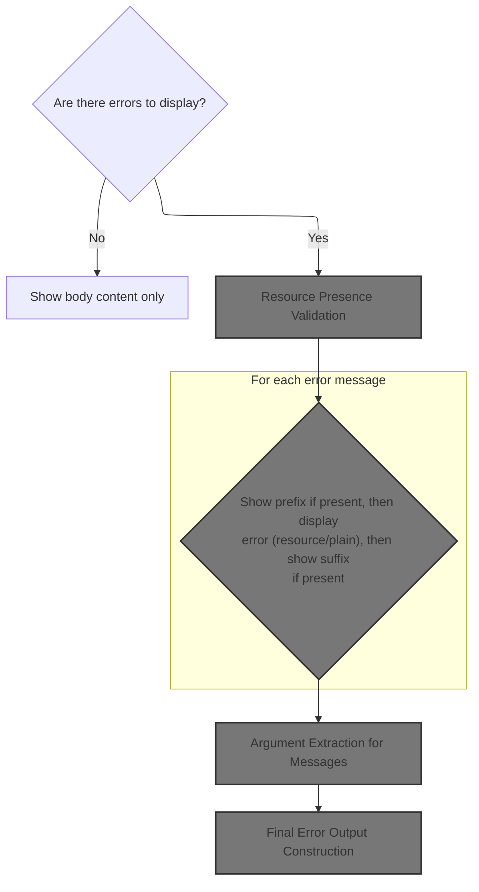
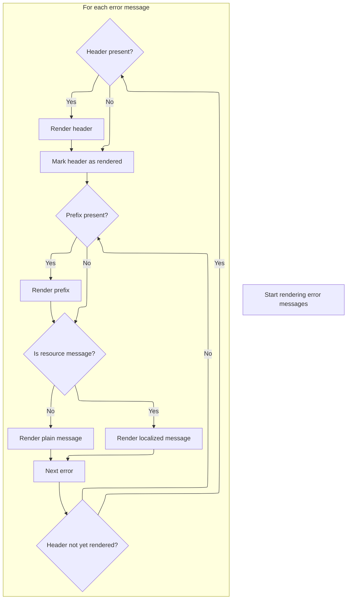
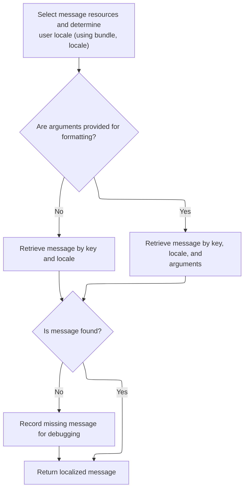
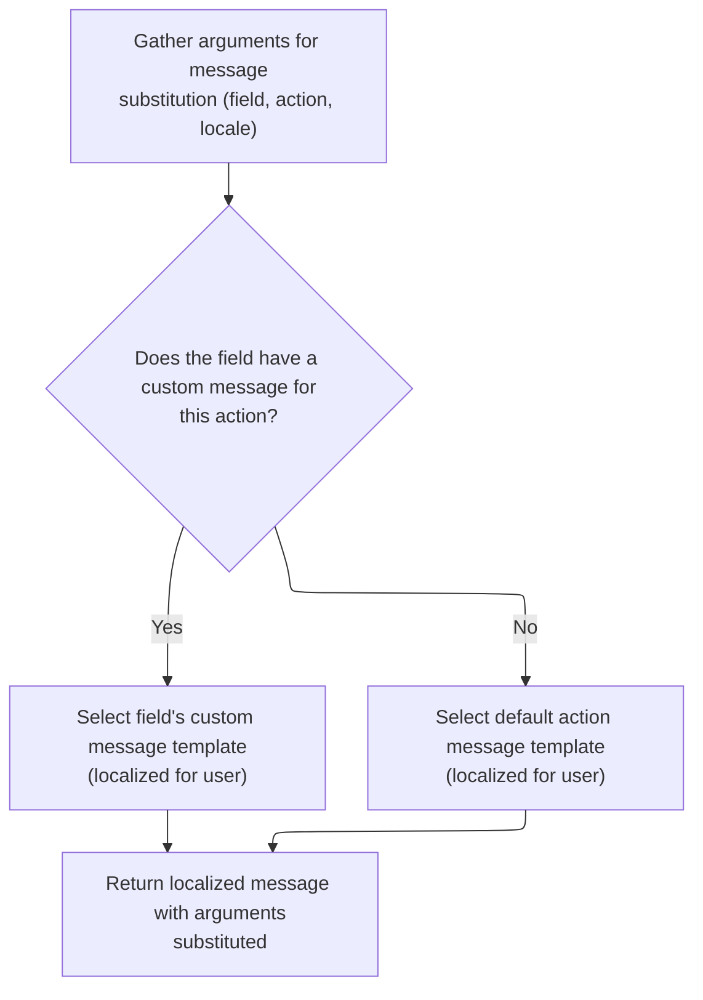

This document describes how error messages are displayed to users, using optional headers, footers, prefixes, and suffixes when available. The process ensures that each error message is shown in a way that matches the user's language and formatting preferences. The input is a set of error messages and optional formatting resources, and the output is a formatted, localized error message block in the user interface.

# Error Message Rendering Entry



<SwmSnippet path="/taglib/src/main/java/org/apache/struts/taglib/html/ErrorsTag.java" line="184">

---

In <SwmToken path="taglib/src/main/java/org/apache/struts/taglib/html/ErrorsTag.java" pos="184:5:5" line-data="    public int doStartTag() throws JspException {">`doStartTag`</SwmToken>, we grab error messages and bail if there aren't any. Then, we use <SwmToken path="taglib/src/main/java/org/apache/struts/taglib/html/ErrorsTag.java" pos="190:1:1" line-data="                TagUtils.getInstance().getActionMessages(pageContext, name);">`TagUtils`</SwmToken> to check if header, footer, prefix, and suffix are actually defined in the resource bundles, so we know what to render. This sets up the flow for building the error output, and that's why we need <SwmToken path="taglib/src/main/java/org/apache/struts/taglib/html/ErrorsTag.java" pos="190:1:1" line-data="                TagUtils.getInstance().getActionMessages(pageContext, name);">`TagUtils`</SwmToken> next—to handle resource lookups and presence checks.

```java
    public int doStartTag() throws JspException {
        // Were any error messages specified?
        ActionMessages errors = null;

        try {
            errors =
                TagUtils.getInstance().getActionMessages(pageContext, name);
        } catch (JspException e) {
            TagUtils.getInstance().saveException(pageContext, e);
            throw e;
        }

        if ((errors == null) || errors.isEmpty()) {
            return (EVAL_BODY_INCLUDE);
        }

        boolean headerPresent =
            TagUtils.getInstance().present(pageContext, bundle, locale,
                getHeader());

        boolean footerPresent =
            TagUtils.getInstance().present(pageContext, bundle, locale,
                getFooter());

        boolean prefixPresent =
            TagUtils.getInstance().present(pageContext, bundle, locale,
                getPrefix());

        boolean suffixPresent =
            TagUtils.getInstance().present(pageContext, bundle, locale,
                getSuffix());

```

---

</SwmSnippet>

## Resource Presence Validation

<SwmSnippet path="/taglib/src/main/java/org/apache/struts/taglib/TagUtils.java" line="1094">

---

In <SwmToken path="taglib/src/main/java/org/apache/struts/taglib/TagUtils.java" pos="1094:5:5" line-data="    public boolean present(PageContext pageContext, String bundle,">`present`</SwmToken>, we grab the resource bundle and figure out the user's locale. This sets up the context for checking if a given key is actually defined for the current user, so we can decide if header, footer, etc. should be rendered.

```java
    public boolean present(PageContext pageContext, String bundle,
        String locale, String key)
        throws JspException {
        MessageResources resources =
            retrieveMessageResources(pageContext, bundle, true);

        Locale userLocale = getUserLocale(pageContext, locale);

```

---

</SwmSnippet>

### Locale Resolution

See <SwmLink doc-title="Determining User Locale">[Determining User Locale](/.swm/determining-user-locale.d7epx6kr.sw.md)</SwmLink>

### Key Existence Check

<SwmSnippet path="/taglib/src/main/java/org/apache/struts/taglib/TagUtils.java" line="1102">

---

Back in <SwmToken path="taglib/src/main/java/org/apache/struts/taglib/html/ErrorsTag.java" pos="201:7:7" line-data="            TagUtils.getInstance().present(pageContext, bundle, locale,">`present`</SwmToken>, we use MessageResources.isPresent to check if the key exists for the user's locale. This handles cases where the resource is missing or flagged as invalid (with '???'), so we know whether to render the header/footer/prefix/suffix.

```java
        return resources.isPresent(userLocale, key);
    }
```

---

</SwmSnippet>

<SwmSnippet path="/core/src/main/java/org/apache/struts/util/MessageResources.java" line="397">

---

MessageResources.isPresent checks if a localized message exists for a key. If the message is null or flagged with '???', it's treated as missing. Otherwise, it's present and can be rendered.

```java
    public boolean isPresent(Locale locale, String key) {
        String message = getMessage(locale, key);

        if (message == null) {
            return false;
        } else if (message.startsWith("???") && message.endsWith("???")) {
            return false; // FIXME - Only valid for default implementation
        } else {
            return true;
        }
    }
```

---

</SwmSnippet>

## Error Message Iteration



<SwmSnippet path="/taglib/src/main/java/org/apache/struts/taglib/html/ErrorsTag.java" line="216">

---

After checking presence, ErrorsTag.doStartTag grabs either all error messages or just those for a specific property. For each error, we use TagUtils.message to fetch the localized string if it's a resource, or use the literal value. This lets us build the output with the right formatting and localization.

```java
        // Render the error messages appropriately
        StringBuffer results = new StringBuffer();
        boolean headerDone = false;
        String message = null;
        Iterator reports =
            (property == null) ? errors.get() : errors.get(property);

        while (reports.hasNext()) {
            ActionMessage report = (ActionMessage) reports.next();

            if (!headerDone) {
                if (headerPresent) {
                    message =
                        TagUtils.getInstance().message(pageContext, bundle,
                            locale, getHeader());

                    results.append(message);
                }

                headerDone = true;
            }

            if (prefixPresent) {
                message =
                    TagUtils.getInstance().message(pageContext, bundle, locale,
                        getPrefix());
                results.append(message);
            }

            if (report.isResource()) {
                message =
                    TagUtils.getInstance().message(pageContext, bundle, locale,
                        report.getKey(), report.getValues());
            } else {
                message = report.getKey();
            }

```

---

</SwmSnippet>

## Localized Message Retrieval



<SwmSnippet path="/taglib/src/main/java/org/apache/struts/taglib/TagUtils.java" line="995">

---

In <SwmToken path="taglib/src/main/java/org/apache/struts/taglib/TagUtils.java" pos="995:5:5" line-data="    public String message(PageContext pageContext, String bundle,">`message`</SwmToken>, we grab the resource bundle and locale again, since message rendering needs to be context-aware. This sets up for fetching the actual message string, possibly with arguments for formatting.

```java
    public String message(PageContext pageContext, String bundle,
        String locale, String key, Object[] args)
        throws JspException {
        MessageResources resources =
            retrieveMessageResources(pageContext, bundle, false);

        Locale userLocale = getUserLocale(pageContext, locale);
```

---

</SwmSnippet>

<SwmSnippet path="/taglib/src/main/java/org/apache/struts/taglib/TagUtils.java" line="1002">

---

Back in TagUtils.message, we call either <SwmToken path="taglib/src/main/java/org/apache/struts/taglib/TagUtils.java" pos="1005:7:7" line-data="            message = resources.getMessage(userLocale, key);">`getMessage`</SwmToken> with just the key or with arguments, depending on whether args are present. This lets us handle both plain and parameterized error messages, and that's why we need Resources.getMessage next.

```java
        String message = null;

        if (args == null) {
            message = resources.getMessage(userLocale, key);
        } else {
            message = resources.getMessage(userLocale, key, args);
        }

```

---

</SwmSnippet>

<SwmSnippet path="/core/src/main/java/org/apache/struts/validator/Resources.java" line="249">

---

Resources.getMessage grabs the resource bundle from the request and figures out the user's locale. This sets up for fetching the localized message string for the given key.

```java
    public static String getMessage(HttpServletRequest request, String key) {
        MessageResources messages = getMessageResources(request);

        return getMessage(messages, RequestUtils.getUserLocale(request, null),
            key);
    }
```

---

</SwmSnippet>

<SwmSnippet path="/taglib/src/main/java/org/apache/struts/taglib/TagUtils.java" line="1010">

---

After getting the message from Resources, TagUtils.message logs any missing keys if debug is enabled. Then it returns the message, so the calling code can render it or handle missing cases.

```java
        if ((message == null) && log.isDebugEnabled()) {
            // log missing key to ease debugging
            log.debug(resources.getMessage("message.resources", key, bundle,
                    locale));
        }

        return message;
    }
```

---

</SwmSnippet>

## Argument Extraction for Messages



<SwmSnippet path="/core/src/main/java/org/apache/struts/validator/Resources.java" line="265">

---

In Resources.getMessage, we pull up to four arguments from the field for the action. This sets up for formatting the message with dynamic values, and that's why we need <SwmToken path="core/src/main/java/org/apache/struts/validator/Resources.java" pos="267:9:9" line-data="        String[] args = getArgs(va.getName(), messages, locale, field);">`getArgs`</SwmToken> next.

```java
    public static String getMessage(MessageResources messages, Locale locale,
        ValidatorAction va, Field field) {
        String[] args = getArgs(va.getName(), messages, locale, field);
```

---

</SwmSnippet>

<SwmSnippet path="/core/src/main/java/org/apache/struts/validator/Resources.java" line="420">

---

Resources.getArgs grabs up to four Arg objects from the field for the action, checks if each is a resource or literal, and builds the argument array for message formatting. The fixed four-argument limit is a repo-specific detail.

```java
    public static String[] getArgs(String actionName,
        MessageResources messages, Locale locale, Field field) {
        String[] argMessages = new String[4];

        Arg[] args =
            new Arg[] {
                field.getArg(actionName, 0), field.getArg(actionName, 1),
                field.getArg(actionName, 2), field.getArg(actionName, 3)
            };

        for (int i = 0; i < args.length; i++) {
            if (args[i] == null) {
                continue;
            }

            if (args[i].isResource()) {
                argMessages[i] = getMessage(messages, locale, args[i].getKey());
            } else {
                argMessages[i] = args[i].getKey();
            }
        }
```

---

</SwmSnippet>

<SwmSnippet path="/core/src/main/java/org/apache/struts/validator/Resources.java" line="268">

---

After building the argument array, Resources.getMessage picks the message key from the field if available, or falls back to the action's default. Then it returns the formatted message, ready for rendering.

```java
        String msg =
            (field.getMsg(va.getName()) != null) ? field.getMsg(va.getName())
                                                 : va.getMsg();

        return messages.getMessage(locale, msg, args);
    }
```

---

</SwmSnippet>

## Final Error Output Construction

```mermaid
%%{init: {"flowchart": {"defaultRenderer": "elk"}} }%%
flowchart TD
    node1{"Is there an error message?"}
    click node1 openCode "taglib/src/main/java/org/apache/struts/taglib/html/ErrorsTag.java:253:255"
    node1 -->|"Yes: message exists"| node2["Append error message"]
    click node2 openCode "taglib/src/main/java/org/apache/struts/taglib/html/ErrorsTag.java:254:254"
    node1 -->|"No: no message"| node3{"Is suffix present?"}
    node2 --> node3
    node3 -->|"Yes: suffixPresent"| node4["Append suffix"]
    click node3 openCode "taglib/src/main/java/org/apache/struts/taglib/html/ErrorsTag.java:257:262"
    click node4 openCode "taglib/src/main/java/org/apache/struts/taglib/html/ErrorsTag.java:258:261"
    node3 -->|"No: no suffix"| node5{"Header done and footer present?"}
    node4 --> node5
    node5 -->|"Yes: headerDone && footerPresent"| node6["Append footer"]
    click node5 openCode "taglib/src/main/java/org/apache/struts/taglib/html/ErrorsTag.java:265:270"
    click node6 openCode "taglib/src/main/java/org/apache/struts/taglib/html/ErrorsTag.java:266:269"
    node5 -->|"No: not both"| node7["Display assembled messages"]
    node6 --> node7
    node7["Display assembled messages"]
    click node7 openCode "taglib/src/main/java/org/apache/struts/taglib/html/ErrorsTag.java:272:274"
classDef HeadingStyle fill:#777777,stroke:#333,stroke-width:2px;

%% Swimm:
%% %%{init: {"flowchart": {"defaultRenderer": "elk"}} }%%
%% flowchart TD
%%     node1{"Is there an error message?"}
%%     click node1 openCode "<SwmPath>[taglib/…/html/ErrorsTag.java](taglib/src/main/java/org/apache/struts/taglib/html/ErrorsTag.java)</SwmPath>:253:255"
%%     node1 -->|"Yes: message exists"| node2["Append error message"]
%%     click node2 openCode "<SwmPath>[taglib/…/html/ErrorsTag.java](taglib/src/main/java/org/apache/struts/taglib/html/ErrorsTag.java)</SwmPath>:254:254"
%%     node1 -->|"No: no message"| node3{"Is suffix present?"}
%%     node2 --> node3
%%     node3 -->|"Yes: <SwmToken path="taglib/src/main/java/org/apache/struts/taglib/html/ErrorsTag.java" pos="212:3:3" line-data="        boolean suffixPresent =">`suffixPresent`</SwmToken>"| node4["Append suffix"]
%%     click node3 openCode "<SwmPath>[taglib/…/html/ErrorsTag.java](taglib/src/main/java/org/apache/struts/taglib/html/ErrorsTag.java)</SwmPath>:257:262"
%%     click node4 openCode "<SwmPath>[taglib/…/html/ErrorsTag.java](taglib/src/main/java/org/apache/struts/taglib/html/ErrorsTag.java)</SwmPath>:258:261"
%%     node3 -->|"No: no suffix"| node5{"Header done and footer present?"}
%%     node4 --> node5
%%     node5 -->|"Yes: <SwmToken path="taglib/src/main/java/org/apache/struts/taglib/html/ErrorsTag.java" pos="218:3:3" line-data="        boolean headerDone = false;">`headerDone`</SwmToken> && <SwmToken path="taglib/src/main/java/org/apache/struts/taglib/html/ErrorsTag.java" pos="204:3:3" line-data="        boolean footerPresent =">`footerPresent`</SwmToken>"| node6["Append footer"]
%%     click node5 openCode "<SwmPath>[taglib/…/html/ErrorsTag.java](taglib/src/main/java/org/apache/struts/taglib/html/ErrorsTag.java)</SwmPath>:265:270"
%%     click node6 openCode "<SwmPath>[taglib/…/html/ErrorsTag.java](taglib/src/main/java/org/apache/struts/taglib/html/ErrorsTag.java)</SwmPath>:266:269"
%%     node5 -->|"No: not both"| node7["Display assembled messages"]
%%     node6 --> node7
%%     node7["Display assembled messages"]
%%     click node7 openCode "<SwmPath>[taglib/…/html/ErrorsTag.java](taglib/src/main/java/org/apache/struts/taglib/html/ErrorsTag.java)</SwmPath>:272:274"
%% classDef HeadingStyle fill:#777777,stroke:#333,stroke-width:2px;
```



<SwmSnippet path="/taglib/src/main/java/org/apache/struts/taglib/html/ErrorsTag.java" line="253">

---

After fetching messages from <SwmToken path="taglib/src/main/java/org/apache/struts/taglib/html/ErrorsTag.java" pos="259:1:1" line-data="                    TagUtils.getInstance().message(pageContext, bundle, locale,">`TagUtils`</SwmToken>, ErrorsTag.doStartTag builds the final output: appends header (once), prefix/message/suffix for each error, then footer (if needed). The result is written to the page context for display, and the tag returns control to the JSP.

```java
            if (message != null) {
                results.append(message);
            }

            if (suffixPresent) {
                message =
                    TagUtils.getInstance().message(pageContext, bundle, locale,
                        getSuffix());
                results.append(message);
            }
        }

        if (headerDone && footerPresent) {
            message =
                TagUtils.getInstance().message(pageContext, bundle, locale,
                    getFooter());
            results.append(message);
        }

        TagUtils.getInstance().write(pageContext, results.toString());

        return (EVAL_BODY_INCLUDE);
    }
```

---

</SwmSnippet>

&nbsp;

*This is an auto-generated document by Swimm 🌊 and has not yet been verified by a human*

<SwmMeta version="3.0.0" repo-id="Z2l0aHViJTNBJTNBc3RydXRzMSUzQSUzQVN3aW1tLURlbW8=" repo-name="struts1"><sup>Powered by [Swimm](https://app.swimm.io/)</sup></SwmMeta>
