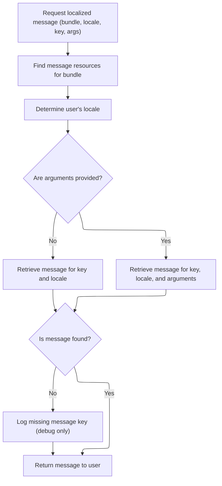
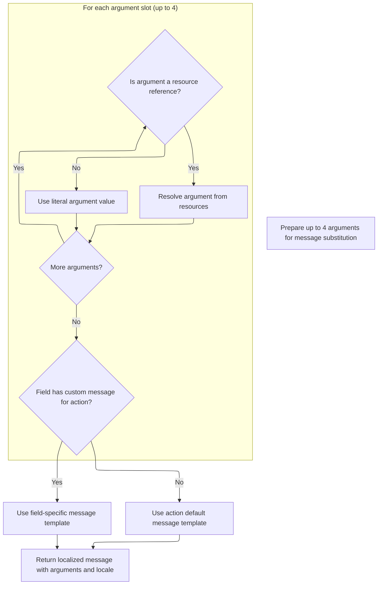

This document describes how the application displays localized messages to users. When a message is requested, the system retrieves the relevant resource bundle, determines the user's language, and formats the message with any provided arguments. This supports both static and dynamic messages.

# Where is this flow used?

This flow is used multiple times in the codebase as represented in the following diagram:

```mermaid
graph TD;
      3c16e27874dd8429686a0279fad89597b4443eb97c8f1d24a5e7efbd52d382fc(faces/…/taglib/MessageTag.java::MessageTag.doStartTag) --> ea5be6219523c689b6a99608c5132bb1e3ddbd39c7ee5917ec1b4e0954831032(taglib/…/taglib/TagUtils.java::TagUtils.message)

638c54b469cfefaefb1ba95e475c8e3d4b32e5c8f11d447f0a4b2668f17e02eb(faces/…/taglib/ErrorsTag.java::ErrorsTag.doStartTag) --> ea5be6219523c689b6a99608c5132bb1e3ddbd39c7ee5917ec1b4e0954831032(taglib/…/taglib/TagUtils.java::TagUtils.message)

72afb4dd125b85c39db221e93726cbc34be8e9aa3cca5350087fe9a68598af37(taglib/…/html/MessagesTag.java::MessagesTag.processMessage) --> ea5be6219523c689b6a99608c5132bb1e3ddbd39c7ee5917ec1b4e0954831032(taglib/…/taglib/TagUtils.java::TagUtils.message)

8bf7f4c55e8294499cb93083471ed76f74afaf4bb5dd222e7e9d67ee3346238b(taglib/…/html/MessagesTag.java::MessagesTag.doStartTag) --> 72afb4dd125b85c39db221e93726cbc34be8e9aa3cca5350087fe9a68598af37(taglib/…/html/MessagesTag.java::MessagesTag.processMessage)

fe1eff2e4d768eea4bcfdac55fc10ff525f5cce284c33dd790f59c92899472f5(taglib/…/html/MessagesTag.java::MessagesTag.doAfterBody) --> 72afb4dd125b85c39db221e93726cbc34be8e9aa3cca5350087fe9a68598af37(taglib/…/html/MessagesTag.java::MessagesTag.processMessage)


classDef mainFlowStyle color:#000000,fill:#7CB9F4
classDef rootsStyle color:#000000,fill:#00FFF4
classDef Style1 color:#000000,fill:#00FFAA
classDef Style2 color:#000000,fill:#FFFF00
classDef Style3 color:#000000,fill:#AA7CB9

%% Swimm:
%% graph TD;
%%       3c16e27874dd8429686a0279fad89597b4443eb97c8f1d24a5e7efbd52d382fc(<SwmPath>[faces/…/taglib/MessageTag.java](faces/src/main/java/org/apache/struts/faces/taglib/MessageTag.java)</SwmPath>::MessageTag.doStartTag) --> ea5be6219523c689b6a99608c5132bb1e3ddbd39c7ee5917ec1b4e0954831032(<SwmPath>[taglib/…/taglib/TagUtils.java](taglib/src/main/java/org/apache/struts/taglib/TagUtils.java)</SwmPath>::TagUtils.message)
%% 
%% 638c54b469cfefaefb1ba95e475c8e3d4b32e5c8f11d447f0a4b2668f17e02eb(<SwmPath>[faces/…/taglib/ErrorsTag.java](faces/src/main/java/org/apache/struts/faces/taglib/ErrorsTag.java)</SwmPath>::ErrorsTag.doStartTag) --> ea5be6219523c689b6a99608c5132bb1e3ddbd39c7ee5917ec1b4e0954831032(<SwmPath>[taglib/…/taglib/TagUtils.java](taglib/src/main/java/org/apache/struts/taglib/TagUtils.java)</SwmPath>::TagUtils.message)
%% 
%% 72afb4dd125b85c39db221e93726cbc34be8e9aa3cca5350087fe9a68598af37(<SwmPath>[taglib/…/html/MessagesTag.java](taglib/src/main/java/org/apache/struts/taglib/html/MessagesTag.java)</SwmPath>::MessagesTag.processMessage) --> ea5be6219523c689b6a99608c5132bb1e3ddbd39c7ee5917ec1b4e0954831032(<SwmPath>[taglib/…/taglib/TagUtils.java](taglib/src/main/java/org/apache/struts/taglib/TagUtils.java)</SwmPath>::TagUtils.message)
%% 
%% 8bf7f4c55e8294499cb93083471ed76f74afaf4bb5dd222e7e9d67ee3346238b(<SwmPath>[taglib/…/html/MessagesTag.java](taglib/src/main/java/org/apache/struts/taglib/html/MessagesTag.java)</SwmPath>::MessagesTag.doStartTag) --> 72afb4dd125b85c39db221e93726cbc34be8e9aa3cca5350087fe9a68598af37(<SwmPath>[taglib/…/html/MessagesTag.java](taglib/src/main/java/org/apache/struts/taglib/html/MessagesTag.java)</SwmPath>::MessagesTag.processMessage)
%% 
%% fe1eff2e4d768eea4bcfdac55fc10ff525f5cce284c33dd790f59c92899472f5(<SwmPath>[taglib/…/html/MessagesTag.java](taglib/src/main/java/org/apache/struts/taglib/html/MessagesTag.java)</SwmPath>::MessagesTag.doAfterBody) --> 72afb4dd125b85c39db221e93726cbc34be8e9aa3cca5350087fe9a68598af37(<SwmPath>[taglib/…/html/MessagesTag.java](taglib/src/main/java/org/apache/struts/taglib/html/MessagesTag.java)</SwmPath>::MessagesTag.processMessage)
%% 
%% 
%% classDef mainFlowStyle color:#000000,fill:#7CB9F4
%% classDef rootsStyle color:#000000,fill:#00FFF4
%% classDef Style1 color:#000000,fill:#00FFAA
%% classDef Style2 color:#000000,fill:#FFFF00
%% classDef Style3 color:#000000,fill:#AA7CB9
```



# Resolving and Fetching Message Resources



<SwmSnippet path="/taglib/src/main/java/org/apache/struts/taglib/TagUtils.java" line="995">

---

In <SwmToken path="taglib/src/main/java/org/apache/struts/taglib/TagUtils.java" pos="995:5:5" line-data="    public String message(PageContext pageContext, String bundle,">`message`</SwmToken>, we kick things off by grabbing the <SwmToken path="taglib/src/main/java/org/apache/struts/taglib/TagUtils.java" pos="998:1:1" line-data="        MessageResources resources =">`MessageResources`</SwmToken> object. This is needed because all message lookups and formatting depend on it. We call <SwmToken path="taglib/src/main/java/org/apache/struts/taglib/TagUtils.java" pos="999:1:1" line-data="            retrieveMessageResources(pageContext, bundle, false);">`retrieveMessageResources`</SwmToken> right away to make sure we've got the right resource bundle before doing anything else.

```java
    public String message(PageContext pageContext, String bundle,
        String locale, String key, Object[] args)
        throws JspException {
        MessageResources resources =
            retrieveMessageResources(pageContext, bundle, false);

```

---

</SwmSnippet>

<SwmSnippet path="/taglib/src/main/java/org/apache/struts/taglib/TagUtils.java" line="1118">

---

<SwmToken path="taglib/src/main/java/org/apache/struts/taglib/TagUtils.java" pos="1118:5:5" line-data="    public MessageResources retrieveMessageResources(PageContext pageContext,">`retrieveMessageResources`</SwmToken> handles the lookup for the message bundle. It checks scopes in a specific order: page (if allowed), request, then application with a module prefix, and finally application without the prefix. If nothing is found, it throws. This order lets overrides and module-specific resources take priority over global ones.

```java
    public MessageResources retrieveMessageResources(PageContext pageContext,
        String bundle, boolean checkPageScope)
        throws JspException {
        MessageResources resources = null;

        if (bundle == null) {
            bundle = Globals.MESSAGES_KEY;
        }

        if (checkPageScope) {
            resources =
                (MessageResources) pageContext.getAttribute(bundle,
                    PageContext.PAGE_SCOPE);
        }

        if (resources == null) {
            resources =
                (MessageResources) pageContext.getAttribute(bundle,
                    PageContext.REQUEST_SCOPE);
        }

        if (resources == null) {
            ModuleConfig moduleConfig = getModuleConfig(pageContext);

            resources =
                (MessageResources) pageContext.getAttribute(bundle
                    + moduleConfig.getPrefix(), PageContext.APPLICATION_SCOPE);
        }

        if (resources == null) {
            resources =
                (MessageResources) pageContext.getAttribute(bundle,
                    PageContext.APPLICATION_SCOPE);
        }

        if (resources == null) {
            JspException e =
                new JspException(messages.getMessage("message.bundle", bundle));

            saveException(pageContext, e);
            throw e;
        }

        return resources;
    }
```

---

</SwmSnippet>

<SwmSnippet path="/taglib/src/main/java/org/apache/struts/taglib/TagUtils.java" line="1001">

---

Back in `TagUtils.message`, after getting the resources, we resolve the user's locale and fetch the message. If arguments are present, we call the message lookup with them. If the message isn't found, we log it for debugging. Next, we call into the validator's Resources logic to handle argument localization and formatting.

```java
        Locale userLocale = getUserLocale(pageContext, locale);
        String message = null;

        if (args == null) {
            message = resources.getMessage(userLocale, key);
        } else {
            message = resources.getMessage(userLocale, key, args);
        }

        if ((message == null) && log.isDebugEnabled()) {
            // log missing key to ease debugging
            log.debug(resources.getMessage("message.resources", key, bundle,
                    locale));
        }

        return message;
    }
```

---

</SwmSnippet>

# Formatting Validator Messages with Arguments



<SwmSnippet path="/core/src/main/java/org/apache/struts/validator/Resources.java" line="265">

---

In <SwmToken path="core/src/main/java/org/apache/struts/validator/Resources.java" pos="265:7:7" line-data="    public static String getMessage(MessageResources messages, Locale locale,">`getMessage`</SwmToken>, we start by grabbing the arguments for the validator action and field. This is needed so the message can include dynamic values, like field names or constraints, instead of being generic.

```java
    public static String getMessage(MessageResources messages, Locale locale,
        ValidatorAction va, Field field) {
        String[] args = getArgs(va.getName(), messages, locale, field);
```

---

</SwmSnippet>

<SwmSnippet path="/core/src/main/java/org/apache/struts/validator/Resources.java" line="420">

---

<SwmToken path="core/src/main/java/org/apache/struts/validator/Resources.java" pos="420:9:9" line-data="    public static String[] getArgs(String actionName,">`getArgs`</SwmToken> grabs up to four arguments for the action and field, localizes them if needed, and returns them as an array. It assumes fields only ever have four arguments, so anything extra is ignored.

```java
    public static String[] getArgs(String actionName,
        MessageResources messages, Locale locale, Field field) {
        String[] argMessages = new String[4];

        Arg[] args =
            new Arg[] {
                field.getArg(actionName, 0), field.getArg(actionName, 1),
                field.getArg(actionName, 2), field.getArg(actionName, 3)
            };

        for (int i = 0; i < args.length; i++) {
            if (args[i] == null) {
                continue;
            }

            if (args[i].isResource()) {
                argMessages[i] = getMessage(messages, locale, args[i].getKey());
            } else {
                argMessages[i] = args[i].getKey();
            }
        }
```

---

</SwmSnippet>

<SwmSnippet path="/core/src/main/java/org/apache/struts/validator/Resources.java" line="268">

---

After <SwmToken path="core/src/main/java/org/apache/struts/validator/Resources.java" pos="267:9:9" line-data="        String[] args = getArgs(va.getName(), messages, locale, field);">`getArgs`</SwmToken> returns, we pick the message template from the field if it exists, otherwise from the action. Then we call the message lookup with the localized arguments to build the final validator message.

```java
        String msg =
            (field.getMsg(va.getName()) != null) ? field.getMsg(va.getName())
                                                 : va.getMsg();

        return messages.getMessage(locale, msg, args);
    }
```

---

</SwmSnippet>

&nbsp;

*This is an auto-generated document by Swimm 🌊 and has not yet been verified by a human*

<SwmMeta version="3.0.0" repo-id="Z2l0aHViJTNBJTNBc3RydXRzMSUzQSUzQVN3aW1tLURlbW8=" repo-name="struts1"><sup>Powered by [Swimm](https://app.swimm.io/)</sup></SwmMeta>
