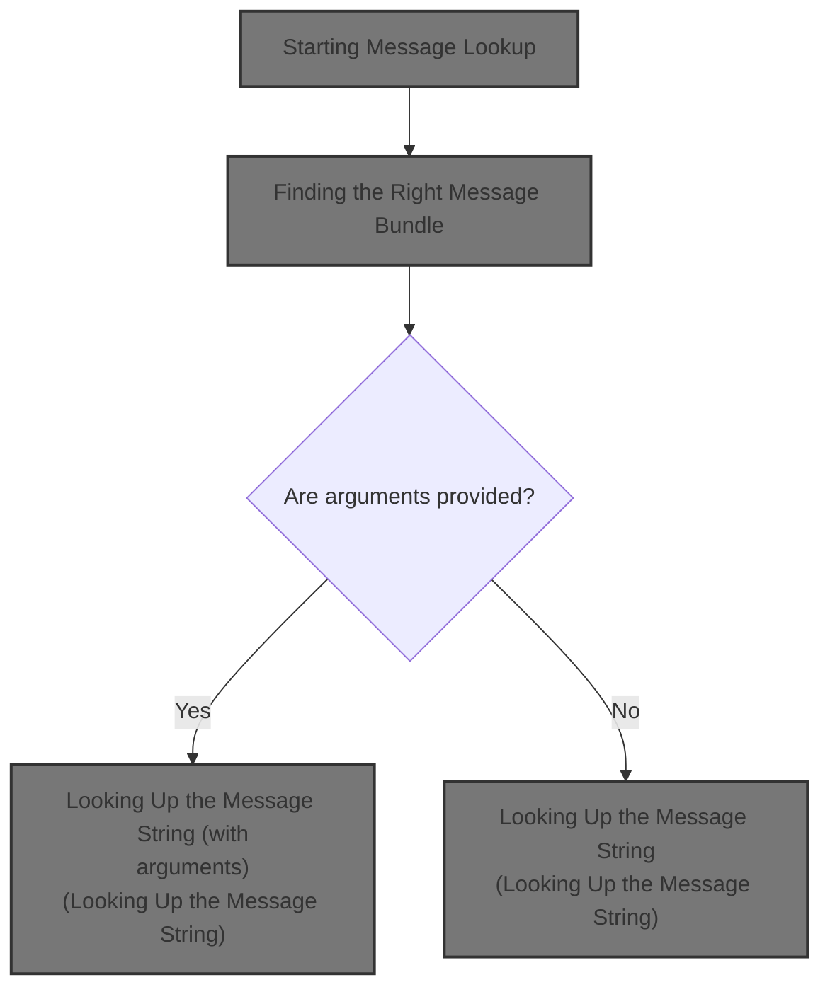
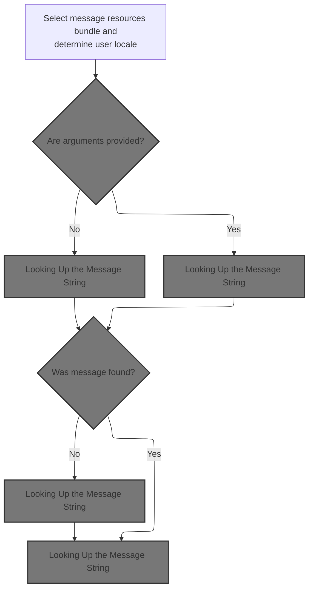
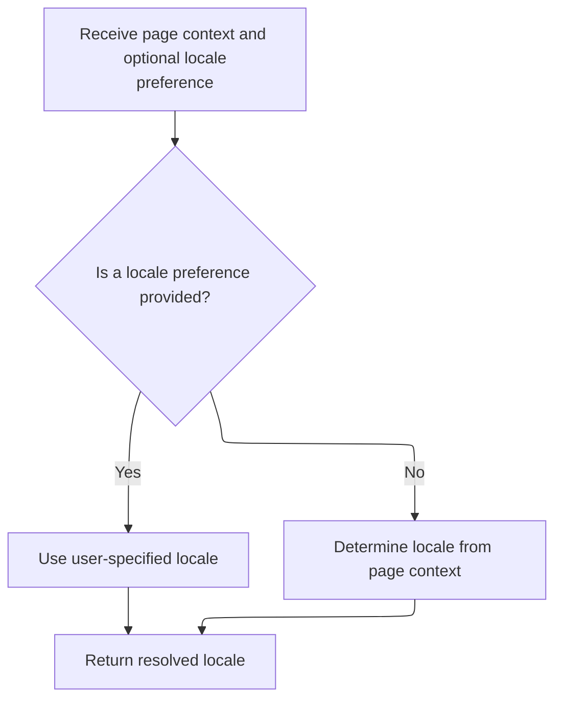
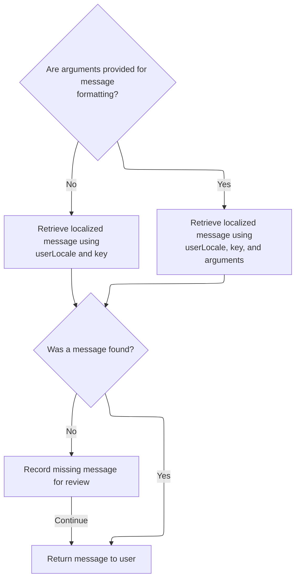
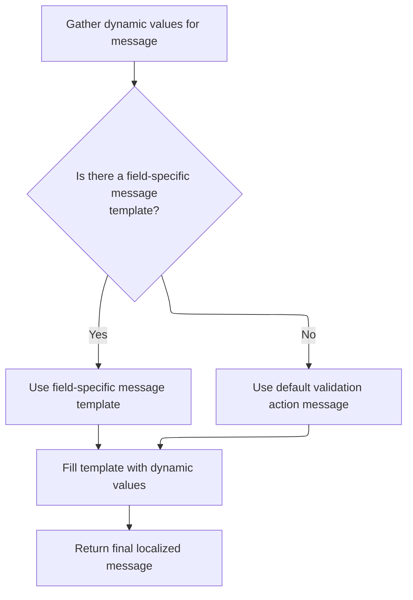

This document describes how the system retrieves and displays localized messages to users. The process selects the correct message bundle, determines the user's locale, and formats the message with any provided arguments, enabling internationalized and dynamic user interfaces.



# Where is this flow used?

This flow is used multiple times in the codebase as represented in the following diagram:

```mermaid
graph TD;
      3c16e27874dd8429686a0279fad89597b4443eb97c8f1d24a5e7efbd52d382fc(faces/…/taglib/MessageTag.java::MessageTag.doStartTag) --> ea5be6219523c689b6a99608c5132bb1e3ddbd39c7ee5917ec1b4e0954831032(taglib/…/taglib/TagUtils.java::TagUtils.message)

638c54b469cfefaefb1ba95e475c8e3d4b32e5c8f11d447f0a4b2668f17e02eb(faces/…/taglib/ErrorsTag.java::ErrorsTag.doStartTag) --> ea5be6219523c689b6a99608c5132bb1e3ddbd39c7ee5917ec1b4e0954831032(taglib/…/taglib/TagUtils.java::TagUtils.message)

72afb4dd125b85c39db221e93726cbc34be8e9aa3cca5350087fe9a68598af37(taglib/…/html/MessagesTag.java::MessagesTag.processMessage) --> ea5be6219523c689b6a99608c5132bb1e3ddbd39c7ee5917ec1b4e0954831032(taglib/…/taglib/TagUtils.java::TagUtils.message)

8bf7f4c55e8294499cb93083471ed76f74afaf4bb5dd222e7e9d67ee3346238b(taglib/…/html/MessagesTag.java::MessagesTag.doStartTag) --> 72afb4dd125b85c39db221e93726cbc34be8e9aa3cca5350087fe9a68598af37(taglib/…/html/MessagesTag.java::MessagesTag.processMessage)

fe1eff2e4d768eea4bcfdac55fc10ff525f5cce284c33dd790f59c92899472f5(taglib/…/html/MessagesTag.java::MessagesTag.doAfterBody) --> 72afb4dd125b85c39db221e93726cbc34be8e9aa3cca5350087fe9a68598af37(taglib/…/html/MessagesTag.java::MessagesTag.processMessage)


classDef mainFlowStyle color:#000000,fill:#7CB9F4
classDef rootsStyle color:#000000,fill:#00FFF4
classDef Style1 color:#000000,fill:#00FFAA
classDef Style2 color:#000000,fill:#FFFF00
classDef Style3 color:#000000,fill:#AA7CB9

%% Swimm:
%% graph TD;
%%       3c16e27874dd8429686a0279fad89597b4443eb97c8f1d24a5e7efbd52d382fc(<SwmPath>[faces/…/taglib/MessageTag.java](faces/src/main/java/org/apache/struts/faces/taglib/MessageTag.java)</SwmPath>::MessageTag.doStartTag) --> ea5be6219523c689b6a99608c5132bb1e3ddbd39c7ee5917ec1b4e0954831032(<SwmPath>[taglib/…/taglib/TagUtils.java](taglib/src/main/java/org/apache/struts/taglib/TagUtils.java)</SwmPath>::TagUtils.message)
%% 
%% 638c54b469cfefaefb1ba95e475c8e3d4b32e5c8f11d447f0a4b2668f17e02eb(<SwmPath>[faces/…/taglib/ErrorsTag.java](faces/src/main/java/org/apache/struts/faces/taglib/ErrorsTag.java)</SwmPath>::ErrorsTag.doStartTag) --> ea5be6219523c689b6a99608c5132bb1e3ddbd39c7ee5917ec1b4e0954831032(<SwmPath>[taglib/…/taglib/TagUtils.java](taglib/src/main/java/org/apache/struts/taglib/TagUtils.java)</SwmPath>::TagUtils.message)
%% 
%% 72afb4dd125b85c39db221e93726cbc34be8e9aa3cca5350087fe9a68598af37(<SwmPath>[taglib/…/html/MessagesTag.java](taglib/src/main/java/org/apache/struts/taglib/html/MessagesTag.java)</SwmPath>::MessagesTag.processMessage) --> ea5be6219523c689b6a99608c5132bb1e3ddbd39c7ee5917ec1b4e0954831032(<SwmPath>[taglib/…/taglib/TagUtils.java](taglib/src/main/java/org/apache/struts/taglib/TagUtils.java)</SwmPath>::TagUtils.message)
%% 
%% 8bf7f4c55e8294499cb93083471ed76f74afaf4bb5dd222e7e9d67ee3346238b(<SwmPath>[taglib/…/html/MessagesTag.java](taglib/src/main/java/org/apache/struts/taglib/html/MessagesTag.java)</SwmPath>::MessagesTag.doStartTag) --> 72afb4dd125b85c39db221e93726cbc34be8e9aa3cca5350087fe9a68598af37(<SwmPath>[taglib/…/html/MessagesTag.java](taglib/src/main/java/org/apache/struts/taglib/html/MessagesTag.java)</SwmPath>::MessagesTag.processMessage)
%% 
%% fe1eff2e4d768eea4bcfdac55fc10ff525f5cce284c33dd790f59c92899472f5(<SwmPath>[taglib/…/html/MessagesTag.java](taglib/src/main/java/org/apache/struts/taglib/html/MessagesTag.java)</SwmPath>::MessagesTag.doAfterBody) --> 72afb4dd125b85c39db221e93726cbc34be8e9aa3cca5350087fe9a68598af37(<SwmPath>[taglib/…/html/MessagesTag.java](taglib/src/main/java/org/apache/struts/taglib/html/MessagesTag.java)</SwmPath>::MessagesTag.processMessage)
%% 
%% 
%% classDef mainFlowStyle color:#000000,fill:#7CB9F4
%% classDef rootsStyle color:#000000,fill:#00FFF4
%% classDef Style1 color:#000000,fill:#00FFAA
%% classDef Style2 color:#000000,fill:#FFFF00
%% classDef Style3 color:#000000,fill:#AA7CB9
```



# Starting Message Lookup



<SwmSnippet path="/taglib/src/main/java/org/apache/struts/taglib/TagUtils.java" line="995">

---

In <SwmToken path="taglib/src/main/java/org/apache/struts/taglib/TagUtils.java" pos="995:5:5" line-data="    public String message(PageContext pageContext, String bundle,">`message`</SwmToken>, we grab the <SwmToken path="taglib/src/main/java/org/apache/struts/taglib/TagUtils.java" pos="998:1:1" line-data="        MessageResources resources =">`MessageResources`</SwmToken> object first. Without it, we can't fetch any messages. That's why we call <SwmToken path="taglib/src/main/java/org/apache/struts/taglib/TagUtils.java" pos="999:1:1" line-data="            retrieveMessageResources(pageContext, bundle, false);">`retrieveMessageResources`</SwmToken> right away—to get access to the message bundle we'll use for the rest of the logic.

```java
    public String message(PageContext pageContext, String bundle,
        String locale, String key, Object[] args)
        throws JspException {
        MessageResources resources =
            retrieveMessageResources(pageContext, bundle, false);

```

---

</SwmSnippet>

## Finding the Right Message Bundle

```mermaid
%%{init: {"flowchart": {"defaultRenderer": "elk"}} }%%
flowchart TD
    node1["Start: Retrieve message resources"] --> node2{"Is bundle provided?"}
    click node1 openCode "taglib/src/main/java/org/apache/struts/taglib/TagUtils.java:1118:1162"
    node2 -->|"No"| node3["Use default bundle name"]
    click node2 openCode "taglib/src/main/java/org/apache/struts/taglib/TagUtils.java:1123:1125"
    node2 -->|"Yes"| node4["Proceed with bundle name"]
    click node3 openCode "taglib/src/main/java/org/apache/struts/taglib/TagUtils.java:1123:1125"
    node3 --> node5{"Check page scope?"}
    node4 --> node5
    click node4 openCode "taglib/src/main/java/org/apache/struts/taglib/TagUtils.java:1123:1125"
    node5 -->|"Yes"| node6{"Resource in page scope?"}
    click node5 openCode "taglib/src/main/java/org/apache/struts/taglib/TagUtils.java:1127:1131"
    node5 -->|"No"| node7{"Resource in request scope?"}
    node6 -->|"Found"| node12["Return resource"]
    click node6 openCode "taglib/src/main/java/org/apache/struts/taglib/TagUtils.java:1127:1131"
    node6 -->|"Not found"| node7
    node7 -->|"Found"| node12
    click node7 openCode "taglib/src/main/java/org/apache/struts/taglib/TagUtils.java:1133:1137"
    node7 -->|"Not found"| node8{"Resource in application scope (with
module prefix)?"}
    node8 -->|"Found"| node12
    click node8 openCode "taglib/src/main/java/org/apache/struts/taglib/TagUtils.java:1139:1145"
    node8 -->|"Not found"| node9{"Resource in application scope (no
prefix)?"}
    node9 -->|"Found"| node12
    click node9 openCode "taglib/src/main/java/org/apache/struts/taglib/TagUtils.java:1147:1151"
    node9 -->|"Not found"| node10["Throw error: Resource not found"]
    click node10 openCode "taglib/src/main/java/org/apache/struts/taglib/TagUtils.java:1153:1159"
    node12 --> node11["Done"]
    click node12 openCode "taglib/src/main/java/org/apache/struts/taglib/TagUtils.java:1161:1162"
    click node11 openCode "taglib/src/main/java/org/apache/struts/taglib/TagUtils.java:1162:1162"
classDef HeadingStyle fill:#777777,stroke:#333,stroke-width:2px;

%% Swimm:
%% %%{init: {"flowchart": {"defaultRenderer": "elk"}} }%%
%% flowchart TD
%%     node1["Start: Retrieve message resources"] --> node2{"Is bundle provided?"}
%%     click node1 openCode "<SwmPath>[taglib/…/taglib/TagUtils.java](taglib/src/main/java/org/apache/struts/taglib/TagUtils.java)</SwmPath>:1118:1162"
%%     node2 -->|"No"| node3["Use default bundle name"]
%%     click node2 openCode "<SwmPath>[taglib/…/taglib/TagUtils.java](taglib/src/main/java/org/apache/struts/taglib/TagUtils.java)</SwmPath>:1123:1125"
%%     node2 -->|"Yes"| node4["Proceed with bundle name"]
%%     click node3 openCode "<SwmPath>[taglib/…/taglib/TagUtils.java](taglib/src/main/java/org/apache/struts/taglib/TagUtils.java)</SwmPath>:1123:1125"
%%     node3 --> node5{"Check page scope?"}
%%     node4 --> node5
%%     click node4 openCode "<SwmPath>[taglib/…/taglib/TagUtils.java](taglib/src/main/java/org/apache/struts/taglib/TagUtils.java)</SwmPath>:1123:1125"
%%     node5 -->|"Yes"| node6{"Resource in page scope?"}
%%     click node5 openCode "<SwmPath>[taglib/…/taglib/TagUtils.java](taglib/src/main/java/org/apache/struts/taglib/TagUtils.java)</SwmPath>:1127:1131"
%%     node5 -->|"No"| node7{"Resource in request scope?"}
%%     node6 -->|"Found"| node12["Return resource"]
%%     click node6 openCode "<SwmPath>[taglib/…/taglib/TagUtils.java](taglib/src/main/java/org/apache/struts/taglib/TagUtils.java)</SwmPath>:1127:1131"
%%     node6 -->|"Not found"| node7
%%     node7 -->|"Found"| node12
%%     click node7 openCode "<SwmPath>[taglib/…/taglib/TagUtils.java](taglib/src/main/java/org/apache/struts/taglib/TagUtils.java)</SwmPath>:1133:1137"
%%     node7 -->|"Not found"| node8{"Resource in application scope (with
%% module prefix)?"}
%%     node8 -->|"Found"| node12
%%     click node8 openCode "<SwmPath>[taglib/…/taglib/TagUtils.java](taglib/src/main/java/org/apache/struts/taglib/TagUtils.java)</SwmPath>:1139:1145"
%%     node8 -->|"Not found"| node9{"Resource in application scope (no
%% prefix)?"}
%%     node9 -->|"Found"| node12
%%     click node9 openCode "<SwmPath>[taglib/…/taglib/TagUtils.java](taglib/src/main/java/org/apache/struts/taglib/TagUtils.java)</SwmPath>:1147:1151"
%%     node9 -->|"Not found"| node10["Throw error: Resource not found"]
%%     click node10 openCode "<SwmPath>[taglib/…/taglib/TagUtils.java](taglib/src/main/java/org/apache/struts/taglib/TagUtils.java)</SwmPath>:1153:1159"
%%     node12 --> node11["Done"]
%%     click node12 openCode "<SwmPath>[taglib/…/taglib/TagUtils.java](taglib/src/main/java/org/apache/struts/taglib/TagUtils.java)</SwmPath>:1161:1162"
%%     click node11 openCode "<SwmPath>[taglib/…/taglib/TagUtils.java](taglib/src/main/java/org/apache/struts/taglib/TagUtils.java)</SwmPath>:1162:1162"
%% classDef HeadingStyle fill:#777777,stroke:#333,stroke-width:2px;
```



<SwmSnippet path="/taglib/src/main/java/org/apache/struts/taglib/TagUtils.java" line="1118">

---

<SwmToken path="taglib/src/main/java/org/apache/struts/taglib/TagUtils.java" pos="1118:5:5" line-data="    public MessageResources retrieveMessageResources(PageContext pageContext,">`retrieveMessageResources`</SwmToken> looks for the message bundle in a strict order: page, request, application with module prefix, then plain application. If nothing is found, it throws and logs the exception using <SwmToken path="taglib/src/main/java/org/apache/struts/taglib/TagUtils.java" pos="1157:1:1" line-data="            saveException(pageContext, e);">`saveException`</SwmToken>. This way, we always try the most specific bundle first and only fail if nothing is available.

```java
    public MessageResources retrieveMessageResources(PageContext pageContext,
        String bundle, boolean checkPageScope)
        throws JspException {
        MessageResources resources = null;

        if (bundle == null) {
            bundle = Globals.MESSAGES_KEY;
        }

        if (checkPageScope) {
            resources =
                (MessageResources) pageContext.getAttribute(bundle,
                    PageContext.PAGE_SCOPE);
        }

        if (resources == null) {
            resources =
                (MessageResources) pageContext.getAttribute(bundle,
                    PageContext.REQUEST_SCOPE);
        }

        if (resources == null) {
            ModuleConfig moduleConfig = getModuleConfig(pageContext);

            resources =
                (MessageResources) pageContext.getAttribute(bundle
                    + moduleConfig.getPrefix(), PageContext.APPLICATION_SCOPE);
        }

        if (resources == null) {
            resources =
                (MessageResources) pageContext.getAttribute(bundle,
                    PageContext.APPLICATION_SCOPE);
        }

        if (resources == null) {
            JspException e =
                new JspException(messages.getMessage("message.bundle", bundle));

            saveException(pageContext, e);
            throw e;
        }

        return resources;
    }
```

---

</SwmSnippet>

## Recording Exceptions in the Request

<SwmSnippet path="/taglib/src/main/java/org/apache/struts/taglib/TagUtils.java" line="1170">

---

<SwmToken path="taglib/src/main/java/org/apache/struts/taglib/TagUtils.java" pos="1170:5:5" line-data="    public void saveException(PageContext pageContext, Throwable exception) {">`saveException`</SwmToken> just puts the exception into the request scope under a fixed key. This makes it available for error handling downstream. The next step is handled by <SwmToken path="taglib/src/main/java/org/apache/struts/taglib/TagUtils.java" pos="1171:3:3" line-data="        pageContext.setAttribute(Globals.EXCEPTION_KEY, exception,">`setAttribute`</SwmToken>, which actually does the attribute set.

```java
    public void saveException(PageContext pageContext, Throwable exception) {
        pageContext.setAttribute(Globals.EXCEPTION_KEY, exception,
            PageContext.REQUEST_SCOPE);
    }
```

---

</SwmSnippet>

<SwmSnippet path="/tiles/src/main/java/org/apache/struts/tiles/taglib/util/TagUtils.java" line="290">

---

<SwmToken path="tiles/src/main/java/org/apache/struts/tiles/taglib/util/TagUtils.java" pos="290:7:7" line-data="    public static void setAttribute(PageContext pageContext, String name, Object beanValue)">`setAttribute`</SwmToken> wraps PageContext.setAttribute but always uses <SwmToken path="tiles/src/main/java/org/apache/struts/tiles/taglib/util/TagUtils.java" pos="292:13:13" line-data="        pageContext.setAttribute(name, beanValue, PageContext.REQUEST_SCOPE);">`REQUEST_SCOPE`</SwmToken>. This keeps the attribute tied to the current request, which is what the rest of the framework expects.

```java
    public static void setAttribute(PageContext pageContext, String name, Object beanValue)
        throws JspException {
        pageContext.setAttribute(name, beanValue, PageContext.REQUEST_SCOPE);
    }
```

---

</SwmSnippet>

## Determining the User Locale

<SwmSnippet path="/taglib/src/main/java/org/apache/struts/taglib/TagUtils.java" line="1001">

---

Back in TagUtils.message, after getting the resources, we grab the user's locale. This is needed to look up the message in the right language. That's why <SwmToken path="taglib/src/main/java/org/apache/struts/taglib/TagUtils.java" pos="1001:7:7" line-data="        Locale userLocale = getUserLocale(pageContext, locale);">`getUserLocale`</SwmToken> is called next.

```java
        Locale userLocale = getUserLocale(pageContext, locale);
```

---

</SwmSnippet>

## Resolving the Locale from the Request



<SwmSnippet path="/taglib/src/main/java/org/apache/struts/taglib/TagUtils.java" line="830">

---

<SwmToken path="taglib/src/main/java/org/apache/struts/taglib/TagUtils.java" pos="830:5:5" line-data="    public Locale getUserLocale(PageContext pageContext, String locale) {">`getUserLocale`</SwmToken> just hands off to <SwmToken path="taglib/src/main/java/org/apache/struts/taglib/TagUtils.java" pos="831:3:5" line-data="        return RequestUtils.getUserLocale((HttpServletRequest) pageContext">`RequestUtils.getUserLocale`</SwmToken>, passing the request and locale. We need to get the <SwmToken path="taglib/src/main/java/org/apache/struts/taglib/TagUtils.java" pos="831:8:8" line-data="        return RequestUtils.getUserLocale((HttpServletRequest) pageContext">`HttpServletRequest`</SwmToken> from the <SwmToken path="taglib/src/main/java/org/apache/struts/taglib/TagUtils.java" pos="830:7:7" line-data="    public Locale getUserLocale(PageContext pageContext, String locale) {">`PageContext`</SwmToken>, which is why the next step is to fetch it from the context.

```java
    public Locale getUserLocale(PageContext pageContext, String locale) {
        return RequestUtils.getUserLocale((HttpServletRequest) pageContext
            .getRequest(), locale);
    }
```

---

</SwmSnippet>

## Extracting the <SwmToken path="taglib/src/main/java/org/apache/struts/taglib/TagUtils.java" pos="831:8:8" line-data="        return RequestUtils.getUserLocale((HttpServletRequest) pageContext">`HttpServletRequest`</SwmToken>

<SwmSnippet path="/core/src/main/java/org/apache/struts/chain/contexts/ServletActionContext.java" line="94">

---

<SwmToken path="core/src/main/java/org/apache/struts/chain/contexts/ServletActionContext.java" pos="94:5:5" line-data="    public HttpServletRequest getRequest() {">`getRequest`</SwmToken> just calls <SwmToken path="core/src/main/java/org/apache/struts/chain/contexts/ServletActionContext.java" pos="95:3:5" line-data="        return servletWebContext().getRequest();">`servletWebContext()`</SwmToken><SwmToken path="core/src/main/java/org/apache/struts/chain/contexts/ServletActionContext.java" pos="95:6:9" line-data="        return servletWebContext().getRequest();">`.getRequest()`</SwmToken> to pull out the <SwmToken path="core/src/main/java/org/apache/struts/chain/contexts/ServletActionContext.java" pos="94:3:3" line-data="    public HttpServletRequest getRequest() {">`HttpServletRequest`</SwmToken>. The next step is to get the <SwmToken path="core/src/main/java/org/apache/struts/chain/contexts/ServletActionContext.java" pos="67:3:3" line-data="    protected ServletWebContext servletWebContext() {">`ServletWebContext`</SwmToken> from the base context.

```java
    public HttpServletRequest getRequest() {
        return servletWebContext().getRequest();
    }
```

---

</SwmSnippet>

<SwmSnippet path="/core/src/main/java/org/apache/struts/chain/contexts/ServletActionContext.java" line="67">

---

<SwmToken path="core/src/main/java/org/apache/struts/chain/contexts/ServletActionContext.java" pos="67:5:5" line-data="    protected ServletWebContext servletWebContext() {">`servletWebContext`</SwmToken> just casts <SwmToken path="core/src/main/java/org/apache/struts/chain/contexts/ServletActionContext.java" pos="68:9:11" line-data="        return (ServletWebContext) this.getBaseContext();">`getBaseContext()`</SwmToken> to <SwmToken path="core/src/main/java/org/apache/struts/chain/contexts/ServletActionContext.java" pos="67:3:3" line-data="    protected ServletWebContext servletWebContext() {">`ServletWebContext`</SwmToken>. If that's not the case, things break, but the code assumes it's always right.

```java
    protected ServletWebContext servletWebContext() {
        return (ServletWebContext) this.getBaseContext();
    }
```

---

</SwmSnippet>

## Looking Up the Message String



<SwmSnippet path="/taglib/src/main/java/org/apache/struts/taglib/TagUtils.java" line="1002">

---

Back in TagUtils.message, after getting the locale, we fetch the message string from the resources, using args if they're present. If the message is missing, we log it for debugging. The next step is to look up the message in the validator's Resources class if needed.

```java
        String message = null;

        if (args == null) {
            message = resources.getMessage(userLocale, key);
        } else {
            message = resources.getMessage(userLocale, key, args);
        }

        if ((message == null) && log.isDebugEnabled()) {
            // log missing key to ease debugging
            log.debug(resources.getMessage("message.resources", key, bundle,
                    locale));
        }

        return message;
    }
```

---

</SwmSnippet>

# Building Validator Message Arguments



<SwmSnippet path="/core/src/main/java/org/apache/struts/validator/Resources.java" line="265">

---

In <SwmToken path="core/src/main/java/org/apache/struts/validator/Resources.java" pos="265:7:7" line-data="    public static String getMessage(MessageResources messages, Locale locale,">`getMessage`</SwmToken>, we build the argument list by calling <SwmToken path="core/src/main/java/org/apache/struts/validator/Resources.java" pos="267:9:9" line-data="        String[] args = getArgs(va.getName(), messages, locale, field);">`getArgs`</SwmToken>. This gives us the values to plug into the message template.

```java
    public static String getMessage(MessageResources messages, Locale locale,
        ValidatorAction va, Field field) {
        String[] args = getArgs(va.getName(), messages, locale, field);
```

---

</SwmSnippet>

<SwmSnippet path="/core/src/main/java/org/apache/struts/validator/Resources.java" line="420">

---

GetArgs grabs up to four Arg objects for the action, localizes them if needed, and returns the array. Only four are supported, so extra args are ignored.

```java
    public static String[] getArgs(String actionName,
        MessageResources messages, Locale locale, Field field) {
        String[] argMessages = new String[4];

        Arg[] args =
            new Arg[] {
                field.getArg(actionName, 0), field.getArg(actionName, 1),
                field.getArg(actionName, 2), field.getArg(actionName, 3)
            };

        for (int i = 0; i < args.length; i++) {
            if (args[i] == null) {
                continue;
            }

            if (args[i].isResource()) {
                argMessages[i] = getMessage(messages, locale, args[i].getKey());
            } else {
                argMessages[i] = args[i].getKey();
            }
        }
```

---

</SwmSnippet>

<SwmSnippet path="/core/src/main/java/org/apache/struts/validator/Resources.java" line="268">

---

Back in Resources.getMessage, we pick the message key from the field if it's set, otherwise from the <SwmToken path="core/src/main/java/org/apache/struts/validator/Resources.java" pos="266:1:1" line-data="        ValidatorAction va, Field field) {">`ValidatorAction`</SwmToken>. Then we call <SwmToken path="core/src/main/java/org/apache/struts/validator/Resources.java" pos="272:3:5" line-data="        return messages.getMessage(locale, msg, args);">`messages.getMessage`</SwmToken> with the locale and the args we just built.

```java
        String msg =
            (field.getMsg(va.getName()) != null) ? field.getMsg(va.getName())
                                                 : va.getMsg();

        return messages.getMessage(locale, msg, args);
    }
```

---

</SwmSnippet>

&nbsp;

*This is an auto-generated document by Swimm 🌊 and has not yet been verified by a human*

<SwmMeta version="3.0.0" repo-id="Z2l0aHViJTNBJTNBc3RydXRzMSUzQSUzQVN3aW1tLURlbW8=" repo-name="struts1"><sup>Powered by [Swimm](https://app.swimm.io/)</sup></SwmMeta>
