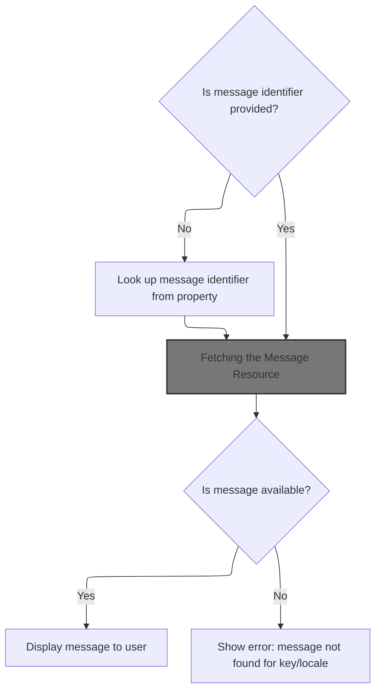
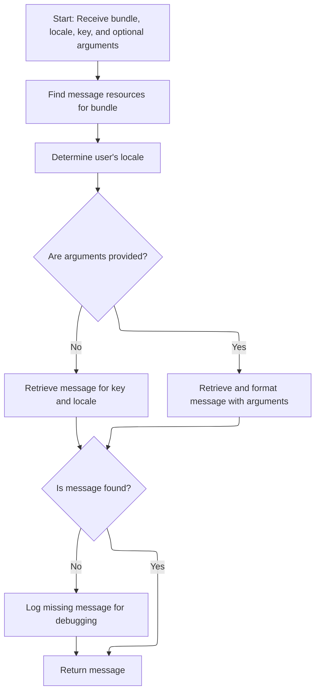
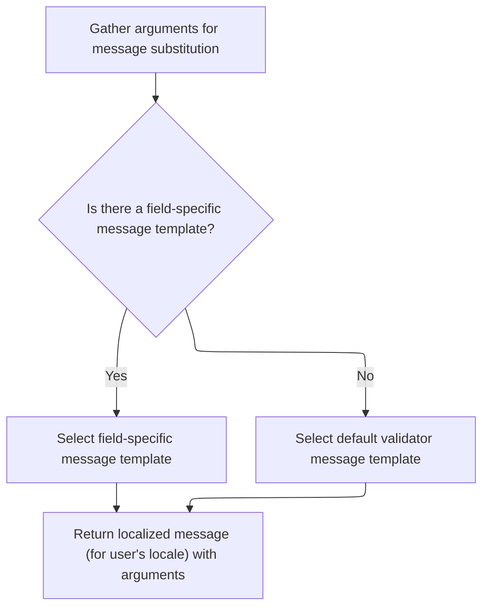

This document outlines the process for displaying a localized and formatted message to the user. The flow determines the message key and arguments, retrieves the appropriate message resource, formats the message, and outputs it for display. This supports dynamic and internationalized messaging in the user interface.

# Resolving the Message Key and Arguments



<SwmSnippet path="/taglib/src/main/java/org/apache/struts/taglib/bean/MessageTag.java" line="201">

---

In <SwmToken path="taglib/src/main/java/org/apache/struts/taglib/bean/MessageTag.java" pos="201:5:5" line-data="    public int doStartTag() throws JspException {">`doStartTag`</SwmToken>, we start by checking if a key is provided. If not, we fetch it from the page context using TagUtils.lookup. Once we have the key, we build the arguments array and call TagUtils.message to fetch the actual message string. Calling <SwmToken path="taglib/src/main/java/org/apache/struts/taglib/bean/MessageTag.java" pos="207:1:1" line-data="                TagUtils.getInstance().lookup(pageContext, name, property, scope);">`TagUtils`</SwmToken> here lets us resolve the message based on the current context and arguments.

```java
    public int doStartTag() throws JspException {
        String key = this.key;

        if (key == null) {
            // Look up the requested property value
            Object value =
                TagUtils.getInstance().lookup(pageContext, name, property, scope);

            if ((value != null) && !(value instanceof String)) {
                JspException e =
                    new JspException(messages.getMessage("message.property", key));

                TagUtils.getInstance().saveException(pageContext, e);
                throw e;
            }

            key = (String) value;
        }

        // Construct the optional arguments array we will be using
        Object[] args = new Object[] { arg0, arg1, arg2, arg3, arg4 };

        // Retrieve the message string we are looking for
        String message =
            TagUtils.getInstance().message(pageContext, this.bundle,
                this.localeKey, key, args);

```

---

</SwmSnippet>

## Fetching the Message Resource



<SwmSnippet path="/taglib/src/main/java/org/apache/struts/taglib/TagUtils.java" line="995">

---

In <SwmToken path="taglib/src/main/java/org/apache/struts/taglib/TagUtils.java" pos="995:5:5" line-data="    public String message(PageContext pageContext, String bundle,">`message`</SwmToken>, we grab the <SwmToken path="taglib/src/main/java/org/apache/struts/taglib/TagUtils.java" pos="998:1:1" line-data="        MessageResources resources =">`MessageResources`</SwmToken> for the given bundle and context. This is needed so we can look up the actual message string for the key and locale. The next step is to resolve the locale and fetch the message from the resources.

```java
    public String message(PageContext pageContext, String bundle,
        String locale, String key, Object[] args)
        throws JspException {
        MessageResources resources =
            retrieveMessageResources(pageContext, bundle, false);

```

---

</SwmSnippet>

<SwmSnippet path="/taglib/src/main/java/org/apache/struts/taglib/TagUtils.java" line="1118">

---

<SwmToken path="taglib/src/main/java/org/apache/struts/taglib/TagUtils.java" pos="1118:5:5" line-data="    public MessageResources retrieveMessageResources(PageContext pageContext,">`retrieveMessageResources`</SwmToken> looks for <SwmToken path="taglib/src/main/java/org/apache/struts/taglib/TagUtils.java" pos="1118:3:3" line-data="    public MessageResources retrieveMessageResources(PageContext pageContext,">`MessageResources`</SwmToken> in page, request, and application scopes, using a module prefix if needed. If nothing is found, it throws an exception. This lets the app support modular and override-able message bundles.

```java
    public MessageResources retrieveMessageResources(PageContext pageContext,
        String bundle, boolean checkPageScope)
        throws JspException {
        MessageResources resources = null;

        if (bundle == null) {
            bundle = Globals.MESSAGES_KEY;
        }

        if (checkPageScope) {
            resources =
                (MessageResources) pageContext.getAttribute(bundle,
                    PageContext.PAGE_SCOPE);
        }

        if (resources == null) {
            resources =
                (MessageResources) pageContext.getAttribute(bundle,
                    PageContext.REQUEST_SCOPE);
        }

        if (resources == null) {
            ModuleConfig moduleConfig = getModuleConfig(pageContext);

            resources =
                (MessageResources) pageContext.getAttribute(bundle
                    + moduleConfig.getPrefix(), PageContext.APPLICATION_SCOPE);
        }

        if (resources == null) {
            resources =
                (MessageResources) pageContext.getAttribute(bundle,
                    PageContext.APPLICATION_SCOPE);
        }

        if (resources == null) {
            JspException e =
                new JspException(messages.getMessage("message.bundle", bundle));

            saveException(pageContext, e);
            throw e;
        }

        return resources;
    }
```

---

</SwmSnippet>

<SwmSnippet path="/taglib/src/main/java/org/apache/struts/taglib/TagUtils.java" line="1001">

---

Back in `TagUtils.message`, we use the locale and arguments to fetch the message from <SwmToken path="taglib/src/main/java/org/apache/struts/taglib/TagUtils.java" pos="998:1:1" line-data="        MessageResources resources =">`MessageResources`</SwmToken>. If arguments are present, we call the version that supports them. If the message isn't found, we log it for debugging. Next, we call Resources.getMessage to handle validator-specific message formatting.

```java
        Locale userLocale = getUserLocale(pageContext, locale);
        String message = null;

        if (args == null) {
            message = resources.getMessage(userLocale, key);
        } else {
            message = resources.getMessage(userLocale, key, args);
        }

        if ((message == null) && log.isDebugEnabled()) {
            // log missing key to ease debugging
            log.debug(resources.getMessage("message.resources", key, bundle,
                    locale));
        }

        return message;
    }
```

---

</SwmSnippet>

## Formatting Validator Messages



<SwmSnippet path="/core/src/main/java/org/apache/struts/validator/Resources.java" line="265">

---

In <SwmToken path="core/src/main/java/org/apache/struts/validator/Resources.java" pos="265:7:7" line-data="    public static String getMessage(MessageResources messages, Locale locale,">`getMessage`</SwmToken>, we grab the arguments for the validator action and field using <SwmToken path="core/src/main/java/org/apache/struts/validator/Resources.java" pos="267:9:9" line-data="        String[] args = getArgs(va.getName(), messages, locale, field);">`getArgs`</SwmToken>. This lets us format the validator message with the right values before returning it.

```java
    public static String getMessage(MessageResources messages, Locale locale,
        ValidatorAction va, Field field) {
        String[] args = getArgs(va.getName(), messages, locale, field);
```

---

</SwmSnippet>

<SwmSnippet path="/core/src/main/java/org/apache/struts/validator/Resources.java" line="420">

---

<SwmToken path="core/src/main/java/org/apache/struts/validator/Resources.java" pos="420:9:9" line-data="    public static String[] getArgs(String actionName,">`getArgs`</SwmToken> grabs up to four arguments for the validator action from the field. If an argument is a resource, it resolves it to a localized message; otherwise, it just uses the key. This keeps argument handling consistent for validator messages.

```java
    public static String[] getArgs(String actionName,
        MessageResources messages, Locale locale, Field field) {
        String[] argMessages = new String[4];

        Arg[] args =
            new Arg[] {
                field.getArg(actionName, 0), field.getArg(actionName, 1),
                field.getArg(actionName, 2), field.getArg(actionName, 3)
            };

        for (int i = 0; i < args.length; i++) {
            if (args[i] == null) {
                continue;
            }

            if (args[i].isResource()) {
                argMessages[i] = getMessage(messages, locale, args[i].getKey());
            } else {
                argMessages[i] = args[i].getKey();
            }
        }
```

---

</SwmSnippet>

<SwmSnippet path="/core/src/main/java/org/apache/struts/validator/Resources.java" line="268">

---

After <SwmToken path="core/src/main/java/org/apache/struts/validator/Resources.java" pos="267:9:9" line-data="        String[] args = getArgs(va.getName(), messages, locale, field);">`getArgs`</SwmToken> in Resources, we pick the message template from the field or action, then format it with the resolved arguments. This gives us the final validator message.

```java
        String msg =
            (field.getMsg(va.getName()) != null) ? field.getMsg(va.getName())
                                                 : va.getMsg();

        return messages.getMessage(locale, msg, args);
    }
```

---

</SwmSnippet>

## Writing the Message Output

<SwmSnippet path="/taglib/src/main/java/org/apache/struts/taglib/bean/MessageTag.java" line="228">

---

Back in `MessageTag.doStartTag`, if the message is missing, we throw an exception with info about the key, bundle, and locale. Otherwise, we write the resolved message to the page output and finish the tag processing.

```java
        if (message == null) {
            Locale locale =
                TagUtils.getInstance().getUserLocale(pageContext, this.localeKey);
            String localeVal =
                (locale == null) ? "default locale" : locale.toString();
            JspException e =
                new JspException(messages.getMessage("message.message",
                        "\"" + key + "\"",
                        "\"" + ((bundle == null) ? "(default bundle)" : bundle)
                        + "\"", localeVal));

            TagUtils.getInstance().saveException(pageContext, e);
            throw e;
        }

        TagUtils.getInstance().write(pageContext, message);

        return (SKIP_BODY);
    }
```

---

</SwmSnippet>

&nbsp;

*This is an auto-generated document by Swimm 🌊 and has not yet been verified by a human*

<SwmMeta version="3.0.0" repo-id="Z2l0aHViJTNBJTNBc3RydXRzMSUzQSUzQVN3aW1tLURlbW8=" repo-name="struts1"><sup>Powered by [Swimm](https://app.swimm.io/)</sup></SwmMeta>
