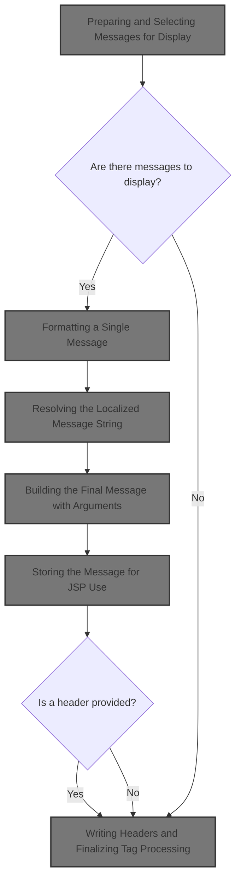
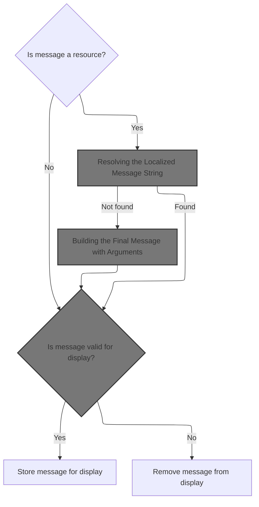
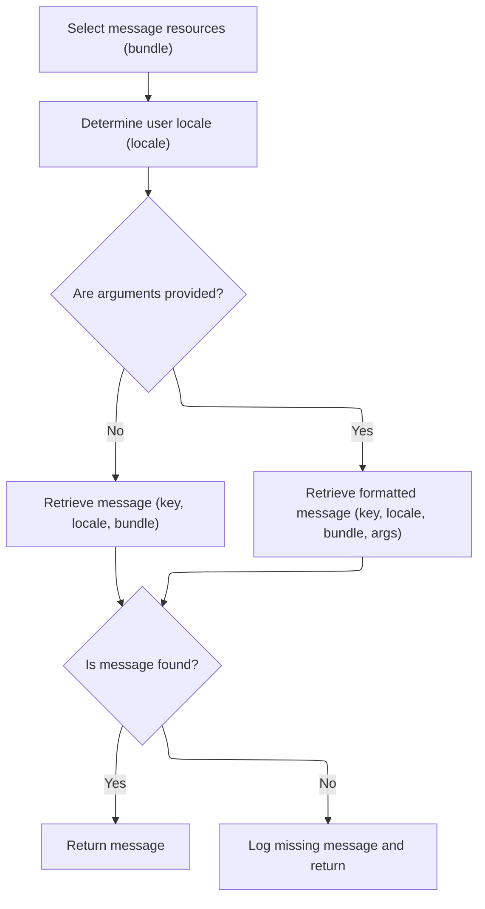
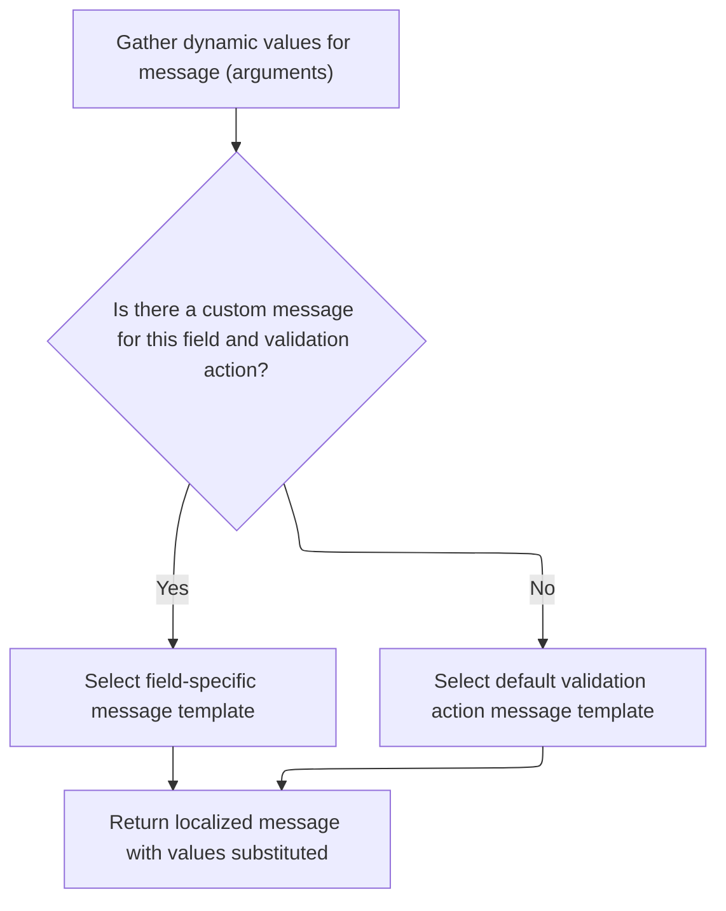
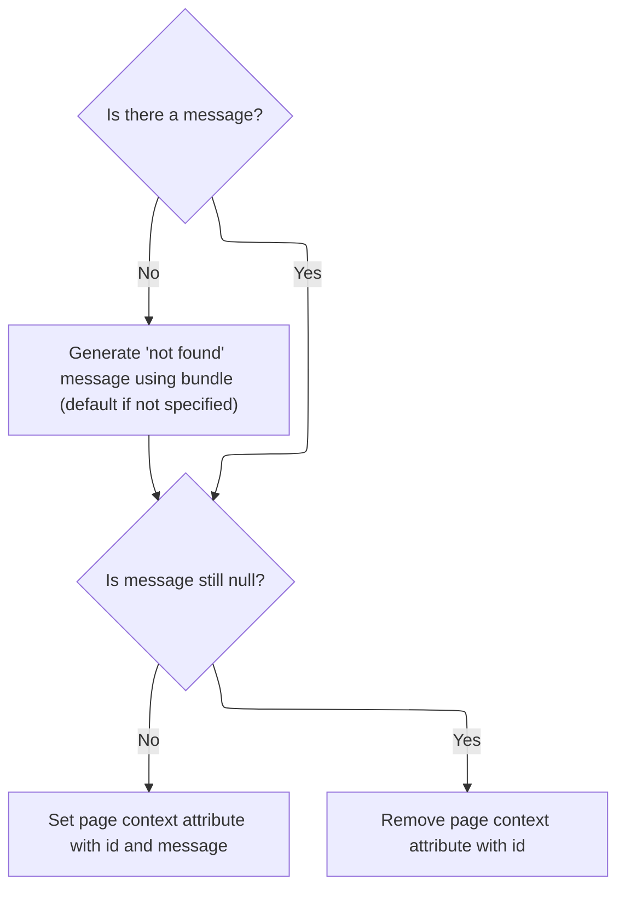
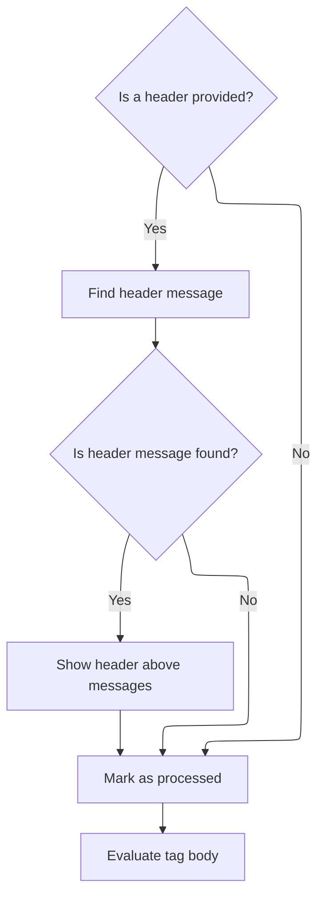

This document explains the flow for displaying messages to users in a JSP page. Messages and optional header information are provided as input. The flow selects, formats, and localizes the messages, then prepares them for display in the JSP. This allows the page to provide dynamic and localized feedback to users, with the option to show a header above the messages.



# Preparing and Selecting Messages for Display

<SwmSnippet path="/taglib/src/main/java/org/apache/struts/taglib/html/MessagesTag.java" line="204">

---

In <SwmToken path="taglib/src/main/java/org/apache/struts/taglib/html/MessagesTag.java" pos="204:5:5" line-data="    public int doStartTag() throws JspException {">`doStartTag`</SwmToken>, we figure out which messages to show by checking the 'message' attribute (which can force global messages), grabbing messages with <SwmToken path="taglib/src/main/java/org/apache/struts/taglib/html/MessagesTag.java" pos="220:1:1" line-data="                TagUtils.getInstance().getActionMessages(pageContext, name);">`TagUtils`</SwmToken>, and setting up the iterator for all or a subset of messages depending on 'property'. If 'count' is set, we expose the message count to the JSP. If there are no messages, we skip the body. Otherwise, we immediately call <SwmToken path="taglib/src/main/java/org/apache/struts/taglib/html/MessagesTag.java" pos="247:1:1" line-data="        processMessage((ActionMessage) iterator.next());">`processMessage`</SwmToken> to prep the first message for display before the tag body is evaluated.

```java
    public int doStartTag() throws JspException {
        // Initialize for a new request.
        processed = false;

        // Were any messages specified?
        ActionMessages messages = null;

        // Make a local copy of the name attribute that we can modify.
        String name = this.name;

        if ((message != null) && "true".equalsIgnoreCase(message)) {
            name = Globals.MESSAGE_KEY;
        }

        try {
            messages =
                TagUtils.getInstance().getActionMessages(pageContext, name);
        } catch (JspException e) {
            TagUtils.getInstance().saveException(pageContext, e);
            throw e;
        }

        // Acquire the collection we are going to iterate over
        int size;
        if (property == null) {
        	this.iterator = messages.get();
        	size = messages.size();
        } else {
        	this.iterator = messages.get(property);
        	size = messages.size(property);
        }
        
        // Expose the count when specified
        if (count != null) {
        	pageContext.setAttribute(count, new Integer(size));
        }
        
        // Store the first value and evaluate, or skip the body if none
        if (!this.iterator.hasNext()) {
            return SKIP_BODY;
        }

        // process the first message
        processMessage((ActionMessage) iterator.next());

```

---

</SwmSnippet>

## Formatting a Single Message



<SwmSnippet path="/taglib/src/main/java/org/apache/struts/taglib/html/MessagesTag.java" line="293">

---

In <SwmToken path="taglib/src/main/java/org/apache/struts/taglib/html/MessagesTag.java" pos="293:5:5" line-data="    private void processMessage(ActionMessage report)">`processMessage`</SwmToken>, we check if the message is a resource (i.e., needs to be looked up in a bundle). If so, we prep the arguments (filtering if needed) and call TagUtils.message to resolve the localized string. This is where the actual message formatting and localization happens.

```java
    private void processMessage(ActionMessage report)
        throws JspException {
        String msg = null;

        if (report.isResource()) {
            Object[] values = report.getValues();
            if (filterArgs) {
                values = filterMessageReplacementValues(values);
            }
            
            msg = TagUtils.getInstance().message(pageContext, bundle, locale,
                    report.getKey(), values);

```

---

</SwmSnippet>

### Resolving the Localized Message String



<SwmSnippet path="/taglib/src/main/java/org/apache/struts/taglib/TagUtils.java" line="995">

---

In <SwmToken path="taglib/src/main/java/org/apache/struts/taglib/TagUtils.java" pos="995:5:5" line-data="    public String message(PageContext pageContext, String bundle,">`message`</SwmToken>, we grab the <SwmToken path="taglib/src/main/java/org/apache/struts/taglib/TagUtils.java" pos="998:1:1" line-data="        MessageResources resources =">`MessageResources`</SwmToken> instance (using <SwmToken path="taglib/src/main/java/org/apache/struts/taglib/TagUtils.java" pos="999:1:1" line-data="            retrieveMessageResources(pageContext, bundle, false);">`retrieveMessageResources`</SwmToken>) for the right bundle and scope. This is needed to actually look up the message string for the given key and locale.

```java
    public String message(PageContext pageContext, String bundle,
        String locale, String key, Object[] args)
        throws JspException {
        MessageResources resources =
            retrieveMessageResources(pageContext, bundle, false);

```

---

</SwmSnippet>

<SwmSnippet path="/taglib/src/main/java/org/apache/struts/taglib/TagUtils.java" line="1118">

---

<SwmToken path="taglib/src/main/java/org/apache/struts/taglib/TagUtils.java" pos="1118:5:5" line-data="    public MessageResources retrieveMessageResources(PageContext pageContext,">`retrieveMessageResources`</SwmToken> looks for the <SwmToken path="taglib/src/main/java/org/apache/struts/taglib/TagUtils.java" pos="1118:3:3" line-data="    public MessageResources retrieveMessageResources(PageContext pageContext,">`MessageResources`</SwmToken> object in page, request, and application scopes (with and without module prefix), defaulting to <SwmToken path="taglib/src/main/java/org/apache/struts/taglib/TagUtils.java" pos="1124:5:7" line-data="            bundle = Globals.MESSAGES_KEY;">`Globals.MESSAGES_KEY`</SwmToken> if bundle is null. If nothing is found, it throws. This lets the tag support overrides and modular resource bundles.

```java
    public MessageResources retrieveMessageResources(PageContext pageContext,
        String bundle, boolean checkPageScope)
        throws JspException {
        MessageResources resources = null;

        if (bundle == null) {
            bundle = Globals.MESSAGES_KEY;
        }

        if (checkPageScope) {
            resources =
                (MessageResources) pageContext.getAttribute(bundle,
                    PageContext.PAGE_SCOPE);
        }

        if (resources == null) {
            resources =
                (MessageResources) pageContext.getAttribute(bundle,
                    PageContext.REQUEST_SCOPE);
        }

        if (resources == null) {
            ModuleConfig moduleConfig = getModuleConfig(pageContext);

            resources =
                (MessageResources) pageContext.getAttribute(bundle
                    + moduleConfig.getPrefix(), PageContext.APPLICATION_SCOPE);
        }

        if (resources == null) {
            resources =
                (MessageResources) pageContext.getAttribute(bundle,
                    PageContext.APPLICATION_SCOPE);
        }

        if (resources == null) {
            JspException e =
                new JspException(messages.getMessage("message.bundle", bundle));

            saveException(pageContext, e);
            throw e;
        }

        return resources;
    }
```

---

</SwmSnippet>

<SwmSnippet path="/taglib/src/main/java/org/apache/struts/taglib/TagUtils.java" line="1001">

---

Back in `TagUtils.message`, after getting the resources, we resolve the user's locale and fetch the message string (with or without arguments). If the message isn't found, we log it for debugging. Next, we call into Resources to handle more advanced message formatting and argument resolution.

```java
        Locale userLocale = getUserLocale(pageContext, locale);
        String message = null;

        if (args == null) {
            message = resources.getMessage(userLocale, key);
        } else {
            message = resources.getMessage(userLocale, key, args);
        }

        if ((message == null) && log.isDebugEnabled()) {
            // log missing key to ease debugging
            log.debug(resources.getMessage("message.resources", key, bundle,
                    locale));
        }

        return message;
    }
```

---

</SwmSnippet>

### Building the Final Message with Arguments



<SwmSnippet path="/core/src/main/java/org/apache/struts/validator/Resources.java" line="265">

---

In <SwmToken path="core/src/main/java/org/apache/struts/validator/Resources.java" pos="265:7:7" line-data="    public static String getMessage(MessageResources messages, Locale locale,">`getMessage`</SwmToken> (Resources), we pull out up to four arguments for the message using <SwmToken path="core/src/main/java/org/apache/struts/validator/Resources.java" pos="267:9:9" line-data="        String[] args = getArgs(va.getName(), messages, locale, field);">`getArgs`</SwmToken>. These arguments are used to fill in placeholders in the message template, so the message can be dynamic based on the field and action.

```java
    public static String getMessage(MessageResources messages, Locale locale,
        ValidatorAction va, Field field) {
        String[] args = getArgs(va.getName(), messages, locale, field);
```

---

</SwmSnippet>

<SwmSnippet path="/core/src/main/java/org/apache/struts/validator/Resources.java" line="420">

---

<SwmToken path="core/src/main/java/org/apache/struts/validator/Resources.java" pos="420:9:9" line-data="    public static String[] getArgs(String actionName,">`getArgs`</SwmToken> grabs up to four arguments from the field for the action, localizes them if needed, and returns an array of four strings. Anything beyond four is ignored, so the message can only use up to four placeholders.

```java
    public static String[] getArgs(String actionName,
        MessageResources messages, Locale locale, Field field) {
        String[] argMessages = new String[4];

        Arg[] args =
            new Arg[] {
                field.getArg(actionName, 0), field.getArg(actionName, 1),
                field.getArg(actionName, 2), field.getArg(actionName, 3)
            };

        for (int i = 0; i < args.length; i++) {
            if (args[i] == null) {
                continue;
            }

            if (args[i].isResource()) {
                argMessages[i] = getMessage(messages, locale, args[i].getKey());
            } else {
                argMessages[i] = args[i].getKey();
            }
        }
```

---

</SwmSnippet>

<SwmSnippet path="/core/src/main/java/org/apache/struts/validator/Resources.java" line="268">

---

After <SwmToken path="core/src/main/java/org/apache/struts/validator/Resources.java" pos="267:9:9" line-data="        String[] args = getArgs(va.getName(), messages, locale, field);">`getArgs`</SwmToken> returns, we pick the message template (field-specific if present, otherwise the default), and call <SwmToken path="core/src/main/java/org/apache/struts/validator/Resources.java" pos="272:3:5" line-data="        return messages.getMessage(locale, msg, args);">`messages.getMessage`</SwmToken> with the template and arguments to build the final message string. This lets fields override the default message if needed.

```java
        String msg =
            (field.getMsg(va.getName()) != null) ? field.getMsg(va.getName())
                                                 : va.getMsg();

        return messages.getMessage(locale, msg, args);
    }
```

---

</SwmSnippet>

### Storing the Message for JSP Use



<SwmSnippet path="/taglib/src/main/java/org/apache/struts/taglib/html/MessagesTag.java" line="306">

---

After coming back from `TagUtils.message`, if the message couldn't be resolved, we remove the attribute from the page context; otherwise, we store the resolved message under the given id. This controls what the JSP can access for rendering.

```java
            if (msg == null) {
                String bundleName = (bundle == null) ? "default" : bundle;

                msg = messageResources.getMessage("messagesTag.notfound",
                        report.getKey(), bundleName);
            }
        } else {
            msg = report.getKey();
        }

        if (msg == null) {
            pageContext.removeAttribute(id);
        } else {
            pageContext.setAttribute(id, msg);
        }
    }
```

---

</SwmSnippet>

## Writing Headers and Finalizing Tag Processing



<SwmSnippet path="/taglib/src/main/java/org/apache/struts/taglib/html/MessagesTag.java" line="249">

---

After returning from <SwmToken path="taglib/src/main/java/org/apache/struts/taglib/html/MessagesTag.java" pos="247:1:1" line-data="        processMessage((ActionMessage) iterator.next());">`processMessage`</SwmToken>, if a header is set, we resolve and write it before the messages. We then mark processing as done and return <SwmToken path="taglib/src/main/java/org/apache/struts/taglib/html/MessagesTag.java" pos="263:4:4" line-data="        return (EVAL_BODY_TAG);">`EVAL_BODY_TAG`</SwmToken> so the JSP can render the tag body with the prepared message data.

```java
        if ((header != null) && (header.length() > 0)) {
            String headerMessage =
                TagUtils.getInstance().message(pageContext, bundle, locale,
                    header);

            if (headerMessage != null) {
                TagUtils.getInstance().write(pageContext, headerMessage);
            }
        }

        // Set the processed variable to true so the
        // doEndTag() knows processing took place
        processed = true;

        return (EVAL_BODY_TAG);
    }
```

---

</SwmSnippet>

&nbsp;

*This is an auto-generated document by Swimm 🌊 and has not yet been verified by a human*

<SwmMeta version="3.0.0" repo-id="Z2l0aHViJTNBJTNBc3RydXRzMSUzQSUzQVN3aW1tLURlbW8=" repo-name="struts1"><sup>Powered by [Swimm](https://app.swimm.io/)</sup></SwmMeta>
