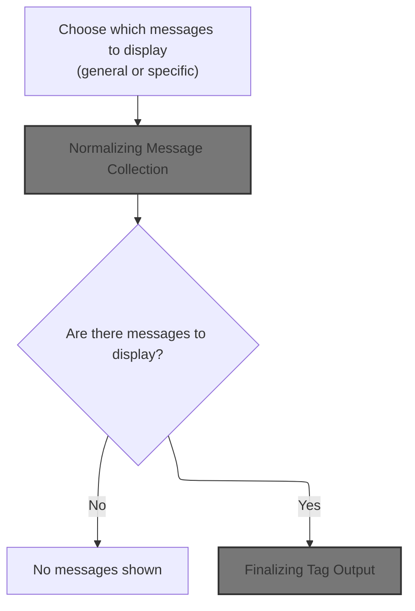
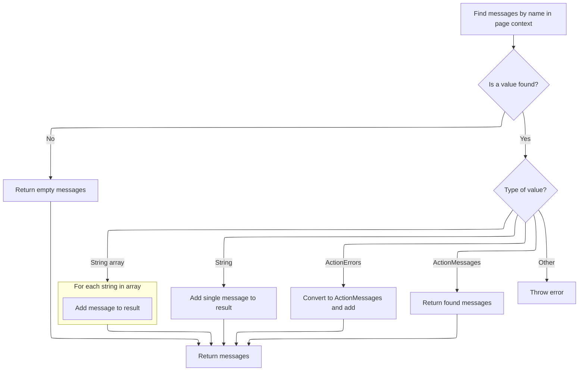
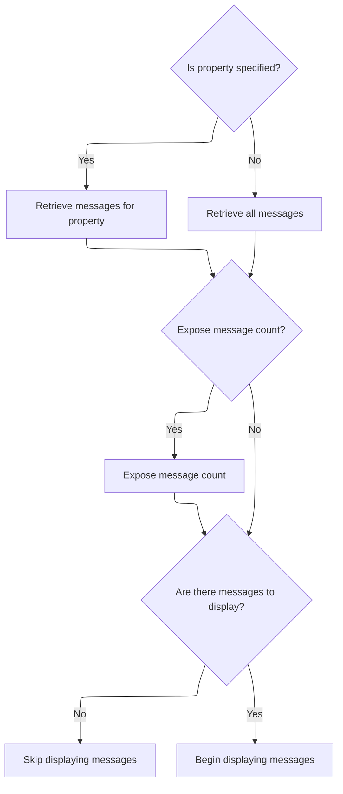
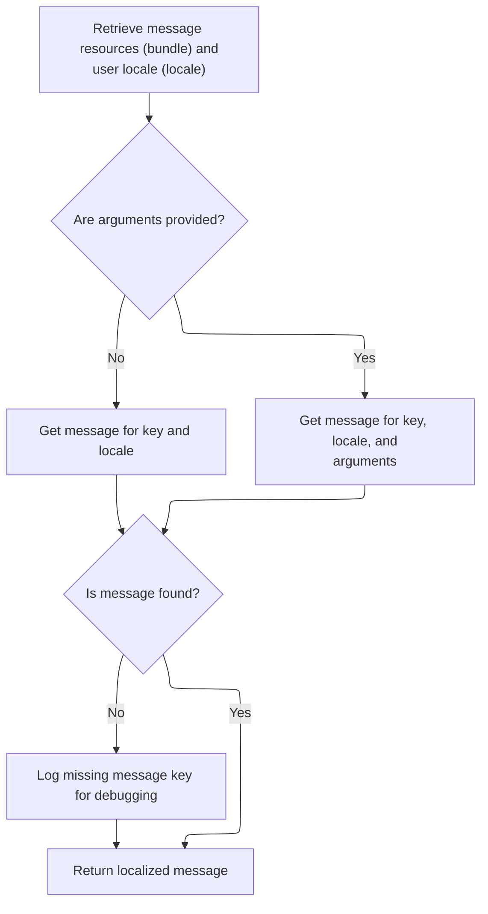
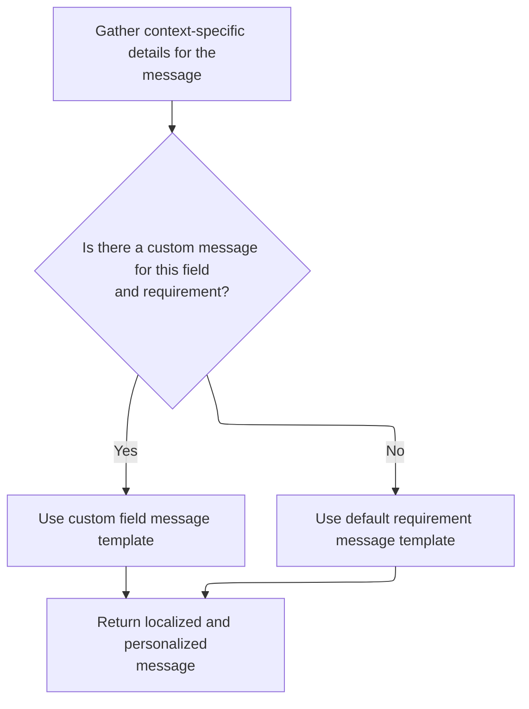
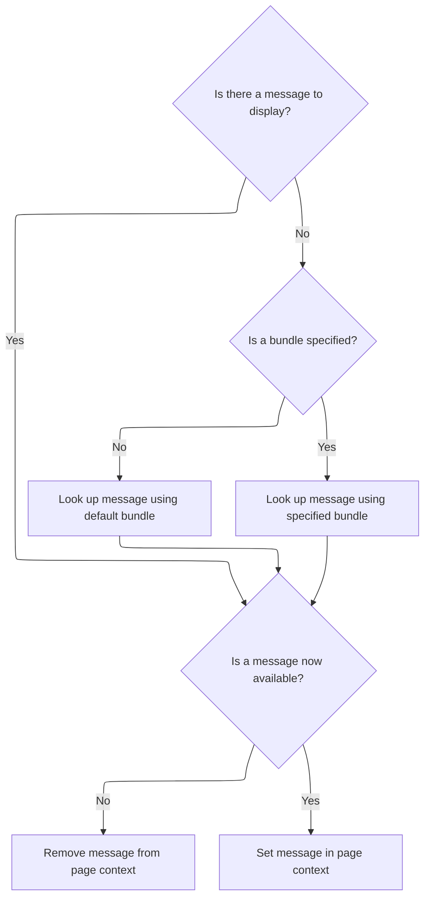
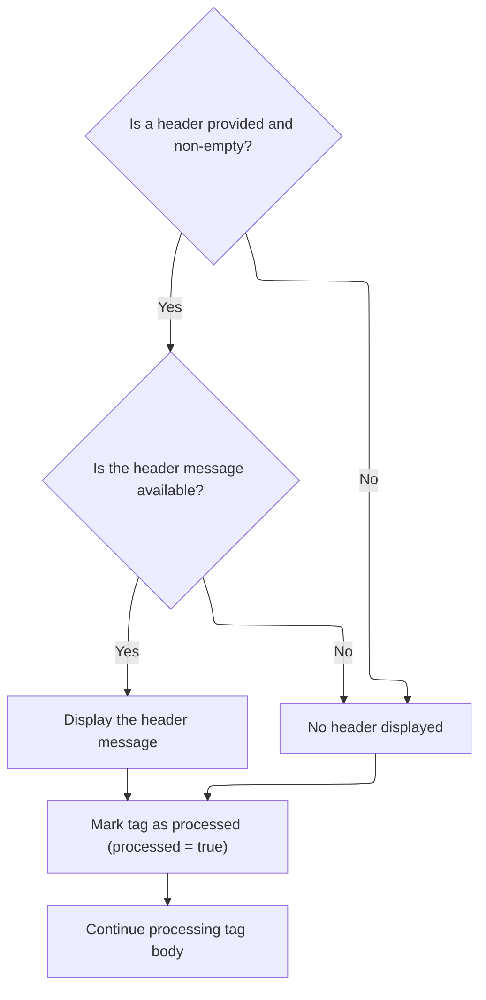

This document describes how user-facing messages, such as errors or notifications, are processed and displayed in the user interface. The flow covers selecting, normalizing, and formatting messages, applying localization, and making them available for display. It supports both global and property-specific messages, message counts, and customizable headers.

# Starting Message Tag Processing



<SwmSnippet path="/taglib/src/main/java/org/apache/struts/taglib/html/MessagesTag.java" line="204">

---

In <SwmToken path="taglib/src/main/java/org/apache/struts/taglib/html/MessagesTag.java" pos="204:5:5" line-data="    public int doStartTag() throws JspException {">`doStartTag`</SwmToken>, we're figuring out which set of messages to work with by checking the 'name' and 'message' attributes. If 'message' is set, we force the use of the global message key. Then we call `TagUtils.getActionMessages` to actually fetch the messages from the page context, since messages could be stored in different formats or scopes. If something goes wrong, we save the exception and rethrow it. This sets up the rest of the tag processing.

```java
    public int doStartTag() throws JspException {
        // Initialize for a new request.
        processed = false;

        // Were any messages specified?
        ActionMessages messages = null;

        // Make a local copy of the name attribute that we can modify.
        String name = this.name;

        if ((message != null) && "true".equalsIgnoreCase(message)) {
            name = Globals.MESSAGE_KEY;
        }

        try {
            messages =
                TagUtils.getInstance().getActionMessages(pageContext, name);
        } catch (JspException e) {
            TagUtils.getInstance().saveException(pageContext, e);
            throw e;
        }

```

---

</SwmSnippet>

## Normalizing Message Collection



<SwmSnippet path="/taglib/src/main/java/org/apache/struts/taglib/TagUtils.java" line="727">

---

In <SwmToken path="taglib/src/main/java/org/apache/struts/taglib/TagUtils.java" pos="727:5:5" line-data="    public ActionMessages getActionMessages(PageContext pageContext,">`getActionMessages`</SwmToken>, we're grabbing whatever is in the page context under the given name and converting it into an <SwmToken path="taglib/src/main/java/org/apache/struts/taglib/TagUtils.java" pos="727:3:3" line-data="    public ActionMessages getActionMessages(PageContext pageContext,">`ActionMessages`</SwmToken> object. We handle strings, arrays, <SwmToken path="taglib/src/main/java/org/apache/struts/taglib/TagUtils.java" pos="745:12:12" line-data="                } else if (value instanceof ActionErrors) {">`ActionErrors`</SwmToken>, and <SwmToken path="taglib/src/main/java/org/apache/struts/taglib/TagUtils.java" pos="727:3:3" line-data="    public ActionMessages getActionMessages(PageContext pageContext,">`ActionMessages`</SwmToken>, so no matter how the messages were put there, we can work with them in a consistent way for the rest of the tag processing.

```java
    public ActionMessages getActionMessages(PageContext pageContext,
        String paramName) throws JspException {
        ActionMessages am = new ActionMessages();

        Object value = pageContext.findAttribute(paramName);

        if (value != null) {
            try {
                if (value instanceof String) {
                    am.add(ActionMessages.GLOBAL_MESSAGE,
                        new ActionMessage((String) value));
                } else if (value instanceof String[]) {
                    String[] keys = (String[]) value;

                    for (int i = 0; i < keys.length; i++) {
                        am.add(ActionMessages.GLOBAL_MESSAGE,
                            new ActionMessage(keys[i]));
                    }
```

---

</SwmSnippet>

<SwmSnippet path="/taglib/src/main/java/org/apache/struts/taglib/TagUtils.java" line="745">

---

After type-checking and converting, we return an <SwmToken path="taglib/src/main/java/org/apache/struts/taglib/TagUtils.java" pos="746:1:1" line-data="                    ActionMessages m = (ActionMessages) value;">`ActionMessages`</SwmToken> object that wraps whatever was in the page context. If nothing was found, it's just empty. This keeps the rest of the flow simple since we always have a consistent object to work with.

```java
                } else if (value instanceof ActionErrors) {
                    ActionMessages m = (ActionMessages) value;

                    am.add(m);
                } else if (value instanceof ActionMessages) {
                    am = (ActionMessages) value;
                } else {
                    throw new JspException(messages.getMessage(
                            "actionMessages.errors", value.getClass().getName()));
                }
            } catch (JspException e) {
                throw e;
            } catch (Exception e) {
                log.warn("Unable to retieve ActionMessage for paramName : "
                    + paramName, e);
            }
        }

        return am;
    }
```

---

</SwmSnippet>

## Selecting and Counting Messages



<SwmSnippet path="/taglib/src/main/java/org/apache/struts/taglib/html/MessagesTag.java" line="226">

---

Back in `MessagesTag.doStartTag`, after getting the messages, we pick either all messages or just those for a specific property. We also set the count in the page context if needed. If there are no messages, we skip the tag body. Otherwise, we call <SwmToken path="taglib/src/main/java/org/apache/struts/taglib/html/MessagesTag.java" pos="247:1:1" line-data="        processMessage((ActionMessage) iterator.next());">`processMessage`</SwmToken> to handle the first message, which sets up the tag for rendering.

```java
        // Acquire the collection we are going to iterate over
        int size;
        if (property == null) {
        	this.iterator = messages.get();
        	size = messages.size();
        } else {
        	this.iterator = messages.get(property);
        	size = messages.size(property);
        }
        
        // Expose the count when specified
        if (count != null) {
        	pageContext.setAttribute(count, new Integer(size));
        }
        
        // Store the first value and evaluate, or skip the body if none
        if (!this.iterator.hasNext()) {
            return SKIP_BODY;
        }

        // process the first message
        processMessage((ActionMessage) iterator.next());

```

---

</SwmSnippet>

## Formatting a Single Message

<SwmSnippet path="/taglib/src/main/java/org/apache/struts/taglib/html/MessagesTag.java" line="293">

---

In <SwmToken path="taglib/src/main/java/org/apache/struts/taglib/html/MessagesTag.java" pos="293:5:5" line-data="    private void processMessage(ActionMessage report)">`processMessage`</SwmToken>, we check if the <SwmToken path="taglib/src/main/java/org/apache/struts/taglib/html/MessagesTag.java" pos="293:7:7" line-data="    private void processMessage(ActionMessage report)">`ActionMessage`</SwmToken> needs to be looked up from a resource bundle. If so, we optionally filter the arguments and then call `TagUtils.message` to get the localized string. This is where message formatting and localization happen.

```java
    private void processMessage(ActionMessage report)
        throws JspException {
        String msg = null;

        if (report.isResource()) {
            Object[] values = report.getValues();
            if (filterArgs) {
                values = filterMessageReplacementValues(values);
            }
            
            msg = TagUtils.getInstance().message(pageContext, bundle, locale,
                    report.getKey(), values);

```

---

</SwmSnippet>

### Looking Up Localized Message Text



<SwmSnippet path="/taglib/src/main/java/org/apache/struts/taglib/TagUtils.java" line="995">

---

<SwmToken path="taglib/src/main/java/org/apache/struts/taglib/TagUtils.java" pos="995:5:5" line-data="    public String message(PageContext pageContext, String bundle,">`message`</SwmToken> grabs the right <SwmToken path="taglib/src/main/java/org/apache/struts/taglib/TagUtils.java" pos="998:1:1" line-data="        MessageResources resources =">`MessageResources`</SwmToken> for the bundle and locale, then fetches the message string by key, with or without arguments. If the message isn't found, it logs a debug message. If arguments are present, they're passed along for formatting. For some cases, argument resolution is delegated to `Resources.getMessage` for more advanced formatting.

```java
    public String message(PageContext pageContext, String bundle,
        String locale, String key, Object[] args)
        throws JspException {
        MessageResources resources =
            retrieveMessageResources(pageContext, bundle, false);

        Locale userLocale = getUserLocale(pageContext, locale);
        String message = null;

        if (args == null) {
            message = resources.getMessage(userLocale, key);
        } else {
            message = resources.getMessage(userLocale, key, args);
        }

        if ((message == null) && log.isDebugEnabled()) {
            // log missing key to ease debugging
            log.debug(resources.getMessage("message.resources", key, bundle,
                    locale));
        }

        return message;
    }
```

---

</SwmSnippet>

### Resolving Message Arguments



<SwmSnippet path="/core/src/main/java/org/apache/struts/validator/Resources.java" line="265">

---

In <SwmToken path="core/src/main/java/org/apache/struts/validator/Resources.java" pos="267:9:9" line-data="        String[] args = getArgs(va.getName(), messages, locale, field);">`getArgs`</SwmToken>, we pull up to 4 arguments from the Field for the given action. For each argument, if it's a resource, we resolve it to a localized string; otherwise, we just use the key. This prepares the argument list for message formatting.

```java
    public static String getMessage(MessageResources messages, Locale locale,
        ValidatorAction va, Field field) {
        String[] args = getArgs(va.getName(), messages, locale, field);
```

---

</SwmSnippet>

<SwmSnippet path="/core/src/main/java/org/apache/struts/validator/Resources.java" line="420">

---

<SwmToken path="core/src/main/java/org/apache/struts/validator/Resources.java" pos="420:9:9" line-data="    public static String[] getArgs(String actionName,">`getArgs`</SwmToken> always tries to fetch 4 arguments for the action from the Field. For each, if it's a resource, we resolve it to a localized string; otherwise, we just use the key. This is baked into how Struts validation messages are structured.

```java
    public static String[] getArgs(String actionName,
        MessageResources messages, Locale locale, Field field) {
        String[] argMessages = new String[4];

        Arg[] args =
            new Arg[] {
                field.getArg(actionName, 0), field.getArg(actionName, 1),
                field.getArg(actionName, 2), field.getArg(actionName, 3)
            };

        for (int i = 0; i < args.length; i++) {
            if (args[i] == null) {
                continue;
            }

            if (args[i].isResource()) {
                argMessages[i] = getMessage(messages, locale, args[i].getKey());
            } else {
                argMessages[i] = args[i].getKey();
            }
        }
```

---

</SwmSnippet>

<SwmSnippet path="/core/src/main/java/org/apache/struts/validator/Resources.java" line="268">

---

After getting the arguments from <SwmToken path="core/src/main/java/org/apache/struts/validator/Resources.java" pos="267:9:9" line-data="        String[] args = getArgs(va.getName(), messages, locale, field);">`getArgs`</SwmToken>, we pick the message key from the Field if it exists, otherwise from the <SwmToken path="core/src/main/java/org/apache/struts/validator/Resources.java" pos="266:1:1" line-data="        ValidatorAction va, Field field) {">`ValidatorAction`</SwmToken>. Then we call <SwmToken path="core/src/main/java/org/apache/struts/validator/Resources.java" pos="272:3:5" line-data="        return messages.getMessage(locale, msg, args);">`messages.getMessage`</SwmToken> with the locale, key, and arguments to get the final formatted string.

```java
        String msg =
            (field.getMsg(va.getName()) != null) ? field.getMsg(va.getName())
                                                 : va.getMsg();

        return messages.getMessage(locale, msg, args);
    }
```

---

</SwmSnippet>

### Storing the Final Message



<SwmSnippet path="/taglib/src/main/java/org/apache/struts/taglib/html/MessagesTag.java" line="306">

---

After getting the message string from `TagUtils.message`, if it's still null, we remove the attribute from the page context. Otherwise, we set the resolved message under the given id, so the JSP can use it.

```java
            if (msg == null) {
                String bundleName = (bundle == null) ? "default" : bundle;

                msg = messageResources.getMessage("messagesTag.notfound",
                        report.getKey(), bundleName);
            }
        } else {
            msg = report.getKey();
        }

        if (msg == null) {
            pageContext.removeAttribute(id);
        } else {
            pageContext.setAttribute(id, msg);
        }
    }
```

---

</SwmSnippet>

## Finalizing Tag Output



<SwmSnippet path="/taglib/src/main/java/org/apache/struts/taglib/html/MessagesTag.java" line="249">

---

After `MessagesTag.processMessage`, if a header is set, we look it up and write it out. We mark processing as done and return <SwmToken path="taglib/src/main/java/org/apache/struts/taglib/html/MessagesTag.java" pos="263:4:4" line-data="        return (EVAL_BODY_TAG);">`EVAL_BODY_TAG`</SwmToken> so the JSP engine knows to evaluate the tag body. This wraps up the tag's setup and output.

```java
        if ((header != null) && (header.length() > 0)) {
            String headerMessage =
                TagUtils.getInstance().message(pageContext, bundle, locale,
                    header);

            if (headerMessage != null) {
                TagUtils.getInstance().write(pageContext, headerMessage);
            }
        }

        // Set the processed variable to true so the
        // doEndTag() knows processing took place
        processed = true;

        return (EVAL_BODY_TAG);
    }
```

---

</SwmSnippet>

&nbsp;

*This is an auto-generated document by Swimm 🌊 and has not yet been verified by a human*

<SwmMeta version="3.0.0" repo-id="Z2l0aHViJTNBJTNBc3RydXRzMSUzQSUzQVN3aW1tLURlbW8=" repo-name="struts1"><sup>Powered by [Swimm](https://app.swimm.io/)</sup></SwmMeta>
