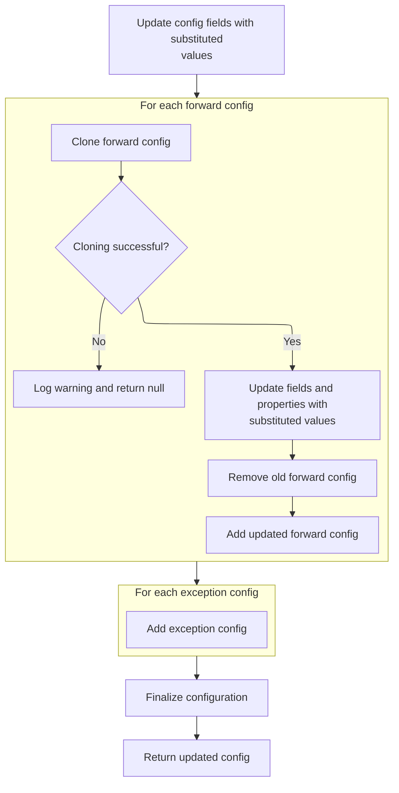

This document describes how a new action configuration is created by cloning an existing one and substituting dynamic values from a provided map. This enables flexible routing and behavior by ensuring all placeholders are resolved before the configuration is used.

# Cloning and Dynamic Property Substitution

<SwmSnippet path="/core/src/main/java/org/apache/struts/config/ActionConfigMatcher.java" line="157">

---

In <SwmToken path="core/src/main/java/org/apache/struts/config/ActionConfigMatcher.java" pos="157:5:5" line-data="    protected ActionConfig convertActionConfig(String path, ActionConfig orig,">`convertActionConfig`</SwmToken>, we clone the original <SwmToken path="core/src/main/java/org/apache/struts/config/ActionConfigMatcher.java" pos="157:3:3" line-data="    protected ActionConfig convertActionConfig(String path, ActionConfig orig,">`ActionConfig`</SwmToken> to avoid mutating the original object. Right after cloning, we start substituting variables into the config's properties using <SwmToken path="core/src/main/java/org/apache/struts/config/ActionConfigMatcher.java" pos="170:5:5" line-data="        config.setName(convertParam(orig.getName(), vars));">`convertParam`</SwmToken>, so the new config reflects any dynamic values from the provided map.

```java
    protected ActionConfig convertActionConfig(String path, ActionConfig orig,
        Map vars) {
        ActionConfig config = null;

        try {
            config = (ActionConfig) BeanUtils.cloneBean(orig);
        } catch (Exception ex) {
            log.warn("Unable to clone action config, recommend not using "
                + "wildcards", ex);

            return null;
        }

        config.setName(convertParam(orig.getName(), vars));
```

---

</SwmSnippet>

<SwmSnippet path="/core/src/main/java/org/apache/struts/config/ActionConfigMatcher.java" line="258">

---

<SwmToken path="core/src/main/java/org/apache/struts/config/ActionConfigMatcher.java" pos="258:5:5" line-data="    protected String convertParam(String val, Map vars) {">`convertParam`</SwmToken> does string substitution for placeholders like '{x}', using single-character keys from the vars map. It replaces all such placeholders with their mapped values, and throws if a value would cause an infinite loop by referencing its own placeholder.

```java
    protected String convertParam(String val, Map vars) {
        if (val == null) {
            return null;
        } else if (val.indexOf("{") == -1) {
            return val;
        }

        Map.Entry entry;
        StringBuffer key = new StringBuffer("{0}");
        StringBuffer ret = new StringBuffer(val);
        String keyStr;
        int x;

        for (Iterator i = vars.entrySet().iterator(); i.hasNext();) {
            entry = (Map.Entry) i.next();
            key.setCharAt(1, ((String) entry.getKey()).charAt(0));
            keyStr = key.toString();
            
            // STR-3169
            // Prevent an infinite loop by retaining the placeholders
            // that contain itself in the substitution value
            if (((String) entry.getValue()).contains(keyStr)) {
        	throw new IllegalStateException();
            }
            
            // Replace all instances of the placeholder
            while ((x = ret.toString().indexOf(keyStr)) > -1) {
                ret.replace(x, x + 3, (String) entry.getValue());
            }
        }
```

---

</SwmSnippet>

<SwmSnippet path="/core/src/main/java/org/apache/struts/config/ActionConfigMatcher.java" line="170">

---

Back in <SwmToken path="core/src/main/java/org/apache/struts/config/ActionConfigMatcher.java" pos="157:5:5" line-data="    protected ActionConfig convertActionConfig(String path, ActionConfig orig,">`convertActionConfig`</SwmToken>, after substituting variables in the name, we update the config's name property. This keeps the config in sync with the dynamic values.

```java
        config.setName(convertParam(orig.getName(), vars));

```

---

</SwmSnippet>

<SwmSnippet path="/core/src/main/java/org/apache/struts/config/ActionConfig.java" line="517">

---

<SwmToken path="core/src/main/java/org/apache/struts/config/ActionConfig.java" pos="517:5:5" line-data="    public void setName(String name) {">`setName`</SwmToken> updates the config's name, but only if the config isn't frozen. If it's frozen, it throws, so you can't change the name after finalization.

```java
    public void setName(String name) {
        if (configured) {
            throw new IllegalStateException("Configuration is frozen");
        }

        this.name = name;
    }
```

---

</SwmSnippet>

<SwmSnippet path="/core/src/main/java/org/apache/struts/config/ActionConfigMatcher.java" line="172">

---

Back in <SwmToken path="core/src/main/java/org/apache/struts/config/ActionConfigMatcher.java" pos="157:5:5" line-data="    protected ActionConfig convertActionConfig(String path, ActionConfig orig,">`convertActionConfig`</SwmToken>, after updating the name, we normalize the path to ensure it starts with '/'. Then we substitute variables into the type property using <SwmToken path="core/src/main/java/org/apache/struts/config/ActionConfigMatcher.java" pos="177:5:5" line-data="        config.setType(convertParam(orig.getType(), vars));">`convertParam`</SwmToken>.

```java
        if ((path.length() == 0) || (path.charAt(0) != '/')) {
            path = "/" + path;
        }

        config.setPath(path);
        config.setType(convertParam(orig.getType(), vars));
```

---

</SwmSnippet>

<SwmSnippet path="/core/src/main/java/org/apache/struts/config/ActionConfigMatcher.java" line="177">

---

Back in <SwmToken path="core/src/main/java/org/apache/struts/config/ActionConfigMatcher.java" pos="157:5:5" line-data="    protected ActionConfig convertActionConfig(String path, ActionConfig orig,">`convertActionConfig`</SwmToken>, after substituting variables in the type, we update the config's type property to match the new value.

```java
        config.setType(convertParam(orig.getType(), vars));
```

---

</SwmSnippet>

<SwmSnippet path="/core/src/main/java/org/apache/struts/config/ActionConfig.java" line="788">

---

<SwmToken path="core/src/main/java/org/apache/struts/config/ActionConfig.java" pos="788:5:5" line-data="    public void setType(String type) {">`setType`</SwmToken> updates the config's type, but only if the config isn't frozen. If it's frozen, it throws, so type can't be changed after finalization.

```java
    public void setType(String type) {
        if (configured) {
            throw new IllegalStateException("Configuration is frozen");
        }

        this.type = type;
    }
```

---

</SwmSnippet>

<SwmSnippet path="/core/src/main/java/org/apache/struts/config/ActionConfigMatcher.java" line="178">

---

Back in <SwmToken path="core/src/main/java/org/apache/struts/config/ActionConfigMatcher.java" pos="157:5:5" line-data="    protected ActionConfig convertActionConfig(String path, ActionConfig orig,">`convertActionConfig`</SwmToken>, after updating the type, we substitute variables into the roles property and update it on the config.

```java
        config.setRoles(convertParam(orig.getRoles(), vars));
```

---

</SwmSnippet>

<SwmSnippet path="/core/src/main/java/org/apache/struts/config/ActionConfigMatcher.java" line="178">

---

Back in <SwmToken path="core/src/main/java/org/apache/struts/config/ActionConfigMatcher.java" pos="157:5:5" line-data="    protected ActionConfig convertActionConfig(String path, ActionConfig orig,">`convertActionConfig`</SwmToken>, after substituting variables in roles, we update the config's roles property. This triggers parsing and storing the roles as an array.

```java
        config.setRoles(convertParam(orig.getRoles(), vars));
```

---

</SwmSnippet>

## Parsing and Storing Role Names

```mermaid
%%{init: {"flowchart": {"defaultRenderer": "elk"}} }%%
flowchart TD
    node1["Request to set allowed roles"] --> node2{"Is configuration frozen?"}
    click node1 openCode "core/src/main/java/org/apache/struts/config/ActionConfig.java:597:598"
    node2 -->|"Yes"| node3["Reject change: configuration is frozen"]
    click node2 openCode "core/src/main/java/org/apache/struts/config/ActionConfig.java:598:600"
    node2 -->|"No"| node4{"Are roles specified?"}
    click node3 openCode "core/src/main/java/org/apache/struts/config/ActionConfig.java:599:600"
    node4 -->|"No"| node5["Clear allowed roles"]
    click node4 openCode "core/src/main/java/org/apache/struts/config/ActionConfig.java:604:607"
    node4 -->|"Yes"| node6["Process roles string"]
    click node5 openCode "core/src/main/java/org/apache/struts/config/ActionConfig.java:605:607"
    
    subgraph loop1["While roles string contains a comma"]
        node6 --> node7["Extract and trim next role"]
        click node7 openCode "core/src/main/java/org/apache/struts/config/ActionConfig.java:612:621"
        node7 --> node6
    end
    node6 --> node8{"Is there a remaining role?"}
    click node6 openCode "core/src/main/java/org/apache/struts/config/ActionConfig.java:623:626"
    node8 -->|"Yes"| node9["Add last role"]
    click node8 openCode "core/src/main/java/org/apache/struts/config/ActionConfig.java:625:627"
    node8 -->|"No"| node10["Assign allowed roles list"]
    click node9 openCode "core/src/main/java/org/apache/struts/config/ActionConfig.java:626:627"
    node9 --> node10
    click node10 openCode "core/src/main/java/org/apache/struts/config/ActionConfig.java:629:630"

classDef HeadingStyle fill:#777777,stroke:#333,stroke-width:2px;

%% Swimm:
%% %%{init: {"flowchart": {"defaultRenderer": "elk"}} }%%
%% flowchart TD
%%     node1["Request to set allowed roles"] --> node2{"Is configuration frozen?"}
%%     click node1 openCode "<SwmPath>[core/…/config/ActionConfig.java](core/src/main/java/org/apache/struts/config/ActionConfig.java)</SwmPath>:597:598"
%%     node2 -->|"Yes"| node3["Reject change: configuration is frozen"]
%%     click node2 openCode "<SwmPath>[core/…/config/ActionConfig.java](core/src/main/java/org/apache/struts/config/ActionConfig.java)</SwmPath>:598:600"
%%     node2 -->|"No"| node4{"Are roles specified?"}
%%     click node3 openCode "<SwmPath>[core/…/config/ActionConfig.java](core/src/main/java/org/apache/struts/config/ActionConfig.java)</SwmPath>:599:600"
%%     node4 -->|"No"| node5["Clear allowed roles"]
%%     click node4 openCode "<SwmPath>[core/…/config/ActionConfig.java](core/src/main/java/org/apache/struts/config/ActionConfig.java)</SwmPath>:604:607"
%%     node4 -->|"Yes"| node6["Process roles string"]
%%     click node5 openCode "<SwmPath>[core/…/config/ActionConfig.java](core/src/main/java/org/apache/struts/config/ActionConfig.java)</SwmPath>:605:607"
%%     
%%     subgraph loop1["While roles string contains a comma"]
%%         node6 --> node7["Extract and trim next role"]
%%         click node7 openCode "<SwmPath>[core/…/config/ActionConfig.java](core/src/main/java/org/apache/struts/config/ActionConfig.java)</SwmPath>:612:621"
%%         node7 --> node6
%%     end
%%     node6 --> node8{"Is there a remaining role?"}
%%     click node6 openCode "<SwmPath>[core/…/config/ActionConfig.java](core/src/main/java/org/apache/struts/config/ActionConfig.java)</SwmPath>:623:626"
%%     node8 -->|"Yes"| node9["Add last role"]
%%     click node8 openCode "<SwmPath>[core/…/config/ActionConfig.java](core/src/main/java/org/apache/struts/config/ActionConfig.java)</SwmPath>:625:627"
%%     node8 -->|"No"| node10["Assign allowed roles list"]
%%     click node9 openCode "<SwmPath>[core/…/config/ActionConfig.java](core/src/main/java/org/apache/struts/config/ActionConfig.java)</SwmPath>:626:627"
%%     node9 --> node10
%%     click node10 openCode "<SwmPath>[core/…/config/ActionConfig.java](core/src/main/java/org/apache/struts/config/ActionConfig.java)</SwmPath>:629:630"
%% 
%% classDef HeadingStyle fill:#777777,stroke:#333,stroke-width:2px;
```



<SwmSnippet path="/core/src/main/java/org/apache/struts/config/ActionConfig.java" line="597">

---

In <SwmToken path="core/src/main/java/org/apache/struts/config/ActionConfig.java" pos="597:5:5" line-data="    public void setRoles(String roles) {">`setRoles`</SwmToken>, we update the roles string and immediately parse it into an array of trimmed role names. This makes role checks faster later.

```java
    public void setRoles(String roles) {
        if (configured) {
            throw new IllegalStateException("Configuration is frozen");
        }

        this.roles = roles;

        if (roles == null) {
            roleNames = new String[0];

            return;
        }

        ArrayList list = new ArrayList();

        while (true) {
            int comma = roles.indexOf(',');

            if (comma < 0) {
                break;
            }

            list.add(roles.substring(0, comma).trim());
            roles = roles.substring(comma + 1);
        }
```

---

</SwmSnippet>

<SwmSnippet path="/core/src/main/java/org/apache/struts/config/ActionConfig.java" line="623">

---

After parsing, <SwmToken path="core/src/main/java/org/apache/struts/config/ActionConfigMatcher.java" pos="178:3:3" line-data="        config.setRoles(convertParam(orig.getRoles(), vars));">`setRoles`</SwmToken> stores the trimmed role names in an array. If the roles string is empty or null, the array is empty too.

```java
        roles = roles.trim();

        if (roles.length() > 0) {
            list.add(roles);
        }

        roleNames = (String[]) list.toArray(new String[list.size()]);
    }
```

---

</SwmSnippet>

## Parameter and Attribute Substitution



<SwmSnippet path="/core/src/main/java/org/apache/struts/config/ActionConfigMatcher.java" line="179">

---

Back in <SwmToken path="core/src/main/java/org/apache/struts/config/ActionConfigMatcher.java" pos="157:5:5" line-data="    protected ActionConfig convertActionConfig(String path, ActionConfig orig,">`convertActionConfig`</SwmToken>, after updating roles, we substitute variables into the parameter property and update it on the config.

```java
        config.setParameter(convertParam(orig.getParameter(), vars));
```

---

</SwmSnippet>

<SwmSnippet path="/core/src/main/java/org/apache/struts/config/ActionConfigMatcher.java" line="179">

---

Back in <SwmToken path="core/src/main/java/org/apache/struts/config/ActionConfigMatcher.java" pos="157:5:5" line-data="    protected ActionConfig convertActionConfig(String path, ActionConfig orig,">`convertActionConfig`</SwmToken>, after substituting variables in parameter, we update the config's parameter property.

```java
        config.setParameter(convertParam(orig.getParameter(), vars));
```

---

</SwmSnippet>

<SwmSnippet path="/core/src/main/java/org/apache/struts/config/ActionConfig.java" line="541">

---

<SwmToken path="core/src/main/java/org/apache/struts/config/ActionConfig.java" pos="541:5:5" line-data="    public void setParameter(String parameter) {">`setParameter`</SwmToken> updates the config's parameter, but only if the config isn't frozen. If it's frozen, it throws, so parameter can't be changed after finalization.

```java
    public void setParameter(String parameter) {
        if (configured) {
            throw new IllegalStateException("Configuration is frozen");
        }

        this.parameter = parameter;
    }
```

---

</SwmSnippet>

<SwmSnippet path="/core/src/main/java/org/apache/struts/config/ActionConfigMatcher.java" line="180">

---

Back in <SwmToken path="core/src/main/java/org/apache/struts/config/ActionConfigMatcher.java" pos="157:5:5" line-data="    protected ActionConfig convertActionConfig(String path, ActionConfig orig,">`convertActionConfig`</SwmToken>, after updating parameter, we substitute variables into the attribute property and update it on the config.

```java
        config.setAttribute(convertParam(orig.getAttribute(), vars));
```

---

</SwmSnippet>

<SwmSnippet path="/core/src/main/java/org/apache/struts/config/ActionConfigMatcher.java" line="180">

---

Back in <SwmToken path="core/src/main/java/org/apache/struts/config/ActionConfigMatcher.java" pos="157:5:5" line-data="    protected ActionConfig convertActionConfig(String path, ActionConfig orig,">`convertActionConfig`</SwmToken>, after substituting variables in attribute, we update the config's attribute property.

```java
        config.setAttribute(convertParam(orig.getAttribute(), vars));
```

---

</SwmSnippet>

<SwmSnippet path="/core/src/main/java/org/apache/struts/config/ActionConfig.java" line="337">

---

<SwmToken path="core/src/main/java/org/apache/struts/config/ActionConfig.java" pos="337:5:5" line-data="    public void setAttribute(String attribute) {">`setAttribute`</SwmToken> updates the config's attribute, but only if the config isn't frozen. If it's frozen, it throws, so attribute can't be changed after finalization.

```java
    public void setAttribute(String attribute) {
        if (configured) {
            throw new IllegalStateException("Configuration is frozen");
        }

        this.attribute = attribute;
    }
```

---

</SwmSnippet>

<SwmSnippet path="/core/src/main/java/org/apache/struts/config/ActionConfigMatcher.java" line="181">

---

Back in <SwmToken path="core/src/main/java/org/apache/struts/config/ActionConfigMatcher.java" pos="157:5:5" line-data="    protected ActionConfig convertActionConfig(String path, ActionConfig orig,">`convertActionConfig`</SwmToken>, after updating attribute, we substitute variables into the forward property and update it on the config.

```java
        config.setForward(convertParam(orig.getForward(), vars));
```

---

</SwmSnippet>

<SwmSnippet path="/core/src/main/java/org/apache/struts/config/ActionConfigMatcher.java" line="181">

---

Back in <SwmToken path="core/src/main/java/org/apache/struts/config/ActionConfigMatcher.java" pos="157:5:5" line-data="    protected ActionConfig convertActionConfig(String path, ActionConfig orig,">`convertActionConfig`</SwmToken>, after substituting variables in forward, we update the config's forward property.

```java
        config.setForward(convertParam(orig.getForward(), vars));
```

---

</SwmSnippet>

<SwmSnippet path="/core/src/main/java/org/apache/struts/config/ActionConfig.java" line="419">

---

<SwmToken path="core/src/main/java/org/apache/struts/config/ActionConfig.java" pos="419:5:5" line-data="    public void setForward(String forward) {">`setForward`</SwmToken> updates the config's forward property, but only if the config isn't frozen. If it's frozen, it throws, so forward can't be changed after finalization.

```java
    public void setForward(String forward) {
        if (configured) {
            throw new IllegalStateException("Configuration is frozen");
        }

        this.forward = forward;
    }
```

---

</SwmSnippet>

<SwmSnippet path="/core/src/main/java/org/apache/struts/config/ActionConfigMatcher.java" line="182">

---

Back in <SwmToken path="core/src/main/java/org/apache/struts/config/ActionConfigMatcher.java" pos="157:5:5" line-data="    protected ActionConfig convertActionConfig(String path, ActionConfig orig,">`convertActionConfig`</SwmToken>, after updating forward, we substitute variables into the include property and update it on the config.

```java
        config.setInclude(convertParam(orig.getInclude(), vars));
```

---

</SwmSnippet>

<SwmSnippet path="/core/src/main/java/org/apache/struts/config/ActionConfigMatcher.java" line="182">

---

Back in <SwmToken path="core/src/main/java/org/apache/struts/config/ActionConfigMatcher.java" pos="157:5:5" line-data="    protected ActionConfig convertActionConfig(String path, ActionConfig orig,">`convertActionConfig`</SwmToken>, after substituting variables in include, we update the config's include property.

```java
        config.setInclude(convertParam(orig.getInclude(), vars));
```

---

</SwmSnippet>

<SwmSnippet path="/core/src/main/java/org/apache/struts/config/ActionConfig.java" line="446">

---

<SwmToken path="core/src/main/java/org/apache/struts/config/ActionConfig.java" pos="446:5:5" line-data="    public void setInclude(String include) {">`setInclude`</SwmToken> updates the config's include property, but only if the config isn't frozen. If it's frozen, it throws, so include can't be changed after finalization.

```java
    public void setInclude(String include) {
        if (configured) {
            throw new IllegalStateException("Configuration is frozen");
        }

        this.include = include;
    }
```

---

</SwmSnippet>

<SwmSnippet path="/core/src/main/java/org/apache/struts/config/ActionConfigMatcher.java" line="183">

---

Back in <SwmToken path="core/src/main/java/org/apache/struts/config/ActionConfigMatcher.java" pos="157:5:5" line-data="    protected ActionConfig convertActionConfig(String path, ActionConfig orig,">`convertActionConfig`</SwmToken>, after updating include, we substitute variables into the input property and update it on the config.

```java
        config.setInput(convertParam(orig.getInput(), vars));
```

---

</SwmSnippet>

<SwmSnippet path="/core/src/main/java/org/apache/struts/config/ActionConfigMatcher.java" line="183">

---

Back in <SwmToken path="core/src/main/java/org/apache/struts/config/ActionConfigMatcher.java" pos="157:5:5" line-data="    protected ActionConfig convertActionConfig(String path, ActionConfig orig,">`convertActionConfig`</SwmToken>, after substituting variables in input, we update the config's input property.

```java
        config.setInput(convertParam(orig.getInput(), vars));
```

---

</SwmSnippet>

<SwmSnippet path="/core/src/main/java/org/apache/struts/config/ActionConfig.java" line="473">

---

<SwmToken path="core/src/main/java/org/apache/struts/config/ActionConfig.java" pos="473:5:5" line-data="    public void setInput(String input) {">`setInput`</SwmToken> updates the config's input property, but only if the config isn't frozen. If it's frozen, it throws, so input can't be changed after finalization.

```java
    public void setInput(String input) {
        if (configured) {
            throw new IllegalStateException("Configuration is frozen");
        }

        this.input = input;
    }
```

---

</SwmSnippet>

<SwmSnippet path="/core/src/main/java/org/apache/struts/config/ActionConfigMatcher.java" line="184">

---

Back in <SwmToken path="core/src/main/java/org/apache/struts/config/ActionConfigMatcher.java" pos="157:5:5" line-data="    protected ActionConfig convertActionConfig(String path, ActionConfig orig,">`convertActionConfig`</SwmToken>, after updating input, we substitute variables into the catalog property and update it on the config.

```java
        config.setCatalog(convertParam(orig.getCatalog(), vars));
```

---

</SwmSnippet>

<SwmSnippet path="/core/src/main/java/org/apache/struts/config/ActionConfigMatcher.java" line="184">

---

Back in <SwmToken path="core/src/main/java/org/apache/struts/config/ActionConfigMatcher.java" pos="157:5:5" line-data="    protected ActionConfig convertActionConfig(String path, ActionConfig orig,">`convertActionConfig`</SwmToken>, after substituting variables in catalog, we update the config's catalog property.

```java
        config.setCatalog(convertParam(orig.getCatalog(), vars));
```

---

</SwmSnippet>

<SwmSnippet path="/core/src/main/java/org/apache/struts/config/ActionConfig.java" line="882">

---

<SwmToken path="core/src/main/java/org/apache/struts/config/ActionConfig.java" pos="882:5:5" line-data="    public void setCatalog(String catalog) {">`setCatalog`</SwmToken> updates the config's catalog property, but only if the config isn't frozen. If it's frozen, it throws, so catalog can't be changed after finalization.

```java
    public void setCatalog(String catalog) {
        if (configured) {
            throw new IllegalStateException("Configuration is frozen");
        }

        this.catalog = catalog;
    }
```

---

</SwmSnippet>

<SwmSnippet path="/core/src/main/java/org/apache/struts/config/ActionConfigMatcher.java" line="185">

---

Back in <SwmToken path="core/src/main/java/org/apache/struts/config/ActionConfigMatcher.java" pos="157:5:5" line-data="    protected ActionConfig convertActionConfig(String path, ActionConfig orig,">`convertActionConfig`</SwmToken>, after updating catalog, we substitute variables into the command property and update it on the config.

```java
        config.setCommand(convertParam(orig.getCommand(), vars));
```

---

</SwmSnippet>

<SwmSnippet path="/core/src/main/java/org/apache/struts/config/ActionConfigMatcher.java" line="185">

---

Back in <SwmToken path="core/src/main/java/org/apache/struts/config/ActionConfigMatcher.java" pos="157:5:5" line-data="    protected ActionConfig convertActionConfig(String path, ActionConfig orig,">`convertActionConfig`</SwmToken>, after substituting variables in command, we update the config's command property.

```java
        config.setCommand(convertParam(orig.getCommand(), vars));
```

---

</SwmSnippet>

<SwmSnippet path="/core/src/main/java/org/apache/struts/config/ActionConfig.java" line="864">

---

<SwmToken path="core/src/main/java/org/apache/struts/config/ActionConfig.java" pos="864:5:5" line-data="    public void setCommand(String command) {">`setCommand`</SwmToken> updates the config's command property, but only if the config isn't frozen. If it's frozen, it throws, so command can't be changed after finalization.

```java
    public void setCommand(String command) {
        if (configured) {
            throw new IllegalStateException("Configuration is frozen");
        }

        this.command = command;
    }
```

---

</SwmSnippet>

<SwmSnippet path="/core/src/main/java/org/apache/struts/config/ActionConfigMatcher.java" line="186">

---

Back in <SwmToken path="core/src/main/java/org/apache/struts/config/ActionConfigMatcher.java" pos="157:5:5" line-data="    protected ActionConfig convertActionConfig(String path, ActionConfig orig,">`convertActionConfig`</SwmToken>, after updating command, we substitute variables into the <SwmToken path="core/src/main/java/org/apache/struts/config/ActionConfig.java" pos="499:9:9" line-data="    public void setMultipartClass(String multipartClass) {">`multipartClass`</SwmToken> property and update it on the config.

```java
        config.setMultipartClass(convertParam(orig.getMultipartClass(), vars));
```

---

</SwmSnippet>

<SwmSnippet path="/core/src/main/java/org/apache/struts/config/ActionConfigMatcher.java" line="186">

---

Back in <SwmToken path="core/src/main/java/org/apache/struts/config/ActionConfigMatcher.java" pos="157:5:5" line-data="    protected ActionConfig convertActionConfig(String path, ActionConfig orig,">`convertActionConfig`</SwmToken>, after substituting variables in <SwmToken path="core/src/main/java/org/apache/struts/config/ActionConfig.java" pos="499:9:9" line-data="    public void setMultipartClass(String multipartClass) {">`multipartClass`</SwmToken>, we update the config's <SwmToken path="core/src/main/java/org/apache/struts/config/ActionConfig.java" pos="499:9:9" line-data="    public void setMultipartClass(String multipartClass) {">`multipartClass`</SwmToken> property.

```java
        config.setMultipartClass(convertParam(orig.getMultipartClass(), vars));
```

---

</SwmSnippet>

<SwmSnippet path="/core/src/main/java/org/apache/struts/config/ActionConfig.java" line="499">

---

<SwmToken path="core/src/main/java/org/apache/struts/config/ActionConfig.java" pos="499:5:5" line-data="    public void setMultipartClass(String multipartClass) {">`setMultipartClass`</SwmToken> updates the config's <SwmToken path="core/src/main/java/org/apache/struts/config/ActionConfig.java" pos="499:9:9" line-data="    public void setMultipartClass(String multipartClass) {">`multipartClass`</SwmToken> property, but only if the config isn't frozen. If it's frozen, it throws, so <SwmToken path="core/src/main/java/org/apache/struts/config/ActionConfig.java" pos="499:9:9" line-data="    public void setMultipartClass(String multipartClass) {">`multipartClass`</SwmToken> can't be changed after finalization.

```java
    public void setMultipartClass(String multipartClass) {
        if (configured) {
            throw new IllegalStateException("Configuration is frozen");
        }

        this.multipartClass = multipartClass;
    }
```

---

</SwmSnippet>

<SwmSnippet path="/core/src/main/java/org/apache/struts/config/ActionConfigMatcher.java" line="187">

---

Back in <SwmToken path="core/src/main/java/org/apache/struts/config/ActionConfigMatcher.java" pos="157:5:5" line-data="    protected ActionConfig convertActionConfig(String path, ActionConfig orig,">`convertActionConfig`</SwmToken>, after updating <SwmToken path="core/src/main/java/org/apache/struts/config/ActionConfig.java" pos="499:9:9" line-data="    public void setMultipartClass(String multipartClass) {">`multipartClass`</SwmToken>, we substitute variables into the prefix property and update it on the config.

```java
        config.setPrefix(convertParam(orig.getPrefix(), vars));
```

---

</SwmSnippet>

<SwmSnippet path="/core/src/main/java/org/apache/struts/config/ActionConfigMatcher.java" line="187">

---

Back in <SwmToken path="core/src/main/java/org/apache/struts/config/ActionConfigMatcher.java" pos="157:5:5" line-data="    protected ActionConfig convertActionConfig(String path, ActionConfig orig,">`convertActionConfig`</SwmToken>, after substituting variables in prefix, we update the config's prefix property.

```java
        config.setPrefix(convertParam(orig.getPrefix(), vars));
```

---

</SwmSnippet>

<SwmSnippet path="/core/src/main/java/org/apache/struts/config/ActionConfig.java" line="585">

---

SetPrefix sets the prefix field, but only if the config isn't frozen. If configured is true, it throws, so you can't change the prefix after freeze. This is how the repo enforces immutability after setup.

```java
    public void setPrefix(String prefix) {
        if (configured) {
            throw new IllegalStateException("Configuration is frozen");
        }

        this.prefix = prefix;
    }
```

---

</SwmSnippet>

<SwmSnippet path="/core/src/main/java/org/apache/struts/config/ActionConfigMatcher.java" line="188">

---

After setting the prefix and enforcing immutability, we call ActionConfigMatcher.convertParam to substitute variables in the suffix property. This keeps the config's suffix up-to-date with any dynamic values from the vars map, just like we did for other string properties in <SwmToken path="core/src/main/java/org/apache/struts/config/ActionConfigMatcher.java" pos="157:5:5" line-data="    protected ActionConfig convertActionConfig(String path, ActionConfig orig,">`convertActionConfig`</SwmToken>.

```java
        config.setSuffix(convertParam(orig.getSuffix(), vars));
```

---

</SwmSnippet>

<SwmSnippet path="/core/src/main/java/org/apache/struts/config/ActionConfigMatcher.java" line="188">

---

Once we've substituted variables in the suffix using <SwmToken path="core/src/main/java/org/apache/struts/config/ActionConfigMatcher.java" pos="188:5:5" line-data="        config.setSuffix(convertParam(orig.getSuffix(), vars));">`convertParam`</SwmToken>, we call <SwmToken path="core/src/main/java/org/apache/struts/config/ActionConfigMatcher.java" pos="188:3:3" line-data="        config.setSuffix(convertParam(orig.getSuffix(), vars));">`setSuffix`</SwmToken> on the config to update it. This step makes sure the config's suffix is current and doesn't contain unresolved placeholders.

```java
        config.setSuffix(convertParam(orig.getSuffix(), vars));

```

---

</SwmSnippet>

<SwmSnippet path="/core/src/main/java/org/apache/struts/config/ActionConfig.java" line="776">

---

SetSuffix updates the suffix field, but only if the config isn't frozen. If configured is true, it throws, so suffix can't be changed after freeze. This is how the repo locks down config changes.

```java
    public void setSuffix(String suffix) {
        if (configured) {
            throw new IllegalStateException("Configuration is frozen");
        }

        this.suffix = suffix;
    }
```

---

</SwmSnippet>

<SwmSnippet path="/core/src/main/java/org/apache/struts/config/ActionConfigMatcher.java" line="190">

---

After updating the suffix, we start processing nested <SwmToken path="core/src/main/java/org/apache/struts/config/ActionConfigMatcher.java" pos="190:1:1" line-data="        ForwardConfig[] fConfigs = orig.findForwardConfigs();">`ForwardConfig`</SwmToken> objects. Each one gets cloned, and then we substitute variables in their properties, so all forwards in the new config are updated with dynamic values.

```java
        ForwardConfig[] fConfigs = orig.findForwardConfigs();
        ForwardConfig cfg;

        for (int x = 0; x < fConfigs.length; x++) {
            try {
                cfg = (ActionForward) BeanUtils.cloneBean(fConfigs[x]);
            } catch (Exception ex) {
                log.warn("Unable to clone action config, recommend not using "
                        + "wildcards", ex);
                return null;
            }
            cfg.setName(fConfigs[x].getName());
            cfg.setPath(convertParam(fConfigs[x].getPath(), vars));
```

---

</SwmSnippet>

<SwmSnippet path="/core/src/main/java/org/apache/struts/config/ActionConfigMatcher.java" line="202">

---

After substituting variables in the <SwmToken path="core/src/main/java/org/apache/struts/config/ActionConfigMatcher.java" pos="190:1:1" line-data="        ForwardConfig[] fConfigs = orig.findForwardConfigs();">`ForwardConfig`</SwmToken> path, we update the <SwmToken path="core/src/main/java/org/apache/struts/config/ActionConfigMatcher.java" pos="217:1:1" line-data="        ExceptionConfig[] exConfigs = orig.findExceptionConfigs();">`ExceptionConfig`</SwmToken> path property. This keeps exception handling paths in sync with any dynamic values.

```java
            cfg.setPath(convertParam(fConfigs[x].getPath(), vars));
```

---

</SwmSnippet>

<SwmSnippet path="/core/src/main/java/org/apache/struts/config/ExceptionConfig.java" line="141">

---

SetPath sets the path for <SwmToken path="core/src/main/java/org/apache/struts/config/ActionConfigMatcher.java" pos="217:1:1" line-data="        ExceptionConfig[] exConfigs = orig.findExceptionConfigs();">`ExceptionConfig`</SwmToken>, but only if the config isn't frozen. If configured is true, it throws, so path can't be changed after freeze. This is how the repo enforces immutability for exception configs.

```java
    public void setPath(String path) {
        if (configured) {
            throw new IllegalStateException("Configuration is frozen");
        }

        this.path = path;
    }
```

---

</SwmSnippet>

<SwmSnippet path="/core/src/main/java/org/apache/struts/config/ActionConfigMatcher.java" line="203">

---

After updating the exception path, we set the redirect property on the <SwmToken path="core/src/main/java/org/apache/struts/config/ActionConfigMatcher.java" pos="190:1:1" line-data="        ForwardConfig[] fConfigs = orig.findForwardConfigs();">`ForwardConfig`</SwmToken>. This copies the redirect flag so the new config forwards behave the same as the originals.

```java
            cfg.setRedirect(fConfigs[x].getRedirect());
```

---

</SwmSnippet>

<SwmSnippet path="/core/src/main/java/org/apache/struts/config/ForwardConfig.java" line="222">

---

SetRedirect updates the redirect flag for <SwmToken path="core/src/main/java/org/apache/struts/config/ActionConfigMatcher.java" pos="190:1:1" line-data="        ForwardConfig[] fConfigs = orig.findForwardConfigs();">`ForwardConfig`</SwmToken>, but only if the config isn't frozen. If configured is true, it throws, so redirect can't be changed after freeze. This is how the repo enforces immutability for forwards.

```java
    public void setRedirect(boolean redirect) {
        if (configured) {
            throw new IllegalStateException("Configuration is frozen");
        }

        this.redirect = redirect;
    }
```

---

</SwmSnippet>

<SwmSnippet path="/core/src/main/java/org/apache/struts/config/ActionConfigMatcher.java" line="204">

---

After setting redirect, we substitute variables in the command property using <SwmToken path="core/src/main/java/org/apache/struts/config/ActionConfigMatcher.java" pos="204:5:5" line-data="            cfg.setCommand(convertParam(fConfigs[x].getCommand(), vars));">`convertParam`</SwmToken>. This updates the command so it matches the dynamic values from the vars map.

```java
            cfg.setCommand(convertParam(fConfigs[x].getCommand(), vars));
```

---

</SwmSnippet>

<SwmSnippet path="/core/src/main/java/org/apache/struts/config/ActionConfigMatcher.java" line="204">

---

Once we've substituted variables in the command, we update the config's command property. This keeps the command in sync with the dynamic values.

```java
            cfg.setCommand(convertParam(fConfigs[x].getCommand(), vars));
```

---

</SwmSnippet>

<SwmSnippet path="/core/src/main/java/org/apache/struts/config/ActionConfigMatcher.java" line="205">

---

After updating the command, we substitute variables in the catalog property using <SwmToken path="core/src/main/java/org/apache/struts/config/ActionConfigMatcher.java" pos="205:5:5" line-data="            cfg.setCatalog(convertParam(fConfigs[x].getCatalog(), vars));">`convertParam`</SwmToken>. This updates the catalog so it matches the dynamic values from the vars map.

```java
            cfg.setCatalog(convertParam(fConfigs[x].getCatalog(), vars));
```

---

</SwmSnippet>

<SwmSnippet path="/core/src/main/java/org/apache/struts/config/ActionConfigMatcher.java" line="205">

---

Once we've substituted variables in the catalog, we update the config's catalog property. This keeps the catalog in sync with the dynamic values.

```java
            cfg.setCatalog(convertParam(fConfigs[x].getCatalog(), vars));
```

---

</SwmSnippet>

<SwmSnippet path="/core/src/main/java/org/apache/struts/config/ActionConfigMatcher.java" line="206">

---

After updating the catalog, we substitute variables in the module property using <SwmToken path="core/src/main/java/org/apache/struts/config/ActionConfigMatcher.java" pos="206:5:5" line-data="            cfg.setModule(convertParam(fConfigs[x].getModule(), vars));">`convertParam`</SwmToken>. This updates the module so it matches the dynamic values from the vars map.

```java
            cfg.setModule(convertParam(fConfigs[x].getModule(), vars));

```

---

</SwmSnippet>

<SwmSnippet path="/core/src/main/java/org/apache/struts/config/ActionConfigMatcher.java" line="208">

---

After updating the module, we call <SwmToken path="core/src/main/java/org/apache/struts/config/ActionConfigMatcher.java" pos="208:1:1" line-data="            replaceProperties(fConfigs[x].getProperties(), cfg.getProperties(),">`replaceProperties`</SwmToken> to substitute variables in all properties of the <SwmToken path="core/src/main/java/org/apache/struts/config/ActionConfigMatcher.java" pos="190:1:1" line-data="        ForwardConfig[] fConfigs = orig.findForwardConfigs();">`ForwardConfig`</SwmToken>. This makes sure every property is updated with the right values from the vars map.

```java
            replaceProperties(fConfigs[x].getProperties(), cfg.getProperties(),
                vars);

```

---

</SwmSnippet>

<SwmSnippet path="/core/src/main/java/org/apache/struts/config/ActionConfigMatcher.java" line="238">

---

ReplaceProperties loops through all properties in the original config, and for each property, it uses <SwmToken path="core/src/main/java/org/apache/struts/config/ActionConfigMatcher.java" pos="244:1:1" line-data="                convertParam((String) entry.getValue(), vars));">`convertParam`</SwmToken> to substitute variables before setting them in the new config. This keeps all property values current with the vars map.

```java
    protected void replaceProperties(Properties orig, Properties props, Map vars) {
        Map.Entry entry = null;

        for (Iterator i = orig.entrySet().iterator(); i.hasNext();) {
            entry = (Map.Entry) i.next();
            props.setProperty((String) entry.getKey(),
                convertParam((String) entry.getValue(), vars));
        }
    }
```

---

</SwmSnippet>

<SwmSnippet path="/core/src/main/java/org/apache/struts/config/ActionConfigMatcher.java" line="211">

---

After replacing properties, we remove the original <SwmToken path="core/src/main/java/org/apache/struts/config/ActionConfigMatcher.java" pos="190:1:1" line-data="        ForwardConfig[] fConfigs = orig.findForwardConfigs();">`ForwardConfig`</SwmToken> from the config. This clears out the old version so only the updated one with dynamic values stays.

```java
            config.removeForwardConfig(fConfigs[x]);
```

---

</SwmSnippet>

<SwmSnippet path="/core/src/main/java/org/apache/struts/config/ActionConfig.java" line="1355">

---

RemoveForwardConfig deletes a <SwmToken path="core/src/main/java/org/apache/struts/config/ActionConfig.java" pos="1355:7:7" line-data="    public void removeForwardConfig(ForwardConfig config) {">`ForwardConfig`</SwmToken> from the forwards map using its name as the key, but only if the config isn't frozen. If configured is true, it throws, so you can't remove forwards after freeze. The forwards map is keyed by config name.

```java
    public void removeForwardConfig(ForwardConfig config) {
        if (configured) {
            throw new IllegalStateException("Configuration is frozen");
        }

        forwards.remove(config.getName());
    }
```

---

</SwmSnippet>

<SwmSnippet path="/core/src/main/java/org/apache/struts/config/ActionConfigMatcher.java" line="212">

---

After removing the original <SwmToken path="core/src/main/java/org/apache/struts/config/ActionConfigMatcher.java" pos="190:1:1" line-data="        ForwardConfig[] fConfigs = orig.findForwardConfigs();">`ForwardConfig`</SwmToken>, we add the updated one to the config. This keeps the forwards collection current with all dynamic values applied.

```java
            config.addForwardConfig(cfg);
        }

```

---

</SwmSnippet>

<SwmSnippet path="/core/src/main/java/org/apache/struts/config/ActionConfig.java" line="1059">

---

AddForwardConfig puts a <SwmToken path="core/src/main/java/org/apache/struts/config/ActionConfig.java" pos="1059:7:7" line-data="    public void addForwardConfig(ForwardConfig config) {">`ForwardConfig`</SwmToken> into the forwards map using its name as the key, but only if the config isn't frozen. If configured is true, it throws, so you can't add forwards after freeze. The forwards map is keyed by config name.

```java
    public void addForwardConfig(ForwardConfig config) {
        if (configured) {
            throw new IllegalStateException("Configuration is frozen");
        }

        forwards.put(config.getName(), config);
    }
```

---

</SwmSnippet>

<SwmSnippet path="/core/src/main/java/org/apache/struts/config/ActionConfigMatcher.java" line="215">

---

After updating the forwards, we call <SwmToken path="core/src/main/java/org/apache/struts/config/ActionConfigMatcher.java" pos="215:1:1" line-data="        replaceProperties(orig.getProperties(), config.getProperties(), vars);">`replaceProperties`</SwmToken> to substitute variables in all properties of the <SwmToken path="core/src/main/java/org/apache/struts/config/ActionConfigMatcher.java" pos="157:3:3" line-data="    protected ActionConfig convertActionConfig(String path, ActionConfig orig,">`ActionConfig`</SwmToken>. This makes sure every property is updated with the right values from the vars map.

```java
        replaceProperties(orig.getProperties(), config.getProperties(), vars);

```

---

</SwmSnippet>

<SwmSnippet path="/core/src/main/java/org/apache/struts/config/ActionConfigMatcher.java" line="217">

---

After replacing properties, we add <SwmToken path="core/src/main/java/org/apache/struts/config/ActionConfigMatcher.java" pos="217:1:1" line-data="        ExceptionConfig[] exConfigs = orig.findExceptionConfigs();">`ExceptionConfig`</SwmToken> objects from the original <SwmToken path="core/src/main/java/org/apache/struts/config/ActionConfigMatcher.java" pos="157:3:3" line-data="    protected ActionConfig convertActionConfig(String path, ActionConfig orig,">`ActionConfig`</SwmToken> to the new one without cloning or conversion. These configs don't need variable substitution, so we just reuse them.

```java
        ExceptionConfig[] exConfigs = orig.findExceptionConfigs();

        for (int x = 0; x < exConfigs.length; x++) {
            config.addExceptionConfig(exConfigs[x]);
        }
```

---

</SwmSnippet>

<SwmSnippet path="/core/src/main/java/org/apache/struts/config/ActionConfigMatcher.java" line="223">

---

After all substitutions and updates, <SwmToken path="core/src/main/java/org/apache/struts/config/ActionConfigMatcher.java" pos="157:5:5" line-data="    protected ActionConfig convertActionConfig(String path, ActionConfig orig,">`convertActionConfig`</SwmToken> calls freeze on the new <SwmToken path="core/src/main/java/org/apache/struts/config/ActionConfigMatcher.java" pos="157:3:3" line-data="    protected ActionConfig convertActionConfig(String path, ActionConfig orig,">`ActionConfig`</SwmToken>. This locks the config so no further changes are allowed, then returns the frozen config.

```java
        config.freeze();

        return config;
    }
```

---

</SwmSnippet>

&nbsp;

*This is an auto-generated document by Swimm 🌊 and has not yet been verified by a human*

<SwmMeta version="3.0.0" repo-id="Z2l0aHViJTNBJTNBc3RydXRzMSUzQSUzQVN3aW1tLURlbW8=" repo-name="struts1"><sup>Powered by [Swimm](https://app.swimm.io/)</sup></SwmMeta>
