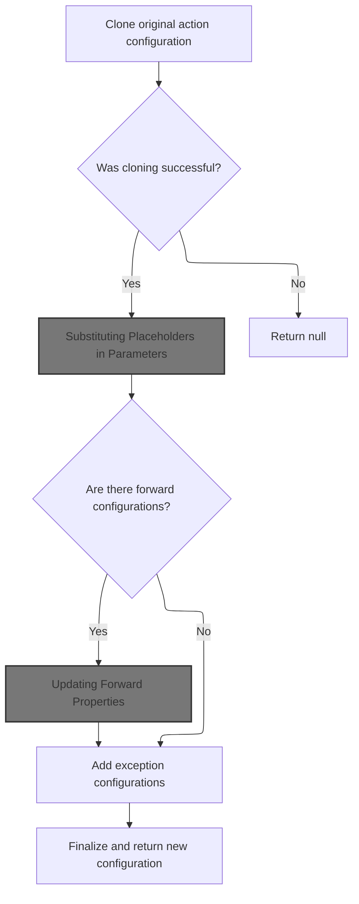
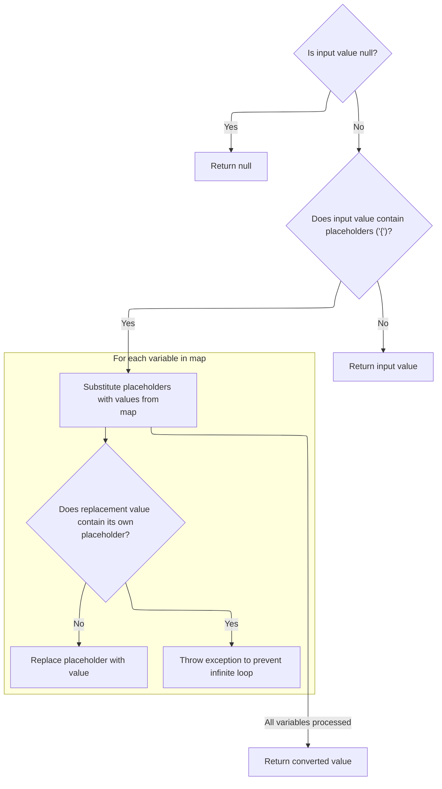
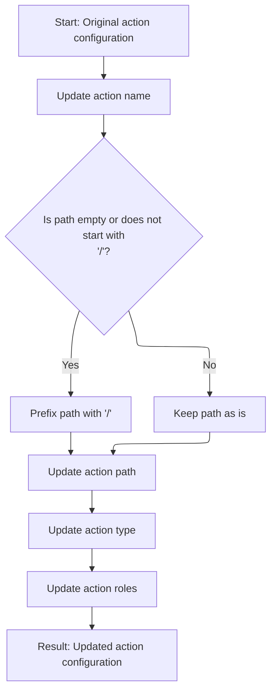
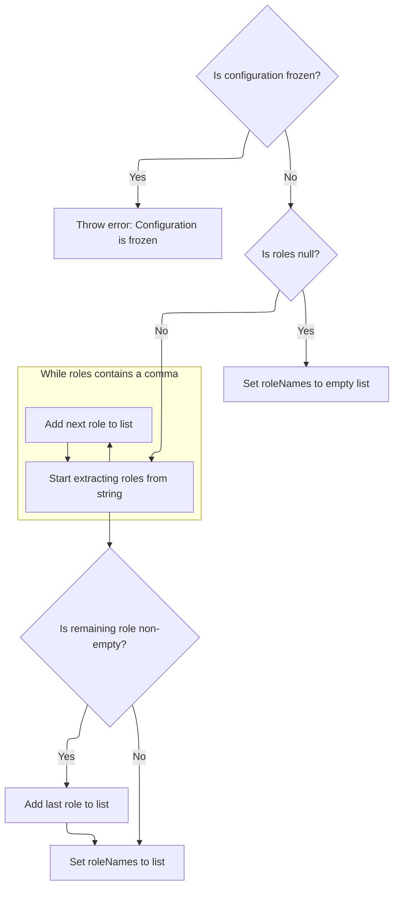
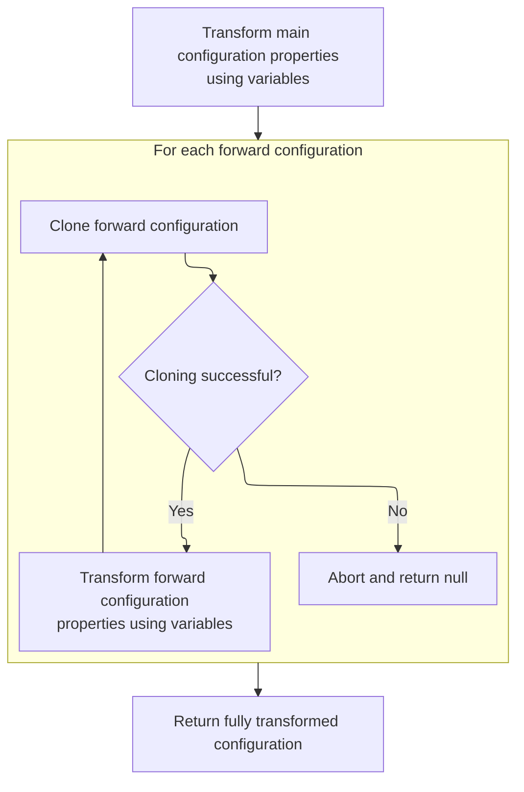
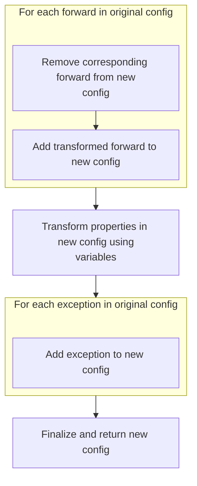

This document describes how an action configuration is dynamically updated by replacing placeholders with values from a set of variables. The flow receives an existing configuration and a set of variables as input, and outputs a fully updated configuration ready for use in routing and processing requests.

# Cloning and Preparing <SwmToken path="core/src/main/java/org/apache/struts/config/ActionConfigMatcher.java" pos="157:3:3" line-data="    protected ActionConfig convertActionConfig(String path, ActionConfig orig,">`ActionConfig`</SwmToken>



<SwmSnippet path="/core/src/main/java/org/apache/struts/config/ActionConfigMatcher.java" line="157">

---

In <SwmToken path="core/src/main/java/org/apache/struts/config/ActionConfigMatcher.java" pos="157:5:5" line-data="    protected ActionConfig convertActionConfig(String path, ActionConfig orig,">`convertActionConfig`</SwmToken>, we clone the original <SwmToken path="core/src/main/java/org/apache/struts/config/ActionConfigMatcher.java" pos="157:3:3" line-data="    protected ActionConfig convertActionConfig(String path, ActionConfig orig,">`ActionConfig`</SwmToken> to preserve its settings, then start updating fields that need variable substitution. Calling <SwmToken path="core/src/main/java/org/apache/struts/config/ActionConfigMatcher.java" pos="170:5:5" line-data="        config.setName(convertParam(orig.getName(), vars));">`convertParam`</SwmToken> next lets us replace placeholders in the name field using the provided vars map.

```java
    protected ActionConfig convertActionConfig(String path, ActionConfig orig,
        Map vars) {
        ActionConfig config = null;

        try {
            config = (ActionConfig) BeanUtils.cloneBean(orig);
        } catch (Exception ex) {
            log.warn("Unable to clone action config, recommend not using "
                + "wildcards", ex);

            return null;
        }

        config.setName(convertParam(orig.getName(), vars));
```

---

</SwmSnippet>

## Substituting Placeholders in Parameters



<SwmSnippet path="/core/src/main/java/org/apache/struts/config/ActionConfigMatcher.java" line="258">

---

In <SwmToken path="core/src/main/java/org/apache/struts/config/ActionConfigMatcher.java" pos="258:5:5" line-data="    protected String convertParam(String val, Map vars) {">`convertParam`</SwmToken>, we check for placeholders in the input string and iterate over the vars map, building placeholder strings like '{x}' for each key. The function expects keys to be single characters, and uses IteratorAdapter to loop through map entries for substitution.

```java
    protected String convertParam(String val, Map vars) {
        if (val == null) {
            return null;
        } else if (val.indexOf("{") == -1) {
            return val;
        }

        Map.Entry entry;
        StringBuffer key = new StringBuffer("{0}");
        StringBuffer ret = new StringBuffer(val);
        String keyStr;
        int x;

        for (Iterator i = vars.entrySet().iterator(); i.hasNext();) {
            entry = (Map.Entry) i.next();
```

---

</SwmSnippet>

<SwmSnippet path="/core/src/main/java/org/apache/struts/config/ActionConfigMatcher.java" line="273">

---

Back in <SwmToken path="core/src/main/java/org/apache/struts/config/ActionConfigMatcher.java" pos="170:5:5" line-data="        config.setName(convertParam(orig.getName(), vars));">`convertParam`</SwmToken>, after iterating with IteratorAdapter, we check for infinite loop risks (<SwmToken path="core/src/main/java/org/apache/struts/config/ActionConfigMatcher.java" pos="276:3:5" line-data="            // STR-3169">`STR-3169`</SwmToken>) by throwing if a value contains its own placeholder. The function keeps replacing all placeholder instances, relying on keys being single characters for correct operation.

```java
            key.setCharAt(1, ((String) entry.getKey()).charAt(0));
            keyStr = key.toString();
            
            // STR-3169
            // Prevent an infinite loop by retaining the placeholders
            // that contain itself in the substitution value
            if (((String) entry.getValue()).contains(keyStr)) {
        	throw new IllegalStateException();
            }
            
            // Replace all instances of the placeholder
            while ((x = ret.toString().indexOf(keyStr)) > -1) {
                ret.replace(x, x + 3, (String) entry.getValue());
            }
```

---

</SwmSnippet>

## Updating <SwmToken path="core/src/main/java/org/apache/struts/config/ActionConfigMatcher.java" pos="157:3:3" line-data="    protected ActionConfig convertActionConfig(String path, ActionConfig orig,">`ActionConfig`</SwmToken> Name



<SwmSnippet path="/core/src/main/java/org/apache/struts/config/ActionConfigMatcher.java" line="170">

---

After returning from <SwmToken path="core/src/main/java/org/apache/struts/config/ActionConfigMatcher.java" pos="170:5:5" line-data="        config.setName(convertParam(orig.getName(), vars));">`convertParam`</SwmToken>, we update the <SwmToken path="core/src/main/java/org/apache/struts/config/ActionConfigMatcher.java" pos="157:3:3" line-data="    protected ActionConfig convertActionConfig(String path, ActionConfig orig,">`ActionConfig`</SwmToken>'s name with the substituted value. Next, we call <SwmToken path="core/src/main/java/org/apache/struts/config/ActionConfigMatcher.java" pos="170:3:3" line-data="        config.setName(convertParam(orig.getName(), vars));">`setName`</SwmToken> in <SwmPath>[core/…/config/ActionConfig.java](core/src/main/java/org/apache/struts/config/ActionConfig.java)</SwmPath> to actually store this resolved name in the config object.

```java
        config.setName(convertParam(orig.getName(), vars));

```

---

</SwmSnippet>

<SwmSnippet path="/core/src/main/java/org/apache/struts/config/ActionConfig.java" line="517">

---

<SwmToken path="core/src/main/java/org/apache/struts/config/ActionConfig.java" pos="517:5:5" line-data="    public void setName(String name) {">`setName`</SwmToken> checks if configuration is frozen using the 'configured' flag. If it's true, it throws an exception and blocks changes to the name, enforcing immutability after setup.

```java
    public void setName(String name) {
        if (configured) {
            throw new IllegalStateException("Configuration is frozen");
        }

        this.name = name;
    }
```

---

</SwmSnippet>

<SwmSnippet path="/core/src/main/java/org/apache/struts/config/ActionConfigMatcher.java" line="172">

---

After returning from <SwmToken path="core/src/main/java/org/apache/struts/config/ActionConfigMatcher.java" pos="170:3:3" line-data="        config.setName(convertParam(orig.getName(), vars));">`setName`</SwmToken>, we normalize the path to ensure it starts with a slash, then call <SwmToken path="core/src/main/java/org/apache/struts/config/ActionConfigMatcher.java" pos="176:3:3" line-data="        config.setPath(path);">`setPath`</SwmToken> in <SwmPath>[core/…/config/ActionConfig.java](core/src/main/java/org/apache/struts/config/ActionConfig.java)</SwmPath> to update the config's routing path.

```java
        if ((path.length() == 0) || (path.charAt(0) != '/')) {
            path = "/" + path;
        }

        config.setPath(path);
```

---

</SwmSnippet>

<SwmSnippet path="/core/src/main/java/org/apache/struts/config/ActionConfig.java" line="565">

---

<SwmToken path="core/src/main/java/org/apache/struts/config/ActionConfig.java" pos="565:5:5" line-data="    public void setPath(String path) {">`setPath`</SwmToken> checks the 'configured' flag before updating the path. If configuration is frozen, it throws and blocks changes, following the repository's immutability pattern.

```java
    public void setPath(String path) {
        if (configured) {
            throw new IllegalStateException("Configuration is frozen");
        }

        this.path = path;
    }
```

---

</SwmSnippet>

<SwmSnippet path="/core/src/main/java/org/apache/struts/config/ActionConfigMatcher.java" line="177">

---

After updating the path, we substitute the type field using <SwmToken path="core/src/main/java/org/apache/struts/config/ActionConfigMatcher.java" pos="177:5:5" line-data="        config.setType(convertParam(orig.getType(), vars));">`convertParam`</SwmToken> to resolve any placeholders, prepping the config for the next <SwmToken path="core/src/main/java/org/apache/struts/config/ActionConfigMatcher.java" pos="177:3:3" line-data="        config.setType(convertParam(orig.getType(), vars));">`setType`</SwmToken> call.

```java
        config.setType(convertParam(orig.getType(), vars));
```

---

</SwmSnippet>

<SwmSnippet path="/core/src/main/java/org/apache/struts/config/ActionConfigMatcher.java" line="177">

---

After substituting the type, we call <SwmToken path="core/src/main/java/org/apache/struts/config/ActionConfigMatcher.java" pos="177:3:3" line-data="        config.setType(convertParam(orig.getType(), vars));">`setType`</SwmToken> in <SwmPath>[core/…/config/ActionConfig.java](core/src/main/java/org/apache/struts/config/ActionConfig.java)</SwmPath> to store the resolved type in the <SwmToken path="core/src/main/java/org/apache/struts/config/ActionConfigMatcher.java" pos="157:3:3" line-data="    protected ActionConfig convertActionConfig(String path, ActionConfig orig,">`ActionConfig`</SwmToken> instance.

```java
        config.setType(convertParam(orig.getType(), vars));
```

---

</SwmSnippet>

<SwmSnippet path="/core/src/main/java/org/apache/struts/config/ActionConfig.java" line="788">

---

<SwmToken path="core/src/main/java/org/apache/struts/config/ActionConfig.java" pos="788:5:5" line-data="    public void setType(String type) {">`setType`</SwmToken> checks the 'configured' flag before updating the type. If configuration is frozen, it throws and blocks changes, following the repository's immutability pattern.

```java
    public void setType(String type) {
        if (configured) {
            throw new IllegalStateException("Configuration is frozen");
        }

        this.type = type;
    }
```

---

</SwmSnippet>

<SwmSnippet path="/core/src/main/java/org/apache/struts/config/ActionConfigMatcher.java" line="178">

---

After updating the type, we substitute the roles field using <SwmToken path="core/src/main/java/org/apache/struts/config/ActionConfigMatcher.java" pos="178:5:5" line-data="        config.setRoles(convertParam(orig.getRoles(), vars));">`convertParam`</SwmToken> to resolve any placeholders, prepping the config for the next <SwmToken path="core/src/main/java/org/apache/struts/config/ActionConfigMatcher.java" pos="178:3:3" line-data="        config.setRoles(convertParam(orig.getRoles(), vars));">`setRoles`</SwmToken> call.

```java
        config.setRoles(convertParam(orig.getRoles(), vars));
```

---

</SwmSnippet>

<SwmSnippet path="/core/src/main/java/org/apache/struts/config/ActionConfigMatcher.java" line="178">

---

After substituting the roles, we call <SwmToken path="core/src/main/java/org/apache/struts/config/ActionConfigMatcher.java" pos="178:3:3" line-data="        config.setRoles(convertParam(orig.getRoles(), vars));">`setRoles`</SwmToken> in <SwmPath>[core/…/config/ActionConfig.java](core/src/main/java/org/apache/struts/config/ActionConfig.java)</SwmPath> to store the resolved roles string in the <SwmToken path="core/src/main/java/org/apache/struts/config/ActionConfigMatcher.java" pos="157:3:3" line-data="    protected ActionConfig convertActionConfig(String path, ActionConfig orig,">`ActionConfig`</SwmToken> instance.

```java
        config.setRoles(convertParam(orig.getRoles(), vars));
```

---

</SwmSnippet>

## Parsing and Setting Roles



<SwmSnippet path="/core/src/main/java/org/apache/struts/config/ActionConfig.java" line="597">

---

In <SwmToken path="core/src/main/java/org/apache/struts/config/ActionConfig.java" pos="597:5:5" line-data="    public void setRoles(String roles) {">`setRoles`</SwmToken>, we check if configuration is frozen, then parse the comma-separated roles string into individual role names, storing them in the <SwmToken path="core/src/main/java/org/apache/struts/config/ActionConfig.java" pos="605:1:1" line-data="            roleNames = new String[0];">`roleNames`</SwmToken> array for later use.

```java
    public void setRoles(String roles) {
        if (configured) {
            throw new IllegalStateException("Configuration is frozen");
        }

        this.roles = roles;

        if (roles == null) {
            roleNames = new String[0];

            return;
        }

        ArrayList list = new ArrayList();

        while (true) {
            int comma = roles.indexOf(',');

            if (comma < 0) {
                break;
            }

            list.add(roles.substring(0, comma).trim());
            roles = roles.substring(comma + 1);
        }
```

---

</SwmSnippet>

<SwmSnippet path="/core/src/main/java/org/apache/struts/config/ActionConfig.java" line="623">

---

After parsing, any remaining role string is trimmed and added to the list. The final <SwmToken path="core/src/main/java/org/apache/struts/config/ActionConfig.java" pos="629:1:1" line-data="        roleNames = (String[]) list.toArray(new String[list.size()]);">`roleNames`</SwmToken> array is built from this list, ready for role checks elsewhere.

```java
        roles = roles.trim();

        if (roles.length() > 0) {
            list.add(roles);
        }

        roleNames = (String[]) list.toArray(new String[list.size()]);
    }
```

---

</SwmSnippet>

## Setting Parameter Field



<SwmSnippet path="/core/src/main/java/org/apache/struts/config/ActionConfigMatcher.java" line="179">

---

After updating roles, we substitute the parameter field using <SwmToken path="core/src/main/java/org/apache/struts/config/ActionConfigMatcher.java" pos="179:5:5" line-data="        config.setParameter(convertParam(orig.getParameter(), vars));">`convertParam`</SwmToken> to resolve any placeholders, prepping the config for the next <SwmToken path="core/src/main/java/org/apache/struts/config/ActionConfigMatcher.java" pos="179:3:3" line-data="        config.setParameter(convertParam(orig.getParameter(), vars));">`setParameter`</SwmToken> call.

```java
        config.setParameter(convertParam(orig.getParameter(), vars));
```

---

</SwmSnippet>

<SwmSnippet path="/core/src/main/java/org/apache/struts/config/ActionConfigMatcher.java" line="179">

---

After substituting the parameter, we call <SwmToken path="core/src/main/java/org/apache/struts/config/ActionConfigMatcher.java" pos="179:3:3" line-data="        config.setParameter(convertParam(orig.getParameter(), vars));">`setParameter`</SwmToken> in <SwmPath>[core/…/config/ActionConfig.java](core/src/main/java/org/apache/struts/config/ActionConfig.java)</SwmPath> to store the resolved parameter string in the <SwmToken path="core/src/main/java/org/apache/struts/config/ActionConfigMatcher.java" pos="157:3:3" line-data="    protected ActionConfig convertActionConfig(String path, ActionConfig orig,">`ActionConfig`</SwmToken> instance.

```java
        config.setParameter(convertParam(orig.getParameter(), vars));
```

---

</SwmSnippet>

<SwmSnippet path="/core/src/main/java/org/apache/struts/config/ActionConfig.java" line="541">

---

<SwmToken path="core/src/main/java/org/apache/struts/config/ActionConfig.java" pos="541:5:5" line-data="    public void setParameter(String parameter) {">`setParameter`</SwmToken> checks the 'configured' flag before updating the parameter. If configuration is frozen, it throws and blocks changes, following the repository's immutability pattern.

```java
    public void setParameter(String parameter) {
        if (configured) {
            throw new IllegalStateException("Configuration is frozen");
        }

        this.parameter = parameter;
    }
```

---

</SwmSnippet>

<SwmSnippet path="/core/src/main/java/org/apache/struts/config/ActionConfigMatcher.java" line="180">

---

After updating the parameter, we substitute the attribute field using <SwmToken path="core/src/main/java/org/apache/struts/config/ActionConfigMatcher.java" pos="180:5:5" line-data="        config.setAttribute(convertParam(orig.getAttribute(), vars));">`convertParam`</SwmToken> to resolve any placeholders, prepping the config for the next <SwmToken path="core/src/main/java/org/apache/struts/config/ActionConfigMatcher.java" pos="180:3:3" line-data="        config.setAttribute(convertParam(orig.getAttribute(), vars));">`setAttribute`</SwmToken> call.

```java
        config.setAttribute(convertParam(orig.getAttribute(), vars));
```

---

</SwmSnippet>

<SwmSnippet path="/core/src/main/java/org/apache/struts/config/ActionConfig.java" line="321">

---

<SwmToken path="core/src/main/java/org/apache/struts/config/ActionConfig.java" pos="321:5:5" line-data="    public String getAttribute() {">`getAttribute`</SwmToken> returns the attribute value if set; otherwise, it falls back to the name field. This fallback is a repository-specific design for flexibility.

```java
    public String getAttribute() {
        if (this.attribute == null) {
            return (this.name);
        } else {
            return (this.attribute);
        }
    }
```

---

</SwmSnippet>

<SwmSnippet path="/core/src/main/java/org/apache/struts/config/ActionConfigMatcher.java" line="180">

---

After checking attribute fallback, we substitute the attribute field using <SwmToken path="core/src/main/java/org/apache/struts/config/ActionConfigMatcher.java" pos="180:5:5" line-data="        config.setAttribute(convertParam(orig.getAttribute(), vars));">`convertParam`</SwmToken> to resolve any placeholders, prepping the config for the next <SwmToken path="core/src/main/java/org/apache/struts/config/ActionConfigMatcher.java" pos="180:3:3" line-data="        config.setAttribute(convertParam(orig.getAttribute(), vars));">`setAttribute`</SwmToken> call.

```java
        config.setAttribute(convertParam(orig.getAttribute(), vars));
```

---

</SwmSnippet>

<SwmSnippet path="/core/src/main/java/org/apache/struts/config/ActionConfigMatcher.java" line="180">

---

After substituting the attribute, we call <SwmToken path="core/src/main/java/org/apache/struts/config/ActionConfigMatcher.java" pos="180:3:3" line-data="        config.setAttribute(convertParam(orig.getAttribute(), vars));">`setAttribute`</SwmToken> in <SwmPath>[core/…/config/ActionConfig.java](core/src/main/java/org/apache/struts/config/ActionConfig.java)</SwmPath> to store the resolved attribute string in the <SwmToken path="core/src/main/java/org/apache/struts/config/ActionConfigMatcher.java" pos="157:3:3" line-data="    protected ActionConfig convertActionConfig(String path, ActionConfig orig,">`ActionConfig`</SwmToken> instance.

```java
        config.setAttribute(convertParam(orig.getAttribute(), vars));
```

---

</SwmSnippet>

<SwmSnippet path="/core/src/main/java/org/apache/struts/config/ActionConfig.java" line="337">

---

<SwmToken path="core/src/main/java/org/apache/struts/config/ActionConfig.java" pos="337:5:5" line-data="    public void setAttribute(String attribute) {">`setAttribute`</SwmToken> checks the 'configured' flag before updating the attribute. If configuration is frozen, it throws and blocks changes, following the repository's immutability pattern.

```java
    public void setAttribute(String attribute) {
        if (configured) {
            throw new IllegalStateException("Configuration is frozen");
        }

        this.attribute = attribute;
    }
```

---

</SwmSnippet>

<SwmSnippet path="/core/src/main/java/org/apache/struts/config/ActionConfigMatcher.java" line="181">

---

After updating the attribute, we substitute the forward field using <SwmToken path="core/src/main/java/org/apache/struts/config/ActionConfigMatcher.java" pos="181:5:5" line-data="        config.setForward(convertParam(orig.getForward(), vars));">`convertParam`</SwmToken> to resolve any placeholders, prepping the config for the next <SwmToken path="core/src/main/java/org/apache/struts/config/ActionConfigMatcher.java" pos="181:3:3" line-data="        config.setForward(convertParam(orig.getForward(), vars));">`setForward`</SwmToken> call.

```java
        config.setForward(convertParam(orig.getForward(), vars));
```

---

</SwmSnippet>

<SwmSnippet path="/core/src/main/java/org/apache/struts/config/ActionConfigMatcher.java" line="181">

---

After substituting the forward, we call <SwmToken path="core/src/main/java/org/apache/struts/config/ActionConfigMatcher.java" pos="181:3:3" line-data="        config.setForward(convertParam(orig.getForward(), vars));">`setForward`</SwmToken> in <SwmPath>[core/…/config/ActionConfig.java](core/src/main/java/org/apache/struts/config/ActionConfig.java)</SwmPath> to store the resolved forward string in the <SwmToken path="core/src/main/java/org/apache/struts/config/ActionConfigMatcher.java" pos="157:3:3" line-data="    protected ActionConfig convertActionConfig(String path, ActionConfig orig,">`ActionConfig`</SwmToken> instance.

```java
        config.setForward(convertParam(orig.getForward(), vars));
```

---

</SwmSnippet>

<SwmSnippet path="/core/src/main/java/org/apache/struts/config/ActionConfig.java" line="419">

---

<SwmToken path="core/src/main/java/org/apache/struts/config/ActionConfig.java" pos="419:5:5" line-data="    public void setForward(String forward) {">`setForward`</SwmToken> checks the 'configured' flag before updating the forward field. If configuration is frozen, it throws and blocks changes, following the repository's immutability pattern.

```java
    public void setForward(String forward) {
        if (configured) {
            throw new IllegalStateException("Configuration is frozen");
        }

        this.forward = forward;
    }
```

---

</SwmSnippet>

<SwmSnippet path="/core/src/main/java/org/apache/struts/config/ActionConfigMatcher.java" line="182">

---

After updating the forward, we substitute the include field using <SwmToken path="core/src/main/java/org/apache/struts/config/ActionConfigMatcher.java" pos="182:5:5" line-data="        config.setInclude(convertParam(orig.getInclude(), vars));">`convertParam`</SwmToken> to resolve any placeholders, prepping the config for the next <SwmToken path="core/src/main/java/org/apache/struts/config/ActionConfigMatcher.java" pos="182:3:3" line-data="        config.setInclude(convertParam(orig.getInclude(), vars));">`setInclude`</SwmToken> call.

```java
        config.setInclude(convertParam(orig.getInclude(), vars));
```

---

</SwmSnippet>

<SwmSnippet path="/core/src/main/java/org/apache/struts/config/ActionConfigMatcher.java" line="182">

---

After substituting the include, we call <SwmToken path="core/src/main/java/org/apache/struts/config/ActionConfigMatcher.java" pos="182:3:3" line-data="        config.setInclude(convertParam(orig.getInclude(), vars));">`setInclude`</SwmToken> in <SwmPath>[core/…/config/ActionConfig.java](core/src/main/java/org/apache/struts/config/ActionConfig.java)</SwmPath> to store the resolved include string in the <SwmToken path="core/src/main/java/org/apache/struts/config/ActionConfigMatcher.java" pos="157:3:3" line-data="    protected ActionConfig convertActionConfig(String path, ActionConfig orig,">`ActionConfig`</SwmToken> instance.

```java
        config.setInclude(convertParam(orig.getInclude(), vars));
```

---

</SwmSnippet>

<SwmSnippet path="/core/src/main/java/org/apache/struts/config/ActionConfig.java" line="446">

---

<SwmToken path="core/src/main/java/org/apache/struts/config/ActionConfig.java" pos="446:5:5" line-data="    public void setInclude(String include) {">`setInclude`</SwmToken> checks the 'configured' flag before updating the include field. If configuration is frozen, it throws and blocks changes, following the repository's immutability pattern.

```java
    public void setInclude(String include) {
        if (configured) {
            throw new IllegalStateException("Configuration is frozen");
        }

        this.include = include;
    }
```

---

</SwmSnippet>

<SwmSnippet path="/core/src/main/java/org/apache/struts/config/ActionConfigMatcher.java" line="183">

---

After updating the include, we substitute the input field using <SwmToken path="core/src/main/java/org/apache/struts/config/ActionConfigMatcher.java" pos="183:5:5" line-data="        config.setInput(convertParam(orig.getInput(), vars));">`convertParam`</SwmToken> to resolve any placeholders, prepping the config for the next <SwmToken path="core/src/main/java/org/apache/struts/config/ActionConfigMatcher.java" pos="183:3:3" line-data="        config.setInput(convertParam(orig.getInput(), vars));">`setInput`</SwmToken> call.

```java
        config.setInput(convertParam(orig.getInput(), vars));
```

---

</SwmSnippet>

<SwmSnippet path="/core/src/main/java/org/apache/struts/config/ActionConfigMatcher.java" line="183">

---

After substituting the input, we call <SwmToken path="core/src/main/java/org/apache/struts/config/ActionConfigMatcher.java" pos="183:3:3" line-data="        config.setInput(convertParam(orig.getInput(), vars));">`setInput`</SwmToken> in <SwmPath>[core/…/config/ActionConfig.java](core/src/main/java/org/apache/struts/config/ActionConfig.java)</SwmPath> to store the resolved input string in the <SwmToken path="core/src/main/java/org/apache/struts/config/ActionConfigMatcher.java" pos="157:3:3" line-data="    protected ActionConfig convertActionConfig(String path, ActionConfig orig,">`ActionConfig`</SwmToken> instance.

```java
        config.setInput(convertParam(orig.getInput(), vars));
```

---

</SwmSnippet>

<SwmSnippet path="/core/src/main/java/org/apache/struts/config/ActionConfig.java" line="473">

---

<SwmToken path="core/src/main/java/org/apache/struts/config/ActionConfig.java" pos="473:5:5" line-data="    public void setInput(String input) {">`setInput`</SwmToken> checks the 'configured' flag before updating the input field. If configuration is frozen, it throws and blocks changes, following the repository's immutability pattern.

```java
    public void setInput(String input) {
        if (configured) {
            throw new IllegalStateException("Configuration is frozen");
        }

        this.input = input;
    }
```

---

</SwmSnippet>

<SwmSnippet path="/core/src/main/java/org/apache/struts/config/ActionConfigMatcher.java" line="184">

---

After updating the input, we substitute the catalog field using <SwmToken path="core/src/main/java/org/apache/struts/config/ActionConfigMatcher.java" pos="184:5:5" line-data="        config.setCatalog(convertParam(orig.getCatalog(), vars));">`convertParam`</SwmToken> to resolve any placeholders, prepping the config for the next <SwmToken path="core/src/main/java/org/apache/struts/config/ActionConfigMatcher.java" pos="184:3:3" line-data="        config.setCatalog(convertParam(orig.getCatalog(), vars));">`setCatalog`</SwmToken> call.

```java
        config.setCatalog(convertParam(orig.getCatalog(), vars));
```

---

</SwmSnippet>

<SwmSnippet path="/core/src/main/java/org/apache/struts/config/ActionConfigMatcher.java" line="184">

---

After substituting the catalog, we call <SwmToken path="core/src/main/java/org/apache/struts/config/ActionConfigMatcher.java" pos="184:3:3" line-data="        config.setCatalog(convertParam(orig.getCatalog(), vars));">`setCatalog`</SwmToken> in <SwmPath>[core/…/config/ActionConfig.java](core/src/main/java/org/apache/struts/config/ActionConfig.java)</SwmPath> to store the resolved catalog string in the <SwmToken path="core/src/main/java/org/apache/struts/config/ActionConfigMatcher.java" pos="157:3:3" line-data="    protected ActionConfig convertActionConfig(String path, ActionConfig orig,">`ActionConfig`</SwmToken> instance.

```java
        config.setCatalog(convertParam(orig.getCatalog(), vars));
```

---

</SwmSnippet>

<SwmSnippet path="/core/src/main/java/org/apache/struts/config/ActionConfig.java" line="882">

---

<SwmToken path="core/src/main/java/org/apache/struts/config/ActionConfig.java" pos="882:5:5" line-data="    public void setCatalog(String catalog) {">`setCatalog`</SwmToken> checks the 'configured' flag before updating the catalog field. If configuration is frozen, it throws and blocks changes, following the repository's immutability pattern.

```java
    public void setCatalog(String catalog) {
        if (configured) {
            throw new IllegalStateException("Configuration is frozen");
        }

        this.catalog = catalog;
    }
```

---

</SwmSnippet>

<SwmSnippet path="/core/src/main/java/org/apache/struts/config/ActionConfigMatcher.java" line="185">

---

After updating the catalog, we substitute the command field using <SwmToken path="core/src/main/java/org/apache/struts/config/ActionConfigMatcher.java" pos="185:5:5" line-data="        config.setCommand(convertParam(orig.getCommand(), vars));">`convertParam`</SwmToken> to resolve any placeholders, prepping the config for the next <SwmToken path="core/src/main/java/org/apache/struts/config/ActionConfigMatcher.java" pos="185:3:3" line-data="        config.setCommand(convertParam(orig.getCommand(), vars));">`setCommand`</SwmToken> call.

```java
        config.setCommand(convertParam(orig.getCommand(), vars));
```

---

</SwmSnippet>

<SwmSnippet path="/core/src/main/java/org/apache/struts/config/ActionConfigMatcher.java" line="185">

---

After resolving placeholders in the command field with <SwmToken path="core/src/main/java/org/apache/struts/config/ActionConfigMatcher.java" pos="185:5:5" line-data="        config.setCommand(convertParam(orig.getCommand(), vars));">`convertParam`</SwmToken>, we call <SwmToken path="core/src/main/java/org/apache/struts/config/ActionConfigMatcher.java" pos="185:3:3" line-data="        config.setCommand(convertParam(orig.getCommand(), vars));">`setCommand`</SwmToken> on the config. This step in ActionConfigMatcher.convertActionConfig ensures the command string is updated with all variables replaced, so the config is ready for use in later processing.

```java
        config.setCommand(convertParam(orig.getCommand(), vars));
```

---

</SwmSnippet>

<SwmSnippet path="/core/src/main/java/org/apache/struts/config/ActionConfig.java" line="864">

---

SetCommand checks if the config is frozen using the 'configured' flag. If it's true, it throws and blocks changes, so you can't update the command after setup. This keeps the config immutable once it's finalized.

```java
    public void setCommand(String command) {
        if (configured) {
            throw new IllegalStateException("Configuration is frozen");
        }

        this.command = command;
    }
```

---

</SwmSnippet>

<SwmSnippet path="/core/src/main/java/org/apache/struts/config/ActionConfigMatcher.java" line="186">

---

After updating the command, we resolve placeholders in the <SwmToken path="core/src/main/java/org/apache/struts/config/ActionConfig.java" pos="499:9:9" line-data="    public void setMultipartClass(String multipartClass) {">`multipartClass`</SwmToken> field using <SwmToken path="core/src/main/java/org/apache/struts/config/ActionConfigMatcher.java" pos="186:5:5" line-data="        config.setMultipartClass(convertParam(orig.getMultipartClass(), vars));">`convertParam`</SwmToken>. This step in ActionConfigMatcher.convertActionConfig ensures the config gets the right class name for handling multipart requests, with all variables replaced.

```java
        config.setMultipartClass(convertParam(orig.getMultipartClass(), vars));
```

---

</SwmSnippet>

<SwmSnippet path="/core/src/main/java/org/apache/struts/config/ActionConfigMatcher.java" line="186">

---

After resolving the <SwmToken path="core/src/main/java/org/apache/struts/config/ActionConfig.java" pos="499:9:9" line-data="    public void setMultipartClass(String multipartClass) {">`multipartClass`</SwmToken> value, we call <SwmToken path="core/src/main/java/org/apache/struts/config/ActionConfigMatcher.java" pos="186:3:3" line-data="        config.setMultipartClass(convertParam(orig.getMultipartClass(), vars));">`setMultipartClass`</SwmToken> to update the config. This step in ActionConfigMatcher.convertActionConfig stores the resolved class name, so the config is ready for multipart handling.

```java
        config.setMultipartClass(convertParam(orig.getMultipartClass(), vars));
```

---

</SwmSnippet>

<SwmSnippet path="/core/src/main/java/org/apache/struts/config/ActionConfig.java" line="499">

---

SetMultipartClass checks if the config is frozen and throws if you try to update it after that. This keeps the multipart class immutable once the config is finalized.

```java
    public void setMultipartClass(String multipartClass) {
        if (configured) {
            throw new IllegalStateException("Configuration is frozen");
        }

        this.multipartClass = multipartClass;
    }
```

---

</SwmSnippet>

<SwmSnippet path="/core/src/main/java/org/apache/struts/config/ActionConfigMatcher.java" line="187">

---

After updating the <SwmToken path="core/src/main/java/org/apache/struts/config/ActionConfig.java" pos="499:9:9" line-data="    public void setMultipartClass(String multipartClass) {">`multipartClass`</SwmToken>, we resolve placeholders in the prefix field using <SwmToken path="core/src/main/java/org/apache/struts/config/ActionConfigMatcher.java" pos="187:5:5" line-data="        config.setPrefix(convertParam(orig.getPrefix(), vars));">`convertParam`</SwmToken>. This step in ActionConfigMatcher.convertActionConfig ensures the config gets the right prefix value, with all variables replaced.

```java
        config.setPrefix(convertParam(orig.getPrefix(), vars));
```

---

</SwmSnippet>

<SwmSnippet path="/core/src/main/java/org/apache/struts/config/ActionConfigMatcher.java" line="187">

---

After resolving the prefix value, we call <SwmToken path="core/src/main/java/org/apache/struts/config/ActionConfigMatcher.java" pos="187:3:3" line-data="        config.setPrefix(convertParam(orig.getPrefix(), vars));">`setPrefix`</SwmToken> to update the config. This step in ActionConfigMatcher.convertActionConfig stores the resolved prefix, so the config is ready for further processing.

```java
        config.setPrefix(convertParam(orig.getPrefix(), vars));
```

---

</SwmSnippet>

<SwmSnippet path="/core/src/main/java/org/apache/struts/config/ActionConfig.java" line="585">

---

SetPrefix checks if the config is frozen and throws if you try to update it after that. This keeps the prefix immutable once the config is finalized.

```java
    public void setPrefix(String prefix) {
        if (configured) {
            throw new IllegalStateException("Configuration is frozen");
        }

        this.prefix = prefix;
    }
```

---

</SwmSnippet>

<SwmSnippet path="/core/src/main/java/org/apache/struts/config/ActionConfigMatcher.java" line="188">

---

After updating the prefix, we resolve placeholders in the suffix field using <SwmToken path="core/src/main/java/org/apache/struts/config/ActionConfigMatcher.java" pos="188:5:5" line-data="        config.setSuffix(convertParam(orig.getSuffix(), vars));">`convertParam`</SwmToken>. This step in ActionConfigMatcher.convertActionConfig ensures the config gets the right suffix value, with all variables replaced.

```java
        config.setSuffix(convertParam(orig.getSuffix(), vars));

        ForwardConfig[] fConfigs = orig.findForwardConfigs();
        ForwardConfig cfg;

        for (int x = 0; x < fConfigs.length; x++) {
            try {
                cfg = (ActionForward) BeanUtils.cloneBean(fConfigs[x]);
            } catch (Exception ex) {
                log.warn("Unable to clone action config, recommend not using "
                        + "wildcards", ex);
                return null;
            }
            cfg.setName(fConfigs[x].getName());
            cfg.setPath(convertParam(fConfigs[x].getPath(), vars));
```

---

</SwmSnippet>

<SwmSnippet path="/core/src/main/java/org/apache/struts/config/ActionConfigMatcher.java" line="202">

---

After resolving the path for each forward config, we call <SwmToken path="core/src/main/java/org/apache/struts/config/ActionConfigMatcher.java" pos="202:3:3" line-data="            cfg.setPath(convertParam(fConfigs[x].getPath(), vars));">`setPath`</SwmToken> to update it. This step in ActionConfigMatcher.convertActionConfig stores the resolved path, so the forward is ready for routing.

```java
            cfg.setPath(convertParam(fConfigs[x].getPath(), vars));
```

---

</SwmSnippet>

<SwmSnippet path="/core/src/main/java/org/apache/struts/config/ExceptionConfig.java" line="141">

---

SetPath checks if the config is frozen and throws if you try to update it after that. This keeps the path immutable once the config is finalized.

```java
    public void setPath(String path) {
        if (configured) {
            throw new IllegalStateException("Configuration is frozen");
        }

        this.path = path;
    }
```

---

</SwmSnippet>

<SwmSnippet path="/core/src/main/java/org/apache/struts/config/ActionConfigMatcher.java" line="203">

---

After updating the path, we set the redirect flag on the forward config. This step in ActionConfigMatcher.convertActionConfig ensures the forward uses the correct redirect behavior.

```java
            cfg.setRedirect(fConfigs[x].getRedirect());
```

---

</SwmSnippet>

<SwmSnippet path="/core/src/main/java/org/apache/struts/config/ForwardConfig.java" line="222">

---

SetRedirect checks if the config is frozen and throws if you try to update it after that. This keeps the redirect flag immutable once the config is finalized.

```java
    public void setRedirect(boolean redirect) {
        if (configured) {
            throw new IllegalStateException("Configuration is frozen");
        }

        this.redirect = redirect;
    }
```

---

</SwmSnippet>

<SwmSnippet path="/core/src/main/java/org/apache/struts/config/ActionConfigMatcher.java" line="204">

---

After updating the redirect flag, we resolve placeholders in the command field for each forward config using <SwmToken path="core/src/main/java/org/apache/struts/config/ActionConfigMatcher.java" pos="204:5:5" line-data="            cfg.setCommand(convertParam(fConfigs[x].getCommand(), vars));">`convertParam`</SwmToken>. This step in ActionConfigMatcher.convertActionConfig ensures the forward gets the right command value.

```java
            cfg.setCommand(convertParam(fConfigs[x].getCommand(), vars));
```

---

</SwmSnippet>

<SwmSnippet path="/core/src/main/java/org/apache/struts/config/ActionConfigMatcher.java" line="204">

---

After resolving the command value, we call <SwmToken path="core/src/main/java/org/apache/struts/config/ActionConfigMatcher.java" pos="204:3:3" line-data="            cfg.setCommand(convertParam(fConfigs[x].getCommand(), vars));">`setCommand`</SwmToken> on the forward config. This step in ActionConfigMatcher.convertActionConfig stores the resolved command, so the forward is ready for further processing.

```java
            cfg.setCommand(convertParam(fConfigs[x].getCommand(), vars));
```

---

</SwmSnippet>

<SwmSnippet path="/core/src/main/java/org/apache/struts/config/ActionConfigMatcher.java" line="205">

---

After updating the command, we resolve placeholders in the catalog field for each forward config using <SwmToken path="core/src/main/java/org/apache/struts/config/ActionConfigMatcher.java" pos="205:5:5" line-data="            cfg.setCatalog(convertParam(fConfigs[x].getCatalog(), vars));">`convertParam`</SwmToken>. This step in ActionConfigMatcher.convertActionConfig ensures the forward gets the right catalog value.

```java
            cfg.setCatalog(convertParam(fConfigs[x].getCatalog(), vars));
```

---

</SwmSnippet>

<SwmSnippet path="/core/src/main/java/org/apache/struts/config/ActionConfigMatcher.java" line="205">

---

After resolving the catalog value, we call <SwmToken path="core/src/main/java/org/apache/struts/config/ActionConfigMatcher.java" pos="205:3:3" line-data="            cfg.setCatalog(convertParam(fConfigs[x].getCatalog(), vars));">`setCatalog`</SwmToken> on the forward config. This step in ActionConfigMatcher.convertActionConfig stores the resolved catalog, so the forward is ready for further processing.

```java
            cfg.setCatalog(convertParam(fConfigs[x].getCatalog(), vars));
```

---

</SwmSnippet>

<SwmSnippet path="/core/src/main/java/org/apache/struts/config/ActionConfigMatcher.java" line="206">

---

After updating the catalog, we resolve placeholders in the module field for each forward config using <SwmToken path="core/src/main/java/org/apache/struts/config/ActionConfigMatcher.java" pos="206:5:5" line-data="            cfg.setModule(convertParam(fConfigs[x].getModule(), vars));">`convertParam`</SwmToken>. This step in ActionConfigMatcher.convertActionConfig ensures the forward gets the right module value.

```java
            cfg.setModule(convertParam(fConfigs[x].getModule(), vars));
```

---

</SwmSnippet>

<SwmSnippet path="/core/src/main/java/org/apache/struts/config/ActionConfigMatcher.java" line="206">

---

After resolving the module value, we call <SwmToken path="core/src/main/java/org/apache/struts/config/ActionConfigMatcher.java" pos="206:3:3" line-data="            cfg.setModule(convertParam(fConfigs[x].getModule(), vars));">`setModule`</SwmToken> on the forward config. This step in ActionConfigMatcher.convertActionConfig stores the resolved module, so the forward is ready for further processing.

```java
            cfg.setModule(convertParam(fConfigs[x].getModule(), vars));

```

---

</SwmSnippet>

<SwmSnippet path="/core/src/main/java/org/apache/struts/config/ForwardConfig.java" line="210">

---

SetModule checks if the config is frozen and throws if you try to update it after that. This keeps the module immutable once the config is finalized.

```java
    public void setModule(String module) {
        if (configured) {
            throw new IllegalStateException("Configuration is frozen");
        }

        this.module = module;
    }
```

---

</SwmSnippet>

<SwmSnippet path="/core/src/main/java/org/apache/struts/config/ActionConfigMatcher.java" line="208">

---

After updating the module, we call <SwmToken path="core/src/main/java/org/apache/struts/config/ActionConfigMatcher.java" pos="208:1:1" line-data="            replaceProperties(fConfigs[x].getProperties(), cfg.getProperties(),">`replaceProperties`</SwmToken> to update all properties in the forward config with resolved values. This step in ActionConfigMatcher.convertActionConfig ensures all properties are ready for use.

```java
            replaceProperties(fConfigs[x].getProperties(), cfg.getProperties(),
                vars);

```

---

</SwmSnippet>

## Updating Forward Properties

<SwmSnippet path="/core/src/main/java/org/apache/struts/config/ActionConfigMatcher.java" line="238">

---

In <SwmToken path="core/src/main/java/org/apache/struts/config/ActionConfigMatcher.java" pos="238:5:5" line-data="    protected void replaceProperties(Properties orig, Properties props, Map vars) {">`replaceProperties`</SwmToken>, we loop through all entries in the original Properties, assuming both keys and values are Strings. We need to call IteratorAdapter next to handle the iteration over the entry set, so we can process each property for substitution.

```java
    protected void replaceProperties(Properties orig, Properties props, Map vars) {
        Map.Entry entry = null;

        for (Iterator i = orig.entrySet().iterator(); i.hasNext();) {
            entry = (Map.Entry) i.next();
```

---

</SwmSnippet>

<SwmSnippet path="/core/src/main/java/org/apache/struts/config/ActionConfigMatcher.java" line="243">

---

After iterating with IteratorAdapter, we use <SwmToken path="core/src/main/java/org/apache/struts/config/ActionConfigMatcher.java" pos="244:1:1" line-data="                convertParam((String) entry.getValue(), vars));">`convertParam`</SwmToken> to resolve placeholders in each property value and update the target Properties. This wraps up <SwmToken path="core/src/main/java/org/apache/struts/config/ActionConfigMatcher.java" pos="208:1:1" line-data="            replaceProperties(fConfigs[x].getProperties(), cfg.getProperties(),">`replaceProperties`</SwmToken>, making sure all config properties are ready for use.

```java
            props.setProperty((String) entry.getKey(),
                convertParam((String) entry.getValue(), vars));
        }
    }
```

---

</SwmSnippet>

## Finalizing Forward Configs



<SwmSnippet path="/core/src/main/java/org/apache/struts/config/ActionConfigMatcher.java" line="211">

---

After updating forward properties, we remove the old forward config and add the updated one to the <SwmToken path="core/src/main/java/org/apache/struts/config/ActionConfigMatcher.java" pos="157:3:3" line-data="    protected ActionConfig convertActionConfig(String path, ActionConfig orig,">`ActionConfig`</SwmToken>. This step in ActionConfigMatcher.convertActionConfig swaps in the new config so the forwards collection is up to date.

```java
            config.removeForwardConfig(fConfigs[x]);
            config.addForwardConfig(cfg);
        }

```

---

</SwmSnippet>

<SwmSnippet path="/core/src/main/java/org/apache/struts/config/ActionConfig.java" line="1355">

---

RemoveForwardConfig checks if the config is frozen and throws if you try to remove a forward after that. It removes the forward by name from the collection, not by object reference.

```java
    public void removeForwardConfig(ForwardConfig config) {
        if (configured) {
            throw new IllegalStateException("Configuration is frozen");
        }

        forwards.remove(config.getName());
    }
```

---

</SwmSnippet>

<SwmSnippet path="/core/src/main/java/org/apache/struts/config/ActionConfigMatcher.java" line="215">

---

After updating the forwards, we call <SwmToken path="core/src/main/java/org/apache/struts/config/ActionConfigMatcher.java" pos="215:1:1" line-data="        replaceProperties(orig.getProperties(), config.getProperties(), vars);">`replaceProperties`</SwmToken> again to update all properties in the <SwmToken path="core/src/main/java/org/apache/struts/config/ActionConfigMatcher.java" pos="157:3:3" line-data="    protected ActionConfig convertActionConfig(String path, ActionConfig orig,">`ActionConfig`</SwmToken> itself. This step in ActionConfigMatcher.convertActionConfig ensures the config's properties are ready for use.

```java
        replaceProperties(orig.getProperties(), config.getProperties(), vars);

```

---

</SwmSnippet>

<SwmSnippet path="/core/src/main/java/org/apache/struts/config/ActionConfigMatcher.java" line="217">

---

After updating properties, we copy exception configs from the original to the new <SwmToken path="core/src/main/java/org/apache/struts/config/ActionConfigMatcher.java" pos="157:3:3" line-data="    protected ActionConfig convertActionConfig(String path, ActionConfig orig,">`ActionConfig`</SwmToken>. This step in ActionConfigMatcher.convertActionConfig makes sure all error handling is set up.

```java
        ExceptionConfig[] exConfigs = orig.findExceptionConfigs();

        for (int x = 0; x < exConfigs.length; x++) {
            config.addExceptionConfig(exConfigs[x]);
        }
```

---

</SwmSnippet>

<SwmSnippet path="/core/src/main/java/org/apache/struts/config/ActionConfigMatcher.java" line="223">

---

ConvertActionConfig returns the fully updated and frozen <SwmToken path="core/src/main/java/org/apache/struts/config/ActionConfigMatcher.java" pos="157:3:3" line-data="    protected ActionConfig convertActionConfig(String path, ActionConfig orig,">`ActionConfig`</SwmToken>, with all fields and properties resolved and ready for use.

```java
        config.freeze();

        return config;
    }
```

---

</SwmSnippet>

&nbsp;

*This is an auto-generated document by Swimm 🌊 and has not yet been verified by a human*

<SwmMeta version="3.0.0" repo-id="Z2l0aHViJTNBJTNBc3RydXRzMSUzQSUzQVN3aW1tLURlbW8=" repo-name="struts1"><sup>Powered by [Swimm](https://app.swimm.io/)</sup></SwmMeta>
