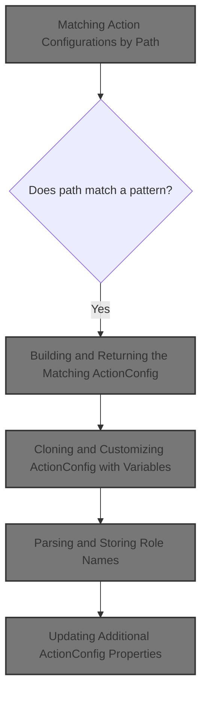
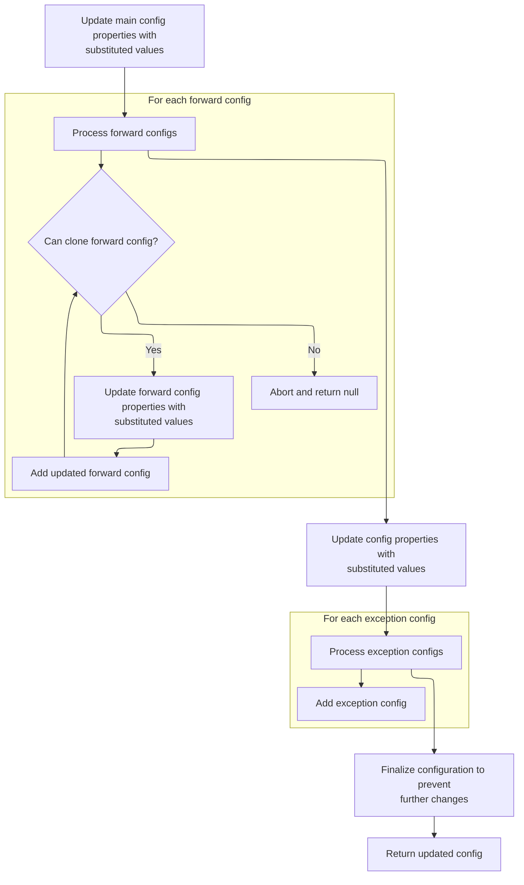

This document outlines how incoming paths are matched to configuration templates and how the resulting configuration is customized using variables from the path. The process enables dynamic routing and flexible behavior based on the structure of the incoming path.



# Whitespace Tokenization in Validation Lexer

<SwmSnippet path="/core/src/main/java/org/apache/struts/validator/validwhen/ValidWhenLexer.java" line="202">

---

In <SwmToken path="core/src/main/java/org/apache/struts/validator/validwhen/ValidWhenLexer.java" pos="202:7:7" line-data="	public final void mWS(boolean _createToken) throws RecognitionException, CharStreamException, TokenStreamException {">`mWS`</SwmToken>, the lexer loops through the input, matching and consuming spaces, tabs, newlines, and carriage returns. If it hits a non-whitespace character before seeing at least one whitespace, it throws. This sets up the input for further parsing, so the next step is to move to <SwmToken path="core/src/main/java/org/apache/struts/config/ActionConfigMatcher.java" pos="47:4:4" line-data="public class ActionConfigMatcher implements Serializable {">`ActionConfigMatcher`</SwmToken> to start matching action configs once whitespace is out of the way.

```java
	public final void mWS(boolean _createToken) throws RecognitionException, CharStreamException, TokenStreamException {
		int _ttype; Token _token=null; int _begin=text.length();
		_ttype = WS;
		int _saveIndex;
		
		{
		int _cnt17=0;
		_loop17:
		do {
			switch ( LA(1)) {
			case ' ':
			{
				match(' ');
				break;
			}
			case '\t':
			{
				match('\t');
				break;
			}
			case '\n':
			{
				match('\n');
				break;
			}
			case '\r':
			{
				match('\r');
				break;
			}
			default:
			{
				if ( _cnt17>=1 ) { break _loop17; } else {throw new NoViableAltForCharException((char)LA(1), getFilename(), getLine(), getColumn());}
			}
			}
			_cnt17++;
		} while (true);
		}
```

---

</SwmSnippet>

## Matching Action Configurations by Path

<SwmSnippet path="/core/src/main/java/org/apache/struts/config/ActionConfigMatcher.java" line="101">

---

In <SwmToken path="core/src/main/java/org/apache/struts/config/ActionConfigMatcher.java" pos="101:5:5" line-data="    public ActionConfig match(String path) {">`match`</SwmToken>, we loop through all compiled path patterns, normalizing the input path and preparing a map for wildcard variables. For each pattern, we call WildcardHelper.match to see if the path fits the pattern and to extract any variables. This is needed to handle flexible path matching before we can build a config for the matched path.

```java
    public ActionConfig match(String path) {
        ActionConfig config = null;

        if (compiledPaths.size() > 0) {
            if (log.isDebugEnabled()) {
                log.debug("Attempting to match '" + path
                    + "' to a wildcard pattern");
            }

            if ((path.length() > 0) && (path.charAt(0) == '/')) {
                path = path.substring(1);
            }

            Mapping m;
            HashMap vars = new HashMap();

            for (Iterator i = compiledPaths.iterator(); i.hasNext();) {
                m = (Mapping) i.next();

                if (wildcard.match(vars, path, m.getPattern())) {
                    if (log.isDebugEnabled()) {
                        log.debug("Path matches pattern '"
                            + m.getActionConfig().getPath() + "'");
                    }

```

---

</SwmSnippet>

### Wildcard Pattern Matching for Paths

See <SwmLink doc-title="Pattern Matching with Wildcards">[Pattern Matching with Wildcards](/.swm/pattern-matching-with-wildcards.tb14y72t.sw.md)</SwmLink>

### Building and Returning the Matching <SwmToken path="core/src/main/java/org/apache/struts/config/ActionConfigMatcher.java" pos="101:3:3" line-data="    public ActionConfig match(String path) {">`ActionConfig`</SwmToken>

<SwmSnippet path="/core/src/main/java/org/apache/struts/config/ActionConfigMatcher.java" line="126">

---

Back in `ActionConfigMatcher.match`, after getting a match from <SwmToken path="core/src/main/java/org/apache/struts/config/ActionConfigMatcher.java" pos="27:10:10" line-data="import org.apache.struts.util.WildcardHelper;">`WildcardHelper`</SwmToken>, we try to clone and customize the <SwmToken path="core/src/main/java/org/apache/struts/config/ActionConfigMatcher.java" pos="129:2:2" line-data="                		    (ActionConfig) m.getActionConfig(), vars);">`ActionConfig`</SwmToken> using <SwmToken path="core/src/main/java/org/apache/struts/config/ActionConfigMatcher.java" pos="128:1:1" line-data="                	    convertActionConfig(path,">`convertActionConfig`</SwmToken>. If there's a recursive substitution, we log a warning and skip that config. Next, we call <SwmToken path="core/src/main/java/org/apache/struts/config/ActionConfigMatcher.java" pos="128:1:1" line-data="                	    convertActionConfig(path,">`convertActionConfig`</SwmToken> to generate a config tailored to the matched path and extracted variables.

```java
                    try {
                	config =
                	    convertActionConfig(path,
                		    (ActionConfig) m.getActionConfig(), vars);
                    } catch (IllegalStateException e) {
                	log.warn("Path matches pattern '"
                		+ m.getActionConfig().getPath() + "' but is "
                		+ "incompatible with the matching config due "
                		+ "to recursive substitution: "
                		+ path);
                	config = null;
                    }
                }
            }
        }

        return config;
    }
```

---

</SwmSnippet>

## Cloning and Customizing <SwmToken path="core/src/main/java/org/apache/struts/config/ActionConfigMatcher.java" pos="101:3:3" line-data="    public ActionConfig match(String path) {">`ActionConfig`</SwmToken> with Variables

<SwmSnippet path="/core/src/main/java/org/apache/struts/config/ActionConfigMatcher.java" line="157">

---

In <SwmToken path="core/src/main/java/org/apache/struts/config/ActionConfigMatcher.java" pos="157:5:5" line-data="    protected ActionConfig convertActionConfig(String path, ActionConfig orig,">`convertActionConfig`</SwmToken>, we clone the original <SwmToken path="core/src/main/java/org/apache/struts/config/ActionConfigMatcher.java" pos="157:3:3" line-data="    protected ActionConfig convertActionConfig(String path, ActionConfig orig,">`ActionConfig`</SwmToken> to avoid mutating shared state. Then we start updating the clone's properties, beginning with the name, using <SwmToken path="core/src/main/java/org/apache/struts/config/ActionConfigMatcher.java" pos="170:5:5" line-data="        config.setName(convertParam(orig.getName(), vars));">`convertParam`</SwmToken> to swap in any variables. Next, we need to update the path, so we move to <SwmToken path="core/src/main/java/org/apache/struts/config/ActionConfigMatcher.java" pos="176:3:3" line-data="        config.setPath(path);">`setPath`</SwmToken>.

```java
    protected ActionConfig convertActionConfig(String path, ActionConfig orig,
        Map vars) {
        ActionConfig config = null;

        try {
            config = (ActionConfig) BeanUtils.cloneBean(orig);
        } catch (Exception ex) {
            log.warn("Unable to clone action config, recommend not using "
                + "wildcards", ex);

            return null;
        }

        config.setName(convertParam(orig.getName(), vars));
```

---

</SwmSnippet>

<SwmSnippet path="/core/src/main/java/org/apache/struts/config/ActionConfigMatcher.java" line="258">

---

<SwmToken path="core/src/main/java/org/apache/struts/config/ActionConfigMatcher.java" pos="258:5:5" line-data="    protected String convertParam(String val, Map vars) {">`convertParam`</SwmToken> does placeholder replacement in strings using the vars map. It checks for recursive substitutions to avoid infinite loops and expects single-character keys. This is how we swap in path variables for config fields.

```java
    protected String convertParam(String val, Map vars) {
        if (val == null) {
            return null;
        } else if (val.indexOf("{") == -1) {
            return val;
        }

        Map.Entry entry;
        StringBuffer key = new StringBuffer("{0}");
        StringBuffer ret = new StringBuffer(val);
        String keyStr;
        int x;

        for (Iterator i = vars.entrySet().iterator(); i.hasNext();) {
            entry = (Map.Entry) i.next();
            key.setCharAt(1, ((String) entry.getKey()).charAt(0));
            keyStr = key.toString();
            
            // STR-3169
            // Prevent an infinite loop by retaining the placeholders
            // that contain itself in the substitution value
            if (((String) entry.getValue()).contains(keyStr)) {
        	throw new IllegalStateException();
            }
            
            // Replace all instances of the placeholder
            while ((x = ret.toString().indexOf(keyStr)) > -1) {
                ret.replace(x, x + 3, (String) entry.getValue());
            }
        }
```

---

</SwmSnippet>

<SwmSnippet path="/core/src/main/java/org/apache/struts/config/ActionConfigMatcher.java" line="170">

---

Just returned from <SwmToken path="core/src/main/java/org/apache/struts/config/ActionConfigMatcher.java" pos="170:5:5" line-data="        config.setName(convertParam(orig.getName(), vars));">`convertParam`</SwmToken> in <SwmToken path="core/src/main/java/org/apache/struts/config/ActionConfigMatcher.java" pos="47:4:4" line-data="public class ActionConfigMatcher implements Serializable {">`ActionConfigMatcher`</SwmToken>, we now update the config's name. Next, we check and normalize the path to start with '/', then call <SwmToken path="core/src/main/java/org/apache/struts/config/ActionConfigMatcher.java" pos="176:3:3" line-data="        config.setPath(path);">`setPath`</SwmToken> to update the config.

```java
        config.setName(convertParam(orig.getName(), vars));

```

---

</SwmSnippet>

<SwmSnippet path="/core/src/main/java/org/apache/struts/config/ActionConfig.java" line="517">

---

<SwmToken path="core/src/main/java/org/apache/struts/config/ActionConfig.java" pos="517:5:5" line-data="    public void setName(String name) {">`setName`</SwmToken> updates the config's name, but only if the configuration isn't frozen (checked by the 'configured' flag). If frozen, it throws. This prevents accidental changes after config is finalized.

```java
    public void setName(String name) {
        if (configured) {
            throw new IllegalStateException("Configuration is frozen");
        }

        this.name = name;
    }
```

---

</SwmSnippet>

<SwmSnippet path="/core/src/main/java/org/apache/struts/config/ActionConfigMatcher.java" line="172">

---

Just returned from <SwmToken path="core/src/main/java/org/apache/struts/config/ActionConfigMatcher.java" pos="170:3:3" line-data="        config.setName(convertParam(orig.getName(), vars));">`setName`</SwmToken> in <SwmToken path="core/src/main/java/org/apache/struts/config/ActionConfigMatcher.java" pos="101:3:3" line-data="    public ActionConfig match(String path) {">`ActionConfig`</SwmToken>, we normalize the path to ensure it starts with '/'. Next, we call <SwmToken path="core/src/main/java/org/apache/struts/config/ActionConfigMatcher.java" pos="176:3:3" line-data="        config.setPath(path);">`setPath`</SwmToken> to update the config with the correct path format.

```java
        if ((path.length() == 0) || (path.charAt(0) != '/')) {
            path = "/" + path;
        }

        config.setPath(path);
```

---

</SwmSnippet>

<SwmSnippet path="/core/src/main/java/org/apache/struts/config/ActionConfig.java" line="565">

---

<SwmToken path="core/src/main/java/org/apache/struts/config/ActionConfig.java" pos="565:5:5" line-data="    public void setPath(String path) {">`setPath`</SwmToken> updates the config's path, but only if the configuration isn't frozen. Throws if you try to change it after freezing, enforcing immutability.

```java
    public void setPath(String path) {
        if (configured) {
            throw new IllegalStateException("Configuration is frozen");
        }

        this.path = path;
    }
```

---

</SwmSnippet>

<SwmSnippet path="/core/src/main/java/org/apache/struts/config/ActionConfigMatcher.java" line="177">

---

Just returned from <SwmToken path="core/src/main/java/org/apache/struts/config/ActionConfigMatcher.java" pos="176:3:3" line-data="        config.setPath(path);">`setPath`</SwmToken> in <SwmToken path="core/src/main/java/org/apache/struts/config/ActionConfigMatcher.java" pos="101:3:3" line-data="    public ActionConfig match(String path) {">`ActionConfig`</SwmToken>, we now update the config's type using the converted value. Next, we call <SwmToken path="core/src/main/java/org/apache/struts/config/ActionConfigMatcher.java" pos="177:3:3" line-data="        config.setType(convertParam(orig.getType(), vars));">`setType`</SwmToken> to finish updating the core properties.

```java
        config.setType(convertParam(orig.getType(), vars));
```

---

</SwmSnippet>

<SwmSnippet path="/core/src/main/java/org/apache/struts/config/ActionConfigMatcher.java" line="177">

---

Just returned from <SwmToken path="core/src/main/java/org/apache/struts/config/ActionConfigMatcher.java" pos="177:5:5" line-data="        config.setType(convertParam(orig.getType(), vars));">`convertParam`</SwmToken> for type in <SwmToken path="core/src/main/java/org/apache/struts/config/ActionConfigMatcher.java" pos="47:4:4" line-data="public class ActionConfigMatcher implements Serializable {">`ActionConfigMatcher`</SwmToken>, we now call <SwmToken path="core/src/main/java/org/apache/struts/config/ActionConfigMatcher.java" pos="177:3:3" line-data="        config.setType(convertParam(orig.getType(), vars));">`setType`</SwmToken> to update the config's type. Next, we move on to updating roles.

```java
        config.setType(convertParam(orig.getType(), vars));
```

---

</SwmSnippet>

<SwmSnippet path="/core/src/main/java/org/apache/struts/config/ActionConfig.java" line="788">

---

<SwmToken path="core/src/main/java/org/apache/struts/config/ActionConfig.java" pos="788:5:5" line-data="    public void setType(String type) {">`setType`</SwmToken> updates the config's type, but only if the configuration isn't frozen. Throws if you try to change it after freezing, so you can't mess with finalized configs.

```java
    public void setType(String type) {
        if (configured) {
            throw new IllegalStateException("Configuration is frozen");
        }

        this.type = type;
    }
```

---

</SwmSnippet>

<SwmSnippet path="/core/src/main/java/org/apache/struts/config/ActionConfigMatcher.java" line="178">

---

Just returned from <SwmToken path="core/src/main/java/org/apache/struts/config/ActionConfigMatcher.java" pos="177:3:3" line-data="        config.setType(convertParam(orig.getType(), vars));">`setType`</SwmToken> in <SwmToken path="core/src/main/java/org/apache/struts/config/ActionConfigMatcher.java" pos="101:3:3" line-data="    public ActionConfig match(String path) {">`ActionConfig`</SwmToken>, we now update the config's roles using the converted value. Next, we call <SwmToken path="core/src/main/java/org/apache/struts/config/ActionConfigMatcher.java" pos="178:3:3" line-data="        config.setRoles(convertParam(orig.getRoles(), vars));">`setRoles`</SwmToken> to parse and store the roles.

```java
        config.setRoles(convertParam(orig.getRoles(), vars));
```

---

</SwmSnippet>

<SwmSnippet path="/core/src/main/java/org/apache/struts/config/ActionConfigMatcher.java" line="178">

---

Just returned from <SwmToken path="core/src/main/java/org/apache/struts/config/ActionConfigMatcher.java" pos="178:5:5" line-data="        config.setRoles(convertParam(orig.getRoles(), vars));">`convertParam`</SwmToken> for roles in <SwmToken path="core/src/main/java/org/apache/struts/config/ActionConfigMatcher.java" pos="47:4:4" line-data="public class ActionConfigMatcher implements Serializable {">`ActionConfigMatcher`</SwmToken>, we now call <SwmToken path="core/src/main/java/org/apache/struts/config/ActionConfigMatcher.java" pos="178:3:3" line-data="        config.setRoles(convertParam(orig.getRoles(), vars));">`setRoles`</SwmToken> to parse and store the roles. Next, we update the parameter field.

```java
        config.setRoles(convertParam(orig.getRoles(), vars));
```

---

</SwmSnippet>

### Parsing and Storing Role Names

```mermaid
%%{init: {"flowchart": {"defaultRenderer": "elk"}} }%%
flowchart TD
    node1["Attempt to set allowed roles"] --> node2{"Is configuration frozen?"}
    click node1 openCode "core/src/main/java/org/apache/struts/config/ActionConfig.java:597:630"
    node2 -->|"Yes"| node3["Reject change: configuration is frozen"]
    click node2 openCode "core/src/main/java/org/apache/struts/config/ActionConfig.java:598:600"
    click node3 openCode "core/src/main/java/org/apache/struts/config/ActionConfig.java:599:600"
    node2 -->|"No"| node4{"Is roles null?"}
    click node4 openCode "core/src/main/java/org/apache/struts/config/ActionConfig.java:604:608"
    node4 -->|"Yes"| node5["Clear roles list"]
    click node5 openCode "core/src/main/java/org/apache/struts/config/ActionConfig.java:605:607"
    node5 --> node12["Finish"]
    node4 -->|"No"| node6["Begin extracting roles"]
    click node6 openCode "core/src/main/java/org/apache/struts/config/ActionConfig.java:610:612"
    
    subgraph loop1["While roles contains a comma"]
        node6 --> node7["Extract and trim role before comma"]
        click node7 openCode "core/src/main/java/org/apache/struts/config/ActionConfig.java:613:620"
        node7 --> node8["Add role to list"]
        click node8 openCode "core/src/main/java/org/apache/struts/config/ActionConfig.java:619:620"
        node8 --> node9["Remove extracted role from roles"]
        click node9 openCode "core/src/main/java/org/apache/struts/config/ActionConfig.java:620:621"
        node9 --> node6
    end
    node6 --> node10{"Is remaining role non-empty?"}
    click node10 openCode "core/src/main/java/org/apache/struts/config/ActionConfig.java:623:627"
    node10 -->|"Yes"| node11["Add last role to list"]
    click node11 openCode "core/src/main/java/org/apache/struts/config/ActionConfig.java:626:627"
    node10 -->|"No"| node12["Store roles list"]
    node11 --> node12["Store roles list"]
    click node12 openCode "core/src/main/java/org/apache/struts/config/ActionConfig.java:629:630"

classDef HeadingStyle fill:#777777,stroke:#333,stroke-width:2px;

%% Swimm:
%% %%{init: {"flowchart": {"defaultRenderer": "elk"}} }%%
%% flowchart TD
%%     node1["Attempt to set allowed roles"] --> node2{"Is configuration frozen?"}
%%     click node1 openCode "<SwmPath>[core/…/config/ActionConfig.java](core/src/main/java/org/apache/struts/config/ActionConfig.java)</SwmPath>:597:630"
%%     node2 -->|"Yes"| node3["Reject change: configuration is frozen"]
%%     click node2 openCode "<SwmPath>[core/…/config/ActionConfig.java](core/src/main/java/org/apache/struts/config/ActionConfig.java)</SwmPath>:598:600"
%%     click node3 openCode "<SwmPath>[core/…/config/ActionConfig.java](core/src/main/java/org/apache/struts/config/ActionConfig.java)</SwmPath>:599:600"
%%     node2 -->|"No"| node4{"Is roles null?"}
%%     click node4 openCode "<SwmPath>[core/…/config/ActionConfig.java](core/src/main/java/org/apache/struts/config/ActionConfig.java)</SwmPath>:604:608"
%%     node4 -->|"Yes"| node5["Clear roles list"]
%%     click node5 openCode "<SwmPath>[core/…/config/ActionConfig.java](core/src/main/java/org/apache/struts/config/ActionConfig.java)</SwmPath>:605:607"
%%     node5 --> node12["Finish"]
%%     node4 -->|"No"| node6["Begin extracting roles"]
%%     click node6 openCode "<SwmPath>[core/…/config/ActionConfig.java](core/src/main/java/org/apache/struts/config/ActionConfig.java)</SwmPath>:610:612"
%%     
%%     subgraph loop1["While roles contains a comma"]
%%         node6 --> node7["Extract and trim role before comma"]
%%         click node7 openCode "<SwmPath>[core/…/config/ActionConfig.java](core/src/main/java/org/apache/struts/config/ActionConfig.java)</SwmPath>:613:620"
%%         node7 --> node8["Add role to list"]
%%         click node8 openCode "<SwmPath>[core/…/config/ActionConfig.java](core/src/main/java/org/apache/struts/config/ActionConfig.java)</SwmPath>:619:620"
%%         node8 --> node9["Remove extracted role from roles"]
%%         click node9 openCode "<SwmPath>[core/…/config/ActionConfig.java](core/src/main/java/org/apache/struts/config/ActionConfig.java)</SwmPath>:620:621"
%%         node9 --> node6
%%     end
%%     node6 --> node10{"Is remaining role non-empty?"}
%%     click node10 openCode "<SwmPath>[core/…/config/ActionConfig.java](core/src/main/java/org/apache/struts/config/ActionConfig.java)</SwmPath>:623:627"
%%     node10 -->|"Yes"| node11["Add last role to list"]
%%     click node11 openCode "<SwmPath>[core/…/config/ActionConfig.java](core/src/main/java/org/apache/struts/config/ActionConfig.java)</SwmPath>:626:627"
%%     node10 -->|"No"| node12["Store roles list"]
%%     node11 --> node12["Store roles list"]
%%     click node12 openCode "<SwmPath>[core/…/config/ActionConfig.java](core/src/main/java/org/apache/struts/config/ActionConfig.java)</SwmPath>:629:630"
%% 
%% classDef HeadingStyle fill:#777777,stroke:#333,stroke-width:2px;
```



<SwmSnippet path="/core/src/main/java/org/apache/struts/config/ActionConfig.java" line="597">

---

In <SwmToken path="core/src/main/java/org/apache/struts/config/ActionConfig.java" pos="597:5:5" line-data="    public void setRoles(String roles) {">`setRoles`</SwmToken>, the roles string is split on commas, trimmed, and stored as an array. Throws if config is frozen. Assumes input is a comma-separated list.

```java
    public void setRoles(String roles) {
        if (configured) {
            throw new IllegalStateException("Configuration is frozen");
        }

        this.roles = roles;

        if (roles == null) {
            roleNames = new String[0];

            return;
        }

        ArrayList list = new ArrayList();

        while (true) {
            int comma = roles.indexOf(',');

            if (comma < 0) {
                break;
            }

            list.add(roles.substring(0, comma).trim());
            roles = roles.substring(comma + 1);
        }
```

---

</SwmSnippet>

<SwmSnippet path="/core/src/main/java/org/apache/struts/config/ActionConfig.java" line="623">

---

Finally, after splitting and trimming, the remaining role (if any) is added, and the list is converted to an array for <SwmToken path="core/src/main/java/org/apache/struts/config/ActionConfig.java" pos="629:1:1" line-data="        roleNames = (String[]) list.toArray(new String[list.size()]);">`roleNames`</SwmToken>.

```java
        roles = roles.trim();

        if (roles.length() > 0) {
            list.add(roles);
        }

        roleNames = (String[]) list.toArray(new String[list.size()]);
    }
```

---

</SwmSnippet>

### Updating Additional <SwmToken path="core/src/main/java/org/apache/struts/config/ActionConfigMatcher.java" pos="101:3:3" line-data="    public ActionConfig match(String path) {">`ActionConfig`</SwmToken> Properties



<SwmSnippet path="/core/src/main/java/org/apache/struts/config/ActionConfigMatcher.java" line="179">

---

Just returned from <SwmToken path="core/src/main/java/org/apache/struts/config/ActionConfigMatcher.java" pos="178:3:3" line-data="        config.setRoles(convertParam(orig.getRoles(), vars));">`setRoles`</SwmToken> in <SwmToken path="core/src/main/java/org/apache/struts/config/ActionConfigMatcher.java" pos="101:3:3" line-data="    public ActionConfig match(String path) {">`ActionConfig`</SwmToken>, we now update the config's parameter using the converted value. Next, we call <SwmToken path="core/src/main/java/org/apache/struts/config/ActionConfigMatcher.java" pos="179:3:3" line-data="        config.setParameter(convertParam(orig.getParameter(), vars));">`setParameter`</SwmToken> to store it.

```java
        config.setParameter(convertParam(orig.getParameter(), vars));
```

---

</SwmSnippet>

<SwmSnippet path="/core/src/main/java/org/apache/struts/config/ActionConfigMatcher.java" line="179">

---

Just returned from <SwmToken path="core/src/main/java/org/apache/struts/config/ActionConfigMatcher.java" pos="179:5:5" line-data="        config.setParameter(convertParam(orig.getParameter(), vars));">`convertParam`</SwmToken> for parameter in <SwmToken path="core/src/main/java/org/apache/struts/config/ActionConfigMatcher.java" pos="47:4:4" line-data="public class ActionConfigMatcher implements Serializable {">`ActionConfigMatcher`</SwmToken>, we now call <SwmToken path="core/src/main/java/org/apache/struts/config/ActionConfigMatcher.java" pos="179:3:3" line-data="        config.setParameter(convertParam(orig.getParameter(), vars));">`setParameter`</SwmToken> to update the config. Next, we move on to updating the attribute field.

```java
        config.setParameter(convertParam(orig.getParameter(), vars));
```

---

</SwmSnippet>

<SwmSnippet path="/core/src/main/java/org/apache/struts/config/ActionConfig.java" line="541">

---

<SwmToken path="core/src/main/java/org/apache/struts/config/ActionConfig.java" pos="541:5:5" line-data="    public void setParameter(String parameter) {">`setParameter`</SwmToken> updates the config's parameter, but only if the configuration isn't frozen. Throws if you try to change it after freezing.

```java
    public void setParameter(String parameter) {
        if (configured) {
            throw new IllegalStateException("Configuration is frozen");
        }

        this.parameter = parameter;
    }
```

---

</SwmSnippet>

<SwmSnippet path="/core/src/main/java/org/apache/struts/config/ActionConfigMatcher.java" line="180">

---

Just returned from <SwmToken path="core/src/main/java/org/apache/struts/config/ActionConfigMatcher.java" pos="179:3:3" line-data="        config.setParameter(convertParam(orig.getParameter(), vars));">`setParameter`</SwmToken> in <SwmToken path="core/src/main/java/org/apache/struts/config/ActionConfigMatcher.java" pos="101:3:3" line-data="    public ActionConfig match(String path) {">`ActionConfig`</SwmToken>, we now update the config's attribute using the converted value. Next, we call <SwmToken path="core/src/main/java/org/apache/struts/config/ActionConfigMatcher.java" pos="180:3:3" line-data="        config.setAttribute(convertParam(orig.getAttribute(), vars));">`setAttribute`</SwmToken> to store it.

```java
        config.setAttribute(convertParam(orig.getAttribute(), vars));
```

---

</SwmSnippet>

<SwmSnippet path="/core/src/main/java/org/apache/struts/config/ActionConfigMatcher.java" line="180">

---

Just returned from <SwmToken path="core/src/main/java/org/apache/struts/config/ActionConfigMatcher.java" pos="180:5:5" line-data="        config.setAttribute(convertParam(orig.getAttribute(), vars));">`convertParam`</SwmToken> for attribute in <SwmToken path="core/src/main/java/org/apache/struts/config/ActionConfigMatcher.java" pos="47:4:4" line-data="public class ActionConfigMatcher implements Serializable {">`ActionConfigMatcher`</SwmToken>, we now call <SwmToken path="core/src/main/java/org/apache/struts/config/ActionConfigMatcher.java" pos="180:3:3" line-data="        config.setAttribute(convertParam(orig.getAttribute(), vars));">`setAttribute`</SwmToken> to update the config. Next, we move on to updating the forward field.

```java
        config.setAttribute(convertParam(orig.getAttribute(), vars));
```

---

</SwmSnippet>

<SwmSnippet path="/core/src/main/java/org/apache/struts/config/ActionConfig.java" line="337">

---

<SwmToken path="core/src/main/java/org/apache/struts/config/ActionConfig.java" pos="337:5:5" line-data="    public void setAttribute(String attribute) {">`setAttribute`</SwmToken> updates the config's attribute, but only if the configuration isn't frozen. Throws if you try to change it after freezing.

```java
    public void setAttribute(String attribute) {
        if (configured) {
            throw new IllegalStateException("Configuration is frozen");
        }

        this.attribute = attribute;
    }
```

---

</SwmSnippet>

<SwmSnippet path="/core/src/main/java/org/apache/struts/config/ActionConfigMatcher.java" line="181">

---

Just returned from <SwmToken path="core/src/main/java/org/apache/struts/config/ActionConfigMatcher.java" pos="180:3:3" line-data="        config.setAttribute(convertParam(orig.getAttribute(), vars));">`setAttribute`</SwmToken> in <SwmToken path="core/src/main/java/org/apache/struts/config/ActionConfigMatcher.java" pos="101:3:3" line-data="    public ActionConfig match(String path) {">`ActionConfig`</SwmToken>, we now update the config's forward field using the converted value. Next, we call <SwmToken path="core/src/main/java/org/apache/struts/config/ActionConfigMatcher.java" pos="181:3:3" line-data="        config.setForward(convertParam(orig.getForward(), vars));">`setForward`</SwmToken> to store it.

```java
        config.setForward(convertParam(orig.getForward(), vars));
```

---

</SwmSnippet>

<SwmSnippet path="/core/src/main/java/org/apache/struts/config/ActionConfigMatcher.java" line="181">

---

Just returned from <SwmToken path="core/src/main/java/org/apache/struts/config/ActionConfigMatcher.java" pos="181:5:5" line-data="        config.setForward(convertParam(orig.getForward(), vars));">`convertParam`</SwmToken> for forward in <SwmToken path="core/src/main/java/org/apache/struts/config/ActionConfigMatcher.java" pos="47:4:4" line-data="public class ActionConfigMatcher implements Serializable {">`ActionConfigMatcher`</SwmToken>, we now call <SwmToken path="core/src/main/java/org/apache/struts/config/ActionConfigMatcher.java" pos="181:3:3" line-data="        config.setForward(convertParam(orig.getForward(), vars));">`setForward`</SwmToken> to update the config. Next, we move on to updating the include field.

```java
        config.setForward(convertParam(orig.getForward(), vars));
```

---

</SwmSnippet>

<SwmSnippet path="/core/src/main/java/org/apache/struts/config/ActionConfig.java" line="419">

---

<SwmToken path="core/src/main/java/org/apache/struts/config/ActionConfig.java" pos="419:5:5" line-data="    public void setForward(String forward) {">`setForward`</SwmToken> updates the config's forward field, but only if the configuration isn't frozen. Throws if you try to change it after freezing.

```java
    public void setForward(String forward) {
        if (configured) {
            throw new IllegalStateException("Configuration is frozen");
        }

        this.forward = forward;
    }
```

---

</SwmSnippet>

<SwmSnippet path="/core/src/main/java/org/apache/struts/config/ActionConfigMatcher.java" line="182">

---

Just returned from <SwmToken path="core/src/main/java/org/apache/struts/config/ActionConfigMatcher.java" pos="181:3:3" line-data="        config.setForward(convertParam(orig.getForward(), vars));">`setForward`</SwmToken> in <SwmToken path="core/src/main/java/org/apache/struts/config/ActionConfigMatcher.java" pos="101:3:3" line-data="    public ActionConfig match(String path) {">`ActionConfig`</SwmToken>, we now update the config's include field using the converted value. Next, we call <SwmToken path="core/src/main/java/org/apache/struts/config/ActionConfigMatcher.java" pos="182:3:3" line-data="        config.setInclude(convertParam(orig.getInclude(), vars));">`setInclude`</SwmToken> to store it.

```java
        config.setInclude(convertParam(orig.getInclude(), vars));
```

---

</SwmSnippet>

<SwmSnippet path="/core/src/main/java/org/apache/struts/config/ActionConfigMatcher.java" line="182">

---

Just returned from <SwmToken path="core/src/main/java/org/apache/struts/config/ActionConfigMatcher.java" pos="182:5:5" line-data="        config.setInclude(convertParam(orig.getInclude(), vars));">`convertParam`</SwmToken> for include in <SwmToken path="core/src/main/java/org/apache/struts/config/ActionConfigMatcher.java" pos="47:4:4" line-data="public class ActionConfigMatcher implements Serializable {">`ActionConfigMatcher`</SwmToken>, we now call <SwmToken path="core/src/main/java/org/apache/struts/config/ActionConfigMatcher.java" pos="182:3:3" line-data="        config.setInclude(convertParam(orig.getInclude(), vars));">`setInclude`</SwmToken> to update the config. Next, we move on to updating the input field.

```java
        config.setInclude(convertParam(orig.getInclude(), vars));
```

---

</SwmSnippet>

<SwmSnippet path="/core/src/main/java/org/apache/struts/config/ActionConfig.java" line="446">

---

<SwmToken path="core/src/main/java/org/apache/struts/config/ActionConfig.java" pos="446:5:5" line-data="    public void setInclude(String include) {">`setInclude`</SwmToken> updates the config's include field, but only if the configuration isn't frozen. Throws if you try to change it after freezing.

```java
    public void setInclude(String include) {
        if (configured) {
            throw new IllegalStateException("Configuration is frozen");
        }

        this.include = include;
    }
```

---

</SwmSnippet>

<SwmSnippet path="/core/src/main/java/org/apache/struts/config/ActionConfigMatcher.java" line="183">

---

Just returned from <SwmToken path="core/src/main/java/org/apache/struts/config/ActionConfigMatcher.java" pos="182:3:3" line-data="        config.setInclude(convertParam(orig.getInclude(), vars));">`setInclude`</SwmToken> in <SwmToken path="core/src/main/java/org/apache/struts/config/ActionConfigMatcher.java" pos="101:3:3" line-data="    public ActionConfig match(String path) {">`ActionConfig`</SwmToken>, we now update the config's input field using the converted value. Next, we call <SwmToken path="core/src/main/java/org/apache/struts/config/ActionConfigMatcher.java" pos="183:3:3" line-data="        config.setInput(convertParam(orig.getInput(), vars));">`setInput`</SwmToken> to store it.

```java
        config.setInput(convertParam(orig.getInput(), vars));
```

---

</SwmSnippet>

<SwmSnippet path="/core/src/main/java/org/apache/struts/config/ActionConfigMatcher.java" line="183">

---

Just returned from <SwmToken path="core/src/main/java/org/apache/struts/config/ActionConfigMatcher.java" pos="183:5:5" line-data="        config.setInput(convertParam(orig.getInput(), vars));">`convertParam`</SwmToken> for input in <SwmToken path="core/src/main/java/org/apache/struts/config/ActionConfigMatcher.java" pos="47:4:4" line-data="public class ActionConfigMatcher implements Serializable {">`ActionConfigMatcher`</SwmToken>, we now call <SwmToken path="core/src/main/java/org/apache/struts/config/ActionConfigMatcher.java" pos="183:3:3" line-data="        config.setInput(convertParam(orig.getInput(), vars));">`setInput`</SwmToken> to update the config. Next, we move on to updating the catalog field.

```java
        config.setInput(convertParam(orig.getInput(), vars));
```

---

</SwmSnippet>

<SwmSnippet path="/core/src/main/java/org/apache/struts/config/ActionConfig.java" line="473">

---

<SwmToken path="core/src/main/java/org/apache/struts/config/ActionConfig.java" pos="473:5:5" line-data="    public void setInput(String input) {">`setInput`</SwmToken> updates the config's input field, but only if the configuration isn't frozen. Throws if you try to change it after freezing.

```java
    public void setInput(String input) {
        if (configured) {
            throw new IllegalStateException("Configuration is frozen");
        }

        this.input = input;
    }
```

---

</SwmSnippet>

<SwmSnippet path="/core/src/main/java/org/apache/struts/config/ActionConfigMatcher.java" line="184">

---

Just returned from <SwmToken path="core/src/main/java/org/apache/struts/config/ActionConfigMatcher.java" pos="183:3:3" line-data="        config.setInput(convertParam(orig.getInput(), vars));">`setInput`</SwmToken> in <SwmToken path="core/src/main/java/org/apache/struts/config/ActionConfigMatcher.java" pos="101:3:3" line-data="    public ActionConfig match(String path) {">`ActionConfig`</SwmToken>, we now update the config's catalog field using the converted value. Next, we call <SwmToken path="core/src/main/java/org/apache/struts/config/ActionConfigMatcher.java" pos="184:3:3" line-data="        config.setCatalog(convertParam(orig.getCatalog(), vars));">`setCatalog`</SwmToken> to store it.

```java
        config.setCatalog(convertParam(orig.getCatalog(), vars));
```

---

</SwmSnippet>

<SwmSnippet path="/core/src/main/java/org/apache/struts/config/ActionConfigMatcher.java" line="184">

---

Just returned from <SwmToken path="core/src/main/java/org/apache/struts/config/ActionConfigMatcher.java" pos="184:5:5" line-data="        config.setCatalog(convertParam(orig.getCatalog(), vars));">`convertParam`</SwmToken> for catalog in <SwmToken path="core/src/main/java/org/apache/struts/config/ActionConfigMatcher.java" pos="47:4:4" line-data="public class ActionConfigMatcher implements Serializable {">`ActionConfigMatcher`</SwmToken>, we now call <SwmToken path="core/src/main/java/org/apache/struts/config/ActionConfigMatcher.java" pos="184:3:3" line-data="        config.setCatalog(convertParam(orig.getCatalog(), vars));">`setCatalog`</SwmToken> to update the config. This wraps up the property updates for the cloned config.

```java
        config.setCatalog(convertParam(orig.getCatalog(), vars));
```

---

</SwmSnippet>

<SwmSnippet path="/core/src/main/java/org/apache/struts/config/ActionConfig.java" line="882">

---

SetCatalog checks if the config is frozen (configured == true) and throws if you try to change it after that. Only updates the catalog if the config isn't finalized, so you can't mess with it later.

```java
    public void setCatalog(String catalog) {
        if (configured) {
            throw new IllegalStateException("Configuration is frozen");
        }

        this.catalog = catalog;
    }
```

---

</SwmSnippet>

<SwmSnippet path="/core/src/main/java/org/apache/struts/config/ActionConfigMatcher.java" line="185">

---

After updating catalog, <SwmToken path="core/src/main/java/org/apache/struts/config/ActionConfigMatcher.java" pos="47:4:4" line-data="public class ActionConfigMatcher implements Serializable {">`ActionConfigMatcher`</SwmToken> moves on to <SwmToken path="core/src/main/java/org/apache/struts/config/ActionConfigMatcher.java" pos="185:3:3" line-data="        config.setCommand(convertParam(orig.getCommand(), vars));">`setCommand`</SwmToken>, using <SwmToken path="core/src/main/java/org/apache/struts/config/ActionConfigMatcher.java" pos="185:5:5" line-data="        config.setCommand(convertParam(orig.getCommand(), vars));">`convertParam`</SwmToken> to swap in any variables. This keeps the config customization going for each property.

```java
        config.setCommand(convertParam(orig.getCommand(), vars));
```

---

</SwmSnippet>

<SwmSnippet path="/core/src/main/java/org/apache/struts/config/ActionConfigMatcher.java" line="185">

---

<SwmToken path="core/src/main/java/org/apache/struts/config/ActionConfigMatcher.java" pos="47:4:4" line-data="public class ActionConfigMatcher implements Serializable {">`ActionConfigMatcher`</SwmToken> calls <SwmToken path="core/src/main/java/org/apache/struts/config/ActionConfigMatcher.java" pos="185:3:3" line-data="        config.setCommand(convertParam(orig.getCommand(), vars));">`setCommand`</SwmToken> on the config to update the command string with any variable substitutions. This keeps the config in sync with the matched path.

```java
        config.setCommand(convertParam(orig.getCommand(), vars));
```

---

</SwmSnippet>

<SwmSnippet path="/core/src/main/java/org/apache/struts/config/ActionConfig.java" line="864">

---

SetCommand checks if the config is frozen and throws if you try to change the command after that. Only updates the command if the config isn't finalized.

```java
    public void setCommand(String command) {
        if (configured) {
            throw new IllegalStateException("Configuration is frozen");
        }

        this.command = command;
    }
```

---

</SwmSnippet>

<SwmSnippet path="/core/src/main/java/org/apache/struts/config/ActionConfigMatcher.java" line="186">

---

After updating command, <SwmToken path="core/src/main/java/org/apache/struts/config/ActionConfigMatcher.java" pos="47:4:4" line-data="public class ActionConfigMatcher implements Serializable {">`ActionConfigMatcher`</SwmToken> calls <SwmToken path="core/src/main/java/org/apache/struts/config/ActionConfigMatcher.java" pos="186:3:3" line-data="        config.setMultipartClass(convertParam(orig.getMultipartClass(), vars));">`setMultipartClass`</SwmToken> to update the multipart handler class with any variable substitutions. Just moving down the list of fields to customize.

```java
        config.setMultipartClass(convertParam(orig.getMultipartClass(), vars));
```

---

</SwmSnippet>

<SwmSnippet path="/core/src/main/java/org/apache/struts/config/ActionConfigMatcher.java" line="186">

---

<SwmToken path="core/src/main/java/org/apache/struts/config/ActionConfigMatcher.java" pos="47:4:4" line-data="public class ActionConfigMatcher implements Serializable {">`ActionConfigMatcher`</SwmToken> calls <SwmToken path="core/src/main/java/org/apache/struts/config/ActionConfigMatcher.java" pos="186:3:3" line-data="        config.setMultipartClass(convertParam(orig.getMultipartClass(), vars));">`setMultipartClass`</SwmToken> on the config to update the multipart handler class string with any variable substitutions. Keeps the config in sync with the matched path.

```java
        config.setMultipartClass(convertParam(orig.getMultipartClass(), vars));
```

---

</SwmSnippet>

<SwmSnippet path="/core/src/main/java/org/apache/struts/config/ActionConfig.java" line="499">

---

SetMultipartClass checks if the config is frozen and throws if you try to change the multipart handler after that. Only updates the handler if the config isn't finalized.

```java
    public void setMultipartClass(String multipartClass) {
        if (configured) {
            throw new IllegalStateException("Configuration is frozen");
        }

        this.multipartClass = multipartClass;
    }
```

---

</SwmSnippet>

<SwmSnippet path="/core/src/main/java/org/apache/struts/config/ActionConfigMatcher.java" line="187">

---

After updating <SwmToken path="core/src/main/java/org/apache/struts/config/ActionConfig.java" pos="499:9:9" line-data="    public void setMultipartClass(String multipartClass) {">`multipartClass`</SwmToken>, <SwmToken path="core/src/main/java/org/apache/struts/config/ActionConfigMatcher.java" pos="47:4:4" line-data="public class ActionConfigMatcher implements Serializable {">`ActionConfigMatcher`</SwmToken> calls <SwmToken path="core/src/main/java/org/apache/struts/config/ActionConfigMatcher.java" pos="187:3:3" line-data="        config.setPrefix(convertParam(orig.getPrefix(), vars));">`setPrefix`</SwmToken> to update the prefix with any variable substitutions. Just moving down the list of fields to customize.

```java
        config.setPrefix(convertParam(orig.getPrefix(), vars));
```

---

</SwmSnippet>

<SwmSnippet path="/core/src/main/java/org/apache/struts/config/ActionConfigMatcher.java" line="187">

---

<SwmToken path="core/src/main/java/org/apache/struts/config/ActionConfigMatcher.java" pos="47:4:4" line-data="public class ActionConfigMatcher implements Serializable {">`ActionConfigMatcher`</SwmToken> calls <SwmToken path="core/src/main/java/org/apache/struts/config/ActionConfigMatcher.java" pos="187:3:3" line-data="        config.setPrefix(convertParam(orig.getPrefix(), vars));">`setPrefix`</SwmToken> on the config to update the prefix string with any variable substitutions. Keeps the config in sync with the matched path.

```java
        config.setPrefix(convertParam(orig.getPrefix(), vars));
```

---

</SwmSnippet>

<SwmSnippet path="/core/src/main/java/org/apache/struts/config/ActionConfig.java" line="585">

---

SetPrefix checks if the config is frozen and throws if you try to change the prefix after that. Only updates the prefix if the config isn't finalized.

```java
    public void setPrefix(String prefix) {
        if (configured) {
            throw new IllegalStateException("Configuration is frozen");
        }

        this.prefix = prefix;
    }
```

---

</SwmSnippet>

<SwmSnippet path="/core/src/main/java/org/apache/struts/config/ActionConfigMatcher.java" line="188">

---

After updating prefix, <SwmToken path="core/src/main/java/org/apache/struts/config/ActionConfigMatcher.java" pos="47:4:4" line-data="public class ActionConfigMatcher implements Serializable {">`ActionConfigMatcher`</SwmToken> calls <SwmToken path="core/src/main/java/org/apache/struts/config/ActionConfigMatcher.java" pos="188:3:3" line-data="        config.setSuffix(convertParam(orig.getSuffix(), vars));">`setSuffix`</SwmToken> to update the suffix with any variable substitutions. Just moving down the list of fields to customize.

```java
        config.setSuffix(convertParam(orig.getSuffix(), vars));
```

---

</SwmSnippet>

<SwmSnippet path="/core/src/main/java/org/apache/struts/config/ActionConfigMatcher.java" line="188">

---

<SwmToken path="core/src/main/java/org/apache/struts/config/ActionConfigMatcher.java" pos="47:4:4" line-data="public class ActionConfigMatcher implements Serializable {">`ActionConfigMatcher`</SwmToken> calls <SwmToken path="core/src/main/java/org/apache/struts/config/ActionConfigMatcher.java" pos="188:3:3" line-data="        config.setSuffix(convertParam(orig.getSuffix(), vars));">`setSuffix`</SwmToken> on the cloned config to update the suffix string with any variable substitutions. This keeps the original config untouched and lets us customize for each path.

```java
        config.setSuffix(convertParam(orig.getSuffix(), vars));

```

---

</SwmSnippet>

<SwmSnippet path="/core/src/main/java/org/apache/struts/config/ActionConfig.java" line="776">

---

SetSuffix checks if the config is frozen and throws if you try to change the suffix after that. Only updates the suffix if the config isn't finalized.

```java
    public void setSuffix(String suffix) {
        if (configured) {
            throw new IllegalStateException("Configuration is frozen");
        }

        this.suffix = suffix;
    }
```

---

</SwmSnippet>

<SwmSnippet path="/core/src/main/java/org/apache/struts/config/ActionConfigMatcher.java" line="190">

---

<SwmToken path="core/src/main/java/org/apache/struts/config/ActionConfigMatcher.java" pos="47:4:4" line-data="public class ActionConfigMatcher implements Serializable {">`ActionConfigMatcher`</SwmToken> loops through each <SwmToken path="core/src/main/java/org/apache/struts/config/ActionConfigMatcher.java" pos="190:1:1" line-data="        ForwardConfig[] fConfigs = orig.findForwardConfigs();">`ForwardConfig`</SwmToken>, clones it, updates its fields with variable substitutions, and swaps it into the cloned <SwmToken path="core/src/main/java/org/apache/struts/config/ActionConfigMatcher.java" pos="101:3:3" line-data="    public ActionConfig match(String path) {">`ActionConfig`</SwmToken>. This way, all forwards are tailored for the matched path.

```java
        ForwardConfig[] fConfigs = orig.findForwardConfigs();
        ForwardConfig cfg;

        for (int x = 0; x < fConfigs.length; x++) {
            try {
                cfg = (ActionForward) BeanUtils.cloneBean(fConfigs[x]);
            } catch (Exception ex) {
                log.warn("Unable to clone action config, recommend not using "
                        + "wildcards", ex);
                return null;
            }
            cfg.setName(fConfigs[x].getName());
            cfg.setPath(convertParam(fConfigs[x].getPath(), vars));
```

---

</SwmSnippet>

<SwmSnippet path="/core/src/main/java/org/apache/struts/config/ActionConfigMatcher.java" line="202">

---

After updating <SwmToken path="core/src/main/java/org/apache/struts/config/ActionConfigMatcher.java" pos="190:1:1" line-data="        ForwardConfig[] fConfigs = orig.findForwardConfigs();">`ForwardConfig`</SwmToken>, <SwmToken path="core/src/main/java/org/apache/struts/config/ActionConfigMatcher.java" pos="47:4:4" line-data="public class ActionConfigMatcher implements Serializable {">`ActionConfigMatcher`</SwmToken> calls <SwmToken path="core/src/main/java/org/apache/struts/config/ActionConfigMatcher.java" pos="202:3:3" line-data="            cfg.setPath(convertParam(fConfigs[x].getPath(), vars));">`setPath`</SwmToken> on <SwmToken path="core/src/main/java/org/apache/struts/config/ActionConfigMatcher.java" pos="217:1:1" line-data="        ExceptionConfig[] exConfigs = orig.findExceptionConfigs();">`ExceptionConfig`</SwmToken> to make sure the path is set right, but doesn't do variable substitutions for these fields.

```java
            cfg.setPath(convertParam(fConfigs[x].getPath(), vars));
```

---

</SwmSnippet>

<SwmSnippet path="/core/src/main/java/org/apache/struts/config/ExceptionConfig.java" line="141">

---

SetPath checks if the config is frozen and throws if you try to change the path after that. Only updates the path if the config isn't finalized.

```java
    public void setPath(String path) {
        if (configured) {
            throw new IllegalStateException("Configuration is frozen");
        }

        this.path = path;
    }
```

---

</SwmSnippet>

<SwmSnippet path="/core/src/main/java/org/apache/struts/config/ActionConfigMatcher.java" line="203">

---

After updating <SwmToken path="core/src/main/java/org/apache/struts/config/ActionConfigMatcher.java" pos="217:1:1" line-data="        ExceptionConfig[] exConfigs = orig.findExceptionConfigs();">`ExceptionConfig`</SwmToken>, <SwmToken path="core/src/main/java/org/apache/struts/config/ActionConfigMatcher.java" pos="47:4:4" line-data="public class ActionConfigMatcher implements Serializable {">`ActionConfigMatcher`</SwmToken> calls <SwmToken path="core/src/main/java/org/apache/struts/config/ActionConfigMatcher.java" pos="203:3:3" line-data="            cfg.setRedirect(fConfigs[x].getRedirect());">`setRedirect`</SwmToken> on <SwmToken path="core/src/main/java/org/apache/struts/config/ActionConfigMatcher.java" pos="190:1:1" line-data="        ForwardConfig[] fConfigs = orig.findForwardConfigs();">`ForwardConfig`</SwmToken> to copy over the redirect flag, keeping the cloned config consistent with the original.

```java
            cfg.setRedirect(fConfigs[x].getRedirect());
```

---

</SwmSnippet>

<SwmSnippet path="/core/src/main/java/org/apache/struts/config/ForwardConfig.java" line="222">

---

SetRedirect checks if the config is frozen and throws if you try to change the redirect flag after that. Only updates the redirect if the config isn't finalized.

```java
    public void setRedirect(boolean redirect) {
        if (configured) {
            throw new IllegalStateException("Configuration is frozen");
        }

        this.redirect = redirect;
    }
```

---

</SwmSnippet>

<SwmSnippet path="/core/src/main/java/org/apache/struts/config/ActionConfigMatcher.java" line="204">

---

After updating redirect, <SwmToken path="core/src/main/java/org/apache/struts/config/ActionConfigMatcher.java" pos="47:4:4" line-data="public class ActionConfigMatcher implements Serializable {">`ActionConfigMatcher`</SwmToken> calls <SwmToken path="core/src/main/java/org/apache/struts/config/ActionConfigMatcher.java" pos="204:3:3" line-data="            cfg.setCommand(convertParam(fConfigs[x].getCommand(), vars));">`setCommand`</SwmToken> on <SwmToken path="core/src/main/java/org/apache/struts/config/ActionConfigMatcher.java" pos="190:1:1" line-data="        ForwardConfig[] fConfigs = orig.findForwardConfigs();">`ForwardConfig`</SwmToken> to update the command string with any variable substitutions, keeping the config tailored for the matched path.

```java
            cfg.setCommand(convertParam(fConfigs[x].getCommand(), vars));
```

---

</SwmSnippet>

<SwmSnippet path="/core/src/main/java/org/apache/struts/config/ActionConfigMatcher.java" line="204">

---

After updating command, <SwmToken path="core/src/main/java/org/apache/struts/config/ActionConfigMatcher.java" pos="47:4:4" line-data="public class ActionConfigMatcher implements Serializable {">`ActionConfigMatcher`</SwmToken> calls <SwmToken path="core/src/main/java/org/apache/struts/config/ActionConfigMatcher.java" pos="184:3:3" line-data="        config.setCatalog(convertParam(orig.getCatalog(), vars));">`setCatalog`</SwmToken> on <SwmToken path="core/src/main/java/org/apache/struts/config/ActionConfigMatcher.java" pos="190:1:1" line-data="        ForwardConfig[] fConfigs = orig.findForwardConfigs();">`ForwardConfig`</SwmToken> to update the catalog string with any variable substitutions, keeping the config tailored for the matched path.

```java
            cfg.setCommand(convertParam(fConfigs[x].getCommand(), vars));
```

---

</SwmSnippet>

<SwmSnippet path="/core/src/main/java/org/apache/struts/config/ActionConfigMatcher.java" line="205">

---

After updating catalog, <SwmToken path="core/src/main/java/org/apache/struts/config/ActionConfigMatcher.java" pos="47:4:4" line-data="public class ActionConfigMatcher implements Serializable {">`ActionConfigMatcher`</SwmToken> calls <SwmToken path="core/src/main/java/org/apache/struts/config/ActionConfigMatcher.java" pos="206:3:3" line-data="            cfg.setModule(convertParam(fConfigs[x].getModule(), vars));">`setModule`</SwmToken> on <SwmToken path="core/src/main/java/org/apache/struts/config/ActionConfigMatcher.java" pos="190:1:1" line-data="        ForwardConfig[] fConfigs = orig.findForwardConfigs();">`ForwardConfig`</SwmToken> to update the module string with any variable substitutions, keeping the config tailored for the matched path.

```java
            cfg.setCatalog(convertParam(fConfigs[x].getCatalog(), vars));
```

---

</SwmSnippet>

<SwmSnippet path="/core/src/main/java/org/apache/struts/config/ActionConfigMatcher.java" line="205">

---

<SwmToken path="core/src/main/java/org/apache/struts/config/ActionConfigMatcher.java" pos="47:4:4" line-data="public class ActionConfigMatcher implements Serializable {">`ActionConfigMatcher`</SwmToken> calls <SwmToken path="core/src/main/java/org/apache/struts/config/ActionConfigMatcher.java" pos="206:3:3" line-data="            cfg.setModule(convertParam(fConfigs[x].getModule(), vars));">`setModule`</SwmToken> on <SwmToken path="core/src/main/java/org/apache/struts/config/ActionConfigMatcher.java" pos="190:1:1" line-data="        ForwardConfig[] fConfigs = orig.findForwardConfigs();">`ForwardConfig`</SwmToken> to update the module string with any variable substitutions. Keeps the config in sync with the matched path.

```java
            cfg.setCatalog(convertParam(fConfigs[x].getCatalog(), vars));
```

---

</SwmSnippet>

<SwmSnippet path="/core/src/main/java/org/apache/struts/config/ActionConfigMatcher.java" line="206">

---

After updating module, <SwmToken path="core/src/main/java/org/apache/struts/config/ActionConfigMatcher.java" pos="47:4:4" line-data="public class ActionConfigMatcher implements Serializable {">`ActionConfigMatcher`</SwmToken> calls <SwmToken path="core/src/main/java/org/apache/struts/config/ActionConfigMatcher.java" pos="208:1:1" line-data="            replaceProperties(fConfigs[x].getProperties(), cfg.getProperties(),">`replaceProperties`</SwmToken> to update all property values in <SwmToken path="core/src/main/java/org/apache/struts/config/ActionConfigMatcher.java" pos="190:1:1" line-data="        ForwardConfig[] fConfigs = orig.findForwardConfigs();">`ForwardConfig`</SwmToken> using the variables map, making sure everything is customized.

```java
            cfg.setModule(convertParam(fConfigs[x].getModule(), vars));
```

---

</SwmSnippet>

<SwmSnippet path="/core/src/main/java/org/apache/struts/config/ActionConfigMatcher.java" line="206">

---

SetModule checks if the config is frozen and throws if you try to change the module after that. Only updates the module if the config isn't finalized.

```java
            cfg.setModule(convertParam(fConfigs[x].getModule(), vars));

```

---

</SwmSnippet>

<SwmSnippet path="/core/src/main/java/org/apache/struts/config/ForwardConfig.java" line="210">

---

After updating module, <SwmToken path="core/src/main/java/org/apache/struts/config/ActionConfigMatcher.java" pos="47:4:4" line-data="public class ActionConfigMatcher implements Serializable {">`ActionConfigMatcher`</SwmToken> calls <SwmToken path="core/src/main/java/org/apache/struts/config/ActionConfigMatcher.java" pos="208:1:1" line-data="            replaceProperties(fConfigs[x].getProperties(), cfg.getProperties(),">`replaceProperties`</SwmToken> to update all property values in <SwmToken path="core/src/main/java/org/apache/struts/config/ActionConfigMatcher.java" pos="190:1:1" line-data="        ForwardConfig[] fConfigs = orig.findForwardConfigs();">`ForwardConfig`</SwmToken> using the variables map, making sure everything is customized.

```java
    public void setModule(String module) {
        if (configured) {
            throw new IllegalStateException("Configuration is frozen");
        }

        this.module = module;
    }
```

---

</SwmSnippet>

<SwmSnippet path="/core/src/main/java/org/apache/struts/config/ActionConfigMatcher.java" line="208">

---

After customizing each <SwmToken path="core/src/main/java/org/apache/struts/config/ActionConfigMatcher.java" pos="190:1:1" line-data="        ForwardConfig[] fConfigs = orig.findForwardConfigs();">`ForwardConfig`</SwmToken>, <SwmToken path="core/src/main/java/org/apache/struts/config/ActionConfigMatcher.java" pos="47:4:4" line-data="public class ActionConfigMatcher implements Serializable {">`ActionConfigMatcher`</SwmToken> removes the original and adds the updated clone to <SwmToken path="core/src/main/java/org/apache/struts/config/ActionConfigMatcher.java" pos="101:3:3" line-data="    public ActionConfig match(String path) {">`ActionConfig`</SwmToken>. This keeps the forwards list in sync with the customized config.

```java
            replaceProperties(fConfigs[x].getProperties(), cfg.getProperties(),
                vars);

```

---

</SwmSnippet>

<SwmSnippet path="/core/src/main/java/org/apache/struts/config/ActionConfigMatcher.java" line="238">

---

ReplaceProperties loops through each property in orig, converts the value using vars, and sets it in props. Assumes everything's a String, so no type checks.

```java
    protected void replaceProperties(Properties orig, Properties props, Map vars) {
        Map.Entry entry = null;

        for (Iterator i = orig.entrySet().iterator(); i.hasNext();) {
            entry = (Map.Entry) i.next();
            props.setProperty((String) entry.getKey(),
                convertParam((String) entry.getValue(), vars));
        }
    }
```

---

</SwmSnippet>

<SwmSnippet path="/core/src/main/java/org/apache/struts/config/ActionConfigMatcher.java" line="211">

---

After customizing each <SwmToken path="core/src/main/java/org/apache/struts/config/ActionConfigMatcher.java" pos="190:1:1" line-data="        ForwardConfig[] fConfigs = orig.findForwardConfigs();">`ForwardConfig`</SwmToken>, <SwmToken path="core/src/main/java/org/apache/struts/config/ActionConfigMatcher.java" pos="47:4:4" line-data="public class ActionConfigMatcher implements Serializable {">`ActionConfigMatcher`</SwmToken> removes the original and adds the updated clone to <SwmToken path="core/src/main/java/org/apache/struts/config/ActionConfigMatcher.java" pos="101:3:3" line-data="    public ActionConfig match(String path) {">`ActionConfig`</SwmToken>. This keeps the forwards list in sync with the customized config.

```java
            config.removeForwardConfig(fConfigs[x]);
            config.addForwardConfig(cfg);
        }

```

---

</SwmSnippet>

<SwmSnippet path="/core/src/main/java/org/apache/struts/config/ActionConfig.java" line="1355">

---

RemoveForwardConfig checks if the config is frozen and throws if you try to remove a forward after that. Removes the forward by its name from the forwards collection.

```java
    public void removeForwardConfig(ForwardConfig config) {
        if (configured) {
            throw new IllegalStateException("Configuration is frozen");
        }

        forwards.remove(config.getName());
    }
```

---

</SwmSnippet>

<SwmSnippet path="/core/src/main/java/org/apache/struts/config/ActionConfigMatcher.java" line="215">

---

After customizing ForwardConfigs, <SwmToken path="core/src/main/java/org/apache/struts/config/ActionConfigMatcher.java" pos="47:4:4" line-data="public class ActionConfigMatcher implements Serializable {">`ActionConfigMatcher`</SwmToken> calls <SwmToken path="core/src/main/java/org/apache/struts/config/ActionConfigMatcher.java" pos="215:1:1" line-data="        replaceProperties(orig.getProperties(), config.getProperties(), vars);">`replaceProperties`</SwmToken> to update all property values in <SwmToken path="core/src/main/java/org/apache/struts/config/ActionConfigMatcher.java" pos="101:3:3" line-data="    public ActionConfig match(String path) {">`ActionConfig`</SwmToken> using the variables map, making sure everything is customized.

```java
        replaceProperties(orig.getProperties(), config.getProperties(), vars);

```

---

</SwmSnippet>

<SwmSnippet path="/core/src/main/java/org/apache/struts/config/ActionConfigMatcher.java" line="217">

---

<SwmToken path="core/src/main/java/org/apache/struts/config/ActionConfigMatcher.java" pos="47:4:4" line-data="public class ActionConfigMatcher implements Serializable {">`ActionConfigMatcher`</SwmToken> adds all <SwmToken path="core/src/main/java/org/apache/struts/config/ActionConfigMatcher.java" pos="217:1:1" line-data="        ExceptionConfig[] exConfigs = orig.findExceptionConfigs();">`ExceptionConfig`</SwmToken> objects from the original config to the clone without changing them. No variable substitutions needed for these.

```java
        ExceptionConfig[] exConfigs = orig.findExceptionConfigs();

        for (int x = 0; x < exConfigs.length; x++) {
            config.addExceptionConfig(exConfigs[x]);
        }
```

---

</SwmSnippet>

<SwmSnippet path="/core/src/main/java/org/apache/struts/config/ActionConfigMatcher.java" line="223">

---

After all the property updates, <SwmToken path="core/src/main/java/org/apache/struts/config/ActionConfigMatcher.java" pos="47:4:4" line-data="public class ActionConfigMatcher implements Serializable {">`ActionConfigMatcher`</SwmToken> calls freeze on the cloned config to lock it down. No more changes allowed—it's ready for the framework to use.

```java
        config.freeze();

        return config;
    }
```

---

</SwmSnippet>

## Finalizing Token Handling in the Lexer

```mermaid
%%{init: {"flowchart": {"defaultRenderer": "elk"}} }%%
flowchart TD
    node1["Check if lexer is in guessing mode"]
    click node1 openCode "core/src/main/java/org/apache/struts/validator/validwhen/ValidWhenLexer.java:240:240"
    node1 --> node2{"Is guessing mode? (inputState.guessing
== 0)"}
    click node2 openCode "core/src/main/java/org/apache/struts/validator/validwhen/ValidWhenLexer.java:240:241"
    node2 -->|"No"| node3["Mark whitespace to be skipped"]
    click node3 openCode "core/src/main/java/org/apache/struts/validator/validwhen/ValidWhenLexer.java:241:241"
    node2 -->|"Yes"| node4{"Should create token? (_createToken is
true, _token is null, _ttype !=
Token.SKIP)"}
    click node4 openCode "core/src/main/java/org/apache/struts/validator/validwhen/ValidWhenLexer.java:243:243"
    node3 --> node4
    node4 -->|"Yes"| node5["Create and set token for whitespace"]
    click node5 openCode "core/src/main/java/org/apache/struts/validator/validwhen/ValidWhenLexer.java:244:246"
    node4 -->|"No"| node6["Return token (or null)"]
    click node6 openCode "core/src/main/java/org/apache/struts/validator/validwhen/ValidWhenLexer.java:247:248"
    node5 --> node6
classDef HeadingStyle fill:#777777,stroke:#333,stroke-width:2px;

%% Swimm:
%% %%{init: {"flowchart": {"defaultRenderer": "elk"}} }%%
%% flowchart TD
%%     node1["Check if lexer is in guessing mode"]
%%     click node1 openCode "<SwmPath>[core/…/validwhen/ValidWhenLexer.java](core/src/main/java/org/apache/struts/validator/validwhen/ValidWhenLexer.java)</SwmPath>:240:240"
%%     node1 --> node2{"Is guessing mode? (<SwmToken path="core/src/main/java/org/apache/struts/validator/validwhen/ValidWhenLexer.java" pos="240:5:7" line-data="		if ( inputState.guessing==0 ) {">`inputState.guessing`</SwmToken>
%% == 0)"}
%%     click node2 openCode "<SwmPath>[core/…/validwhen/ValidWhenLexer.java](core/src/main/java/org/apache/struts/validator/validwhen/ValidWhenLexer.java)</SwmPath>:240:241"
%%     node2 -->|"No"| node3["Mark whitespace to be skipped"]
%%     click node3 openCode "<SwmPath>[core/…/validwhen/ValidWhenLexer.java](core/src/main/java/org/apache/struts/validator/validwhen/ValidWhenLexer.java)</SwmPath>:241:241"
%%     node2 -->|"Yes"| node4{"Should create token? (<SwmToken path="core/src/main/java/org/apache/struts/validator/validwhen/ValidWhenLexer.java" pos="202:11:11" line-data="	public final void mWS(boolean _createToken) throws RecognitionException, CharStreamException, TokenStreamException {">`_createToken`</SwmToken> is
%% true, _token is null, _ttype !=
%% <SwmToken path="core/src/main/java/org/apache/struts/validator/validwhen/ValidWhenLexer.java" pos="241:5:7" line-data="			_ttype = Token.SKIP;">`Token.SKIP`</SwmToken>)"}
%%     click node4 openCode "<SwmPath>[core/…/validwhen/ValidWhenLexer.java](core/src/main/java/org/apache/struts/validator/validwhen/ValidWhenLexer.java)</SwmPath>:243:243"
%%     node3 --> node4
%%     node4 -->|"Yes"| node5["Create and set token for whitespace"]
%%     click node5 openCode "<SwmPath>[core/…/validwhen/ValidWhenLexer.java](core/src/main/java/org/apache/struts/validator/validwhen/ValidWhenLexer.java)</SwmPath>:244:246"
%%     node4 -->|"No"| node6["Return token (or null)"]
%%     click node6 openCode "<SwmPath>[core/…/validwhen/ValidWhenLexer.java](core/src/main/java/org/apache/struts/validator/validwhen/ValidWhenLexer.java)</SwmPath>:247:248"
%%     node5 --> node6
%% classDef HeadingStyle fill:#777777,stroke:#333,stroke-width:2px;
```



<SwmSnippet path="/core/src/main/java/org/apache/struts/validator/validwhen/ValidWhenLexer.java" line="240">

---

ValidWhenLexer.mWS wraps up by skipping whitespace tokens if we're not guessing, and only creates a token if needed. This keeps the token stream clean for further parsing.

```java
		if ( inputState.guessing==0 ) {
			_ttype = Token.SKIP;
		}
		if ( _createToken && _token==null && _ttype!=Token.SKIP ) {
			_token = makeToken(_ttype);
			_token.setText(new String(text.getBuffer(), _begin, text.length()-_begin));
		}
		_returnToken = _token;
	}
```

---

</SwmSnippet>

&nbsp;

*This is an auto-generated document by Swimm 🌊 and has not yet been verified by a human*

<SwmMeta version="3.0.0" repo-id="Z2l0aHViJTNBJTNBc3RydXRzMSUzQSUzQVN3aW1tLURlbW8=" repo-name="struts1"><sup>Powered by [Swimm](https://app.swimm.io/)</sup></SwmMeta>
