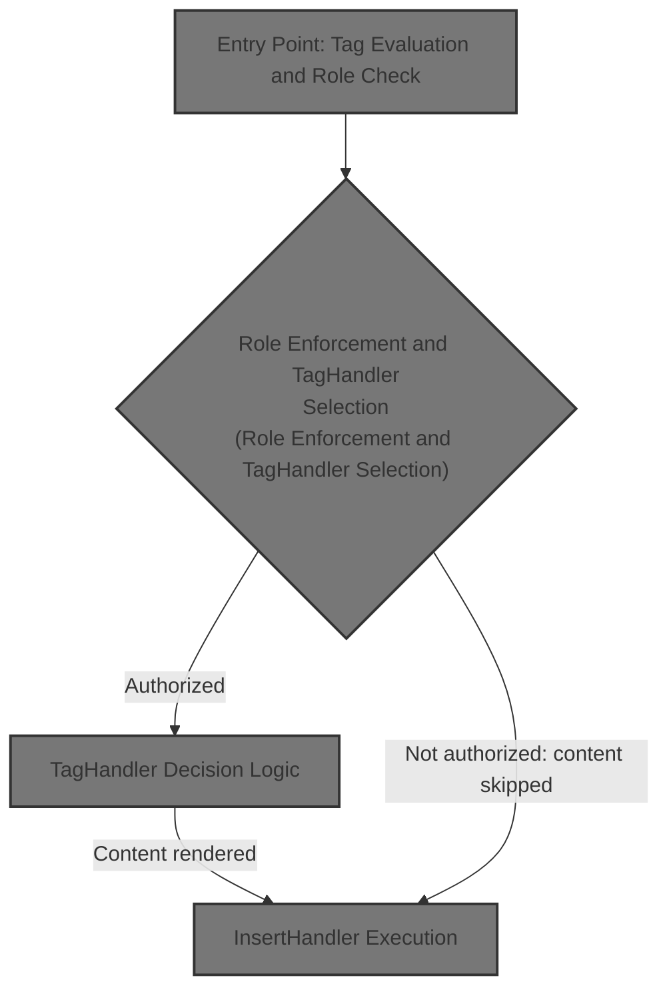
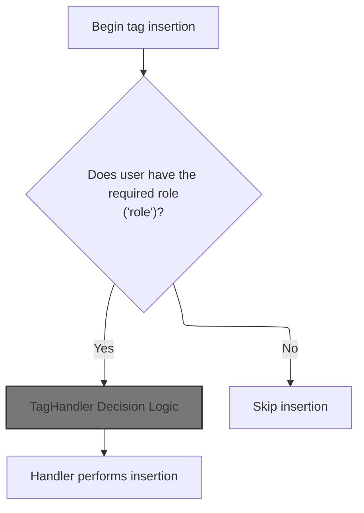
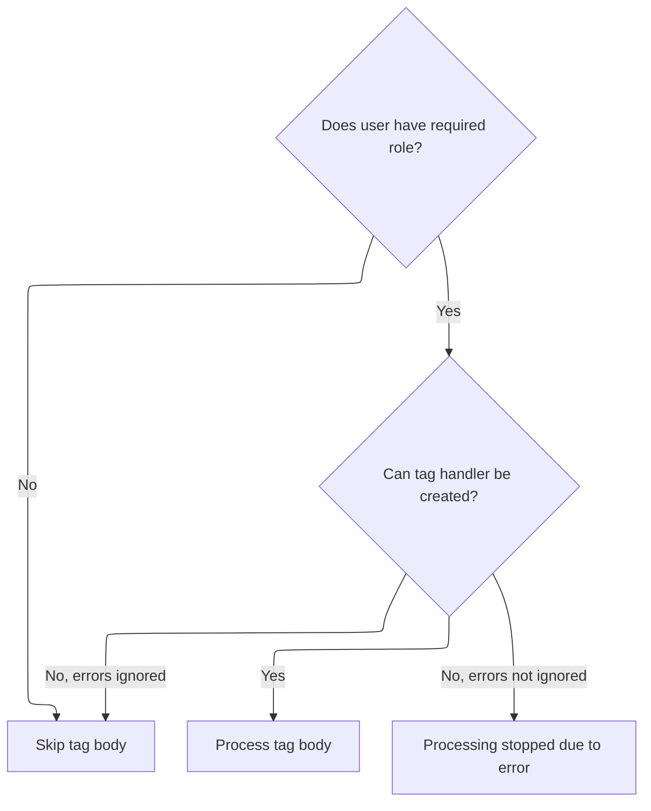
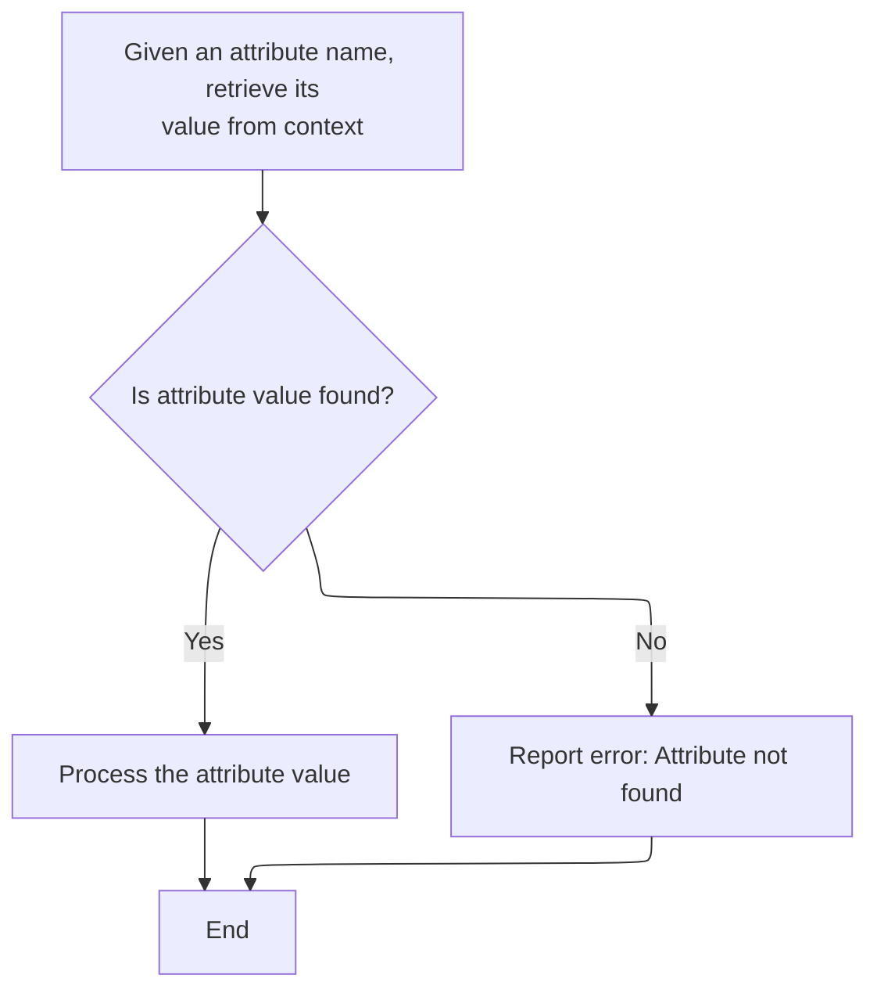

```mermaid
%%{init: {"flowchart": {"defaultRenderer": "elk"}} }%%
flowchart TD
  node1["Start tag insertion"] --> node2{"Is a definition name provided?"}
  click node1 openCode "tiles/src/main/java/org/apache/struts/tiles/taglib/InsertTag.java:474:478"
  node2 -->|"Yes"| node3["Definition Resolution"]
  click node2 openCode "tiles/src/main/java/org/apache/struts/tiles/taglib/InsertTag.java:478:479"
  
  node2 -->|"No"| node4{"Is an attribute provided?"}
  click node4 openCode "tiles/src/main/java/org/apache/struts/tiles/taglib/InsertTag.java:480:481"
  node4 -->|"Yes"| node5["Attribute Lookup and Value Handling"]
  
  node4 -->|"No"| node6{"Is a bean name provided?"}
  click node6 openCode "tiles/src/main/java/org/apache/struts/tiles/taglib/InsertTag.java:482:483"
  node6 -->|"Yes"| node7["Bean Property Resolution"]
  
  node6 -->|"No"| node8{"Is a name provided?"}
  click node8 openCode "tiles/src/main/java/org/apache/struts/tiles/taglib/InsertTag.java:484:485"
  node8 -->|"Yes"| node9["Name Lookup and Fallback"]
  
  node8 -->|"No"| node10{"Is a page provided?"}
  click node10 openCode "tiles/src/main/java/org/apache/struts/tiles/taglib/InsertTag.java:486:487"
  node10 -->|"Yes"| node11["Use content from page"]
  click node11 openCode "tiles/src/main/java/org/apache/struts/tiles/taglib/InsertTag.java:487:487"
  node10 -->|"No"| node12["Show error: At least one content source
must be specified"]
  click node12 openCode "tiles/src/main/java/org/apache/struts/tiles/taglib/InsertTag.java:488:490"

classDef HeadingStyle fill:#777777,stroke:#333,stroke-width:2px;
click node3 goToHeading "Definition Resolution"
node3:::HeadingStyle
click node5 goToHeading "Attribute Lookup and Value Handling"
node5:::HeadingStyle
click node7 goToHeading "Bean Property Resolution"
node7:::HeadingStyle
click node9 goToHeading "Name Lookup and Fallback"
node9:::HeadingStyle

%% Swimm:
%% %%{init: {"flowchart": {"defaultRenderer": "elk"}} }%%
%% flowchart TD
%%   node1["Start tag insertion"] --> node2{"Is a definition name provided?"}
%%   click node1 openCode "<SwmPath>[tiles/…/taglib/InsertTag.java](tiles/src/main/java/org/apache/struts/tiles/taglib/InsertTag.java)</SwmPath>:474:478"
%%   node2 -->|"Yes"| node3["Definition Resolution"]
%%   click node2 openCode "<SwmPath>[tiles/…/taglib/InsertTag.java](tiles/src/main/java/org/apache/struts/tiles/taglib/InsertTag.java)</SwmPath>:478:479"
%%   
%%   node2 -->|"No"| node4{"Is an attribute provided?"}
%%   click node4 openCode "<SwmPath>[tiles/…/taglib/InsertTag.java](tiles/src/main/java/org/apache/struts/tiles/taglib/InsertTag.java)</SwmPath>:480:481"
%%   node4 -->|"Yes"| node5["Attribute Lookup and Value Handling"]
%%   
%%   node4 -->|"No"| node6{"Is a bean name provided?"}
%%   click node6 openCode "<SwmPath>[tiles/…/taglib/InsertTag.java](tiles/src/main/java/org/apache/struts/tiles/taglib/InsertTag.java)</SwmPath>:482:483"
%%   node6 -->|"Yes"| node7["Bean Property Resolution"]
%%   
%%   node6 -->|"No"| node8{"Is a name provided?"}
%%   click node8 openCode "<SwmPath>[tiles/…/taglib/InsertTag.java](tiles/src/main/java/org/apache/struts/tiles/taglib/InsertTag.java)</SwmPath>:484:485"
%%   node8 -->|"Yes"| node9["Name Lookup and Fallback"]
%%   
%%   node8 -->|"No"| node10{"Is a page provided?"}
%%   click node10 openCode "<SwmPath>[tiles/…/taglib/InsertTag.java](tiles/src/main/java/org/apache/struts/tiles/taglib/InsertTag.java)</SwmPath>:486:487"
%%   node10 -->|"Yes"| node11["Use content from page"]
%%   click node11 openCode "<SwmPath>[tiles/…/taglib/InsertTag.java](tiles/src/main/java/org/apache/struts/tiles/taglib/InsertTag.java)</SwmPath>:487:487"
%%   node10 -->|"No"| node12["Show error: At least one content source
%% must be specified"]
%%   click node12 openCode "<SwmPath>[tiles/…/taglib/InsertTag.java](tiles/src/main/java/org/apache/struts/tiles/taglib/InsertTag.java)</SwmPath>:488:490"
%% 
%% classDef HeadingStyle fill:#777777,stroke:#333,stroke-width:2px;
%% click node3 goToHeading "Definition Resolution"
%% node3:::HeadingStyle
%% click node5 goToHeading "Attribute Lookup and Value Handling"
%% node5:::HeadingStyle
%% click node7 goToHeading "Bean Property Resolution"
%% node7:::HeadingStyle
%% click node9 goToHeading "Name Lookup and Fallback"
%% node9:::HeadingStyle
```

This document explains how content is dynamically included or rendered in a JSP page based on tag attributes and user authorization. The flow supports flexible page layouts by prioritizing multiple content sources and enforcing role-based access control.



# Entry Point: Tag Evaluation and Role Check



<SwmSnippet path="/tiles/src/main/java/org/apache/struts/tiles/taglib/InsertTag.java" line="425">

---

In <SwmToken path="tiles/src/main/java/org/apache/struts/tiles/taglib/InsertTag.java" pos="425:5:5" line-data="    public int doStartTag() throws JspException {">`doStartTag`</SwmToken>, we clear any cached context and immediately check the user's role to short-circuit processing if not authorized. We grab the <SwmToken path="tiles/src/main/java/org/apache/struts/tiles/taglib/InsertTag.java" pos="433:1:1" line-data="        HttpServletRequest request =">`HttpServletRequest`</SwmToken> from the page context, which is needed for role checks and later tag logic. Next, we need to call into <SwmToken path="core/src/main/java/org/apache/struts/chain/contexts/ServletActionContext.java" pos="39:4:4" line-data="public class ServletActionContext extends WebActionContext {">`ServletActionContext`</SwmToken> to consistently access the request in a framework-agnostic way.

```java
    public int doStartTag() throws JspException {

            // Additional fix for Bug 20034 (2005-04-28)
            cachedCurrentContext = null;

        // Check role immediatly to avoid useless stuff.
        // In case of insertion of a "definition", definition's role still checked later.
        // This lead to a double check of "role" ;-(
        HttpServletRequest request =
            (HttpServletRequest) pageContext.getRequest();
```

---

</SwmSnippet>

## Request Extraction from Context

<SwmSnippet path="/core/src/main/java/org/apache/struts/chain/contexts/ServletActionContext.java" line="94">

---

<SwmToken path="core/src/main/java/org/apache/struts/chain/contexts/ServletActionContext.java" pos="94:5:5" line-data="    public HttpServletRequest getRequest() {">`getRequest`</SwmToken> just delegates to <SwmToken path="core/src/main/java/org/apache/struts/chain/contexts/ServletActionContext.java" pos="95:3:9" line-data="        return servletWebContext().getRequest();">`servletWebContext().getRequest()`</SwmToken>, abstracting how the request is fetched so the rest of the code doesn't care about the underlying context type. This keeps things decoupled and lets us handle different context implementations if needed.

```java
    public HttpServletRequest getRequest() {
        return servletWebContext().getRequest();
    }
```

---

</SwmSnippet>

<SwmSnippet path="/core/src/main/java/org/apache/struts/chain/contexts/ServletActionContext.java" line="67">

---

<SwmToken path="core/src/main/java/org/apache/struts/chain/contexts/ServletActionContext.java" pos="67:5:5" line-data="    protected ServletWebContext servletWebContext() {">`servletWebContext`</SwmToken> casts the base context to <SwmToken path="core/src/main/java/org/apache/struts/chain/contexts/ServletActionContext.java" pos="67:3:3" line-data="    protected ServletWebContext servletWebContext() {">`ServletWebContext`</SwmToken>, assuming the framework always provides the right type. This is a shortcut to avoid type checks, but if the context isn't set up right, it'll blow up with a ClassCastException.

```java
    protected ServletWebContext servletWebContext() {
        return (ServletWebContext) this.getBaseContext();
    }
```

---

</SwmSnippet>

## Role Enforcement and <SwmToken path="tiles/src/main/java/org/apache/struts/tiles/taglib/InsertTag.java" pos="474:3:3" line-data="    public TagHandler createTagHandler() throws JspException {">`TagHandler`</SwmToken> Selection



<SwmSnippet path="/tiles/src/main/java/org/apache/struts/tiles/taglib/InsertTag.java" line="435">

---

Back in <SwmToken path="tiles/src/main/java/org/apache/struts/tiles/taglib/InsertTag.java" pos="425:5:5" line-data="    public int doStartTag() throws JspException {">`doStartTag`</SwmToken>, after getting the request, we check the user's role and bail early if unauthorized. If the role check passes, we move on to <SwmToken path="tiles/src/main/java/org/apache/struts/tiles/taglib/InsertTag.java" pos="441:5:5" line-data="            tagHandler = createTagHandler();">`createTagHandler`</SwmToken>, which figures out what kind of tag logic to run based on the tag's attributes.

```java
        if (role != null && !request.isUserInRole(role)) {
            processEndTag = false;
            return SKIP_BODY;
        }

        try {
            tagHandler = createTagHandler();

        } catch (JspException e) {
            if (isErrorIgnored) {
                processEndTag = false;
                return SKIP_BODY;
            } else {
                throw e;
            }
        }

```

---

</SwmSnippet>

## <SwmToken path="tiles/src/main/java/org/apache/struts/tiles/taglib/InsertTag.java" pos="474:3:3" line-data="    public TagHandler createTagHandler() throws JspException {">`TagHandler`</SwmToken> Decision Logic



<SwmSnippet path="/tiles/src/main/java/org/apache/struts/tiles/taglib/InsertTag.java" line="474">

---

In <SwmToken path="tiles/src/main/java/org/apache/struts/tiles/taglib/InsertTag.java" pos="474:5:5" line-data="    public TagHandler createTagHandler() throws JspException {">`createTagHandler`</SwmToken>, we pick which processing method to call based on which attribute is set, checking in a fixed order. The page attribute is checked last because it can overlap with others. If <SwmToken path="tiles/src/main/java/org/apache/struts/tiles/taglib/InsertTag.java" pos="478:4:4" line-data="        if (definitionName != null) {">`definitionName`</SwmToken> is set, we call <SwmToken path="tiles/src/main/java/org/apache/struts/tiles/taglib/InsertTag.java" pos="479:3:3" line-data="            return processDefinitionName(definitionName);">`processDefinitionName`</SwmToken> next to handle that case.

```java
    public TagHandler createTagHandler() throws JspException {
        // Check each tag attribute.
        // page Url attribute must be the last checked  because it can appears concurrently
        // with others attributes.
        if (definitionName != null) {
            return processDefinitionName(definitionName);
```

---

</SwmSnippet>

### Definition Resolution

See <SwmLink doc-title="Resolving and Preparing a Component Definition for Insertion">[Resolving and Preparing a Component Definition for Insertion](/.swm/resolving-and-preparing-a-component-definition-for-insertion.jasrzh5b.sw.md)</SwmLink>

### Attribute-Based Fallback

<SwmSnippet path="/tiles/src/main/java/org/apache/struts/tiles/taglib/InsertTag.java" line="480">

---

We just returned from <SwmToken path="tiles/src/main/java/org/apache/struts/tiles/taglib/InsertTag.java" pos="479:3:3" line-data="            return processDefinitionName(definitionName);">`processDefinitionName`</SwmToken>. If <SwmToken path="tiles/src/main/java/org/apache/struts/tiles/taglib/InsertTag.java" pos="478:4:4" line-data="        if (definitionName != null) {">`definitionName`</SwmToken> wasn't set, <SwmToken path="tiles/src/main/java/org/apache/struts/tiles/taglib/InsertTag.java" pos="441:5:5" line-data="            tagHandler = createTagHandler();">`createTagHandler`</SwmToken> checks if attribute is set and, if so, calls <SwmToken path="tiles/src/main/java/org/apache/struts/tiles/taglib/InsertTag.java" pos="481:3:3" line-data="            return processAttribute(attribute);">`processAttribute`</SwmToken> to handle it. This keeps the attribute handling order consistent.

```java
        } else if (attribute != null) {
            return processAttribute(attribute);
```

---

</SwmSnippet>

### Attribute Lookup and Value Handling



<SwmSnippet path="/tiles/src/main/java/org/apache/struts/tiles/taglib/InsertTag.java" line="689">

---

<SwmToken path="tiles/src/main/java/org/apache/struts/tiles/taglib/InsertTag.java" pos="689:5:5" line-data="    public TagHandler processAttribute(String name) throws JspException {">`processAttribute`</SwmToken> looks up the attribute value from the current context. If it's missing, it throws an exception. If found, it passes the value to <SwmToken path="tiles/src/main/java/org/apache/struts/tiles/taglib/InsertTag.java" pos="699:3:3" line-data="        return processObjectValue(attrValue);">`processObjectValue`</SwmToken> to figure out how to handle it.

```java
    public TagHandler processAttribute(String name) throws JspException {
        Object attrValue = getCurrentContext().getAttribute(name);

        if (attrValue == null) {
            throw new JspException(
                "Error - Tag Insert : No value found for attribute '"
                    + name
                    + "'.");
        }

        return processObjectValue(attrValue);
    }
```

---

</SwmSnippet>

### Object Value Dispatch

See <SwmLink doc-title="Handling Value Insertion in Templates">[Handling Value Insertion in Templates](/.swm/handling-value-insertion-in-templates.i9irhq3i.sw.md)</SwmLink>

### Definition or URL Fallback

<SwmSnippet path="/tiles/src/main/java/org/apache/struts/tiles/taglib/InsertTag.java" line="708">

---

In <SwmToken path="tiles/src/main/java/org/apache/struts/tiles/taglib/InsertTag.java" pos="708:5:5" line-data="    public TagHandler processAsDefinitionOrURL(String name)">`processAsDefinitionOrURL`</SwmToken>, we first try to resolve the name as a Tiles definition using <SwmToken path="tiles/src/main/java/org/apache/struts/tiles/taglib/InsertTag.java" pos="712:1:1" line-data="                TilesUtil.getDefinition(">`TilesUtil`</SwmToken>, passing in the request and servlet context. This means we need to access the request again, which is why we call into the context utility.

```java
    public TagHandler processAsDefinitionOrURL(String name)
        throws JspException {
        try {
            ComponentDefinition definition =
                TilesUtil.getDefinition(
                    name,
                    pageContext.getRequest(),
```

---

</SwmSnippet>

<SwmSnippet path="/tiles/src/main/java/org/apache/struts/tiles/taglib/InsertTag.java" line="712">

---

We just got the request from the context. Now, <SwmToken path="tiles/src/main/java/org/apache/struts/tiles/taglib/InsertTag.java" pos="536:3:3" line-data="        return processAsDefinitionOrURL(name);">`processAsDefinitionOrURL`</SwmToken> calls <SwmToken path="tiles/src/main/java/org/apache/struts/tiles/taglib/InsertTag.java" pos="712:1:3" line-data="                TilesUtil.getDefinition(">`TilesUtil.getDefinition`</SwmToken> with the name, request, and servlet context to try to resolve a Tiles definition. If it finds one, we handle it as a definition; otherwise, we fall back to URL handling.

```java
                TilesUtil.getDefinition(
                    name,
                    pageContext.getRequest(),
                    pageContext.getServletContext());

```

---

</SwmSnippet>

<SwmSnippet path="/tiles/src/main/java/org/apache/struts/tiles/taglib/InsertTag.java" line="717">

---

We just returned from <SwmToken path="tiles/src/main/java/org/apache/struts/tiles/taglib/InsertTag.java" pos="712:1:3" line-data="                TilesUtil.getDefinition(">`TilesUtil.getDefinition`</SwmToken>. If a definition was found, <SwmToken path="tiles/src/main/java/org/apache/struts/tiles/taglib/InsertTag.java" pos="536:3:3" line-data="        return processAsDefinitionOrURL(name);">`processAsDefinitionOrURL`</SwmToken> hands it off to <SwmToken path="tiles/src/main/java/org/apache/struts/tiles/taglib/InsertTag.java" pos="718:3:3" line-data="                return processDefinition(definition);">`processDefinition`</SwmToken> to process it according to Tiles rules. If not, we keep going to URL handling.

```java
            if (definition != null) {
                return processDefinition(definition);
            }

        } catch (DefinitionsFactoryException ex) {
            // silently failed, because we can choose to not define a factory.
        }

```

---

</SwmSnippet>

<SwmSnippet path="/tiles/src/main/java/org/apache/struts/tiles/taglib/InsertTag.java" line="725">

---

We just returned from <SwmToken path="tiles/src/main/java/org/apache/struts/tiles/taglib/InsertTag.java" pos="718:3:3" line-data="                return processDefinition(definition);">`processDefinition`</SwmToken>. If no definition was found, <SwmToken path="tiles/src/main/java/org/apache/struts/tiles/taglib/InsertTag.java" pos="536:3:3" line-data="        return processAsDefinitionOrURL(name);">`processAsDefinitionOrURL`</SwmToken> falls back to <SwmToken path="tiles/src/main/java/org/apache/struts/tiles/taglib/InsertTag.java" pos="726:3:3" line-data="        return processUrl(name);">`processUrl`</SwmToken>, treating the name as a URL to include.

```java
        // no definition found, try as url
        return processUrl(name);
    }
```

---

</SwmSnippet>

<SwmSnippet path="/tiles/src/main/java/org/apache/struts/tiles/taglib/InsertTag.java" line="543">

---

<SwmToken path="tiles/src/main/java/org/apache/struts/tiles/taglib/InsertTag.java" pos="543:5:5" line-data="    public TagHandler processUrl(String url) throws JspException {">`processUrl`</SwmToken> creates a new <SwmToken path="tiles/src/main/java/org/apache/struts/tiles/taglib/InsertTag.java" pos="544:5:5" line-data="        return new InsertHandler(url, role, getController());">`InsertHandler`</SwmToken> for the URL, passing along the role and the result of <SwmToken path="tiles/src/main/java/org/apache/struts/tiles/taglib/InsertTag.java" pos="544:13:13" line-data="        return new InsertHandler(url, role, getController());">`getController`</SwmToken>, which might add extra logic for the include.

```java
    public TagHandler processUrl(String url) throws JspException {
        return new InsertHandler(url, role, getController());
    }
```

---

</SwmSnippet>

### Bean-Based Fallback

<SwmSnippet path="/tiles/src/main/java/org/apache/struts/tiles/taglib/InsertTag.java" line="482">

---

We just returned from <SwmToken path="tiles/src/main/java/org/apache/struts/tiles/taglib/InsertTag.java" pos="481:3:3" line-data="            return processAttribute(attribute);">`processAttribute`</SwmToken>. If attribute wasn't set, <SwmToken path="tiles/src/main/java/org/apache/struts/tiles/taglib/InsertTag.java" pos="441:5:5" line-data="            tagHandler = createTagHandler();">`createTagHandler`</SwmToken> checks for <SwmToken path="tiles/src/main/java/org/apache/struts/tiles/taglib/InsertTag.java" pos="482:8:8" line-data="        } else if (beanName != null) {">`beanName`</SwmToken> and, if present, calls <SwmToken path="tiles/src/main/java/org/apache/struts/tiles/taglib/InsertTag.java" pos="483:3:3" line-data="            return processBean(beanName, beanProperty, beanScope);">`processBean`</SwmToken> to handle bean-based tag logic.

```java
        } else if (beanName != null) {
            return processBean(beanName, beanProperty, beanScope);
```

---

</SwmSnippet>

### Bean Property Resolution

See <SwmLink doc-title="Preparing Bean Values for Tag Rendering">[Preparing Bean Values for Tag Rendering](/.swm/preparing-bean-values-for-tag-rendering.ao08323e.sw.md)</SwmLink>

### Name-Based Fallback

<SwmSnippet path="/tiles/src/main/java/org/apache/struts/tiles/taglib/InsertTag.java" line="484">

---

We just returned from <SwmToken path="tiles/src/main/java/org/apache/struts/tiles/taglib/InsertTag.java" pos="483:3:3" line-data="            return processBean(beanName, beanProperty, beanScope);">`processBean`</SwmToken>. If <SwmToken path="tiles/src/main/java/org/apache/struts/tiles/taglib/InsertTag.java" pos="482:8:8" line-data="        } else if (beanName != null) {">`beanName`</SwmToken> wasn't set, <SwmToken path="tiles/src/main/java/org/apache/struts/tiles/taglib/InsertTag.java" pos="441:5:5" line-data="            tagHandler = createTagHandler();">`createTagHandler`</SwmToken> checks for name and, if present, calls <SwmToken path="tiles/src/main/java/org/apache/struts/tiles/taglib/InsertTag.java" pos="485:3:3" line-data="            return processName(name);">`processName`</SwmToken> to handle it.

```java
        } else if (name != null) {
            return processName(name);
```

---

</SwmSnippet>

### Name Lookup and Fallback

<SwmSnippet path="/tiles/src/main/java/org/apache/struts/tiles/taglib/InsertTag.java" line="529">

---

In <SwmToken path="tiles/src/main/java/org/apache/struts/tiles/taglib/InsertTag.java" pos="529:5:5" line-data="    public TagHandler processName(String name) throws JspException {">`processName`</SwmToken>, we look up the name in the current context. If found, we hand it off to <SwmToken path="tiles/src/main/java/org/apache/struts/tiles/taglib/InsertTag.java" pos="533:3:3" line-data="            return processObjectValue(attrValue);">`processObjectValue`</SwmToken> to decide how to handle it. If not, we fall back to definition or URL handling.

```java
    public TagHandler processName(String name) throws JspException {
        Object attrValue = getCurrentContext().getAttribute(name);

        if (attrValue != null) {
            return processObjectValue(attrValue);
        }

```

---

</SwmSnippet>

<SwmSnippet path="/tiles/src/main/java/org/apache/struts/tiles/taglib/InsertTag.java" line="536">

---

We just returned from <SwmToken path="tiles/src/main/java/org/apache/struts/tiles/taglib/InsertTag.java" pos="533:3:3" line-data="            return processObjectValue(attrValue);">`processObjectValue`</SwmToken>. If the name wasn't found in the context, <SwmToken path="tiles/src/main/java/org/apache/struts/tiles/taglib/InsertTag.java" pos="485:3:3" line-data="            return processName(name);">`processName`</SwmToken> falls back to <SwmToken path="tiles/src/main/java/org/apache/struts/tiles/taglib/InsertTag.java" pos="536:3:3" line-data="        return processAsDefinitionOrURL(name);">`processAsDefinitionOrURL`</SwmToken> to try to resolve it as a definition or a URL.

```java
        return processAsDefinitionOrURL(name);
    }
```

---

</SwmSnippet>

### URL Fallback and Error Handling

<SwmSnippet path="/tiles/src/main/java/org/apache/struts/tiles/taglib/InsertTag.java" line="486">

---

We just returned from <SwmToken path="tiles/src/main/java/org/apache/struts/tiles/taglib/InsertTag.java" pos="485:3:3" line-data="            return processName(name);">`processName`</SwmToken>. If none of the attributes are set, <SwmToken path="tiles/src/main/java/org/apache/struts/tiles/taglib/InsertTag.java" pos="441:5:5" line-data="            tagHandler = createTagHandler();">`createTagHandler`</SwmToken> finally checks for page and, if present, calls <SwmToken path="tiles/src/main/java/org/apache/struts/tiles/taglib/InsertTag.java" pos="487:3:3" line-data="            return processUrl(page);">`processUrl`</SwmToken>. If all are missing, it throws an exception to signal a misconfigured tag. The order of checks enforces attribute priority.

```java
        } else if (page != null) {
            return processUrl(page);
        } else {
            throw new JspException("Error - Tag Insert : At least one of the following attribute must be defined : template|page|attribute|definition|name|beanName. Check tag syntax");
        }
    }
```

---

</SwmSnippet>

## Delegating to <SwmToken path="tiles/src/main/java/org/apache/struts/tiles/taglib/InsertTag.java" pos="474:3:3" line-data="    public TagHandler createTagHandler() throws JspException {">`TagHandler`</SwmToken>

<SwmSnippet path="/tiles/src/main/java/org/apache/struts/tiles/taglib/InsertTag.java" line="452">

---

We just returned from <SwmToken path="tiles/src/main/java/org/apache/struts/tiles/taglib/InsertTag.java" pos="441:5:5" line-data="            tagHandler = createTagHandler();">`createTagHandler`</SwmToken>. <SwmToken path="tiles/src/main/java/org/apache/struts/tiles/taglib/InsertTag.java" pos="452:5:5" line-data="        return tagHandler.doStartTag();">`doStartTag`</SwmToken> now delegates to the handler's <SwmToken path="tiles/src/main/java/org/apache/struts/tiles/taglib/InsertTag.java" pos="452:5:5" line-data="        return tagHandler.doStartTag();">`doStartTag`</SwmToken>, which actually runs the tag logic—rendering, including, or whatever the handler is set up to do.

```java
        return tagHandler.doStartTag();
    }
```

---

</SwmSnippet>

# <SwmToken path="tiles/src/main/java/org/apache/struts/tiles/taglib/InsertTag.java" pos="544:5:5" line-data="        return new InsertHandler(url, role, getController());">`InsertHandler`</SwmToken> Execution

<SwmSnippet path="/tiles/src/main/java/org/apache/struts/tiles/taglib/InsertTag.java" line="831">

---

In <SwmToken path="tiles/src/main/java/org/apache/struts/tiles/taglib/InsertTag.java" pos="831:5:5" line-data="        public int doStartTag() throws JspException {">`doStartTag`</SwmToken> of <SwmToken path="tiles/src/main/java/org/apache/struts/tiles/taglib/InsertTag.java" pos="544:5:5" line-data="        return new InsertHandler(url, role, getController());">`InsertHandler`</SwmToken>, we check the user's role again and fetch the request from the page context. This ensures the handler doesn't process content for unauthorized users, even if the parent tag missed something. We need the request for role checks and possibly for downstream logic.

```java
        public int doStartTag() throws JspException {
            // Check role
            HttpServletRequest request =
                (HttpServletRequest) pageContext.getRequest();

            if (role != null && !request.isUserInRole(role)) {
                return SKIP_BODY;
            }

```

---

</SwmSnippet>

<SwmSnippet path="/tiles/src/main/java/org/apache/struts/tiles/taglib/InsertTag.java" line="840">

---

We just returned from the context utility. At the end of `InsertHandler.doStartTag`, we save the current context and return <SwmToken path="tiles/src/main/java/org/apache/struts/tiles/taglib/InsertTag.java" pos="842:3:3" line-data="            return EVAL_BODY_INCLUDE;">`EVAL_BODY_INCLUDE`</SwmToken>, which tells the JSP engine to process the tag's body content.

```java
            // save current context
            this.currentContext = getCurrentContext();
            return EVAL_BODY_INCLUDE;
        }
```

---

</SwmSnippet>

&nbsp;

*This is an auto-generated document by Swimm 🌊 and has not yet been verified by a human*

<SwmMeta version="3.0.0" repo-id="Z2l0aHViJTNBJTNBc3RydXRzMSUzQSUzQVN3aW1tLURlbW8=" repo-name="struts1"><sup>Powered by [Swimm](https://app.swimm.io/)</sup></SwmMeta>
