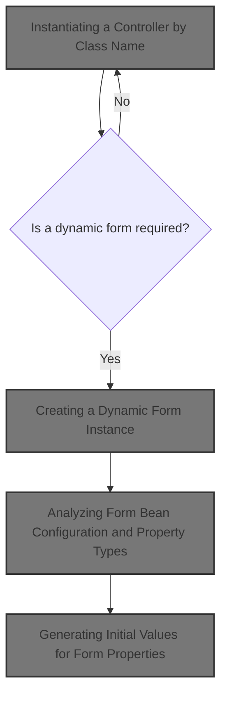
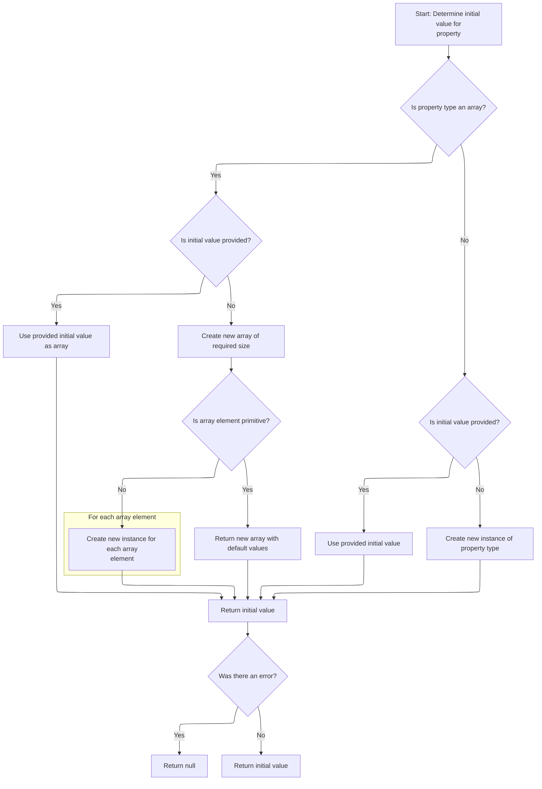

This document describes how the system dynamically instantiates a controller from its class name and sets up any required dynamic form bean, based on configuration. This enables flexible request handling, as controllers and forms can be defined and created at runtime.



# Instantiating a Controller by Class Name

<SwmSnippet path="/tiles/src/main/java/org/apache/struts/tiles/ComponentDefinition.java" line="516">

---

In <SwmToken path="tiles/src/main/java/org/apache/struts/tiles/ComponentDefinition.java" pos="516:7:7" line-data="    public static Controller createControllerFromClassname(String classname)">`createControllerFromClassname`</SwmToken>, we're loading the class by name and instantiating it. This is where we get the actual controller object that will handle the request. Next, we need to call into <SwmToken path="core/src/main/java/org/apache/struts/action/DynaActionFormClass.java" pos="45:4:4" line-data="public class DynaActionFormClass implements DynaClass, Serializable {">`DynaActionFormClass`</SwmToken> because, in the Struts flow, dynamic forms (like <SwmToken path="core/src/main/java/org/apache/struts/action/DynaActionFormClass.java" pos="160:1:1" line-data="        DynaActionForm dynaBean = (DynaActionForm) getBeanClass().newInstance();">`DynaActionForm`</SwmToken>) are often involved in controller instantiation and setup, especially when the controller expects dynamic form data. Reflection is used here to keep things flexible and decoupled.

```java
    public static Controller createControllerFromClassname(String classname)
        throws InstantiationException {

        try {
            Class requestedClass = RequestUtils.applicationClass(classname);
            Object instance = requestedClass.newInstance();

            if (log.isDebugEnabled()) {
                log.debug("Controller created : " + instance);
            }
            return (Controller) instance;

```

---

</SwmSnippet>

## Creating a Dynamic Form Instance

<SwmSnippet path="/core/src/main/java/org/apache/struts/action/DynaActionFormClass.java" line="158">

---

In <SwmToken path="core/src/main/java/org/apache/struts/action/DynaActionFormClass.java" pos="158:5:5" line-data="    public DynaBean newInstance()">`newInstance`</SwmToken>, we're using reflection to create a new <SwmToken path="core/src/main/java/org/apache/struts/action/DynaActionFormClass.java" pos="160:1:1" line-data="        DynaActionForm dynaBean = (DynaActionForm) getBeanClass().newInstance();">`DynaActionForm`</SwmToken> (as a <SwmToken path="core/src/main/java/org/apache/struts/action/DynaActionFormClass.java" pos="158:3:3" line-data="    public DynaBean newInstance()">`DynaBean`</SwmToken>). This lets us build form beans on the fly based on configuration. We need to call <SwmToken path="core/src/main/java/org/apache/struts/action/DynaActionFormClass.java" pos="160:11:11" line-data="        DynaActionForm dynaBean = (DynaActionForm) getBeanClass().newInstance();">`getBeanClass`</SwmToken> next to figure out which class to instantiate, since the actual type is determined at runtime.

```java
    public DynaBean newInstance()
        throws IllegalAccessException, InstantiationException {
        DynaActionForm dynaBean = (DynaActionForm) getBeanClass().newInstance();

```

---

</SwmSnippet>

### Resolving the Bean Class for Dynamic Forms

<SwmSnippet path="/core/src/main/java/org/apache/struts/action/DynaActionFormClass.java" line="227">

---

<SwmToken path="core/src/main/java/org/apache/struts/action/DynaActionFormClass.java" pos="227:5:5" line-data="    protected Class getBeanClass() {">`getBeanClass`</SwmToken> checks if we've already resolved the class for this dynamic form. If not, it introspects the config to figure out the right class, then caches it. This keeps things fast when creating lots of forms.

```java
    protected Class getBeanClass() {
        if (beanClass == null) {
            introspect(config);
        }

        return (beanClass);
    }
```

---

</SwmSnippet>

### Analyzing Form Bean Configuration and Property Types

```mermaid
%%{init: {"flowchart": {"defaultRenderer": "elk"}} }%%
flowchart TD
  node1["Receive form bean configuration (type,
properties)"] --> node2{"Is form bean class valid?"}
  click node1 openCode "core/src/main/java/org/apache/struts/action/DynaActionFormClass.java:246:247"
  node2 -->|"No"| node3["Error: Cannot instantiate form bean
class"]
  click node2 openCode "core/src/main/java/org/apache/struts/action/DynaActionFormClass.java:250:258"
  click node3 openCode "core/src/main/java/org/apache/struts/action/DynaActionFormClass.java:253:258"
  node2 -->|"Yes"| node4{"Is form bean a subclass of required base
class?"}
  click node4 openCode "core/src/main/java/org/apache/struts/action/DynaActionFormClass.java:260:264"
  node4 -->|"No"| node5["Error: Not a valid subclass"]
  click node5 openCode "core/src/main/java/org/apache/struts/action/DynaActionFormClass.java:261:264"
  node4 -->|"Yes"| node6["Extract property descriptors from config"]
  click node6 openCode "core/src/main/java/org/apache/struts/action/DynaActionFormClass.java:269:271"
  node6 --> node7{"Any property descriptors?"}
  click node7 openCode "core/src/main/java/org/apache/struts/action/DynaActionFormClass.java:272:274"
  node7 -->|"No"| node8["Proceed with no properties"]
  click node8 openCode "core/src/main/java/org/apache/struts/action/DynaActionFormClass.java:273:274"
  node8 --> node12["Form bean ready for use"]
  click node12 openCode "core/src/main/java/org/apache/struts/action/DynaActionFormClass.java:285:285"
  node7 -->|"Yes"| node9["Define dynamic properties"]
  click node9 openCode "core/src/main/java/org/apache/struts/action/DynaActionFormClass.java:277:284"
  
  subgraph loop1["For each property descriptor"]
    node9 --> node11["Create dynamic property and add to map"]
    click node11 openCode "core/src/main/java/org/apache/struts/action/DynaActionFormClass.java:279:284"
    node11 --> node9
  end
  node9 --> node12["Form bean ready for use"]

classDef HeadingStyle fill:#777777,stroke:#333,stroke-width:2px;

%% Swimm:
%% %%{init: {"flowchart": {"defaultRenderer": "elk"}} }%%
%% flowchart TD
%%   node1["Receive form bean configuration (type,
%% properties)"] --> node2{"Is form bean class valid?"}
%%   click node1 openCode "<SwmPath>[core/…/action/DynaActionFormClass.java](core/src/main/java/org/apache/struts/action/DynaActionFormClass.java)</SwmPath>:246:247"
%%   node2 -->|"No"| node3["Error: Cannot instantiate form bean
%% class"]
%%   click node2 openCode "<SwmPath>[core/…/action/DynaActionFormClass.java](core/src/main/java/org/apache/struts/action/DynaActionFormClass.java)</SwmPath>:250:258"
%%   click node3 openCode "<SwmPath>[core/…/action/DynaActionFormClass.java](core/src/main/java/org/apache/struts/action/DynaActionFormClass.java)</SwmPath>:253:258"
%%   node2 -->|"Yes"| node4{"Is form bean a subclass of required base
%% class?"}
%%   click node4 openCode "<SwmPath>[core/…/action/DynaActionFormClass.java](core/src/main/java/org/apache/struts/action/DynaActionFormClass.java)</SwmPath>:260:264"
%%   node4 -->|"No"| node5["Error: Not a valid subclass"]
%%   click node5 openCode "<SwmPath>[core/…/action/DynaActionFormClass.java](core/src/main/java/org/apache/struts/action/DynaActionFormClass.java)</SwmPath>:261:264"
%%   node4 -->|"Yes"| node6["Extract property descriptors from config"]
%%   click node6 openCode "<SwmPath>[core/…/action/DynaActionFormClass.java](core/src/main/java/org/apache/struts/action/DynaActionFormClass.java)</SwmPath>:269:271"
%%   node6 --> node7{"Any property descriptors?"}
%%   click node7 openCode "<SwmPath>[core/…/action/DynaActionFormClass.java](core/src/main/java/org/apache/struts/action/DynaActionFormClass.java)</SwmPath>:272:274"
%%   node7 -->|"No"| node8["Proceed with no properties"]
%%   click node8 openCode "<SwmPath>[core/…/action/DynaActionFormClass.java](core/src/main/java/org/apache/struts/action/DynaActionFormClass.java)</SwmPath>:273:274"
%%   node8 --> node12["Form bean ready for use"]
%%   click node12 openCode "<SwmPath>[core/…/action/DynaActionFormClass.java](core/src/main/java/org/apache/struts/action/DynaActionFormClass.java)</SwmPath>:285:285"
%%   node7 -->|"Yes"| node9["Define dynamic properties"]
%%   click node9 openCode "<SwmPath>[core/…/action/DynaActionFormClass.java](core/src/main/java/org/apache/struts/action/DynaActionFormClass.java)</SwmPath>:277:284"
%%   
%%   subgraph loop1["For each property descriptor"]
%%     node9 --> node11["Create dynamic property and add to map"]
%%     click node11 openCode "<SwmPath>[core/…/action/DynaActionFormClass.java](core/src/main/java/org/apache/struts/action/DynaActionFormClass.java)</SwmPath>:279:284"
%%     node11 --> node9
%%   end
%%   node9 --> node12["Form bean ready for use"]
%% 
%% classDef HeadingStyle fill:#777777,stroke:#333,stroke-width:2px;
```



<SwmSnippet path="/core/src/main/java/org/apache/struts/action/DynaActionFormClass.java" line="246">

---

<SwmToken path="core/src/main/java/org/apache/struts/action/DynaActionFormClass.java" pos="246:5:5" line-data="    protected void introspect(FormBeanConfig config) {">`introspect`</SwmToken> validates the bean class and sets up all the dynamic properties for the form. For each property, it calls <SwmToken path="core/src/main/java/org/apache/struts/action/DynaActionFormClass.java" pos="282:6:6" line-data="                    descriptors[i].getTypeClass());">`getTypeClass`</SwmToken> on the <SwmToken path="core/src/main/java/org/apache/struts/action/DynaActionFormClass.java" pos="270:1:1" line-data="        FormPropertyConfig[] descriptors = config.findFormPropertyConfigs();">`FormPropertyConfig`</SwmToken> to figure out the actual Java type, so the form can handle arrays, primitives, or custom types as needed.

```java
    protected void introspect(FormBeanConfig config) {
        this.config = config;

        // Validate the ActionFormBean implementation class
        try {
            beanClass = RequestUtils.applicationClass(config.getType());
        } catch (Throwable t) {
        	IllegalArgumentException t2 = new IllegalArgumentException(
                "Cannot instantiate ActionFormBean class '" + config.getType()
                + "'");
        	t2.initCause(t);
        	throw t2;
        }

        if (!DynaActionForm.class.isAssignableFrom(beanClass)) {
            throw new IllegalArgumentException("Class '" + config.getType()
                + "' is not a subclass of "
                + "'org.apache.struts.action.DynaActionForm'");
        }

        // Set the name we will know ourselves by from the form bean name
        this.name = config.getName();

        // Look up the property descriptors for this bean class
        FormPropertyConfig[] descriptors = config.findFormPropertyConfigs();

        if (descriptors == null) {
            descriptors = new FormPropertyConfig[0];
        }

        // Create corresponding dynamic property definitions
        properties = new DynaProperty[descriptors.length];

        for (int i = 0; i < descriptors.length; i++) {
            properties[i] =
                new DynaProperty(descriptors[i].getName(),
                    descriptors[i].getTypeClass());
            propertiesMap.put(properties[i].getName(), properties[i]);
        }
    }
```

---

</SwmSnippet>

<SwmSnippet path="/core/src/main/java/org/apache/struts/config/FormPropertyConfig.java" line="221">

---

<SwmToken path="core/src/main/java/org/apache/struts/config/FormPropertyConfig.java" pos="221:5:5" line-data="    public Class getTypeClass() {">`getTypeClass`</SwmToken> figures out the actual Java class for a property, handling primitives, arrays, and custom types. It checks for '\[\]' to support arrays, maps primitive names to their Class objects, and loads other classes with the right class loader. This is needed so the dynamic form knows how to handle each property type.

```java
    public Class getTypeClass() {
        // Identify the base class (in case an array was specified)
        String baseType = getType();
        boolean indexed = false;

        if (baseType.endsWith("[]")) {
            baseType = baseType.substring(0, baseType.length() - 2);
            indexed = true;
        }

        // Construct an appropriate Class instance for the base class
        Class baseClass = null;

        if ("boolean".equals(baseType)) {
            baseClass = Boolean.TYPE;
        } else if ("byte".equals(baseType)) {
            baseClass = Byte.TYPE;
        } else if ("char".equals(baseType)) {
            baseClass = Character.TYPE;
        } else if ("double".equals(baseType)) {
            baseClass = Double.TYPE;
        } else if ("float".equals(baseType)) {
            baseClass = Float.TYPE;
        } else if ("int".equals(baseType)) {
            baseClass = Integer.TYPE;
        } else if ("long".equals(baseType)) {
            baseClass = Long.TYPE;
        } else if ("short".equals(baseType)) {
            baseClass = Short.TYPE;
        } else {
            ClassLoader classLoader =
                Thread.currentThread().getContextClassLoader();

            if (classLoader == null) {
                classLoader = this.getClass().getClassLoader();
            }

            try {
                baseClass = classLoader.loadClass(baseType);
            } catch (ClassNotFoundException ex) {
                log.error("Class '" + baseType +
                          "' not found for property '" + name + "'");
                baseClass = null;
            }
        }

        // Return the base class or an array appropriately
        if (indexed) {
            return (Array.newInstance(baseClass, 0).getClass());
        } else {
            return (baseClass);
        }
    }
```

---

</SwmSnippet>

### Setting Up Dynamic Form Properties

<SwmSnippet path="/core/src/main/java/org/apache/struts/action/DynaActionFormClass.java" line="162">

---

Back in <SwmToken path="tiles/src/main/java/org/apache/struts/tiles/ComponentDefinition.java" pos="521:9:9" line-data="            Object instance = requestedClass.newInstance();">`newInstance`</SwmToken>, after creating the form bean, we link it to its <SwmToken path="core/src/main/java/org/apache/struts/action/DynaActionFormClass.java" pos="45:4:4" line-data="public class DynaActionFormClass implements DynaClass, Serializable {">`DynaActionFormClass`</SwmToken> and set up all its properties. For each property, we call initial() on the <SwmToken path="core/src/main/java/org/apache/struts/action/DynaActionFormClass.java" pos="164:1:1" line-data="        FormPropertyConfig[] props = config.findFormPropertyConfigs();">`FormPropertyConfig`</SwmToken> to get the starting value. This is where we need to jump into <SwmToken path="core/src/main/java/org/apache/struts/action/DynaActionFormClass.java" pos="164:1:1" line-data="        FormPropertyConfig[] props = config.findFormPropertyConfigs();">`FormPropertyConfig`</SwmToken> to see how those initial values are built.

```java
        dynaBean.setDynaActionFormClass(this);

        FormPropertyConfig[] props = config.findFormPropertyConfigs();

        for (int i = 0; i < props.length; i++) {
            dynaBean.set(props[i].getName(), props[i].initial());
        }

        return (dynaBean);
    }
```

---

</SwmSnippet>

## Generating Initial Values for Form Properties



<SwmSnippet path="/core/src/main/java/org/apache/struts/config/FormPropertyConfig.java" line="318">

---

In <SwmToken path="core/src/main/java/org/apache/struts/config/FormPropertyConfig.java" pos="318:5:5" line-data="    public Object initial() {">`initial`</SwmToken>, we figure out the starting value for a property. If it's an array, we either convert the initial value or build a new array and fill it with new instances if needed. For single values, we convert or instantiate as well. This is more than just a getter—it's dynamic setup based on the config.

```java
    public Object initial() {
        Object initialValue = null;

        try {
            Class clazz = getTypeClass();

```

---

</SwmSnippet>

<SwmSnippet path="/core/src/main/java/org/apache/struts/config/FormPropertyConfig.java" line="324">

---

We just came back from <SwmToken path="core/src/main/java/org/apache/struts/config/FormPropertyConfig.java" pos="325:4:4" line-data="                if (initial != null) {">`initial`</SwmToken> in <SwmToken path="core/src/main/java/org/apache/struts/action/DynaActionFormClass.java" pos="164:1:1" line-data="        FormPropertyConfig[] props = config.findFormPropertyConfigs();">`FormPropertyConfig`</SwmToken>. If creating an array element fails, the code logs the error and keeps going, so you might end up with nulls in your array. This is a silent failure—no exceptions thrown here.

```java
            if (clazz.isArray()) {
                if (initial != null) {
                    initialValue = ConvertUtils.convert(initial, clazz);
                } else {
                    initialValue =
                        Array.newInstance(clazz.getComponentType(), size);

                    if (!(clazz.getComponentType().isPrimitive())) {
                        for (int i = 0; i < size; i++) {
                            try {
                                Array.set(initialValue, i,
                                    clazz.getComponentType().newInstance());
                            } catch (Throwable t) {
                                log.error("Unable to create instance of "
                                    + clazz.getName() + " for property=" + name
                                    + ", type=" + type + ", initial=" + initial
                                    + ", size=" + size + ".");

                                //FIXME: Should we just dump the entire application/module ?
                            }
                        }
```

---

</SwmSnippet>

<SwmSnippet path="/core/src/main/java/org/apache/struts/config/FormPropertyConfig.java" line="348">

---

Finishing up in <SwmToken path="core/src/main/java/org/apache/struts/config/FormPropertyConfig.java" pos="348:4:4" line-data="                if (initial != null) {">`initial`</SwmToken>, if we can't create the initial value, we just return null. Now, we go back to <SwmToken path="core/src/main/java/org/apache/struts/action/DynaActionFormClass.java" pos="45:4:4" line-data="public class DynaActionFormClass implements DynaClass, Serializable {">`DynaActionFormClass`</SwmToken> to finish setting up the form bean with these values.

```java
                if (initial != null) {
                    initialValue = ConvertUtils.convert(initial, clazz);
                } else {
                    initialValue = clazz.newInstance();
                }
            }
        } catch (Throwable t) {
            initialValue = null;
        }

        return (initialValue);
    }
```

---

</SwmSnippet>

## Handling Controller Instantiation Errors

```mermaid
%%{init: {"flowchart": {"defaultRenderer": "elk"}} }%%
flowchart TD
    node1["Start: Create controller from class
name"]
    click node1 openCode "tiles/src/main/java/org/apache/struts/tiles/ComponentDefinition.java:528:551"
    node1 --> node2{"Does the class with the given name
exist?"}
    click node2 openCode "tiles/src/main/java/org/apache/struts/tiles/ComponentDefinition.java:528:533"
    node2 -->|"No"| node3["Exception: Class not found (classname)"]
    click node3 openCode "tiles/src/main/java/org/apache/struts/tiles/ComponentDefinition.java:528:533"
    node2 -->|"Yes"| node4{"Is the class accessible for
instantiation?"}
    click node4 openCode "tiles/src/main/java/org/apache/struts/tiles/ComponentDefinition.java:534:539"
    node4 -->|"No"| node5["Exception: Illegal class access
(classname)"]
    click node5 openCode "tiles/src/main/java/org/apache/struts/tiles/ComponentDefinition.java:534:539"
    node4 -->|"Yes"| node6{"Can the class be instantiated?"}
    click node6 openCode "tiles/src/main/java/org/apache/struts/tiles/ComponentDefinition.java:540:542"
    node6 -->|"No"| node7["Exception: Cannot instantiate class
(classname)"]
    click node7 openCode "tiles/src/main/java/org/apache/struts/tiles/ComponentDefinition.java:540:542"
    node6 -->|"Yes"| node8{"Is the class a valid controller type?"}
    click node8 openCode "tiles/src/main/java/org/apache/struts/tiles/ComponentDefinition.java:543:550"
    node8 -->|"No"| node9["Exception: Class is not a valid
controller (classname)"]
    click node9 openCode "tiles/src/main/java/org/apache/struts/tiles/ComponentDefinition.java:543:550"
    node8 -->|"Yes"| node10["Controller created successfully"]
    click node10 openCode "tiles/src/main/java/org/apache/struts/tiles/ComponentDefinition.java:551:551"

classDef HeadingStyle fill:#777777,stroke:#333,stroke-width:2px;

%% Swimm:
%% %%{init: {"flowchart": {"defaultRenderer": "elk"}} }%%
%% flowchart TD
%%     node1["Start: Create controller from class
%% name"]
%%     click node1 openCode "<SwmPath>[tiles/…/tiles/ComponentDefinition.java](tiles/src/main/java/org/apache/struts/tiles/ComponentDefinition.java)</SwmPath>:528:551"
%%     node1 --> node2{"Does the class with the given name
%% exist?"}
%%     click node2 openCode "<SwmPath>[tiles/…/tiles/ComponentDefinition.java](tiles/src/main/java/org/apache/struts/tiles/ComponentDefinition.java)</SwmPath>:528:533"
%%     node2 -->|"No"| node3["Exception: Class not found (classname)"]
%%     click node3 openCode "<SwmPath>[tiles/…/tiles/ComponentDefinition.java](tiles/src/main/java/org/apache/struts/tiles/ComponentDefinition.java)</SwmPath>:528:533"
%%     node2 -->|"Yes"| node4{"Is the class accessible for
%% instantiation?"}
%%     click node4 openCode "<SwmPath>[tiles/…/tiles/ComponentDefinition.java](tiles/src/main/java/org/apache/struts/tiles/ComponentDefinition.java)</SwmPath>:534:539"
%%     node4 -->|"No"| node5["Exception: Illegal class access
%% (classname)"]
%%     click node5 openCode "<SwmPath>[tiles/…/tiles/ComponentDefinition.java](tiles/src/main/java/org/apache/struts/tiles/ComponentDefinition.java)</SwmPath>:534:539"
%%     node4 -->|"Yes"| node6{"Can the class be instantiated?"}
%%     click node6 openCode "<SwmPath>[tiles/…/tiles/ComponentDefinition.java](tiles/src/main/java/org/apache/struts/tiles/ComponentDefinition.java)</SwmPath>:540:542"
%%     node6 -->|"No"| node7["Exception: Cannot instantiate class
%% (classname)"]
%%     click node7 openCode "<SwmPath>[tiles/…/tiles/ComponentDefinition.java](tiles/src/main/java/org/apache/struts/tiles/ComponentDefinition.java)</SwmPath>:540:542"
%%     node6 -->|"Yes"| node8{"Is the class a valid controller type?"}
%%     click node8 openCode "<SwmPath>[tiles/…/tiles/ComponentDefinition.java](tiles/src/main/java/org/apache/struts/tiles/ComponentDefinition.java)</SwmPath>:543:550"
%%     node8 -->|"No"| node9["Exception: Class is not a valid
%% controller (classname)"]
%%     click node9 openCode "<SwmPath>[tiles/…/tiles/ComponentDefinition.java](tiles/src/main/java/org/apache/struts/tiles/ComponentDefinition.java)</SwmPath>:543:550"
%%     node8 -->|"Yes"| node10["Controller created successfully"]
%%     click node10 openCode "<SwmPath>[tiles/…/tiles/ComponentDefinition.java](tiles/src/main/java/org/apache/struts/tiles/ComponentDefinition.java)</SwmPath>:551:551"
%% 
%% classDef HeadingStyle fill:#777777,stroke:#333,stroke-width:2px;
```



<SwmSnippet path="/tiles/src/main/java/org/apache/struts/tiles/ComponentDefinition.java" line="528">

---

We just came back from <SwmToken path="core/src/main/java/org/apache/struts/action/DynaActionFormClass.java" pos="45:4:4" line-data="public class DynaActionFormClass implements DynaClass, Serializable {">`DynaActionFormClass`</SwmToken>. If anything goes wrong during controller instantiation in <SwmToken path="tiles/src/main/java/org/apache/struts/tiles/ComponentDefinition.java" pos="516:7:7" line-data="    public static Controller createControllerFromClassname(String classname)">`createControllerFromClassname`</SwmToken>, we catch the error, wrap it with a clear message, and throw it up. This makes it obvious what went wrong when debugging controller setup.

```java
        } catch (java.lang.ClassNotFoundException ex) {
        	InstantiationException e2 = new InstantiationException(
                "Error - Class not found :" + classname);
        	e2.initCause(ex);
        	throw e2;

        } catch (java.lang.IllegalAccessException ex) {
        	InstantiationException e2 = new InstantiationException(
                "Error - Illegal class access :" + classname);
        	e2.initCause(ex);
        	throw e2;

        } catch (java.lang.InstantiationException ex) {
            throw ex;

        } catch (java.lang.ClassCastException ex) {
        	InstantiationException e2 = new InstantiationException(
                "Controller of class '"
                    + classname
                    + "' should implements 'Controller' or extends 'Action'");
        	e2.initCause(ex);
        	throw e2;
        }
    }
```

---

</SwmSnippet>

&nbsp;

*This is an auto-generated document by Swimm 🌊 and has not yet been verified by a human*

<SwmMeta version="3.0.0" repo-id="Z2l0aHViJTNBJTNBc3RydXRzMSUzQSUzQVN3aW1tLURlbW8=" repo-name="struts1"><sup>Powered by [Swimm](https://app.swimm.io/)</sup></SwmMeta>
