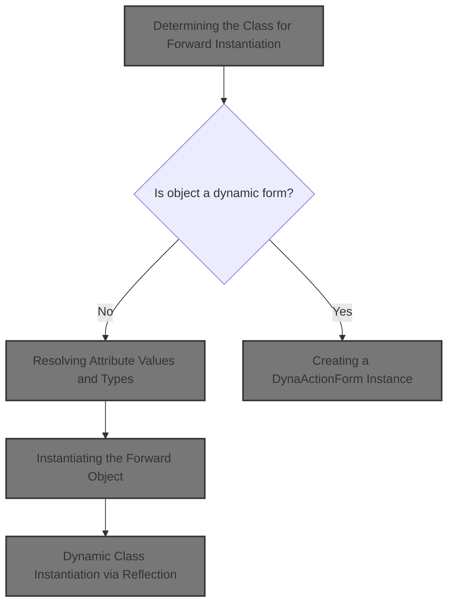
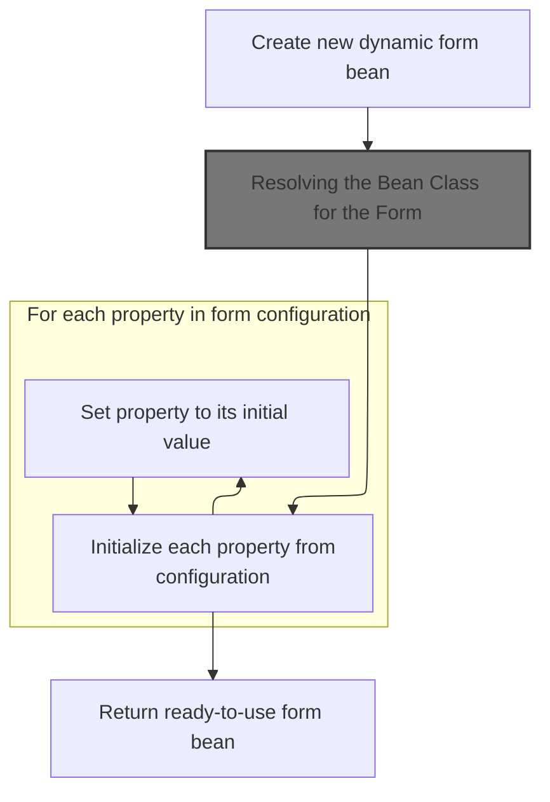
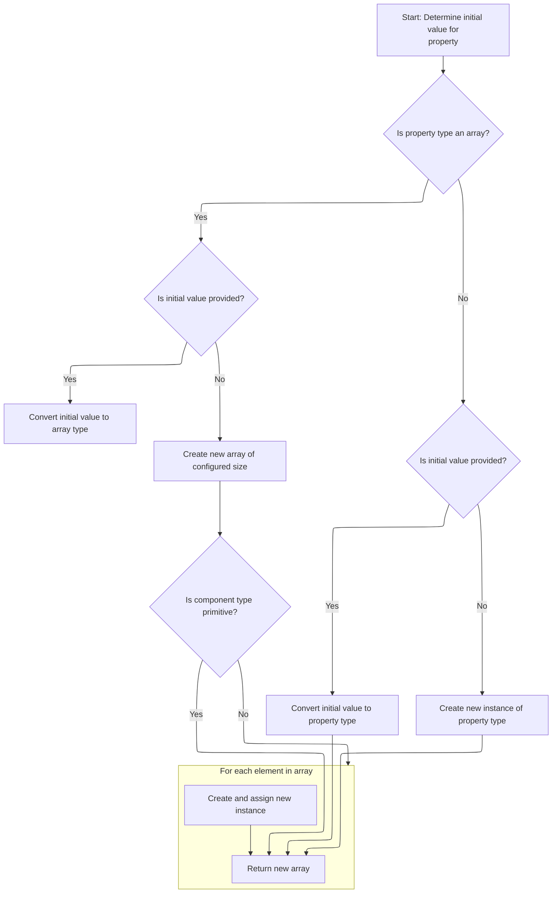

This document explains how the system dynamically creates and initializes navigation targets and form beans based on configuration. The flow determines the correct class, resolves attribute values, and initializes properties, enabling flexible navigation and form handling at runtime.



# Determining the Class for Forward Instantiation

<SwmSnippet path="/core/src/main/java/org/apache/struts/config/ConfigRuleSet.java" line="434">

---

In <SwmToken path="core/src/main/java/org/apache/struts/config/ConfigRuleSet.java" pos="434:5:5" line-data="    public Object createObject(Attributes attributes) {">`createObject`</SwmToken>, we figure out which class to instantiate for the ActionForward. The code first looks for a <SwmToken path="core/src/main/java/org/apache/struts/config/ConfigRuleSet.java" pos="436:3:3" line-data="        String className = attributes.getValue(&quot;className&quot;);">`className`</SwmToken> in the XML attributes. If it's missing, it grabs the default from the <SwmToken path="core/src/main/java/org/apache/struts/config/ConfigRuleSet.java" pos="439:1:1" line-data="            ModuleConfig mc = (ModuleConfig) digester.peek(1);">`ModuleConfig`</SwmToken> on the digester stack. Next, we need to resolve any attribute values (like <SwmToken path="core/src/main/java/org/apache/struts/config/ConfigRuleSet.java" pos="436:3:3" line-data="        String className = attributes.getValue(&quot;className&quot;);">`className`</SwmToken>) that might be wrapped or computed, which is why we call into <SwmToken path="tiles/src/main/java/org/apache/struts/tiles/xmlDefinition/XmlAttribute.java" pos="32:4:4" line-data="public class XmlAttribute {">`XmlAttribute`</SwmToken> to get the actual value.

```java
    public Object createObject(Attributes attributes) {
        // Identify the name of the class to instantiate
        String className = attributes.getValue("className");

```

---

</SwmSnippet>

## Resolving Attribute Values and Types

<SwmSnippet path="/tiles/src/main/java/org/apache/struts/tiles/xmlDefinition/XmlAttribute.java" line="142">

---

<SwmToken path="tiles/src/main/java/org/apache/struts/tiles/xmlDefinition/XmlAttribute.java" pos="142:5:5" line-data="    public Object getValue() {">`getValue`</SwmToken> checks if the real value is already computed and cached. If not, it calls <SwmToken path="tiles/src/main/java/org/apache/struts/tiles/xmlDefinition/XmlAttribute.java" pos="145:9:9" line-data="            this.realValue = this.computeRealValue();">`computeRealValue`</SwmToken> to resolve and cache it. This ensures we always work with the processed attribute value, not the raw input.

```java
    public Object getValue() {
        // Compatibility with JSP Template
        if (this.realValue == null) {
            this.realValue = this.computeRealValue();
        }

        return this.realValue;
    }
```

---

</SwmSnippet>

<SwmSnippet path="/tiles/src/main/java/org/apache/struts/tiles/xmlDefinition/XmlAttribute.java" line="204">

---

<SwmToken path="tiles/src/main/java/org/apache/struts/tiles/xmlDefinition/XmlAttribute.java" pos="204:5:5" line-data="    protected Object computeRealValue() {">`computeRealValue`</SwmToken> figures out how to wrap the value based on the 'direct' and <SwmToken path="tiles/src/main/java/org/apache/struts/tiles/xmlDefinition/XmlAttribute.java" pos="207:22:22" line-data="        // First check direct attribute, and translate it to a valueType.">`valueType`</SwmToken> fields. It uses string constants to pick the right attribute class, and if a role is set, it attaches it to the attribute. If only a role is set (no type), it wraps the value in an <SwmToken path="tiles/src/main/java/org/apache/struts/tiles/xmlDefinition/XmlAttribute.java" pos="232:3:3" line-data="                ((UntypedAttribute) realValue).setRole(role);">`UntypedAttribute`</SwmToken>. This logic is all about making sure the attribute is interpreted correctly for later use.

```java
    protected Object computeRealValue() {
        Object realValue = value;
        // Is there a type set ?
        // First check direct attribute, and translate it to a valueType.
        // Then, evaluate valueType, and create requested typed attribute.
        if (direct != null) {
            this.valueType =
                Boolean.valueOf(direct).booleanValue() ? "string" : "path";
        }

        if (value != null && valueType != null) {
            String strValue = value.toString();

            if (valueType.equalsIgnoreCase("string")) {
                realValue = new DirectStringAttribute(strValue);

            } else if (valueType.equalsIgnoreCase("page")) {
                realValue = new PathAttribute(strValue);

            } else if (valueType.equalsIgnoreCase("template")) {
                realValue = new PathAttribute(strValue);

            } else if (valueType.equalsIgnoreCase("instance")) {
                realValue = new DefinitionNameAttribute(strValue);
            }

            // Set realValue's role value if needed
            if (role != null) {
                ((UntypedAttribute) realValue).setRole(role);
            }
        }

        // Create attribute wrapper to hold role if role is set and no type
        // specified
        if (role != null && value != null && valueType == null) {
            realValue = new UntypedAttribute(value.toString(), role);
        }

        return realValue;
    }
```

---

</SwmSnippet>

## Instantiating the Forward Object

<SwmSnippet path="/core/src/main/java/org/apache/struts/config/ConfigRuleSet.java" line="438">

---

Back in <SwmToken path="core/src/main/java/org/apache/struts/config/ConfigRuleSet.java" pos="450:10:12" line-data="            digester.getLogger().error(&quot;ActionForwardFactory.createObject: &quot;, e);">`ActionForwardFactory.createObject`</SwmToken>, after resolving the class name and attribute values, we use the digester's stack to grab the <SwmToken path="core/src/main/java/org/apache/struts/config/ConfigRuleSet.java" pos="439:1:1" line-data="            ModuleConfig mc = (ModuleConfig) digester.peek(1);">`ModuleConfig`</SwmToken> if needed. Then, we call <SwmToken path="core/src/main/java/org/apache/struts/config/ConfigRuleSet.java" pos="448:5:7" line-data="            actionForward = RequestUtils.applicationInstance(className, cl);">`RequestUtils.applicationInstance`</SwmToken> to actually instantiate the class by name. This is where the object gets created dynamically based on the resolved configuration.

```java
        if (className == null) {
            ModuleConfig mc = (ModuleConfig) digester.peek(1);

            className = mc.getActionForwardClass();
        }

        // Instantiate the new object and return it
        Object actionForward = null;

        try {
            actionForward = RequestUtils.applicationInstance(className, cl);
        } catch (Exception e) {
            digester.getLogger().error("ActionForwardFactory.createObject: ", e);
        }

        return actionForward;
    }
```

---

</SwmSnippet>

# Dynamic Class Instantiation via Reflection

<SwmSnippet path="/core/src/main/java/org/apache/struts/util/RequestUtils.java" line="169">

---

<SwmToken path="core/src/main/java/org/apache/struts/util/RequestUtils.java" pos="169:7:7" line-data="    public static Object applicationInstance(String className,">`applicationInstance`</SwmToken> uses reflection to load and instantiate the class by name, using the provided class loader. Next, if the class is a <SwmToken path="core/src/main/java/org/apache/struts/action/DynaActionFormClass.java" pos="45:4:4" line-data="public class DynaActionFormClass implements DynaClass, Serializable {">`DynaActionFormClass`</SwmToken>, we need to call its <SwmToken path="core/src/main/java/org/apache/struts/util/RequestUtils.java" pos="173:12:12" line-data="        return (applicationClass(className, classLoader).newInstance());">`newInstance`</SwmToken> method to get the actual form bean instance.

```java
    public static Object applicationInstance(String className,
        ClassLoader classLoader)
        throws ClassNotFoundException, IllegalAccessException,
            InstantiationException {
        return (applicationClass(className, classLoader).newInstance());
    }
```

---

</SwmSnippet>

# Creating a <SwmToken path="core/src/main/java/org/apache/struts/action/DynaActionFormClass.java" pos="160:1:1" line-data="        DynaActionForm dynaBean = (DynaActionForm) getBeanClass().newInstance();">`DynaActionForm`</SwmToken> Instance



<SwmSnippet path="/core/src/main/java/org/apache/struts/action/DynaActionFormClass.java" line="158">

---

In <SwmToken path="core/src/main/java/org/apache/struts/action/DynaActionFormClass.java" pos="158:5:5" line-data="    public DynaBean newInstance()">`newInstance`</SwmToken>, we create a new <SwmToken path="core/src/main/java/org/apache/struts/action/DynaActionFormClass.java" pos="160:1:1" line-data="        DynaActionForm dynaBean = (DynaActionForm) getBeanClass().newInstance();">`DynaActionForm`</SwmToken> by instantiating the bean class. To do that, we need to make sure the bean class is available and up-to-date, so we call <SwmToken path="core/src/main/java/org/apache/struts/action/DynaActionFormClass.java" pos="160:11:11" line-data="        DynaActionForm dynaBean = (DynaActionForm) getBeanClass().newInstance();">`getBeanClass`</SwmToken> next.

```java
    public DynaBean newInstance()
        throws IllegalAccessException, InstantiationException {
        DynaActionForm dynaBean = (DynaActionForm) getBeanClass().newInstance();

```

---

</SwmSnippet>

## Resolving the Bean Class for the Form

<SwmSnippet path="/core/src/main/java/org/apache/struts/action/DynaActionFormClass.java" line="227">

---

<SwmToken path="core/src/main/java/org/apache/struts/action/DynaActionFormClass.java" pos="227:5:5" line-data="    protected Class getBeanClass() {">`getBeanClass`</SwmToken> checks if the bean class is already set. If not, it calls <SwmToken path="core/src/main/java/org/apache/struts/action/DynaActionFormClass.java" pos="229:1:1" line-data="            introspect(config);">`introspect`</SwmToken> to analyze the config and resolve the class. This step is needed before we can instantiate the bean.

```java
    protected Class getBeanClass() {
        if (beanClass == null) {
            introspect(config);
        }

        return (beanClass);
    }
```

---

</SwmSnippet>

## Analyzing Form Configuration and Property Types

```mermaid
%%{init: {"flowchart": {"defaultRenderer": "elk"}} }%%
flowchart TD
    node1["Analyze form bean configuration (type,
properties)"] --> node2{"Is form bean class valid?"}
    click node1 openCode "core/src/main/java/org/apache/struts/action/DynaActionFormClass.java:246:285"
    node2 -->|"Yes"| node3{"Is form bean class a subclass of dynamic
form?"}
    click node2 openCode "core/src/main/java/org/apache/struts/action/DynaActionFormClass.java:250:258"
    node2 -->|"No"| node8["Raise error: Invalid form bean class"]
    click node8 openCode "core/src/main/java/org/apache/struts/action/DynaActionFormClass.java:253:258"
    node3 -->|"Yes"| node4["Get property descriptors from
configuration"]
    click node3 openCode "core/src/main/java/org/apache/struts/action/DynaActionFormClass.java:260:264"
    node3 -->|"No"| node9["Raise error: Not a dynamic form subclass"]
    click node9 openCode "core/src/main/java/org/apache/struts/action/DynaActionFormClass.java:261:264"
    node4 --> node5{"Are there property descriptors?"}
    click node4 openCode "core/src/main/java/org/apache/struts/action/DynaActionFormClass.java:270:274"
    node5 -->|"No"| node6["No properties to define"]
    click node6 openCode "core/src/main/java/org/apache/struts/action/DynaActionFormClass.java:273:274"
    node5 -->|"Yes"| node7["Prepare to define dynamic properties"]
    click node7 openCode "core/src/main/java/org/apache/struts/action/DynaActionFormClass.java:277:278"
    node6 --> node10["Form ready for use"]
    click node10 openCode "core/src/main/java/org/apache/struts/action/DynaActionFormClass.java:285:285"
    
    subgraph loop1["For each property descriptor"]
      node7 --> node11["Create and register dynamic property"]
      click node11 openCode "core/src/main/java/org/apache/struts/action/DynaActionFormClass.java:279:284"
      node11 --> node10
    end
    node7 --> node10["Form ready for use"]
    click node10 openCode "core/src/main/java/org/apache/struts/action/DynaActionFormClass.java:285:285"

classDef HeadingStyle fill:#777777,stroke:#333,stroke-width:2px;

%% Swimm:
%% %%{init: {"flowchart": {"defaultRenderer": "elk"}} }%%
%% flowchart TD
%%     node1["Analyze form bean configuration (type,
%% properties)"] --> node2{"Is form bean class valid?"}
%%     click node1 openCode "<SwmPath>[core/…/action/DynaActionFormClass.java](core/src/main/java/org/apache/struts/action/DynaActionFormClass.java)</SwmPath>:246:285"
%%     node2 -->|"Yes"| node3{"Is form bean class a subclass of dynamic
%% form?"}
%%     click node2 openCode "<SwmPath>[core/…/action/DynaActionFormClass.java](core/src/main/java/org/apache/struts/action/DynaActionFormClass.java)</SwmPath>:250:258"
%%     node2 -->|"No"| node8["Raise error: Invalid form bean class"]
%%     click node8 openCode "<SwmPath>[core/…/action/DynaActionFormClass.java](core/src/main/java/org/apache/struts/action/DynaActionFormClass.java)</SwmPath>:253:258"
%%     node3 -->|"Yes"| node4["Get property descriptors from
%% configuration"]
%%     click node3 openCode "<SwmPath>[core/…/action/DynaActionFormClass.java](core/src/main/java/org/apache/struts/action/DynaActionFormClass.java)</SwmPath>:260:264"
%%     node3 -->|"No"| node9["Raise error: Not a dynamic form subclass"]
%%     click node9 openCode "<SwmPath>[core/…/action/DynaActionFormClass.java](core/src/main/java/org/apache/struts/action/DynaActionFormClass.java)</SwmPath>:261:264"
%%     node4 --> node5{"Are there property descriptors?"}
%%     click node4 openCode "<SwmPath>[core/…/action/DynaActionFormClass.java](core/src/main/java/org/apache/struts/action/DynaActionFormClass.java)</SwmPath>:270:274"
%%     node5 -->|"No"| node6["No properties to define"]
%%     click node6 openCode "<SwmPath>[core/…/action/DynaActionFormClass.java](core/src/main/java/org/apache/struts/action/DynaActionFormClass.java)</SwmPath>:273:274"
%%     node5 -->|"Yes"| node7["Prepare to define dynamic properties"]
%%     click node7 openCode "<SwmPath>[core/…/action/DynaActionFormClass.java](core/src/main/java/org/apache/struts/action/DynaActionFormClass.java)</SwmPath>:277:278"
%%     node6 --> node10["Form ready for use"]
%%     click node10 openCode "<SwmPath>[core/…/action/DynaActionFormClass.java](core/src/main/java/org/apache/struts/action/DynaActionFormClass.java)</SwmPath>:285:285"
%%     
%%     subgraph loop1["For each property descriptor"]
%%       node7 --> node11["Create and register dynamic property"]
%%       click node11 openCode "<SwmPath>[core/…/action/DynaActionFormClass.java](core/src/main/java/org/apache/struts/action/DynaActionFormClass.java)</SwmPath>:279:284"
%%       node11 --> node10
%%     end
%%     node7 --> node10["Form ready for use"]
%%     click node10 openCode "<SwmPath>[core/…/action/DynaActionFormClass.java](core/src/main/java/org/apache/struts/action/DynaActionFormClass.java)</SwmPath>:285:285"
%% 
%% classDef HeadingStyle fill:#777777,stroke:#333,stroke-width:2px;
```



<SwmSnippet path="/core/src/main/java/org/apache/struts/action/DynaActionFormClass.java" line="246">

---

<SwmToken path="core/src/main/java/org/apache/struts/action/DynaActionFormClass.java" pos="246:5:5" line-data="    protected void introspect(FormBeanConfig config) {">`introspect`</SwmToken> validates the bean class, sets up the form name, and builds property descriptors for each form property. For each property, it calls <SwmToken path="core/src/main/java/org/apache/struts/action/DynaActionFormClass.java" pos="282:6:6" line-data="                    descriptors[i].getTypeClass());">`getTypeClass`</SwmToken> to resolve the Java type, so we need to go into <SwmToken path="core/src/main/java/org/apache/struts/action/DynaActionFormClass.java" pos="270:1:1" line-data="        FormPropertyConfig[] descriptors = config.findFormPropertyConfigs();">`FormPropertyConfig`</SwmToken> for that logic.

```java
    protected void introspect(FormBeanConfig config) {
        this.config = config;

        // Validate the ActionFormBean implementation class
        try {
            beanClass = RequestUtils.applicationClass(config.getType());
        } catch (Throwable t) {
        	IllegalArgumentException t2 = new IllegalArgumentException(
                "Cannot instantiate ActionFormBean class '" + config.getType()
                + "'");
        	t2.initCause(t);
        	throw t2;
        }

        if (!DynaActionForm.class.isAssignableFrom(beanClass)) {
            throw new IllegalArgumentException("Class '" + config.getType()
                + "' is not a subclass of "
                + "'org.apache.struts.action.DynaActionForm'");
        }

        // Set the name we will know ourselves by from the form bean name
        this.name = config.getName();

        // Look up the property descriptors for this bean class
        FormPropertyConfig[] descriptors = config.findFormPropertyConfigs();

        if (descriptors == null) {
            descriptors = new FormPropertyConfig[0];
        }

        // Create corresponding dynamic property definitions
        properties = new DynaProperty[descriptors.length];

        for (int i = 0; i < descriptors.length; i++) {
            properties[i] =
                new DynaProperty(descriptors[i].getName(),
                    descriptors[i].getTypeClass());
            propertiesMap.put(properties[i].getName(), properties[i]);
        }
    }
```

---

</SwmSnippet>

<SwmSnippet path="/core/src/main/java/org/apache/struts/config/FormPropertyConfig.java" line="221">

---

<SwmToken path="core/src/main/java/org/apache/struts/config/FormPropertyConfig.java" pos="221:5:5" line-data="    public Class getTypeClass() {">`getTypeClass`</SwmToken> figures out the Java Class for a property, handling primitives, arrays, and regular classes. If it's an array, it creates a <SwmToken path="core/src/main/java/org/apache/struts/action/DynaActionFormClass.java" pos="131:8:10" line-data="     * defined, a zero-length array will be returned.&lt;/p&gt;">`zero-length`</SwmToken> array to get the right Class object. This is needed so the dynamic form knows how to handle each property type.

```java
    public Class getTypeClass() {
        // Identify the base class (in case an array was specified)
        String baseType = getType();
        boolean indexed = false;

        if (baseType.endsWith("[]")) {
            baseType = baseType.substring(0, baseType.length() - 2);
            indexed = true;
        }

        // Construct an appropriate Class instance for the base class
        Class baseClass = null;

        if ("boolean".equals(baseType)) {
            baseClass = Boolean.TYPE;
        } else if ("byte".equals(baseType)) {
            baseClass = Byte.TYPE;
        } else if ("char".equals(baseType)) {
            baseClass = Character.TYPE;
        } else if ("double".equals(baseType)) {
            baseClass = Double.TYPE;
        } else if ("float".equals(baseType)) {
            baseClass = Float.TYPE;
        } else if ("int".equals(baseType)) {
            baseClass = Integer.TYPE;
        } else if ("long".equals(baseType)) {
            baseClass = Long.TYPE;
        } else if ("short".equals(baseType)) {
            baseClass = Short.TYPE;
        } else {
            ClassLoader classLoader =
                Thread.currentThread().getContextClassLoader();

            if (classLoader == null) {
                classLoader = this.getClass().getClassLoader();
            }

            try {
                baseClass = classLoader.loadClass(baseType);
            } catch (ClassNotFoundException ex) {
                log.error("Class '" + baseType +
                          "' not found for property '" + name + "'");
                baseClass = null;
            }
        }

        // Return the base class or an array appropriately
        if (indexed) {
            return (Array.newInstance(baseClass, 0).getClass());
        } else {
            return (baseClass);
        }
    }
```

---

</SwmSnippet>

## Populating the <SwmToken path="core/src/main/java/org/apache/struts/action/DynaActionFormClass.java" pos="160:1:1" line-data="        DynaActionForm dynaBean = (DynaActionForm) getBeanClass().newInstance();">`DynaActionForm`</SwmToken> with Initial Values

<SwmSnippet path="/core/src/main/java/org/apache/struts/action/DynaActionFormClass.java" line="162">

---

Back in `DynaActionFormClass.newInstance`, after creating the bean, we loop through all property configs and set their initial values on the form. For each property, we call <SwmToken path="core/src/main/java/org/apache/struts/action/DynaActionFormClass.java" pos="167:20:22" line-data="            dynaBean.set(props[i].getName(), props[i].initial());">`initial()`</SwmToken> in <SwmToken path="core/src/main/java/org/apache/struts/action/DynaActionFormClass.java" pos="164:1:1" line-data="        FormPropertyConfig[] props = config.findFormPropertyConfigs();">`FormPropertyConfig`</SwmToken> to get the value to set.

```java
        dynaBean.setDynaActionFormClass(this);

        FormPropertyConfig[] props = config.findFormPropertyConfigs();

        for (int i = 0; i < props.length; i++) {
            dynaBean.set(props[i].getName(), props[i].initial());
        }

        return (dynaBean);
    }
```

---

</SwmSnippet>

# Computing Initial Values for Form Properties



<SwmSnippet path="/core/src/main/java/org/apache/struts/config/FormPropertyConfig.java" line="318">

---

In <SwmToken path="core/src/main/java/org/apache/struts/config/FormPropertyConfig.java" pos="318:5:5" line-data="    public Object initial() {">`initial`</SwmToken>, we start by figuring out the type of the property and whether it's an array. If so, we need to handle conversion or instantiation differently, so we keep going in this function to cover both cases.

```java
    public Object initial() {
        Object initialValue = null;

        try {
            Class clazz = getTypeClass();

```

---

</SwmSnippet>

<SwmSnippet path="/core/src/main/java/org/apache/struts/config/FormPropertyConfig.java" line="324">

---

Still in <SwmToken path="core/src/main/java/org/apache/struts/config/FormPropertyConfig.java" pos="325:4:4" line-data="                if (initial != null) {">`initial`</SwmToken>, if the property is an array and no initial value is set, we create a new array and try to instantiate each element. For non-arrays, we either convert the initial value or create a new instance. The function relies on fields like 'initial', 'size', 'name', and 'type' to decide what to do and for logging.

```java
            if (clazz.isArray()) {
                if (initial != null) {
                    initialValue = ConvertUtils.convert(initial, clazz);
                } else {
                    initialValue =
                        Array.newInstance(clazz.getComponentType(), size);

                    if (!(clazz.getComponentType().isPrimitive())) {
                        for (int i = 0; i < size; i++) {
                            try {
                                Array.set(initialValue, i,
                                    clazz.getComponentType().newInstance());
                            } catch (Throwable t) {
                                log.error("Unable to create instance of "
                                    + clazz.getName() + " for property=" + name
                                    + ", type=" + type + ", initial=" + initial
                                    + ", size=" + size + ".");

                                //FIXME: Should we just dump the entire application/module ?
                            }
                        }
```

---

</SwmSnippet>

<SwmSnippet path="/core/src/main/java/org/apache/struts/config/FormPropertyConfig.java" line="348">

---

Now that <SwmToken path="core/src/main/java/org/apache/struts/config/FormPropertyConfig.java" pos="348:4:4" line-data="                if (initial != null) {">`initial`</SwmToken> has finished, we return the computed value to <SwmToken path="core/src/main/java/org/apache/struts/action/DynaActionFormClass.java" pos="45:4:4" line-data="public class DynaActionFormClass implements DynaClass, Serializable {">`DynaActionFormClass`</SwmToken>, which sets it on the form bean. This step finalizes the setup of the dynamic form with all initial values, handling both arrays and single-value properties.

```java
                if (initial != null) {
                    initialValue = ConvertUtils.convert(initial, clazz);
                } else {
                    initialValue = clazz.newInstance();
                }
            }
        } catch (Throwable t) {
            initialValue = null;
        }

        return (initialValue);
    }
```

---

</SwmSnippet>

&nbsp;

*This is an auto-generated document by Swimm 🌊 and has not yet been verified by a human*

<SwmMeta version="3.0.0" repo-id="Z2l0aHViJTNBJTNBc3RydXRzMSUzQSUzQVN3aW1tLURlbW8=" repo-name="struts1"><sup>Powered by [Swimm](https://app.swimm.io/)</sup></SwmMeta>
