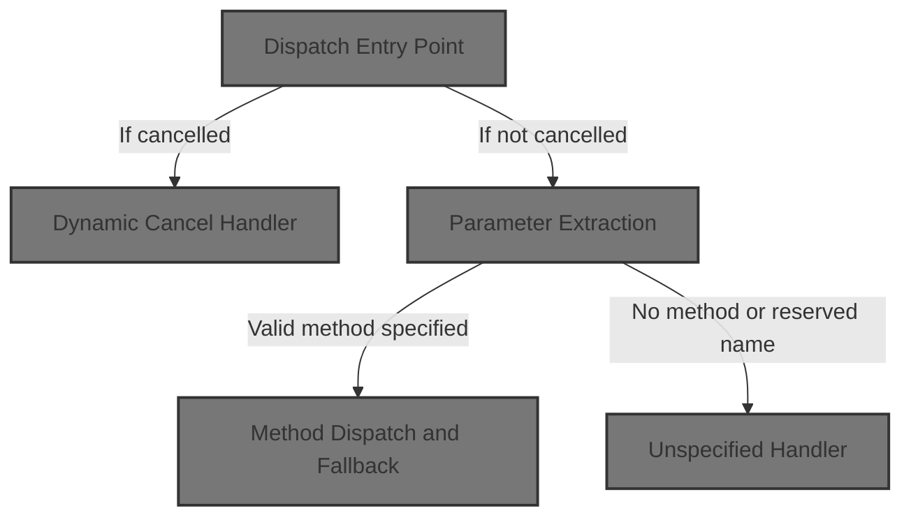
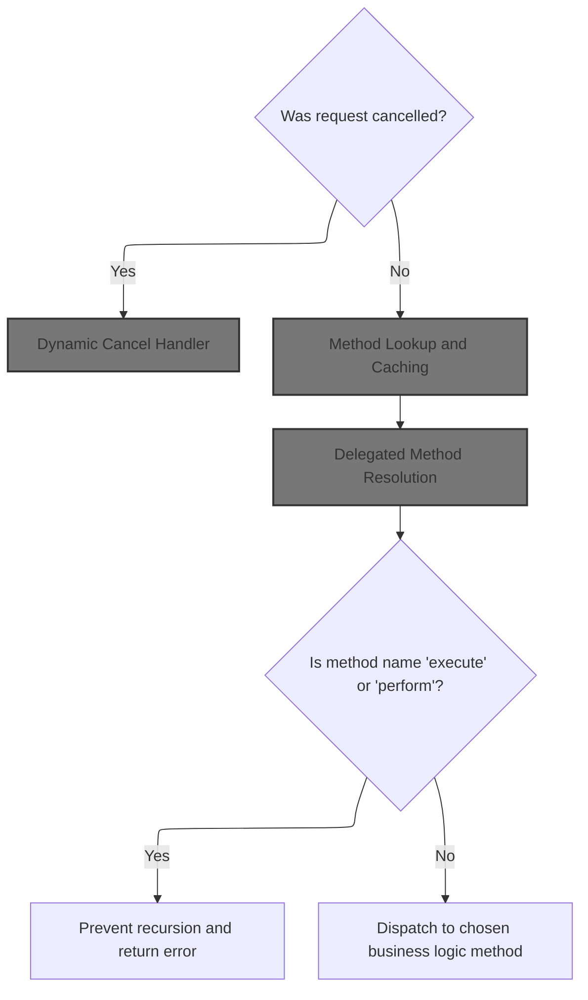
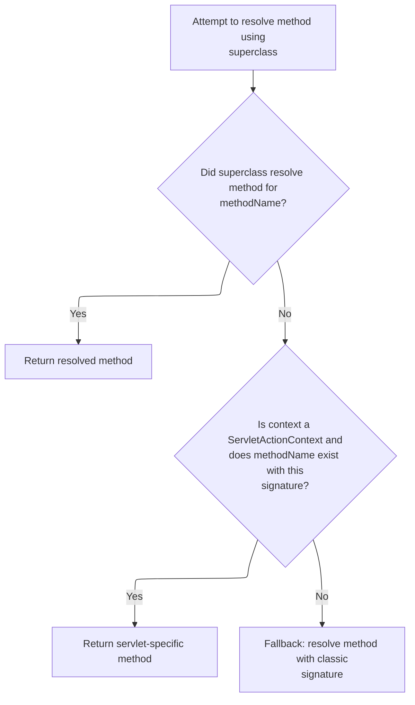
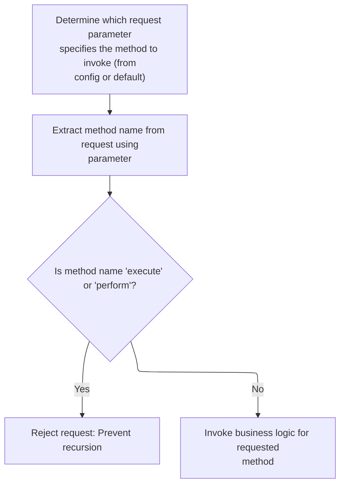
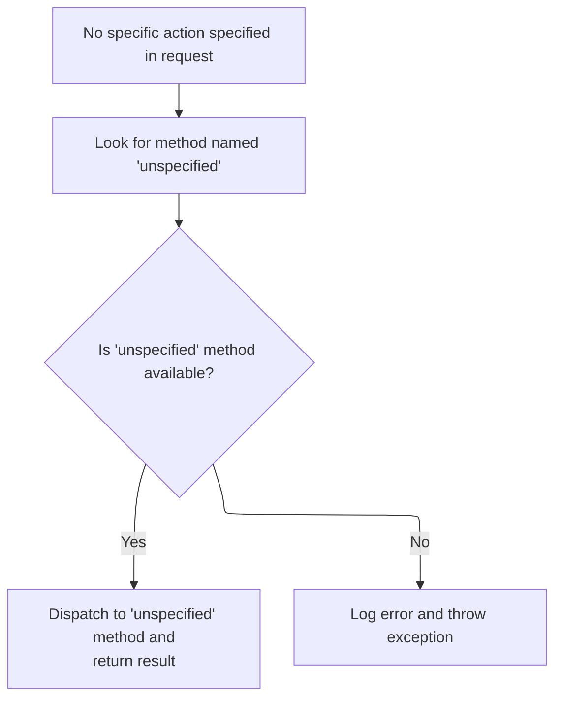

This document explains how HTTP requests are routed to the correct business logic method, enabling flexible handling of user actions. The flow checks for cancellation, determines the method to invoke, prevents recursion, and dispatches to the appropriate business logic, returning a navigation outcome or user response.



# Where is this flow used?

This flow is used multiple times in the codebase as represented in the following diagram:

(Note - these are only some of the entry points of this flow)

```mermaid
graph TD;
      dde35d78060f1afca84b5e9dedc002fc37669b07142e9d5a1f656107cc900aa0(core/…/action/ActionServlet.java::ActionServlet.doGet) --> 294cd284fa406b4fe4f160157c73b79eaa7835613a545efd883ce1f14dd1ca7e(core/…/action/ActionServlet.java::ActionServlet.process)

294cd284fa406b4fe4f160157c73b79eaa7835613a545efd883ce1f14dd1ca7e(core/…/action/ActionServlet.java::ActionServlet.process) --> 8021481ad2e61cbffbd4896e05edd9e89db84071d125277e9a801c0e7ae658c3(core/…/action/ActionServlet.java::ActionServlet.getRequestProcessor)

294cd284fa406b4fe4f160157c73b79eaa7835613a545efd883ce1f14dd1ca7e(core/…/action/ActionServlet.java::ActionServlet.process) --> 1f3af44bfff9bae4b8af237be5302e37d202c99867273a09e77b9f6144dee63a(core/…/action/RequestProcessor.java::RequestProcessor.process)

8021481ad2e61cbffbd4896e05edd9e89db84071d125277e9a801c0e7ae658c3(core/…/action/ActionServlet.java::ActionServlet.getRequestProcessor) --> b2f59f4493e68c30a2337ffecc4fad8d1689fba0a6112201541d9b6d2026e962(core/…/action/ActionServlet.java::ActionServlet.init)

b2f59f4493e68c30a2337ffecc4fad8d1689fba0a6112201541d9b6d2026e962(core/…/action/ActionServlet.java::ActionServlet.init) --> 2c8cfecda12ad35498f942d194e0d79f8600eded97c6acdc28b3d0510ec31f6b(core/…/action/ActionServlet.java::ActionServlet.initServlet)

b2f59f4493e68c30a2337ffecc4fad8d1689fba0a6112201541d9b6d2026e962(core/…/action/ActionServlet.java::ActionServlet.init) --> 65beff19e283dcc9f10a2d5b921efb59af07ff7f298d2ae532cae422039f99ba(core/…/action/ActionServlet.java::ActionServlet.initModulePlugIns)

b2f59f4493e68c30a2337ffecc4fad8d1689fba0a6112201541d9b6d2026e962(core/…/action/ActionServlet.java::ActionServlet.init) --> 3af3889eef203230d9271829c5b04c8d29c0768eb8f3f5b9695f3d0028fa4502(core/…/action/ActionServlet.java::ActionServlet.initChain)

b2f59f4493e68c30a2337ffecc4fad8d1689fba0a6112201541d9b6d2026e962(core/…/action/ActionServlet.java::ActionServlet.init) --> 610c8fe78f105cb8870b4b4b1b0c0f72d6b826e448837c139021e120632eb987(core/…/action/ActionServlet.java::ActionServlet.initModuleConfig)

b2f59f4493e68c30a2337ffecc4fad8d1689fba0a6112201541d9b6d2026e962(core/…/action/ActionServlet.java::ActionServlet.init) --> 39c036b8a75032c6167ca2a13122f3be2914abac7770c67a0c2b44fc66f45294(core/…/action/ActionServlet.java::ActionServlet.initOther)

2c8cfecda12ad35498f942d194e0d79f8600eded97c6acdc28b3d0510ec31f6b(core/…/action/ActionServlet.java::ActionServlet.initServlet) --> 4cdf8eb85fe3072b6df6cb29f60955d02a212410aec62cbb410cec93d06ed621(apps/…/memory/MemoryUserDatabase.java::MemoryUserDatabase.close)

2c8cfecda12ad35498f942d194e0d79f8600eded97c6acdc28b3d0510ec31f6b(core/…/action/ActionServlet.java::ActionServlet.initServlet) --> 52fa799f1bfb2861cd38c39c49af294fcfa8b0cbc4019565c4f5711b129f9361(tiles/…/xmlDefinition/XmlParser.java::XmlParser.parse)

2c8cfecda12ad35498f942d194e0d79f8600eded97c6acdc28b3d0510ec31f6b(core/…/action/ActionServlet.java::ActionServlet.initServlet) --> 0acfcef2e8460f1fff6d07d11c4b5f3025e0c6a2ff3e6b202cdfc0027c9357d6(apps/…/example2/LoggedOff.java::LoggedOff.register)

4cdf8eb85fe3072b6df6cb29f60955d02a212410aec62cbb410cec93d06ed621(apps/…/memory/MemoryUserDatabase.java::MemoryUserDatabase.close) --> a2be4500d8d135e330f365f3f420f8a43d71b2a1cc1167178cb71ce5fe69cf31(apps/…/memory/MemoryUserDatabase.java::MemoryUserDatabase.save)

a2be4500d8d135e330f365f3f420f8a43d71b2a1cc1167178cb71ce5fe69cf31(apps/…/memory/MemoryUserDatabase.java::MemoryUserDatabase.save) --> 254d58e90ba2b2b61ab79ce39d7446c14a4a14d371430042dc180b550f653b41(apps/…/example/RegistrationBacking.java::RegistrationBacking.delete)

a2be4500d8d135e330f365f3f420f8a43d71b2a1cc1167178cb71ce5fe69cf31(apps/…/memory/MemoryUserDatabase.java::MemoryUserDatabase.save) --> 4cdf8eb85fe3072b6df6cb29f60955d02a212410aec62cbb410cec93d06ed621(apps/…/memory/MemoryUserDatabase.java::MemoryUserDatabase.close)

254d58e90ba2b2b61ab79ce39d7446c14a4a14d371430042dc180b550f653b41(apps/…/example/RegistrationBacking.java::RegistrationBacking.delete) --> 5c181cde24e3b64c963ebfa5ba234b5e5d97f516751d29123e1fd474deff3e80(apps/…/example/AbstractBacking.java::AbstractBacking.forward)

5c181cde24e3b64c963ebfa5ba234b5e5d97f516751d29123e1fd474deff3e80(apps/…/example/AbstractBacking.java::AbstractBacking.forward) --> 2b8271d2d447d4059ff0654036892584e86afeba055f20f9440b12336fee5a77(extras/…/actions/ActionDispatcher.java::ActionDispatcher.dispatch)

2b8271d2d447d4059ff0654036892584e86afeba055f20f9440b12336fee5a77(extras/…/actions/ActionDispatcher.java::ActionDispatcher.dispatch) --> 6c4c5b4fba3fc169d3d0d65df51d28c292dd55d06364f3ea4b95e1f5c3f2a237(extras/…/actions/ActionDispatcher.java::ActionDispatcher.execute)

52fa799f1bfb2861cd38c39c49af294fcfa8b0cbc4019565c4f5711b129f9361(tiles/…/xmlDefinition/XmlParser.java::XmlParser.parse) --> 4cdf8eb85fe3072b6df6cb29f60955d02a212410aec62cbb410cec93d06ed621(apps/…/memory/MemoryUserDatabase.java::MemoryUserDatabase.close)

52fa799f1bfb2861cd38c39c49af294fcfa8b0cbc4019565c4f5711b129f9361(tiles/…/xmlDefinition/XmlParser.java::XmlParser.parse) --> 52fa799f1bfb2861cd38c39c49af294fcfa8b0cbc4019565c4f5711b129f9361(tiles/…/xmlDefinition/XmlParser.java::XmlParser.parse)

0acfcef2e8460f1fff6d07d11c4b5f3025e0c6a2ff3e6b202cdfc0027c9357d6(apps/…/example2/LoggedOff.java::LoggedOff.register) --> 21539d92859952d1bee72ed71bd65ab80650933b95e2d2044bec742235252797(apps/…/example2/LoggedOff.java::LoggedOff.forward)

21539d92859952d1bee72ed71bd65ab80650933b95e2d2044bec742235252797(apps/…/example2/LoggedOff.java::LoggedOff.forward) --> 2b8271d2d447d4059ff0654036892584e86afeba055f20f9440b12336fee5a77(extras/…/actions/ActionDispatcher.java::ActionDispatcher.dispatch)

65beff19e283dcc9f10a2d5b921efb59af07ff7f298d2ae532cae422039f99ba(core/…/action/ActionServlet.java::ActionServlet.initModulePlugIns) --> b2f59f4493e68c30a2337ffecc4fad8d1689fba0a6112201541d9b6d2026e962(core/…/action/ActionServlet.java::ActionServlet.init)

3af3889eef203230d9271829c5b04c8d29c0768eb8f3f5b9695f3d0028fa4502(core/…/action/ActionServlet.java::ActionServlet.initChain) --> 52fa799f1bfb2861cd38c39c49af294fcfa8b0cbc4019565c4f5711b129f9361(tiles/…/xmlDefinition/XmlParser.java::XmlParser.parse)

610c8fe78f105cb8870b4b4b1b0c0f72d6b826e448837c139021e120632eb987(core/…/action/ActionServlet.java::ActionServlet.initModuleConfig) --> 150db3976b8039626b99b49a0033ea4fdc7f345e420acaa0123644cf6131b79b(core/…/action/ActionServlet.java::ActionServlet.parseModuleConfigFile)

610c8fe78f105cb8870b4b4b1b0c0f72d6b826e448837c139021e120632eb987(core/…/action/ActionServlet.java::ActionServlet.initModuleConfig) --> a5a2b8447a8707985e91c2eb8cd65b0196481799e317053c8b795d54ed2228c6(core/…/action/ActionServlet.java::ActionServlet.initConfigDigester)

150db3976b8039626b99b49a0033ea4fdc7f345e420acaa0123644cf6131b79b(core/…/action/ActionServlet.java::ActionServlet.parseModuleConfigFile) --> 52fa799f1bfb2861cd38c39c49af294fcfa8b0cbc4019565c4f5711b129f9361(tiles/…/xmlDefinition/XmlParser.java::XmlParser.parse)

a5a2b8447a8707985e91c2eb8cd65b0196481799e317053c8b795d54ed2228c6(core/…/action/ActionServlet.java::ActionServlet.initConfigDigester) --> 0acfcef2e8460f1fff6d07d11c4b5f3025e0c6a2ff3e6b202cdfc0027c9357d6(apps/…/example2/LoggedOff.java::LoggedOff.register)

39c036b8a75032c6167ca2a13122f3be2914abac7770c67a0c2b44fc66f45294(core/…/action/ActionServlet.java::ActionServlet.initOther) --> 0acfcef2e8460f1fff6d07d11c4b5f3025e0c6a2ff3e6b202cdfc0027c9357d6(apps/…/example2/LoggedOff.java::LoggedOff.register)

1f3af44bfff9bae4b8af237be5302e37d202c99867273a09e77b9f6144dee63a(core/…/action/RequestProcessor.java::RequestProcessor.process) --> 50581ec391f4fce49b6dbae97891e027c2d8240a26ea5444e94a177c6bee499e(core/…/action/RequestProcessor.java::RequestProcessor.processValidate)

1f3af44bfff9bae4b8af237be5302e37d202c99867273a09e77b9f6144dee63a(core/…/action/RequestProcessor.java::RequestProcessor.process) --> 950268dace090f80989e1c38beca99d578ce3c9f14697023c47ed6944c474162(core/…/action/RequestProcessor.java::RequestProcessor.processForward)

1f3af44bfff9bae4b8af237be5302e37d202c99867273a09e77b9f6144dee63a(core/…/action/RequestProcessor.java::RequestProcessor.process) --> 8b789e18ff6c9d0e1317cca067fbf008bb49e8498d5f1ef717d06c6a41f0eace(core/…/action/RequestProcessor.java::RequestProcessor.processForwardConfig)

50581ec391f4fce49b6dbae97891e027c2d8240a26ea5444e94a177c6bee499e(core/…/action/RequestProcessor.java::RequestProcessor.processValidate) --> 94fffc1464bea572168ee3270b418f0e684b6aa236c20f3874fe7d518c564a9e(core/…/upload/CommonsMultipartRequestHandler.java::CommonsMultipartRequestHandler.rollback)

50581ec391f4fce49b6dbae97891e027c2d8240a26ea5444e94a177c6bee499e(core/…/action/RequestProcessor.java::RequestProcessor.processValidate) --> 393c53d9015f0fd600d33785f976190e4842bf67d12d56f39b560163859ad5f2(core/…/action/RequestProcessor.java::RequestProcessor.internalModuleRelativeForward)

50581ec391f4fce49b6dbae97891e027c2d8240a26ea5444e94a177c6bee499e(core/…/action/RequestProcessor.java::RequestProcessor.processValidate) --> 8b789e18ff6c9d0e1317cca067fbf008bb49e8498d5f1ef717d06c6a41f0eace(core/…/action/RequestProcessor.java::RequestProcessor.processForwardConfig)

94fffc1464bea572168ee3270b418f0e684b6aa236c20f3874fe7d518c564a9e(core/…/upload/CommonsMultipartRequestHandler.java::CommonsMultipartRequestHandler.rollback) --> 409b2ac5ce261b79567c4cfe041bbfd928494aaa99ebc8e3af20fc56eb4c2ea9(core/…/upload/CommonsMultipartRequestHandler.java::CommonsFormFile.destroy)

409b2ac5ce261b79567c4cfe041bbfd928494aaa99ebc8e3af20fc56eb4c2ea9(core/…/upload/CommonsMultipartRequestHandler.java::CommonsFormFile.destroy) --> 254d58e90ba2b2b61ab79ce39d7446c14a4a14d371430042dc180b550f653b41(apps/…/example/RegistrationBacking.java::RegistrationBacking.delete)

393c53d9015f0fd600d33785f976190e4842bf67d12d56f39b560163859ad5f2(core/…/action/RequestProcessor.java::RequestProcessor.internalModuleRelativeForward) --> f0050ecd48a27f733ef0332b473c54a19d29170a356c315edd1c3e1d9fdde324(core/…/action/RequestProcessor.java::RequestProcessor.doForward)

f0050ecd48a27f733ef0332b473c54a19d29170a356c315edd1c3e1d9fdde324(core/…/action/RequestProcessor.java::RequestProcessor.doForward) --> 5c181cde24e3b64c963ebfa5ba234b5e5d97f516751d29123e1fd474deff3e80(apps/…/example/AbstractBacking.java::AbstractBacking.forward)

8b789e18ff6c9d0e1317cca067fbf008bb49e8498d5f1ef717d06c6a41f0eace(core/…/action/RequestProcessor.java::RequestProcessor.processForwardConfig) --> f0050ecd48a27f733ef0332b473c54a19d29170a356c315edd1c3e1d9fdde324(core/…/action/RequestProcessor.java::RequestProcessor.doForward)

950268dace090f80989e1c38beca99d578ce3c9f14697023c47ed6944c474162(core/…/action/RequestProcessor.java::RequestProcessor.processForward) --> 393c53d9015f0fd600d33785f976190e4842bf67d12d56f39b560163859ad5f2(core/…/action/RequestProcessor.java::RequestProcessor.internalModuleRelativeForward)

ec52fb7c28a6afaae4fd5937965ca776c6c12441d8a10e0b92b387b05c5c5cf5(core/…/action/ActionServlet.java::ActionServlet.doPost) --> 294cd284fa406b4fe4f160157c73b79eaa7835613a545efd883ce1f14dd1ca7e(core/…/action/ActionServlet.java::ActionServlet.process)

f42b5fa1bea56d8ff671c6affb9d85867c0cd9c866b2e87d4e79e1160c4ffca1(tiles/…/tiles/RedeployableActionServlet.java::RedeployableActionServlet.getRequestProcessor) --> 8021481ad2e61cbffbd4896e05edd9e89db84071d125277e9a801c0e7ae658c3(core/…/action/ActionServlet.java::ActionServlet.getRequestProcessor)

dddf0d96694fd2e68165f2dd8b7e18080f18dd95805f51cb8f454b28c8cb9f2e(tiles/…/tiles/RedeployableActionServlet.java::RedeployableActionServlet.getRequestProcessor) --> 8021481ad2e61cbffbd4896e05edd9e89db84071d125277e9a801c0e7ae658c3(core/…/action/ActionServlet.java::ActionServlet.getRequestProcessor)

124b12269f22ea1c1cc40a515eb4f3057c2d0670c8f4c40566880bc930bb8f93(tiles/…/xmlDefinition/I18nFactorySet.java::I18nFactorySet.initFactory) --> c4bf75c9f95bd4da5e48b350e1cf60ec10a6a8b217b7f202a083ec0f6ab346fe(tiles/…/xmlDefinition/I18nFactorySet.java::I18nFactorySet.createDefaultFactory)

c4bf75c9f95bd4da5e48b350e1cf60ec10a6a8b217b7f202a083ec0f6ab346fe(tiles/…/xmlDefinition/I18nFactorySet.java::I18nFactorySet.createDefaultFactory) --> 357727d10060d5ca6793ed7552e1269b5d3c0a3fadd33a24371ca05b2f957eaa(tiles/…/xmlDefinition/I18nFactorySet.java::I18nFactorySet.parseXmlFiles)

357727d10060d5ca6793ed7552e1269b5d3c0a3fadd33a24371ca05b2f957eaa(tiles/…/xmlDefinition/I18nFactorySet.java::I18nFactorySet.parseXmlFiles) --> 5ebe85f460b23e354a34650d70452bd8886b2829641339c7c902a173b09b2195(tiles/…/xmlDefinition/I18nFactorySet.java::I18nFactorySet.parseXmlFile)

5ebe85f460b23e354a34650d70452bd8886b2829641339c7c902a173b09b2195(tiles/…/xmlDefinition/I18nFactorySet.java::I18nFactorySet.parseXmlFile) --> 52fa799f1bfb2861cd38c39c49af294fcfa8b0cbc4019565c4f5711b129f9361(tiles/…/xmlDefinition/XmlParser.java::XmlParser.parse)


classDef mainFlowStyle color:#000000,fill:#7CB9F4
classDef rootsStyle color:#000000,fill:#00FFF4
classDef Style1 color:#000000,fill:#00FFAA
classDef Style2 color:#000000,fill:#FFFF00
classDef Style3 color:#000000,fill:#AA7CB9

%% Swimm:
%% graph TD;
%%       dde35d78060f1afca84b5e9dedc002fc37669b07142e9d5a1f656107cc900aa0(<SwmPath>[core/…/action/ActionServlet.java](core/src/main/java/org/apache/struts/action/ActionServlet.java)</SwmPath>::ActionServlet.doGet) --> 294cd284fa406b4fe4f160157c73b79eaa7835613a545efd883ce1f14dd1ca7e(<SwmPath>[core/…/action/ActionServlet.java](core/src/main/java/org/apache/struts/action/ActionServlet.java)</SwmPath>::ActionServlet.process)
%% 
%% 294cd284fa406b4fe4f160157c73b79eaa7835613a545efd883ce1f14dd1ca7e(<SwmPath>[core/…/action/ActionServlet.java](core/src/main/java/org/apache/struts/action/ActionServlet.java)</SwmPath>::ActionServlet.process) --> 8021481ad2e61cbffbd4896e05edd9e89db84071d125277e9a801c0e7ae658c3(<SwmPath>[core/…/action/ActionServlet.java](core/src/main/java/org/apache/struts/action/ActionServlet.java)</SwmPath>::ActionServlet.getRequestProcessor)
%% 
%% 294cd284fa406b4fe4f160157c73b79eaa7835613a545efd883ce1f14dd1ca7e(<SwmPath>[core/…/action/ActionServlet.java](core/src/main/java/org/apache/struts/action/ActionServlet.java)</SwmPath>::ActionServlet.process) --> 1f3af44bfff9bae4b8af237be5302e37d202c99867273a09e77b9f6144dee63a(<SwmPath>[core/…/action/RequestProcessor.java](core/src/main/java/org/apache/struts/action/RequestProcessor.java)</SwmPath>::RequestProcessor.process)
%% 
%% 8021481ad2e61cbffbd4896e05edd9e89db84071d125277e9a801c0e7ae658c3(<SwmPath>[core/…/action/ActionServlet.java](core/src/main/java/org/apache/struts/action/ActionServlet.java)</SwmPath>::ActionServlet.getRequestProcessor) --> b2f59f4493e68c30a2337ffecc4fad8d1689fba0a6112201541d9b6d2026e962(<SwmPath>[core/…/action/ActionServlet.java](core/src/main/java/org/apache/struts/action/ActionServlet.java)</SwmPath>::ActionServlet.init)
%% 
%% b2f59f4493e68c30a2337ffecc4fad8d1689fba0a6112201541d9b6d2026e962(<SwmPath>[core/…/action/ActionServlet.java](core/src/main/java/org/apache/struts/action/ActionServlet.java)</SwmPath>::ActionServlet.init) --> 2c8cfecda12ad35498f942d194e0d79f8600eded97c6acdc28b3d0510ec31f6b(<SwmPath>[core/…/action/ActionServlet.java](core/src/main/java/org/apache/struts/action/ActionServlet.java)</SwmPath>::ActionServlet.initServlet)
%% 
%% b2f59f4493e68c30a2337ffecc4fad8d1689fba0a6112201541d9b6d2026e962(<SwmPath>[core/…/action/ActionServlet.java](core/src/main/java/org/apache/struts/action/ActionServlet.java)</SwmPath>::ActionServlet.init) --> 65beff19e283dcc9f10a2d5b921efb59af07ff7f298d2ae532cae422039f99ba(<SwmPath>[core/…/action/ActionServlet.java](core/src/main/java/org/apache/struts/action/ActionServlet.java)</SwmPath>::ActionServlet.initModulePlugIns)
%% 
%% b2f59f4493e68c30a2337ffecc4fad8d1689fba0a6112201541d9b6d2026e962(<SwmPath>[core/…/action/ActionServlet.java](core/src/main/java/org/apache/struts/action/ActionServlet.java)</SwmPath>::ActionServlet.init) --> 3af3889eef203230d9271829c5b04c8d29c0768eb8f3f5b9695f3d0028fa4502(<SwmPath>[core/…/action/ActionServlet.java](core/src/main/java/org/apache/struts/action/ActionServlet.java)</SwmPath>::ActionServlet.initChain)
%% 
%% b2f59f4493e68c30a2337ffecc4fad8d1689fba0a6112201541d9b6d2026e962(<SwmPath>[core/…/action/ActionServlet.java](core/src/main/java/org/apache/struts/action/ActionServlet.java)</SwmPath>::ActionServlet.init) --> 610c8fe78f105cb8870b4b4b1b0c0f72d6b826e448837c139021e120632eb987(<SwmPath>[core/…/action/ActionServlet.java](core/src/main/java/org/apache/struts/action/ActionServlet.java)</SwmPath>::ActionServlet.initModuleConfig)
%% 
%% b2f59f4493e68c30a2337ffecc4fad8d1689fba0a6112201541d9b6d2026e962(<SwmPath>[core/…/action/ActionServlet.java](core/src/main/java/org/apache/struts/action/ActionServlet.java)</SwmPath>::ActionServlet.init) --> 39c036b8a75032c6167ca2a13122f3be2914abac7770c67a0c2b44fc66f45294(<SwmPath>[core/…/action/ActionServlet.java](core/src/main/java/org/apache/struts/action/ActionServlet.java)</SwmPath>::ActionServlet.initOther)
%% 
%% 2c8cfecda12ad35498f942d194e0d79f8600eded97c6acdc28b3d0510ec31f6b(<SwmPath>[core/…/action/ActionServlet.java](core/src/main/java/org/apache/struts/action/ActionServlet.java)</SwmPath>::ActionServlet.initServlet) --> 4cdf8eb85fe3072b6df6cb29f60955d02a212410aec62cbb410cec93d06ed621(<SwmPath>[apps/…/memory/MemoryUserDatabase.java](apps/faces-example1/src/main/java/org/apache/struts/webapp/example/memory/MemoryUserDatabase.java)</SwmPath>::MemoryUserDatabase.close)
%% 
%% 2c8cfecda12ad35498f942d194e0d79f8600eded97c6acdc28b3d0510ec31f6b(<SwmPath>[core/…/action/ActionServlet.java](core/src/main/java/org/apache/struts/action/ActionServlet.java)</SwmPath>::ActionServlet.initServlet) --> 52fa799f1bfb2861cd38c39c49af294fcfa8b0cbc4019565c4f5711b129f9361(<SwmPath>[tiles/…/xmlDefinition/XmlParser.java](tiles/src/main/java/org/apache/struts/tiles/xmlDefinition/XmlParser.java)</SwmPath>::XmlParser.parse)
%% 
%% 2c8cfecda12ad35498f942d194e0d79f8600eded97c6acdc28b3d0510ec31f6b(<SwmPath>[core/…/action/ActionServlet.java](core/src/main/java/org/apache/struts/action/ActionServlet.java)</SwmPath>::ActionServlet.initServlet) --> 0acfcef2e8460f1fff6d07d11c4b5f3025e0c6a2ff3e6b202cdfc0027c9357d6(<SwmPath>[apps/…/example2/LoggedOff.java](apps/faces-example2/src/main/java/org/apache/struts/webapp/example2/LoggedOff.java)</SwmPath>::LoggedOff.register)
%% 
%% 4cdf8eb85fe3072b6df6cb29f60955d02a212410aec62cbb410cec93d06ed621(<SwmPath>[apps/…/memory/MemoryUserDatabase.java](apps/faces-example1/src/main/java/org/apache/struts/webapp/example/memory/MemoryUserDatabase.java)</SwmPath>::MemoryUserDatabase.close) --> a2be4500d8d135e330f365f3f420f8a43d71b2a1cc1167178cb71ce5fe69cf31(<SwmPath>[apps/…/memory/MemoryUserDatabase.java](apps/faces-example1/src/main/java/org/apache/struts/webapp/example/memory/MemoryUserDatabase.java)</SwmPath>::MemoryUserDatabase.save)
%% 
%% a2be4500d8d135e330f365f3f420f8a43d71b2a1cc1167178cb71ce5fe69cf31(<SwmPath>[apps/…/memory/MemoryUserDatabase.java](apps/faces-example1/src/main/java/org/apache/struts/webapp/example/memory/MemoryUserDatabase.java)</SwmPath>::MemoryUserDatabase.save) --> 254d58e90ba2b2b61ab79ce39d7446c14a4a14d371430042dc180b550f653b41(<SwmPath>[apps/…/example/RegistrationBacking.java](apps/faces-example1/src/main/java/org/apache/struts/webapp/example/RegistrationBacking.java)</SwmPath>::RegistrationBacking.delete)
%% 
%% a2be4500d8d135e330f365f3f420f8a43d71b2a1cc1167178cb71ce5fe69cf31(<SwmPath>[apps/…/memory/MemoryUserDatabase.java](apps/faces-example1/src/main/java/org/apache/struts/webapp/example/memory/MemoryUserDatabase.java)</SwmPath>::MemoryUserDatabase.save) --> 4cdf8eb85fe3072b6df6cb29f60955d02a212410aec62cbb410cec93d06ed621(<SwmPath>[apps/…/memory/MemoryUserDatabase.java](apps/faces-example1/src/main/java/org/apache/struts/webapp/example/memory/MemoryUserDatabase.java)</SwmPath>::MemoryUserDatabase.close)
%% 
%% 254d58e90ba2b2b61ab79ce39d7446c14a4a14d371430042dc180b550f653b41(<SwmPath>[apps/…/example/RegistrationBacking.java](apps/faces-example1/src/main/java/org/apache/struts/webapp/example/RegistrationBacking.java)</SwmPath>::RegistrationBacking.delete) --> 5c181cde24e3b64c963ebfa5ba234b5e5d97f516751d29123e1fd474deff3e80(<SwmPath>[apps/…/example/AbstractBacking.java](apps/faces-example1/src/main/java/org/apache/struts/webapp/example/AbstractBacking.java)</SwmPath>::AbstractBacking.forward)
%% 
%% 5c181cde24e3b64c963ebfa5ba234b5e5d97f516751d29123e1fd474deff3e80(<SwmPath>[apps/…/example/AbstractBacking.java](apps/faces-example1/src/main/java/org/apache/struts/webapp/example/AbstractBacking.java)</SwmPath>::AbstractBacking.forward) --> 2b8271d2d447d4059ff0654036892584e86afeba055f20f9440b12336fee5a77(<SwmPath>[extras/…/actions/ActionDispatcher.java](extras/src/main/java/org/apache/struts/actions/ActionDispatcher.java)</SwmPath>::ActionDispatcher.dispatch)
%% 
%% 2b8271d2d447d4059ff0654036892584e86afeba055f20f9440b12336fee5a77(<SwmPath>[extras/…/actions/ActionDispatcher.java](extras/src/main/java/org/apache/struts/actions/ActionDispatcher.java)</SwmPath>::ActionDispatcher.dispatch) --> 6c4c5b4fba3fc169d3d0d65df51d28c292dd55d06364f3ea4b95e1f5c3f2a237(<SwmPath>[extras/…/actions/ActionDispatcher.java](extras/src/main/java/org/apache/struts/actions/ActionDispatcher.java)</SwmPath>::ActionDispatcher.execute)
%% 
%% 52fa799f1bfb2861cd38c39c49af294fcfa8b0cbc4019565c4f5711b129f9361(<SwmPath>[tiles/…/xmlDefinition/XmlParser.java](tiles/src/main/java/org/apache/struts/tiles/xmlDefinition/XmlParser.java)</SwmPath>::XmlParser.parse) --> 4cdf8eb85fe3072b6df6cb29f60955d02a212410aec62cbb410cec93d06ed621(<SwmPath>[apps/…/memory/MemoryUserDatabase.java](apps/faces-example1/src/main/java/org/apache/struts/webapp/example/memory/MemoryUserDatabase.java)</SwmPath>::MemoryUserDatabase.close)
%% 
%% 52fa799f1bfb2861cd38c39c49af294fcfa8b0cbc4019565c4f5711b129f9361(<SwmPath>[tiles/…/xmlDefinition/XmlParser.java](tiles/src/main/java/org/apache/struts/tiles/xmlDefinition/XmlParser.java)</SwmPath>::XmlParser.parse) --> 52fa799f1bfb2861cd38c39c49af294fcfa8b0cbc4019565c4f5711b129f9361(<SwmPath>[tiles/…/xmlDefinition/XmlParser.java](tiles/src/main/java/org/apache/struts/tiles/xmlDefinition/XmlParser.java)</SwmPath>::XmlParser.parse)
%% 
%% 0acfcef2e8460f1fff6d07d11c4b5f3025e0c6a2ff3e6b202cdfc0027c9357d6(<SwmPath>[apps/…/example2/LoggedOff.java](apps/faces-example2/src/main/java/org/apache/struts/webapp/example2/LoggedOff.java)</SwmPath>::LoggedOff.register) --> 21539d92859952d1bee72ed71bd65ab80650933b95e2d2044bec742235252797(<SwmPath>[apps/…/example2/LoggedOff.java](apps/faces-example2/src/main/java/org/apache/struts/webapp/example2/LoggedOff.java)</SwmPath>::LoggedOff.forward)
%% 
%% 21539d92859952d1bee72ed71bd65ab80650933b95e2d2044bec742235252797(<SwmPath>[apps/…/example2/LoggedOff.java](apps/faces-example2/src/main/java/org/apache/struts/webapp/example2/LoggedOff.java)</SwmPath>::LoggedOff.forward) --> 2b8271d2d447d4059ff0654036892584e86afeba055f20f9440b12336fee5a77(<SwmPath>[extras/…/actions/ActionDispatcher.java](extras/src/main/java/org/apache/struts/actions/ActionDispatcher.java)</SwmPath>::ActionDispatcher.dispatch)
%% 
%% 65beff19e283dcc9f10a2d5b921efb59af07ff7f298d2ae532cae422039f99ba(<SwmPath>[core/…/action/ActionServlet.java](core/src/main/java/org/apache/struts/action/ActionServlet.java)</SwmPath>::ActionServlet.initModulePlugIns) --> b2f59f4493e68c30a2337ffecc4fad8d1689fba0a6112201541d9b6d2026e962(<SwmPath>[core/…/action/ActionServlet.java](core/src/main/java/org/apache/struts/action/ActionServlet.java)</SwmPath>::ActionServlet.init)
%% 
%% 3af3889eef203230d9271829c5b04c8d29c0768eb8f3f5b9695f3d0028fa4502(<SwmPath>[core/…/action/ActionServlet.java](core/src/main/java/org/apache/struts/action/ActionServlet.java)</SwmPath>::ActionServlet.initChain) --> 52fa799f1bfb2861cd38c39c49af294fcfa8b0cbc4019565c4f5711b129f9361(<SwmPath>[tiles/…/xmlDefinition/XmlParser.java](tiles/src/main/java/org/apache/struts/tiles/xmlDefinition/XmlParser.java)</SwmPath>::XmlParser.parse)
%% 
%% 610c8fe78f105cb8870b4b4b1b0c0f72d6b826e448837c139021e120632eb987(<SwmPath>[core/…/action/ActionServlet.java](core/src/main/java/org/apache/struts/action/ActionServlet.java)</SwmPath>::ActionServlet.initModuleConfig) --> 150db3976b8039626b99b49a0033ea4fdc7f345e420acaa0123644cf6131b79b(<SwmPath>[core/…/action/ActionServlet.java](core/src/main/java/org/apache/struts/action/ActionServlet.java)</SwmPath>::ActionServlet.parseModuleConfigFile)
%% 
%% 610c8fe78f105cb8870b4b4b1b0c0f72d6b826e448837c139021e120632eb987(<SwmPath>[core/…/action/ActionServlet.java](core/src/main/java/org/apache/struts/action/ActionServlet.java)</SwmPath>::ActionServlet.initModuleConfig) --> a5a2b8447a8707985e91c2eb8cd65b0196481799e317053c8b795d54ed2228c6(<SwmPath>[core/…/action/ActionServlet.java](core/src/main/java/org/apache/struts/action/ActionServlet.java)</SwmPath>::ActionServlet.initConfigDigester)
%% 
%% 150db3976b8039626b99b49a0033ea4fdc7f345e420acaa0123644cf6131b79b(<SwmPath>[core/…/action/ActionServlet.java](core/src/main/java/org/apache/struts/action/ActionServlet.java)</SwmPath>::ActionServlet.parseModuleConfigFile) --> 52fa799f1bfb2861cd38c39c49af294fcfa8b0cbc4019565c4f5711b129f9361(<SwmPath>[tiles/…/xmlDefinition/XmlParser.java](tiles/src/main/java/org/apache/struts/tiles/xmlDefinition/XmlParser.java)</SwmPath>::XmlParser.parse)
%% 
%% a5a2b8447a8707985e91c2eb8cd65b0196481799e317053c8b795d54ed2228c6(<SwmPath>[core/…/action/ActionServlet.java](core/src/main/java/org/apache/struts/action/ActionServlet.java)</SwmPath>::ActionServlet.initConfigDigester) --> 0acfcef2e8460f1fff6d07d11c4b5f3025e0c6a2ff3e6b202cdfc0027c9357d6(<SwmPath>[apps/…/example2/LoggedOff.java](apps/faces-example2/src/main/java/org/apache/struts/webapp/example2/LoggedOff.java)</SwmPath>::LoggedOff.register)
%% 
%% 39c036b8a75032c6167ca2a13122f3be2914abac7770c67a0c2b44fc66f45294(<SwmPath>[core/…/action/ActionServlet.java](core/src/main/java/org/apache/struts/action/ActionServlet.java)</SwmPath>::ActionServlet.initOther) --> 0acfcef2e8460f1fff6d07d11c4b5f3025e0c6a2ff3e6b202cdfc0027c9357d6(<SwmPath>[apps/…/example2/LoggedOff.java](apps/faces-example2/src/main/java/org/apache/struts/webapp/example2/LoggedOff.java)</SwmPath>::LoggedOff.register)
%% 
%% 1f3af44bfff9bae4b8af237be5302e37d202c99867273a09e77b9f6144dee63a(<SwmPath>[core/…/action/RequestProcessor.java](core/src/main/java/org/apache/struts/action/RequestProcessor.java)</SwmPath>::RequestProcessor.process) --> 50581ec391f4fce49b6dbae97891e027c2d8240a26ea5444e94a177c6bee499e(<SwmPath>[core/…/action/RequestProcessor.java](core/src/main/java/org/apache/struts/action/RequestProcessor.java)</SwmPath>::RequestProcessor.processValidate)
%% 
%% 1f3af44bfff9bae4b8af237be5302e37d202c99867273a09e77b9f6144dee63a(<SwmPath>[core/…/action/RequestProcessor.java](core/src/main/java/org/apache/struts/action/RequestProcessor.java)</SwmPath>::RequestProcessor.process) --> 950268dace090f80989e1c38beca99d578ce3c9f14697023c47ed6944c474162(<SwmPath>[core/…/action/RequestProcessor.java](core/src/main/java/org/apache/struts/action/RequestProcessor.java)</SwmPath>::RequestProcessor.processForward)
%% 
%% 1f3af44bfff9bae4b8af237be5302e37d202c99867273a09e77b9f6144dee63a(<SwmPath>[core/…/action/RequestProcessor.java](core/src/main/java/org/apache/struts/action/RequestProcessor.java)</SwmPath>::RequestProcessor.process) --> 8b789e18ff6c9d0e1317cca067fbf008bb49e8498d5f1ef717d06c6a41f0eace(<SwmPath>[core/…/action/RequestProcessor.java](core/src/main/java/org/apache/struts/action/RequestProcessor.java)</SwmPath>::RequestProcessor.processForwardConfig)
%% 
%% 50581ec391f4fce49b6dbae97891e027c2d8240a26ea5444e94a177c6bee499e(<SwmPath>[core/…/action/RequestProcessor.java](core/src/main/java/org/apache/struts/action/RequestProcessor.java)</SwmPath>::RequestProcessor.processValidate) --> 94fffc1464bea572168ee3270b418f0e684b6aa236c20f3874fe7d518c564a9e(<SwmPath>[core/…/upload/CommonsMultipartRequestHandler.java](core/src/main/java/org/apache/struts/upload/CommonsMultipartRequestHandler.java)</SwmPath>::CommonsMultipartRequestHandler.rollback)
%% 
%% 50581ec391f4fce49b6dbae97891e027c2d8240a26ea5444e94a177c6bee499e(<SwmPath>[core/…/action/RequestProcessor.java](core/src/main/java/org/apache/struts/action/RequestProcessor.java)</SwmPath>::RequestProcessor.processValidate) --> 393c53d9015f0fd600d33785f976190e4842bf67d12d56f39b560163859ad5f2(<SwmPath>[core/…/action/RequestProcessor.java](core/src/main/java/org/apache/struts/action/RequestProcessor.java)</SwmPath>::RequestProcessor.internalModuleRelativeForward)
%% 
%% 50581ec391f4fce49b6dbae97891e027c2d8240a26ea5444e94a177c6bee499e(<SwmPath>[core/…/action/RequestProcessor.java](core/src/main/java/org/apache/struts/action/RequestProcessor.java)</SwmPath>::RequestProcessor.processValidate) --> 8b789e18ff6c9d0e1317cca067fbf008bb49e8498d5f1ef717d06c6a41f0eace(<SwmPath>[core/…/action/RequestProcessor.java](core/src/main/java/org/apache/struts/action/RequestProcessor.java)</SwmPath>::RequestProcessor.processForwardConfig)
%% 
%% 94fffc1464bea572168ee3270b418f0e684b6aa236c20f3874fe7d518c564a9e(<SwmPath>[core/…/upload/CommonsMultipartRequestHandler.java](core/src/main/java/org/apache/struts/upload/CommonsMultipartRequestHandler.java)</SwmPath>::CommonsMultipartRequestHandler.rollback) --> 409b2ac5ce261b79567c4cfe041bbfd928494aaa99ebc8e3af20fc56eb4c2ea9(<SwmPath>[core/…/upload/CommonsMultipartRequestHandler.java](core/src/main/java/org/apache/struts/upload/CommonsMultipartRequestHandler.java)</SwmPath>::CommonsFormFile.destroy)
%% 
%% 409b2ac5ce261b79567c4cfe041bbfd928494aaa99ebc8e3af20fc56eb4c2ea9(<SwmPath>[core/…/upload/CommonsMultipartRequestHandler.java](core/src/main/java/org/apache/struts/upload/CommonsMultipartRequestHandler.java)</SwmPath>::CommonsFormFile.destroy) --> 254d58e90ba2b2b61ab79ce39d7446c14a4a14d371430042dc180b550f653b41(<SwmPath>[apps/…/example/RegistrationBacking.java](apps/faces-example1/src/main/java/org/apache/struts/webapp/example/RegistrationBacking.java)</SwmPath>::RegistrationBacking.delete)
%% 
%% 393c53d9015f0fd600d33785f976190e4842bf67d12d56f39b560163859ad5f2(<SwmPath>[core/…/action/RequestProcessor.java](core/src/main/java/org/apache/struts/action/RequestProcessor.java)</SwmPath>::RequestProcessor.internalModuleRelativeForward) --> f0050ecd48a27f733ef0332b473c54a19d29170a356c315edd1c3e1d9fdde324(<SwmPath>[core/…/action/RequestProcessor.java](core/src/main/java/org/apache/struts/action/RequestProcessor.java)</SwmPath>::RequestProcessor.doForward)
%% 
%% f0050ecd48a27f733ef0332b473c54a19d29170a356c315edd1c3e1d9fdde324(<SwmPath>[core/…/action/RequestProcessor.java](core/src/main/java/org/apache/struts/action/RequestProcessor.java)</SwmPath>::RequestProcessor.doForward) --> 5c181cde24e3b64c963ebfa5ba234b5e5d97f516751d29123e1fd474deff3e80(<SwmPath>[apps/…/example/AbstractBacking.java](apps/faces-example1/src/main/java/org/apache/struts/webapp/example/AbstractBacking.java)</SwmPath>::AbstractBacking.forward)
%% 
%% 8b789e18ff6c9d0e1317cca067fbf008bb49e8498d5f1ef717d06c6a41f0eace(<SwmPath>[core/…/action/RequestProcessor.java](core/src/main/java/org/apache/struts/action/RequestProcessor.java)</SwmPath>::RequestProcessor.processForwardConfig) --> f0050ecd48a27f733ef0332b473c54a19d29170a356c315edd1c3e1d9fdde324(<SwmPath>[core/…/action/RequestProcessor.java](core/src/main/java/org/apache/struts/action/RequestProcessor.java)</SwmPath>::RequestProcessor.doForward)
%% 
%% 950268dace090f80989e1c38beca99d578ce3c9f14697023c47ed6944c474162(<SwmPath>[core/…/action/RequestProcessor.java](core/src/main/java/org/apache/struts/action/RequestProcessor.java)</SwmPath>::RequestProcessor.processForward) --> 393c53d9015f0fd600d33785f976190e4842bf67d12d56f39b560163859ad5f2(<SwmPath>[core/…/action/RequestProcessor.java](core/src/main/java/org/apache/struts/action/RequestProcessor.java)</SwmPath>::RequestProcessor.internalModuleRelativeForward)
%% 
%% ec52fb7c28a6afaae4fd5937965ca776c6c12441d8a10e0b92b387b05c5c5cf5(<SwmPath>[core/…/action/ActionServlet.java](core/src/main/java/org/apache/struts/action/ActionServlet.java)</SwmPath>::ActionServlet.doPost) --> 294cd284fa406b4fe4f160157c73b79eaa7835613a545efd883ce1f14dd1ca7e(<SwmPath>[core/…/action/ActionServlet.java](core/src/main/java/org/apache/struts/action/ActionServlet.java)</SwmPath>::ActionServlet.process)
%% 
%% f42b5fa1bea56d8ff671c6affb9d85867c0cd9c866b2e87d4e79e1160c4ffca1(<SwmPath>[tiles/…/tiles/RedeployableActionServlet.java](tiles/src/main/java/org/apache/struts/tiles/RedeployableActionServlet.java)</SwmPath>::RedeployableActionServlet.getRequestProcessor) --> 8021481ad2e61cbffbd4896e05edd9e89db84071d125277e9a801c0e7ae658c3(<SwmPath>[core/…/action/ActionServlet.java](core/src/main/java/org/apache/struts/action/ActionServlet.java)</SwmPath>::ActionServlet.getRequestProcessor)
%% 
%% dddf0d96694fd2e68165f2dd8b7e18080f18dd95805f51cb8f454b28c8cb9f2e(<SwmPath>[tiles/…/tiles/RedeployableActionServlet.java](tiles/src/main/java/org/apache/struts/tiles/RedeployableActionServlet.java)</SwmPath>::RedeployableActionServlet.getRequestProcessor) --> 8021481ad2e61cbffbd4896e05edd9e89db84071d125277e9a801c0e7ae658c3(<SwmPath>[core/…/action/ActionServlet.java](core/src/main/java/org/apache/struts/action/ActionServlet.java)</SwmPath>::ActionServlet.getRequestProcessor)
%% 
%% 124b12269f22ea1c1cc40a515eb4f3057c2d0670c8f4c40566880bc930bb8f93(<SwmPath>[tiles/…/xmlDefinition/I18nFactorySet.java](tiles/src/main/java/org/apache/struts/tiles/xmlDefinition/I18nFactorySet.java)</SwmPath>::I18nFactorySet.initFactory) --> c4bf75c9f95bd4da5e48b350e1cf60ec10a6a8b217b7f202a083ec0f6ab346fe(<SwmPath>[tiles/…/xmlDefinition/I18nFactorySet.java](tiles/src/main/java/org/apache/struts/tiles/xmlDefinition/I18nFactorySet.java)</SwmPath>::I18nFactorySet.createDefaultFactory)
%% 
%% c4bf75c9f95bd4da5e48b350e1cf60ec10a6a8b217b7f202a083ec0f6ab346fe(<SwmPath>[tiles/…/xmlDefinition/I18nFactorySet.java](tiles/src/main/java/org/apache/struts/tiles/xmlDefinition/I18nFactorySet.java)</SwmPath>::I18nFactorySet.createDefaultFactory) --> 357727d10060d5ca6793ed7552e1269b5d3c0a3fadd33a24371ca05b2f957eaa(<SwmPath>[tiles/…/xmlDefinition/I18nFactorySet.java](tiles/src/main/java/org/apache/struts/tiles/xmlDefinition/I18nFactorySet.java)</SwmPath>::I18nFactorySet.parseXmlFiles)
%% 
%% 357727d10060d5ca6793ed7552e1269b5d3c0a3fadd33a24371ca05b2f957eaa(<SwmPath>[tiles/…/xmlDefinition/I18nFactorySet.java](tiles/src/main/java/org/apache/struts/tiles/xmlDefinition/I18nFactorySet.java)</SwmPath>::I18nFactorySet.parseXmlFiles) --> 5ebe85f460b23e354a34650d70452bd8886b2829641339c7c902a173b09b2195(<SwmPath>[tiles/…/xmlDefinition/I18nFactorySet.java](tiles/src/main/java/org/apache/struts/tiles/xmlDefinition/I18nFactorySet.java)</SwmPath>::I18nFactorySet.parseXmlFile)
%% 
%% 5ebe85f460b23e354a34650d70452bd8886b2829641339c7c902a173b09b2195(<SwmPath>[tiles/…/xmlDefinition/I18nFactorySet.java](tiles/src/main/java/org/apache/struts/tiles/xmlDefinition/I18nFactorySet.java)</SwmPath>::I18nFactorySet.parseXmlFile) --> 52fa799f1bfb2861cd38c39c49af294fcfa8b0cbc4019565c4f5711b129f9361(<SwmPath>[tiles/…/xmlDefinition/XmlParser.java](tiles/src/main/java/org/apache/struts/tiles/xmlDefinition/XmlParser.java)</SwmPath>::XmlParser.parse)
%% 
%% 
%% classDef mainFlowStyle color:#000000,fill:#7CB9F4
%% classDef rootsStyle color:#000000,fill:#00FFF4
%% classDef Style1 color:#000000,fill:#00FFAA
%% classDef Style2 color:#000000,fill:#FFFF00
%% classDef Style3 color:#000000,fill:#AA7CB9
```

# Dispatch Entry Point



<SwmSnippet path="/extras/src/main/java/org/apache/struts/actions/ActionDispatcher.java" line="197">

---

In <SwmToken path="extras/src/main/java/org/apache/struts/actions/ActionDispatcher.java" pos="197:5:5" line-data="    public ActionForward execute(ActionMapping mapping, ActionForm form,">`execute`</SwmToken>, we first check if the request was cancelled. If so, we try to handle it by calling <SwmToken path="extras/src/main/java/org/apache/struts/actions/ActionDispatcher.java" pos="200:6:6" line-data="        // Process &quot;cancelled&quot;">`cancelled`</SwmToken>. If <SwmToken path="extras/src/main/java/org/apache/struts/actions/ActionDispatcher.java" pos="200:6:6" line-data="        // Process &quot;cancelled&quot;">`cancelled`</SwmToken> returns a forward, we exit early, skipping the rest of the action logic.

```java
    public ActionForward execute(ActionMapping mapping, ActionForm form,
        HttpServletRequest request, HttpServletResponse response)
        throws Exception {
        // Process "cancelled"
        if (isCancelled(request)) {
            ActionForward af = cancelled(mapping, form, request, response);

            if (af != null) {
                return af;
            }
        }

```

---

</SwmSnippet>

## Dynamic Cancel Handler

<SwmSnippet path="/extras/src/main/java/org/apache/struts/actions/ActionDispatcher.java" line="282">

---

<SwmToken path="extras/src/main/java/org/apache/struts/actions/ActionDispatcher.java" pos="282:5:5" line-data="    protected ActionForward cancelled(ActionMapping mapping, ActionForm form,">`cancelled`</SwmToken> tries to find and call a method named 'cancelled' on the action using reflection. If it's not there, it just returns null, meaning there's nothing special to do for cancellation.

```java
    protected ActionForward cancelled(ActionMapping mapping, ActionForm form,
        HttpServletRequest request, HttpServletResponse response)
        throws Exception {
        // Identify if there is an "cancelled" method to be dispatched to
        String name = "cancelled";
        Method method = null;

        try {
            method = getMethod(name);
        } catch (NoSuchMethodException e) {
            return null;
        }

        return dispatchMethod(mapping, form, request, response, name, method);
    }
```

---

</SwmSnippet>

## Method Lookup and Caching

<SwmSnippet path="/extras/src/main/java/org/apache/struts/actions/ActionDispatcher.java" line="410">

---

<SwmToken path="extras/src/main/java/org/apache/struts/actions/ActionDispatcher.java" pos="410:5:5" line-data="    protected Method getMethod(String name)">`getMethod`</SwmToken> checks if we've already looked up this method by name. If not, it uses reflection to find it, caches it for next time, and returns it. The cache is synchronized for thread safety.

```java
    protected Method getMethod(String name)
        throws NoSuchMethodException {
        synchronized (methods) {
            Method method = (Method) methods.get(name);

            if (method == null) {
                method = clazz.getMethod(name, types);
                methods.put(name, method);
            }

            return (method);
        }
    }
```

---

</SwmSnippet>

## Contextual Method Resolution

<SwmSnippet path="/core/src/main/java/org/apache/struts/dispatcher/AbstractDispatcher.java" line="203">

---

<SwmToken path="core/src/main/java/org/apache/struts/dispatcher/AbstractDispatcher.java" pos="203:7:7" line-data="    protected final Method getMethod(ActionContext context, String methodName) throws NoSuchMethodException {">`getMethod`</SwmToken> here uses both the action class and method name as a cache key, since different actions might have methods with the same name. If it's not cached, it calls <SwmToken path="core/src/main/java/org/apache/struts/dispatcher/AbstractDispatcher.java" pos="215:5:5" line-data="                method = resolveMethod(context, methodName);">`resolveMethod`</SwmToken> to actually find the method.

```java
    protected final Method getMethod(ActionContext context, String methodName) throws NoSuchMethodException {
        synchronized (methods) {
            // Key the method based on the class-method combination
            StringBuffer keyBuf = new StringBuffer(100);
            keyBuf.append(context.getAction().getClass().getName());
            keyBuf.append(":");
            keyBuf.append(methodName);
            String key = keyBuf.toString();

            Method method = (Method) methods.get(key);

            if (method == null) {
                method = resolveMethod(context, methodName);
                methods.put(key, method);
            }

            return method;
        }
    }
```

---

</SwmSnippet>

## Delegated Method Resolution

<SwmSnippet path="/core/src/main/java/org/apache/struts/dispatcher/AbstractDispatcher.java" line="288">

---

<SwmToken path="core/src/main/java/org/apache/struts/dispatcher/AbstractDispatcher.java" pos="288:3:3" line-data="    Method resolveMethod(ActionContext context, String methodName) throws NoSuchMethodException {">`resolveMethod`</SwmToken> just hands off the work to <SwmToken path="core/src/main/java/org/apache/struts/dispatcher/AbstractDispatcher.java" pos="289:3:3" line-data="        return methodResolver.resolveMethod(context, methodName);">`methodResolver`</SwmToken>, which can have its own logic for finding the right method based on the context and method name.

```java
    Method resolveMethod(ActionContext context, String methodName) throws NoSuchMethodException {
        return methodResolver.resolveMethod(context, methodName);
    }
```

---

</SwmSnippet>

## Servlet-Specific Method Resolution



<SwmSnippet path="/core/src/main/java/org/apache/struts/dispatcher/servlet/ServletMethodResolver.java" line="110">

---

In <SwmToken path="core/src/main/java/org/apache/struts/dispatcher/servlet/ServletMethodResolver.java" pos="110:5:5" line-data="    public Method resolveMethod(ActionContext context, String methodName) throws NoSuchMethodException {">`resolveMethod`</SwmToken>, we first try the superclass's method resolution. If that fails, we keep going with servlet-specific checks.

```java
    public Method resolveMethod(ActionContext context, String methodName) throws NoSuchMethodException {
        // First try to resolve anything the superclass supports
        try {
            return super.resolveMethod(context, methodName);
        } catch (NoSuchMethodException e) {
            // continue
        }

```

---

</SwmSnippet>

<SwmSnippet path="/core/src/main/java/org/apache/struts/dispatcher/servlet/ServletMethodResolver.java" line="118">

---

After falling back from the superclass, `ServletMethodResolver.resolveMethod` checks if the context is a <SwmToken path="core/src/main/java/org/apache/struts/dispatcher/servlet/ServletMethodResolver.java" pos="119:8:8" line-data="        if (context instanceof ServletActionContext) {">`ServletActionContext`</SwmToken> and tries to find a method with that parameter. If not found, it keeps going.

```java
        // Can the method accept the servlet action context?
        if (context instanceof ServletActionContext) {
            try {
                Class actionClass = context.getAction().getClass();
                return actionClass.getMethod(methodName, new Class[] { ServletActionContext.class });
            } catch (NoSuchMethodException e) {
                // continue
            }
        }

```

---

</SwmSnippet>

<SwmSnippet path="/core/src/main/java/org/apache/struts/dispatcher/servlet/ServletMethodResolver.java" line="128">

---

If neither the superclass nor the ServletActionContext-specific method is found, `ServletMethodResolver.resolveMethod` finally tries the classic method signature as a last resort.

```java
        // Lastly, try the classical argument listing
        return resolveClassicMethod(context, methodName);
    }
```

---

</SwmSnippet>

<SwmSnippet path="/core/src/main/java/org/apache/struts/dispatcher/servlet/ServletMethodResolver.java" line="105">

---

<SwmToken path="core/src/main/java/org/apache/struts/dispatcher/servlet/ServletMethodResolver.java" pos="105:7:7" line-data="    protected final Method resolveClassicMethod(ActionContext context, String methodName) throws NoSuchMethodException {">`resolveClassicMethod`</SwmToken> just uses reflection to find a method with the classic signature (as defined by <SwmToken path="core/src/main/java/org/apache/struts/dispatcher/servlet/ServletMethodResolver.java" pos="107:10:10" line-data="        return actionClass.getMethod(methodName, CLASSIC_EXECUTE_SIGNATURE);">`CLASSIC_EXECUTE_SIGNATURE`</SwmToken>) on the action. If it's not there, it throws.

```java
    protected final Method resolveClassicMethod(ActionContext context, String methodName) throws NoSuchMethodException {
        Class actionClass = context.getAction().getClass();
        return actionClass.getMethod(methodName, CLASSIC_EXECUTE_SIGNATURE);
    }
```

---

</SwmSnippet>

## Parameter Extraction



<SwmSnippet path="/extras/src/main/java/org/apache/struts/actions/ActionDispatcher.java" line="209">

---

Back in <SwmToken path="extras/src/main/java/org/apache/struts/actions/ActionDispatcher.java" pos="197:5:5" line-data="    public ActionForward execute(ActionMapping mapping, ActionForm form,">`execute`</SwmToken>, after handling cancellation, we grab the parameter that tells us which method to call next. This is how the framework figures out what action to run.

```java
        // Identify the request parameter containing the method name
        String parameter = getParameter(mapping, form, request, response);

```

---

</SwmSnippet>

<SwmSnippet path="/extras/src/main/java/org/apache/struts/actions/ActionDispatcher.java" line="435">

---

<SwmToken path="extras/src/main/java/org/apache/struts/actions/ActionDispatcher.java" pos="435:5:5" line-data="    protected String getParameter(ActionMapping mapping, ActionForm form,">`getParameter`</SwmToken> figures out which parameter to use for method dispatch, with different behavior depending on the 'flavor' variable. For the default flavor, it falls back to 'method' if nothing is set; for others, it throws if missing.

```java
    protected String getParameter(ActionMapping mapping, ActionForm form,
        HttpServletRequest request, HttpServletResponse response)
        throws Exception {
        String parameter = mapping.getParameter();

        if ("".equals(parameter)) {
            parameter = null;
        }

        if ((parameter == null) && (flavor == DEFAULT_FLAVOR)) {
            // use "method" for DEFAULT_FLAVOR if no parameter was provided
            return "method";
        }

        if ((parameter == null)
            && ((flavor == MAPPING_FLAVOR) || (flavor == DISPATCH_FLAVOR))) {
            String message =
                messages.getMessage("dispatch.handler", mapping.getPath());

            log.error(message);

            throw new ServletException(message);
        }

        return parameter;
    }
```

---

</SwmSnippet>

<SwmSnippet path="/extras/src/main/java/org/apache/struts/actions/ActionDispatcher.java" line="212">

---

Back in <SwmToken path="extras/src/main/java/org/apache/struts/actions/ActionDispatcher.java" pos="197:5:5" line-data="    public ActionForward execute(ActionMapping mapping, ActionForm form,">`execute`</SwmToken>, after getting the parameter, we call <SwmToken path="extras/src/main/java/org/apache/struts/actions/ActionDispatcher.java" pos="214:1:1" line-data="            getMethodName(mapping, form, request, response, parameter);">`getMethodName`</SwmToken> to actually resolve the method name. This lets subclasses tweak how the method name is pulled out if they want.

```java
        // Get the method's name. This could be overridden in subclasses.
        String name =
            getMethodName(mapping, form, request, response, parameter);

```

---

</SwmSnippet>

<SwmSnippet path="/extras/src/main/java/org/apache/struts/actions/ActionDispatcher.java" line="474">

---

<SwmToken path="extras/src/main/java/org/apache/struts/actions/ActionDispatcher.java" pos="474:5:5" line-data="    protected String getMethodName(ActionMapping mapping, ActionForm form,">`getMethodName`</SwmToken> either returns the parameter directly (for <SwmToken path="extras/src/main/java/org/apache/struts/actions/ActionDispatcher.java" pos="478:8:8" line-data="        if (flavor == MAPPING_FLAVOR) {">`MAPPING_FLAVOR`</SwmToken>) or looks it up in the request (default). This lets the framework support both static and dynamic method dispatch.

```java
    protected String getMethodName(ActionMapping mapping, ActionForm form,
        HttpServletRequest request, HttpServletResponse response,
        String parameter) throws Exception {
        // "Mapping" flavor, defaults to "method"
        if (flavor == MAPPING_FLAVOR) {
            return parameter;
        }

        // default behaviour
        return request.getParameter(parameter);
    }
```

---

</SwmSnippet>

<SwmSnippet path="/extras/src/main/java/org/apache/struts/actions/ActionDispatcher.java" line="216">

---

Back in <SwmToken path="extras/src/main/java/org/apache/struts/actions/ActionDispatcher.java" pos="217:5:5" line-data="        if (&quot;execute&quot;.equals(name) || &quot;perform&quot;.equals(name)) {">`execute`</SwmToken>, after resolving the method name, we check for recursion (no 'execute' or 'perform'), then call <SwmToken path="extras/src/main/java/org/apache/struts/actions/ActionDispatcher.java" pos="226:3:3" line-data="        return dispatchMethod(mapping, form, request, response, name);">`dispatchMethod`</SwmToken> to actually run the action method.

```java
        // Prevent recursive calls
        if ("execute".equals(name) || "perform".equals(name)) {
            String message =
                messages.getMessage("dispatch.recursive", mapping.getPath());

            log.error(message);
            throw new ServletException(message);
        }

        // Invoke the named method, and return the result
        return dispatchMethod(mapping, form, request, response, name);
    }
```

---

</SwmSnippet>

# Method Dispatch and Fallback

<SwmSnippet path="/extras/src/main/java/org/apache/struts/actions/ActionDispatcher.java" line="313">

---

In <SwmToken path="extras/src/main/java/org/apache/struts/actions/ActionDispatcher.java" pos="313:5:5" line-data="    protected ActionForward dispatchMethod(ActionMapping mapping,">`dispatchMethod`</SwmToken>, if the method name is null (maybe the user hacked the query string), we call <SwmToken path="extras/src/main/java/org/apache/struts/actions/ActionDispatcher.java" pos="320:5:5" line-data="            return this.unspecified(mapping, form, request, response);">`unspecified`</SwmToken> to handle the case where no method was specified.

```java
    protected ActionForward dispatchMethod(ActionMapping mapping,
        ActionForm form, HttpServletRequest request,
        HttpServletResponse response, String name)
        throws Exception {
        // Make sure we have a valid method name to call.
        // This may be null if the user hacks the query string.
        if (name == null) {
            return this.unspecified(mapping, form, request, response);
        }

```

---

</SwmSnippet>

## Unspecified Handler



<SwmSnippet path="/extras/src/main/java/org/apache/struts/actions/ActionDispatcher.java" line="245">

---

In <SwmToken path="extras/src/main/java/org/apache/struts/actions/ActionDispatcher.java" pos="245:5:5" line-data="    protected ActionForward unspecified(ActionMapping mapping, ActionForm form,">`unspecified`</SwmToken>, we try to find and call a method named 'unspecified' on the action. If it's not there, we handle the error next.

```java
    protected ActionForward unspecified(ActionMapping mapping, ActionForm form,
        HttpServletRequest request, HttpServletResponse response)
        throws Exception {
        // Identify if there is an "unspecified" method to be dispatched to
        String name = "unspecified";
        Method method = null;

        try {
            method = getMethod(name);
```

---

</SwmSnippet>

<SwmSnippet path="/extras/src/main/java/org/apache/struts/actions/ActionDispatcher.java" line="254">

---

If <SwmToken path="extras/src/main/java/org/apache/struts/actions/ActionDispatcher.java" pos="253:5:5" line-data="            method = getMethod(name);">`getMethod`</SwmToken> fails in <SwmToken path="extras/src/main/java/org/apache/struts/actions/ActionDispatcher.java" pos="245:5:5" line-data="    protected ActionForward unspecified(ActionMapping mapping, ActionForm form,">`unspecified`</SwmToken>, we log an error and throw a <SwmToken path="extras/src/main/java/org/apache/struts/actions/ActionDispatcher.java" pos="261:5:5" line-data="            throw new ServletException(message, e);">`ServletException`</SwmToken>, since there's no fallback handler defined.

```java
        } catch (NoSuchMethodException e) {
            String message =
                messages.getMessage("dispatch.parameter", mapping.getPath(),
                    mapping.getParameter());

            log.error(message);

            throw new ServletException(message, e);
        }

        return dispatchMethod(mapping, form, request, response, name, method);
    }
```

---

</SwmSnippet>

## Final Method Invocation

<SwmSnippet path="/extras/src/main/java/org/apache/struts/actions/ActionDispatcher.java" line="323">

---

If <SwmToken path="extras/src/main/java/org/apache/struts/actions/ActionDispatcher.java" pos="327:5:5" line-data="            method = getMethod(name);">`getMethod`</SwmToken> fails in <SwmToken path="extras/src/main/java/org/apache/struts/actions/ActionDispatcher.java" pos="226:3:3" line-data="        return dispatchMethod(mapping, form, request, response, name);">`dispatchMethod`</SwmToken>, we log the error, wrap it in a new exception with a user message, and throw it. Otherwise, we finally invoke the method.

```java
        // Identify the method object to be dispatched to
        Method method = null;

        try {
            method = getMethod(name);
```

---

</SwmSnippet>

<SwmSnippet path="/extras/src/main/java/org/apache/struts/actions/ActionDispatcher.java" line="328">

---

If <SwmToken path="extras/src/main/java/org/apache/struts/actions/ActionDispatcher.java" pos="253:5:5" line-data="            method = getMethod(name);">`getMethod`</SwmToken> fails in <SwmToken path="extras/src/main/java/org/apache/struts/actions/ActionDispatcher.java" pos="341:3:3" line-data="        return dispatchMethod(mapping, form, request, response, name, method);">`dispatchMethod`</SwmToken>, we log the error, wrap it in a new exception with a user message, and throw it. Otherwise, we finally invoke the method.

```java
        } catch (NoSuchMethodException e) {
            String message =
                messages.getMessage("dispatch.method", mapping.getPath(), name);

            log.error(message, e);

            String userMsg =
                messages.getMessage("dispatch.method.user", mapping.getPath());
            NoSuchMethodException e2 = new NoSuchMethodException(userMsg);
            e2.initCause(e);
            throw e2;
        }

        return dispatchMethod(mapping, form, request, response, name, method);
    }
```

---

</SwmSnippet>

&nbsp;

*This is an auto-generated document by Swimm 🌊 and has not yet been verified by a human*

<SwmMeta version="3.0.0" repo-id="Z2l0aHViJTNBJTNBc3RydXRzMSUzQSUzQVN3aW1tLURlbW8=" repo-name="struts1"><sup>Powered by [Swimm](https://app.swimm.io/)</sup></SwmMeta>
