This document describes how tag attributes in JSP pages are dynamically evaluated and applied to configure the tag before delegating to parent tag logic. The flow enables flexible tag behavior by updating configuration based on evaluated values.

# Starting error tag evaluation

<SwmSnippet path="/el/src/main/java/org/apache/strutsel/taglib/html/ELErrorsTag.java" line="257">

---

In <SwmToken path="el/src/main/java/org/apache/strutsel/taglib/html/ELErrorsTag.java" pos="257:5:5" line-data="    public int doStartTag() throws JspException {">`doStartTag`</SwmToken>, we kick off by resolving tag attribute expressions using <SwmToken path="el/src/main/java/org/apache/strutsel/taglib/html/ELErrorsTag.java" pos="258:1:1" line-data="        evaluateExpressions();">`evaluateExpressions`</SwmToken>. This ensures any dynamic values for the tag are set up before the tag logic continues.

```java
    public int doStartTag() throws JspException {
        evaluateExpressions();

```

---

</SwmSnippet>

## Resolving and applying tag attribute expressions

<SwmSnippet path="/el/src/main/java/org/apache/strutsel/taglib/html/ELErrorsTag.java" line="269">

---

In <SwmToken path="el/src/main/java/org/apache/strutsel/taglib/html/ELErrorsTag.java" pos="269:5:5" line-data="    private void evaluateExpressions()">`evaluateExpressions`</SwmToken>, we check if the 'bundle' expression resolves to a value and then call <SwmToken path="el/src/main/java/org/apache/strutsel/taglib/html/ELErrorsTag.java" pos="276:1:1" line-data="            setBundle(string);">`setBundle`</SwmToken> to update the config. This sets up which resource bundle to use for error messages.

```java
    private void evaluateExpressions()
        throws JspException {
        String string = null;

        if ((string =
                EvalHelper.evalString("bundle", getBundleExpr(), this,
                    pageContext)) != null) {
            setBundle(string);
        }

```

---

</SwmSnippet>

<SwmSnippet path="/core/src/main/java/org/apache/struts/config/ExceptionConfig.java" line="89">

---

<SwmToken path="core/src/main/java/org/apache/struts/config/ExceptionConfig.java" pos="89:5:5" line-data="    public void setBundle(String bundle) {">`setBundle`</SwmToken> checks if configuration is frozen before updating the bundle. If it's locked, it throws an exception to prevent changes, keeping error handling consistent.

```java
    public void setBundle(String bundle) {
        if (configured) {
            throw new IllegalStateException("Configuration is frozen");
        }

        this.bundle = bundle;
    }
```

---

</SwmSnippet>

<SwmSnippet path="/el/src/main/java/org/apache/strutsel/taglib/html/ELErrorsTag.java" line="279">

---

Back in `ELErrorsTag.evaluateExpressions`, after updating the bundle, we resolve and set footer, header, and locale. Setting locale next ensures error messages match the user's language or region.

```java
        if ((string =
                EvalHelper.evalString("footer", getFooterExpr(), this,
                    pageContext)) != null) {
            setFooter(string);
        }

        if ((string =
                EvalHelper.evalString("header", getHeaderExpr(), this,
                    pageContext)) != null) {
            setHeader(string);
        }

        if ((string =
                EvalHelper.evalString("locale", getLocaleExpr(), this,
                    pageContext)) != null) {
            setLocale(string);
        }

```

---

</SwmSnippet>

<SwmSnippet path="/core/src/main/java/org/apache/struts/config/ControllerConfig.java" line="237">

---

<SwmToken path="core/src/main/java/org/apache/struts/config/ControllerConfig.java" pos="237:5:5" line-data="    public void setLocale(boolean locale) {">`setLocale`</SwmToken> checks if config is frozen before updating locale. If locked, it throws, so locale can't be changed after setup, keeping localization stable.

```java
    public void setLocale(boolean locale) {
        if (configured) {
            throw new IllegalStateException("Configuration is frozen");
        }

        this.locale = locale;
    }
```

---

</SwmSnippet>

<SwmSnippet path="/el/src/main/java/org/apache/strutsel/taglib/html/ELErrorsTag.java" line="297">

---

Back in `ELErrorsTag.evaluateExpressions`, after locale, we resolve and set name and prefix. Setting prefix here tweaks how actions are mapped, which can affect error grouping.

```java
        if ((string =
                EvalHelper.evalString("name", getNameExpr(), this, pageContext)) != null) {
            setName(string);
        }

        if ((string =
                EvalHelper.evalString("prefix", getPrefixExpr(), this,
                    pageContext)) != null) {
            setPrefix(string);
        }

```

---

</SwmSnippet>

<SwmSnippet path="/core/src/main/java/org/apache/struts/config/ActionConfig.java" line="585">

---

<SwmToken path="core/src/main/java/org/apache/struts/config/ActionConfig.java" pos="585:5:5" line-data="    public void setPrefix(String prefix) {">`setPrefix`</SwmToken> checks if config is frozen before updating. If locked, it throws, so prefix stays fixed after setup, keeping routing consistent.

```java
    public void setPrefix(String prefix) {
        if (configured) {
            throw new IllegalStateException("Configuration is frozen");
        }

        this.prefix = prefix;
    }
```

---

</SwmSnippet>

<SwmSnippet path="/el/src/main/java/org/apache/strutsel/taglib/html/ELErrorsTag.java" line="308">

---

Back in `ELErrorsTag.evaluateExpressions`, after prefix, we resolve and set property and suffix. Setting suffix here tweaks how actions or properties are identified, which can change error formatting.

```java
        if ((string =
                EvalHelper.evalString("property", getPropertyExpr(), this,
                    pageContext)) != null) {
            setProperty(string);
        }

        if ((string =
                EvalHelper.evalString("suffix", getSuffixExpr(), this,
                    pageContext)) != null) {
            setSuffix(string);
        }
    }
```

---

</SwmSnippet>

<SwmSnippet path="/core/src/main/java/org/apache/struts/config/ActionConfig.java" line="776">

---

<SwmToken path="core/src/main/java/org/apache/struts/config/ActionConfig.java" pos="776:5:5" line-data="    public void setSuffix(String suffix) {">`setSuffix`</SwmToken> checks if config is frozen before updating. If locked, it throws, so suffix stays fixed after setup, keeping error formatting consistent.

```java
    public void setSuffix(String suffix) {
        if (configured) {
            throw new IllegalStateException("Configuration is frozen");
        }

        this.suffix = suffix;
    }
```

---

</SwmSnippet>

## Delegating to parent tag logic

<SwmSnippet path="/el/src/main/java/org/apache/strutsel/taglib/html/ELErrorsTag.java" line="260">

---

After finishing `ELErrorsTag.evaluateExpressions`, we call <SwmToken path="el/src/main/java/org/apache/strutsel/taglib/html/ELErrorsTag.java" pos="260:4:6" line-data="        return (super.doStartTag());">`super.doStartTag`</SwmToken> to hand off to the parent tag logic, which handles rendering and lifecycle stuff for the tag.

```java
        return (super.doStartTag());
    }
```

---

</SwmSnippet>

# Starting resource tag evaluation

<SwmSnippet path="/el/src/main/java/org/apache/strutsel/taglib/bean/ELResourceTag.java" line="120">

---

<SwmToken path="el/src/main/java/org/apache/strutsel/taglib/bean/ELResourceTag.java" pos="120:5:5" line-data="    public int doStartTag() throws JspException {">`doStartTag`</SwmToken> in <SwmToken path="el/src/main/java/org/apache/strutsel/taglib/bean/ELResourceTag.java" pos="38:4:4" line-data="public class ELResourceTag extends ResourceTag {">`ELResourceTag`</SwmToken> starts by resolving tag attribute expressions, making sure dynamic values are set before handing off to parent tag logic.

```java
    public int doStartTag() throws JspException {
        evaluateExpressions();

        return (super.doStartTag());
    }
```

---

</SwmSnippet>

# Resolving and applying resource tag attribute expressions

```mermaid
%%{init: {"flowchart": {"defaultRenderer": "elk"}} }%%
flowchart TD
    node1["Start expression evaluation"]
    click node1 openCode "el/src/main/java/org/apache/strutsel/taglib/bean/ELResourceTag.java:132:135"
    node1 --> node2{"Is there an 'id' value?"}
    click node2 openCode "el/src/main/java/org/apache/strutsel/taglib/bean/ELResourceTag.java:136:139"
    node2 -->|"Yes"| node3["Update resource id"]
    click node3 openCode "el/src/main/java/org/apache/strutsel/taglib/bean/ELResourceTag.java:138:139"
    node2 -->|"No"| node4
    node3 --> node4
    node4{"Is there an 'input' value?"}
    click node4 openCode "el/src/main/java/org/apache/strutsel/taglib/bean/ELResourceTag.java:141:144"
    node4 -->|"Yes"| node5["Update resource input"]
    click node5 openCode "el/src/main/java/org/apache/strutsel/taglib/bean/ELResourceTag.java:143:144"
    node4 -->|"No"| node6
    node5 --> node6
    node6{"Is there a 'name' value?"}
    click node6 openCode "el/src/main/java/org/apache/strutsel/taglib/bean/ELResourceTag.java:146:149"
    node6 -->|"Yes"| node7["Update resource name"]
    click node7 openCode "el/src/main/java/org/apache/strutsel/taglib/bean/ELResourceTag.java:148:149"
    node6 -->|"No"| node8["Finish"]
    node7 --> node8
    click node8 openCode "el/src/main/java/org/apache/strutsel/taglib/bean/ELResourceTag.java:150:150"

classDef HeadingStyle fill:#777777,stroke:#333,stroke-width:2px;

%% Swimm:
%% %%{init: {"flowchart": {"defaultRenderer": "elk"}} }%%
%% flowchart TD
%%     node1["Start expression evaluation"]
%%     click node1 openCode "<SwmPath>[el/…/bean/ELResourceTag.java](el/src/main/java/org/apache/strutsel/taglib/bean/ELResourceTag.java)</SwmPath>:132:135"
%%     node1 --> node2{"Is there an 'id' value?"}
%%     click node2 openCode "<SwmPath>[el/…/bean/ELResourceTag.java](el/src/main/java/org/apache/strutsel/taglib/bean/ELResourceTag.java)</SwmPath>:136:139"
%%     node2 -->|"Yes"| node3["Update resource id"]
%%     click node3 openCode "<SwmPath>[el/…/bean/ELResourceTag.java](el/src/main/java/org/apache/strutsel/taglib/bean/ELResourceTag.java)</SwmPath>:138:139"
%%     node2 -->|"No"| node4
%%     node3 --> node4
%%     node4{"Is there an 'input' value?"}
%%     click node4 openCode "<SwmPath>[el/…/bean/ELResourceTag.java](el/src/main/java/org/apache/strutsel/taglib/bean/ELResourceTag.java)</SwmPath>:141:144"
%%     node4 -->|"Yes"| node5["Update resource input"]
%%     click node5 openCode "<SwmPath>[el/…/bean/ELResourceTag.java](el/src/main/java/org/apache/strutsel/taglib/bean/ELResourceTag.java)</SwmPath>:143:144"
%%     node4 -->|"No"| node6
%%     node5 --> node6
%%     node6{"Is there a 'name' value?"}
%%     click node6 openCode "<SwmPath>[el/…/bean/ELResourceTag.java](el/src/main/java/org/apache/strutsel/taglib/bean/ELResourceTag.java)</SwmPath>:146:149"
%%     node6 -->|"Yes"| node7["Update resource name"]
%%     click node7 openCode "<SwmPath>[el/…/bean/ELResourceTag.java](el/src/main/java/org/apache/strutsel/taglib/bean/ELResourceTag.java)</SwmPath>:148:149"
%%     node6 -->|"No"| node8["Finish"]
%%     node7 --> node8
%%     click node8 openCode "<SwmPath>[el/…/bean/ELResourceTag.java](el/src/main/java/org/apache/strutsel/taglib/bean/ELResourceTag.java)</SwmPath>:150:150"
%% 
%% classDef HeadingStyle fill:#777777,stroke:#333,stroke-width:2px;
```



<SwmSnippet path="/el/src/main/java/org/apache/strutsel/taglib/bean/ELResourceTag.java" line="132">

---

In <SwmToken path="el/src/main/java/org/apache/strutsel/taglib/bean/ELResourceTag.java" pos="132:5:5" line-data="    private void evaluateExpressions()">`evaluateExpressions`</SwmToken>, we resolve 'id' and 'input' expressions and call <SwmToken path="el/src/main/java/org/apache/strutsel/taglib/bean/ELResourceTag.java" pos="143:1:1" line-data="            setInput(string);">`setInput`</SwmToken> to update the config, so the tag uses the right input for resource handling.

```java
    private void evaluateExpressions()
        throws JspException {
        String string = null;

        if ((string =
                EvalHelper.evalString("id", getIdExpr(), this, pageContext)) != null) {
            setId(string);
        }

        if ((string =
                EvalHelper.evalString("input", getInputExpr(), this, pageContext)) != null) {
            setInput(string);
        }

```

---

</SwmSnippet>

<SwmSnippet path="/core/src/main/java/org/apache/struts/config/ActionConfig.java" line="473">

---

<SwmToken path="core/src/main/java/org/apache/struts/config/ActionConfig.java" pos="473:5:5" line-data="    public void setInput(String input) {">`setInput`</SwmToken> checks if config is frozen before updating. If locked, it throws, so input stays fixed after setup, keeping resource handling consistent.

```java
    public void setInput(String input) {
        if (configured) {
            throw new IllegalStateException("Configuration is frozen");
        }

        this.input = input;
    }
```

---

</SwmSnippet>

<SwmSnippet path="/el/src/main/java/org/apache/strutsel/taglib/bean/ELResourceTag.java" line="146">

---

After returning from <SwmToken path="core/src/main/java/org/apache/struts/config/ActionConfig.java" pos="473:5:5" line-data="    public void setInput(String input) {">`setInput`</SwmToken>, we resolve and set the name expression, so the tag references the right resource in the JSP.

```java
        if ((string =
                EvalHelper.evalString("name", getNameExpr(), this, pageContext)) != null) {
            setName(string);
        }
    }
```

---

</SwmSnippet>

&nbsp;

*This is an auto-generated document by Swimm 🌊 and has not yet been verified by a human*

<SwmMeta version="3.0.0" repo-id="Z2l0aHViJTNBJTNBc3RydXRzMSUzQSUzQVN3aW1tLURlbW8=" repo-name="struts1"><sup>Powered by [Swimm](https://app.swimm.io/)</sup></SwmMeta>
