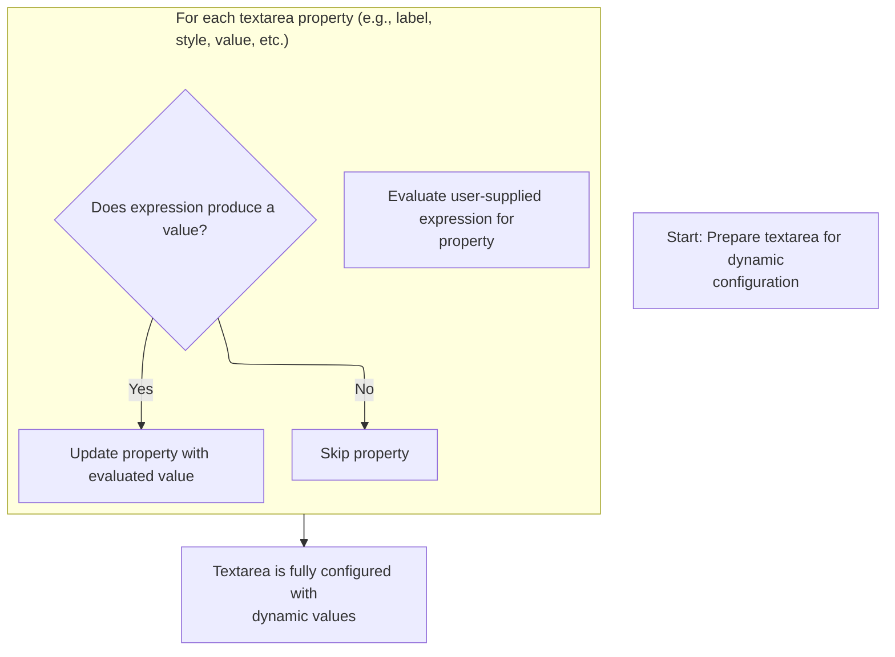

This document describes how dynamic attributes for textarea and resource tags are evaluated and validated before rendering. User-supplied expressions are resolved for each property, and configuration constraints are enforced to ensure only valid changes are applied. The result is a tag that is fully configured and ready for rendering or further processing.

# Starting tag evaluation for textarea

<SwmSnippet path="/el/src/main/java/org/apache/strutsel/taglib/html/ELTextareaTag.java" line="948">

---

In <SwmToken path="el/src/main/java/org/apache/strutsel/taglib/html/ELTextareaTag.java" pos="948:5:5" line-data="    public int doStartTag() throws JspException {">`doStartTag`</SwmToken>, we kick off the tag processing by resolving all dynamic attribute values. Calling <SwmToken path="el/src/main/java/org/apache/strutsel/taglib/html/ELTextareaTag.java" pos="949:1:1" line-data="        evaluateExpressions();">`evaluateExpressions`</SwmToken> here ensures that any expressions for textarea properties are evaluated and set before the tag is rendered.

```java
    public int doStartTag() throws JspException {
        evaluateExpressions();

```

---

</SwmSnippet>

## Resolving textarea attributes and enforcing config constraints



<SwmSnippet path="/el/src/main/java/org/apache/strutsel/taglib/html/ELTextareaTag.java" line="960">

---

In <SwmToken path="el/src/main/java/org/apache/strutsel/taglib/html/ELTextareaTag.java" pos="960:5:5" line-data="    private void evaluateExpressions()">`evaluateExpressions`</SwmToken>, we resolve each attribute expression for the textarea. When we hit the bundle property, we delegate to <SwmToken path="core/src/main/java/org/apache/struts/config/ExceptionConfig.java" pos="34:4:4" line-data="public class ExceptionConfig extends BaseConfig {">`ExceptionConfig`</SwmToken> to set it, but only if the config isn't frozen, so we don't allow late changes.

```java
    private void evaluateExpressions()
        throws JspException {
        String string = null;
        Boolean bool = null;

        if ((string =
                EvalHelper.evalString("accessKey", getAccesskeyExpr(), this,
                    pageContext)) != null) {
            setAccesskey(string);
        }

        if ((string =
                EvalHelper.evalString("alt", getAltExpr(), this, pageContext)) != null) {
            setAlt(string);
        }

        if ((string =
                EvalHelper.evalString("altKey", getAltKeyExpr(), this,
                    pageContext)) != null) {
            setAltKey(string);
        }

        if ((string =
                EvalHelper.evalString("bundle", getBundleExpr(), this,
                    pageContext)) != null) {
            setBundle(string);
        }

```

---

</SwmSnippet>

<SwmSnippet path="/core/src/main/java/org/apache/struts/config/ExceptionConfig.java" line="89">

---

<SwmToken path="core/src/main/java/org/apache/struts/config/ExceptionConfig.java" pos="89:5:5" line-data="    public void setBundle(String bundle) {">`setBundle`</SwmToken> checks if the config is frozen before setting the bundle value. If it's locked, it throws, so you can't change the bundle after setup.

```java
    public void setBundle(String bundle) {
        if (configured) {
            throw new IllegalStateException("Configuration is frozen");
        }

        this.bundle = bundle;
    }
```

---

</SwmSnippet>

<SwmSnippet path="/el/src/main/java/org/apache/strutsel/taglib/html/ELTextareaTag.java" line="988">

---

Back in <SwmToken path="el/src/main/java/org/apache/strutsel/taglib/html/ELTextareaTag.java" pos="949:1:1" line-data="        evaluateExpressions();">`evaluateExpressions`</SwmToken>, after setting bundle, we keep resolving other attributes. When we get to size, we call <SwmToken path="core/src/main/java/org/apache/struts/config/FormPropertyConfig.java" pos="38:4:4" line-data="public class FormPropertyConfig extends BaseConfig {">`FormPropertyConfig`</SwmToken> to validate and set it, making sure it's not negative and config isn't frozen.

```java
        if ((string =
                EvalHelper.evalString("cols", getColsExpr(), this, pageContext)) != null) {
            setCols(string);
        }

        if ((string =
        		EvalHelper.evalString("dir", getDirExpr(), this,
        			pageContext)) != null) {
        	setDir(string);
        }
        
        if ((bool =
                EvalHelper.evalBoolean("disabled", getDisabledExpr(), this,
                    pageContext)) != null) {
            setDisabled(bool.booleanValue());
        }

        if ((string =
                EvalHelper.evalString("errorKey", getErrorKeyExpr(), this,
                    pageContext)) != null) {
            setErrorKey(string);
        }

        if ((string =
                EvalHelper.evalString("errorStyle", getErrorStyleExpr(), this,
                    pageContext)) != null) {
            setErrorStyle(string);
        }

        if ((string =
                EvalHelper.evalString("errorStyleClass",
                    getErrorStyleClassExpr(), this, pageContext)) != null) {
            setErrorStyleClass(string);
        }

        if ((string =
                EvalHelper.evalString("errorStyleId", getErrorStyleIdExpr(),
                    this, pageContext)) != null) {
            setErrorStyleId(string);
        }

        if ((bool =
                EvalHelper.evalBoolean("indexed", getIndexedExpr(), this,
                    pageContext)) != null) {
            setIndexed(bool.booleanValue());
        }

        if ((string =
            	EvalHelper.evalString("lang", getLangExpr(), this,
            		pageContext)) != null) {
        	setLang(string);
        }

        if ((string =
                EvalHelper.evalString("name", getNameExpr(), this, pageContext)) != null) {
            setName(string);
        }

        if ((string =
                EvalHelper.evalString("onblur", getOnblurExpr(), this,
                    pageContext)) != null) {
            setOnblur(string);
        }

        if ((string =
                EvalHelper.evalString("onchange", getOnchangeExpr(), this,
                    pageContext)) != null) {
            setOnchange(string);
        }

        if ((string =
                EvalHelper.evalString("onclick", getOnclickExpr(), this,
                    pageContext)) != null) {
            setOnclick(string);
        }

        if ((string =
                EvalHelper.evalString("ondblclick", getOndblclickExpr(), this,
                    pageContext)) != null) {
            setOndblclick(string);
        }

        if ((string =
                EvalHelper.evalString("onfocus", getOnfocusExpr(), this,
                    pageContext)) != null) {
            setOnfocus(string);
        }

        if ((string =
                EvalHelper.evalString("onkeydown", getOnkeydownExpr(), this,
                    pageContext)) != null) {
            setOnkeydown(string);
        }

        if ((string =
                EvalHelper.evalString("onkeypress", getOnkeypressExpr(), this,
                    pageContext)) != null) {
            setOnkeypress(string);
        }

        if ((string =
                EvalHelper.evalString("onkeyup", getOnkeyupExpr(), this,
                    pageContext)) != null) {
            setOnkeyup(string);
        }

        if ((string =
                EvalHelper.evalString("onmousedown", getOnmousedownExpr(),
                    this, pageContext)) != null) {
            setOnmousedown(string);
        }

        if ((string =
                EvalHelper.evalString("onmousemove", getOnmousemoveExpr(),
                    this, pageContext)) != null) {
            setOnmousemove(string);
        }

        if ((string =
                EvalHelper.evalString("onmouseout", getOnmouseoutExpr(), this,
                    pageContext)) != null) {
            setOnmouseout(string);
        }

        if ((string =
                EvalHelper.evalString("onmouseover", getOnmouseoverExpr(),
                    this, pageContext)) != null) {
            setOnmouseover(string);
        }

        if ((string =
                EvalHelper.evalString("onmouseup", getOnmouseupExpr(), this,
                    pageContext)) != null) {
            setOnmouseup(string);
        }

        if ((string =
                EvalHelper.evalString("onselect", getOnselectExpr(), this,
                    pageContext)) != null) {
            setOnselect(string);
        }

        if ((string =
                EvalHelper.evalString("property", getPropertyExpr(), this,
                    pageContext)) != null) {
            setProperty(string);
        }

        if ((bool =
                EvalHelper.evalBoolean("readonly", getReadonlyExpr(), this,
                    pageContext)) != null) {
            setReadonly(bool.booleanValue());
        }

        if ((string =
                EvalHelper.evalString("rows", getRowsExpr(), this, pageContext)) != null) {
            setRows(string);
        }

        if ((string =
                EvalHelper.evalString("style", getStyleExpr(), this, pageContext)) != null) {
            setStyle(string);
        }

        if ((string =
                EvalHelper.evalString("size", getSizeExpr(), this, pageContext)) != null) {
            setSize(string);
        }

```

---

</SwmSnippet>

<SwmSnippet path="/core/src/main/java/org/apache/struts/config/FormPropertyConfig.java" line="192">

---

<SwmToken path="core/src/main/java/org/apache/struts/config/FormPropertyConfig.java" pos="192:5:5" line-data="    public void setSize(int size) {">`setSize`</SwmToken> enforces that the config isn't frozen and the size is <SwmToken path="core/src/main/java/org/apache/struts/config/FormPropertyConfig.java" pos="71:7:9" line-data="     * must be non-negative.&lt;/p&gt;">`non-negative`</SwmToken> before updating the property. If either check fails, it throws, so only valid, timely changes are allowed.

```java
    public void setSize(int size) {
        if (configured) {
            throw new IllegalStateException("Configuration is frozen");
        }

        if (size < 0) {
            throw new IllegalArgumentException("size < 0");
        }

        this.size = size;
    }
```

---

</SwmSnippet>

<SwmSnippet path="/el/src/main/java/org/apache/strutsel/taglib/html/ELTextareaTag.java" line="1157">

---

After returning from <SwmToken path="core/src/main/java/org/apache/struts/config/FormPropertyConfig.java" pos="38:4:4" line-data="public class FormPropertyConfig extends BaseConfig {">`FormPropertyConfig`</SwmToken>, <SwmToken path="el/src/main/java/org/apache/strutsel/taglib/html/ELTextareaTag.java" pos="949:1:1" line-data="        evaluateExpressions();">`evaluateExpressions`</SwmToken> finishes up by resolving styling and event handler attributes. These are mostly for UI tweaks and interactivity.

```java
        if ((string =
                EvalHelper.evalString("styleClass", getStyleClassExpr(), this,
                    pageContext)) != null) {
            setStyleClass(string);
        }

        if ((string =
                EvalHelper.evalString("styleId", getStyleIdExpr(), this,
                    pageContext)) != null) {
            setStyleId(string);
        }

        if ((string =
                EvalHelper.evalString("tabindex", getTabindexExpr(), this,
                    pageContext)) != null) {
            setTabindex(string);
        }

        if ((string =
                EvalHelper.evalString("title", getTitleExpr(), this, pageContext)) != null) {
            setTitle(string);
        }

        if ((string =
                EvalHelper.evalString("titleKey", getTitleKeyExpr(), this,
                    pageContext)) != null) {
            setTitleKey(string);
        }

        if ((string =
                EvalHelper.evalString("value", getValueExpr(), this, pageContext)) != null) {
            setValue(string);
        }
    }
```

---

</SwmSnippet>

## Delegating to base tag logic for textarea rendering

<SwmSnippet path="/el/src/main/java/org/apache/strutsel/taglib/html/ELTextareaTag.java" line="951">

---

After finishing <SwmToken path="el/src/main/java/org/apache/strutsel/taglib/html/ELTextareaTag.java" pos="949:1:1" line-data="        evaluateExpressions();">`evaluateExpressions`</SwmToken>, <SwmToken path="el/src/main/java/org/apache/strutsel/taglib/html/ELTextareaTag.java" pos="951:6:6" line-data="        return (super.doStartTag());">`doStartTag`</SwmToken> hands off to the base tag logic. This lets the superclass use all the resolved values to render the textarea. Next, we move to resource tag processing for related beans.

```java
        return (super.doStartTag());
    }
```

---

</SwmSnippet>

# Starting resource tag evaluation

<SwmSnippet path="/el/src/main/java/org/apache/strutsel/taglib/bean/ELResourceTag.java" line="120">

---

<SwmToken path="el/src/main/java/org/apache/strutsel/taglib/bean/ELResourceTag.java" pos="120:5:5" line-data="    public int doStartTag() throws JspException {">`doStartTag`</SwmToken> in the resource tag starts by evaluating expressions for resource properties. This sets up the bean with the right values before any further processing.

```java
    public int doStartTag() throws JspException {
        evaluateExpressions();

        return (super.doStartTag());
    }
```

---

</SwmSnippet>

# Resolving resource attributes and enforcing action config constraints

```mermaid
%%{init: {"flowchart": {"defaultRenderer": "elk"}} }%%
flowchart TD
    node2{"Is 'id' expression non-null?"}
    click node2 openCode "el/src/main/java/org/apache/strutsel/taglib/bean/ELResourceTag.java:136:139"
    node2 -->|"Yes"| node3["Update resource 'id'"]
    click node3 openCode "el/src/main/java/org/apache/strutsel/taglib/bean/ELResourceTag.java:138:139"
    node2 -->|"No"| node4
    node3 --> node4
    node4{"Is 'input' expression non-null?"}
    click node4 openCode "el/src/main/java/org/apache/strutsel/taglib/bean/ELResourceTag.java:141:144"
    node4 -->|"Yes"| node5["Update resource 'input'"]
    click node5 openCode "el/src/main/java/org/apache/strutsel/taglib/bean/ELResourceTag.java:143:144"
    node4 -->|"No"| node6
    node5 --> node6
    node6{"Is 'name' expression non-null?"}
    click node6 openCode "el/src/main/java/org/apache/strutsel/taglib/bean/ELResourceTag.java:146:149"
    node6 -->|"Yes"| node7["Update resource 'name'"]
    click node7 openCode "el/src/main/java/org/apache/strutsel/taglib/bean/ELResourceTag.java:148:149"
    node6 -->|"No"| node8["Done"]
    click node8 openCode "el/src/main/java/org/apache/strutsel/taglib/bean/ELResourceTag.java:150:150"

classDef HeadingStyle fill:#777777,stroke:#333,stroke-width:2px;

%% Swimm:
%% %%{init: {"flowchart": {"defaultRenderer": "elk"}} }%%
%% flowchart TD
%%     node2{"Is 'id' expression non-null?"}
%%     click node2 openCode "<SwmPath>[el/…/bean/ELResourceTag.java](el/src/main/java/org/apache/strutsel/taglib/bean/ELResourceTag.java)</SwmPath>:136:139"
%%     node2 -->|"Yes"| node3["Update resource 'id'"]
%%     click node3 openCode "<SwmPath>[el/…/bean/ELResourceTag.java](el/src/main/java/org/apache/strutsel/taglib/bean/ELResourceTag.java)</SwmPath>:138:139"
%%     node2 -->|"No"| node4
%%     node3 --> node4
%%     node4{"Is 'input' expression non-null?"}
%%     click node4 openCode "<SwmPath>[el/…/bean/ELResourceTag.java](el/src/main/java/org/apache/strutsel/taglib/bean/ELResourceTag.java)</SwmPath>:141:144"
%%     node4 -->|"Yes"| node5["Update resource 'input'"]
%%     click node5 openCode "<SwmPath>[el/…/bean/ELResourceTag.java](el/src/main/java/org/apache/strutsel/taglib/bean/ELResourceTag.java)</SwmPath>:143:144"
%%     node4 -->|"No"| node6
%%     node5 --> node6
%%     node6{"Is 'name' expression non-null?"}
%%     click node6 openCode "<SwmPath>[el/…/bean/ELResourceTag.java](el/src/main/java/org/apache/strutsel/taglib/bean/ELResourceTag.java)</SwmPath>:146:149"
%%     node6 -->|"Yes"| node7["Update resource 'name'"]
%%     click node7 openCode "<SwmPath>[el/…/bean/ELResourceTag.java](el/src/main/java/org/apache/strutsel/taglib/bean/ELResourceTag.java)</SwmPath>:148:149"
%%     node6 -->|"No"| node8["Done"]
%%     click node8 openCode "<SwmPath>[el/…/bean/ELResourceTag.java](el/src/main/java/org/apache/strutsel/taglib/bean/ELResourceTag.java)</SwmPath>:150:150"
%% 
%% classDef HeadingStyle fill:#777777,stroke:#333,stroke-width:2px;
```



<SwmSnippet path="/el/src/main/java/org/apache/strutsel/taglib/bean/ELResourceTag.java" line="132">

---

In <SwmToken path="el/src/main/java/org/apache/strutsel/taglib/bean/ELResourceTag.java" pos="132:5:5" line-data="    private void evaluateExpressions()">`evaluateExpressions`</SwmToken>, we resolve resource tag attributes. When we hit input, we call <SwmToken path="core/src/main/java/org/apache/struts/config/ExceptionConfig.java" pos="180:14:14" line-data="     * @param actionConfig The {@link ActionConfig} that this config is from,">`ActionConfig`</SwmToken> to set it, but only if the config isn't frozen, so late changes are blocked.

```java
    private void evaluateExpressions()
        throws JspException {
        String string = null;

        if ((string =
                EvalHelper.evalString("id", getIdExpr(), this, pageContext)) != null) {
            setId(string);
        }

        if ((string =
                EvalHelper.evalString("input", getInputExpr(), this, pageContext)) != null) {
            setInput(string);
        }

```

---

</SwmSnippet>

<SwmSnippet path="/core/src/main/java/org/apache/struts/config/ActionConfig.java" line="473">

---

<SwmToken path="core/src/main/java/org/apache/struts/config/ActionConfig.java" pos="473:5:5" line-data="    public void setInput(String input) {">`setInput`</SwmToken> checks if the config is frozen before updating the input property. If it's locked, it throws, so you can't change input after setup.

```java
    public void setInput(String input) {
        if (configured) {
            throw new IllegalStateException("Configuration is frozen");
        }

        this.input = input;
    }
```

---

</SwmSnippet>

<SwmSnippet path="/el/src/main/java/org/apache/strutsel/taglib/bean/ELResourceTag.java" line="146">

---

After returning from <SwmToken path="core/src/main/java/org/apache/struts/config/ExceptionConfig.java" pos="180:14:14" line-data="     * @param actionConfig The {@link ActionConfig} that this config is from,">`ActionConfig`</SwmToken>, <SwmToken path="el/src/main/java/org/apache/strutsel/taglib/html/ELTextareaTag.java" pos="949:1:1" line-data="        evaluateExpressions();">`evaluateExpressions`</SwmToken> wraps up by resolving name and id for the resource bean. These are used for bean identification in the page.

```java
        if ((string =
                EvalHelper.evalString("name", getNameExpr(), this, pageContext)) != null) {
            setName(string);
        }
    }
```

---

</SwmSnippet>

&nbsp;

*This is an auto-generated document by Swimm 🌊 and has not yet been verified by a human*

<SwmMeta version="3.0.0" repo-id="Z2l0aHViJTNBJTNBc3RydXRzMSUzQSUzQVN3aW1tLURlbW8=" repo-name="struts1"><sup>Powered by [Swimm](https://app.swimm.io/)</sup></SwmMeta>
