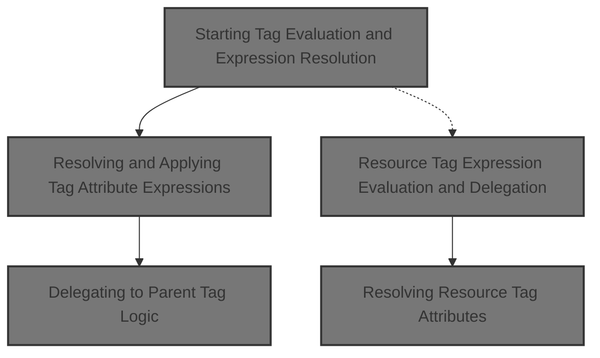
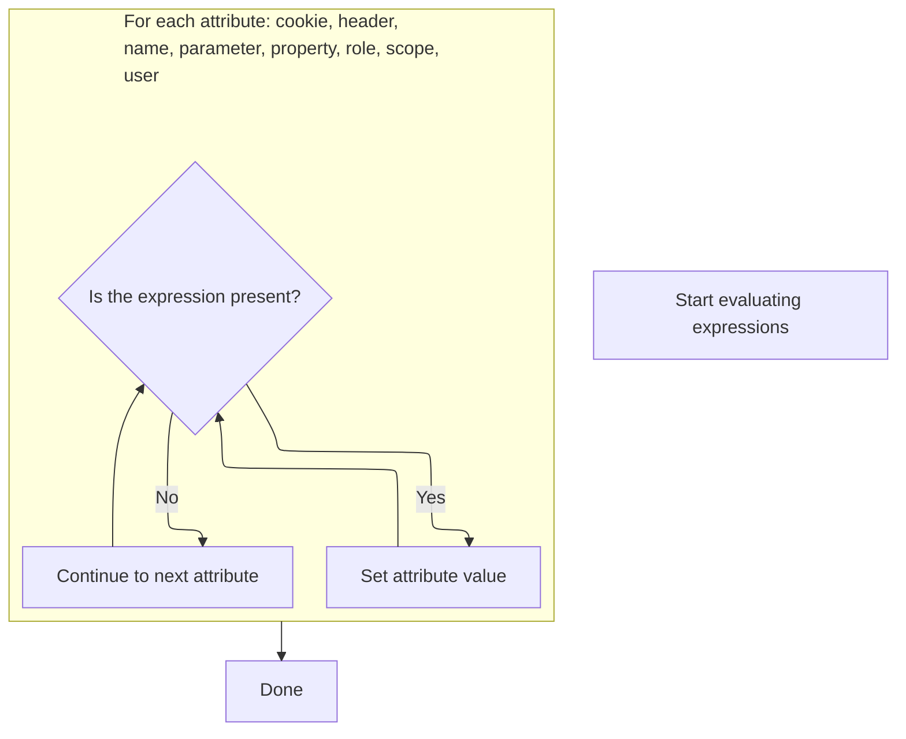
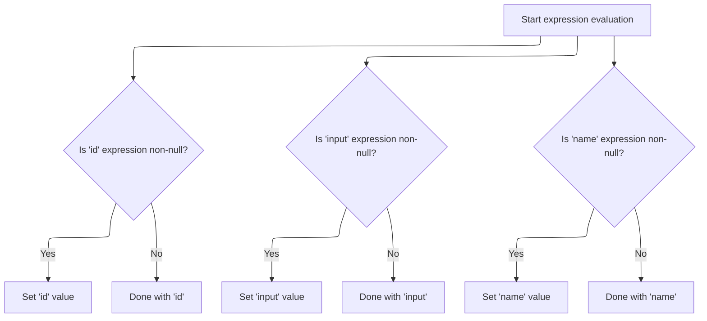

This document explains how tag attributes with dynamic expressions are evaluated and applied before further tag processing. This enables flexible and dynamic configuration of tags in JSP pages, supporting adaptable web applications.



# Starting Tag Evaluation and Expression Resolution

<SwmSnippet path="/el/src/main/java/org/apache/strutsel/taglib/logic/ELNotPresentTag.java" line="235">

---

In <SwmToken path="el/src/main/java/org/apache/strutsel/taglib/logic/ELNotPresentTag.java" pos="235:5:5" line-data="    public int doStartTag() throws JspException {">`doStartTag`</SwmToken>, we kick off the tag processing by evaluating all EL expressions tied to the tag's attributes. This ensures that any dynamic values are resolved before the tag logic continues. We call <SwmToken path="el/src/main/java/org/apache/strutsel/taglib/logic/ELNotPresentTag.java" pos="236:1:1" line-data="        evaluateExpressions();">`evaluateExpressions`</SwmToken> next to make sure all attribute values are up-to-date and ready for the tag's main logic.

```java
    public int doStartTag() throws JspException {
        evaluateExpressions();

```

---

</SwmSnippet>

## Resolving and Applying Tag Attribute Expressions



<SwmSnippet path="/el/src/main/java/org/apache/strutsel/taglib/logic/ELNotPresentTag.java" line="247">

---

In <SwmToken path="el/src/main/java/org/apache/strutsel/taglib/logic/ELNotPresentTag.java" pos="247:5:5" line-data="    private void evaluateExpressions()">`evaluateExpressions`</SwmToken>, we resolve each EL expression for the tag's attributes and update the tag state if a value is present. When we get to the 'parameter' attribute, we call MessageResourcesConfig.setParameter to push the evaluated value into the configuration, but only if the config isn't locked.

```java
    private void evaluateExpressions()
        throws JspException {
        String string = null;

        if ((string =
                EvalHelper.evalString("cookie", getCookieExpr(), this,
                    pageContext)) != null) {
            setCookie(string);
        }

        if ((string =
                EvalHelper.evalString("header", getHeaderExpr(), this,
                    pageContext)) != null) {
            setHeader(string);
        }

        if ((string =
                EvalHelper.evalString("name", getNameExpr(), this, pageContext)) != null) {
            setName(string);
        }

        if ((string =
                EvalHelper.evalString("parameter", getParameterExpr(), this,
                    pageContext)) != null) {
            setParameter(string);
        }

```

---

</SwmSnippet>

<SwmSnippet path="/core/src/main/java/org/apache/struts/config/MessageResourcesConfig.java" line="127">

---

SetParameter checks if the configuration is already frozen using the 'configured' flag. If so, it blocks any changes by throwing an exception. This keeps the configuration immutable after it's locked, which is a pattern used throughout the repo.

```java
    public void setParameter(String parameter) {
        if (configured) {
            throw new IllegalStateException("Configuration is frozen");
        }

        this.parameter = parameter;
    }
```

---

</SwmSnippet>

<SwmSnippet path="/el/src/main/java/org/apache/strutsel/taglib/logic/ELNotPresentTag.java" line="274">

---

Back in ELNotPresentTag.evaluateExpressions, after updating the parameter, we keep resolving and applying other attributes. When we hit 'scope', we call ActionConfig.setScope to update where the tag's data should live, but only if the config isn't frozen.

```java
        if ((string =
                EvalHelper.evalString("property", getPropertyExpr(), this,
                    pageContext)) != null) {
            setProperty(string);
        }

        if ((string =
                EvalHelper.evalString("role", getRoleExpr(), this, pageContext)) != null) {
            setRole(string);
        }

        if ((string =
                EvalHelper.evalString("scope", getScopeExpr(), this, pageContext)) != null) {
            setScope(string);
        }

```

---

</SwmSnippet>

<SwmSnippet path="/core/src/main/java/org/apache/struts/config/ActionConfig.java" line="652">

---

SetScope blocks any changes to the scope if the configuration is already frozen, using the 'configured' flag. This keeps the tag's context stable after setup, matching how other config setters work in the repo.

```java
    public void setScope(String scope) {
        if (configured) {
            throw new IllegalStateException("Configuration is frozen");
        }

        this.scope = scope;
    }
```

---

</SwmSnippet>

<SwmSnippet path="/el/src/main/java/org/apache/strutsel/taglib/logic/ELNotPresentTag.java" line="290">

---

Back in ELNotPresentTag.evaluateExpressions, after updating the scope, we finish by resolving and setting the 'user' attribute if present. This wraps up all dynamic attribute handling before returning control to the tag logic.

```java
        if ((string =
                EvalHelper.evalString("user", getUserExpr(), this, pageContext)) != null) {
            setUser(string);
        }
    }
```

---

</SwmSnippet>

## Delegating to Parent Tag Logic

<SwmSnippet path="/el/src/main/java/org/apache/strutsel/taglib/logic/ELNotPresentTag.java" line="238">

---

Back in ELNotPresentTag.doStartTag, after resolving all expressions, we hand off to the parent tag's logic by calling <SwmToken path="el/src/main/java/org/apache/strutsel/taglib/logic/ELNotPresentTag.java" pos="238:4:8" line-data="        return (super.doStartTag());">`super.doStartTag()`</SwmToken>. This lets the base implementation decide what happens next, using the values we just set up. The next tag in the flow (like <SwmToken path="el/src/main/java/org/apache/strutsel/taglib/bean/ELResourceTag.java" pos="38:4:4" line-data="public class ELResourceTag extends ResourceTag {">`ELResourceTag`</SwmToken>) can now pick up with the correct state.

```java
        return (super.doStartTag());
    }
```

---

</SwmSnippet>

# Resource Tag Expression Evaluation and Delegation

<SwmSnippet path="/el/src/main/java/org/apache/strutsel/taglib/bean/ELResourceTag.java" line="120">

---

DoStartTag in <SwmToken path="el/src/main/java/org/apache/strutsel/taglib/bean/ELResourceTag.java" pos="38:4:4" line-data="public class ELResourceTag extends ResourceTag {">`ELResourceTag`</SwmToken> resolves all EL expressions for its attributes, then passes control to the parent implementation. This ensures the tag is using the latest values before any resource logic runs.

```java
    public int doStartTag() throws JspException {
        evaluateExpressions();

        return (super.doStartTag());
    }
```

---

</SwmSnippet>

# Resolving Resource Tag Attributes



<SwmSnippet path="/el/src/main/java/org/apache/strutsel/taglib/bean/ELResourceTag.java" line="132">

---

In <SwmToken path="el/src/main/java/org/apache/strutsel/taglib/bean/ELResourceTag.java" pos="132:5:5" line-data="    private void evaluateExpressions()">`evaluateExpressions`</SwmToken> for <SwmToken path="el/src/main/java/org/apache/strutsel/taglib/bean/ELResourceTag.java" pos="38:4:4" line-data="public class ELResourceTag extends ResourceTag {">`ELResourceTag`</SwmToken>, we resolve the 'input' attribute and call ActionConfig.setInput to update the config, but only if it's not frozen. This makes sure the tag references the right resource input.

```java
    private void evaluateExpressions()
        throws JspException {
        String string = null;

        if ((string =
                EvalHelper.evalString("id", getIdExpr(), this, pageContext)) != null) {
            setId(string);
        }

        if ((string =
                EvalHelper.evalString("input", getInputExpr(), this, pageContext)) != null) {
            setInput(string);
        }

```

---

</SwmSnippet>

<SwmSnippet path="/core/src/main/java/org/apache/struts/config/ActionConfig.java" line="473">

---

SetInput blocks any changes to the input value if the configuration is frozen, using the 'configured' flag. This keeps the resource tag's config stable after setup, just like other setters in the repo.

```java
    public void setInput(String input) {
        if (configured) {
            throw new IllegalStateException("Configuration is frozen");
        }

        this.input = input;
    }
```

---

</SwmSnippet>

<SwmSnippet path="/el/src/main/java/org/apache/strutsel/taglib/bean/ELResourceTag.java" line="146">

---

Back in ELResourceTag.evaluateExpressions, after updating the input, we finish by resolving and setting the 'name' attribute if present. This wraps up all dynamic attribute handling for the resource tag before returning control to the main tag logic.

```java
        if ((string =
                EvalHelper.evalString("name", getNameExpr(), this, pageContext)) != null) {
            setName(string);
        }
    }
```

---

</SwmSnippet>

&nbsp;

*This is an auto-generated document by Swimm 🌊 and has not yet been verified by a human*

<SwmMeta version="3.0.0" repo-id="Z2l0aHViJTNBJTNBc3RydXRzMSUzQSUzQVN3aW1tLURlbW8=" repo-name="struts1"><sup>Powered by [Swimm](https://app.swimm.io/)</sup></SwmMeta>
