This document describes how URLs are dynamically generated and written to JSP pages using tag attributes and parameters. The flow enables dynamic link creation by collecting parameters, building the URL based on tag configuration, attaching anchors and parameters, and encoding the URL for session or redirect needs. The final URL is output to the page context for use in the rendered page.

# Building and Preparing the URL

<SwmSnippet path="/taglib/src/main/java/org/apache/struts/taglib/html/RewriteTag.java" line="46">

---

In <SwmToken path="taglib/src/main/java/org/apache/struts/taglib/html/RewriteTag.java" pos="46:5:5" line-data="    public int doEndTag() throws JspException {">`doEndTag`</SwmToken>, we start by collecting parameters from tag attributes and merge any extra ones from the tag's inner body. Then, we call TagUtils.computeURLWithCharEncoding to build the URL, using the XHTML mode flag to decide how to encode '&'. This sets up the URL for output, and if anything fails, we handle the exception before moving on.

```java
    public int doEndTag() throws JspException {
        // Generate the hyperlink URL
        Map params =
            TagUtils.getInstance().computeParameters(pageContext, paramId,
                paramName, paramProperty, paramScope, name, property, scope,
                transaction);

        // Add parameters collected from the tag's inner body
        if (!this.parameters.isEmpty()) {
            if (params == null) {
                params = new HashMap();
            }
            params.putAll(this.parameters);
        }

        String url = null;

        try {
            // Note that we're encoding the & character to &amp; in XHTML mode only,
            // otherwise the & is written as is to work in javascripts.
            url = TagUtils.getInstance().computeURLWithCharEncoding(pageContext,
                    forward, href, page, action, module, params, anchor, false,
                    this.isXhtml(), useLocalEncoding);
        } catch (MalformedURLException e) {
            TagUtils.getInstance().saveException(pageContext, e);
            throw new JspException(messages.getMessage("rewrite.url",
                    e.toString()), e);
        }

```

---

</SwmSnippet>

## Deciding the URL Path and Format

```mermaid
%%{init: {"flowchart": {"defaultRenderer": "elk"}} }%%
flowchart TD
    node1["Start: Build URL with correct encoding"]
    click node1 openCode "taglib/src/main/java/org/apache/struts/taglib/TagUtils.java:366:371"
    node1 --> node2{"Use local character encoding?"}
    click node2 openCode "taglib/src/main/java/org/apache/struts/taglib/TagUtils.java:373:375"
    node2 -->|"Yes"| node3["Set encoding from response"]
    click node3 openCode "taglib/src/main/java/org/apache/struts/taglib/TagUtils.java:374:375"
    node2 -->|"No"| node4["Use UTF-8 encoding"]
    click node4 openCode "taglib/src/main/java/org/apache/struts/taglib/TagUtils.java:371:372"
    node3 --> node5{"Exactly one URL specifier provided?"}
    node4 --> node5
    click node5 openCode "taglib/src/main/java/org/apache/struts/taglib/TagUtils.java:381:400"
    node5 -->|"Yes"| node6{"Which specifier?"}
    node5 -->|"No"| node7["Exit: Invalid specifier"]
    click node7 openCode "taglib/src/main/java/org/apache/struts/taglib/TagUtils.java:398:400"
    click node6 openCode "taglib/src/main/java/org/apache/struts/taglib/TagUtils.java:410:448"
    node6 -->|"Forward"| node8["Build URL from forward"]
    click node8 openCode "taglib/src/main/java/org/apache/struts/taglib/TagUtils.java:410:431"
    node6 -->|"Href"| node9["Build URL from href"]
    click node9 openCode "taglib/src/main/java/org/apache/struts/taglib/TagUtils.java:432:433"
    node6 -->|"Action"| node10["Build URL from action"]
    click node10 openCode "taglib/src/main/java/org/apache/struts/taglib/TagUtils.java:434:443"
    node6 -->|"Page"| node11["Build URL from page"]
    click node11 openCode "taglib/src/main/java/org/apache/struts/taglib/TagUtils.java:446:448"
    node8 --> node12{"Anchor provided?"}
    node9 --> node12
    node10 --> node12
    node11 --> node12
    click node12 openCode "taglib/src/main/java/org/apache/struts/taglib/TagUtils.java:451:461"
    node12 -->|"Yes"| node13["Append anchor to URL"]
    click node13 openCode "taglib/src/main/java/org/apache/struts/taglib/TagUtils.java:451:461"
    node12 -->|"No"| node14["Continue"]
    node13 --> node15{"Parameters provided?"}
    node14 --> node15
    click node15 openCode "taglib/src/main/java/org/apache/struts/taglib/TagUtils.java:464:545"
    node15 -->|"Yes"| loop1
    node15 -->|"No"| node20["Continue"]
    subgraph loop1["For each parameter"]
        node16["Append parameter to URL with correct encoding and separator"]
        click node16 openCode "taglib/src/main/java/org/apache/struts/taglib/TagUtils.java:492:545"
    end
    loop1 --> node17{"Anchor was present?"}
    click node17 openCode "taglib/src/main/java/org/apache/struts/taglib/TagUtils.java:548:551"
    node17 -->|"Yes"| node18["Re-append anchor"]
    click node18 openCode "taglib/src/main/java/org/apache/struts/taglib/TagUtils.java:548:551"
    node17 -->|"No"| node20
    node18 --> node20
    node20 --> node21{"Is href provided?"}
    click node21 openCode "taglib/src/main/java/org/apache/struts/taglib/TagUtils.java:556:565"
    node21 -->|"No and session exists"| node22{"Redirect?"}
    click node22 openCode "taglib/src/main/java/org/apache/struts/taglib/TagUtils.java:560:564"
    node22 -->|"Yes"| node23["Encode URL for redirect"]
    click node23 openCode "taglib/src/main/java/org/apache/struts/taglib/TagUtils.java:561:562"
    node22 -->|"No"| node24["Encode URL for session"]
    click node24 openCode "taglib/src/main/java/org/apache/struts/taglib/TagUtils.java:564:565"
    node23 --> node25["Return final URL"]
    node24 --> node25
    node21 -->|"Yes or no session"| node25["Return final URL"]
    click node25 openCode "taglib/src/main/java/org/apache/struts/taglib/TagUtils.java:567:568"

classDef HeadingStyle fill:#777777,stroke:#333,stroke-width:2px;

%% Swimm:
%% %%{init: {"flowchart": {"defaultRenderer": "elk"}} }%%
%% flowchart TD
%%     node1["Start: Build URL with correct encoding"]
%%     click node1 openCode "<SwmPath>[taglib/…/taglib/TagUtils.java](taglib/src/main/java/org/apache/struts/taglib/TagUtils.java)</SwmPath>:366:371"
%%     node1 --> node2{"Use local character encoding?"}
%%     click node2 openCode "<SwmPath>[taglib/…/taglib/TagUtils.java](taglib/src/main/java/org/apache/struts/taglib/TagUtils.java)</SwmPath>:373:375"
%%     node2 -->|"Yes"| node3["Set encoding from response"]
%%     click node3 openCode "<SwmPath>[taglib/…/taglib/TagUtils.java](taglib/src/main/java/org/apache/struts/taglib/TagUtils.java)</SwmPath>:374:375"
%%     node2 -->|"No"| node4["Use <SwmToken path="taglib/src/main/java/org/apache/struts/taglib/TagUtils.java" pos="371:8:10" line-data="        String charEncoding = &quot;UTF-8&quot;;">`UTF-8`</SwmToken> encoding"]
%%     click node4 openCode "<SwmPath>[taglib/…/taglib/TagUtils.java](taglib/src/main/java/org/apache/struts/taglib/TagUtils.java)</SwmPath>:371:372"
%%     node3 --> node5{"Exactly one URL specifier provided?"}
%%     node4 --> node5
%%     click node5 openCode "<SwmPath>[taglib/…/taglib/TagUtils.java](taglib/src/main/java/org/apache/struts/taglib/TagUtils.java)</SwmPath>:381:400"
%%     node5 -->|"Yes"| node6{"Which specifier?"}
%%     node5 -->|"No"| node7["Exit: Invalid specifier"]
%%     click node7 openCode "<SwmPath>[taglib/…/taglib/TagUtils.java](taglib/src/main/java/org/apache/struts/taglib/TagUtils.java)</SwmPath>:398:400"
%%     click node6 openCode "<SwmPath>[taglib/…/taglib/TagUtils.java](taglib/src/main/java/org/apache/struts/taglib/TagUtils.java)</SwmPath>:410:448"
%%     node6 -->|"Forward"| node8["Build URL from forward"]
%%     click node8 openCode "<SwmPath>[taglib/…/taglib/TagUtils.java](taglib/src/main/java/org/apache/struts/taglib/TagUtils.java)</SwmPath>:410:431"
%%     node6 -->|"Href"| node9["Build URL from href"]
%%     click node9 openCode "<SwmPath>[taglib/…/taglib/TagUtils.java](taglib/src/main/java/org/apache/struts/taglib/TagUtils.java)</SwmPath>:432:433"
%%     node6 -->|"Action"| node10["Build URL from action"]
%%     click node10 openCode "<SwmPath>[taglib/…/taglib/TagUtils.java](taglib/src/main/java/org/apache/struts/taglib/TagUtils.java)</SwmPath>:434:443"
%%     node6 -->|"Page"| node11["Build URL from page"]
%%     click node11 openCode "<SwmPath>[taglib/…/taglib/TagUtils.java](taglib/src/main/java/org/apache/struts/taglib/TagUtils.java)</SwmPath>:446:448"
%%     node8 --> node12{"Anchor provided?"}
%%     node9 --> node12
%%     node10 --> node12
%%     node11 --> node12
%%     click node12 openCode "<SwmPath>[taglib/…/taglib/TagUtils.java](taglib/src/main/java/org/apache/struts/taglib/TagUtils.java)</SwmPath>:451:461"
%%     node12 -->|"Yes"| node13["Append anchor to URL"]
%%     click node13 openCode "<SwmPath>[taglib/…/taglib/TagUtils.java](taglib/src/main/java/org/apache/struts/taglib/TagUtils.java)</SwmPath>:451:461"
%%     node12 -->|"No"| node14["Continue"]
%%     node13 --> node15{"Parameters provided?"}
%%     node14 --> node15
%%     click node15 openCode "<SwmPath>[taglib/…/taglib/TagUtils.java](taglib/src/main/java/org/apache/struts/taglib/TagUtils.java)</SwmPath>:464:545"
%%     node15 -->|"Yes"| loop1
%%     node15 -->|"No"| node20["Continue"]
%%     subgraph loop1["For each parameter"]
%%         node16["Append parameter to URL with correct encoding and separator"]
%%         click node16 openCode "<SwmPath>[taglib/…/taglib/TagUtils.java](taglib/src/main/java/org/apache/struts/taglib/TagUtils.java)</SwmPath>:492:545"
%%     end
%%     loop1 --> node17{"Anchor was present?"}
%%     click node17 openCode "<SwmPath>[taglib/…/taglib/TagUtils.java](taglib/src/main/java/org/apache/struts/taglib/TagUtils.java)</SwmPath>:548:551"
%%     node17 -->|"Yes"| node18["Re-append anchor"]
%%     click node18 openCode "<SwmPath>[taglib/…/taglib/TagUtils.java](taglib/src/main/java/org/apache/struts/taglib/TagUtils.java)</SwmPath>:548:551"
%%     node17 -->|"No"| node20
%%     node18 --> node20
%%     node20 --> node21{"Is href provided?"}
%%     click node21 openCode "<SwmPath>[taglib/…/taglib/TagUtils.java](taglib/src/main/java/org/apache/struts/taglib/TagUtils.java)</SwmPath>:556:565"
%%     node21 -->|"No and session exists"| node22{"Redirect?"}
%%     click node22 openCode "<SwmPath>[taglib/…/taglib/TagUtils.java](taglib/src/main/java/org/apache/struts/taglib/TagUtils.java)</SwmPath>:560:564"
%%     node22 -->|"Yes"| node23["Encode URL for redirect"]
%%     click node23 openCode "<SwmPath>[taglib/…/taglib/TagUtils.java](taglib/src/main/java/org/apache/struts/taglib/TagUtils.java)</SwmPath>:561:562"
%%     node22 -->|"No"| node24["Encode URL for session"]
%%     click node24 openCode "<SwmPath>[taglib/…/taglib/TagUtils.java](taglib/src/main/java/org/apache/struts/taglib/TagUtils.java)</SwmPath>:564:565"
%%     node23 --> node25["Return final URL"]
%%     node24 --> node25
%%     node21 -->|"Yes or no session"| node25["Return final URL"]
%%     click node25 openCode "<SwmPath>[taglib/…/taglib/TagUtils.java](taglib/src/main/java/org/apache/struts/taglib/TagUtils.java)</SwmPath>:567:568"
%% 
%% classDef HeadingStyle fill:#777777,stroke:#333,stroke-width:2px;
```



<SwmSnippet path="/taglib/src/main/java/org/apache/struts/taglib/TagUtils.java" line="366">

---

In <SwmToken path="taglib/src/main/java/org/apache/struts/taglib/TagUtils.java" pos="366:5:5" line-data="    public String computeURLWithCharEncoding(PageContext pageContext,">`computeURLWithCharEncoding`</SwmToken>, we check that only one of forward, href, page, or action is set, since the URL logic depends on this. Based on which one is present, we branch to build the URL differently—using <SwmToken path="taglib/src/main/java/org/apache/struts/taglib/TagUtils.java" pos="411:1:1" line-data="            ForwardConfig forwardConfig =">`ForwardConfig`</SwmToken>, direct href, action mapping, or page path. This step sets up the base URL before adding parameters or anchors.

```java
    public String computeURLWithCharEncoding(PageContext pageContext,
        String forward, String href, String page, String action, String module,
        Map params, String anchor, boolean redirect, boolean encodeSeparator,
        boolean useLocalEncoding)
        throws MalformedURLException {
        String charEncoding = "UTF-8";

        if (useLocalEncoding) {
            charEncoding = pageContext.getResponse().getCharacterEncoding();
        }

        // TODO All the computeURL() methods need refactoring!
        // Validate that exactly one specifier was included
        int n = 0;

        if (forward != null) {
            n++;
        }

        if (href != null) {
            n++;
        }

        if (page != null) {
            n++;
        }

        if (action != null) {
            n++;
        }

        if (n != 1) {
            throw new MalformedURLException(messages.getMessage(
                    "computeURL.specifier"));
        }

        // Look up the module configuration for this request
        ModuleConfig moduleConfig = getModuleConfig(module, pageContext);

        // Calculate the appropriate URL
        StringBuffer url = new StringBuffer();
        HttpServletRequest request =
            (HttpServletRequest) pageContext.getRequest();

        if (forward != null) {
            ForwardConfig forwardConfig =
                moduleConfig.findForwardConfig(forward);

            if (forwardConfig == null) {
                throw new MalformedURLException(messages.getMessage(
                        "computeURL.forward", forward));
            }

            // **** removed - see bug 37817 ****
            //  if (forwardConfig.getRedirect()) {
            //      redirect = true;
            //  }

            if (forwardConfig.getPath().startsWith("/")) {
                url.append(request.getContextPath());
                url.append(RequestUtils.forwardURL(request, forwardConfig,
                        moduleConfig));
            } else {
                url.append(forwardConfig.getPath());
            }
        } else if (href != null) {
            url.append(href);
        } else if (action != null) {
            ActionServlet servlet = (ActionServlet) pageContext.getServletContext().getAttribute(Globals.ACTION_SERVLET_KEY);
            String actionIdPath = RequestUtils.actionIdURL(action, moduleConfig, servlet);
            if (actionIdPath != null) {
                action = actionIdPath;
                url.append(request.getContextPath());
                url.append(actionIdPath);
            } else {
                url.append(instance.getActionMappingURL(action, module,
                        pageContext, false));
            }
        } else /* if (page != null) */
         {
            url.append(request.getContextPath());
            url.append(this.pageURL(request, page, moduleConfig));
        }

```

---

</SwmSnippet>

<SwmSnippet path="/taglib/src/main/java/org/apache/struts/taglib/TagUtils.java" line="654">

---

<SwmToken path="taglib/src/main/java/org/apache/struts/taglib/TagUtils.java" pos="654:5:5" line-data="    public String getActionMappingURL(String action, String module,">`getActionMappingURL`</SwmToken> builds the action URL by checking servlet mapping patterns—extension, prefix, or root—and appends the action mapping name and any query string accordingly. If a module config exists and <SwmToken path="taglib/src/main/java/org/apache/struts/taglib/TagUtils.java" pos="655:8:8" line-data="        PageContext pageContext, boolean contextRelative) {">`contextRelative`</SwmToken> is false, it adds the module prefix. If there's no servlet mapping, it just ensures the action starts with '/'. This keeps URLs consistent with the app's routing.

```java
    public String getActionMappingURL(String action, String module,
        PageContext pageContext, boolean contextRelative) {
        HttpServletRequest request =
            (HttpServletRequest) pageContext.getRequest();

        String contextPath = request.getContextPath();
        StringBuffer value = new StringBuffer();

        // Avoid setting two slashes at the beginning of an action:
        //  the length of contextPath should be more than 1
        //  in case of non-root context, otherwise length==1 (the slash)
        if (contextPath.length() > 1) {
            value.append(contextPath);
        }

        ModuleConfig moduleConfig = getModuleConfig(module, pageContext);

        if ((moduleConfig != null) && (!contextRelative)) {
            value.append(moduleConfig.getPrefix());
        }

        // Use our servlet mapping, if one is specified
        String servletMapping =
            (String) pageContext.getAttribute(Globals.SERVLET_KEY,
                PageContext.APPLICATION_SCOPE);

        if (servletMapping != null) {
            String queryString = null;
            int question = action.indexOf("?");

            if (question >= 0) {
                queryString = action.substring(question);
            }

            String actionMapping = getActionMappingName(action);

            if (servletMapping.startsWith("*.")) {
                value.append(actionMapping);
                value.append(servletMapping.substring(1));
            } else if (servletMapping.endsWith("/*")) {
                value.append(servletMapping.substring(0,
                        servletMapping.length() - 2));
                value.append(actionMapping);
            } else if (servletMapping.equals("/")) {
                value.append(actionMapping);
            }

            if (queryString != null) {
                value.append(queryString);
            }
        }
        // Otherwise, assume extension mapping is in use and extension is
        // already included in the action property
        else {
            if (!action.startsWith("/")) {
                value.append("/");
            }

            value.append(action);
        }

        return value.toString();
    }
```

---

</SwmSnippet>

<SwmSnippet path="/taglib/src/main/java/org/apache/struts/taglib/TagUtils.java" line="450">

---

After returning from <SwmToken path="taglib/src/main/java/org/apache/struts/taglib/TagUtils.java" pos="441:7:7" line-data="                url.append(instance.getActionMappingURL(action, module,">`getActionMappingURL`</SwmToken>, we handle anchors and parameters. If an anchor is present, we strip any existing one and encode the new anchor. For parameters, we build the query string with the right separator, handle nulls, strings, arrays, and objects, then re-attach the anchor if needed. This keeps the URL structure correct.

```java
        // Add anchor if requested (replacing any existing anchor)
        if (anchor != null) {
            String temp = url.toString();
            int hash = temp.indexOf('#');

            if (hash >= 0) {
                url.setLength(hash);
            }

            url.append('#');
            url.append(this.encodeURL(anchor, charEncoding));
        }

        // Add dynamic parameters if requested
        if ((params != null) && (params.size() > 0)) {
            // Save any existing anchor
            String temp = url.toString();
            int hash = temp.indexOf('#');

            if (hash >= 0) {
                anchor = temp.substring(hash + 1);
                url.setLength(hash);
                temp = url.toString();
            } else {
                anchor = null;
            }

            // Define the parameter separator
            String separator = null;

            if (redirect) {
                separator = "&";
            } else if (encodeSeparator) {
                separator = "&amp;";
            } else {
                separator = "&";
            }

            // Add the required request parameters
            boolean question = temp.indexOf('?') >= 0;
            Iterator keys = params.keySet().iterator();

            while (keys.hasNext()) {
                String key = (String) keys.next();
                Object value = params.get(key);

                if (value == null) {
                    if (!question) {
                        url.append('?');
                        question = true;
                    } else {
                        url.append(separator);
                    }

                    url.append(this.encodeURL(key, charEncoding));
                    url.append('='); // Interpret null as "no value"
                } else if (value instanceof String) {
                    if (!question) {
                        url.append('?');
                        question = true;
                    } else {
                        url.append(separator);
                    }

                    url.append(this.encodeURL(key, charEncoding));
                    url.append('=');
                    url.append(this.encodeURL((String) value, charEncoding));
                } else if (value instanceof String[]) {
                    String[] values = (String[]) value;

                    for (int i = 0; i < values.length; i++) {
                        if (!question) {
                            url.append('?');
                            question = true;
                        } else {
                            url.append(separator);
                        }

                        url.append(this.encodeURL(key, charEncoding));
                        url.append('=');
                        url.append(this.encodeURL(values[i], charEncoding));
                    }
                } else /* Convert other objects to a string */
                 {
                    if (!question) {
                        url.append('?');
                        question = true;
                    } else {
                        url.append(separator);
                    }

                    url.append(this.encodeURL(key, charEncoding));
                    url.append('=');
                    url.append(this.encodeURL(value.toString(), charEncoding));
                }
            }
```

---

</SwmSnippet>

<SwmSnippet path="/taglib/src/main/java/org/apache/struts/taglib/TagUtils.java" line="547">

---

Here we return the final URL string. If parameters were added, they're encoded and appended. If href is null and there's a session, we use <SwmToken path="taglib/src/main/java/org/apache/struts/taglib/TagUtils.java" pos="550:7:7" line-data="                url.append(this.encodeURL(anchor, charEncoding));">`encodeURL`</SwmToken> or <SwmToken path="taglib/src/main/java/org/apache/struts/taglib/TagUtils.java" pos="561:6:6" line-data="                return (response.encodeRedirectURL(url.toString()));">`encodeRedirectURL`</SwmToken> to add the session ID, so users without cookies keep their session. Otherwise, we just return the built URL.

```java
            // Re-add the saved anchor (if any)
            if (anchor != null) {
                url.append('#');
                url.append(this.encodeURL(anchor, charEncoding));
            }
        }

        // Perform URL rewriting to include our session ID (if any)
        // but only if url is not an external URL
        if ((href == null) && (pageContext.getSession() != null)) {
            HttpServletResponse response =
                (HttpServletResponse) pageContext.getResponse();

            if (redirect) {
                return (response.encodeRedirectURL(url.toString()));
            }

            return (response.encodeURL(url.toString()));
        }

        return (url.toString());
    }
```

---

</SwmSnippet>

## Outputting the Final URL

<SwmSnippet path="/taglib/src/main/java/org/apache/struts/taglib/html/RewriteTag.java" line="75">

---

Back in <SwmToken path="taglib/src/main/java/org/apache/struts/taglib/html/RewriteTag.java" pos="46:5:5" line-data="    public int doEndTag() throws JspException {">`doEndTag`</SwmToken>, after getting the URL from <SwmToken path="taglib/src/main/java/org/apache/struts/taglib/html/RewriteTag.java" pos="75:1:1" line-data="        TagUtils.getInstance().write(pageContext, url);">`TagUtils`</SwmToken>, we write it to the page context and return <SwmToken path="taglib/src/main/java/org/apache/struts/taglib/html/RewriteTag.java" pos="76:4:4" line-data="        return (EVAL_PAGE);">`EVAL_PAGE`</SwmToken>. This lets the JSP keep processing after the tag, so the output is integrated into the page.

```java
        TagUtils.getInstance().write(pageContext, url);
        return (EVAL_PAGE);
    }
```

---

</SwmSnippet>

&nbsp;

*This is an auto-generated document by Swimm 🌊 and has not yet been verified by a human*

<SwmMeta version="3.0.0" repo-id="Z2l0aHViJTNBJTNBc3RydXRzMSUzQSUzQVN3aW1tLURlbW8=" repo-name="struts1"><sup>Powered by [Swimm](https://app.swimm.io/)</sup></SwmMeta>
