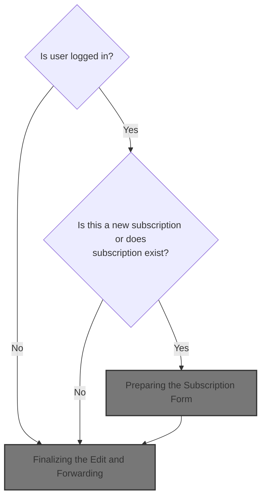
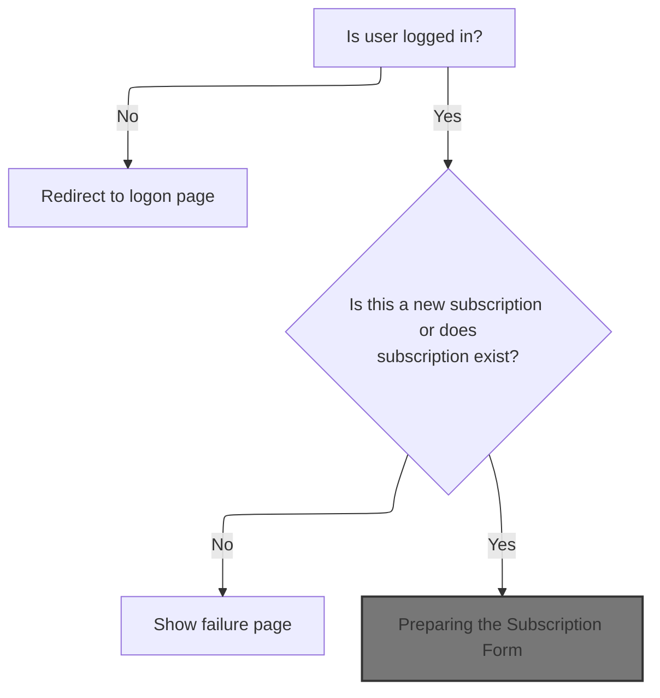
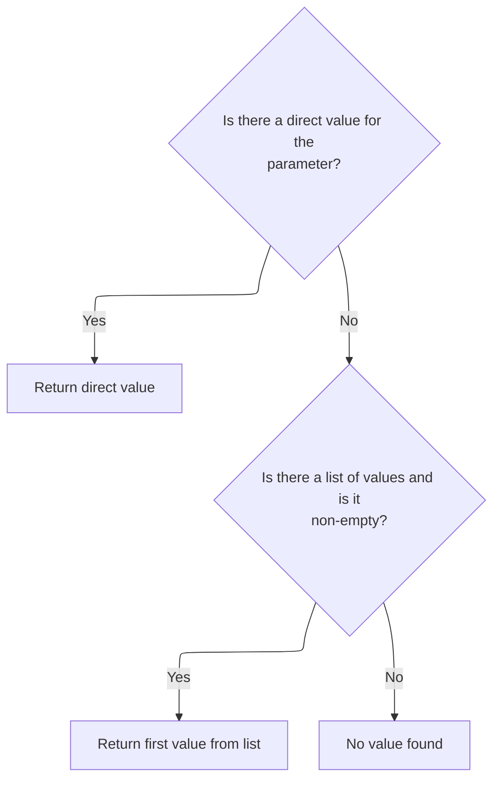
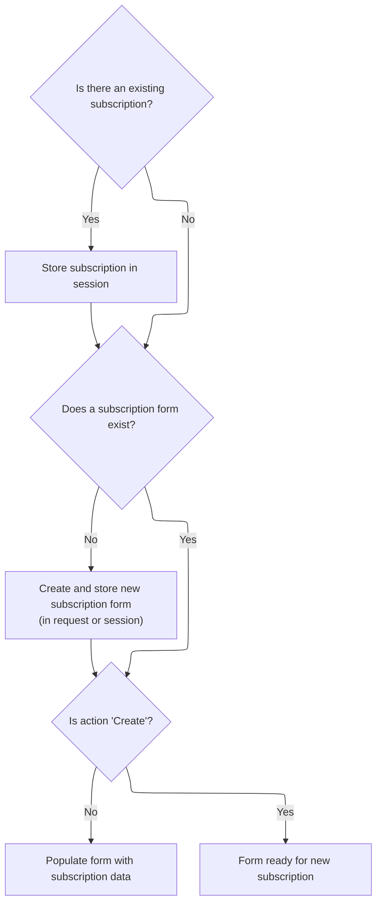
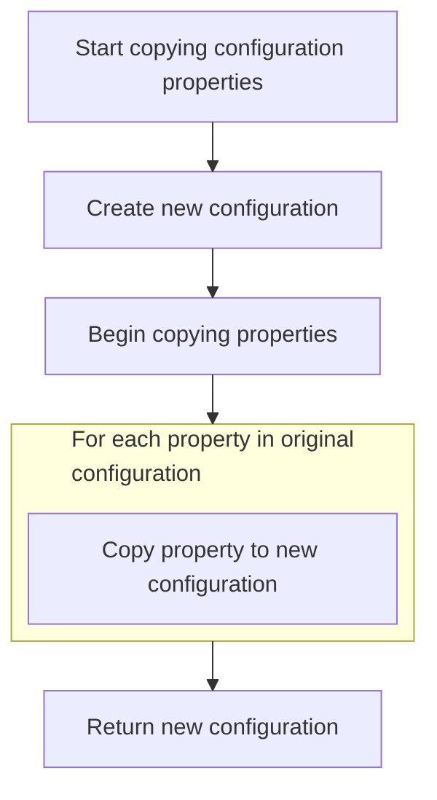

This document describes how the system processes a user's request to edit or create a subscription. The flow checks the user's login status, determines if the subscription exists, and prepares the subscription form with the relevant data. The user is then forwarded to the appropriate page. This supports user account management by enabling subscription updates.



# Handling Subscription Edit Requests



<SwmSnippet path="/apps/faces-example1/src/main/java/org/apache/struts/webapp/example/EditSubscriptionAction.java" line="79">

---

In `EditSubscriptionAction.execute`, we're checking user session and pulling out the action and host parameters. If the user isn't logged in or the subscription doesn't exist, we bail early. We need to call <SwmToken path="core/src/main/java/org/apache/struts/upload/MultipartRequestWrapper.java" pos="38:4:4" line-data="public class MultipartRequestWrapper extends HttpServletRequestWrapper {">`MultipartRequestWrapper`</SwmToken> next because parameters might be coming from a multipart form, and the regular request won't always give us what we need.

```java
    public ActionForward execute(ActionMapping mapping,
                 ActionForm form,
                 HttpServletRequest request,
                 HttpServletResponse response)
    throws Exception {

    // Extract attributes we will need
    HttpSession session = request.getSession();
    String action = request.getParameter("action");
    if (action == null) {
        action = "Create";
        }
    String host = request.getParameter("host");
        if (log.isDebugEnabled()) {
            log.debug("EditSubscriptionAction:  Processing " + action +
                      " action");
        }

    // Is there a currently logged on user?
    User user = (User) session.getAttribute(Constants.USER_KEY);
    if (user == null) {
            if (log.isTraceEnabled()) {
                log.trace(" User is not logged on in session "
                          + session.getId());
            }
        return (mapping.findForward("logon"));
    }

    // Identify the relevant subscription
    Subscription subscription =
            user.findSubscription(request.getParameter("host"));
    if ((subscription == null) && !action.equals("Create")) {
            if (log.isTraceEnabled()) {
                log.trace(" No subscription for user " +
                          user.getUsername() + " and host " + host);
            }
        return (mapping.findForward("failure"));
    }
```

---

</SwmSnippet>

## Retrieving Form Parameters Safely

<SwmSnippet path="/core/src/main/java/org/apache/struts/upload/MultipartRequestWrapper.java" line="75">

---

In `MultipartRequestWrapper.getParameter`, we're grabbing the parameter from the request first. If that's null, we check our internal parameters map. To get the request, we need to call ServletActionContext.getRequest, since that's where the actual request object comes from in this setup.

```java
    public String getParameter(String name) {
        String value = getRequest().getParameter(name);

```

---

</SwmSnippet>

### Accessing the HTTP Request Object

<SwmSnippet path="/core/src/main/java/org/apache/struts/chain/contexts/ServletActionContext.java" line="94">

---

<SwmToken path="core/src/main/java/org/apache/struts/chain/contexts/ServletActionContext.java" pos="94:5:5" line-data="    public HttpServletRequest getRequest() {">`getRequest`</SwmToken> just pulls the request object from <SwmToken path="core/src/main/java/org/apache/struts/chain/contexts/ServletActionContext.java" pos="95:3:3" line-data="        return servletWebContext().getRequest();">`servletWebContext`</SwmToken>. We need to call <SwmToken path="core/src/main/java/org/apache/struts/chain/contexts/ServletActionContext.java" pos="95:3:3" line-data="        return servletWebContext().getRequest();">`servletWebContext`</SwmToken> next because that's where the actual <SwmToken path="core/src/main/java/org/apache/struts/chain/contexts/ServletActionContext.java" pos="94:3:3" line-data="    public HttpServletRequest getRequest() {">`HttpServletRequest`</SwmToken> lives, and the flow depends on getting the right context for parameter access.

```java
    public HttpServletRequest getRequest() {
        return servletWebContext().getRequest();
    }
```

---

</SwmSnippet>

<SwmSnippet path="/core/src/main/java/org/apache/struts/chain/contexts/ServletActionContext.java" line="67">

---

<SwmToken path="core/src/main/java/org/apache/struts/chain/contexts/ServletActionContext.java" pos="67:5:5" line-data="    protected ServletWebContext servletWebContext() {">`servletWebContext`</SwmToken> just casts <SwmToken path="core/src/main/java/org/apache/struts/chain/contexts/ServletActionContext.java" pos="68:9:11" line-data="        return (ServletWebContext) this.getBaseContext();">`getBaseContext()`</SwmToken> to <SwmToken path="core/src/main/java/org/apache/struts/chain/contexts/ServletActionContext.java" pos="67:3:3" line-data="    protected ServletWebContext servletWebContext() {">`ServletWebContext`</SwmToken> without checking. If <SwmToken path="core/src/main/java/org/apache/struts/chain/contexts/ServletActionContext.java" pos="68:9:11" line-data="        return (ServletWebContext) this.getBaseContext();">`getBaseContext()`</SwmToken> isn't the right type, we'll get a ClassCastException. The code assumes the context is always correct, which is risky but keeps things simple.

```java
    protected ServletWebContext servletWebContext() {
        return (ServletWebContext) this.getBaseContext();
    }
```

---

</SwmSnippet>

### Fallback Parameter Lookup



<SwmSnippet path="/core/src/main/java/org/apache/struts/upload/MultipartRequestWrapper.java" line="78">

---

Back in `MultipartRequestWrapper.getParameter`, after grabbing the request from <SwmToken path="core/src/main/java/org/apache/struts/chain/contexts/ServletActionContext.java" pos="39:4:4" line-data="public class ServletActionContext extends WebActionContext {">`ServletActionContext`</SwmToken>, if the value is still null, we check the parameters map. If there's an array for the name, we use the first element. This fallback is needed for multipart forms where the request doesn't always have the data.

```java
        if (value == null) {
            String[] mValue = (String[]) parameters.get(name);

            if ((mValue != null) && (mValue.length > 0)) {
                value = mValue[0];
            }
        }

        return value;
    }
```

---

</SwmSnippet>

## Preparing the Subscription Form



<SwmSnippet path="/apps/faces-example1/src/main/java/org/apache/struts/webapp/example/EditSubscriptionAction.java" line="117">

---

Back in `EditSubscriptionAction.execute`, after getting parameters from <SwmToken path="core/src/main/java/org/apache/struts/upload/MultipartRequestWrapper.java" pos="38:4:4" line-data="public class MultipartRequestWrapper extends HttpServletRequestWrapper {">`MultipartRequestWrapper`</SwmToken>, we set the subscription in the session and prep the form bean. We need to call ActionConfig.getAttribute next to figure out the right attribute name for storing the form, since it handles fallback if the attribute isn't set.

```java
        if (subscription != null) {
            session.setAttribute(Constants.SUBSCRIPTION_KEY, subscription);
        }

    // Populate the subscription form
    if (form == null) {
            if (log.isTraceEnabled()) {
                log.trace(" Creating new SubscriptionForm bean under key "
                          + mapping.getAttribute());
            }
        form = new SubscriptionForm();
            if ("request".equals(mapping.getScope())) {
                request.setAttribute(mapping.getAttribute(), form);
            } else {
                session.setAttribute(mapping.getAttribute(), form);
            }
    }
```

---

</SwmSnippet>

<SwmSnippet path="/core/src/main/java/org/apache/struts/config/ActionConfig.java" line="321">

---

<SwmToken path="core/src/main/java/org/apache/struts/config/ActionConfig.java" pos="321:5:5" line-data="    public String getAttribute() {">`getAttribute`</SwmToken> checks if 'attribute' is null and falls back to 'name'. This guarantees we always have a string to use as the key for storing the form bean, even if 'attribute' isn't set.

```java
    public String getAttribute() {
        if (this.attribute == null) {
            return (this.name);
        } else {
            return (this.attribute);
        }
    }
```

---

</SwmSnippet>

<SwmSnippet path="/apps/faces-example1/src/main/java/org/apache/struts/webapp/example/EditSubscriptionAction.java" line="134">

---

Back in `EditSubscriptionAction.execute`, after getting the attribute name, we cast the form and set the action. If we're not creating, we copy properties from the subscription to the form. We need to call BaseConfig.copyProperties next to handle the property transfer.

```java
    SubscriptionForm subform = (SubscriptionForm) form;
    subform.setAction(action);
        if (!action.equals("Create")) {
            if (log.isTraceEnabled()) {
                log.trace(" Populating form from " + subscription);
            }
            try {
                PropertyUtils.copyProperties(subform, subscription);
```

---

</SwmSnippet>

## Copying Subscription Properties



<SwmSnippet path="/core/src/main/java/org/apache/struts/config/BaseConfig.java" line="155">

---

<SwmToken path="core/src/main/java/org/apache/struts/config/BaseConfig.java" pos="155:5:5" line-data="    protected Properties copyProperties() {">`copyProperties`</SwmToken> creates a new Properties object and copies each key-value pair from the existing properties. This avoids messing with the original properties and gives us a clean copy for the form bean. We need to call <SwmToken path="core/src/main/java/org/apache/struts/config/BaseConfig.java" pos="163:3:3" line-data="            copy.setProperty(key, properties.getProperty(key));">`setProperty`</SwmToken> next to actually set individual properties.

```java
    protected Properties copyProperties() {
        Properties copy = new Properties();

        Enumeration keys = properties.propertyNames();

        while (keys.hasMoreElements()) {
            String key = (String) keys.nextElement();

            copy.setProperty(key, properties.getProperty(key));
        }

        return copy;
    }
```

---

</SwmSnippet>

<SwmSnippet path="/core/src/main/java/org/apache/struts/config/BaseConfig.java" line="88">

---

<SwmToken path="core/src/main/java/org/apache/struts/config/BaseConfig.java" pos="88:5:5" line-data="    public void setProperty(String key, String value) {">`setProperty`</SwmToken> checks if the object is already configured before setting anything. If it's configured, it throws, so we can't change properties after setup. This keeps things immutable and avoids surprises.

```java
    public void setProperty(String key, String value) {
        throwIfConfigured();
        properties.setProperty(key, value);
    }
```

---

</SwmSnippet>

## Finalizing the Edit and Forwarding

<SwmSnippet path="/apps/faces-example1/src/main/java/org/apache/struts/webapp/example/EditSubscriptionAction.java" line="142">

---

Back in `EditSubscriptionAction.execute`, after copying properties from <SwmToken path="core/src/main/java/org/apache/struts/config/ActionConfig.java" pos="41:8:8" line-data="public class ActionConfig extends BaseConfig {">`BaseConfig`</SwmToken>, we set the action again and handle any exceptions. If something goes wrong, we log it and throw a <SwmToken path="apps/faces-example1/src/main/java/org/apache/struts/webapp/example/EditSubscriptionAction.java" pos="148:5:5" line-data="                throw new ServletException(&quot;SubscriptionForm.populate&quot;, t);">`ServletException`</SwmToken>. Otherwise, we forward to the 'success' page to finish the edit.

```java
                subform.setAction(action);
            } catch (InvocationTargetException e) {
                Throwable t = e.getTargetException();
                if (t == null)
                    t = e;
                log.error("SubscriptionForm.populate", t);
                throw new ServletException("SubscriptionForm.populate", t);
            } catch (Throwable t) {
                log.error("SubscriptionForm.populate", t);
                throw new ServletException("SubscriptionForm.populate", t);
            }
        }

    // Forward control to the edit subscription page
        if (log.isTraceEnabled()) {
            log.trace(" Forwarding to 'success' page");
        }
    return (mapping.findForward("success"));

    }
```

---

</SwmSnippet>

&nbsp;

*This is an auto-generated document by Swimm 🌊 and has not yet been verified by a human*

<SwmMeta version="3.0.0" repo-id="Z2l0aHViJTNBJTNBc3RydXRzMSUzQSUzQVN3aW1tLURlbW8=" repo-name="struts1"><sup>Powered by [Swimm](https://app.swimm.io/)</sup></SwmMeta>
