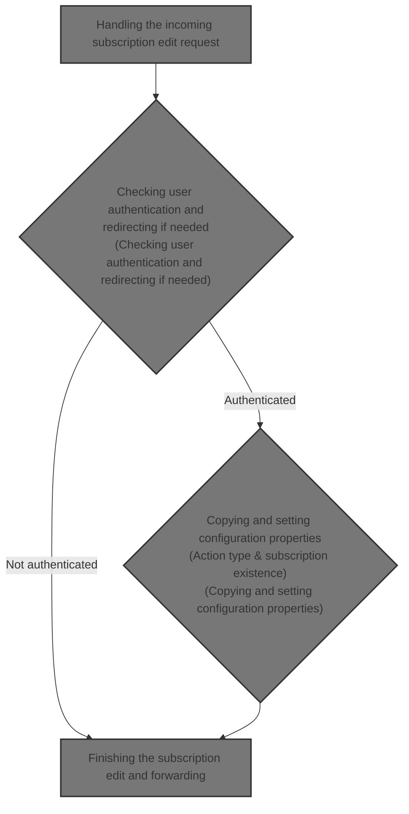
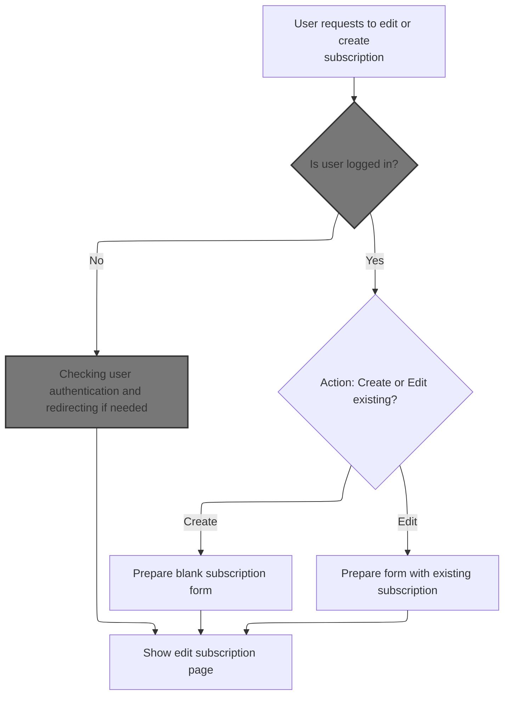

This document describes how user requests to edit or create a subscription are processed. The system ensures authentication, retrieves or prepares subscription data, and displays the edit subscription page. Multipart form data is handled when necessary, and users are redirected appropriately based on their authentication status and requested action.



# Handling the incoming subscription edit request



<SwmSnippet path="/apps/faces-example2/src/main/java/org/apache/struts/webapp/example2/EditSubscriptionAction.java" line="79">

---

In <SwmToken path="apps/faces-example2/src/main/java/org/apache/struts/webapp/example2/EditSubscriptionAction.java" pos="79:5:5" line-data="    public ActionForward execute(ActionMapping mapping,">`execute`</SwmToken>, we're grabbing session and request parameters like 'action' and 'host'. We need to call <SwmToken path="core/src/main/java/org/apache/struts/upload/MultipartRequestWrapper.java" pos="38:4:4" line-data="public class MultipartRequestWrapper extends HttpServletRequestWrapper {">`MultipartRequestWrapper`</SwmToken> next because if the request is multipart (like file uploads), standard parameter access won't work, so we switch to a wrapper that can handle those cases.

```java
    public ActionForward execute(ActionMapping mapping,
                 ActionForm form,
                 HttpServletRequest request,
                 HttpServletResponse response)
    throws Exception {

    // Extract attributes we will need
    HttpSession session = request.getSession();
    String action = request.getParameter("action");
    if (action == null) {
        action = "Create";
        }
    String host = request.getParameter("host");
        if (log.isDebugEnabled()) {
            log.debug("EditSubscriptionAction:  Processing " + action +
                      " action");
        }

```

---

</SwmSnippet>

## Retrieving parameters from multipart requests

<SwmSnippet path="/core/src/main/java/org/apache/struts/upload/MultipartRequestWrapper.java" line="75">

---

In <SwmToken path="core/src/main/java/org/apache/struts/upload/MultipartRequestWrapper.java" pos="75:5:5" line-data="    public String getParameter(String name) {">`getParameter`</SwmToken>, we're first trying to pull the parameter from the underlying request. If that's null (which happens for multipart forms), we need to call <SwmToken path="core/src/main/java/org/apache/struts/chain/contexts/ServletActionContext.java" pos="39:4:4" line-data="public class ServletActionContext extends WebActionContext {">`ServletActionContext`</SwmToken> to get the actual request object, so we can check both sources for the parameter.

```java
    public String getParameter(String name) {
        String value = getRequest().getParameter(name);

```

---

</SwmSnippet>

### Accessing the servlet request from the web context

<SwmSnippet path="/core/src/main/java/org/apache/struts/chain/contexts/ServletActionContext.java" line="94">

---

<SwmToken path="core/src/main/java/org/apache/struts/chain/contexts/ServletActionContext.java" pos="94:5:5" line-data="    public HttpServletRequest getRequest() {">`getRequest`</SwmToken> just grabs the request from the servlet web context. We call <SwmToken path="core/src/main/java/org/apache/struts/chain/contexts/ServletActionContext.java" pos="95:3:3" line-data="        return servletWebContext().getRequest();">`servletWebContext`</SwmToken> to get a more specific context, but this relies on <SwmToken path="core/src/main/java/org/apache/struts/chain/contexts/ServletActionContext.java" pos="68:9:11" line-data="        return (ServletWebContext) this.getBaseContext();">`getBaseContext()`</SwmToken> being the right type, otherwise it'll blow up.

```java
    public HttpServletRequest getRequest() {
        return servletWebContext().getRequest();
    }
```

---

</SwmSnippet>

<SwmSnippet path="/core/src/main/java/org/apache/struts/chain/contexts/ServletActionContext.java" line="67">

---

<SwmToken path="core/src/main/java/org/apache/struts/chain/contexts/ServletActionContext.java" pos="67:5:5" line-data="    protected ServletWebContext servletWebContext() {">`servletWebContext`</SwmToken> casts <SwmToken path="core/src/main/java/org/apache/struts/chain/contexts/ServletActionContext.java" pos="68:9:11" line-data="        return (ServletWebContext) this.getBaseContext();">`getBaseContext()`</SwmToken> to <SwmToken path="core/src/main/java/org/apache/struts/chain/contexts/ServletActionContext.java" pos="67:3:3" line-data="    protected ServletWebContext servletWebContext() {">`ServletWebContext`</SwmToken> so we can access servlet-specific stuff. The code assumes the base context is always the right type, which isn't checked here.

```java
    protected ServletWebContext servletWebContext() {
        return (ServletWebContext) this.getBaseContext();
    }
```

---

</SwmSnippet>

### Fallback parameter lookup for multipart forms

<SwmSnippet path="/core/src/main/java/org/apache/struts/upload/MultipartRequestWrapper.java" line="78">

---

Back in `MultipartRequestWrapper.getParameter`, after checking the request, we fall back to the parameters map. If the map has a String array, we just grab the first value. This is needed because multipart forms can stash parameters in the map, not the request.

```java
        if (value == null) {
            String[] mValue = (String[]) parameters.get(name);

            if ((mValue != null) && (mValue.length > 0)) {
                value = mValue[0];
            }
        }

        return value;
    }
```

---

</SwmSnippet>

## Checking user authentication and redirecting if needed

```mermaid
%%{init: {"flowchart": {"defaultRenderer": "elk"}} }%%
flowchart TD
    node1{"Is user logged in?"}
    click node1 openCode "apps/faces-example2/src/main/java/org/apache/struts/webapp/example2/EditSubscriptionAction.java:97:105"
    node1 -->|"No"| node2["Redirect to logon page"]
    click node2 openCode "apps/faces-example2/src/main/java/org/apache/struts/webapp/example2/EditSubscriptionAction.java:104:105"
    node1 -->|"Yes"| node3["Find subscription for user and host"]
    click node3 openCode "apps/faces-example2/src/main/java/org/apache/struts/webapp/example2/EditSubscriptionAction.java:107:109"
    node3 --> node4{"Is subscription missing AND action is
not 'Create'?"}
    click node4 openCode "apps/faces-example2/src/main/java/org/apache/struts/webapp/example2/EditSubscriptionAction.java:110:116"
    node4 -->|"Yes"| node5["Redirect to failure page"]
    click node5 openCode "apps/faces-example2/src/main/java/org/apache/struts/webapp/example2/EditSubscriptionAction.java:115:116"
    node4 -->|"No"| node6{"Does form exist?"}
    click node6 openCode "apps/faces-example2/src/main/java/org/apache/struts/webapp/example2/EditSubscriptionAction.java:122:133"
    node6 -->|"No"| node7["Create new subscription form"]
    click node7 openCode "apps/faces-example2/src/main/java/org/apache/struts/webapp/example2/EditSubscriptionAction.java:127:133"
    node6 -->|"Yes"| node8["Form exists"]
    click node8 openCode "apps/faces-example2/src/main/java/org/apache/struts/webapp/example2/EditSubscriptionAction.java:134:135"
    node7 --> node9{"Is action 'Create'?"}
    click node9 openCode "apps/faces-example2/src/main/java/org/apache/struts/webapp/example2/EditSubscriptionAction.java:136:141"
    node8 --> node9
    node9 -->|"No"| node10["Populate form with subscription details"]
    click node10 openCode "apps/faces-example2/src/main/java/org/apache/struts/webapp/example2/EditSubscriptionAction.java:140:141"
    node9 -->|"Yes"| node11["Ready for subscription creation"]
    click node11 openCode "apps/faces-example2/src/main/java/org/apache/struts/webapp/example2/EditSubscriptionAction.java:135:141"

classDef HeadingStyle fill:#777777,stroke:#333,stroke-width:2px;

%% Swimm:
%% %%{init: {"flowchart": {"defaultRenderer": "elk"}} }%%
%% flowchart TD
%%     node1{"Is user logged in?"}
%%     click node1 openCode "<SwmPath>[apps/…/example2/EditSubscriptionAction.java](apps/faces-example2/src/main/java/org/apache/struts/webapp/example2/EditSubscriptionAction.java)</SwmPath>:97:105"
%%     node1 -->|"No"| node2["Redirect to logon page"]
%%     click node2 openCode "<SwmPath>[apps/…/example2/EditSubscriptionAction.java](apps/faces-example2/src/main/java/org/apache/struts/webapp/example2/EditSubscriptionAction.java)</SwmPath>:104:105"
%%     node1 -->|"Yes"| node3["Find subscription for user and host"]
%%     click node3 openCode "<SwmPath>[apps/…/example2/EditSubscriptionAction.java](apps/faces-example2/src/main/java/org/apache/struts/webapp/example2/EditSubscriptionAction.java)</SwmPath>:107:109"
%%     node3 --> node4{"Is subscription missing AND action is
%% not 'Create'?"}
%%     click node4 openCode "<SwmPath>[apps/…/example2/EditSubscriptionAction.java](apps/faces-example2/src/main/java/org/apache/struts/webapp/example2/EditSubscriptionAction.java)</SwmPath>:110:116"
%%     node4 -->|"Yes"| node5["Redirect to failure page"]
%%     click node5 openCode "<SwmPath>[apps/…/example2/EditSubscriptionAction.java](apps/faces-example2/src/main/java/org/apache/struts/webapp/example2/EditSubscriptionAction.java)</SwmPath>:115:116"
%%     node4 -->|"No"| node6{"Does form exist?"}
%%     click node6 openCode "<SwmPath>[apps/…/example2/EditSubscriptionAction.java](apps/faces-example2/src/main/java/org/apache/struts/webapp/example2/EditSubscriptionAction.java)</SwmPath>:122:133"
%%     node6 -->|"No"| node7["Create new subscription form"]
%%     click node7 openCode "<SwmPath>[apps/…/example2/EditSubscriptionAction.java](apps/faces-example2/src/main/java/org/apache/struts/webapp/example2/EditSubscriptionAction.java)</SwmPath>:127:133"
%%     node6 -->|"Yes"| node8["Form exists"]
%%     click node8 openCode "<SwmPath>[apps/…/example2/EditSubscriptionAction.java](apps/faces-example2/src/main/java/org/apache/struts/webapp/example2/EditSubscriptionAction.java)</SwmPath>:134:135"
%%     node7 --> node9{"Is action 'Create'?"}
%%     click node9 openCode "<SwmPath>[apps/…/example2/EditSubscriptionAction.java](apps/faces-example2/src/main/java/org/apache/struts/webapp/example2/EditSubscriptionAction.java)</SwmPath>:136:141"
%%     node8 --> node9
%%     node9 -->|"No"| node10["Populate form with subscription details"]
%%     click node10 openCode "<SwmPath>[apps/…/example2/EditSubscriptionAction.java](apps/faces-example2/src/main/java/org/apache/struts/webapp/example2/EditSubscriptionAction.java)</SwmPath>:140:141"
%%     node9 -->|"Yes"| node11["Ready for subscription creation"]
%%     click node11 openCode "<SwmPath>[apps/…/example2/EditSubscriptionAction.java](apps/faces-example2/src/main/java/org/apache/struts/webapp/example2/EditSubscriptionAction.java)</SwmPath>:135:141"
%% 
%% classDef HeadingStyle fill:#777777,stroke:#333,stroke-width:2px;
```



<SwmSnippet path="/apps/faces-example2/src/main/java/org/apache/struts/webapp/example2/EditSubscriptionAction.java" line="97">

---

Back in `EditSubscriptionAction.execute`, after parameter handling, we check if there's a logged-in user. If not, we use <SwmToken path="apps/faces-example2/src/main/java/org/apache/struts/webapp/example2/EditSubscriptionAction.java" pos="104:4:6" line-data="        return (mapping.findForward(&quot;logon&quot;));">`mapping.findForward`</SwmToken> to send them to logon, which lets us use Struts config for navigation instead of hardcoding redirects.

```java
    // Is there a currently logged on user?
    User user = (User) session.getAttribute(Constants.USER_KEY);
    if (user == null) {
            if (log.isTraceEnabled()) {
                log.trace(" User is not logged on in session "
                          + session.getId());
            }
        return (mapping.findForward("logon"));
    }

```

---

</SwmSnippet>

<SwmSnippet path="/core/src/main/java/org/apache/struts/action/ActionMapping.java" line="70">

---

<SwmToken path="core/src/main/java/org/apache/struts/action/ActionMapping.java" pos="70:5:5" line-data="    public ActionForward findForward(String forwardName) {">`findForward`</SwmToken> looks up a <SwmToken path="core/src/main/java/org/apache/struts/action/ActionMapping.java" pos="71:1:1" line-data="        ForwardConfig config = findForwardConfig(forwardName);">`ForwardConfig`</SwmToken> by name, first in the current context, then in the module config. It assumes the config can be cast to <SwmToken path="core/src/main/java/org/apache/struts/action/ActionMapping.java" pos="70:3:3" line-data="    public ActionForward findForward(String forwardName) {">`ActionForward`</SwmToken>, and logs a warning if nothing is found.

```java
    public ActionForward findForward(String forwardName) {
        ForwardConfig config = findForwardConfig(forwardName);

        if (config == null) {
            config = getModuleConfig().findForwardConfig(forwardName);
        }

        // TODO: remove warning since findRequiredForward takes care of use case? 
        if (config == null) {
            if (log.isWarnEnabled()) {
                log.warn("Unable to find '" + forwardName + "' forward.");
            }
        }

        return ((ActionForward) config);
    }
```

---

</SwmSnippet>

<SwmSnippet path="/apps/faces-example2/src/main/java/org/apache/struts/webapp/example2/EditSubscriptionAction.java" line="107">

---

Back in `EditSubscriptionAction.execute`, after forwarding, we grab the subscription using <SwmToken path="apps/faces-example2/src/main/java/org/apache/struts/webapp/example2/EditSubscriptionAction.java" pos="109:5:7" line-data="            user.findSubscription(request.getParameter(&quot;host&quot;));">`request.getParameter`</SwmToken>("host"). Since multipart requests can mess with parameter access, we use <SwmToken path="core/src/main/java/org/apache/struts/upload/MultipartRequestWrapper.java" pos="38:4:4" line-data="public class MultipartRequestWrapper extends HttpServletRequestWrapper {">`MultipartRequestWrapper`</SwmToken> to make sure we get the right value.

```java
    // Identify the relevant subscription
    Subscription subscription =
            user.findSubscription(request.getParameter("host"));
```

---

</SwmSnippet>

<SwmSnippet path="/apps/faces-example2/src/main/java/org/apache/struts/webapp/example2/EditSubscriptionAction.java" line="110">

---

Back in `EditSubscriptionAction.execute`, after checking for the subscription, if it's missing and we're not creating, we use <SwmToken path="apps/faces-example2/src/main/java/org/apache/struts/webapp/example2/EditSubscriptionAction.java" pos="115:4:6" line-data="        return (mapping.findForward(&quot;failure&quot;));">`mapping.findForward`</SwmToken>("failure") to handle the error via Struts config.

```java
    if ((subscription == null) && !action.equals("Create")) {
            if (log.isTraceEnabled()) {
                log.trace(" No subscription for user " +
                          user.getUsername() + " and host " + host);
            }
        return (mapping.findForward("failure"));
    }
```

---

</SwmSnippet>

<SwmSnippet path="/apps/faces-example2/src/main/java/org/apache/struts/webapp/example2/EditSubscriptionAction.java" line="117">

---

Back in `EditSubscriptionAction.execute`, after handling the subscription, we check if the form exists. If not, we create it and store it using <SwmToken path="apps/faces-example2/src/main/java/org/apache/struts/webapp/example2/EditSubscriptionAction.java" pos="125:3:7" line-data="                          + mapping.getAttribute());">`mapping.getAttribute()`</SwmToken>, which is configurable via <SwmToken path="core/src/main/java/org/apache/struts/chain/contexts/ServletActionContext.java" pos="28:10:10" line-data="import org.apache.struts.config.ActionConfig;">`ActionConfig`</SwmToken>, so we need to call that next.

```java
        if (subscription != null) {
            session.setAttribute(Constants.SUBSCRIPTION_KEY, subscription);
        }

    // Populate the subscription form
    if (form == null) {
            if (log.isTraceEnabled()) {
                log.trace(" Creating new SubscriptionForm bean under key "
                          + mapping.getAttribute());
            }
        form = new SubscriptionForm();
            if ("request".equals(mapping.getScope())) {
                request.setAttribute(mapping.getAttribute(), form);
            } else {
                session.setAttribute(mapping.getAttribute(), form);
            }
    }
```

---

</SwmSnippet>

<SwmSnippet path="/core/src/main/java/org/apache/struts/config/ActionConfig.java" line="321">

---

<SwmToken path="core/src/main/java/org/apache/struts/config/ActionConfig.java" pos="321:5:5" line-data="    public String getAttribute() {">`getAttribute`</SwmToken> returns the attribute name for storing stuff. If 'attribute' is null, it falls back to 'name', so the storage key is always set, but this isn't obvious from the method name.

```java
    public String getAttribute() {
        if (this.attribute == null) {
            return (this.name);
        } else {
            return (this.attribute);
        }
    }
```

---

</SwmSnippet>

<SwmSnippet path="/apps/faces-example2/src/main/java/org/apache/struts/webapp/example2/EditSubscriptionAction.java" line="134">

---

Back in `EditSubscriptionAction.execute`, after setting up the form, we copy properties from the subscription to the form if we're not creating. We need to call <SwmToken path="core/src/main/java/org/apache/struts/config/ActionConfig.java" pos="41:8:8" line-data="public class ActionConfig extends BaseConfig {">`BaseConfig`</SwmToken> next to handle property copying.

```java
    SubscriptionForm subform = (SubscriptionForm) form;
    subform.setAction(action);
        if (!action.equals("Create")) {
            if (log.isTraceEnabled()) {
                log.trace(" Populating form from " + subscription);
            }
            try {
                PropertyUtils.copyProperties(subform, subscription);
```

---

</SwmSnippet>

## Copying and setting configuration properties

<SwmSnippet path="/core/src/main/java/org/apache/struts/config/BaseConfig.java" line="155">

---

<SwmToken path="core/src/main/java/org/apache/struts/config/BaseConfig.java" pos="155:5:5" line-data="    protected Properties copyProperties() {">`copyProperties`</SwmToken> clones all key-value pairs from the internal properties field into a new Properties object. We need to call <SwmToken path="core/src/main/java/org/apache/struts/config/BaseConfig.java" pos="163:3:3" line-data="            copy.setProperty(key, properties.getProperty(key));">`setProperty`</SwmToken> next to actually set each property in the new object.

```java
    protected Properties copyProperties() {
        Properties copy = new Properties();

        Enumeration keys = properties.propertyNames();

        while (keys.hasMoreElements()) {
            String key = (String) keys.nextElement();

            copy.setProperty(key, properties.getProperty(key));
        }

        return copy;
    }
```

---

</SwmSnippet>

<SwmSnippet path="/core/src/main/java/org/apache/struts/config/BaseConfig.java" line="88">

---

<SwmToken path="core/src/main/java/org/apache/struts/config/BaseConfig.java" pos="88:5:5" line-data="    public void setProperty(String key, String value) {">`setProperty`</SwmToken> checks if the config is locked before setting a property. If it's not locked, it sets the property in the Properties object. This prevents changes after configuration is finalized.

```java
    public void setProperty(String key, String value) {
        throwIfConfigured();
        properties.setProperty(key, value);
    }
```

---

</SwmSnippet>

## Finishing the subscription edit and forwarding

<SwmSnippet path="/apps/faces-example2/src/main/java/org/apache/struts/webapp/example2/EditSubscriptionAction.java" line="142">

---

Back in EditSubscriptionAction.execute, after copying properties, we set the action on the form and handle any exceptions by logging and throwing a <SwmToken path="apps/faces-example2/src/main/java/org/apache/struts/webapp/example2/EditSubscriptionAction.java" pos="148:5:5" line-data="                throw new ServletException(&quot;SubscriptionForm.populate&quot;, t);">`ServletException`</SwmToken>. Finally, we use <SwmToken path="apps/faces-example2/src/main/java/org/apache/struts/webapp/example2/EditSubscriptionAction.java" pos="159:4:6" line-data="    return (mapping.findForward(&quot;success&quot;));">`mapping.findForward`</SwmToken>("success") to forward to the configured success page. We need to call <SwmToken path="apps/faces-example2/src/main/java/org/apache/struts/webapp/example2/EditSubscriptionAction.java" pos="79:7:7" line-data="    public ActionForward execute(ActionMapping mapping,">`ActionMapping`</SwmToken> here because that's where <SwmToken path="apps/faces-example2/src/main/java/org/apache/struts/webapp/example2/EditSubscriptionAction.java" pos="159:6:6" line-data="    return (mapping.findForward(&quot;success&quot;));">`findForward`</SwmToken> is implemented, letting us use the Struts config for navigation instead of hardcoding paths.

```java
                subform.setAction(action);
            } catch (InvocationTargetException e) {
                Throwable t = e.getTargetException();
                if (t == null)
                    t = e;
                log.error("SubscriptionForm.populate", t);
                throw new ServletException("SubscriptionForm.populate", t);
            } catch (Throwable t) {
                log.error("SubscriptionForm.populate", t);
                throw new ServletException("SubscriptionForm.populate", t);
            }
        }

    // Forward control to the edit subscription page
        if (log.isTraceEnabled()) {
            log.trace(" Forwarding to 'success' page");
        }
    return (mapping.findForward("success"));

    }
```

---

</SwmSnippet>

&nbsp;

*This is an auto-generated document by Swimm 🌊 and has not yet been verified by a human*

<SwmMeta version="3.0.0" repo-id="Z2l0aHViJTNBJTNBc3RydXRzMSUzQSUzQVN3aW1tLURlbW8=" repo-name="struts1"><sup>Powered by [Swimm](https://app.swimm.io/)</sup></SwmMeta>
