This document describes how the system manages user registration edits and creation. When a user requests to edit or create a registration, the system checks the user's session, determines the action type, and prepares the registration form. If the user is not logged in, they are redirected to the logon page. Otherwise, the form is populated and the user is forwarded to the registration edit page.

# Delegating Action Execution

<SwmSnippet path="/extras/src/main/java/org/apache/struts/actions/LookupDispatchAction.java" line="143">

---

<SwmToken path="extras/src/main/java/org/apache/struts/actions/LookupDispatchAction.java" pos="143:5:5" line-data="    public ActionForward execute(ActionMapping mapping, ActionForm form,">`execute`</SwmToken> here just hands off to the superclass, so the actual action logic happens downstream. We need to call <SwmToken path="apps/faces-example1/src/main/java/org/apache/struts/webapp/example/EditRegistrationAction.java" pos="92:6:6" line-data="            log.debug(&quot;EditRegistrationAction:  Processing &quot; + action +">`EditRegistrationAction`</SwmToken> next because that's where the user registration edit logic is implemented, and this delegation lets us keep the flow generic and extensible.

```java
    public ActionForward execute(ActionMapping mapping, ActionForm form,
        HttpServletRequest request, HttpServletResponse response)
        throws Exception {
        return super.execute(mapping, form, request, response);
    }
```

---

</SwmSnippet>

# Preparing Registration Edit

<SwmSnippet path="/apps/faces-example1/src/main/java/org/apache/struts/webapp/example/EditRegistrationAction.java" line="80">

---

In <SwmToken path="apps/faces-example1/src/main/java/org/apache/struts/webapp/example/EditRegistrationAction.java" pos="80:5:5" line-data="    public ActionForward execute(ActionMapping mapping,">`execute`</SwmToken>, we grab the session and check the 'action' parameter. If it's not 'Create', we expect a User object in the session and prep the <SwmToken path="apps/faces-example1/src/main/java/org/apache/struts/webapp/example/EditRegistrationAction.java" pos="112:11:11" line-data="                log.trace(&quot; Creating new RegistrationForm bean under key &quot;">`RegistrationForm`</SwmToken> for editing. We call <SwmToken path="core/src/main/java/org/apache/struts/upload/MultipartRequestWrapper.java" pos="38:4:4" line-data="public class MultipartRequestWrapper extends HttpServletRequestWrapper {">`MultipartRequestWrapper`</SwmToken> next to reliably fetch parameters, especially for multipart forms.

```java
    public ActionForward execute(ActionMapping mapping,
                 ActionForm form,
                 HttpServletRequest request,
                 HttpServletResponse response)
    throws Exception {

    // Extract attributes we will need
    HttpSession session = request.getSession();
    String action = request.getParameter("action");
```

---

</SwmSnippet>

## Parameter Retrieval Logic

<SwmSnippet path="/core/src/main/java/org/apache/struts/upload/MultipartRequestWrapper.java" line="75">

---

In <SwmToken path="core/src/main/java/org/apache/struts/upload/MultipartRequestWrapper.java" pos="75:5:5" line-data="    public String getParameter(String name) {">`getParameter`</SwmToken>, we first try to fetch the parameter from the request. If it's not there, we need to call <SwmToken path="core/src/main/java/org/apache/struts/chain/contexts/ServletActionContext.java" pos="39:4:4" line-data="public class ServletActionContext extends WebActionContext {">`ServletActionContext`</SwmToken> next to get the actual request object, since multipart forms might store parameters differently.

```java
    public String getParameter(String name) {
        String value = getRequest().getParameter(name);

```

---

</SwmSnippet>

### Accessing the Servlet Request

<SwmSnippet path="/core/src/main/java/org/apache/struts/chain/contexts/ServletActionContext.java" line="94">

---

<SwmToken path="core/src/main/java/org/apache/struts/chain/contexts/ServletActionContext.java" pos="94:5:5" line-data="    public HttpServletRequest getRequest() {">`getRequest`</SwmToken> grabs the request from <SwmToken path="core/src/main/java/org/apache/struts/chain/contexts/ServletActionContext.java" pos="95:3:3" line-data="        return servletWebContext().getRequest();">`servletWebContext`</SwmToken>, which is just the base context cast to <SwmToken path="core/src/main/java/org/apache/struts/chain/contexts/ServletActionContext.java" pos="67:3:3" line-data="    protected ServletWebContext servletWebContext() {">`ServletWebContext`</SwmToken>. We call <SwmToken path="core/src/main/java/org/apache/struts/chain/contexts/ServletActionContext.java" pos="95:3:3" line-data="        return servletWebContext().getRequest();">`servletWebContext`</SwmToken> next to specialize the generic context and get access to servlet-specific stuff.

```java
    public HttpServletRequest getRequest() {
        return servletWebContext().getRequest();
    }
```

---

</SwmSnippet>

<SwmSnippet path="/core/src/main/java/org/apache/struts/chain/contexts/ServletActionContext.java" line="67">

---

<SwmToken path="core/src/main/java/org/apache/struts/chain/contexts/ServletActionContext.java" pos="67:5:5" line-data="    protected ServletWebContext servletWebContext() {">`servletWebContext`</SwmToken> just casts the base context to <SwmToken path="core/src/main/java/org/apache/struts/chain/contexts/ServletActionContext.java" pos="67:3:3" line-data="    protected ServletWebContext servletWebContext() {">`ServletWebContext`</SwmToken>. There's no type check, so if the context isn't right, it'll blow up. This is a common pattern for specializing generic contexts in frameworks.

```java
    protected ServletWebContext servletWebContext() {
        return (ServletWebContext) this.getBaseContext();
    }
```

---

</SwmSnippet>

### Fallback Parameter Handling

<SwmSnippet path="/core/src/main/java/org/apache/struts/upload/MultipartRequestWrapper.java" line="78">

---

Back in <SwmToken path="apps/faces-example1/src/main/java/org/apache/struts/webapp/example/EditRegistrationAction.java" pos="88:9:9" line-data="    String action = request.getParameter(&quot;action&quot;);">`getParameter`</SwmToken> after returning from <SwmToken path="core/src/main/java/org/apache/struts/chain/contexts/ServletActionContext.java" pos="39:4:4" line-data="public class ServletActionContext extends WebActionContext {">`ServletActionContext`</SwmToken>, if the request didn't have the parameter, we check the parameters map for a String array and grab the first value. This covers cases where multipart form data isn't in the request directly.

```java
        if (value == null) {
            String[] mValue = (String[]) parameters.get(name);

            if ((mValue != null) && (mValue.length > 0)) {
                value = mValue[0];
            }
        }

        return value;
    }
```

---

</SwmSnippet>

## Populating and Forwarding Registration

```mermaid
%%{init: {"flowchart": {"defaultRenderer": "elk"}} }%%
flowchart TD
  node1["Determine action (Create/Edit)"] --> node2{"Action is 'Create'?"}
  click node1 openCode "apps/faces-example1/src/main/java/org/apache/struts/webapp/example/EditRegistrationAction.java:89:90"
  node2 -->|"Yes"| node3["Prepare registration form"]
  click node2 openCode "apps/faces-example1/src/main/java/org/apache/struts/webapp/example/EditRegistrationAction.java:90:90"
  node2 -->|"No"| node4{"Is user logged in?"}
  click node4 openCode "apps/faces-example1/src/main/java/org/apache/struts/webapp/example/EditRegistrationAction.java:98:106"
  node4 -->|"No"| node5["Forward to logon page"]
  click node5 openCode "apps/faces-example1/src/main/java/org/apache/struts/webapp/example/EditRegistrationAction.java:105:106"
  node4 -->|"Yes"| node3
  node3 --> node6{"Is user present?"}
  click node3 openCode "apps/faces-example1/src/main/java/org/apache/struts/webapp/example/EditRegistrationAction.java:110:121"
  node6 -->|"Yes"| node7["Populate form with user data"]
  click node6 openCode "apps/faces-example1/src/main/java/org/apache/struts/webapp/example/EditRegistrationAction.java:122:131"
  node6 -->|"No"| node8["Skip population"]
  node7 --> node9["Set transactional control token"]
  click node7 openCode "apps/faces-example1/src/main/java/org/apache/struts/webapp/example/EditRegistrationAction.java:127:131"
  node8 --> node9
  node9 --> node10["Forward to registration edit page"]
  click node9 openCode "apps/faces-example1/src/main/java/org/apache/struts/webapp/example/EditRegistrationAction.java:147:147"
  click node10 openCode "apps/faces-example1/src/main/java/org/apache/struts/webapp/example/EditRegistrationAction.java:153:153"

classDef HeadingStyle fill:#777777,stroke:#333,stroke-width:2px;

%% Swimm:
%% %%{init: {"flowchart": {"defaultRenderer": "elk"}} }%%
%% flowchart TD
%%   node1["Determine action (Create/Edit)"] --> node2{"Action is 'Create'?"}
%%   click node1 openCode "<SwmPath>[apps/…/example/EditRegistrationAction.java](apps/faces-example1/src/main/java/org/apache/struts/webapp/example/EditRegistrationAction.java)</SwmPath>:89:90"
%%   node2 -->|"Yes"| node3["Prepare registration form"]
%%   click node2 openCode "<SwmPath>[apps/…/example/EditRegistrationAction.java](apps/faces-example1/src/main/java/org/apache/struts/webapp/example/EditRegistrationAction.java)</SwmPath>:90:90"
%%   node2 -->|"No"| node4{"Is user logged in?"}
%%   click node4 openCode "<SwmPath>[apps/…/example/EditRegistrationAction.java](apps/faces-example1/src/main/java/org/apache/struts/webapp/example/EditRegistrationAction.java)</SwmPath>:98:106"
%%   node4 -->|"No"| node5["Forward to logon page"]
%%   click node5 openCode "<SwmPath>[apps/…/example/EditRegistrationAction.java](apps/faces-example1/src/main/java/org/apache/struts/webapp/example/EditRegistrationAction.java)</SwmPath>:105:106"
%%   node4 -->|"Yes"| node3
%%   node3 --> node6{"Is user present?"}
%%   click node3 openCode "<SwmPath>[apps/…/example/EditRegistrationAction.java](apps/faces-example1/src/main/java/org/apache/struts/webapp/example/EditRegistrationAction.java)</SwmPath>:110:121"
%%   node6 -->|"Yes"| node7["Populate form with user data"]
%%   click node6 openCode "<SwmPath>[apps/…/example/EditRegistrationAction.java](apps/faces-example1/src/main/java/org/apache/struts/webapp/example/EditRegistrationAction.java)</SwmPath>:122:131"
%%   node6 -->|"No"| node8["Skip population"]
%%   node7 --> node9["Set transactional control token"]
%%   click node7 openCode "<SwmPath>[apps/…/example/EditRegistrationAction.java](apps/faces-example1/src/main/java/org/apache/struts/webapp/example/EditRegistrationAction.java)</SwmPath>:127:131"
%%   node8 --> node9
%%   node9 --> node10["Forward to registration edit page"]
%%   click node9 openCode "<SwmPath>[apps/…/example/EditRegistrationAction.java](apps/faces-example1/src/main/java/org/apache/struts/webapp/example/EditRegistrationAction.java)</SwmPath>:147:147"
%%   click node10 openCode "<SwmPath>[apps/…/example/EditRegistrationAction.java](apps/faces-example1/src/main/java/org/apache/struts/webapp/example/EditRegistrationAction.java)</SwmPath>:153:153"
%% 
%% classDef HeadingStyle fill:#777777,stroke:#333,stroke-width:2px;
```



<SwmSnippet path="/apps/faces-example1/src/main/java/org/apache/struts/webapp/example/EditRegistrationAction.java" line="89">

---

Back in `EditRegistrationAction.execute` after returning from <SwmToken path="core/src/main/java/org/apache/struts/upload/MultipartRequestWrapper.java" pos="38:4:4" line-data="public class MultipartRequestWrapper extends HttpServletRequestWrapper {">`MultipartRequestWrapper`</SwmToken>, we check the action and session for a User, prep the <SwmToken path="apps/faces-example1/src/main/java/org/apache/struts/webapp/example/EditRegistrationAction.java" pos="112:11:11" line-data="                log.trace(&quot; Creating new RegistrationForm bean under key &quot;">`RegistrationForm`</SwmToken>, copy user properties, clear passwords, set a token to prevent double posting, and forward to either logon or success depending on user/session state.

```java
    if (action == null)
        action = "Create";
        if (log.isDebugEnabled()) {
            log.debug("EditRegistrationAction:  Processing " + action +
                        " action");
        }

    // Is there a currently logged on user?
    User user = null;
    if (!"Create".equals(action)) {
        user = (User) session.getAttribute(Constants.USER_KEY);
        if (user == null) {
                if (log.isDebugEnabled()) {
                    log.debug(" User is not logged on in session "
                              + session.getId());
                }
        return (mapping.findForward("logon"));
        }
    }

    // Populate the user registration form
    if (form == null) {
            if (log.isTraceEnabled()) {
                log.trace(" Creating new RegistrationForm bean under key "
                          + mapping.getAttribute());
            }
        form = new RegistrationForm();
            if ("request".equals(mapping.getScope()))
                request.setAttribute(mapping.getAttribute(), form);
            else
                session.setAttribute(mapping.getAttribute(), form);
    }
    RegistrationForm regform = (RegistrationForm) form;
    if (user != null) {
            if (log.isTraceEnabled()) {
                log.trace(" Populating form from " + user);
            }
            try {
                PropertyUtils.copyProperties(regform, user);
                regform.setAction(action);
                regform.setPassword(null);
                regform.setPassword2(null);
            } catch (InvocationTargetException e) {
                Throwable t = e.getTargetException();
                if (t == null)
                    t = e;
                log.error("RegistrationForm.populate", t);
                throw new ServletException("RegistrationForm.populate", t);
            } catch (Throwable t) {
                log.error("RegistrationForm.populate", t);
                throw new ServletException("RegistrationForm.populate", t);
            }
    }

        // Set a transactional control token to prevent double posting
        if (log.isTraceEnabled()) {
            log.trace(" Setting transactional control token");
        }
        saveToken(request);

    // Forward control to the edit user registration page
        if (log.isTraceEnabled()) {
            log.trace(" Forwarding to 'success' page");
        }
    return (mapping.findForward("success"));

    }
```

---

</SwmSnippet>

&nbsp;

*This is an auto-generated document by Swimm 🌊 and has not yet been verified by a human*

<SwmMeta version="3.0.0" repo-id="Z2l0aHViJTNBJTNBc3RydXRzMSUzQSUzQVN3aW1tLURlbW8=" repo-name="struts1"><sup>Powered by [Swimm](https://app.swimm.io/)</sup></SwmMeta>
