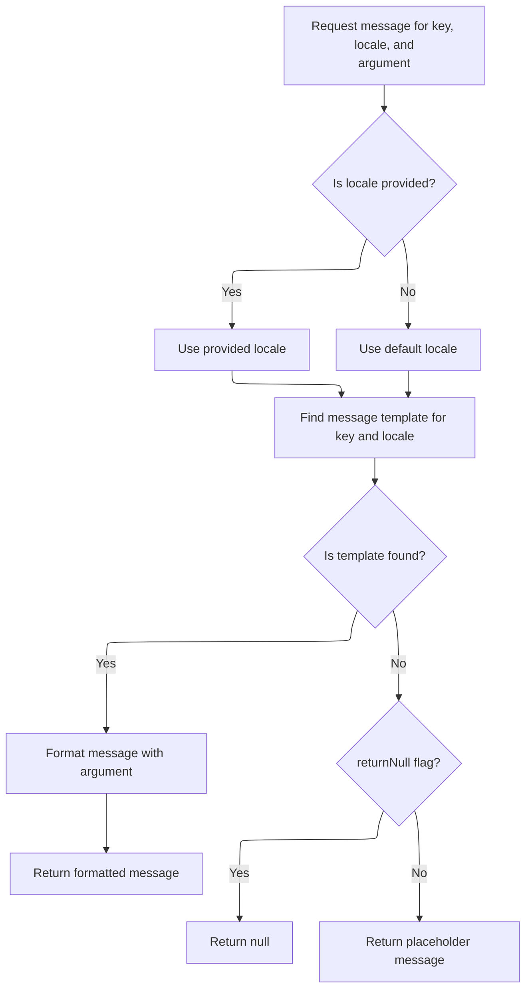
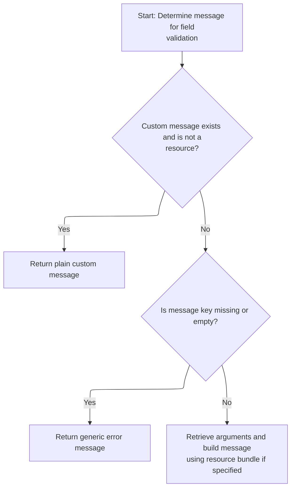
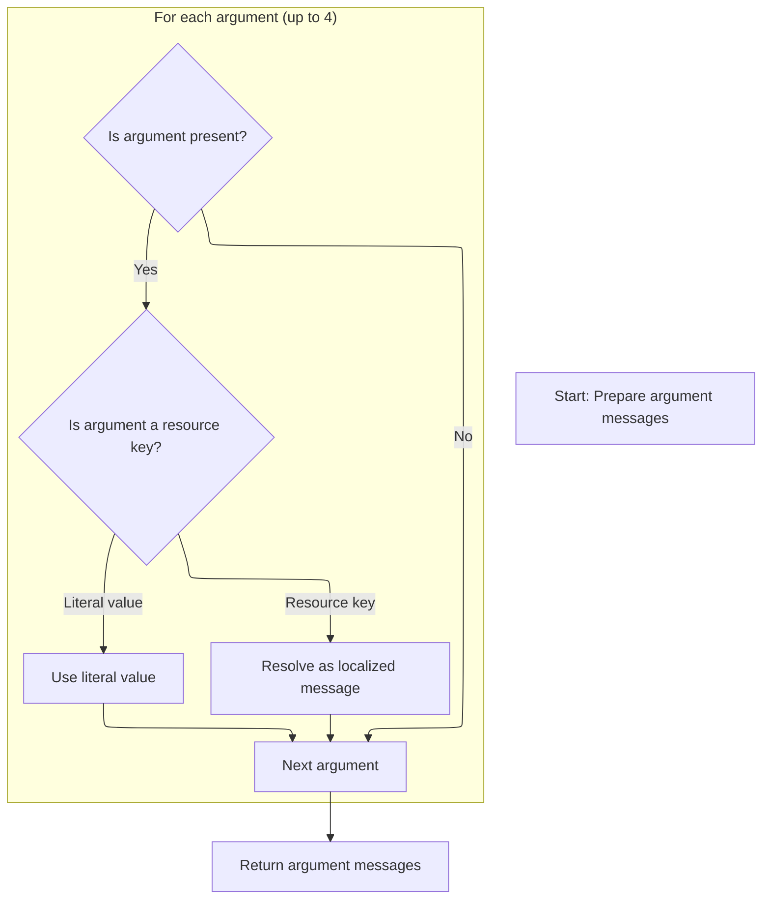
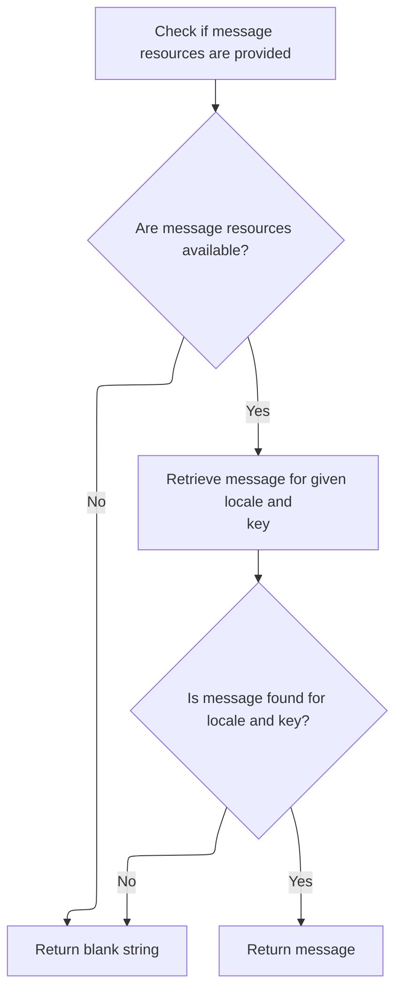
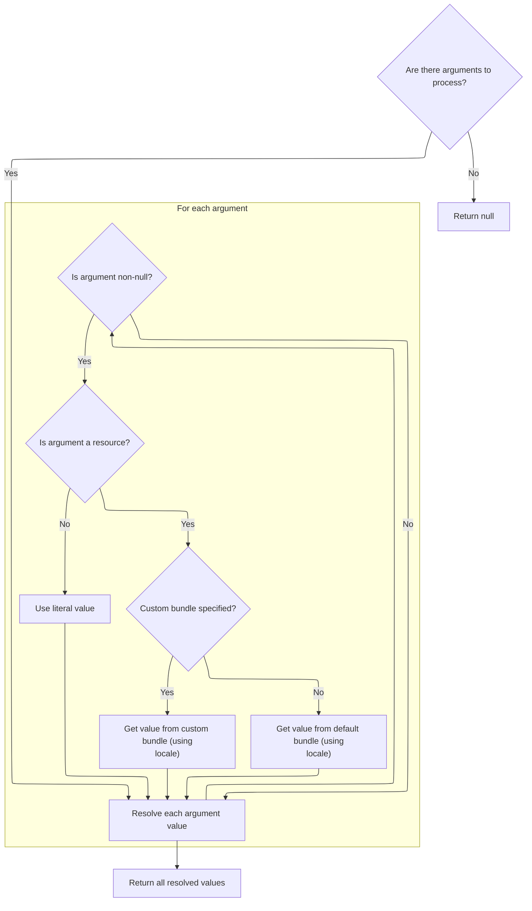

This document outlines how the system validates email addresses entered by users in forms. The process ensures that only properly formatted email addresses are accepted, and provides clear feedback to users when their input does not meet the requirements.

# Email Validation Entry Point

<SwmSnippet path="/core/src/main/java/org/apache/struts/validator/FieldChecks.java" line="1176">

---

In <SwmToken path="core/src/main/java/org/apache/struts/validator/FieldChecks.java" pos="1176:7:7" line-data="    public static boolean validateEmail(Object bean, ValidatorAction va,">`validateEmail`</SwmToken>, we try to extract the value to validate from the bean. If that fails (throws), we immediately call <SwmToken path="core/src/main/java/org/apache/struts/validator/FieldChecks.java" pos="1184:1:1" line-data="            processFailure(errors, field, validator.getFormName(), &quot;email&quot;, e);">`processFailure`</SwmToken> to log the error and add a user-facing error message, then return false to stop further processing.

```java
    public static boolean validateEmail(Object bean, ValidatorAction va,
        Field field, ActionMessages errors, Validator validator,
        HttpServletRequest request) {
        String value = null;

        try {
            value = evaluateBean(bean, field);
        } catch (Exception e) {
            processFailure(errors, field, validator.getFormName(), "email", e);
            return false;
        }

```

---

</SwmSnippet>

## Handling Validation Failures

<SwmSnippet path="/core/src/main/java/org/apache/struts/validator/FieldChecks.java" line="1434">

---

In <SwmToken path="core/src/main/java/org/apache/struts/validator/FieldChecks.java" pos="1434:7:7" line-data="    private static void processFailure(ActionMessages errors, Field field,">`processFailure`</SwmToken>, we build a localized error message for logging using <SwmToken path="core/src/main/java/org/apache/struts/validator/FieldChecks.java" pos="1438:1:3" line-data="            sysmsgs.getMessage(&quot;validation.failed&quot;, validatorName,">`sysmsgs.getMessage`</SwmToken>. This makes sure the log entry is consistent and can be localized. Next, we need <SwmToken path="core/src/main/java/org/apache/struts/validator/Resources.java" pos="117:5:5" line-data="    public static MessageResources getMessageResources(">`MessageResources`</SwmToken> to actually fetch the formatted message string.

```java
    private static void processFailure(ActionMessages errors, Field field,
        String formName, String validatorName, Throwable t) {
        // Log the error
        String logErrorMsg =
            sysmsgs.getMessage("validation.failed", validatorName,
                field.getProperty(), formName, t.toString());

        log.error(logErrorMsg, t);

```

---

</SwmSnippet>

### Formatting Log/Error Messages

<SwmSnippet path="/core/src/main/java/org/apache/struts/util/MessageResources.java" line="355">

---

<SwmToken path="core/src/main/java/org/apache/struts/util/MessageResources.java" pos="355:5:5" line-data="    public String getMessage(Locale locale, String key, Object arg0,">`getMessage`</SwmToken> here just wraps the arguments into an array and delegates to the main method that handles formatting. This keeps the API flexible for different numbers of arguments.

```java
    public String getMessage(Locale locale, String key, Object arg0,
        Object arg1, Object arg2) {
        return this.getMessage(locale, key, new Object[] { arg0, arg1, arg2 });
    }
```

---

</SwmSnippet>

### Message Formatting and Caching



<SwmSnippet path="/core/src/main/java/org/apache/struts/util/MessageResources.java" line="324">

---

<SwmToken path="core/src/main/java/org/apache/struts/util/MessageResources.java" pos="324:5:5" line-data="    public String getMessage(Locale locale, String key, Object arg0) {">`getMessage`</SwmToken> with one argument is just a convenience overload. It wraps the argument and calls the main formatting method, so developers don't have to deal with arrays for simple cases.

```java
    public String getMessage(Locale locale, String key, Object arg0) {
        return this.getMessage(locale, key, new Object[] { arg0 });
    }
```

---

</SwmSnippet>

<SwmSnippet path="/core/src/main/java/org/apache/struts/util/MessageResources.java" line="286">

---

<SwmToken path="core/src/main/java/org/apache/struts/util/MessageResources.java" pos="286:5:5" line-data="    public String getMessage(Locale locale, String key, Object[] args) {">`getMessage`</SwmToken> (with Object\[\] args) does the actual work: it looks up or creates a cached <SwmToken path="core/src/main/java/org/apache/struts/util/MessageResources.java" pos="287:5:5" line-data="        // Cache MessageFormat instances as they are accessed">`MessageFormat`</SwmToken> for the locale/key, handles missing messages with a placeholder, and formats the message with the provided arguments. This keeps message formatting fast and consistent.

```java
    public String getMessage(Locale locale, String key, Object[] args) {
        // Cache MessageFormat instances as they are accessed
        if (locale == null) {
            locale = defaultLocale;
        }

        MessageFormat format = null;
        String formatKey = messageKey(locale, key);

        synchronized (formats) {
            format = (MessageFormat) formats.get(formatKey);

            if (format == null) {
                String formatString = getMessage(locale, key);

                if (formatString == null) {
                    return returnNull ? null : ("???" + formatKey + "???");
                }

                format = new MessageFormat(escape(formatString));
                format.setLocale(locale);
                formats.put(formatKey, format);
            }
        }

        return format.format(args);
    }
```

---

</SwmSnippet>

### User-Facing Error Handling

<SwmSnippet path="/core/src/main/java/org/apache/struts/validator/FieldChecks.java" line="1443">

---

Back in <SwmToken path="core/src/main/java/org/apache/struts/validator/FieldChecks.java" pos="1184:1:1" line-data="            processFailure(errors, field, validator.getFormName(), &quot;email&quot;, e);">`processFailure`</SwmToken>, after logging, we fetch a generic system error message (localized) and add it to the errors collection for the user. We need <SwmToken path="core/src/main/java/org/apache/struts/validator/Resources.java" pos="117:5:5" line-data="    public static MessageResources getMessageResources(">`MessageResources`</SwmToken> again to get the right message string.

```java
        // Add general "system error" message to show to the user
        String userErrorMsg = sysmsgs.getMessage("system.error");

        errors.add(field.getKey(), new ActionMessage(userErrorMsg, false));
    }
```

---

</SwmSnippet>

<SwmSnippet path="/core/src/main/java/org/apache/struts/util/MessageResources.java" line="196">

---

<SwmToken path="core/src/main/java/org/apache/struts/util/MessageResources.java" pos="196:5:10" line-data="    public String getMessage(String key) {">`getMessage(String key)`</SwmToken> is just a shortcut for fetching a static message with no arguments and default locale. It delegates to the main method.

```java
    public String getMessage(String key) {
        return this.getMessage((Locale) null, key, null);
    }
```

---

</SwmSnippet>

## Email Format Validation and Error Reporting

<SwmSnippet path="/core/src/main/java/org/apache/struts/validator/FieldChecks.java" line="1188">

---

After returning from <SwmToken path="core/src/main/java/org/apache/struts/validator/FieldChecks.java" pos="1184:1:1" line-data="            processFailure(errors, field, validator.getFormName(), &quot;email&quot;, e);">`processFailure`</SwmToken>, <SwmToken path="core/src/main/java/org/apache/struts/validator/FieldChecks.java" pos="1176:7:7" line-data="    public static boolean validateEmail(Object bean, ValidatorAction va,">`validateEmail`</SwmToken> checks if the value is blank or not a valid email. If so, it adds a localized error message using <SwmToken path="core/src/main/java/org/apache/struts/validator/FieldChecks.java" pos="1191:1:3" line-data="                Resources.getActionMessage(validator, request, va, field));">`Resources.getActionMessage`</SwmToken>, then returns false to indicate validation failed.

```java
        if (!GenericValidator.isBlankOrNull(value)
            && !GenericValidator.isEmail(value)) {
            errors.add(field.getKey(),
                Resources.getActionMessage(validator, request, va, field));

            return false;
        } else {
            return true;
        }
    }
```

---

</SwmSnippet>

# Building the Action Message



<SwmSnippet path="/core/src/main/java/org/apache/struts/validator/Resources.java" line="365">

---

In <SwmToken path="core/src/main/java/org/apache/struts/validator/Resources.java" pos="365:7:7" line-data="    public static ActionMessage getActionMessage(Validator validator,">`getActionMessage`</SwmToken>, we figure out the message key and bundle, check if the message is a resource, and then fetch the right <SwmToken path="core/src/main/java/org/apache/struts/validator/Resources.java" pos="390:1:1" line-data="        MessageResources messages =">`MessageResources`</SwmToken> instance for localization. Next, we need to actually retrieve the resource bundle.

```java
    public static ActionMessage getActionMessage(Validator validator,
        HttpServletRequest request, ValidatorAction va, Field field) {
        Msg msg = field.getMessage(va.getName());

        if ((msg != null) && !msg.isResource()) {
            return new ActionMessage(msg.getKey(), false);
        }

        String msgKey = null;
        String msgBundle = null;

        if (msg == null) {
            msgKey = va.getMsg();
        } else {
            msgKey = msg.getKey();
            msgBundle = msg.getBundle();
        }

        if ((msgKey == null) || (msgKey.length() == 0)) {
            return new ActionMessage("??? " + va.getName() + "."
                + field.getProperty() + " ???", false);
        }

        ServletContext application =
            (ServletContext) validator.getParameterValue(SERVLET_CONTEXT_PARAM);
        MessageResources messages =
            getMessageResources(application, request, msgBundle);
```

---

</SwmSnippet>

<SwmSnippet path="/core/src/main/java/org/apache/struts/validator/Resources.java" line="117">

---

<SwmToken path="core/src/main/java/org/apache/struts/validator/Resources.java" pos="117:7:7" line-data="    public static MessageResources getMessageResources(">`getMessageResources`</SwmToken> tries to find the right <SwmToken path="core/src/main/java/org/apache/struts/validator/Resources.java" pos="117:5:5" line-data="    public static MessageResources getMessageResources(">`MessageResources`</SwmToken> by checking the request, then the application with a module prefix, then just the bundle key. This fallback logic makes sure resources are found no matter where they're stored in a modular setup.

```java
    public static MessageResources getMessageResources(
        ServletContext application, HttpServletRequest request, String bundle) {
        if (bundle == null) {
            bundle = Globals.MESSAGES_KEY;
        }

        MessageResources resources =
            (MessageResources) request.getAttribute(bundle);

        if (resources == null) {
            ModuleConfig moduleConfig =
                ModuleUtils.getInstance().getModuleConfig(request, application);

            resources =
                (MessageResources) application.getAttribute(bundle
                    + moduleConfig.getPrefix());
        }

        if (resources == null) {
            resources = (MessageResources) application.getAttribute(bundle);
        }

        if (resources == null) {
            throw new NullPointerException(
                "No message resources found for bundle: " + bundle);
        }

        return resources;
    }
```

---

</SwmSnippet>

<SwmSnippet path="/core/src/main/java/org/apache/struts/validator/Resources.java" line="392">

---

After getting <SwmToken path="core/src/main/java/org/apache/struts/validator/Resources.java" pos="117:5:5" line-data="    public static MessageResources getMessageResources(">`MessageResources`</SwmToken>, we grab the user's locale and fetch the argument list for the message. Next, we call <SwmToken path="core/src/main/java/org/apache/struts/validator/Resources.java" pos="394:11:11" line-data="        Arg[] args = field.getArgs(va.getName());">`getArgs`</SwmToken> to build the argument strings for the error message.

```java
        Locale locale = RequestUtils.getUserLocale(request, null);

        Arg[] args = field.getArgs(va.getName());
```

---

</SwmSnippet>

## Preparing Message Arguments



<SwmSnippet path="/core/src/main/java/org/apache/struts/validator/Resources.java" line="420">

---

<SwmToken path="core/src/main/java/org/apache/struts/validator/Resources.java" pos="420:9:9" line-data="    public static String[] getArgs(String actionName,">`getArgs`</SwmToken> grabs up to 4 arguments from the field for the action, localizes them if needed, and returns the array. This is hardcoded to 4 for simplicity. Next, we need to resolve the actual argument values for the message.

```java
    public static String[] getArgs(String actionName,
        MessageResources messages, Locale locale, Field field) {
        String[] argMessages = new String[4];

        Arg[] args =
            new Arg[] {
                field.getArg(actionName, 0), field.getArg(actionName, 1),
                field.getArg(actionName, 2), field.getArg(actionName, 3)
            };

        for (int i = 0; i < args.length; i++) {
            if (args[i] == null) {
                continue;
            }

            if (args[i].isResource()) {
                argMessages[i] = getMessage(messages, locale, args[i].getKey());
            } else {
                argMessages[i] = args[i].getKey();
            }
        }

        return argMessages;
    }
```

---

</SwmSnippet>

## Resolving Argument Strings



<SwmSnippet path="/core/src/main/java/org/apache/struts/validator/Resources.java" line="231">

---

<SwmToken path="core/src/main/java/org/apache/struts/validator/Resources.java" pos="231:7:7" line-data="    public static String getMessage(MessageResources messages, Locale locale,">`getMessage`</SwmToken> here fetches a localized string for a key from <SwmToken path="core/src/main/java/org/apache/struts/validator/Resources.java" pos="231:9:9" line-data="    public static String getMessage(MessageResources messages, Locale locale,">`MessageResources`</SwmToken>. If nothing is found, it returns an empty string. We call the underlying <SwmToken path="core/src/main/java/org/apache/struts/validator/Resources.java" pos="231:9:9" line-data="    public static String getMessage(MessageResources messages, Locale locale,">`MessageResources`</SwmToken> to do the actual lookup.

```java
    public static String getMessage(MessageResources messages, Locale locale,
        String key) {
        String message = null;

        if (messages != null) {
            message = messages.getMessage(locale, key);
        }

        return (message == null) ? "" : message;
    }
```

---

</SwmSnippet>

<SwmSnippet path="/core/src/main/java/org/apache/struts/util/MessageResources.java" line="218">

---

<SwmToken path="core/src/main/java/org/apache/struts/util/MessageResources.java" pos="218:5:15" line-data="    public String getMessage(String key, Object arg0) {">`getMessage(String key, Object arg0)`</SwmToken> is just a shortcut for calling the main method with a single argument and default locale. It keeps the API simple.

```java
    public String getMessage(String key, Object arg0) {
        return this.getMessage((Locale) null, key, arg0);
    }
```

---

</SwmSnippet>

## Resolving Argument Values

<SwmSnippet path="/core/src/main/java/org/apache/struts/validator/Resources.java" line="395">

---

After getting the Arg objects, we call <SwmToken path="core/src/main/java/org/apache/struts/validator/Resources.java" pos="396:1:1" line-data="            getArgValues(application, request, messages, locale, args);">`getArgValues`</SwmToken> to turn them into actual strings (localized if needed) for the message. This step ensures the message template gets the right values.

```java
        String[] argValues =
            getArgValues(application, request, messages, locale, args);

```

---

</SwmSnippet>

## Finalizing Argument Strings



<SwmSnippet path="/core/src/main/java/org/apache/struts/validator/Resources.java" line="455">

---

In <SwmToken path="core/src/main/java/org/apache/struts/validator/Resources.java" pos="455:9:9" line-data="    private static String[] getArgValues(ServletContext application,">`getArgValues`</SwmToken>, we loop through the Arg objects, and for each resource-based Arg, we fetch its value from the right <SwmToken path="core/src/main/java/org/apache/struts/validator/Resources.java" pos="456:6:6" line-data="        HttpServletRequest request, MessageResources defaultMessages,">`MessageResources`</SwmToken> (using the bundle if set). Static args just use their key. Next, we need to actually fetch the localized string for each Arg.

```java
    private static String[] getArgValues(ServletContext application,
        HttpServletRequest request, MessageResources defaultMessages,
        Locale locale, Arg[] args) {
        if ((args == null) || (args.length == 0)) {
            return null;
        }

        String[] values = new String[args.length];

        for (int i = 0; i < args.length; i++) {
            if (args[i] != null) {
                if (args[i].isResource()) {
                    MessageResources messages = defaultMessages;

                    if (args[i].getBundle() != null) {
                        messages =
                            getMessageResources(application, request,
                                args[i].getBundle());
                    }

```

---

</SwmSnippet>

<SwmSnippet path="/core/src/main/java/org/apache/struts/validator/Resources.java" line="475">

---

After resolving bundles, we call <SwmToken path="core/src/main/java/org/apache/struts/validator/Resources.java" pos="475:8:10" line-data="                    values[i] = messages.getMessage(locale, args[i].getKey());">`messages.getMessage`</SwmToken> for each resource-based Arg to get the localized string. Static args just use their key. This wraps up the argument value resolution.

```java
                    values[i] = messages.getMessage(locale, args[i].getKey());
                } else {
                    values[i] = args[i].getKey();
                }
            }
        }

        return values;
    }
```

---

</SwmSnippet>

## Constructing the <SwmToken path="core/src/main/java/org/apache/struts/validator/FieldChecks.java" pos="1446:14:14" line-data="        errors.add(field.getKey(), new ActionMessage(userErrorMsg, false));">`ActionMessage`</SwmToken>

<SwmSnippet path="/core/src/main/java/org/apache/struts/validator/Resources.java" line="398">

---

After getting the argument values, we either create an <SwmToken path="core/src/main/java/org/apache/struts/validator/Resources.java" pos="398:1:1" line-data="        ActionMessage actionMessage = null;">`ActionMessage`</SwmToken> with the key and args (if no bundle), or we resolve the message string right away and wrap it in an <SwmToken path="core/src/main/java/org/apache/struts/validator/Resources.java" pos="398:1:1" line-data="        ActionMessage actionMessage = null;">`ActionMessage`</SwmToken>. This is the last step before returning the message for display.

```java
        ActionMessage actionMessage = null;

        if (msgBundle == null) {
            actionMessage = new ActionMessage(msgKey, argValues);
        } else {
            String message = messages.getMessage(locale, msgKey, argValues);

            actionMessage = new ActionMessage(message, false);
        }

        return actionMessage;
    }
```

---

</SwmSnippet>

&nbsp;

*This is an auto-generated document by Swimm 🌊 and has not yet been verified by a human*

<SwmMeta version="3.0.0" repo-id="Z2l0aHViJTNBJTNBc3RydXRzMSUzQSUzQVN3aW1tLURlbW8=" repo-name="struts1"><sup>Powered by [Swimm](https://app.swimm.io/)</sup></SwmMeta>
