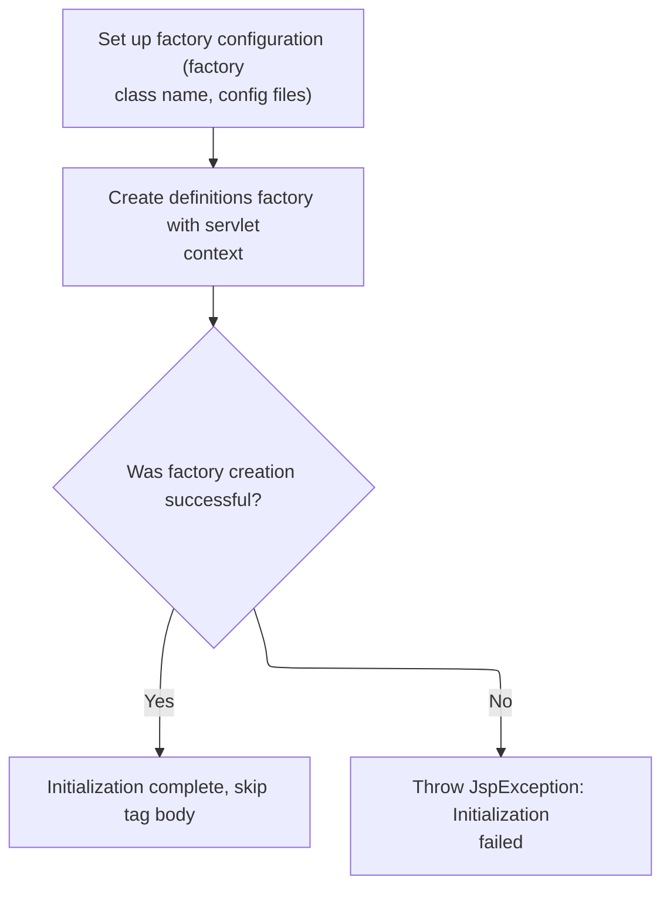

This document describes how the system ensures a definitions factory is available to manage reusable page layouts and definitions for JSP pages. The flow checks for an existing factory and creates one if necessary, supporting consistent use of Tiles definitions.

# Checking for an Existing Definitions Factory

<SwmSnippet path="/tiles/src/main/java/org/apache/struts/tiles/taglib/InitDefinitionsTag.java" line="76">

---

In <SwmToken path="tiles/src/main/java/org/apache/struts/tiles/taglib/InitDefinitionsTag.java" pos="76:5:5" line-data="  public int doStartTag() throws JspException">`doStartTag`</SwmToken>, we try to grab an existing <SwmToken path="tiles/src/main/java/org/apache/struts/tiles/taglib/InitDefinitionsTag.java" pos="78:1:1" line-data="  DefinitionsFactory factory =">`DefinitionsFactory`</SwmToken> using the current request and servlet context. If it's already there, we bail out early and skip the tag body. If not, we need to dig deeper (which is why we call into <SwmToken path="core/src/main/java/org/apache/struts/chain/contexts/ServletActionContext.java" pos="39:4:4" line-data="public class ServletActionContext extends WebActionContext {">`ServletActionContext`</SwmToken> next) to get the right context for factory lookup.

```java
  public int doStartTag() throws JspException
  {
  DefinitionsFactory factory =
      TilesUtil.getDefinitionsFactory(pageContext.getRequest(),
          pageContext.getServletContext());
  if(factory != null )
    return SKIP_BODY;

```

---

</SwmSnippet>

## Extracting the HTTP Request from the Context

<SwmSnippet path="/core/src/main/java/org/apache/struts/chain/contexts/ServletActionContext.java" line="94">

---

<SwmToken path="core/src/main/java/org/apache/struts/chain/contexts/ServletActionContext.java" pos="94:5:5" line-data="    public HttpServletRequest getRequest() {">`getRequest`</SwmToken> just pulls the <SwmToken path="core/src/main/java/org/apache/struts/chain/contexts/ServletActionContext.java" pos="94:3:3" line-data="    public HttpServletRequest getRequest() {">`HttpServletRequest`</SwmToken> from the current <SwmToken path="core/src/main/java/org/apache/struts/chain/contexts/ServletActionContext.java" pos="67:3:3" line-data="    protected ServletWebContext servletWebContext() {">`ServletWebContext`</SwmToken>. We need this to pass the right context to Tiles utilities, so they can work with the actual HTTP request.

```java
    public HttpServletRequest getRequest() {
        return servletWebContext().getRequest();
    }
```

---

</SwmSnippet>

<SwmSnippet path="/core/src/main/java/org/apache/struts/chain/contexts/ServletActionContext.java" line="67">

---

<SwmToken path="core/src/main/java/org/apache/struts/chain/contexts/ServletActionContext.java" pos="67:5:5" line-data="    protected ServletWebContext servletWebContext() {">`servletWebContext`</SwmToken> grabs the base context and casts it to <SwmToken path="core/src/main/java/org/apache/struts/chain/contexts/ServletActionContext.java" pos="67:3:3" line-data="    protected ServletWebContext servletWebContext() {">`ServletWebContext`</SwmToken> without checking. If the context isn't what we expect, things blow up. This is just to get access to servlet-specific methods.

```java
    protected ServletWebContext servletWebContext() {
        return (ServletWebContext) this.getBaseContext();
    }
```

---

</SwmSnippet>

## Creating a New Definitions Factory if Needed



<SwmSnippet path="/tiles/src/main/java/org/apache/struts/tiles/taglib/InitDefinitionsTag.java" line="84">

---

Back in `InitDefinitionsTag.doStartTag`, if no factory was found, we set up a <SwmToken path="tiles/src/main/java/org/apache/struts/tiles/taglib/InitDefinitionsTag.java" pos="84:1:1" line-data="  DefinitionsFactoryConfig factoryConfig = new DefinitionsFactoryConfig();">`DefinitionsFactoryConfig`</SwmToken> with the classname and filename, then call <SwmToken path="tiles/src/main/java/org/apache/struts/tiles/taglib/InitDefinitionsTag.java" pos="90:5:5" line-data="    factory = TilesUtil.createDefinitionsFactory(">`TilesUtil`</SwmToken> to actually create the factory. This is where the factory gets initialized if it wasn't already. We always return <SwmToken path="tiles/src/main/java/org/apache/struts/tiles/taglib/InitDefinitionsTag.java" pos="98:3:3" line-data="  return SKIP_BODY;">`SKIP_BODY`</SwmToken> to keep JSP processing consistent.

```java
  DefinitionsFactoryConfig factoryConfig = new DefinitionsFactoryConfig();
  factoryConfig.setFactoryClassname( classname );
  factoryConfig.setDefinitionConfigFiles( filename );

  try
    {
    factory = TilesUtil.createDefinitionsFactory(
        pageContext.getServletContext(), factoryConfig);
    }
   catch( DefinitionsFactoryException ex )
      {
      ex.printStackTrace();
      throw new JspException( ex );
      }
  return SKIP_BODY;
  }
```

---

</SwmSnippet>

# Delegating Factory Creation to Implementation

<SwmSnippet path="/tiles/src/main/java/org/apache/struts/tiles/TilesUtil.java" line="178">

---

<SwmToken path="tiles/src/main/java/org/apache/struts/tiles/TilesUtil.java" pos="178:7:7" line-data="    public static DefinitionsFactory createDefinitionsFactory(">`createDefinitionsFactory`</SwmToken> just hands off the work to <SwmToken path="tiles/src/main/java/org/apache/struts/tiles/TilesUtil.java" pos="182:3:3" line-data="        return tilesUtilImpl.createDefinitionsFactory(servletContext, factoryConfig);">`tilesUtilImpl`</SwmToken>. This lets the actual implementation be swapped or customized without touching the static <SwmToken path="tiles/src/main/java/org/apache/struts/tiles/taglib/InitDefinitionsTag.java" pos="79:1:1" line-data="      TilesUtil.getDefinitionsFactory(pageContext.getRequest(),">`TilesUtil`</SwmToken> API.

```java
    public static DefinitionsFactory createDefinitionsFactory(
        ServletContext servletContext,
        DefinitionsFactoryConfig factoryConfig)
        throws DefinitionsFactoryException {
        return tilesUtilImpl.createDefinitionsFactory(servletContext, factoryConfig);
    }
```

---

</SwmSnippet>

# Instantiating the Factory Implementation

<SwmSnippet path="/tiles/src/main/java/org/apache/struts/tiles/TilesUtilImpl.java" line="172">

---

In <SwmToken path="tiles/src/main/java/org/apache/struts/tiles/TilesUtilImpl.java" pos="172:5:5" line-data="    public DefinitionsFactory createDefinitionsFactory(">`createDefinitionsFactory`</SwmToken>, we dynamically instantiate the factory class specified in the config. This lets us support custom or extended factory implementations, not just the default one.

```java
    public DefinitionsFactory createDefinitionsFactory(
        ServletContext servletContext,
        DefinitionsFactoryConfig factoryConfig)
        throws DefinitionsFactoryException {

        // Create configurable factory
        DefinitionsFactory factory =
            createDefinitionFactoryInstance(factoryConfig.getFactoryClassname());

```

---

</SwmSnippet>

## Loading the Factory Class by Name

<SwmSnippet path="/tiles/src/main/java/org/apache/struts/tiles/TilesUtilImpl.java" line="197">

---

In <SwmToken path="tiles/src/main/java/org/apache/struts/tiles/TilesUtilImpl.java" pos="197:5:5" line-data="    protected DefinitionsFactory createDefinitionFactoryInstance(String classname)">`createDefinitionFactoryInstance`</SwmToken>, we load and instantiate the factory class by name using the Struts utility. This is where the actual class gets resolved and created, so custom implementations can be plugged in.

```java
    protected DefinitionsFactory createDefinitionFactoryInstance(String classname)
        throws DefinitionsFactoryException {

        try {
            Class factoryClass = RequestUtils.applicationClass(classname);
            Object factory = factoryClass.newInstance();

```

---

</SwmSnippet>

### Instantiating the Factory Object

See <SwmLink doc-title="Creating and Initializing Dynamic Forms">[Creating and Initializing Dynamic Forms](/.swm/creating-and-initializing-dynamic-forms.gyc0qb0p.sw.md)</SwmLink>

### Wrapping Legacy Factory Implementations

<SwmSnippet path="/tiles/src/main/java/org/apache/struts/tiles/TilesUtilImpl.java" line="204">

---

Back in <SwmToken path="tiles/src/main/java/org/apache/struts/tiles/TilesUtilImpl.java" pos="179:1:1" line-data="            createDefinitionFactoryInstance(factoryConfig.getFactoryClassname());">`createDefinitionFactoryInstance`</SwmToken>, after instantiating the factory, we check if it's using the old interface and wrap it if needed. This keeps older custom factories working without breaking the rest of the flow.

```java
            // Backward compatibility : if factory classes implements old interface,
            // provide appropriate wrapper
            if (factory instanceof ComponentDefinitionsFactory) {
                factory =
                    new ComponentDefinitionsFactoryWrapper(
                        (ComponentDefinitionsFactory) factory);
            }
            return (DefinitionsFactory) factory;

        } catch (ClassCastException ex) { // Bad classname
            throw new DefinitionsFactoryException(
                "Error - createDefinitionsFactory : Factory class '"
                    + classname
                    + " must implement 'TilesDefinitionsFactory'.",
                ex);

        } catch (ClassNotFoundException ex) { // Bad classname
            throw new DefinitionsFactoryException(
                "Error - createDefinitionsFactory : Bad class name '"
                    + classname
                    + "'.",
                ex);

        } catch (InstantiationException ex) { // Bad constructor or error
            throw new DefinitionsFactoryException(ex);

        } catch (IllegalAccessException ex) {
            throw new DefinitionsFactoryException(ex);
        }
    }
```

---

</SwmSnippet>

## Initializing and Registering the Factory

<SwmSnippet path="/tiles/src/main/java/org/apache/struts/tiles/TilesUtilImpl.java" line="181">

---

Back in <SwmToken path="tiles/src/main/java/org/apache/struts/tiles/taglib/InitDefinitionsTag.java" pos="90:7:7" line-data="    factory = TilesUtil.createDefinitionsFactory(">`createDefinitionsFactory`</SwmToken>, after getting the factory instance, we initialize it with the config and servlet context, then register it so other parts of the app (like JSP tags) can access it.

```java
        factory.init(factoryConfig, servletContext);

        // Make factory accessible from jsp tags (push it in appropriate context)
        makeDefinitionsFactoryAccessible(factory, servletContext);
        return factory;
    }
```

---

</SwmSnippet>

&nbsp;

*This is an auto-generated document by Swimm 🌊 and has not yet been verified by a human*

<SwmMeta version="3.0.0" repo-id="Z2l0aHViJTNBJTNBc3RydXRzMSUzQSUzQVN3aW1tLURlbW8=" repo-name="struts1"><sup>Powered by [Swimm](https://app.swimm.io/)</sup></SwmMeta>
