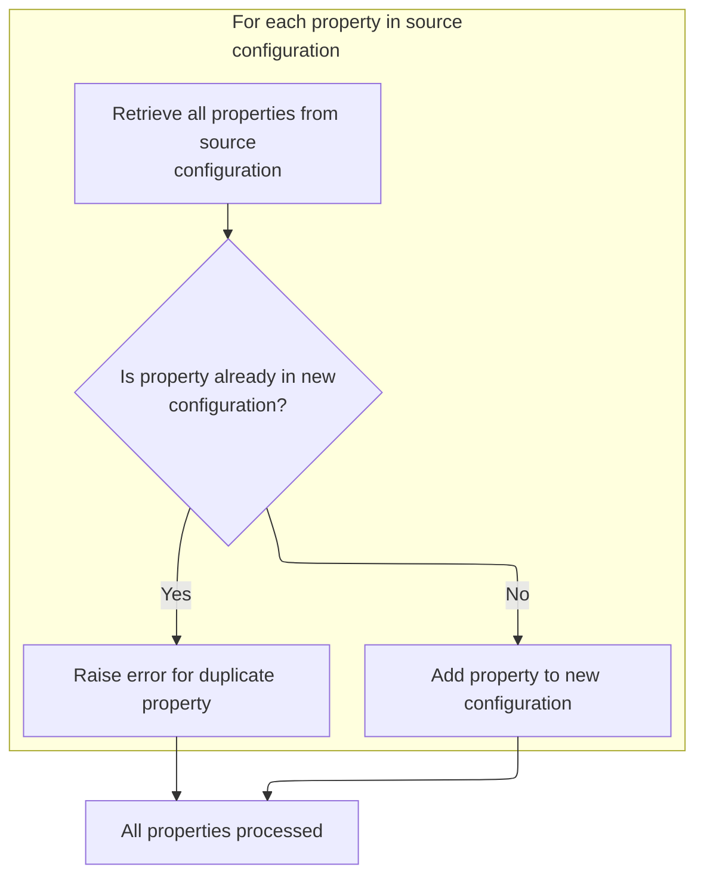

```mermaid
%%{init: {"flowchart": {"defaultRenderer": "elk"}} }%%
flowchart TD
  node1["Does the form bean config extend another
(ancestor)?"] --> node2{"Ancestor specified?"}
  click node1 openCode "core/src/main/java/org/apache/struts/action/ActionServlet.java:1006:1008"
  node2 -->|"No"| node6["Return bean config unchanged"]
  click node6 openCode "core/src/main/java/org/apache/struts/action/ActionServlet.java:1010:1011"
  node2 -->|"Yes"| node3{"Is ancestor bean config found?"}
  click node2 openCode "core/src/main/java/org/apache/struts/action/ActionServlet.java:1014:1019"
  node3 -->|"No"| node8["Throw exception: ancestor not found"]
  click node8 openCode "core/src/main/java/org/apache/struts/action/ActionServlet.java:1017:1019"
  node3 -->|"Yes"| node4{"Does bean class match ancestor's class?"}
  click node3 openCode "core/src/main/java/org/apache/struts/action/ActionServlet.java:1022:1025"
  node4 -->|"Yes"| node6
  node4 -->|"No"| node5["Create new bean config of correct class
and copy properties"]
  click node5 openCode "core/src/main/java/org/apache/struts/action/ActionServlet.java:1026:1044"
  subgraph loop1["For each property in the bean config"]
    node5 --> node7["Add property to new bean config"]
    click node7 openCode "core/src/main/java/org/apache/struts/action/ActionServlet.java:1039:1041"
    node7 --> node5
  end
  node5 --> node9{"Creation exception?"}
  node9 -->|"Yes"| node10["Handle creation exception"]
  click node10 openCode "core/src/main/java/org/apache/struts/action/ActionServlet.java:1042:1044"
  node9 -->|"No"| node11["Replace old bean config with new one"]
  click node11 openCode "core/src/main/java/org/apache/struts/action/ActionServlet.java:1046:1049"
  node10 --> node6
  node11 --> node6
classDef HeadingStyle fill:#777777,stroke:#333,stroke-width:2px;

%% Swimm:
%% %%{init: {"flowchart": {"defaultRenderer": "elk"}} }%%
%% flowchart TD
%%   node1["Does the form bean config extend another
%% (ancestor)?"] --> node2{"Ancestor specified?"}
%%   click node1 openCode "<SwmPath>[core/…/action/ActionServlet.java](core/src/main/java/org/apache/struts/action/ActionServlet.java)</SwmPath>:1006:1008"
%%   node2 -->|"No"| node6["Return bean config unchanged"]
%%   click node6 openCode "<SwmPath>[core/…/action/ActionServlet.java](core/src/main/java/org/apache/struts/action/ActionServlet.java)</SwmPath>:1010:1011"
%%   node2 -->|"Yes"| node3{"Is ancestor bean config found?"}
%%   click node2 openCode "<SwmPath>[core/…/action/ActionServlet.java](core/src/main/java/org/apache/struts/action/ActionServlet.java)</SwmPath>:1014:1019"
%%   node3 -->|"No"| node8["Throw exception: ancestor not found"]
%%   click node8 openCode "<SwmPath>[core/…/action/ActionServlet.java](core/src/main/java/org/apache/struts/action/ActionServlet.java)</SwmPath>:1017:1019"
%%   node3 -->|"Yes"| node4{"Does bean class match ancestor's class?"}
%%   click node3 openCode "<SwmPath>[core/…/action/ActionServlet.java](core/src/main/java/org/apache/struts/action/ActionServlet.java)</SwmPath>:1022:1025"
%%   node4 -->|"Yes"| node6
%%   node4 -->|"No"| node5["Create new bean config of correct class
%% and copy properties"]
%%   click node5 openCode "<SwmPath>[core/…/action/ActionServlet.java](core/src/main/java/org/apache/struts/action/ActionServlet.java)</SwmPath>:1026:1044"
%%   subgraph loop1["For each property in the bean config"]
%%     node5 --> node7["Add property to new bean config"]
%%     click node7 openCode "<SwmPath>[core/…/action/ActionServlet.java](core/src/main/java/org/apache/struts/action/ActionServlet.java)</SwmPath>:1039:1041"
%%     node7 --> node5
%%   end
%%   node5 --> node9{"Creation exception?"}
%%   node9 -->|"Yes"| node10["Handle creation exception"]
%%   click node10 openCode "<SwmPath>[core/…/action/ActionServlet.java](core/src/main/java/org/apache/struts/action/ActionServlet.java)</SwmPath>:1042:1044"
%%   node9 -->|"No"| node11["Replace old bean config with new one"]
%%   click node11 openCode "<SwmPath>[core/…/action/ActionServlet.java](core/src/main/java/org/apache/struts/action/ActionServlet.java)</SwmPath>:1046:1049"
%%   node10 --> node6
%%   node11 --> node6
%% classDef HeadingStyle fill:#777777,stroke:#333,stroke-width:2px;
```

This document describes how form bean configurations are subclassed and updated to ensure all relevant properties are included. When a form bean configuration extends another, the system checks for the ancestor, verifies class compatibility, and creates a new bean config if needed. Properties and form property configs are transferred, and the module configuration is updated to reflect the changes.

```mermaid
flowchart TD
  node1["Ensuring Correct FormBeanConfig
Subclassing
(Ensuring Correct FormBeanConfig Subclassing)"]:::HeadingStyle
  click node1 goToHeading "Ensuring Correct FormBeanConfig Subclassing"
  node1 --> node2{"Does bean config extend another?
(Ensuring Correct FormBeanConfig Subclassing)"}:::HeadingStyle
  click node2 goToHeading "Ensuring Correct FormBeanConfig Subclassing"
  node2 -->|"No"| node6["Replacing the Old BeanConfig"]:::HeadingStyle
  click node6 goToHeading "Replacing the Old BeanConfig"
  node2 -->|"Yes"| node3{"Is ancestor config found?
(Ensuring Correct FormBeanConfig Subclassing)"}:::HeadingStyle
  click node3 goToHeading "Ensuring Correct FormBeanConfig Subclassing"
  node3 -->|"No"| node6
  node3 -->|"Yes"| node4{"Does bean config class match ancestor's
class?
(Ensuring Correct FormBeanConfig Subclassing)"}:::HeadingStyle
  click node4 goToHeading "Ensuring Correct FormBeanConfig Subclassing"
  node4 -->|"Yes"| node6
  node4 -->|"No"| node5["Copying BeanConfig Properties"]:::HeadingStyle
  click node5 goToHeading "Copying BeanConfig Properties"
  node5 --> node6
classDef HeadingStyle fill:#777777,stroke:#333,stroke-width:2px;

%% Swimm:
%% flowchart TD
%%   node1["Ensuring Correct <SwmToken path="core/src/main/java/org/apache/struts/action/ActionServlet.java" pos="1003:3:3" line-data="    protected FormBeanConfig processFormBeanConfigClass(">`FormBeanConfig`</SwmToken>
%% Subclassing
%% (Ensuring Correct <SwmToken path="core/src/main/java/org/apache/struts/action/ActionServlet.java" pos="1003:3:3" line-data="    protected FormBeanConfig processFormBeanConfigClass(">`FormBeanConfig`</SwmToken> Subclassing)"]:::HeadingStyle
%%   click node1 goToHeading "Ensuring Correct <SwmToken path="core/src/main/java/org/apache/struts/action/ActionServlet.java" pos="1003:3:3" line-data="    protected FormBeanConfig processFormBeanConfigClass(">`FormBeanConfig`</SwmToken> Subclassing"
%%   node1 --> node2{"Does bean config extend another?
%% (Ensuring Correct <SwmToken path="core/src/main/java/org/apache/struts/action/ActionServlet.java" pos="1003:3:3" line-data="    protected FormBeanConfig processFormBeanConfigClass(">`FormBeanConfig`</SwmToken> Subclassing)"}:::HeadingStyle
%%   click node2 goToHeading "Ensuring Correct <SwmToken path="core/src/main/java/org/apache/struts/action/ActionServlet.java" pos="1003:3:3" line-data="    protected FormBeanConfig processFormBeanConfigClass(">`FormBeanConfig`</SwmToken> Subclassing"
%%   node2 -->|"No"| node6["Replacing the Old BeanConfig"]:::HeadingStyle
%%   click node6 goToHeading "Replacing the Old BeanConfig"
%%   node2 -->|"Yes"| node3{"Is ancestor config found?
%% (Ensuring Correct <SwmToken path="core/src/main/java/org/apache/struts/action/ActionServlet.java" pos="1003:3:3" line-data="    protected FormBeanConfig processFormBeanConfigClass(">`FormBeanConfig`</SwmToken> Subclassing)"}:::HeadingStyle
%%   click node3 goToHeading "Ensuring Correct <SwmToken path="core/src/main/java/org/apache/struts/action/ActionServlet.java" pos="1003:3:3" line-data="    protected FormBeanConfig processFormBeanConfigClass(">`FormBeanConfig`</SwmToken> Subclassing"
%%   node3 -->|"No"| node6
%%   node3 -->|"Yes"| node4{"Does bean config class match ancestor's
%% class?
%% (Ensuring Correct <SwmToken path="core/src/main/java/org/apache/struts/action/ActionServlet.java" pos="1003:3:3" line-data="    protected FormBeanConfig processFormBeanConfigClass(">`FormBeanConfig`</SwmToken> Subclassing)"}:::HeadingStyle
%%   click node4 goToHeading "Ensuring Correct <SwmToken path="core/src/main/java/org/apache/struts/action/ActionServlet.java" pos="1003:3:3" line-data="    protected FormBeanConfig processFormBeanConfigClass(">`FormBeanConfig`</SwmToken> Subclassing"
%%   node4 -->|"Yes"| node6
%%   node4 -->|"No"| node5["Copying BeanConfig Properties"]:::HeadingStyle
%%   click node5 goToHeading "Copying BeanConfig Properties"
%%   node5 --> node6
%% classDef HeadingStyle fill:#777777,stroke:#333,stroke-width:2px;
```



# Ensuring Correct <SwmToken path="core/src/main/java/org/apache/struts/action/ActionServlet.java" pos="1003:3:3" line-data="    protected FormBeanConfig processFormBeanConfigClass(">`FormBeanConfig`</SwmToken> Subclassing



<SwmSnippet path="/core/src/main/java/org/apache/struts/action/ActionServlet.java" line="1003">

---

In <SwmToken path="core/src/main/java/org/apache/struts/action/ActionServlet.java" pos="1003:5:5" line-data="    protected FormBeanConfig processFormBeanConfigClass(">`processFormBeanConfigClass`</SwmToken>, we check if the bean config extends another config and, if so, look up the ancestor. If the current bean config is still the base class but the ancestor is a subclass, we prep to swap it out for the correct type. Next, we need to call <SwmToken path="core/src/main/java/org/apache/struts/action/ActionServlet.java" pos="45:10:10" line-data="import org.apache.struts.config.BaseConfig;">`BaseConfig`</SwmToken> to copy over all the properties to the new instance, so nothing gets lost in the switch.

```java
    protected FormBeanConfig processFormBeanConfigClass(
        FormBeanConfig beanConfig, ModuleConfig moduleConfig)
        throws ServletException {
        String ancestor = beanConfig.getExtends();

        if (ancestor == null) {
            // Nothing to do, then
            return beanConfig;
        }

        // Make sure that this bean is of the right class
        FormBeanConfig baseConfig = moduleConfig.findFormBeanConfig(ancestor);

        if (baseConfig == null) {
            throw new UnavailableException("Unable to find " + "form bean '"
                + ancestor + "' to extend.");
        }

        // Was our bean's class overridden already?
        if (beanConfig.getClass().equals(FormBeanConfig.class)) {
            // Ensure that our bean is using the correct class
            if (!baseConfig.getClass().equals(beanConfig.getClass())) {
                // Replace the bean with an instance of the correct class
                FormBeanConfig newBeanConfig = null;
                String baseConfigClassName = baseConfig.getClass().getName();

                try {
                    newBeanConfig =
                        (FormBeanConfig) RequestUtils.applicationInstance(baseConfigClassName);

                    // copy the values
                    BeanUtils.copyProperties(newBeanConfig, beanConfig);

```

---

</SwmSnippet>

## Copying BeanConfig Properties

<SwmSnippet path="/core/src/main/java/org/apache/struts/config/BaseConfig.java" line="155">

---

<SwmToken path="core/src/main/java/org/apache/struts/config/BaseConfig.java" pos="155:5:5" line-data="    protected Properties copyProperties() {">`copyProperties`</SwmToken> creates a new Properties object and copies all key-value pairs from the original. This is used to make sure the new bean config instance gets all the same settings as the old one, without sharing references.

```java
    protected Properties copyProperties() {
        Properties copy = new Properties();

        Enumeration keys = properties.propertyNames();

        while (keys.hasMoreElements()) {
            String key = (String) keys.nextElement();

            copy.setProperty(key, properties.getProperty(key));
        }

        return copy;
    }
```

---

</SwmSnippet>

## Setting and Validating Config Properties

<SwmSnippet path="/core/src/main/java/org/apache/struts/config/BaseConfig.java" line="88">

---

<SwmToken path="core/src/main/java/org/apache/struts/config/BaseConfig.java" pos="88:5:5" line-data="    public void setProperty(String key, String value) {">`setProperty`</SwmToken> checks if the config is finalized before allowing any property changes. If it's still open, it sets the property. Next, <SwmToken path="taglib/src/main/java/org/apache/struts/taglib/nested/NestedPropertyHelper.java" pos="51:4:4" line-data="public class NestedPropertyHelper {">`NestedPropertyHelper`</SwmToken> handles setting nested properties on request-scoped objects, which is needed for more complex property structures.

```java
    public void setProperty(String key, String value) {
        throwIfConfigured();
        properties.setProperty(key, value);
    }
```

---

</SwmSnippet>

<SwmSnippet path="/taglib/src/main/java/org/apache/struts/taglib/nested/NestedPropertyHelper.java" line="136">

---

<SwmToken path="taglib/src/main/java/org/apache/struts/taglib/nested/NestedPropertyHelper.java" pos="136:9:9" line-data="    public static final void setProperty(HttpServletRequest request,">`setProperty`</SwmToken> grabs a <SwmToken path="taglib/src/main/java/org/apache/struts/taglib/nested/NestedPropertyHelper.java" pos="139:1:1" line-data="        NestedReference nr = referenceInstance(request);">`NestedReference`</SwmToken> from the request and sets the nested property on it. This keeps nested property state organized and out of the main request attributes.

```java
    public static final void setProperty(HttpServletRequest request,
        String property) {
        // get the old one if any
        NestedReference nr = referenceInstance(request);

        nr.setNestedProperty(property);
    }
```

---

</SwmSnippet>

## Copying Form Property Configs



<SwmSnippet path="/core/src/main/java/org/apache/struts/action/ActionServlet.java" line="1036">

---

Back in <SwmToken path="core/src/main/java/org/apache/struts/action/ActionServlet.java" pos="1003:5:5" line-data="    protected FormBeanConfig processFormBeanConfigClass(">`processFormBeanConfigClass`</SwmToken>, after copying the main properties, we loop through and add each form property config to the new bean config. Next, we call <SwmToken path="core/src/main/java/org/apache/struts/action/ActionServlet.java" pos="1003:3:3" line-data="    protected FormBeanConfig processFormBeanConfigClass(">`FormBeanConfig`</SwmToken> to handle the actual addition and enforce uniqueness.

```java
                    FormPropertyConfig[] fpc =
                        beanConfig.findFormPropertyConfigs();

                    for (int i = 0; i < fpc.length; i++) {
                        newBeanConfig.addFormPropertyConfig(fpc[i]);
                    }
```

---

</SwmSnippet>

<SwmSnippet path="/core/src/main/java/org/apache/struts/config/FormBeanConfig.java" line="427">

---

<SwmToken path="core/src/main/java/org/apache/struts/config/FormBeanConfig.java" pos="427:5:5" line-data="    public void addFormPropertyConfig(FormPropertyConfig config) {">`addFormPropertyConfig`</SwmToken> checks if the config is finalized, then ensures no duplicate property names exist before adding the config. If a duplicate is found, it throws an exception to avoid conflicts.

```java
    public void addFormPropertyConfig(FormPropertyConfig config) {
        throwIfConfigured();

        if (formProperties.containsKey(config.getName())) {
            throw new IllegalArgumentException("Property " + config.getName()
                + " already defined");
        }

        formProperties.put(config.getName(), config);
    }
```

---

</SwmSnippet>

<SwmSnippet path="/core/src/main/java/org/apache/struts/action/ActionServlet.java" line="1042">

---

Back in <SwmToken path="core/src/main/java/org/apache/struts/action/ActionServlet.java" pos="1003:5:5" line-data="    protected FormBeanConfig processFormBeanConfigClass(">`processFormBeanConfigClass`</SwmToken>, if creating or copying to the new bean config fails, we jump to <SwmToken path="core/src/main/java/org/apache/struts/action/ActionServlet.java" pos="1043:1:1" line-data="                    handleCreationException(baseConfigClassName, e);">`handleCreationException`</SwmToken> to log the error and abort cleanly.

```java
                } catch (Exception e) {
                    handleCreationException(baseConfigClassName, e);
                }

```

---

</SwmSnippet>

## Handling BeanConfig Creation Errors

<SwmSnippet path="/core/src/main/java/org/apache/struts/action/ActionServlet.java" line="788">

---

In <SwmToken path="core/src/main/java/org/apache/struts/action/ActionServlet.java" pos="788:5:5" line-data="    private void handleCreationException(String className, Exception e)">`handleCreationException`</SwmToken>, we build an error message using <SwmToken path="core/src/main/java/org/apache/struts/action/ActionServlet.java" pos="791:1:3" line-data="            internal.getMessage(&quot;configExtends.creation&quot;, className);">`internal.getMessage`</SwmToken> and log the error. Next, ConfigHelper is used to format or retrieve the message template.

```java
    private void handleCreationException(String className, Exception e)
        throws ServletException {
        String errorMessage =
            internal.getMessage("configExtends.creation", className);

        log.error(errorMessage, e);
```

---

</SwmSnippet>

<SwmSnippet path="/core/src/main/java/org/apache/struts/action/ActionServlet.java" line="794">

---

Back in <SwmToken path="core/src/main/java/org/apache/struts/action/ActionServlet.java" pos="788:5:5" line-data="    private void handleCreationException(String className, Exception e)">`handleCreationException`</SwmToken>, after logging, we wrap the error in an <SwmToken path="core/src/main/java/org/apache/struts/action/ActionServlet.java" pos="794:1:1" line-data="        UnavailableException e2 = new UnavailableException(errorMessage);">`UnavailableException`</SwmToken>, attach the cause, and throw it to stop further processing.

```java
        UnavailableException e2 = new UnavailableException(errorMessage);
        e2.initCause(e);
        throw e2;
    }
```

---

</SwmSnippet>

## Replacing the Old BeanConfig

<SwmSnippet path="/core/src/main/java/org/apache/struts/action/ActionServlet.java" line="1046">

---

Back in <SwmToken path="core/src/main/java/org/apache/struts/action/ActionServlet.java" pos="1003:5:5" line-data="    protected FormBeanConfig processFormBeanConfigClass(">`processFormBeanConfigClass`</SwmToken>, after handling errors, we remove the old bean config from the module config. Next, <SwmToken path="core/src/main/java/org/apache/struts/config/impl/ModuleConfigImpl.java" pos="58:4:4" line-data="public class ModuleConfigImpl extends BaseConfig implements Serializable,">`ModuleConfigImpl`</SwmToken> handles the actual removal from the internal map.

```java
                // replace beanConfig with newBeanConfig
                moduleConfig.removeFormBeanConfig(beanConfig);
```

---

</SwmSnippet>

<SwmSnippet path="/core/src/main/java/org/apache/struts/config/impl/ModuleConfigImpl.java" line="689">

---

<SwmToken path="core/src/main/java/org/apache/struts/config/impl/ModuleConfigImpl.java" pos="689:5:5" line-data="    public void removeFormBeanConfig(FormBeanConfig config) {">`removeFormBeanConfig`</SwmToken> checks if the config is finalized, then removes the bean config from the map by name. If the config is locked, removal is blocked.

```java
    public void removeFormBeanConfig(FormBeanConfig config) {
        throwIfConfigured();
        formBeans.remove(config.getName());
    }
```

---

</SwmSnippet>

<SwmSnippet path="/core/src/main/java/org/apache/struts/action/ActionServlet.java" line="1048">

---

Back in <SwmToken path="core/src/main/java/org/apache/struts/action/ActionServlet.java" pos="1003:5:5" line-data="    protected FormBeanConfig processFormBeanConfigClass(">`processFormBeanConfigClass`</SwmToken>, after removing the old config, we add the new bean config to the module config. <SwmToken path="core/src/main/java/org/apache/struts/config/impl/ModuleConfigImpl.java" pos="58:4:4" line-data="public class ModuleConfigImpl extends BaseConfig implements Serializable,">`ModuleConfigImpl`</SwmToken> handles the add, replacing any existing entry with the same name.

```java
                moduleConfig.addFormBeanConfig(newBeanConfig);
                beanConfig = newBeanConfig;
            }
        }

        return beanConfig;
    }
```

---

</SwmSnippet>

<SwmSnippet path="/core/src/main/java/org/apache/struts/config/impl/ModuleConfigImpl.java" line="347">

---

<SwmToken path="core/src/main/java/org/apache/struts/config/impl/ModuleConfigImpl.java" pos="347:5:5" line-data="    public void addFormBeanConfig(FormBeanConfig config) {">`addFormBeanConfig`</SwmToken> checks if the config is finalized, logs a warning if the name already exists, and then adds or replaces the bean config in the map.

```java
    public void addFormBeanConfig(FormBeanConfig config) {
        throwIfConfigured();

        String key = config.getName();

        if (formBeans.containsKey(key)) {
            log.warn("Overriding ActionForm of name " + key);
        }

        formBeans.put(key, config);
    }
```

---

</SwmSnippet>

&nbsp;

*This is an auto-generated document by Swimm 🌊 and has not yet been verified by a human*

<SwmMeta version="3.0.0" repo-id="Z2l0aHViJTNBJTNBc3RydXRzMSUzQSUzQVN3aW1tLURlbW8=" repo-name="struts1"><sup>Powered by [Swimm](https://app.swimm.io/)</sup></SwmMeta>
