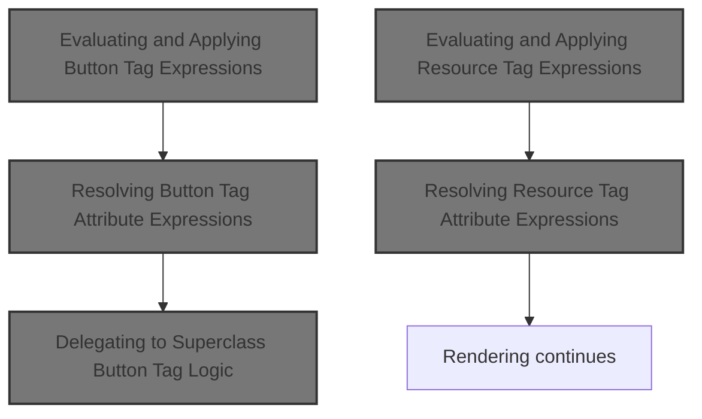

This document explains how dynamic expressions in button and resource tag attributes are evaluated and applied before rendering. Resolving these expressions ensures that tags use the latest values, enabling features like localization and dynamic UI behavior. After all expressions are processed, the tag continues through its rendering lifecycle.



# Evaluating and Applying Button Tag Expressions

<SwmSnippet path="/el/src/main/java/org/apache/strutsel/taglib/html/ELButtonTag.java" line="717">

---

In <SwmToken path="el/src/main/java/org/apache/strutsel/taglib/html/ELButtonTag.java" pos="717:5:5" line-data="    public int doStartTag() throws JspException {">`doStartTag`</SwmToken>, we kick off by evaluating all EL expressions tied to the button tag. This ensures any dynamic values are resolved before the tag logic continues. We call <SwmToken path="el/src/main/java/org/apache/strutsel/taglib/html/ELButtonTag.java" pos="718:1:1" line-data="        evaluateExpressions();">`evaluateExpressions`</SwmToken> next so that all attribute values are up-to-date and ready for further processing.

```java
    public int doStartTag() throws JspException {
        evaluateExpressions();

```

---

</SwmSnippet>

## Resolving Button Tag Attribute Expressions

<SwmSnippet path="/el/src/main/java/org/apache/strutsel/taglib/html/ELButtonTag.java" line="729">

---

In <SwmToken path="el/src/main/java/org/apache/strutsel/taglib/html/ELButtonTag.java" pos="729:5:5" line-data="    private void evaluateExpressions()">`evaluateExpressions`</SwmToken>, we resolve each EL-based attribute for the button, including <SwmToken path="el/src/main/java/org/apache/strutsel/taglib/html/ELButtonTag.java" pos="735:6:6" line-data="                EvalHelper.evalString(&quot;accessKey&quot;, getAccesskeyExpr(), this,">`accessKey`</SwmToken>, alt, and bundle. When the bundle expression is present, we call <SwmToken path="el/src/main/java/org/apache/strutsel/taglib/html/ELButtonTag.java" pos="754:1:1" line-data="            setBundle(string);">`setBundle`</SwmToken> to update the resource bundle, which may trigger config logic in <SwmToken path="core/src/main/java/org/apache/struts/config/ExceptionConfig.java" pos="34:4:4" line-data="public class ExceptionConfig extends BaseConfig {">`ExceptionConfig`</SwmToken>. This step is needed to make sure the right bundle is used for localization.

```java
    private void evaluateExpressions()
        throws JspException {
        String string = null;
        Boolean bool = null;

        if ((string =
                EvalHelper.evalString("accessKey", getAccesskeyExpr(), this,
                    pageContext)) != null) {
            setAccesskey(string);
        }

        if ((string =
                EvalHelper.evalString("alt", getAltExpr(), this, pageContext)) != null) {
            setAlt(string);
        }

        if ((string =
                EvalHelper.evalString("altKey", getAltKeyExpr(), this,
                    pageContext)) != null) {
            setAltKey(string);
        }

        if ((string =
                EvalHelper.evalString("bundle", getBundleExpr(), this,
                    pageContext)) != null) {
            setBundle(string);
        }

```

---

</SwmSnippet>

<SwmSnippet path="/core/src/main/java/org/apache/struts/config/ExceptionConfig.java" line="89">

---

<SwmToken path="core/src/main/java/org/apache/struts/config/ExceptionConfig.java" pos="89:5:5" line-data="    public void setBundle(String bundle) {">`setBundle`</SwmToken> only updates the bundle if the configuration isn't frozen. If the 'configured' flag is true, it throws an exception to block changes. This is how the repo enforces immutability after setup, so bundles can't be changed mid-flight.

```java
    public void setBundle(String bundle) {
        if (configured) {
            throw new IllegalStateException("Configuration is frozen");
        }

        this.bundle = bundle;
    }
```

---

</SwmSnippet>

<SwmSnippet path="/el/src/main/java/org/apache/strutsel/taglib/html/ELButtonTag.java" line="757">

---

After returning from <SwmToken path="el/src/main/java/org/apache/strutsel/taglib/html/ELButtonTag.java" pos="754:1:1" line-data="            setBundle(string);">`setBundle`</SwmToken> in <SwmToken path="core/src/main/java/org/apache/struts/config/ExceptionConfig.java" pos="34:4:4" line-data="public class ExceptionConfig extends BaseConfig {">`ExceptionConfig`</SwmToken>, <SwmToken path="el/src/main/java/org/apache/strutsel/taglib/html/ELButtonTag.java" pos="718:1:1" line-data="        evaluateExpressions();">`evaluateExpressions`</SwmToken> continues resolving the rest of the button's attributes. If the bundle couldn't be set due to a frozen config, the method would have already thrown, so only the attributes before the exception are applied.

```java
        if ((string =
        		EvalHelper.evalString("dir", getDirExpr(), this,
        			pageContext)) != null) {
        	setDir(string);
        }
        
        if ((bool =
                EvalHelper.evalBoolean("disabled", getDisabledExpr(), this,
                    pageContext)) != null) {
            setDisabled(bool.booleanValue());
        }

        if ((bool =
                EvalHelper.evalBoolean("indexed", getIndexedExpr(), this,
                    pageContext)) != null) {
            setIndexed(bool.booleanValue());
        }

        if ((string =
            	EvalHelper.evalString("lang", getLangExpr(), this,
            		pageContext)) != null) {
        	setLang(string);
        }

        if ((string =
                EvalHelper.evalString("onblur", getOnblurExpr(), this,
                    pageContext)) != null) {
            setOnblur(string);
        }

        if ((string =
                EvalHelper.evalString("onchange", getOnchangeExpr(), this,
                    pageContext)) != null) {
            setOnchange(string);
        }

        if ((string =
                EvalHelper.evalString("onclick", getOnclickExpr(), this,
                    pageContext)) != null) {
            setOnclick(string);
        }

        if ((string =
                EvalHelper.evalString("ondblclick", getOndblclickExpr(), this,
                    pageContext)) != null) {
            setOndblclick(string);
        }

        if ((string =
                EvalHelper.evalString("onfocus", getOnfocusExpr(), this,
                    pageContext)) != null) {
            setOnfocus(string);
        }

        if ((string =
                EvalHelper.evalString("onkeydown", getOnkeydownExpr(), this,
                    pageContext)) != null) {
            setOnkeydown(string);
        }

        if ((string =
                EvalHelper.evalString("onkeypress", getOnkeypressExpr(), this,
                    pageContext)) != null) {
            setOnkeypress(string);
        }

        if ((string =
                EvalHelper.evalString("onkeyup", getOnkeyupExpr(), this,
                    pageContext)) != null) {
            setOnkeyup(string);
        }

        if ((string =
                EvalHelper.evalString("onmousedown", getOnmousedownExpr(),
                    this, pageContext)) != null) {
            setOnmousedown(string);
        }

        if ((string =
                EvalHelper.evalString("onmousemove", getOnmousemoveExpr(),
                    this, pageContext)) != null) {
            setOnmousemove(string);
        }

        if ((string =
                EvalHelper.evalString("onmouseout", getOnmouseoutExpr(), this,
                    pageContext)) != null) {
            setOnmouseout(string);
        }

        if ((string =
                EvalHelper.evalString("onmouseover", getOnmouseoverExpr(),
                    this, pageContext)) != null) {
            setOnmouseover(string);
        }

        if ((string =
                EvalHelper.evalString("onmouseup", getOnmouseupExpr(), this,
                    pageContext)) != null) {
            setOnmouseup(string);
        }

        if ((string =
                EvalHelper.evalString("property", getPropertyExpr(), this,
                    pageContext)) != null) {
            setProperty(string);
        }

        if ((string =
                EvalHelper.evalString("style", getStyleExpr(), this, pageContext)) != null) {
            setStyle(string);
        }

        if ((string =
                EvalHelper.evalString("styleClass", getStyleClassExpr(), this,
                    pageContext)) != null) {
            setStyleClass(string);
        }

        if ((string =
                EvalHelper.evalString("styleId", getStyleIdExpr(), this,
                    pageContext)) != null) {
            setStyleId(string);
        }

        if ((string =
                EvalHelper.evalString("tabindex", getTabindexExpr(), this,
                    pageContext)) != null) {
            setTabindex(string);
        }

        if ((string =
                EvalHelper.evalString("title", getTitleExpr(), this, pageContext)) != null) {
            setTitle(string);
        }

        if ((string =
                EvalHelper.evalString("titleKey", getTitleKeyExpr(), this,
                    pageContext)) != null) {
            setTitleKey(string);
        }

        if ((string =
                EvalHelper.evalString("value", getValueExpr(), this, pageContext)) != null) {
            setValue(string);
        }
    }
```

---

</SwmSnippet>

## Delegating to Superclass Button Tag Logic

<SwmSnippet path="/el/src/main/java/org/apache/strutsel/taglib/html/ELButtonTag.java" line="720">

---

After finishing <SwmToken path="el/src/main/java/org/apache/strutsel/taglib/html/ELButtonTag.java" pos="718:1:1" line-data="        evaluateExpressions();">`evaluateExpressions`</SwmToken> in <SwmToken path="el/src/main/java/org/apache/strutsel/taglib/html/ELButtonTag.java" pos="720:6:6" line-data="        return (super.doStartTag());">`doStartTag`</SwmToken>, we delegate to the superclass to handle the actual tag processing. This step is what triggers the rendering and further tag lifecycle, which may involve resource tags like <SwmToken path="el/src/main/java/org/apache/strutsel/taglib/bean/ELResourceTag.java" pos="38:4:4" line-data="public class ELResourceTag extends ResourceTag {">`ELResourceTag`</SwmToken> next.

```java
        return (super.doStartTag());
    }
```

---

</SwmSnippet>

# Evaluating and Applying Resource Tag Expressions

<SwmSnippet path="/el/src/main/java/org/apache/strutsel/taglib/bean/ELResourceTag.java" line="120">

---

<SwmToken path="el/src/main/java/org/apache/strutsel/taglib/bean/ELResourceTag.java" pos="120:5:5" line-data="    public int doStartTag() throws JspException {">`doStartTag`</SwmToken> in <SwmToken path="el/src/main/java/org/apache/strutsel/taglib/bean/ELResourceTag.java" pos="38:4:4" line-data="public class ELResourceTag extends ResourceTag {">`ELResourceTag`</SwmToken> kicks off by evaluating all EL expressions for the resource tag. This ensures dynamic values are resolved before the tag logic continues, just like with the button tag.

```java
    public int doStartTag() throws JspException {
        evaluateExpressions();

        return (super.doStartTag());
    }
```

---

</SwmSnippet>

# Resolving Resource Tag Attribute Expressions

```mermaid
%%{init: {"flowchart": {"defaultRenderer": "elk"}} }%%
flowchart TD
    node1{"Evaluate 'id' expression"}
    click node1 openCode "el/src/main/java/org/apache/strutsel/taglib/bean/ELResourceTag.java:136:139"
    node1 -->|"Value found"| node2["Update tag 'id'"]
    click node2 openCode "el/src/main/java/org/apache/strutsel/taglib/bean/ELResourceTag.java:138:139"
    node1 -->|"No value"| node3{"Evaluate 'input' expression"}
    click node3 openCode "el/src/main/java/org/apache/strutsel/taglib/bean/ELResourceTag.java:141:144"
    node2 --> node3
    node3 -->|"Value found"| node4["Update tag 'input'"]
    click node4 openCode "core/src/main/java/org/apache/struts/config/ActionConfig.java:473:479"
    node3 -->|"No value"| node5{"Evaluate 'name' expression"}
    click node5 openCode "el/src/main/java/org/apache/strutsel/taglib/bean/ELResourceTag.java:146:149"
    node4 --> node5
    node5 -->|"Value found"| node6["Update tag 'name'"]
    click node6 openCode "el/src/main/java/org/apache/strutsel/taglib/bean/ELResourceTag.java:148:149"
    node5 -->|"No value"| node7["Done"]
    node6 --> node7
classDef HeadingStyle fill:#777777,stroke:#333,stroke-width:2px;

%% Swimm:
%% %%{init: {"flowchart": {"defaultRenderer": "elk"}} }%%
%% flowchart TD
%%     node1{"Evaluate 'id' expression"}
%%     click node1 openCode "<SwmPath>[el/…/bean/ELResourceTag.java](el/src/main/java/org/apache/strutsel/taglib/bean/ELResourceTag.java)</SwmPath>:136:139"
%%     node1 -->|"Value found"| node2["Update tag 'id'"]
%%     click node2 openCode "<SwmPath>[el/…/bean/ELResourceTag.java](el/src/main/java/org/apache/strutsel/taglib/bean/ELResourceTag.java)</SwmPath>:138:139"
%%     node1 -->|"No value"| node3{"Evaluate 'input' expression"}
%%     click node3 openCode "<SwmPath>[el/…/bean/ELResourceTag.java](el/src/main/java/org/apache/strutsel/taglib/bean/ELResourceTag.java)</SwmPath>:141:144"
%%     node2 --> node3
%%     node3 -->|"Value found"| node4["Update tag 'input'"]
%%     click node4 openCode "<SwmPath>[core/…/config/ActionConfig.java](core/src/main/java/org/apache/struts/config/ActionConfig.java)</SwmPath>:473:479"
%%     node3 -->|"No value"| node5{"Evaluate 'name' expression"}
%%     click node5 openCode "<SwmPath>[el/…/bean/ELResourceTag.java](el/src/main/java/org/apache/strutsel/taglib/bean/ELResourceTag.java)</SwmPath>:146:149"
%%     node4 --> node5
%%     node5 -->|"Value found"| node6["Update tag 'name'"]
%%     click node6 openCode "<SwmPath>[el/…/bean/ELResourceTag.java](el/src/main/java/org/apache/strutsel/taglib/bean/ELResourceTag.java)</SwmPath>:148:149"
%%     node5 -->|"No value"| node7["Done"]
%%     node6 --> node7
%% classDef HeadingStyle fill:#777777,stroke:#333,stroke-width:2px;
```



<SwmSnippet path="/el/src/main/java/org/apache/strutsel/taglib/bean/ELResourceTag.java" line="132">

---

In <SwmToken path="el/src/main/java/org/apache/strutsel/taglib/bean/ELResourceTag.java" pos="132:5:5" line-data="    private void evaluateExpressions()">`evaluateExpressions`</SwmToken>, we resolve EL-based attributes for the resource tag, including id and input. When input is present, we call <SwmToken path="el/src/main/java/org/apache/strutsel/taglib/bean/ELResourceTag.java" pos="143:1:1" line-data="            setInput(string);">`setInput`</SwmToken> to update the config, which may trigger logic in <SwmToken path="core/src/main/java/org/apache/struts/config/ExceptionConfig.java" pos="180:14:14" line-data="     * @param actionConfig The {@link ActionConfig} that this config is from,">`ActionConfig`</SwmToken> to enforce config constraints.

```java
    private void evaluateExpressions()
        throws JspException {
        String string = null;

        if ((string =
                EvalHelper.evalString("id", getIdExpr(), this, pageContext)) != null) {
            setId(string);
        }

        if ((string =
                EvalHelper.evalString("input", getInputExpr(), this, pageContext)) != null) {
            setInput(string);
        }

```

---

</SwmSnippet>

<SwmSnippet path="/core/src/main/java/org/apache/struts/config/ActionConfig.java" line="473">

---

<SwmToken path="core/src/main/java/org/apache/struts/config/ActionConfig.java" pos="473:5:5" line-data="    public void setInput(String input) {">`setInput`</SwmToken> only updates the input if the configuration isn't frozen. If 'configured' is true, it throws an exception to block changes. This is how the repo enforces immutability after setup, so input can't be changed later.

```java
    public void setInput(String input) {
        if (configured) {
            throw new IllegalStateException("Configuration is frozen");
        }

        this.input = input;
    }
```

---

</SwmSnippet>

<SwmSnippet path="/el/src/main/java/org/apache/strutsel/taglib/bean/ELResourceTag.java" line="146">

---

After returning from <SwmToken path="el/src/main/java/org/apache/strutsel/taglib/bean/ELResourceTag.java" pos="143:1:1" line-data="            setInput(string);">`setInput`</SwmToken> in <SwmToken path="core/src/main/java/org/apache/struts/config/ExceptionConfig.java" pos="180:14:14" line-data="     * @param actionConfig The {@link ActionConfig} that this config is from,">`ActionConfig`</SwmToken>, <SwmToken path="el/src/main/java/org/apache/strutsel/taglib/html/ELButtonTag.java" pos="718:1:1" line-data="        evaluateExpressions();">`evaluateExpressions`</SwmToken> continues resolving the rest of the resource tag's attributes. If the input couldn't be set due to a frozen config, the method would have already thrown, so only the attributes before the exception are applied.

```java
        if ((string =
                EvalHelper.evalString("name", getNameExpr(), this, pageContext)) != null) {
            setName(string);
        }
    }
```

---

</SwmSnippet>

&nbsp;

*This is an auto-generated document by Swimm 🌊 and has not yet been verified by a human*

<SwmMeta version="3.0.0" repo-id="Z2l0aHViJTNBJTNBc3RydXRzMSUzQSUzQVN3aW1tLURlbW8=" repo-name="struts1"><sup>Powered by [Swimm](https://app.swimm.io/)</sup></SwmMeta>
