This document describes how tag attributes are evaluated and assigned before further processing occurs. When a JSP page includes a tag, the system resolves dynamic expressions in the tag's attributes, assigns the resulting values, and then continues with rendering or additional tag logic.

# Evaluating Tag Expressions

<SwmSnippet path="/el/src/main/java/org/apache/strutsel/taglib/tiles/ELInsertTag.java" line="374">

---

In <SwmToken path="el/src/main/java/org/apache/strutsel/taglib/tiles/ELInsertTag.java" pos="374:5:5" line-data="    public int doStartTag() throws JspException {">`doStartTag`</SwmToken>, we kick things off by resolving all tag attribute expressions using <SwmToken path="el/src/main/java/org/apache/strutsel/taglib/tiles/ELInsertTag.java" pos="375:1:1" line-data="        evaluateExpressions();">`evaluateExpressions`</SwmToken>. This ensures all dynamic values are set before any further tag processing.

```java
    public int doStartTag() throws JspException {
        evaluateExpressions();

```

---

</SwmSnippet>

## Resolving and Assigning Tag Attributes

```mermaid
%%{init: {"flowchart": {"defaultRenderer": "elk"}} }%%
flowchart TD
    node1["Start evaluating expressions"]
    click node1 openCode "el/src/main/java/org/apache/strutsel/taglib/tiles/ELInsertTag.java:386:388"
    subgraph loop1["For each property: template, component,
page, definition, attribute, name,
beanName, beanProperty, beanScope,
flush, role, controllerUrl,
controllerClass"]
      node2["Evaluate expression for property"]
      click node2 openCode "el/src/main/java/org/apache/strutsel/taglib/tiles/ELInsertTag.java:391:469"
      node3{"Is value provided?"}
      node2 --> node3
      node3 -->|"Yes"| node4["Update property with value"]
      click node4 openCode "el/src/main/java/org/apache/strutsel/taglib/tiles/ELInsertTag.java:394:469"
      node3 -->|"No"| node7["Next property"]
    end
    subgraph loop2["Special case: ignore property"]
      node5["Evaluate boolean expression for 'ignore'"]
      click node5 openCode "el/src/main/java/org/apache/strutsel/taglib/tiles/ELInsertTag.java:448:452"
      node6{"Is value provided?"}
      node5 --> node6
      node6 -->|"Yes"| node8["Set ignore flag"]
      click node8 openCode "el/src/main/java/org/apache/strutsel/taglib/tiles/ELInsertTag.java:451:451"
      node6 -->|"No"| node9["Next property"]
    end
    node1 --> loop1
    loop1 --> loop2
    loop2 --> node10["Finish evaluating expressions"]
    click node10 openCode "el/src/main/java/org/apache/strutsel/taglib/tiles/ELInsertTag.java:470:470"

classDef HeadingStyle fill:#777777,stroke:#333,stroke-width:2px;

%% Swimm:
%% %%{init: {"flowchart": {"defaultRenderer": "elk"}} }%%
%% flowchart TD
%%     node1["Start evaluating expressions"]
%%     click node1 openCode "<SwmPath>[el/…/tiles/ELInsertTag.java](el/src/main/java/org/apache/strutsel/taglib/tiles/ELInsertTag.java)</SwmPath>:386:388"
%%     subgraph loop1["For each property: template, component,
%% page, definition, attribute, name,
%% <SwmToken path="el/src/main/java/org/apache/strutsel/taglib/tiles/ELInsertTag.java" pos="426:6:6" line-data="                EvalHelper.evalString(&quot;beanName&quot;, getBeanNameExpr(), this,">`beanName`</SwmToken>, <SwmToken path="el/src/main/java/org/apache/strutsel/taglib/tiles/ELInsertTag.java" pos="432:6:6" line-data="                EvalHelper.evalString(&quot;beanProperty&quot;, getBeanPropertyExpr(),">`beanProperty`</SwmToken>, <SwmToken path="el/src/main/java/org/apache/strutsel/taglib/tiles/ELInsertTag.java" pos="438:6:6" line-data="                EvalHelper.evalString(&quot;beanScope&quot;, getBeanScopeExpr(), this,">`beanScope`</SwmToken>,
%% flush, role, <SwmToken path="el/src/main/java/org/apache/strutsel/taglib/tiles/ELInsertTag.java" pos="460:6:6" line-data="                EvalHelper.evalString(&quot;controllerUrl&quot;, getControllerUrlExpr(),">`controllerUrl`</SwmToken>,
%% <SwmToken path="el/src/main/java/org/apache/strutsel/taglib/tiles/ELInsertTag.java" pos="466:6:6" line-data="                EvalHelper.evalString(&quot;controllerClass&quot;,">`controllerClass`</SwmToken>"]
%%       node2["Evaluate expression for property"]
%%       click node2 openCode "<SwmPath>[el/…/tiles/ELInsertTag.java](el/src/main/java/org/apache/strutsel/taglib/tiles/ELInsertTag.java)</SwmPath>:391:469"
%%       node3{"Is value provided?"}
%%       node2 --> node3
%%       node3 -->|"Yes"| node4["Update property with value"]
%%       click node4 openCode "<SwmPath>[el/…/tiles/ELInsertTag.java](el/src/main/java/org/apache/strutsel/taglib/tiles/ELInsertTag.java)</SwmPath>:394:469"
%%       node3 -->|"No"| node7["Next property"]
%%     end
%%     subgraph loop2["Special case: ignore property"]
%%       node5["Evaluate boolean expression for 'ignore'"]
%%       click node5 openCode "<SwmPath>[el/…/tiles/ELInsertTag.java](el/src/main/java/org/apache/strutsel/taglib/tiles/ELInsertTag.java)</SwmPath>:448:452"
%%       node6{"Is value provided?"}
%%       node5 --> node6
%%       node6 -->|"Yes"| node8["Set ignore flag"]
%%       click node8 openCode "<SwmPath>[el/…/tiles/ELInsertTag.java](el/src/main/java/org/apache/strutsel/taglib/tiles/ELInsertTag.java)</SwmPath>:451:451"
%%       node6 -->|"No"| node9["Next property"]
%%     end
%%     node1 --> loop1
%%     loop1 --> loop2
%%     loop2 --> node10["Finish evaluating expressions"]
%%     click node10 openCode "<SwmPath>[el/…/tiles/ELInsertTag.java](el/src/main/java/org/apache/strutsel/taglib/tiles/ELInsertTag.java)</SwmPath>:470:470"
%% 
%% classDef HeadingStyle fill:#777777,stroke:#333,stroke-width:2px;
```



<SwmSnippet path="/el/src/main/java/org/apache/strutsel/taglib/tiles/ELInsertTag.java" line="386">

---

In <SwmToken path="el/src/main/java/org/apache/strutsel/taglib/tiles/ELInsertTag.java" pos="386:5:5" line-data="    private void evaluateExpressions()">`evaluateExpressions`</SwmToken>, we start by resolving the 'template' attribute and assigning it. Next, we call <SwmToken path="tiles/src/main/java/org/apache/struts/tiles/ComponentDefinition.java" pos="38:4:4" line-data="public class ComponentDefinition implements Serializable {">`ComponentDefinition`</SwmToken> to actually store the template value, so the tag knows which layout to use.

```java
    private void evaluateExpressions()
        throws JspException {
        String string = null;
        Boolean bool = null;

        if ((string =
                EvalHelper.evalString("template", getTemplateExpr(), this,
                    pageContext)) != null) {
            setTemplate(string);
        }

```

---

</SwmSnippet>

<SwmSnippet path="/tiles/src/main/java/org/apache/struts/tiles/ComponentDefinition.java" line="215">

---

<SwmToken path="tiles/src/main/java/org/apache/struts/tiles/ComponentDefinition.java" pos="215:5:5" line-data="    public void setTemplate(String template) {">`setTemplate`</SwmToken> just assigns the template string to the internal path variable. The naming mismatch is odd, but it doesn't change the behavior—it's a straight setter.

```java
    public void setTemplate(String template) {
        path = template;
    }
```

---

</SwmSnippet>

<SwmSnippet path="/el/src/main/java/org/apache/strutsel/taglib/tiles/ELInsertTag.java" line="397">

---

Back in <SwmToken path="el/src/main/java/org/apache/strutsel/taglib/tiles/ELInsertTag.java" pos="375:1:1" line-data="        evaluateExpressions();">`evaluateExpressions`</SwmToken>, after setting the template, we resolve and assign other attributes like component, page, definition, and attribute. We call <SwmToken path="core/src/main/java/org/apache/struts/config/ActionConfig.java" pos="41:4:4" line-data="public class ActionConfig extends BaseConfig {">`ActionConfig`</SwmToken> next to store the attribute value, so it's available for later use.

```java
        if ((string =
                EvalHelper.evalString("component", getComponentExpr(), this,
                    pageContext)) != null) {
            setComponent(string);
        }

        if ((string =
                EvalHelper.evalString("page", getPageExpr(), this, pageContext)) != null) {
            setPage(string);
        }

        if ((string =
                EvalHelper.evalString("definition", getDefinitionExpr(), this,
                    pageContext)) != null) {
            setDefinition(string);
        }

        if ((string =
                EvalHelper.evalString("attribute", getAttributeExpr(), this,
                    pageContext)) != null) {
            setAttribute(string);
        }

```

---

</SwmSnippet>

<SwmSnippet path="/core/src/main/java/org/apache/struts/config/ActionConfig.java" line="337">

---

<SwmToken path="core/src/main/java/org/apache/struts/config/ActionConfig.java" pos="337:5:5" line-data="    public void setAttribute(String attribute) {">`setAttribute`</SwmToken> checks if configuration is frozen before assigning the value. If it's locked, it throws an exception—so you can't change attributes after setup.

```java
    public void setAttribute(String attribute) {
        if (configured) {
            throw new IllegalStateException("Configuration is frozen");
        }

        this.attribute = attribute;
    }
```

---

</SwmSnippet>

<SwmSnippet path="/el/src/main/java/org/apache/strutsel/taglib/tiles/ELInsertTag.java" line="420">

---

After returning from <SwmToken path="core/src/main/java/org/apache/struts/config/ActionConfig.java" pos="41:4:4" line-data="public class ActionConfig extends BaseConfig {">`ActionConfig`</SwmToken>, <SwmToken path="el/src/main/java/org/apache/strutsel/taglib/tiles/ELInsertTag.java" pos="375:1:1" line-data="        evaluateExpressions();">`evaluateExpressions`</SwmToken> finishes by resolving and assigning more attributes, including <SwmToken path="el/src/main/java/org/apache/strutsel/taglib/tiles/ELInsertTag.java" pos="466:6:6" line-data="                EvalHelper.evalString(&quot;controllerClass&quot;,">`controllerClass`</SwmToken>. We call <SwmToken path="tiles/src/main/java/org/apache/struts/tiles/ComponentDefinition.java" pos="38:4:4" line-data="public class ComponentDefinition implements Serializable {">`ComponentDefinition`</SwmToken> again to set up the controller logic for the tag.

```java
        if ((string =
                EvalHelper.evalString("name", getNameExpr(), this, pageContext)) != null) {
            setName(string);
        }

        if ((string =
                EvalHelper.evalString("beanName", getBeanNameExpr(), this,
                    pageContext)) != null) {
            setBeanName(string);
        }

        if ((string =
                EvalHelper.evalString("beanProperty", getBeanPropertyExpr(),
                    this, pageContext)) != null) {
            setBeanProperty(string);
        }

        if ((string =
                EvalHelper.evalString("beanScope", getBeanScopeExpr(), this,
                    pageContext)) != null) {
            setBeanScope(string);
        }

        if ((string =
                EvalHelper.evalString("flush", getFlushExpr(), this, pageContext)) != null) {
            setFlush(string);
        }

        if ((bool =
                EvalHelper.evalBoolean("ignore", getIgnoreExpr(), this,
                    pageContext)) != null) {
            setIgnore(bool.booleanValue());
        }

        if ((string =
                EvalHelper.evalString("role", getRoleExpr(), this, pageContext)) != null) {
            setRole(string);
        }

        if ((string =
                EvalHelper.evalString("controllerUrl", getControllerUrlExpr(),
                    this, pageContext)) != null) {
            setControllerUrl(string);
        }

        if ((string =
                EvalHelper.evalString("controllerClass",
                    getControllerClassExpr(), this, pageContext)) != null) {
            setControllerClass(string);
        }
    }
```

---

</SwmSnippet>

<SwmSnippet path="/tiles/src/main/java/org/apache/struts/tiles/ComponentDefinition.java" line="399">

---

<SwmToken path="tiles/src/main/java/org/apache/struts/tiles/ComponentDefinition.java" pos="399:5:5" line-data="    public void setControllerClass(String controller) {">`setControllerClass`</SwmToken> assigns the controller and sets its type to 'classname'. That constant is what tells the system to treat the controller as a class, not something else.

```java
    public void setControllerClass(String controller) {
        setController(controller);
        setControllerType("classname");
    }
```

---

</SwmSnippet>

## Delegating Tag Processing

<SwmSnippet path="/el/src/main/java/org/apache/strutsel/taglib/tiles/ELInsertTag.java" line="377">

---

After finishing up in <SwmToken path="el/src/main/java/org/apache/strutsel/taglib/tiles/ELInsertTag.java" pos="377:6:6" line-data="        return (super.doStartTag());">`doStartTag`</SwmToken>, we hand off to the parent tag logic by calling <SwmToken path="el/src/main/java/org/apache/strutsel/taglib/tiles/ELInsertTag.java" pos="377:4:6" line-data="        return (super.doStartTag());">`super.doStartTag`</SwmToken>. This lets the base class handle rendering or any extra tag steps.

```java
        return (super.doStartTag());
    }
```

---

</SwmSnippet>

# Evaluating Resource Tag Expressions

<SwmSnippet path="/el/src/main/java/org/apache/strutsel/taglib/bean/ELResourceTag.java" line="120">

---

<SwmToken path="el/src/main/java/org/apache/strutsel/taglib/bean/ELResourceTag.java" pos="120:5:5" line-data="    public int doStartTag() throws JspException {">`doStartTag`</SwmToken> for the resource tag resolves attribute expressions first, then hands off to the parent tag logic for actual processing.

```java
    public int doStartTag() throws JspException {
        evaluateExpressions();

        return (super.doStartTag());
    }
```

---

</SwmSnippet>

# Resolving and Assigning Resource Attributes

<SwmSnippet path="/el/src/main/java/org/apache/strutsel/taglib/bean/ELResourceTag.java" line="132">

---

In <SwmToken path="el/src/main/java/org/apache/strutsel/taglib/bean/ELResourceTag.java" pos="132:5:5" line-data="    private void evaluateExpressions()">`evaluateExpressions`</SwmToken>, we resolve 'id' and 'input' attributes. We call <SwmToken path="core/src/main/java/org/apache/struts/config/ActionConfig.java" pos="41:4:4" line-data="public class ActionConfig extends BaseConfig {">`ActionConfig`</SwmToken> next to store the input value, so the tag knows which resource to use.

```java
    private void evaluateExpressions()
        throws JspException {
        String string = null;

        if ((string =
                EvalHelper.evalString("id", getIdExpr(), this, pageContext)) != null) {
            setId(string);
        }

        if ((string =
                EvalHelper.evalString("input", getInputExpr(), this, pageContext)) != null) {
            setInput(string);
        }

```

---

</SwmSnippet>

<SwmSnippet path="/core/src/main/java/org/apache/struts/config/ActionConfig.java" line="473">

---

<SwmToken path="core/src/main/java/org/apache/struts/config/ActionConfig.java" pos="473:5:5" line-data="    public void setInput(String input) {">`setInput`</SwmToken> checks if configuration is frozen before assigning the value. If it's locked, it throws an exception—so you can't change input after setup.

```java
    public void setInput(String input) {
        if (configured) {
            throw new IllegalStateException("Configuration is frozen");
        }

        this.input = input;
    }
```

---

</SwmSnippet>

<SwmSnippet path="/el/src/main/java/org/apache/strutsel/taglib/bean/ELResourceTag.java" line="146">

---

After returning from <SwmToken path="core/src/main/java/org/apache/struts/config/ActionConfig.java" pos="41:4:4" line-data="public class ActionConfig extends BaseConfig {">`ActionConfig`</SwmToken>, <SwmToken path="el/src/main/java/org/apache/strutsel/taglib/tiles/ELInsertTag.java" pos="375:1:1" line-data="        evaluateExpressions();">`evaluateExpressions`</SwmToken> wraps up by resolving and assigning the 'name' attribute, so the resource tag has all the info it needs for later steps.

```java
        if ((string =
                EvalHelper.evalString("name", getNameExpr(), this, pageContext)) != null) {
            setName(string);
        }
    }
```

---

</SwmSnippet>

&nbsp;

*This is an auto-generated document by Swimm 🌊 and has not yet been verified by a human*

<SwmMeta version="3.0.0" repo-id="Z2l0aHViJTNBJTNBc3RydXRzMSUzQSUzQVN3aW1tLURlbW8=" repo-name="struts1"><sup>Powered by [Swimm](https://app.swimm.io/)</sup></SwmMeta>
