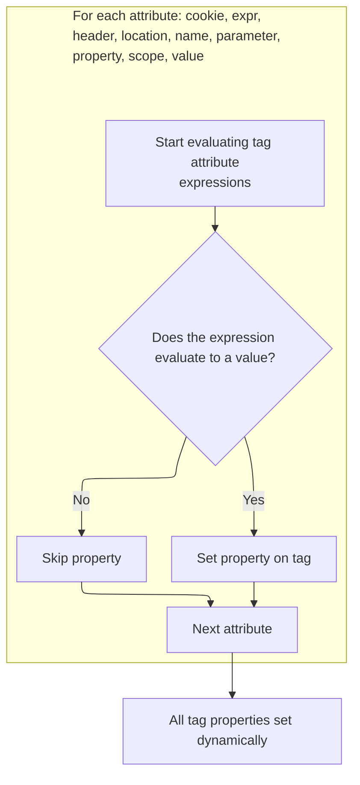

This document outlines how tag attributes with dynamic expressions are evaluated and set before the main tag logic executes. This ensures that tags operate with current values and, when permitted, update configuration settings as needed.

# Starting the Tag Evaluation

<SwmSnippet path="/el/src/main/java/org/apache/strutsel/taglib/logic/ELNotMatchTag.java" line="277">

---

In <SwmToken path="el/src/main/java/org/apache/strutsel/taglib/logic/ELNotMatchTag.java" pos="277:5:5" line-data="    public int doStartTag() throws JspException {">`doStartTag`</SwmToken>, we kick things off by evaluating all EL expressions tied to this tag. This ensures that any dynamic values are resolved before the tag logic continues. Next up is <SwmToken path="el/src/main/java/org/apache/strutsel/taglib/logic/ELNotMatchTag.java" pos="278:1:1" line-data="        evaluateExpressions();">`evaluateExpressions`</SwmToken> because we need all those values set before doing anything else.

```java
    public int doStartTag() throws JspException {
        evaluateExpressions();

```

---

</SwmSnippet>

## Evaluating Expressions and Setting Configurations



<SwmSnippet path="/el/src/main/java/org/apache/strutsel/taglib/logic/ELNotMatchTag.java" line="312">

---

In <SwmToken path="el/src/main/java/org/apache/strutsel/taglib/logic/ELNotMatchTag.java" pos="312:5:5" line-data="    private void evaluateExpressions()">`evaluateExpressions`</SwmToken>, we loop through all possible EL attributes for the tag, resolve them, and set them if present. After evaluating the 'parameter' expression, we call into <SwmToken path="core/src/main/java/org/apache/struts/config/MessageResourcesConfig.java" pos="34:4:4" line-data="public class MessageResourcesConfig extends BaseConfig {">`MessageResourcesConfig`</SwmToken> to update its value if needed.

```java
    private void evaluateExpressions()
        throws JspException {
        String string = null;

        if ((string =
                EvalHelper.evalString("cookie", getCookieExpr(), this,
                    pageContext)) != null) {
            setCookie(string);
        }

        if ((string =
                EvalHelper.evalString("expr", getExpr(), this, pageContext)) != null) {
            setExprValue(string);
        }

        if ((string =
                EvalHelper.evalString("header", getHeaderExpr(), this,
                    pageContext)) != null) {
            setHeader(string);
        }

        if ((string =
                EvalHelper.evalString("location", getLocationExpr(), this,
                    pageContext)) != null) {
            setLocation(string);
        }

        if ((string =
                EvalHelper.evalString("name", getNameExpr(), this, pageContext)) != null) {
            setName(string);
        }

        if ((string =
                EvalHelper.evalString("parameter", getParameterExpr(), this,
                    pageContext)) != null) {
            setParameter(string);
        }

```

---

</SwmSnippet>

<SwmSnippet path="/core/src/main/java/org/apache/struts/config/MessageResourcesConfig.java" line="127">

---

<SwmToken path="core/src/main/java/org/apache/struts/config/MessageResourcesConfig.java" pos="127:5:5" line-data="    public void setParameter(String parameter) {">`setParameter`</SwmToken> updates the parameter only if the config isn't frozen. If it's frozen, it throws, so you can't change things after setup. This keeps the config immutable once it's locked.

```java
    public void setParameter(String parameter) {
        if (configured) {
            throw new IllegalStateException("Configuration is frozen");
        }

        this.parameter = parameter;
    }
```

---

</SwmSnippet>

<SwmSnippet path="/el/src/main/java/org/apache/strutsel/taglib/logic/ELNotMatchTag.java" line="350">

---

Back in `ELNotMatchTag.evaluateExpressions`, after updating the parameter, we keep resolving and setting more attributes. Next up is 'scope', which means we need to call into <SwmToken path="core/src/main/java/org/apache/struts/config/ActionConfig.java" pos="41:4:4" line-data="public class ActionConfig extends BaseConfig {">`ActionConfig`</SwmToken> to update its state if necessary.

```java
        if ((string =
                EvalHelper.evalString("property", getPropertyExpr(), this,
                    pageContext)) != null) {
            setProperty(string);
        }

        if ((string =
                EvalHelper.evalString("scope", getScopeExpr(), this, pageContext)) != null) {
            setScope(string);
        }

```

---

</SwmSnippet>

<SwmSnippet path="/core/src/main/java/org/apache/struts/config/ActionConfig.java" line="652">

---

<SwmToken path="core/src/main/java/org/apache/struts/config/ActionConfig.java" pos="652:5:5" line-data="    public void setScope(String scope) {">`setScope`</SwmToken> only updates the scope if the config isn't frozen. If it's already locked, it throws, so you can't mess with the config after it's finalized.

```java
    public void setScope(String scope) {
        if (configured) {
            throw new IllegalStateException("Configuration is frozen");
        }

        this.scope = scope;
    }
```

---

</SwmSnippet>

<SwmSnippet path="/el/src/main/java/org/apache/strutsel/taglib/logic/ELNotMatchTag.java" line="361">

---

After returning from <SwmToken path="core/src/main/java/org/apache/struts/config/ActionConfig.java" pos="41:4:4" line-data="public class ActionConfig extends BaseConfig {">`ActionConfig`</SwmToken>, `ELNotMatchTag.evaluateExpressions` wraps up by resolving and setting the 'value' attribute if present. All dynamic attributes are now set.

```java
        if ((string =
                EvalHelper.evalString("value", getValueExpr(), this, pageContext)) != null) {
            setValue(string);
        }
    }
```

---

</SwmSnippet>

## Delegating to Parent Tag Logic

<SwmSnippet path="/el/src/main/java/org/apache/strutsel/taglib/logic/ELNotMatchTag.java" line="280">

---

After finishing up in `ELNotMatchTag.evaluateExpressions`, <SwmToken path="el/src/main/java/org/apache/strutsel/taglib/logic/ELNotMatchTag.java" pos="280:6:6" line-data="        return (super.doStartTag());">`doStartTag`</SwmToken> hands off to the parent implementation. This is where the main tag logic runs, using all the values we just set. Next, this leads into the resource tag logic.

```java
        return (super.doStartTag());
    }
```

---

</SwmSnippet>

# Processing the Resource Tag

<SwmSnippet path="/el/src/main/java/org/apache/strutsel/taglib/bean/ELResourceTag.java" line="120">

---

<SwmToken path="el/src/main/java/org/apache/strutsel/taglib/bean/ELResourceTag.java" pos="120:5:5" line-data="    public int doStartTag() throws JspException {">`doStartTag`</SwmToken> in the resource tag resolves its own EL attributes, then passes control to its parent. This keeps the tag's state up to date before any processing happens.

```java
    public int doStartTag() throws JspException {
        evaluateExpressions();

        return (super.doStartTag());
    }
```

---

</SwmSnippet>

# Resolving Resource Tag Attributes

```mermaid
%%{init: {"flowchart": {"defaultRenderer": "elk"}} }%%
flowchart TD
    node1{"Is 'id' expression present?"}
    click node1 openCode "el/src/main/java/org/apache/strutsel/taglib/bean/ELResourceTag.java:136:139"
    node1 -->|"Yes"| node2["Set resource 'id'"]
    click node2 openCode "el/src/main/java/org/apache/strutsel/taglib/bean/ELResourceTag.java:138:139"
    node1 -->|"No"| node3["Continue"]
    node2 --> node3
    node3 --> node4{"Is 'input' expression present?"}
    click node4 openCode "el/src/main/java/org/apache/strutsel/taglib/bean/ELResourceTag.java:141:144"
    node4 -->|"Yes"| node5["Set resource 'input'"]
    click node5 openCode "el/src/main/java/org/apache/strutsel/taglib/bean/ELResourceTag.java:143:144"
    node4 -->|"No"| node6["Continue"]
    node5 --> node6
    node6 --> node7{"Is 'name' expression present?"}
    click node7 openCode "el/src/main/java/org/apache/strutsel/taglib/bean/ELResourceTag.java:146:149"
    node7 -->|"Yes"| node8["Set resource 'name'"]
    click node8 openCode "el/src/main/java/org/apache/strutsel/taglib/bean/ELResourceTag.java:148:149"
    node7 -->|"No"| node9["End"]
    node8 --> node9
classDef HeadingStyle fill:#777777,stroke:#333,stroke-width:2px;

%% Swimm:
%% %%{init: {"flowchart": {"defaultRenderer": "elk"}} }%%
%% flowchart TD
%%     node1{"Is 'id' expression present?"}
%%     click node1 openCode "<SwmPath>[el/…/bean/ELResourceTag.java](el/src/main/java/org/apache/strutsel/taglib/bean/ELResourceTag.java)</SwmPath>:136:139"
%%     node1 -->|"Yes"| node2["Set resource 'id'"]
%%     click node2 openCode "<SwmPath>[el/…/bean/ELResourceTag.java](el/src/main/java/org/apache/strutsel/taglib/bean/ELResourceTag.java)</SwmPath>:138:139"
%%     node1 -->|"No"| node3["Continue"]
%%     node2 --> node3
%%     node3 --> node4{"Is 'input' expression present?"}
%%     click node4 openCode "<SwmPath>[el/…/bean/ELResourceTag.java](el/src/main/java/org/apache/strutsel/taglib/bean/ELResourceTag.java)</SwmPath>:141:144"
%%     node4 -->|"Yes"| node5["Set resource 'input'"]
%%     click node5 openCode "<SwmPath>[el/…/bean/ELResourceTag.java](el/src/main/java/org/apache/strutsel/taglib/bean/ELResourceTag.java)</SwmPath>:143:144"
%%     node4 -->|"No"| node6["Continue"]
%%     node5 --> node6
%%     node6 --> node7{"Is 'name' expression present?"}
%%     click node7 openCode "<SwmPath>[el/…/bean/ELResourceTag.java](el/src/main/java/org/apache/strutsel/taglib/bean/ELResourceTag.java)</SwmPath>:146:149"
%%     node7 -->|"Yes"| node8["Set resource 'name'"]
%%     click node8 openCode "<SwmPath>[el/…/bean/ELResourceTag.java](el/src/main/java/org/apache/strutsel/taglib/bean/ELResourceTag.java)</SwmPath>:148:149"
%%     node7 -->|"No"| node9["End"]
%%     node8 --> node9
%% classDef HeadingStyle fill:#777777,stroke:#333,stroke-width:2px;
```



<SwmSnippet path="/el/src/main/java/org/apache/strutsel/taglib/bean/ELResourceTag.java" line="132">

---

In <SwmToken path="el/src/main/java/org/apache/strutsel/taglib/bean/ELResourceTag.java" pos="132:5:5" line-data="    private void evaluateExpressions()">`evaluateExpressions`</SwmToken>, we resolve the 'id' and 'input' attributes for the resource tag. After getting 'input', we call into <SwmToken path="core/src/main/java/org/apache/struts/config/ActionConfig.java" pos="41:4:4" line-data="public class ActionConfig extends BaseConfig {">`ActionConfig`</SwmToken> to update its value if needed.

```java
    private void evaluateExpressions()
        throws JspException {
        String string = null;

        if ((string =
                EvalHelper.evalString("id", getIdExpr(), this, pageContext)) != null) {
            setId(string);
        }

        if ((string =
                EvalHelper.evalString("input", getInputExpr(), this, pageContext)) != null) {
            setInput(string);
        }

```

---

</SwmSnippet>

<SwmSnippet path="/core/src/main/java/org/apache/struts/config/ActionConfig.java" line="473">

---

<SwmToken path="core/src/main/java/org/apache/struts/config/ActionConfig.java" pos="473:5:5" line-data="    public void setInput(String input) {">`setInput`</SwmToken> updates the input value only if the config isn't frozen. If it's locked, it throws, so you can't change the input after setup.

```java
    public void setInput(String input) {
        if (configured) {
            throw new IllegalStateException("Configuration is frozen");
        }

        this.input = input;
    }
```

---

</SwmSnippet>

<SwmSnippet path="/el/src/main/java/org/apache/strutsel/taglib/bean/ELResourceTag.java" line="146">

---

After returning from <SwmToken path="core/src/main/java/org/apache/struts/config/ActionConfig.java" pos="41:4:4" line-data="public class ActionConfig extends BaseConfig {">`ActionConfig`</SwmToken>, `ELResourceTag.evaluateExpressions` finishes by resolving and setting the 'name' attribute if present. All dynamic attributes for this tag are now set.

```java
        if ((string =
                EvalHelper.evalString("name", getNameExpr(), this, pageContext)) != null) {
            setName(string);
        }
    }
```

---

</SwmSnippet>

&nbsp;

*This is an auto-generated document by Swimm 🌊 and has not yet been verified by a human*

<SwmMeta version="3.0.0" repo-id="Z2l0aHViJTNBJTNBc3RydXRzMSUzQSUzQVN3aW1tLURlbW8=" repo-name="struts1"><sup>Powered by [Swimm](https://app.swimm.io/)</sup></SwmMeta>
