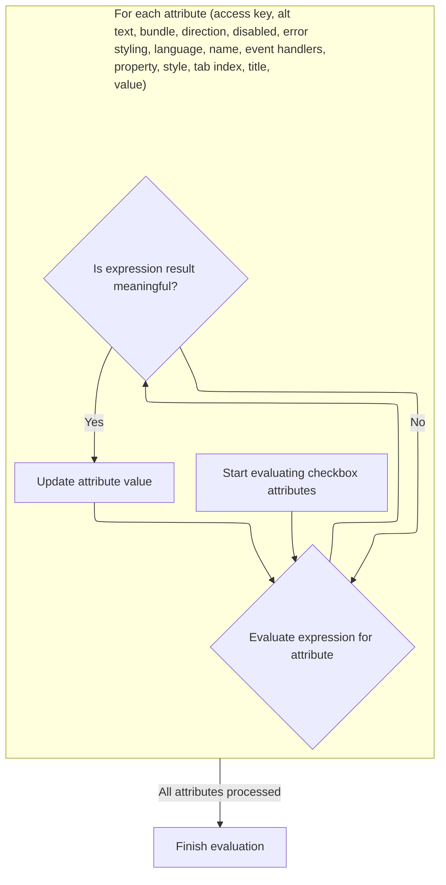

This document describes how tag attributes are prepared for rendering by evaluating dynamic expressions, enabling flexible UI customization. All attribute values are resolved at runtime before the tag is rendered.

# Starting Checkbox Tag Processing

<SwmSnippet path="/el/src/main/java/org/apache/strutsel/taglib/html/ELCheckboxTag.java" line="832">

---

In <SwmToken path="el/src/main/java/org/apache/strutsel/taglib/html/ELCheckboxTag.java" pos="832:5:5" line-data="    public int doStartTag() throws JspException {">`doStartTag`</SwmToken>, we kick off the tag processing by resolving all dynamic attribute values through <SwmToken path="el/src/main/java/org/apache/strutsel/taglib/html/ELCheckboxTag.java" pos="833:1:1" line-data="        evaluateExpressions();">`evaluateExpressions`</SwmToken>. This ensures any EL or runtime expressions are handled before the tag logic continues.

```java
    public int doStartTag() throws JspException {
        evaluateExpressions();

```

---

</SwmSnippet>

## Evaluating Checkbox Tag Attributes



<SwmSnippet path="/el/src/main/java/org/apache/strutsel/taglib/html/ELCheckboxTag.java" line="844">

---

In <SwmToken path="el/src/main/java/org/apache/strutsel/taglib/html/ELCheckboxTag.java" pos="844:5:5" line-data="    private void evaluateExpressions()">`evaluateExpressions`</SwmToken>, we loop through each supported attribute, evaluating its expression if present. We call <SwmToken path="el/src/main/java/org/apache/strutsel/taglib/html/ELCheckboxTag.java" pos="850:1:3" line-data="                EvalHelper.evalString(&quot;accesskey&quot;, getAccesskeyExpr(), this,">`EvalHelper.evalString`</SwmToken> for each, so we can handle dynamic values for all tag properties.

```java
    private void evaluateExpressions()
        throws JspException {
        String string = null;
        Boolean bool = null;

        if ((string =
                EvalHelper.evalString("accesskey", getAccesskeyExpr(), this,
                    pageContext)) != null) {
            setAccesskey(string);
        }

        if ((string =
                EvalHelper.evalString("alt", getAltExpr(), this, pageContext)) != null) {
            setAlt(string);
        }

        if ((string =
                EvalHelper.evalString("altKey", getAltKeyExpr(), this,
                    pageContext)) != null) {
            setAltKey(string);
        }

        if ((string =
                EvalHelper.evalString("bundle", getBundleExpr(), this,
                    pageContext)) != null) {
```

---

</SwmSnippet>

<SwmSnippet path="/el/src/main/java/org/apache/strutsel/taglib/utils/EvalHelper.java" line="64">

---

<SwmToken path="el/src/main/java/org/apache/strutsel/taglib/utils/EvalHelper.java" pos="64:7:7" line-data="    public static String evalString(String attrName, String attrValue,">`evalString`</SwmToken> evaluates the given attribute expression in the tag and page context, returning the result as a String. It relies on <SwmToken path="el/src/main/java/org/apache/strutsel/taglib/utils/EvalHelper.java" pos="71:1:1" line-data="                ExpressionEvaluatorManager.evaluate(attrName, attrValue,">`ExpressionEvaluatorManager`</SwmToken> to handle the actual EL parsing and evaluation.

```java
    public static String evalString(String attrName, String attrValue,
        Tag tagObject, PageContext pageContext)
        throws JspException {
        Object result = null;

        if (attrValue != null) {
            result =
                ExpressionEvaluatorManager.evaluate(attrName, attrValue,
                    String.class, tagObject, pageContext);
        }

        return ((String) result);
    }
```

---

</SwmSnippet>

<SwmSnippet path="/el/src/main/java/org/apache/strutsel/taglib/html/ELCheckboxTag.java" line="869">

---

Back in `ELCheckboxTag.evaluateExpressions`, after evaluating the bundle expression, we set the bundle property. This triggers logic in <SwmToken path="core/src/main/java/org/apache/struts/config/ExceptionConfig.java" pos="34:4:4" line-data="public class ExceptionConfig extends BaseConfig {">`ExceptionConfig`</SwmToken> to enforce configuration immutability if needed.

```java
            setBundle(string);
        }

```

---

</SwmSnippet>

<SwmSnippet path="/core/src/main/java/org/apache/struts/config/ExceptionConfig.java" line="89">

---

<SwmToken path="core/src/main/java/org/apache/struts/config/ExceptionConfig.java" pos="89:5:5" line-data="    public void setBundle(String bundle) {">`setBundle`</SwmToken> checks if the configuration is frozen before assigning the bundle value. If frozen, it throws an exception to prevent changes, enforcing immutability after setup.

```java
    public void setBundle(String bundle) {
        if (configured) {
            throw new IllegalStateException("Configuration is frozen");
        }

        this.bundle = bundle;
    }
```

---

</SwmSnippet>

<SwmSnippet path="/el/src/main/java/org/apache/strutsel/taglib/html/ELCheckboxTag.java" line="872">

---

Back in `ELCheckboxTag.evaluateExpressions`, we keep evaluating and setting the rest of the tag's attributes using <SwmToken path="el/src/main/java/org/apache/strutsel/taglib/html/ELCheckboxTag.java" pos="873:1:1" line-data="        		EvalHelper.evalString(&quot;dir&quot;, getDirExpr(), this,">`EvalHelper`</SwmToken>. This ensures all dynamic properties are resolved before rendering.

```java
        if ((string =
        		EvalHelper.evalString("dir", getDirExpr(), this,
        			pageContext)) != null) {
        	setDir(string);
        }
        
        if ((bool =
                EvalHelper.evalBoolean("disabled", getDisabledExpr(), this,
                    pageContext)) != null) {
            setDisabled(bool.booleanValue());
        }

        if ((string =
                EvalHelper.evalString("errorKey", getErrorKeyExpr(), this,
                    pageContext)) != null) {
            setErrorKey(string);
        }

        if ((string =
                EvalHelper.evalString("errorStyle", getErrorStyleExpr(), this,
                    pageContext)) != null) {
            setErrorStyle(string);
        }

        if ((string =
                EvalHelper.evalString("errorStyleClass",
                    getErrorStyleClassExpr(), this, pageContext)) != null) {
            setErrorStyleClass(string);
        }

        if ((string =
                EvalHelper.evalString("errorStyleId", getErrorStyleIdExpr(),
                    this, pageContext)) != null) {
            setErrorStyleId(string);
        }

        if ((bool =
                EvalHelper.evalBoolean("indexed", getIndexedExpr(), this,
                    pageContext)) != null) {
            setIndexed(bool.booleanValue());
        }

        if ((string =
            	EvalHelper.evalString("lang", getLangExpr(), this,
            		pageContext)) != null) {
        	setLang(string);
        }

        if ((string =
                EvalHelper.evalString("name", getNameExpr(), this, pageContext)) != null) {
            setName(string);
        }

        if ((string =
                EvalHelper.evalString("onblur", getOnblurExpr(), this,
                    pageContext)) != null) {
            setOnblur(string);
        }

        if ((string =
                EvalHelper.evalString("onchange", getOnchangeExpr(), this,
                    pageContext)) != null) {
            setOnchange(string);
        }

        if ((string =
                EvalHelper.evalString("onclick", getOnclickExpr(), this,
                    pageContext)) != null) {
            setOnclick(string);
        }

        if ((string =
                EvalHelper.evalString("ondblclick", getOndblclickExpr(), this,
                    pageContext)) != null) {
            setOndblclick(string);
        }

        if ((string =
                EvalHelper.evalString("onfocus", getOnfocusExpr(), this,
                    pageContext)) != null) {
            setOnfocus(string);
        }

        if ((string =
                EvalHelper.evalString("onkeydown", getOnkeydownExpr(), this,
                    pageContext)) != null) {
            setOnkeydown(string);
        }

        if ((string =
                EvalHelper.evalString("onkeypress", getOnkeypressExpr(), this,
                    pageContext)) != null) {
            setOnkeypress(string);
        }

        if ((string =
                EvalHelper.evalString("onkeyup", getOnkeyupExpr(), this,
                    pageContext)) != null) {
            setOnkeyup(string);
        }

        if ((string =
                EvalHelper.evalString("onmousedown", getOnmousedownExpr(),
                    this, pageContext)) != null) {
            setOnmousedown(string);
        }

        if ((string =
                EvalHelper.evalString("onmousemove", getOnmousemoveExpr(),
                    this, pageContext)) != null) {
            setOnmousemove(string);
        }

        if ((string =
                EvalHelper.evalString("onmouseout", getOnmouseoutExpr(), this,
                    pageContext)) != null) {
            setOnmouseout(string);
        }

        if ((string =
                EvalHelper.evalString("onmouseover", getOnmouseoverExpr(),
                    this, pageContext)) != null) {
            setOnmouseover(string);
        }

        if ((string =
                EvalHelper.evalString("onmouseup", getOnmouseupExpr(), this,
                    pageContext)) != null) {
            setOnmouseup(string);
        }

        if ((string =
                EvalHelper.evalString("property", getPropertyExpr(), this,
                    pageContext)) != null) {
            setProperty(string);
        }

        if ((string =
                EvalHelper.evalString("style", getStyleExpr(), this, pageContext)) != null) {
            setStyle(string);
        }

        if ((string =
                EvalHelper.evalString("styleClass", getStyleClassExpr(), this,
                    pageContext)) != null) {
            setStyleClass(string);
        }

        if ((string =
                EvalHelper.evalString("styleId", getStyleIdExpr(), this,
                    pageContext)) != null) {
            setStyleId(string);
        }

        if ((string =
                EvalHelper.evalString("tabindex", getTabindexExpr(), this,
                    pageContext)) != null) {
            setTabindex(string);
        }

        if ((string =
                EvalHelper.evalString("title", getTitleExpr(), this, pageContext)) != null) {
            setTitle(string);
        }

        if ((string =
                EvalHelper.evalString("titleKey", getTitleKeyExpr(), this,
                    pageContext)) != null) {
            setTitleKey(string);
        }

        if ((string =
                EvalHelper.evalString("value", getValueExpr(), this, pageContext)) != null) {
            setValue(string);
        }
    }
```

---

</SwmSnippet>

## Delegating to Superclass Tag Logic

<SwmSnippet path="/el/src/main/java/org/apache/strutsel/taglib/html/ELCheckboxTag.java" line="835">

---

Back in `ELCheckboxTag.doStartTag`, after evaluating all expressions, we delegate to the superclass to handle the actual tag processing and rendering.

```java
        return (super.doStartTag());
    }
```

---

</SwmSnippet>

# Starting Resource Tag Processing

<SwmSnippet path="/el/src/main/java/org/apache/strutsel/taglib/bean/ELResourceTag.java" line="120">

---

<SwmToken path="el/src/main/java/org/apache/strutsel/taglib/bean/ELResourceTag.java" pos="120:5:5" line-data="    public int doStartTag() throws JspException {">`doStartTag`</SwmToken> in <SwmToken path="el/src/main/java/org/apache/strutsel/taglib/bean/ELResourceTag.java" pos="38:4:4" line-data="public class ELResourceTag extends ResourceTag {">`ELResourceTag`</SwmToken> starts by evaluating all dynamic attributes, making sure any EL expressions are resolved before continuing with tag logic.

```java
    public int doStartTag() throws JspException {
        evaluateExpressions();

        return (super.doStartTag());
    }
```

---

</SwmSnippet>

# Evaluating Resource Tag Attributes

```mermaid
%%{init: {"flowchart": {"defaultRenderer": "elk"}} }%%
flowchart TD
    node1{"Is there an 'id' value?"}
    click node1 openCode "el/src/main/java/org/apache/strutsel/taglib/bean/ELResourceTag.java:136:139"
    node1 -->|"Yes"| node2["Apply user-provided 'id'"]
    click node2 openCode "el/src/main/java/org/apache/strutsel/taglib/bean/ELResourceTag.java:138:139"
    node1 -->|"No"| node3{"Is there an 'input' value?"}
    click node3 openCode "el/src/main/java/org/apache/strutsel/taglib/bean/ELResourceTag.java:141:144"
    node2 --> node3
    node3 -->|"Yes"| node4["Apply user-provided 'input'"]
    click node4 openCode "el/src/main/java/org/apache/strutsel/taglib/bean/ELResourceTag.java:143:144"
    node3 -->|"No"| node5{"Is there a 'name' value?"}
    click node5 openCode "el/src/main/java/org/apache/strutsel/taglib/bean/ELResourceTag.java:146:149"
    node4 --> node5
    node5 -->|"Yes"| node6["Apply user-provided 'name'"]
    click node6 openCode "el/src/main/java/org/apache/strutsel/taglib/bean/ELResourceTag.java:148:149"
    node5 -->|"No"| node7["All expressions evaluated"]
    click node7 openCode "el/src/main/java/org/apache/strutsel/taglib/bean/ELResourceTag.java:150:150"
    node6 --> node7
classDef HeadingStyle fill:#777777,stroke:#333,stroke-width:2px;

%% Swimm:
%% %%{init: {"flowchart": {"defaultRenderer": "elk"}} }%%
%% flowchart TD
%%     node1{"Is there an 'id' value?"}
%%     click node1 openCode "<SwmPath>[el/…/bean/ELResourceTag.java](el/src/main/java/org/apache/strutsel/taglib/bean/ELResourceTag.java)</SwmPath>:136:139"
%%     node1 -->|"Yes"| node2["Apply user-provided 'id'"]
%%     click node2 openCode "<SwmPath>[el/…/bean/ELResourceTag.java](el/src/main/java/org/apache/strutsel/taglib/bean/ELResourceTag.java)</SwmPath>:138:139"
%%     node1 -->|"No"| node3{"Is there an 'input' value?"}
%%     click node3 openCode "<SwmPath>[el/…/bean/ELResourceTag.java](el/src/main/java/org/apache/strutsel/taglib/bean/ELResourceTag.java)</SwmPath>:141:144"
%%     node2 --> node3
%%     node3 -->|"Yes"| node4["Apply user-provided 'input'"]
%%     click node4 openCode "<SwmPath>[el/…/bean/ELResourceTag.java](el/src/main/java/org/apache/strutsel/taglib/bean/ELResourceTag.java)</SwmPath>:143:144"
%%     node3 -->|"No"| node5{"Is there a 'name' value?"}
%%     click node5 openCode "<SwmPath>[el/…/bean/ELResourceTag.java](el/src/main/java/org/apache/strutsel/taglib/bean/ELResourceTag.java)</SwmPath>:146:149"
%%     node4 --> node5
%%     node5 -->|"Yes"| node6["Apply user-provided 'name'"]
%%     click node6 openCode "<SwmPath>[el/…/bean/ELResourceTag.java](el/src/main/java/org/apache/strutsel/taglib/bean/ELResourceTag.java)</SwmPath>:148:149"
%%     node5 -->|"No"| node7["All expressions evaluated"]
%%     click node7 openCode "<SwmPath>[el/…/bean/ELResourceTag.java](el/src/main/java/org/apache/strutsel/taglib/bean/ELResourceTag.java)</SwmPath>:150:150"
%%     node6 --> node7
%% classDef HeadingStyle fill:#777777,stroke:#333,stroke-width:2px;
```



<SwmSnippet path="/el/src/main/java/org/apache/strutsel/taglib/bean/ELResourceTag.java" line="132">

---

In <SwmToken path="el/src/main/java/org/apache/strutsel/taglib/bean/ELResourceTag.java" pos="132:5:5" line-data="    private void evaluateExpressions()">`evaluateExpressions`</SwmToken>, we resolve the 'id' and 'input' attributes by evaluating their expressions. We use <SwmToken path="el/src/main/java/org/apache/strutsel/taglib/bean/ELResourceTag.java" pos="137:1:1" line-data="                EvalHelper.evalString(&quot;id&quot;, getIdExpr(), this, pageContext)) != null) {">`EvalHelper`</SwmToken> to handle the EL parsing for each.

```java
    private void evaluateExpressions()
        throws JspException {
        String string = null;

        if ((string =
                EvalHelper.evalString("id", getIdExpr(), this, pageContext)) != null) {
            setId(string);
        }

        if ((string =
                EvalHelper.evalString("input", getInputExpr(), this, pageContext)) != null) {
```

---

</SwmSnippet>

<SwmSnippet path="/el/src/main/java/org/apache/strutsel/taglib/bean/ELResourceTag.java" line="143">

---

Back in `ELResourceTag.evaluateExpressions`, after evaluating the input expression, we set the input property. This triggers logic in <SwmToken path="core/src/main/java/org/apache/struts/config/ExceptionConfig.java" pos="180:14:14" line-data="     * @param actionConfig The {@link ActionConfig} that this config is from,">`ActionConfig`</SwmToken> to enforce configuration immutability if needed.

```java
            setInput(string);
        }

```

---

</SwmSnippet>

<SwmSnippet path="/core/src/main/java/org/apache/struts/config/ActionConfig.java" line="473">

---

<SwmToken path="core/src/main/java/org/apache/struts/config/ActionConfig.java" pos="473:5:5" line-data="    public void setInput(String input) {">`setInput`</SwmToken> checks if the configuration is frozen before assigning the input value. If frozen, it throws an exception to prevent changes, enforcing immutability after setup.

```java
    public void setInput(String input) {
        if (configured) {
            throw new IllegalStateException("Configuration is frozen");
        }

        this.input = input;
    }
```

---

</SwmSnippet>

<SwmSnippet path="/el/src/main/java/org/apache/strutsel/taglib/bean/ELResourceTag.java" line="146">

---

Back in `ELResourceTag.evaluateExpressions`, we keep evaluating and setting the rest of the tag's attributes using <SwmToken path="el/src/main/java/org/apache/strutsel/taglib/bean/ELResourceTag.java" pos="147:1:1" line-data="                EvalHelper.evalString(&quot;name&quot;, getNameExpr(), this, pageContext)) != null) {">`EvalHelper`</SwmToken>. This ensures all dynamic properties are resolved before rendering.

```java
        if ((string =
                EvalHelper.evalString("name", getNameExpr(), this, pageContext)) != null) {
            setName(string);
        }
    }
```

---

</SwmSnippet>

&nbsp;

*This is an auto-generated document by Swimm 🌊 and has not yet been verified by a human*

<SwmMeta version="3.0.0" repo-id="Z2l0aHViJTNBJTNBc3RydXRzMSUzQSUzQVN3aW1tLURlbW8=" repo-name="struts1"><sup>Powered by [Swimm](https://app.swimm.io/)</sup></SwmMeta>
