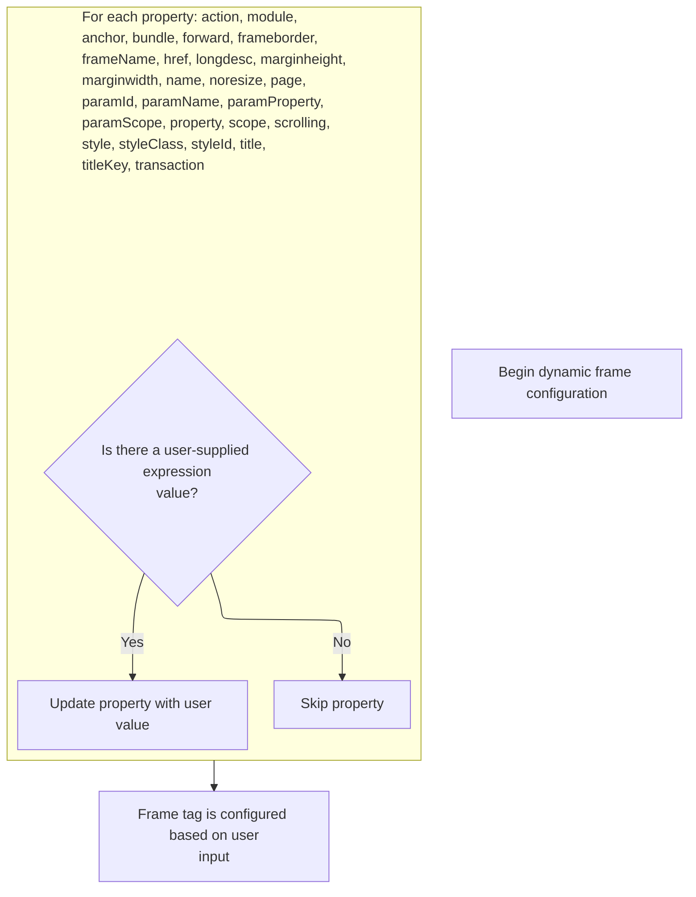

This document describes how tag attributes with dynamic expressions are evaluated and updated before the tag's main logic is executed. For both frame and resource tags, each attribute is checked for a user-supplied expression and, if present, the property is updated to enable dynamic configuration.

# Starting the Frame Tag Evaluation

<SwmSnippet path="/el/src/main/java/org/apache/strutsel/taglib/html/ELFrameTag.java" line="682">

---

In <SwmToken path="el/src/main/java/org/apache/strutsel/taglib/html/ELFrameTag.java" pos="682:5:5" line-data="    public int doStartTag() throws JspException {">`doStartTag`</SwmToken>, we immediately resolve all EL expressions for the tag's attributes. This is needed so the tag's properties are up-to-date before any further processing. That's why we call <SwmToken path="el/src/main/java/org/apache/strutsel/taglib/html/ELFrameTag.java" pos="683:1:1" line-data="        evaluateExpressions();">`evaluateExpressions`</SwmToken> next.

```java
    public int doStartTag() throws JspException {
        evaluateExpressions();

```

---

</SwmSnippet>

## Evaluating Frame Tag Expressions



<SwmSnippet path="/el/src/main/java/org/apache/strutsel/taglib/html/ELFrameTag.java" line="694">

---

In <SwmToken path="el/src/main/java/org/apache/strutsel/taglib/html/ELFrameTag.java" pos="694:5:5" line-data="    private void evaluateExpressions()">`evaluateExpressions`</SwmToken>, we go through each attribute, resolve its EL expression, and update the tag's state. When the module expression is present, we call <SwmToken path="el/src/main/java/org/apache/strutsel/taglib/html/ELFrameTag.java" pos="709:1:1" line-data="            setModule(string);">`setModule`</SwmToken> to store it, which means we need to handle any repository-specific constraints in <SwmToken path="core/src/main/java/org/apache/struts/config/ForwardConfig.java" pos="33:4:4" line-data="public class ForwardConfig extends BaseConfig {">`ForwardConfig`</SwmToken> next.

```java
    private void evaluateExpressions()
        throws JspException {
        String string = null;
        Integer integer = null;
        Boolean bool = null;

        if ((string =
                EvalHelper.evalString("action", getActionExpr(), this,
                    pageContext)) != null) {
            setAction(string);
        }

        if ((string =
                EvalHelper.evalString("module", getModuleExpr(), this,
                    pageContext)) != null) {
            setModule(string);
        }

```

---

</SwmSnippet>

<SwmSnippet path="/core/src/main/java/org/apache/struts/config/ForwardConfig.java" line="210">

---

<SwmToken path="core/src/main/java/org/apache/struts/config/ForwardConfig.java" pos="210:5:5" line-data="    public void setModule(String module) {">`setModule`</SwmToken> sets the module value, but only if the config isn't frozen. If 'configured' is true, it throws to enforce immutability after setup.

```java
    public void setModule(String module) {
        if (configured) {
            throw new IllegalStateException("Configuration is frozen");
        }

        this.module = module;
    }
```

---

</SwmSnippet>

<SwmSnippet path="/el/src/main/java/org/apache/strutsel/taglib/html/ELFrameTag.java" line="712">

---

Back in `ELFrameTag.evaluateExpressions`, after handling the module, we move on to evaluating and setting the anchor and bundle. We call <SwmToken path="el/src/main/java/org/apache/strutsel/taglib/html/ELFrameTag.java" pos="721:1:1" line-data="            setBundle(string);">`setBundle`</SwmToken> in <SwmToken path="core/src/main/java/org/apache/struts/config/ExceptionConfig.java" pos="34:4:4" line-data="public class ExceptionConfig extends BaseConfig {">`ExceptionConfig`</SwmToken> next to update the bundle value, which might be locked if the config is frozen.

```java
        if ((string =
                EvalHelper.evalString("anchor", getAnchorExpr(), this,
                    pageContext)) != null) {
            setAnchor(string);
        }

        if ((string =
                EvalHelper.evalString("bundle", getBundleExpr(), this,
                    pageContext)) != null) {
            setBundle(string);
        }

```

---

</SwmSnippet>

<SwmSnippet path="/core/src/main/java/org/apache/struts/config/ExceptionConfig.java" line="89">

---

<SwmToken path="core/src/main/java/org/apache/struts/config/ExceptionConfig.java" pos="89:5:5" line-data="    public void setBundle(String bundle) {">`setBundle`</SwmToken> sets the bundle value, but only if the config isn't frozen. If 'configured' is true, it throws to prevent changes after config is finalized.

```java
    public void setBundle(String bundle) {
        if (configured) {
            throw new IllegalStateException("Configuration is frozen");
        }

        this.bundle = bundle;
    }
```

---

</SwmSnippet>

<SwmSnippet path="/el/src/main/java/org/apache/strutsel/taglib/html/ELFrameTag.java" line="724">

---

Back in `ELFrameTag.evaluateExpressions`, after updating the bundle, we keep evaluating and setting other attributes. When we get to scope, we call <SwmToken path="el/src/main/java/org/apache/strutsel/taglib/html/ELFrameTag.java" pos="813:1:1" line-data="            setScope(string);">`setScope`</SwmToken> in <SwmToken path="core/src/main/java/org/apache/struts/config/ForwardConfig.java" pos="261:14:14" line-data="     * @param actionConfig The {@link ActionConfig} that this config is from,">`ActionConfig`</SwmToken> to update it, which might throw if the config is frozen.

```java
        if ((string =
                EvalHelper.evalString("forward", getForwardExpr(), this,
                    pageContext)) != null) {
            setForward(string);
        }

        if ((string =
                EvalHelper.evalString("frameborder", getFrameborderExpr(),
                    this, pageContext)) != null) {
            setFrameborder(string);
        }

        if ((string =
                EvalHelper.evalString("frameName", getFrameNameExpr(), this,
                    pageContext)) != null) {
            setFrameName(string);
        }

        if ((string =
                EvalHelper.evalString("href", getHrefExpr(), this, pageContext)) != null) {
            setHref(string);
        }

        if ((string =
                EvalHelper.evalString("longdesc", getLongdescExpr(), this,
                    pageContext)) != null) {
            setLongdesc(string);
        }

        if ((integer =
                EvalHelper.evalInteger("marginheight", getMarginheightExpr(),
                    this, pageContext)) != null) {
            setMarginheight(integer);
        }

        if ((integer =
                EvalHelper.evalInteger("marginwidth", getMarginwidthExpr(),
                    this, pageContext)) != null) {
            setMarginwidth(integer);
        }

        if ((string =
                EvalHelper.evalString("name", getNameExpr(), this, pageContext)) != null) {
            setName(string);
        }

        if ((bool =
                EvalHelper.evalBoolean("noresize", getNoresizeExpr(), this,
                    pageContext)) != null) {
            setNoresize(bool.booleanValue());
        }

        if ((string =
                EvalHelper.evalString("page", getPageExpr(), this, pageContext)) != null) {
            setPage(string);
        }

        if ((string =
                EvalHelper.evalString("paramId", getParamIdExpr(), this,
                    pageContext)) != null) {
            setParamId(string);
        }

        if ((string =
                EvalHelper.evalString("paramName", getParamNameExpr(), this,
                    pageContext)) != null) {
            setParamName(string);
        }

        if ((string =
                EvalHelper.evalString("paramProperty", getParamPropertyExpr(),
                    this, pageContext)) != null) {
            setParamProperty(string);
        }

        if ((string =
                EvalHelper.evalString("paramScope", getParamScopeExpr(), this,
                    pageContext)) != null) {
            setParamScope(string);
        }

        if ((string =
                EvalHelper.evalString("property", getPropertyExpr(), this,
                    pageContext)) != null) {
            setProperty(string);
        }

        if ((string =
                EvalHelper.evalString("scope", getScopeExpr(), this, pageContext)) != null) {
            setScope(string);
        }

```

---

</SwmSnippet>

<SwmSnippet path="/core/src/main/java/org/apache/struts/config/ActionConfig.java" line="652">

---

<SwmToken path="core/src/main/java/org/apache/struts/config/ActionConfig.java" pos="652:5:5" line-data="    public void setScope(String scope) {">`setScope`</SwmToken> sets the scope value, but only if the config isn't frozen. If 'configured' is true, it throws to prevent changes after config is finalized.

```java
    public void setScope(String scope) {
        if (configured) {
            throw new IllegalStateException("Configuration is frozen");
        }

        this.scope = scope;
    }
```

---

</SwmSnippet>

<SwmSnippet path="/el/src/main/java/org/apache/strutsel/taglib/html/ELFrameTag.java" line="816">

---

Back in `ELFrameTag.evaluateExpressions`, after handling scope, we finish up by evaluating and setting the rest of the tag's attributes. This way, all dynamic values are resolved before the tag is used.

```java
        if ((string =
                EvalHelper.evalString("scrolling", getScrollingExpr(), this,
                    pageContext)) != null) {
            setScrolling(string);
        }

        if ((string =
                EvalHelper.evalString("style", getStyleExpr(), this, pageContext)) != null) {
            setStyle(string);
        }

        if ((string =
                EvalHelper.evalString("styleClass", getStyleClassExpr(), this,
                    pageContext)) != null) {
            setStyleClass(string);
        }

        if ((string =
                EvalHelper.evalString("styleId", getStyleIdExpr(), this,
                    pageContext)) != null) {
            setStyleId(string);
        }

        if ((string =
                EvalHelper.evalString("title", getTitleExpr(), this, pageContext)) != null) {
            setTitle(string);
        }

        if ((string =
                EvalHelper.evalString("titleKey", getTitleKeyExpr(), this,
                    pageContext)) != null) {
            setTitleKey(string);
        }

        if ((bool =
                EvalHelper.evalBoolean("transaction", getTransactionExpr(),
                    this, pageContext)) != null) {
            setTransaction(bool.booleanValue());
        }
    }
```

---

</SwmSnippet>

## Delegating to Superclass Tag Logic

<SwmSnippet path="/el/src/main/java/org/apache/strutsel/taglib/html/ELFrameTag.java" line="685">

---

Back in `ELFrameTag.doStartTag`, after evaluating all expressions, we call the superclass's <SwmToken path="el/src/main/java/org/apache/strutsel/taglib/html/ELFrameTag.java" pos="685:6:6" line-data="        return (super.doStartTag());">`doStartTag`</SwmToken> for the actual tag processing. After this, we move to <SwmToken path="el/src/main/java/org/apache/strutsel/taglib/bean/ELResourceTag.java" pos="38:4:4" line-data="public class ELResourceTag extends ResourceTag {">`ELResourceTag`</SwmToken> for similar logic.

```java
        return (super.doStartTag());
    }
```

---

</SwmSnippet>

# Starting the Resource Tag Evaluation

<SwmSnippet path="/el/src/main/java/org/apache/strutsel/taglib/bean/ELResourceTag.java" line="120">

---

<SwmToken path="el/src/main/java/org/apache/strutsel/taglib/bean/ELResourceTag.java" pos="120:5:5" line-data="    public int doStartTag() throws JspException {">`doStartTag`</SwmToken> in <SwmToken path="el/src/main/java/org/apache/strutsel/taglib/bean/ELResourceTag.java" pos="38:4:4" line-data="public class ELResourceTag extends ResourceTag {">`ELResourceTag`</SwmToken> starts by evaluating all EL expressions for the tag's attributes, then delegates to the superclass for further processing.

```java
    public int doStartTag() throws JspException {
        evaluateExpressions();

        return (super.doStartTag());
    }
```

---

</SwmSnippet>

# Evaluating Resource Tag Expressions

```mermaid
%%{init: {"flowchart": {"defaultRenderer": "elk"}} }%%
flowchart TD
    node1["Evaluate expressions for resource
attributes"]
    click node1 openCode "el/src/main/java/org/apache/strutsel/taglib/bean/ELResourceTag.java:132:150"
    node1 --> node2{"'id' expression produces value?"}
    click node2 openCode "el/src/main/java/org/apache/strutsel/taglib/bean/ELResourceTag.java:136:139"
    node2 -->|"Yes"| node3["Update resource 'id'"]
    click node3 openCode "el/src/main/java/org/apache/strutsel/taglib/bean/ELResourceTag.java:138:139"
    node2 -->|"No"| node4{"'input' expression produces value?"}
    click node4 openCode "el/src/main/java/org/apache/strutsel/taglib/bean/ELResourceTag.java:141:144"
    node3 --> node4
    node4 -->|"Yes"| node5["Update resource 'input'"]
    click node5 openCode "el/src/main/java/org/apache/strutsel/taglib/bean/ELResourceTag.java:143:144"
    node4 -->|"No"| node6{"'name' expression produces value?"}
    click node6 openCode "el/src/main/java/org/apache/strutsel/taglib/bean/ELResourceTag.java:146:149"
    node5 --> node6
    node6 -->|"Yes"| node7["Update resource 'name'"]
    click node7 openCode "el/src/main/java/org/apache/strutsel/taglib/bean/ELResourceTag.java:148:149"
    node6 -->|"No"| node8["Done"]
    node7 --> node8
    click node8 openCode "el/src/main/java/org/apache/strutsel/taglib/bean/ELResourceTag.java:150:150"

classDef HeadingStyle fill:#777777,stroke:#333,stroke-width:2px;

%% Swimm:
%% %%{init: {"flowchart": {"defaultRenderer": "elk"}} }%%
%% flowchart TD
%%     node1["Evaluate expressions for resource
%% attributes"]
%%     click node1 openCode "<SwmPath>[el/…/bean/ELResourceTag.java](el/src/main/java/org/apache/strutsel/taglib/bean/ELResourceTag.java)</SwmPath>:132:150"
%%     node1 --> node2{"'id' expression produces value?"}
%%     click node2 openCode "<SwmPath>[el/…/bean/ELResourceTag.java](el/src/main/java/org/apache/strutsel/taglib/bean/ELResourceTag.java)</SwmPath>:136:139"
%%     node2 -->|"Yes"| node3["Update resource 'id'"]
%%     click node3 openCode "<SwmPath>[el/…/bean/ELResourceTag.java](el/src/main/java/org/apache/strutsel/taglib/bean/ELResourceTag.java)</SwmPath>:138:139"
%%     node2 -->|"No"| node4{"'input' expression produces value?"}
%%     click node4 openCode "<SwmPath>[el/…/bean/ELResourceTag.java](el/src/main/java/org/apache/strutsel/taglib/bean/ELResourceTag.java)</SwmPath>:141:144"
%%     node3 --> node4
%%     node4 -->|"Yes"| node5["Update resource 'input'"]
%%     click node5 openCode "<SwmPath>[el/…/bean/ELResourceTag.java](el/src/main/java/org/apache/strutsel/taglib/bean/ELResourceTag.java)</SwmPath>:143:144"
%%     node4 -->|"No"| node6{"'name' expression produces value?"}
%%     click node6 openCode "<SwmPath>[el/…/bean/ELResourceTag.java](el/src/main/java/org/apache/strutsel/taglib/bean/ELResourceTag.java)</SwmPath>:146:149"
%%     node5 --> node6
%%     node6 -->|"Yes"| node7["Update resource 'name'"]
%%     click node7 openCode "<SwmPath>[el/…/bean/ELResourceTag.java](el/src/main/java/org/apache/strutsel/taglib/bean/ELResourceTag.java)</SwmPath>:148:149"
%%     node6 -->|"No"| node8["Done"]
%%     node7 --> node8
%%     click node8 openCode "<SwmPath>[el/…/bean/ELResourceTag.java](el/src/main/java/org/apache/strutsel/taglib/bean/ELResourceTag.java)</SwmPath>:150:150"
%% 
%% classDef HeadingStyle fill:#777777,stroke:#333,stroke-width:2px;
```



<SwmSnippet path="/el/src/main/java/org/apache/strutsel/taglib/bean/ELResourceTag.java" line="132">

---

In <SwmToken path="el/src/main/java/org/apache/strutsel/taglib/bean/ELResourceTag.java" pos="132:5:5" line-data="    private void evaluateExpressions()">`evaluateExpressions`</SwmToken>, we resolve EL expressions for id and input. If input is present, we call <SwmToken path="el/src/main/java/org/apache/strutsel/taglib/bean/ELResourceTag.java" pos="143:1:1" line-data="            setInput(string);">`setInput`</SwmToken> to update it, which may enforce immutability in <SwmToken path="core/src/main/java/org/apache/struts/config/ForwardConfig.java" pos="261:14:14" line-data="     * @param actionConfig The {@link ActionConfig} that this config is from,">`ActionConfig`</SwmToken> next.

```java
    private void evaluateExpressions()
        throws JspException {
        String string = null;

        if ((string =
                EvalHelper.evalString("id", getIdExpr(), this, pageContext)) != null) {
            setId(string);
        }

        if ((string =
                EvalHelper.evalString("input", getInputExpr(), this, pageContext)) != null) {
            setInput(string);
        }

```

---

</SwmSnippet>

<SwmSnippet path="/core/src/main/java/org/apache/struts/config/ActionConfig.java" line="473">

---

<SwmToken path="core/src/main/java/org/apache/struts/config/ActionConfig.java" pos="473:5:5" line-data="    public void setInput(String input) {">`setInput`</SwmToken> sets the input value, but only if the config isn't frozen. If 'configured' is true, it throws to prevent changes after config is finalized.

```java
    public void setInput(String input) {
        if (configured) {
            throw new IllegalStateException("Configuration is frozen");
        }

        this.input = input;
    }
```

---

</SwmSnippet>

<SwmSnippet path="/el/src/main/java/org/apache/strutsel/taglib/bean/ELResourceTag.java" line="146">

---

Back in `ELResourceTag.evaluateExpressions`, after updating input, we finish by evaluating and setting the name attribute so all dynamic values are resolved before the tag is used.

```java
        if ((string =
                EvalHelper.evalString("name", getNameExpr(), this, pageContext)) != null) {
            setName(string);
        }
    }
```

---

</SwmSnippet>

&nbsp;

*This is an auto-generated document by Swimm 🌊 and has not yet been verified by a human*

<SwmMeta version="3.0.0" repo-id="Z2l0aHViJTNBJTNBc3RydXRzMSUzQSUzQVN3aW1tLURlbW8=" repo-name="struts1"><sup>Powered by [Swimm](https://app.swimm.io/)</sup></SwmMeta>
