This document describes how tag attributes with dynamic expressions are evaluated and applied to enable flexible configuration in JSP pages. The flow receives tag attributes, evaluates any expressions, updates the configuration, and then continues with tag processing.

# Starting the Redirect Tag Evaluation

<SwmSnippet path="/el/src/main/java/org/apache/strutsel/taglib/logic/ELRedirectTag.java" line="372">

---

In <SwmToken path="el/src/main/java/org/apache/strutsel/taglib/logic/ELRedirectTag.java" pos="372:5:5" line-data="    public int doStartTag() throws JspException {">`doStartTag`</SwmToken>, we kick off by evaluating any EL expressions tied to the tag's attributes. This ensures all dynamic values are resolved before the redirect logic continues. We call <SwmToken path="el/src/main/java/org/apache/strutsel/taglib/logic/ELRedirectTag.java" pos="373:1:1" line-data="        evaluateExpressions();">`evaluateExpressions`</SwmToken> next to handle this resolution step.

```java
    public int doStartTag() throws JspException {
        evaluateExpressions();

```

---

</SwmSnippet>

## Evaluating Redirect Tag Expressions

```mermaid
%%{init: {"flowchart": {"defaultRenderer": "elk"}} }%%
flowchart TD
    node1["Start: Evaluate redirect expressions"]
    click node1 openCode "el/src/main/java/org/apache/strutsel/taglib/logic/ELRedirectTag.java:384:385"
    subgraph loop1["For each redirect parameter (action,
anchor, forward, href, name, page,
paramId, paramName, paramProperty,
paramScope, property, scope,
transaction, useLocalEncoding)"]
        node1 --> node2{"Does the parameter's expression evaluate
to a value?"}
        click node2 openCode "el/src/main/java/org/apache/strutsel/taglib/logic/ELRedirectTag.java:389:467"
        node2 -->|"Yes"| node3["Update redirect configuration for
parameter"]
        click node3 openCode "el/src/main/java/org/apache/strutsel/taglib/logic/ELRedirectTag.java:392:466"
        node2 -->|"No"| node4["Skip update"]
        click node4 openCode "el/src/main/java/org/apache/strutsel/taglib/logic/ELRedirectTag.java:389:467"
        node3 --> node5["Next parameter"]
        node4 --> node5
        node5 --> node2
    end
    node5 -->|"No more parameters"| node6["All parameters processed"]
    click node6 openCode "el/src/main/java/org/apache/strutsel/taglib/logic/ELRedirectTag.java:468:468"
    node6 --> node7["End"]
    click node7 openCode "el/src/main/java/org/apache/strutsel/taglib/logic/ELRedirectTag.java:468:468"

classDef HeadingStyle fill:#777777,stroke:#333,stroke-width:2px;

%% Swimm:
%% %%{init: {"flowchart": {"defaultRenderer": "elk"}} }%%
%% flowchart TD
%%     node1["Start: Evaluate redirect expressions"]
%%     click node1 openCode "<SwmPath>[el/…/logic/ELRedirectTag.java](el/src/main/java/org/apache/strutsel/taglib/logic/ELRedirectTag.java)</SwmPath>:384:385"
%%     subgraph loop1["For each redirect parameter (action,
%% anchor, forward, href, name, page,
%% <SwmToken path="el/src/main/java/org/apache/strutsel/taglib/logic/ELRedirectTag.java" pos="423:6:6" line-data="                EvalHelper.evalString(&quot;paramId&quot;, getParamIdExpr(), this,">`paramId`</SwmToken>, <SwmToken path="el/src/main/java/org/apache/strutsel/taglib/logic/ELRedirectTag.java" pos="429:6:6" line-data="                EvalHelper.evalString(&quot;paramName&quot;, getParamNameExpr(), this,">`paramName`</SwmToken>, <SwmToken path="el/src/main/java/org/apache/strutsel/taglib/logic/ELRedirectTag.java" pos="435:6:6" line-data="                EvalHelper.evalString(&quot;paramProperty&quot;, getParamPropertyExpr(),">`paramProperty`</SwmToken>,
%% <SwmToken path="el/src/main/java/org/apache/strutsel/taglib/logic/ELRedirectTag.java" pos="441:6:6" line-data="                EvalHelper.evalString(&quot;paramScope&quot;, getParamScopeExpr(), this,">`paramScope`</SwmToken>, property, scope,
%% transaction, <SwmToken path="el/src/main/java/org/apache/strutsel/taglib/logic/ELRedirectTag.java" pos="464:6:6" line-data="                EvalHelper.evalBoolean(&quot;useLocalEncoding&quot;,">`useLocalEncoding`</SwmToken>)"]
%%         node1 --> node2{"Does the parameter's expression evaluate
%% to a value?"}
%%         click node2 openCode "<SwmPath>[el/…/logic/ELRedirectTag.java](el/src/main/java/org/apache/strutsel/taglib/logic/ELRedirectTag.java)</SwmPath>:389:467"
%%         node2 -->|"Yes"| node3["Update redirect configuration for
%% parameter"]
%%         click node3 openCode "<SwmPath>[el/…/logic/ELRedirectTag.java](el/src/main/java/org/apache/strutsel/taglib/logic/ELRedirectTag.java)</SwmPath>:392:466"
%%         node2 -->|"No"| node4["Skip update"]
%%         click node4 openCode "<SwmPath>[el/…/logic/ELRedirectTag.java](el/src/main/java/org/apache/strutsel/taglib/logic/ELRedirectTag.java)</SwmPath>:389:467"
%%         node3 --> node5["Next parameter"]
%%         node4 --> node5
%%         node5 --> node2
%%     end
%%     node5 -->|"No more parameters"| node6["All parameters processed"]
%%     click node6 openCode "<SwmPath>[el/…/logic/ELRedirectTag.java](el/src/main/java/org/apache/strutsel/taglib/logic/ELRedirectTag.java)</SwmPath>:468:468"
%%     node6 --> node7["End"]
%%     click node7 openCode "<SwmPath>[el/…/logic/ELRedirectTag.java](el/src/main/java/org/apache/strutsel/taglib/logic/ELRedirectTag.java)</SwmPath>:468:468"
%% 
%% classDef HeadingStyle fill:#777777,stroke:#333,stroke-width:2px;
```



<SwmSnippet path="/el/src/main/java/org/apache/strutsel/taglib/logic/ELRedirectTag.java" line="384">

---

In <SwmToken path="el/src/main/java/org/apache/strutsel/taglib/logic/ELRedirectTag.java" pos="384:5:5" line-data="    private void evaluateExpressions()">`evaluateExpressions`</SwmToken>, we resolve each possible EL expression for the tag's attributes. When we hit the 'scope' attribute, we need to set it on the config object, so we call into the config logic to update the scope accordingly.

```java
    private void evaluateExpressions()
        throws JspException {
        String string = null;
        Boolean bool = null;

        if ((string =
                EvalHelper.evalString("action", getActionExpr(), this,
                    pageContext)) != null) {
            setAction(string);
        }

        if ((string =
                EvalHelper.evalString("anchor", getAnchorExpr(), this,
                    pageContext)) != null) {
            setAnchor(string);
        }

        if ((string =
                EvalHelper.evalString("forward", getForwardExpr(), this,
                    pageContext)) != null) {
            setForward(string);
        }

        if ((string =
                EvalHelper.evalString("href", getHrefExpr(), this, pageContext)) != null) {
            setHref(string);
        }

        if ((string =
                EvalHelper.evalString("name", getNameExpr(), this, pageContext)) != null) {
            setName(string);
        }

        if ((string =
                EvalHelper.evalString("page", getPageExpr(), this, pageContext)) != null) {
            setPage(string);
        }

        if ((string =
                EvalHelper.evalString("paramId", getParamIdExpr(), this,
                    pageContext)) != null) {
            setParamId(string);
        }

        if ((string =
                EvalHelper.evalString("paramName", getParamNameExpr(), this,
                    pageContext)) != null) {
            setParamName(string);
        }

        if ((string =
                EvalHelper.evalString("paramProperty", getParamPropertyExpr(),
                    this, pageContext)) != null) {
            setParamProperty(string);
        }

        if ((string =
                EvalHelper.evalString("paramScope", getParamScopeExpr(), this,
                    pageContext)) != null) {
            setParamScope(string);
        }

        if ((string =
                EvalHelper.evalString("property", getPropertyExpr(), this,
                    pageContext)) != null) {
            setProperty(string);
        }

        if ((string =
                EvalHelper.evalString("scope", getScopeExpr(), this, pageContext)) != null) {
            setScope(string);
        }

```

---

</SwmSnippet>

<SwmSnippet path="/core/src/main/java/org/apache/struts/config/ActionConfig.java" line="652">

---

<SwmToken path="core/src/main/java/org/apache/struts/config/ActionConfig.java" pos="652:5:5" line-data="    public void setScope(String scope) {">`setScope`</SwmToken> checks if the config is already finalized (using the 'configured' flag). If it is, it blocks any changes by throwing an exception. This prevents accidental changes to the redirect's scope after the setup phase.

```java
    public void setScope(String scope) {
        if (configured) {
            throw new IllegalStateException("Configuration is frozen");
        }

        this.scope = scope;
    }
```

---

</SwmSnippet>

<SwmSnippet path="/el/src/main/java/org/apache/strutsel/taglib/logic/ELRedirectTag.java" line="457">

---

After updating the config with the scope, `ELRedirectTag.evaluateExpressions` moves on to resolve boolean attributes like 'transaction' and <SwmToken path="el/src/main/java/org/apache/strutsel/taglib/logic/ELRedirectTag.java" pos="464:6:6" line-data="                EvalHelper.evalBoolean(&quot;useLocalEncoding&quot;,">`useLocalEncoding`</SwmToken>. We call into <SwmToken path="el/src/main/java/org/apache/strutsel/taglib/logic/ELRedirectTag.java" pos="458:1:1" line-data="                EvalHelper.evalBoolean(&quot;transaction&quot;, getTransactionExpr(),">`EvalHelper`</SwmToken> to handle the EL evaluation and type conversion for these fields.

```java
        if ((bool =
                EvalHelper.evalBoolean("transaction", getTransactionExpr(),
                    this, pageContext)) != null) {
            setTransaction(bool.booleanValue());
        }

        if ((bool =
                EvalHelper.evalBoolean("useLocalEncoding",
                    getUseLocalEncodingExpr(), this, pageContext)) != null) {
            setUseLocalEncoding(bool.booleanValue());
        }
    }
```

---

</SwmSnippet>

<SwmSnippet path="/el/src/main/java/org/apache/strutsel/taglib/utils/EvalHelper.java" line="102">

---

<SwmToken path="el/src/main/java/org/apache/strutsel/taglib/utils/EvalHelper.java" pos="102:7:7" line-data="    public static Boolean evalBoolean(String attrName, String attrValue,">`evalBoolean`</SwmToken> takes the attribute's EL string and uses the <SwmToken path="el/src/main/java/org/apache/strutsel/taglib/utils/EvalHelper.java" pos="109:1:1" line-data="                ExpressionEvaluatorManager.evaluate(attrName, attrValue,">`ExpressionEvaluatorManager`</SwmToken> to turn it into a Boolean. If the string is null, it just returns null. No validation—if the expression is bad, you'll get an exception.

```java
    public static Boolean evalBoolean(String attrName, String attrValue,
        Tag tagObject, PageContext pageContext)
        throws JspException {
        Object result = null;

        if (attrValue != null) {
            result =
                ExpressionEvaluatorManager.evaluate(attrName, attrValue,
                    Boolean.class, tagObject, pageContext);
        }

        return ((Boolean) result);
    }
```

---

</SwmSnippet>

## Completing the Redirect Tag Processing

<SwmSnippet path="/el/src/main/java/org/apache/strutsel/taglib/logic/ELRedirectTag.java" line="375">

---

After finishing up in `ELRedirectTag.evaluateExpressions`, <SwmToken path="el/src/main/java/org/apache/strutsel/taglib/logic/ELRedirectTag.java" pos="375:6:6" line-data="        return (super.doStartTag());">`doStartTag`</SwmToken> hands off to the superclass to run the main redirect logic. All EL-specific work is done by this point.

```java
        return (super.doStartTag());
    }
```

---

</SwmSnippet>

# Starting the Resource Tag Evaluation

<SwmSnippet path="/el/src/main/java/org/apache/strutsel/taglib/bean/ELResourceTag.java" line="120">

---

<SwmToken path="el/src/main/java/org/apache/strutsel/taglib/bean/ELResourceTag.java" pos="120:5:5" line-data="    public int doStartTag() throws JspException {">`doStartTag`</SwmToken> in the resource tag starts by resolving any EL expressions for its attributes. We call <SwmToken path="el/src/main/java/org/apache/strutsel/taglib/bean/ELResourceTag.java" pos="121:1:1" line-data="        evaluateExpressions();">`evaluateExpressions`</SwmToken> to make sure all dynamic values are set before the tag does its main work.

```java
    public int doStartTag() throws JspException {
        evaluateExpressions();

        return (super.doStartTag());
    }
```

---

</SwmSnippet>

# Evaluating Resource Tag Expressions

```mermaid
%%{init: {"flowchart": {"defaultRenderer": "elk"}} }%%
flowchart TD
    node1["Start expression evaluation"]
    click node1 openCode "el/src/main/java/org/apache/strutsel/taglib/bean/ELResourceTag.java:132:135"
    node1 --> node2{"Is 'id' expression non-null?"}
    click node2 openCode "el/src/main/java/org/apache/strutsel/taglib/bean/ELResourceTag.java:136:139"
    node2 -->|"Yes"| node3["Set resource ID"]
    click node3 openCode "el/src/main/java/org/apache/strutsel/taglib/bean/ELResourceTag.java:138:139"
    node2 -->|"No"| node4{"Is 'input' expression non-null?"}
    node3 --> node4
    click node4 openCode "el/src/main/java/org/apache/strutsel/taglib/bean/ELResourceTag.java:141:144"
    node4 -->|"Yes"| node5["Set resource input"]
    click node5 openCode "el/src/main/java/org/apache/strutsel/taglib/bean/ELResourceTag.java:143:144"
    node4 -->|"No"| node6{"Is 'name' expression non-null?"}
    node5 --> node6
    click node6 openCode "el/src/main/java/org/apache/strutsel/taglib/bean/ELResourceTag.java:146:149"
    node6 -->|"Yes"| node7["Set resource name"]
    click node7 openCode "el/src/main/java/org/apache/strutsel/taglib/bean/ELResourceTag.java:148:149"
    node6 -->|"No"| node8["End of evaluation"]
    node7 --> node8
    click node8 openCode "el/src/main/java/org/apache/strutsel/taglib/bean/ELResourceTag.java:150:150"

classDef HeadingStyle fill:#777777,stroke:#333,stroke-width:2px;

%% Swimm:
%% %%{init: {"flowchart": {"defaultRenderer": "elk"}} }%%
%% flowchart TD
%%     node1["Start expression evaluation"]
%%     click node1 openCode "<SwmPath>[el/…/bean/ELResourceTag.java](el/src/main/java/org/apache/strutsel/taglib/bean/ELResourceTag.java)</SwmPath>:132:135"
%%     node1 --> node2{"Is 'id' expression non-null?"}
%%     click node2 openCode "<SwmPath>[el/…/bean/ELResourceTag.java](el/src/main/java/org/apache/strutsel/taglib/bean/ELResourceTag.java)</SwmPath>:136:139"
%%     node2 -->|"Yes"| node3["Set resource ID"]
%%     click node3 openCode "<SwmPath>[el/…/bean/ELResourceTag.java](el/src/main/java/org/apache/strutsel/taglib/bean/ELResourceTag.java)</SwmPath>:138:139"
%%     node2 -->|"No"| node4{"Is 'input' expression non-null?"}
%%     node3 --> node4
%%     click node4 openCode "<SwmPath>[el/…/bean/ELResourceTag.java](el/src/main/java/org/apache/strutsel/taglib/bean/ELResourceTag.java)</SwmPath>:141:144"
%%     node4 -->|"Yes"| node5["Set resource input"]
%%     click node5 openCode "<SwmPath>[el/…/bean/ELResourceTag.java](el/src/main/java/org/apache/strutsel/taglib/bean/ELResourceTag.java)</SwmPath>:143:144"
%%     node4 -->|"No"| node6{"Is 'name' expression non-null?"}
%%     node5 --> node6
%%     click node6 openCode "<SwmPath>[el/…/bean/ELResourceTag.java](el/src/main/java/org/apache/strutsel/taglib/bean/ELResourceTag.java)</SwmPath>:146:149"
%%     node6 -->|"Yes"| node7["Set resource name"]
%%     click node7 openCode "<SwmPath>[el/…/bean/ELResourceTag.java](el/src/main/java/org/apache/strutsel/taglib/bean/ELResourceTag.java)</SwmPath>:148:149"
%%     node6 -->|"No"| node8["End of evaluation"]
%%     node7 --> node8
%%     click node8 openCode "<SwmPath>[el/…/bean/ELResourceTag.java](el/src/main/java/org/apache/strutsel/taglib/bean/ELResourceTag.java)</SwmPath>:150:150"
%% 
%% classDef HeadingStyle fill:#777777,stroke:#333,stroke-width:2px;
```



<SwmSnippet path="/el/src/main/java/org/apache/strutsel/taglib/bean/ELResourceTag.java" line="132">

---

In <SwmToken path="el/src/main/java/org/apache/strutsel/taglib/bean/ELResourceTag.java" pos="132:5:5" line-data="    private void evaluateExpressions()">`evaluateExpressions`</SwmToken>, we resolve EL for each attribute. When we get to 'input', we need to update the config, so we call into the config logic to set the input value.

```java
    private void evaluateExpressions()
        throws JspException {
        String string = null;

        if ((string =
                EvalHelper.evalString("id", getIdExpr(), this, pageContext)) != null) {
            setId(string);
        }

        if ((string =
                EvalHelper.evalString("input", getInputExpr(), this, pageContext)) != null) {
            setInput(string);
        }

```

---

</SwmSnippet>

<SwmSnippet path="/core/src/main/java/org/apache/struts/config/ActionConfig.java" line="473">

---

<SwmToken path="core/src/main/java/org/apache/struts/config/ActionConfig.java" pos="473:5:5" line-data="    public void setInput(String input) {">`setInput`</SwmToken> checks if the config is locked (using 'configured'). If it is, it throws, so you can't change the input after setup. This keeps the config stable after initialization.

```java
    public void setInput(String input) {
        if (configured) {
            throw new IllegalStateException("Configuration is frozen");
        }

        this.input = input;
    }
```

---

</SwmSnippet>

<SwmSnippet path="/el/src/main/java/org/apache/strutsel/taglib/bean/ELResourceTag.java" line="146">

---

After updating the config with the input value, `ELResourceTag.evaluateExpressions` keeps going to resolve the 'name' attribute. Each attribute is handled separately so all dynamic values are set.

```java
        if ((string =
                EvalHelper.evalString("name", getNameExpr(), this, pageContext)) != null) {
            setName(string);
        }
    }
```

---

</SwmSnippet>

&nbsp;

*This is an auto-generated document by Swimm 🌊 and has not yet been verified by a human*

<SwmMeta version="3.0.0" repo-id="Z2l0aHViJTNBJTNBc3RydXRzMSUzQSUzQVN3aW1tLURlbW8=" repo-name="struts1"><sup>Powered by [Swimm](https://app.swimm.io/)</sup></SwmMeta>
