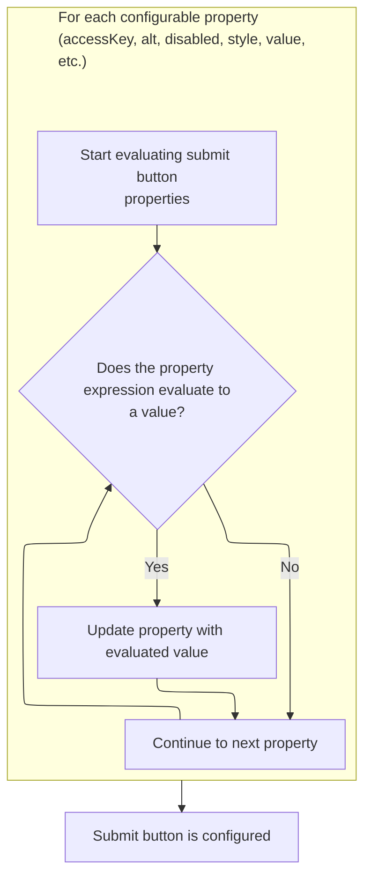
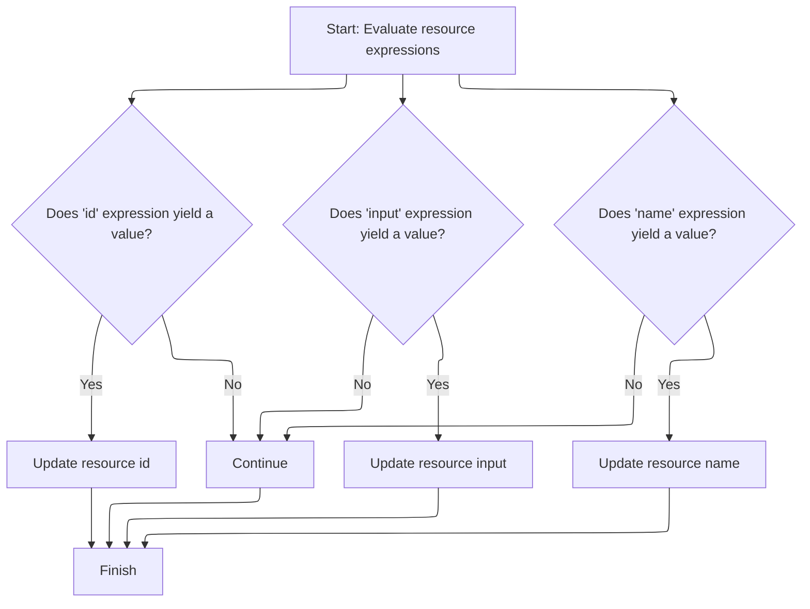

This document describes how dynamic attributes for a tag are resolved before the tag is processed. Expressions are evaluated and the resulting values are applied to the tag, enabling flexible and dynamic page rendering.

# Starting the Submit Tag Evaluation

<SwmSnippet path="/el/src/main/java/org/apache/strutsel/taglib/html/ELSubmitTag.java" line="717">

---

In <SwmToken path="el/src/main/java/org/apache/strutsel/taglib/html/ELSubmitTag.java" pos="717:5:5" line-data="    public int doStartTag() throws JspException {">`doStartTag`</SwmToken>, we kick things off by evaluating all EL-based attributes for the tag. Calling <SwmToken path="el/src/main/java/org/apache/strutsel/taglib/html/ELSubmitTag.java" pos="718:1:1" line-data="        evaluateExpressions();">`evaluateExpressions`</SwmToken> here means any dynamic values are resolved before the tag does its main work.

```java
    public int doStartTag() throws JspException {
        evaluateExpressions();

```

---

</SwmSnippet>

## Evaluating Submit Tag Expressions



<SwmSnippet path="/el/src/main/java/org/apache/strutsel/taglib/html/ELSubmitTag.java" line="729">

---

In <SwmToken path="el/src/main/java/org/apache/strutsel/taglib/html/ELSubmitTag.java" pos="729:5:5" line-data="    private void evaluateExpressions()">`evaluateExpressions`</SwmToken>, we loop through and resolve each EL attribute for the submit tag. When we hit the 'bundle' attribute, we need to call <SwmToken path="el/src/main/java/org/apache/strutsel/taglib/html/ELSubmitTag.java" pos="754:1:1" line-data="            setBundle(string);">`setBundle`</SwmToken> (from <SwmToken path="core/src/main/java/org/apache/struts/config/ExceptionConfig.java" pos="34:4:4" line-data="public class ExceptionConfig extends BaseConfig {">`ExceptionConfig`</SwmToken>) to actually assign the resolved bundle, which might enforce some config rules.

```java
    private void evaluateExpressions()
        throws JspException {
        String string = null;
        Boolean bool = null;

        if ((string =
                EvalHelper.evalString("accessKey", getAccesskeyExpr(), this,
                    pageContext)) != null) {
            setAccesskey(string);
        }

        if ((string =
                EvalHelper.evalString("alt", getAltExpr(), this, pageContext)) != null) {
            setAlt(string);
        }

        if ((string =
                EvalHelper.evalString("altKey", getAltKeyExpr(), this,
                    pageContext)) != null) {
            setAltKey(string);
        }

        if ((string =
                EvalHelper.evalString("bundle", getBundleExpr(), this,
                    pageContext)) != null) {
            setBundle(string);
        }

```

---

</SwmSnippet>

<SwmSnippet path="/core/src/main/java/org/apache/struts/config/ExceptionConfig.java" line="89">

---

<SwmToken path="core/src/main/java/org/apache/struts/config/ExceptionConfig.java" pos="89:5:5" line-data="    public void setBundle(String bundle) {">`setBundle`</SwmToken> doesn't just set the bundle—it checks if the config is frozen (via the 'configured' flag) and blocks changes if so. This keeps the config immutable after setup, so you can't mess with it later in the lifecycle.

```java
    public void setBundle(String bundle) {
        if (configured) {
            throw new IllegalStateException("Configuration is frozen");
        }

        this.bundle = bundle;
    }
```

---

</SwmSnippet>

<SwmSnippet path="/el/src/main/java/org/apache/strutsel/taglib/html/ELSubmitTag.java" line="757">

---

Back in `ELSubmitTag.evaluateExpressions`, after setting the bundle, we keep resolving other attributes. For boolean ones like 'disabled' and 'indexed', we call <SwmToken path="el/src/main/java/org/apache/strutsel/taglib/html/ELSubmitTag.java" pos="764:1:3" line-data="                EvalHelper.evalBoolean(&quot;disabled&quot;, getDisabledExpr(), this,">`EvalHelper.evalBoolean`</SwmToken> to get the right type before setting them on the tag.

```java
        if ((string =
        		EvalHelper.evalString("dir", getDirExpr(), this,
        			pageContext)) != null) {
        	setDir(string);
        }
        
        if ((bool =
                EvalHelper.evalBoolean("disabled", getDisabledExpr(), this,
                    pageContext)) != null) {
            setDisabled(bool.booleanValue());
        }

        if ((string =
            	EvalHelper.evalString("lang", getLangExpr(), this,
            		pageContext)) != null) {
        	setLang(string);
        }

        if ((bool =
                EvalHelper.evalBoolean("indexed", getIndexedExpr(), this,
                    pageContext)) != null) {
            setIndexed(bool.booleanValue());
        }

```

---

</SwmSnippet>

<SwmSnippet path="/el/src/main/java/org/apache/strutsel/taglib/utils/EvalHelper.java" line="102">

---

<SwmToken path="el/src/main/java/org/apache/strutsel/taglib/utils/EvalHelper.java" pos="102:7:7" line-data="    public static Boolean evalBoolean(String attrName, String attrValue,">`evalBoolean`</SwmToken> hands off the actual expression evaluation to <SwmToken path="el/src/main/java/org/apache/strutsel/taglib/utils/EvalHelper.java" pos="109:1:1" line-data="                ExpressionEvaluatorManager.evaluate(attrName, attrValue,">`ExpressionEvaluatorManager`</SwmToken>, expecting a Boolean result. It doesn't check the input—just assumes it's a valid boolean expression and returns whatever the evaluator gives back.

```java
    public static Boolean evalBoolean(String attrName, String attrValue,
        Tag tagObject, PageContext pageContext)
        throws JspException {
        Object result = null;

        if (attrValue != null) {
            result =
                ExpressionEvaluatorManager.evaluate(attrName, attrValue,
                    Boolean.class, tagObject, pageContext);
        }

        return ((Boolean) result);
    }
```

---

</SwmSnippet>

<SwmSnippet path="/el/src/main/java/org/apache/strutsel/taglib/html/ELSubmitTag.java" line="781">

---

After coming back from <SwmToken path="el/src/main/java/org/apache/strutsel/taglib/html/ELSubmitTag.java" pos="782:1:1" line-data="                EvalHelper.evalString(&quot;onblur&quot;, getOnblurExpr(), this,">`EvalHelper`</SwmToken>, we finish up `ELSubmitTag.evaluateExpressions` by resolving all the remaining EL attributes—one by one—so the tag ends up with whatever values are set in the page context.

```java
        if ((string =
                EvalHelper.evalString("onblur", getOnblurExpr(), this,
                    pageContext)) != null) {
            setOnblur(string);
        }

        if ((string =
                EvalHelper.evalString("onchange", getOnchangeExpr(), this,
                    pageContext)) != null) {
            setOnchange(string);
        }

        if ((string =
                EvalHelper.evalString("onclick", getOnclickExpr(), this,
                    pageContext)) != null) {
            setOnclick(string);
        }

        if ((string =
                EvalHelper.evalString("ondblclick", getOndblclickExpr(), this,
                    pageContext)) != null) {
            setOndblclick(string);
        }

        if ((string =
                EvalHelper.evalString("onfocus", getOnfocusExpr(), this,
                    pageContext)) != null) {
            setOnfocus(string);
        }

        if ((string =
                EvalHelper.evalString("onkeydown", getOnkeydownExpr(), this,
                    pageContext)) != null) {
            setOnkeydown(string);
        }

        if ((string =
                EvalHelper.evalString("onkeypress", getOnkeypressExpr(), this,
                    pageContext)) != null) {
            setOnkeypress(string);
        }

        if ((string =
                EvalHelper.evalString("onkeyup", getOnkeyupExpr(), this,
                    pageContext)) != null) {
            setOnkeyup(string);
        }

        if ((string =
                EvalHelper.evalString("onmousedown", getOnmousedownExpr(),
                    this, pageContext)) != null) {
            setOnmousedown(string);
        }

        if ((string =
                EvalHelper.evalString("onmousemove", getOnmousemoveExpr(),
                    this, pageContext)) != null) {
            setOnmousemove(string);
        }

        if ((string =
                EvalHelper.evalString("onmouseout", getOnmouseoutExpr(), this,
                    pageContext)) != null) {
            setOnmouseout(string);
        }

        if ((string =
                EvalHelper.evalString("onmouseover", getOnmouseoverExpr(),
                    this, pageContext)) != null) {
            setOnmouseover(string);
        }

        if ((string =
                EvalHelper.evalString("onmouseup", getOnmouseupExpr(), this,
                    pageContext)) != null) {
            setOnmouseup(string);
        }

        if ((string =
                EvalHelper.evalString("property", getPropertyExpr(), this,
                    pageContext)) != null) {
            setProperty(string);
        }

        if ((string =
                EvalHelper.evalString("style", getStyleExpr(), this, pageContext)) != null) {
            setStyle(string);
        }

        if ((string =
                EvalHelper.evalString("styleClass", getStyleClassExpr(), this,
                    pageContext)) != null) {
            setStyleClass(string);
        }

        if ((string =
                EvalHelper.evalString("styleId", getStyleIdExpr(), this,
                    pageContext)) != null) {
            setStyleId(string);
        }

        if ((string =
                EvalHelper.evalString("tabindex", getTabindexExpr(), this,
                    pageContext)) != null) {
            setTabindex(string);
        }

        if ((string =
                EvalHelper.evalString("title", getTitleExpr(), this, pageContext)) != null) {
            setTitle(string);
        }

        if ((string =
                EvalHelper.evalString("titleKey", getTitleKeyExpr(), this,
                    pageContext)) != null) {
            setTitleKey(string);
        }

        if ((string =
                EvalHelper.evalString("value", getValueExpr(), this, pageContext)) != null) {
            setValue(string);
        }
    }
```

---

</SwmSnippet>

## Delegating to Parent Tag Logic

<SwmSnippet path="/el/src/main/java/org/apache/strutsel/taglib/html/ELSubmitTag.java" line="720">

---

Back in `ELSubmitTag.doStartTag`, after evaluating all the expressions, we hand off to the parent tag logic by calling <SwmToken path="el/src/main/java/org/apache/strutsel/taglib/html/ELSubmitTag.java" pos="720:4:6" line-data="        return (super.doStartTag());">`super.doStartTag`</SwmToken>. This triggers the standard tag processing, now with all the dynamic values set.

```java
        return (super.doStartTag());
    }
```

---

</SwmSnippet>

# Starting the Resource Tag Evaluation

<SwmSnippet path="/el/src/main/java/org/apache/strutsel/taglib/bean/ELResourceTag.java" line="120">

---

<SwmToken path="el/src/main/java/org/apache/strutsel/taglib/bean/ELResourceTag.java" pos="120:5:5" line-data="    public int doStartTag() throws JspException {">`doStartTag`</SwmToken> in <SwmToken path="el/src/main/java/org/apache/strutsel/taglib/bean/ELResourceTag.java" pos="38:4:4" line-data="public class ELResourceTag extends ResourceTag {">`ELResourceTag`</SwmToken> kicks off by resolving EL attributes for the resource, just like in submit tags. This makes sure all dynamic values are set before the tag does anything else.

```java
    public int doStartTag() throws JspException {
        evaluateExpressions();

        return (super.doStartTag());
    }
```

---

</SwmSnippet>

# Evaluating Resource Tag Expressions



<SwmSnippet path="/el/src/main/java/org/apache/strutsel/taglib/bean/ELResourceTag.java" line="132">

---

In <SwmToken path="el/src/main/java/org/apache/strutsel/taglib/bean/ELResourceTag.java" pos="132:5:5" line-data="    private void evaluateExpressions()">`evaluateExpressions`</SwmToken> for <SwmToken path="el/src/main/java/org/apache/strutsel/taglib/bean/ELResourceTag.java" pos="38:4:4" line-data="public class ELResourceTag extends ResourceTag {">`ELResourceTag`</SwmToken>, we resolve the 'id' and 'input' attributes. For 'input', we call <SwmToken path="el/src/main/java/org/apache/strutsel/taglib/bean/ELResourceTag.java" pos="143:1:1" line-data="            setInput(string);">`setInput`</SwmToken> (from <SwmToken path="core/src/main/java/org/apache/struts/config/ExceptionConfig.java" pos="180:14:14" line-data="     * @param actionConfig The {@link ActionConfig} that this config is from,">`ActionConfig`</SwmToken>) to actually assign the resolved value, which might enforce config rules.

```java
    private void evaluateExpressions()
        throws JspException {
        String string = null;

        if ((string =
                EvalHelper.evalString("id", getIdExpr(), this, pageContext)) != null) {
            setId(string);
        }

        if ((string =
                EvalHelper.evalString("input", getInputExpr(), this, pageContext)) != null) {
            setInput(string);
        }

```

---

</SwmSnippet>

<SwmSnippet path="/core/src/main/java/org/apache/struts/config/ActionConfig.java" line="473">

---

<SwmToken path="core/src/main/java/org/apache/struts/config/ActionConfig.java" pos="473:5:5" line-data="    public void setInput(String input) {">`setInput`</SwmToken> checks if the config is frozen (using the 'configured' flag) before setting the input. If it's frozen, it throws, so you can't change the input after config is finalized.

```java
    public void setInput(String input) {
        if (configured) {
            throw new IllegalStateException("Configuration is frozen");
        }

        this.input = input;
    }
```

---

</SwmSnippet>

<SwmSnippet path="/el/src/main/java/org/apache/strutsel/taglib/bean/ELResourceTag.java" line="146">

---

After coming back from <SwmToken path="el/src/main/java/org/apache/strutsel/taglib/bean/ELResourceTag.java" pos="143:1:1" line-data="            setInput(string);">`setInput`</SwmToken>, we finish up `ELResourceTag.evaluateExpressions` by resolving the 'name' attribute, so the tag has all the EL-driven values before moving on.

```java
        if ((string =
                EvalHelper.evalString("name", getNameExpr(), this, pageContext)) != null) {
            setName(string);
        }
    }
```

---

</SwmSnippet>

&nbsp;

*This is an auto-generated document by Swimm 🌊 and has not yet been verified by a human*

<SwmMeta version="3.0.0" repo-id="Z2l0aHViJTNBJTNBc3RydXRzMSUzQSUzQVN3aW1tLURlbW8=" repo-name="struts1"><sup>Powered by [Swimm](https://app.swimm.io/)</sup></SwmMeta>
